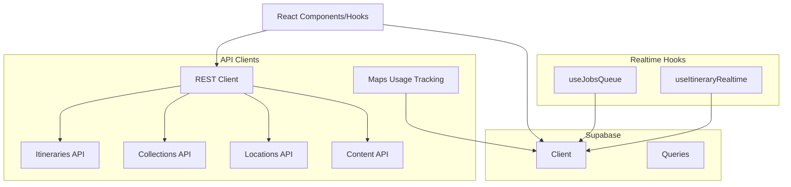
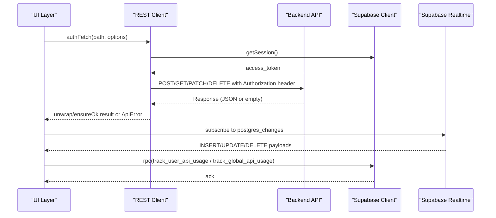
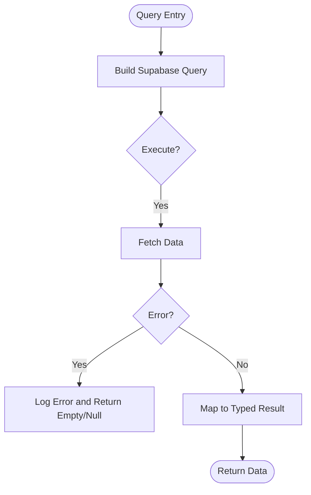
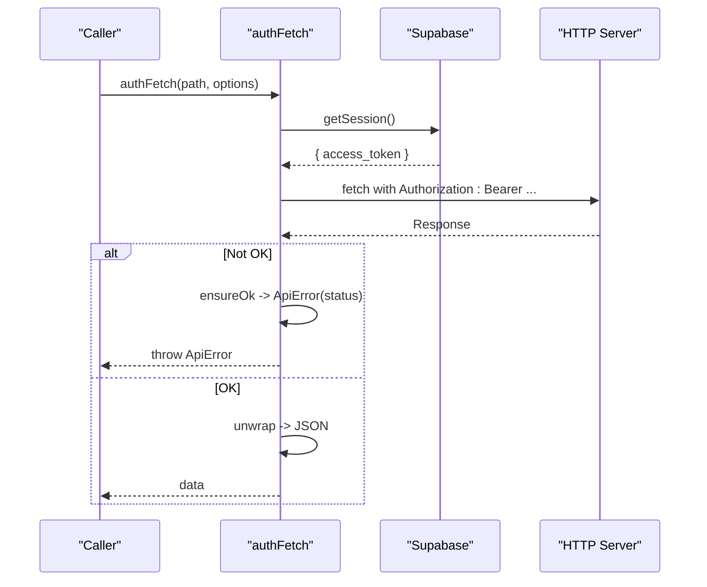
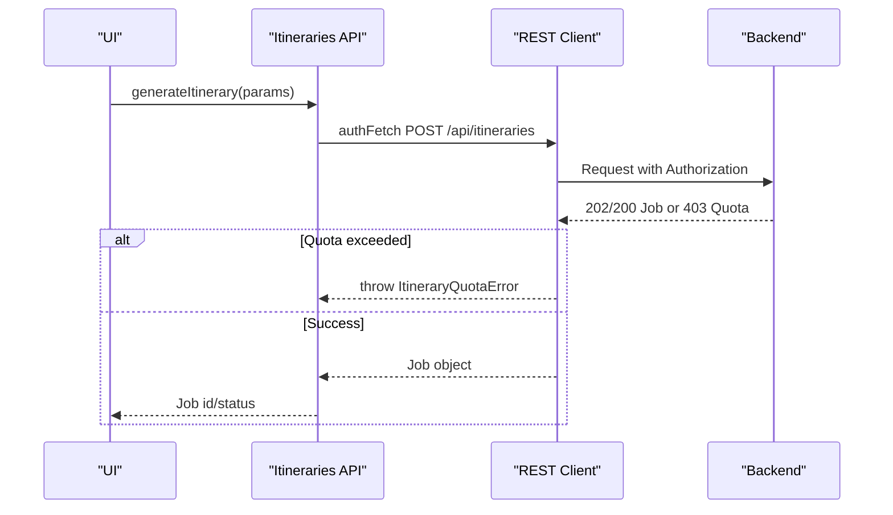
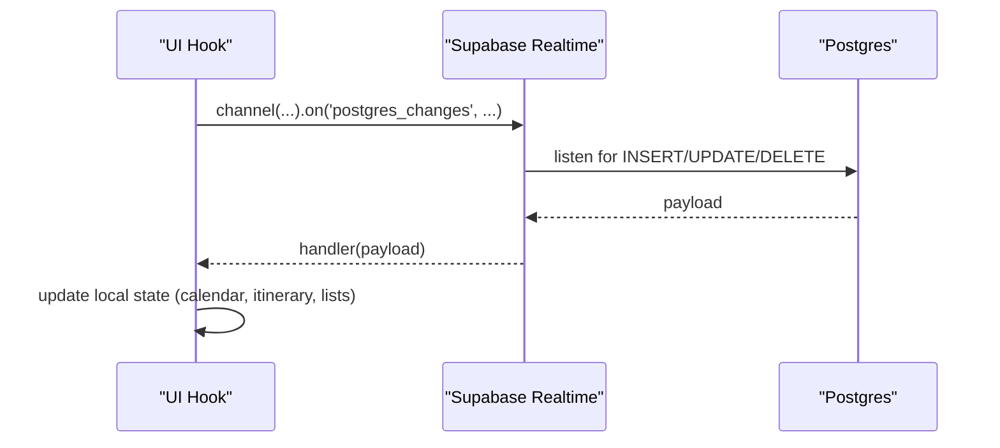
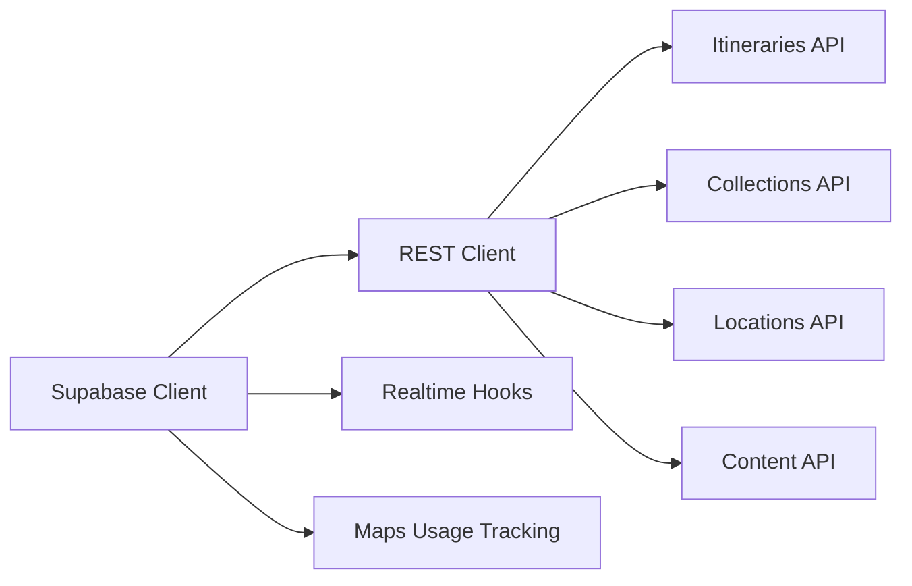

# API Integration

<cite>
**Referenced Files in This Document**
- [client.ts](file://src/lib/supabase/client.ts)
- [queries.ts](file://src/lib/supabase/queries.ts)
- [client.ts](file://src/lib/api/client.ts)
- [itineraries.ts](file://src/lib/api/itineraries.ts)
- [collections.ts](file://src/lib/api/collections.ts)
- [maps.ts](file://src/lib/api/maps.ts)
- [locations.ts](file://src/lib/api/locations.ts)
- [content.ts](file://src/lib/api/content.ts)
- [useJobsQueue.ts](file://src/hooks/useJobsQueue.ts)
- [useItineraryRealtime.ts](file://src/hooks/useItineraryRealtime.ts)
- [password-policy.ts](file://src/lib/auth/password-policy.ts)
</cite>

## Table of Contents
1. [Introduction](#introduction)
2. [Project Structure](#project-structure)
3. [Core Components](#core-components)
4. [Architecture Overview](#architecture-overview)
5. [Detailed Component Analysis](#detailed-component-analysis)
6. [Dependency Analysis](#dependency-analysis)
7. [Performance Considerations](#performance-considerations)
8. [Troubleshooting Guide](#troubleshooting-guide)
9. [Conclusion](#conclusion)
10. [Appendices](#appendices)

## Introduction
This document explains how Argo integrates with backend services and external APIs. It covers:
- Supabase client configuration and database query patterns
- Authentication flow and authorization headers for REST calls
- RESTful API client implementation, request/response handling, and error management
- Real-time subscriptions for live updates via Supabase Realtime
- External integrations including Google Maps and AI-driven content analysis
- Security best practices, rate limiting considerations, and versioning guidance

## Project Structure
Argo’s integration layer is organized into focused modules:
- Supabase client and queries under src/lib/supabase
- REST API clients per domain under src/lib/api (e.g., itineraries, collections, maps, locations)
- Real-time hooks under src/hooks that subscribe to Postgres changes
- Auth utilities under src/lib/auth

**Diagram sources**
- [client.ts:1-9](file://src/lib/supabase/client.ts#L1-L9)
- [queries.ts:1-150](file://src/lib/supabase/queries.ts#L1-L150)
- [client.ts:1-156](file://src/lib/api/client.ts#L1-L156)
- [itineraries.ts:1-532](file://src/lib/api/itineraries.ts#L1-L532)
- [collections.ts:1-214](file://src/lib/api/collections.ts#L1-L214)
- [maps.ts:1-119](file://src/lib/api/maps.ts#L1-L119)
- [locations.ts:1-47](file://src/lib/api/locations.ts#L1-L47)
- [content.ts:1-9](file://src/lib/api/content.ts#L1-L9)
- [useJobsQueue.ts:1-296](file://src/hooks/useJobsQueue.ts#L1-L296)
- [useItineraryRealtime.ts:1-534](file://src/hooks/useItineraryRealtime.ts#L1-L534)

**Section sources**
- [client.ts:1-9](file://src/lib/supabase/client.ts#L1-L9)
- [queries.ts:1-150](file://src/lib/supabase/queries.ts#L1-L150)
- [client.ts:1-156](file://src/lib/api/client.ts#L1-L156)
- [itineraries.ts:1-532](file://src/lib/api/itineraries.ts#L1-L532)
- [collections.ts:1-214](file://src/lib/api/collections.ts#L1-L214)
- [maps.ts:1-119](file://src/lib/api/maps.ts#L1-L119)
- [locations.ts:1-47](file://src/lib/api/locations.ts#L1-L47)
- [content.ts:1-9](file://src/lib/api/content.ts#L1-L9)
- [useJobsQueue.ts:1-296](file://src/hooks/useJobsQueue.ts#L1-L296)
- [useItineraryRealtime.ts:1-534](file://src/hooks/useItineraryRealtime.ts#L1-L534)

## Core Components
- Supabase client: Creates a browser client using environment variables for URL and anon key.
- Supabase queries: Typed helpers to fetch profiles, content details, and collection preview images; enforces scoping via joins and RLS.
- REST client: Centralized authFetch wraps fetch with Bearer token from Supabase session; unwrap/ensureOk standardize response parsing and error mapping.
- Domain APIs: Itineraries, Collections, Locations, Content, and Maps usage tracking expose typed endpoints and errors.
- Realtime hooks: Subscribe to Postgres changes for jobs queue and itinerary entities to keep UI in sync.

**Section sources**
- [client.ts:1-9](file://src/lib/supabase/client.ts#L1-L9)
- [queries.ts:1-150](file://src/lib/supabase/queries.ts#L1-L150)
- [client.ts:1-156](file://src/lib/api/client.ts#L1-L156)
- [itineraries.ts:1-532](file://src/lib/api/itineraries.ts#L1-L532)
- [collections.ts:1-214](file://src/lib/api/collections.ts#L1-L214)
- [locations.ts:1-47](file://src/lib/api/locations.ts#L1-L47)
- [content.ts:1-9](file://src/lib/api/content.ts#L1-L9)
- [maps.ts:1-119](file://src/lib/api/maps.ts#L1-L119)
- [useJobsQueue.ts:1-296](file://src/hooks/useJobsQueue.ts#L1-L296)
- [useItineraryRealtime.ts:1-534](file://src/hooks/useItineraryRealtime.ts#L1-L534)

## Architecture Overview
The system combines three communication channels:
- REST over HTTPS for authenticated operations against the backend API
- Supabase RPCs for server-side analytics and usage tracking
- Supabase Realtime for live updates on Postgres tables

**Diagram sources**
- [client.ts:48-107](file://src/lib/api/client.ts#L48-L107)
- [maps.ts:11-33](file://src/lib/api/maps.ts#L11-L33)
- [useJobsQueue.ts:167-260](file://src/hooks/useJobsQueue.ts#L167-L260)
- [useItineraryRealtime.ts:89-170](file://src/hooks/useItineraryRealtime.ts#L89-L170)

## Detailed Component Analysis

### Supabase Client Configuration
- Browser client is created with environment variables for URL and anon key.
- Used by both REST client (to obtain sessions) and realtime hooks (for subscriptions).

**Section sources**
- [client.ts:1-9](file://src/lib/supabase/client.ts#L1-L9)

### Database Query Patterns
- Profile retrieval and batch fetching use typed rows and safe error handling.
- Content detail uses a scoped join to enforce row-level security without passing user context from the client.
- Collection preview image aggregation groups photo URLs per collection efficiently.

**Diagram sources**
- [queries.ts:14-46](file://src/lib/supabase/queries.ts#L14-L46)
- [queries.ts:50-99](file://src/lib/supabase/queries.ts#L50-L99)
- [queries.ts:121-149](file://src/lib/supabase/queries.ts#L121-L149)

**Section sources**
- [queries.ts:1-150](file://src/lib/supabase/queries.ts#L1-L150)

### REST API Client: Requests, Responses, and Errors
- Authentication: Retrieves Supabase session access token and attaches it as a Bearer header. Unauthenticated requests throw a 401-typed error.
- Response handling: unwrap parses JSON; ensureOk throws ApiError with numeric status when not ok.
- Special cases: createJob maps 409 AlreadyAnalyzedError and 402 LinkQuotaError to typed exceptions for better UX.

**Diagram sources**
- [client.ts:48-107](file://src/lib/api/client.ts#L48-L107)
- [client.ts:109-155](file://src/lib/api/client.ts#L109-L155)

**Section sources**
- [client.ts:1-156](file://src/lib/api/client.ts#L1-L156)

### Itineraries API
- CRUD and planning endpoints: list, create blank, generate planning job, update, delete.
- Activity lifecycle: create, move, delete, set travel mode, optimize route, preview legs.
- Collaboration and sharing: public/invite tokens, collaborators, join by token, public view.
- Quota enforcement: typed ItineraryQuotaError surfaced for 403 quota exceeded responses.

**Diagram sources**
- [itineraries.ts:101-120](file://src/lib/api/itineraries.ts#L101-L120)
- [client.ts:48-107](file://src/lib/api/client.ts#L48-L107)

**Section sources**
- [itineraries.ts:1-532](file://src/lib/api/itineraries.ts#L1-L532)

### Collections API
- Operations: list with search, get by id, create, update, delete.
- Location management: add from Google Maps URL, remove location from collection.
- Sharing and collaboration: public/invite tokens, collaborators, join by token, public view.

**Section sources**
- [collections.ts:1-214](file://src/lib/api/collections.ts#L1-L214)

### Locations API
- Resolves Google Maps share links into persisted location records, reusing cached places or fetching Enterprise Place Details server-side.

**Section sources**
- [locations.ts:1-47](file://src/lib/api/locations.ts#L1-L47)

### Maps Usage Tracking
- Tracks map loads, place searches, Place Details, photos, and autocomplete via Supabase RPCs for billing and analytics.
- Failures are swallowed to avoid impacting UI.

**Section sources**
- [maps.ts:1-119](file://src/lib/api/maps.ts#L1-L119)

### Content API
- Delete content endpoint using authenticated fetch and ensureOk.

**Section sources**
- [content.ts:1-9](file://src/lib/api/content.ts#L1-L9)

### Real-Time Subscriptions
- Jobs Queue: subscribes to Postgres changes on jobs table, reconciles missed updates on reconnect/visibility change, emits completion/failure/rejection callbacks.
- Itinerary Realtime: subscribes to activities, days, itinerary metadata, collaborators, flights, and lodgings; hydrates activity locations asynchronously after inserts.

**Diagram sources**
- [useJobsQueue.ts:167-260](file://src/hooks/useJobsQueue.ts#L167-L260)
- [useItineraryRealtime.ts:89-170](file://src/hooks/useItineraryRealtime.ts#L89-L170)
- [useItineraryRealtime.ts:335-405](file://src/hooks/useItineraryRealtime.ts#L335-L405)

**Section sources**
- [useJobsQueue.ts:1-296](file://src/hooks/useJobsQueue.ts#L1-L296)
- [useItineraryRealtime.ts:1-534](file://src/hooks/useItineraryRealtime.ts#L1-L534)

### Authentication and Authorization
- Session-based: REST calls retrieve Supabase session access token and attach Authorization: Bearer.
- Password policy: client-side validation mirrors server policy for sign-up flows.

**Section sources**
- [client.ts:48-83](file://src/lib/api/client.ts#L48-L83)
- [password-policy.ts:1-41](file://src/lib/auth/password-policy.ts#L1-L41)

### External API Integrations
- Google Maps:
  - Resolve share links to persistent locations via server-side enrichment.
  - Track usage metrics for search, Place Details, photos, and autocomplete.
  - Map components integrate with Google Maps JS SDK through an API provider wrapper.
- AI content analysis:
  - Create analysis jobs via REST; handle already-analyzed and quota errors with typed exceptions.
  - Poll or subscribe to job progress via Realtime or polling strategies.

**Section sources**
- [locations.ts:1-47](file://src/lib/api/locations.ts#L1-L47)
- [maps.ts:1-119](file://src/lib/api/maps.ts#L1-L119)
- [itineraries.ts:101-120](file://src/lib/api/itineraries.ts#L101-L120)
- [client.ts:109-155](file://src/lib/api/client.ts#L109-L155)

## Dependency Analysis
- The REST client depends on Supabase client for session retrieval.
- Domain APIs depend on the REST client for authenticated requests.
- Realtime hooks depend on Supabase client for channels and subscriptions.
- Maps usage tracking depends on Supabase RPCs for analytics.

**Diagram sources**
- [client.ts:1-9](file://src/lib/supabase/client.ts#L1-L9)
- [client.ts:1-156](file://src/lib/api/client.ts#L1-L156)
- [itineraries.ts:1-532](file://src/lib/api/itineraries.ts#L1-L532)
- [collections.ts:1-214](file://src/lib/api/collections.ts#L1-L214)
- [locations.ts:1-47](file://src/lib/api/locations.ts#L1-L47)
- [content.ts:1-9](file://src/lib/api/content.ts#L1-L9)
- [maps.ts:1-119](file://src/lib/api/maps.ts#L1-L119)
- [useJobsQueue.ts:1-296](file://src/hooks/useJobsQueue.ts#L1-L296)
- [useItineraryRealtime.ts:1-534](file://src/hooks/useItineraryRealtime.ts#L1-L534)

**Section sources**
- [client.ts:1-156](file://src/lib/api/client.ts#L1-L156)
- [useJobsQueue.ts:1-296](file://src/hooks/useJobsQueue.ts#L1-L296)
- [useItineraryRealtime.ts:1-534](file://src/hooks/useItineraryRealtime.ts#L1-L534)

## Performance Considerations
- Prefer server-side enrichment (e.g., resolving Google Maps links) to minimize client-side expensive calls.
- Use Supabase Realtime to avoid polling where possible; fall back to periodic refetch only when necessary.
- Aggregate queries (e.g., collection preview images) to reduce round-trips.
- Ensure realtime handlers are idempotent and deduplicate incoming events to prevent redundant UI updates.

[No sources needed since this section provides general guidance]

## Troubleshooting Guide
- Network failures: authFetch catches transport errors; callers should handle ApiError with status 0.
- Quota limits: catch ItineraryQuotaError and LinkQuotaError to prompt upgrades.
- Realtime connectivity: hooks detect CHANNEL_ERROR/TIMED_OUT and reconcile on reconnect or visibility change.
- Analytics tracking: failures in usage tracking are intentionally ignored to protect UI stability.

**Section sources**
- [client.ts:78-107](file://src/lib/api/client.ts#L78-L107)
- [itineraries.ts:101-120](file://src/lib/api/itineraries.ts#L101-L120)
- [useJobsQueue.ts:250-260](file://src/hooks/useJobsQueue.ts#L250-L260)
- [maps.ts:30-33](file://src/lib/api/maps.ts#L30-L33)

## Conclusion
Argo’s integration layer centralizes authentication, REST interactions, and real-time updates while keeping domain logic modular. Typed errors and standardized response handling improve reliability and developer experience. Realtime subscriptions enable collaborative editing and live job progress, and external integrations are tracked and optimized for cost and performance.

[No sources needed since this section summarizes without analyzing specific files]

## Appendices

### Implementing a New API Endpoint
- Add a function in the appropriate domain module (e.g., src/lib/api/<domain>.ts) using authFetch and unwrap/ensureOk.
- Define TypeScript types for request and response payloads.
- Handle special status codes with typed errors if needed.
- Wire up UI to call the new function and display results or errors.

**Section sources**
- [client.ts:59-107](file://src/lib/api/client.ts#L59-L107)
- [itineraries.ts:122-131](file://src/lib/api/itineraries.ts#L122-L131)

### Handling Different Response Types
- For JSON responses, use unwrap<T>(res) to parse and type the body.
- For no-body responses (e.g., 204), use ensureOk(res) to validate success without parsing.

**Section sources**
- [client.ts:91-107](file://src/lib/api/client.ts#L91-L107)

### Managing API Versioning
- Prefix endpoints with a version segment (e.g., /api/v1/...) in the backend and adjust client paths accordingly.
- Maintain backward compatibility during transitions and deprecate old versions gradually.
- Update environment configuration if base URLs differ across versions.

[No sources needed since this section provides general guidance]