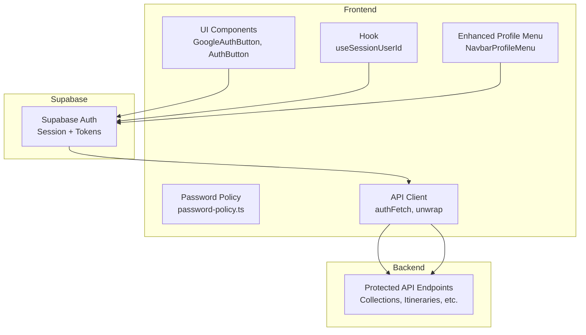
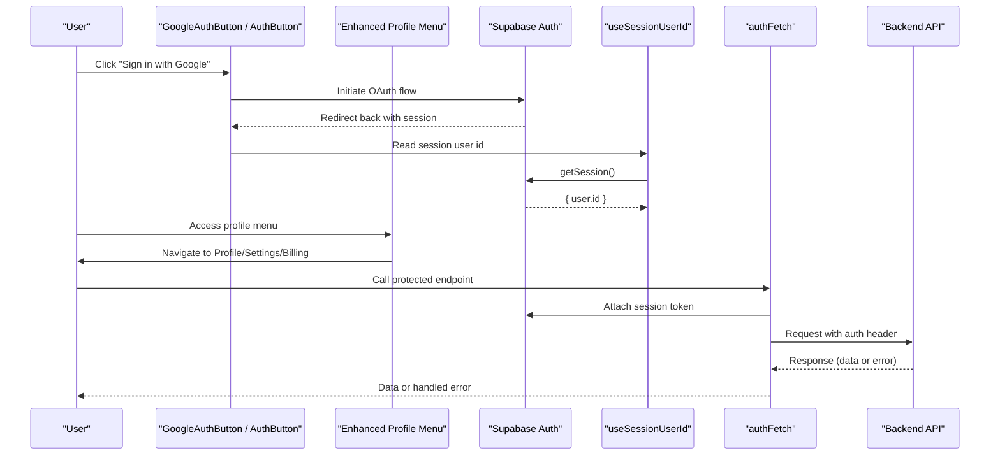
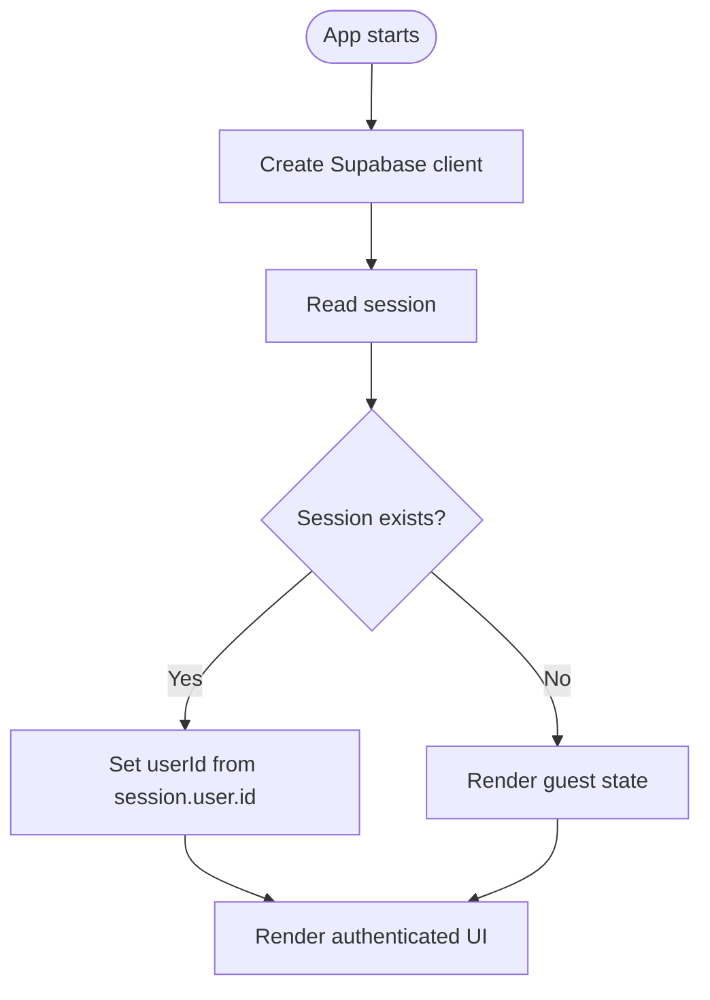
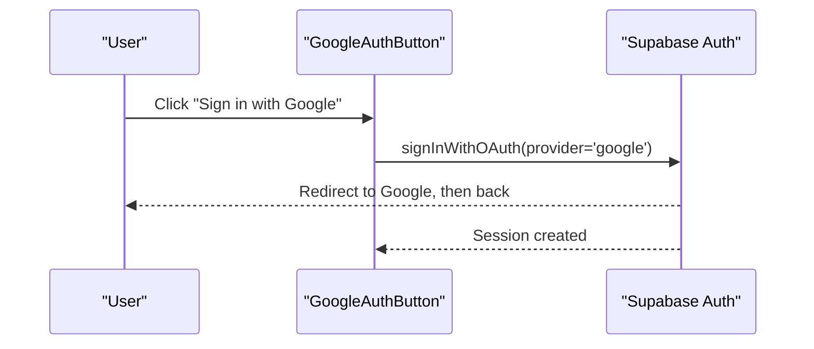
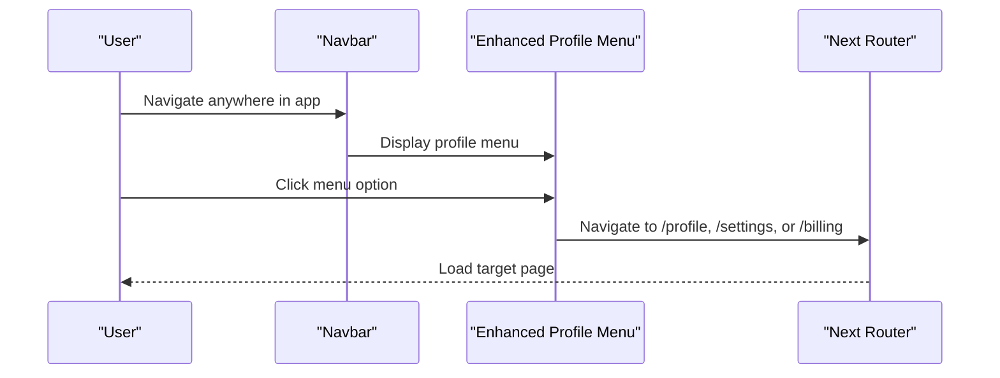
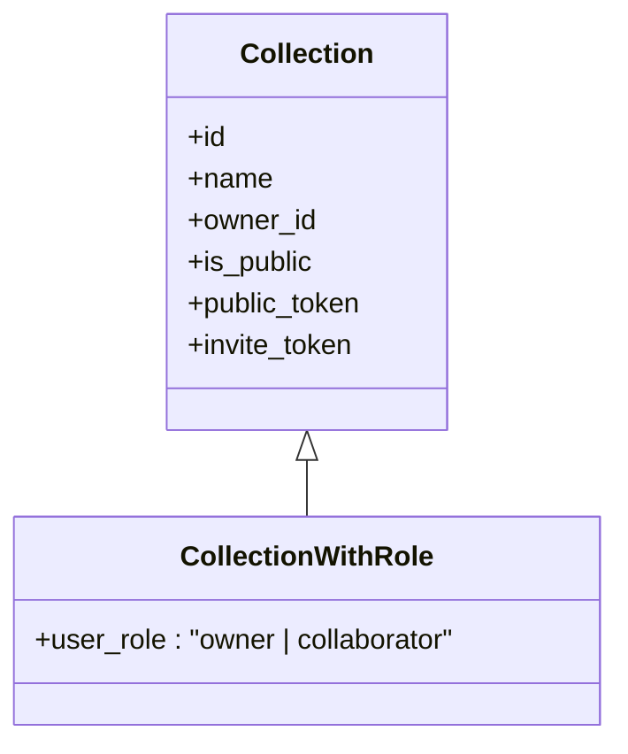
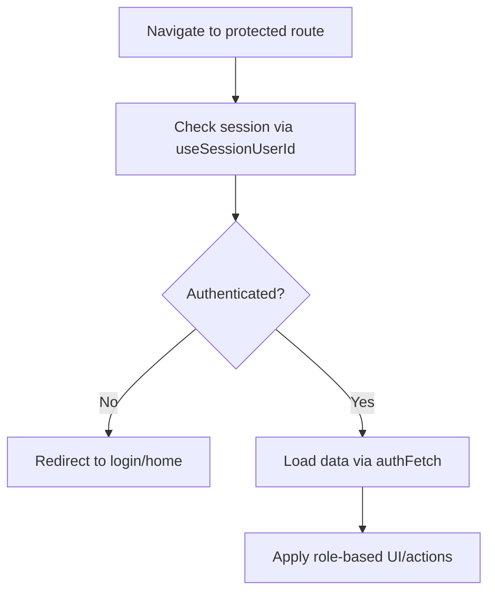
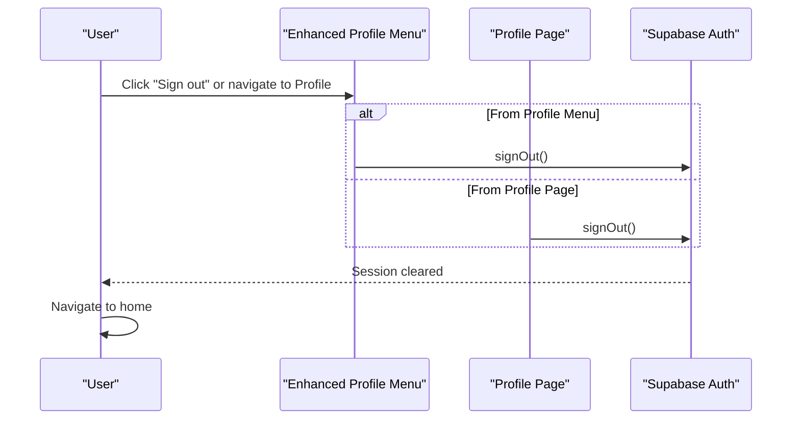
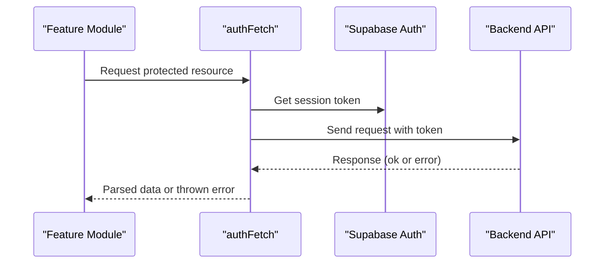
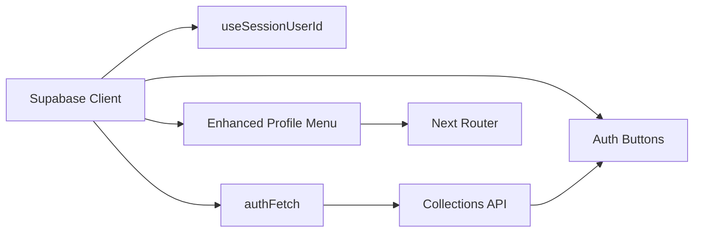

# Authentication & Authorization

<cite>
**Referenced Files in This Document**
- [client.ts](file://src/lib/supabase/client.ts)
- [useSessionUserId.ts](file://src/hooks/useSessionUserId.ts)
- [GoogleAuthButton.tsx](file://src/components/ui/auth/GoogleAuthButton.tsx)
- [AuthButton.tsx](file://src/components/ui/auth/AuthButton.tsx)
- [password-policy.ts](file://src/lib/auth/password-policy.ts)
- [NavbarProfileMenu.tsx](file://src/components/ui/navbar/NavbarProfileMenu.tsx)
- [Navbar.tsx](file://src/components/ui/navbar/Navbar.tsx)
- [profile/page.tsx](file://src/app/profile/page.tsx)
- [collections.ts](file://src/lib/api/collections.ts)
- [client.ts](file://src/lib/api/client.ts)
</cite>

## Update Summary
**Changes Made**
- Enhanced profile menu integration documentation reflecting new multi-option navigation
- Updated navigation flow diagrams to show comprehensive profile access points
- Added detailed coverage of the enhanced profile menu functionality
- Updated user journey examples to reflect improved navigation patterns

## Table of Contents
1. Introduction
2. Project Structure
3. Core Components
4. Architecture Overview
5. Detailed Component Analysis
6. Dependency Analysis
7. Performance Considerations
8. Troubleshooting Guide
9. Conclusion

## Introduction
This document explains Argo's authentication and authorization system with a focus on session management, user state handling, and the frontend-to-backend authentication flow. It covers Google OAuth integration via Supabase, custom authentication providers, role-based access control patterns for collections, protected route implementation, permission checks, and user profile management. The system features an enhanced navigation integration that provides seamless access to profile management from anywhere in the application through a comprehensive profile menu. It also includes guidance for making authenticated API calls, handling errors, managing sessions across navigation, security considerations, token refresh strategies, and best practices for protecting sensitive routes and data.

## Project Structure
Authentication-related code is organized into:
- Supabase client initialization for browser sessions
- Hooks to read current session user identity
- UI components for sign-in/sign-out flows (including Google OAuth button)
- Password policy validation helpers
- Enhanced profile menu with integrated navigation
- API client that attaches auth tokens and centralizes error handling
- Feature modules (e.g., collections) that enforce roles and permissions

**Diagram sources**
- [client.ts:1-9](file://src/lib/supabase/client.ts#L1-L9)
- [useSessionUserId.ts:1-20](file://src/hooks/useSessionUserId.ts#L1-L20)
- [GoogleAuthButton.tsx:1-61](file://src/components/ui/auth/GoogleAuthButton.tsx#L1-L61)
- [AuthButton.tsx:1-41](file://src/components/ui/auth/AuthButton.tsx#L1-L41)
- [password-policy.ts:1-41](file://src/lib/auth/password-policy.ts#L1-L41)
- [NavbarProfileMenu.tsx:1-78](file://src/components/ui/navbar/NavbarProfileMenu.tsx#L1-L78)
- [client.ts:59-113](file://src/lib/api/client.ts#L59-L113)

**Section sources**
- [client.ts:1-9](file://src/lib/supabase/client.ts#L1-L9)
- [useSessionUserId.ts:1-20](file://src/hooks/useSessionUserId.ts#L1-L20)
- [GoogleAuthButton.tsx:1-61](file://src/components/ui/auth/GoogleAuthButton.tsx#L1-L61)
- [AuthButton.tsx:1-41](file://src/components/ui/auth/AuthButton.tsx#L1-L41)
- [password-policy.ts:1-41](file://src/lib/auth/password-policy.ts#L1-L41)
- [NavbarProfileMenu.tsx:1-78](file://src/components/ui/navbar/NavbarProfileMenu.tsx#L1-L78)
- [client.ts:59-113](file://src/lib/api/client.ts#L59-L113)

## Core Components
- Supabase Browser Client: Creates a browser-scoped client using environment variables for URL and anon key. Used throughout the app to manage sessions and tokens.
- Session User Hook: Reads the current session and resolves the user id; returns null until the session loads or when signed out.
- Auth UI Components:
  - GoogleAuthButton: A styled button component for initiating Google OAuth flows.
  - AuthButton: A generic auth action button with loading states.
- Password Policy: Client-side validation mirroring server-side rules to guide users before submission.
- **Enhanced Profile Menu**: Comprehensive navigation menu providing access to Profile, Settings, Plan & billing, and Sign out functionality from anywhere in the application.
- API Client: Centralized fetch wrapper that attaches auth context and handles non-OK responses consistently.

**Updated** Enhanced profile menu now provides unified access to all user-related features through a single, persistent navigation point.

**Section sources**
- [client.ts:1-9](file://src/lib/supabase/client.ts#L1-L9)
- [useSessionUserId.ts:1-20](file://src/hooks/useSessionUserId.ts#L1-L20)
- [GoogleAuthButton.tsx:1-61](file://src/components/ui/auth/GoogleAuthButton.tsx#L1-L61)
- [AuthButton.tsx:1-41](file://src/components/ui/auth/AuthButton.tsx#L1-L41)
- [password-policy.ts:1-41](file://src/lib/auth/password-policy.ts#L1-L41)
- [NavbarProfileMenu.tsx:1-78](file://src/components/ui/navbar/NavbarProfileMenu.tsx#L1-L78)
- [client.ts:59-113](file://src/lib/api/client.ts#L59-L113)

## Architecture Overview
The authentication architecture uses Supabase Auth for session management and token handling. The frontend obtains a session via Supabase, reads the user id through a hook, and uses an API client to attach credentials to backend requests. Role-based access control is enforced on the backend and reflected in responses (e.g., collection roles). The enhanced profile menu provides seamless navigation to all user-related features.

**Diagram sources**
- [GoogleAuthButton.tsx:1-61](file://src/components/ui/auth/GoogleAuthButton.tsx#L1-L61)
- [useSessionUserId.ts:1-20](file://src/hooks/useSessionUserId.ts#L1-L20)
- [NavbarProfileMenu.tsx:1-78](file://src/components/ui/navbar/NavbarProfileMenu.tsx#L1-L78)
- [client.ts:59-113](file://src/lib/api/client.ts#L59-L113)

## Detailed Component Analysis

### Supabase Client and Session Management
- Purpose: Provide a consistent browser client for Supabase Auth and Realtime.
- Behavior: Initializes with environment variables; used by hooks and components to get session and user info.
- Session lifecycle: Sessions are managed by Supabase; the app reads the current session to determine user identity and to attach tokens to API calls.

**Diagram sources**
- [client.ts:1-9](file://src/lib/supabase/client.ts#L1-L9)
- [useSessionUserId.ts:1-20](file://src/hooks/useSessionUserId.ts#L1-L20)

**Section sources**
- [client.ts:1-9](file://src/lib/supabase/client.ts#L1-L9)
- [useSessionUserId.ts:1-20](file://src/hooks/useSessionUserId.ts#L1-L20)

### Google OAuth Integration
- UI: GoogleAuthButton provides a consistent entry point for Google sign-in.
- Flow: On click, the app initiates Supabase OAuth; after redirect, the session is established and the user id becomes available via the session hook.
- Notes: Ensure environment configuration for Google provider is set in Supabase.

**Diagram sources**
- [GoogleAuthButton.tsx:1-61](file://src/components/ui/auth/GoogleAuthButton.tsx#L1-L61)

**Section sources**
- [GoogleAuthButton.tsx:1-61](file://src/components/ui/auth/GoogleAuthButton.tsx#L1-L61)

### Custom Authentication Providers
- Pattern: Use Supabase Auth providers to integrate additional identity providers.
- Implementation: Add provider configuration in Supabase and trigger sign-in from UI components similar to GoogleAuthButton.
- Validation: For email/password flows, use password-policy.ts to mirror server-side constraints and improve UX.

**Section sources**
- [password-policy.ts:1-41](file://src/lib/auth/password-policy.ts#L1-L41)

### Enhanced Profile Menu Navigation
- **Comprehensive Access Points**: The enhanced profile menu provides unified access to Profile, Settings, Plan & billing, and Sign out functionality.
- **Persistent Navigation**: Integrated into the main Navbar component, ensuring users can access profile features from any page.
- **Seamless Integration**: Uses Next.js router for smooth navigation between different user management sections.
- **Consistent UX**: Maintains consistent styling and behavior across all navigation options.

**Diagram sources**
- [Navbar.tsx:368-414](file://src/components/ui/navbar/Navbar.tsx#L368-L414)
- [NavbarProfileMenu.tsx:30-72](file://src/components/ui/navbar/NavbarProfileMenu.tsx#L30-L72)

**Section sources**
- [NavbarProfileMenu.tsx:1-78](file://src/components/ui/navbar/NavbarProfileMenu.tsx#L1-L78)
- [Navbar.tsx:368-414](file://src/components/ui/navbar/Navbar.tsx#L368-L414)

### Role-Based Access Control (RBAC) Patterns
- Collections: Responses include user_role indicating ownership or collaboration level.
- Protected endpoints: Backend enforces permissions based on roles; clients should handle role-dependent UI and actions accordingly.
- Token-based sharing: Public and invite tokens allow controlled access without full authentication.

**Diagram sources**
- [collections.ts:1-214](file://src/lib/api/collections.ts#L1-L214)

**Section sources**
- [collections.ts:1-214](file://src/lib/api/collections.ts#L1-L214)

### Protected Route Implementation and Permission Checks
- Frontend: Use the session user id hook to gate UI features and render protected content only when authenticated.
- Backend: All protected API calls go through authFetch, which ensures requests carry valid tokens; unauthorized responses are handled centrally.
- Example flows:
  - Listing collections requires authentication; roles determine visibility and actions.
  - Generating public or invite tokens requires appropriate permissions.

**Diagram sources**
- [useSessionUserId.ts:1-20](file://src/hooks/useSessionUserId.ts#L1-L20)
- [client.ts:59-113](file://src/lib/api/client.ts#L59-L113)
- [collections.ts:1-214](file://src/lib/api/collections.ts#L1-L214)

**Section sources**
- [useSessionUserId.ts:1-20](file://src/hooks/useSessionUserId.ts#L1-L20)
- [client.ts:59-113](file://src/lib/api/client.ts#L59-L113)
- [collections.ts:1-214](file://src/lib/api/collections.ts#L1-L214)

### User Profile Management and Sign-Out
- **Enhanced Profile Page**: Comprehensive profile management interface with account details, settings access, and plan/billing information.
- **Sign-out Integration**: Multiple sign-out entry points including profile menu and dedicated profile page.
- **Session Management**: Consistent sign-out behavior across all entry points, clearing local session state and navigating to home.
- **User Context**: Profile page displays user information fetched through the profile query hook.

**Diagram sources**
- [NavbarProfileMenu.tsx:24-28](file://src/components/ui/navbar/NavbarProfileMenu.tsx#L24-L28)
- [profile/page.tsx:36-41](file://src/app/profile/page.tsx#L36-L41)

**Section sources**
- [NavbarProfileMenu.tsx:1-78](file://src/components/ui/navbar/NavbarProfileMenu.tsx#L1-L78)
- [profile/page.tsx:1-190](file://src/app/profile/page.tsx#L1-L190)

### Authenticated API Calls and Error Handling
- Centralized client: authFetch wraps fetch to attach session tokens and normalize errors.
- Unwrap utility: Ensures non-OK responses are handled consistently, surfacing meaningful messages.
- Usage: Feature modules call authFetch for all protected endpoints; errors are caught and presented to users.

**Diagram sources**
- [client.ts:59-113](file://src/lib/api/client.ts#L59-L113)

**Section sources**
- [client.ts:59-113](file://src/lib/api/client.ts#L59-L113)

## Dependency Analysis
- Supabase client is consumed by hooks and UI components to manage sessions.
- API client depends on Supabase for tokens and is used by feature modules to call protected endpoints.
- Enhanced profile menu integrates with both Supabase for authentication and Next.js router for navigation.
- Collections module demonstrates RBAC via user_role in responses and token-based sharing mechanisms.

**Diagram sources**
- [client.ts:1-9](file://src/lib/supabase/client.ts#L1-L9)
- [useSessionUserId.ts:1-20](file://src/hooks/useSessionUserId.ts#L1-L20)
- [NavbarProfileMenu.tsx:1-78](file://src/components/ui/navbar/NavbarProfileMenu.tsx#L1-L78)
- [client.ts:59-113](file://src/lib/api/client.ts#L59-L113)
- [collections.ts:1-214](file://src/lib/api/collections.ts#L1-L214)

**Section sources**
- [client.ts:1-9](file://src/lib/supabase/client.ts#L1-L9)
- [useSessionUserId.ts:1-20](file://src/hooks/useSessionUserId.ts#L1-L20)
- [NavbarProfileMenu.tsx:1-78](file://src/components/ui/navbar/NavbarProfileMenu.tsx#L1-L78)
- [client.ts:59-113](file://src/lib/api/client.ts#L59-L113)
- [collections.ts:1-214](file://src/lib/api/collections.ts#L1-L214)

## Performance Considerations
- Minimize redundant session reads: Cache user id at the component or page level where possible.
- Batch API calls: Group related requests to reduce network overhead.
- Debounce heavy operations: Especially during OAuth redirects and token refresh scenarios.
- Prefer server-side enforcement: Keep sensitive logic on the backend; use frontend only for UX gating.
- **Optimized Navigation**: Enhanced profile menu uses efficient routing to minimize re-renders and improve user experience.

## Troubleshooting Guide
- Session not loading: Verify Supabase environment variables and ensure createClient is initialized correctly.
- Unauthorized errors: Confirm that authFetch is used for protected endpoints and that the session is active.
- Sign-out issues: Ensure signOut is called and navigation occurs to clear UI state.
- Password validation mismatches: Align client-side password-policy.ts with server-side rules to avoid confusing errors.
- **Profile menu navigation issues**: Verify Next.js router is properly configured and that profile routes exist.
- **Enhanced menu not displaying**: Check that NavbarProfileMenu is properly imported and rendered in the Navbar component.

**Section sources**
- [client.ts:1-9](file://src/lib/supabase/client.ts#L1-L9)
- [client.ts:59-113](file://src/lib/api/client.ts#L59-L113)
- [password-policy.ts:1-41](file://src/lib/auth/password-policy.ts#L1-L41)
- [NavbarProfileMenu.tsx:1-78](file://src/components/ui/navbar/NavbarProfileMenu.tsx#L1-L78)
- [Navbar.tsx:368-414](file://src/components/ui/navbar/Navbar.tsx#L368-L414)

## Conclusion
Argo's authentication and authorization system leverages Supabase for robust session management and token handling, with a clean separation between UI, hooks, and API layers. The enhanced profile menu integration provides seamless access to all user-related features from anywhere in the application, improving user experience and accessibility. Role-based access control is enforced on the backend and surfaced to the frontend via response metadata, enabling fine-grained UI behavior. By centralizing auth-fetch logic and using consistent error handling, the application maintains secure, predictable interactions across pages and features. The enhanced navigation pattern ensures users can easily access their profile, settings, and billing information while maintaining the security and integrity of the authentication system. Follow the recommended practices for protected routes, token usage, and error handling to keep sensitive data and routes secure.