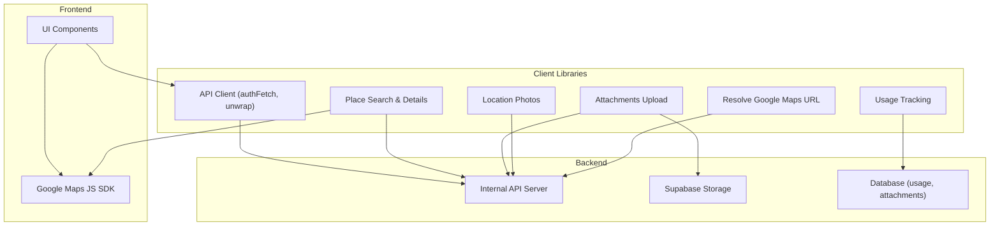
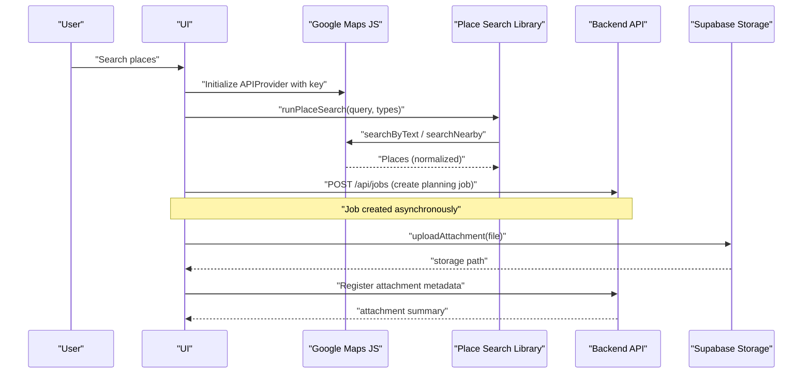
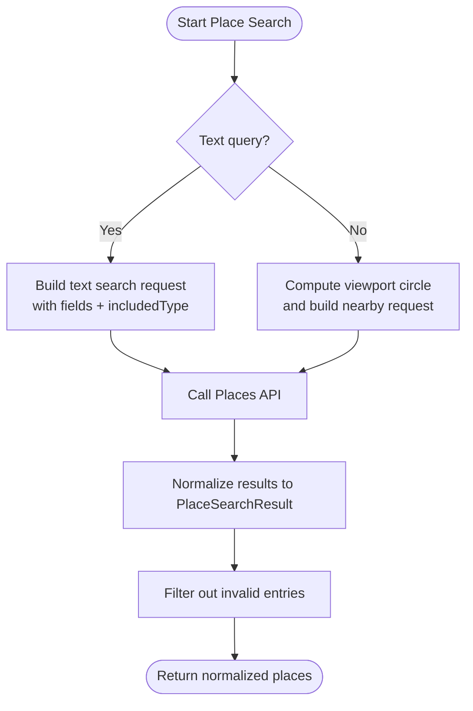
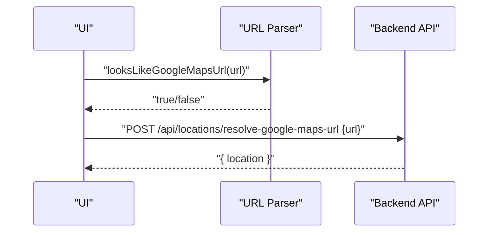
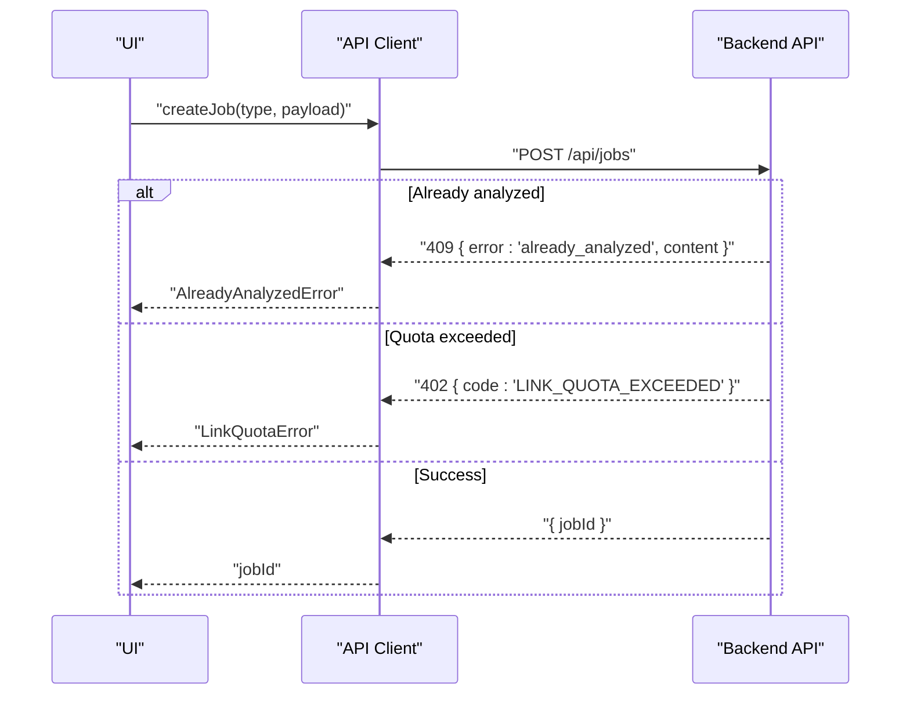
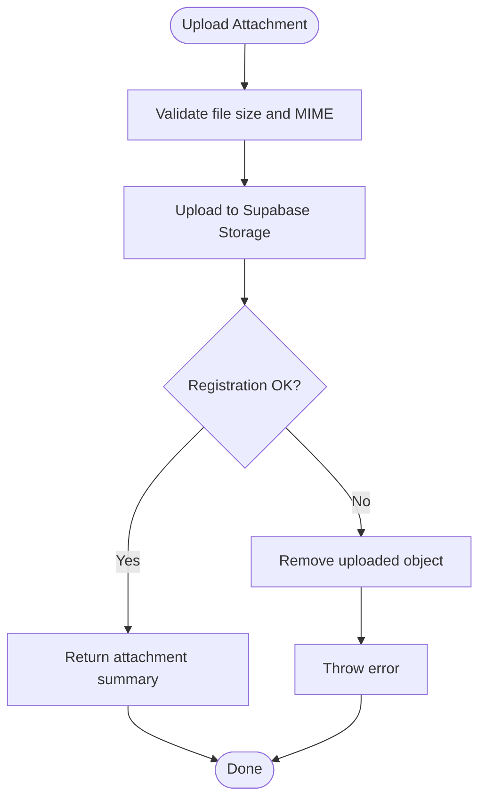
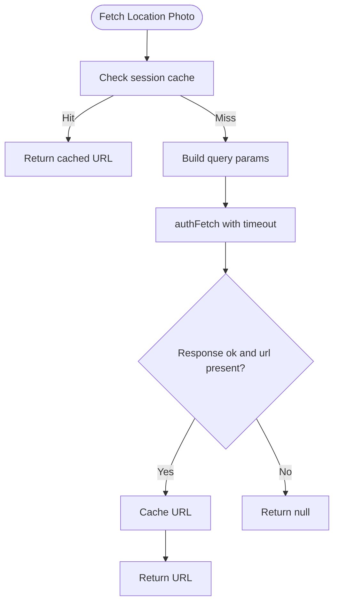
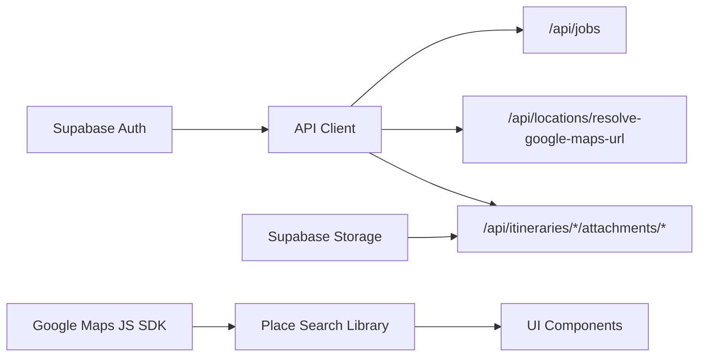

# External API Integrations

<cite>
**Referenced Files in This Document**
- [maps.ts](file://src/lib/api/maps.ts)
- [place-search.ts](file://src/lib/maps/place-search.ts)
- [google-maps-url.ts](file://src/lib/maps/google-maps-url.ts)
- [locations.ts](file://src/lib/api/locations.ts)
- [client.ts](file://src/lib/api/client.ts)
- [photos.ts](file://src/lib/api/photos.ts)
- [attachments.ts](file://src/lib/api/attachments.ts)
- [itineraries.ts](file://src/lib/api/itineraries.ts)
- [GoogleMapDetail.tsx](file://src/components/ui/map/GoogleMapDetail.tsx)
</cite>

## Table of Contents
1. Introduction
2. Project Structure
3. Core Components
4. Architecture Overview
5. Detailed Component Analysis
6. Dependency Analysis
7. Performance Considerations
8. Troubleshooting Guide
9. Conclusion

## Introduction
This document explains how Argo integrates with external services to power location search, map rendering, geocoding, AI-driven itinerary generation, and media storage. It focuses on:
- Google Maps API integration for place search, details, photos, and autocomplete usage tracking
- AI content analysis service integration for extracting travel information from URLs and generating itineraries via jobs
- File storage API for uploading images/media and retrieving signed URLs
- Rate limiting strategies, error handling, and fallbacks when external services are unavailable
- Guidance for adding new integrations, managing API keys securely, and optimizing performance through caching and batching

## Project Structure
External integrations are implemented as thin client libraries under src/lib/api and src/lib/maps, with UI components invoking them where needed. Key areas:
- Google Maps integration: place search, details, URL parsing, and usage tracking
- AI planning pipeline: job creation and status handling for itinerary generation
- Media storage: Supabase Storage uploads and backend attachment registration
- Photos: destination image retrieval with session-level caching

**Diagram sources**
- [client.ts:59-107](file://src/lib/api/client.ts#L59-L107)
- [place-search.ts:391-466](file://src/lib/maps/place-search.ts#L391-L466)
- [maps.ts:11-118](file://src/lib/api/maps.ts#L11-L118)
- [attachments.ts:34-187](file://src/lib/api/attachments.ts#L34-L187)
- [photos.ts:35-64](file://src/lib/api/photos.ts#L35-L64)
- [locations.ts:39-47](file://src/lib/api/locations.ts#L39-L47)

**Section sources**
- [client.ts:1-156](file://src/lib/api/client.ts#L1-L156)
- [place-search.ts:1-467](file://src/lib/maps/place-search.ts#L1-L467)
- [maps.ts:1-119](file://src/lib/api/maps.ts#L1-L119)
- [attachments.ts:1-188](file://src/lib/api/attachments.ts#L1-L188)
- [photos.ts:1-65](file://src/lib/api/photos.ts#L1-L65)
- [locations.ts:1-47](file://src/lib/api/locations.ts#L1-L47)

## Core Components
- Google Maps usage tracking: records map loads, place searches, place details, photos, and autocomplete calls per user and globally by month.
- Place search and details: runs text or nearby searches, normalizes results, and optionally fetches enterprise details for enriched data.
- Google Maps URL resolution: parses share links and resolves to persisted locations via the backend.
- AI itinerary generation: creates async jobs to analyze content or generate plans; handles quota and already-analyzed responses.
- File storage: uploads files to Supabase Storage, registers attachments via the backend, and retrieves signed URLs.
- Destination photos: fetches curated images with a session cache and timeouts.

**Section sources**
- [maps.ts:11-118](file://src/lib/api/maps.ts#L11-L118)
- [place-search.ts:145-466](file://src/lib/maps/place-search.ts#L145-L466)
- [locations.ts:39-47](file://src/lib/api/locations.ts#L39-L47)
- [client.ts:109-155](file://src/lib/api/client.ts#L109-L155)
- [attachments.ts:34-187](file://src/lib/api/attachments.ts#L34-L187)
- [photos.ts:35-64](file://src/lib/api/photos.ts#L35-L64)

## Architecture Overview
The system separates concerns between UI, client libraries, and backend services:
- UI invokes Google Maps SDK directly for interactive maps and uses client libraries for authenticated API calls.
- The API client centralizes authentication, error normalization, and job helpers.
- Backend provides endpoints for resolving Google Maps URLs, creating planning jobs, storing attachments, and serving photos.

**Diagram sources**
- [GoogleMapDetail.tsx:465-489](file://src/components/ui/map/GoogleMapDetail.tsx#L465-L489)
- [place-search.ts:391-466](file://src/lib/maps/place-search.ts#L391-L466)
- [client.ts:109-155](file://src/lib/api/client.ts#L109-L155)
- [attachments.ts:34-187](file://src/lib/api/attachments.ts#L34-L187)

## Detailed Component Analysis

### Google Maps Integration (Search, Details, Autocomplete, Photos)
- Search modes:
  - Text search with optional type filter and viewport bias
  - Nearby search within a computed circle derived from the map bounds
- Field masks:
  - Base fields plus Enterprise extras requested to maximize value per request
- Normalization:
  - Converts raw Place objects into a consistent shape including ratings, opening hours, price level, website, phone, and photo metadata
- Enrichment:
  - If enterprise details are missing, fetches Place Details for a single place
- Usage tracking:
  - Tracks map loads, place searches, place details, photos, and autocomplete calls per user and globally

**Diagram sources**
- [place-search.ts:154-174](file://src/lib/maps/place-search.ts#L154-L174)
- [place-search.ts:391-466](file://src/lib/maps/place-search.ts#L391-L466)

**Section sources**
- [place-search.ts:1-467](file://src/lib/maps/place-search.ts#L1-L467)
- [maps.ts:11-118](file://src/lib/api/maps.ts#L11-L118)

### Google Maps URL Resolution
- Recognizes Google Maps share URLs and delegates resolution to the backend
- Backend expands the link to a place_id, reuses cached rows, or fetches enterprise details and persists a new row
- Returns a full location object suitable for rendering without additional client-side calls

**Diagram sources**
- [google-maps-url.ts:1-12](file://src/lib/maps/google-maps-url.ts#L1-L12)
- [locations.ts:39-47](file://src/lib/api/locations.ts#L39-L47)

**Section sources**
- [google-maps-url.ts:1-12](file://src/lib/maps/google-maps-url.ts#L1-L12)
- [locations.ts:1-47](file://src/lib/api/locations.ts#L1-L47)

### AI Content Analysis and Itinerary Generation
- Job creation:
  - Creates asynchronous jobs for itinerary planning or content extraction
  - Handles special cases: already analyzed (409) and quota exceeded (402)
- UI flow:
  - Shows loading screen while job is in progress
  - On completion, surfaces a “View” action to open the generated itinerary

**Diagram sources**
- [client.ts:109-155](file://src/lib/api/client.ts#L109-L155)

**Section sources**
- [client.ts:109-155](file://src/lib/api/client.ts#L109-L155)
- [itineraries.ts:411-439](file://src/lib/api/itineraries.ts#L411-L439)

### File Storage API (Uploads, Registration, Signed URLs)
- Upload process:
  - Validates file size and MIME type
  - Uploads to Supabase Storage with a deterministic path structure
  - Registers attachment metadata via the backend
  - Rolls back storage if registration fails
- Retrieval:
  - Fetches short-lived signed URLs for private assets
- Deletion:
  - Deletes attachment row and storage object; idempotent on 404

**Diagram sources**
- [attachments.ts:34-187](file://src/lib/api/attachments.ts#L34-L187)

**Section sources**
- [attachments.ts:1-188](file://src/lib/api/attachments.ts#L1-L188)

### Destination Photos Service
- Purpose:
  - Provides a curated destination image for cards and detail views
- Caching:
  - Uses a session-scoped Map to avoid duplicate requests during grid renders
- Resilience:
  - Times out after a short duration and returns null on failure
- Fallback:
  - UI can fall back to gradients or placeholders when no photo is available

**Diagram sources**
- [photos.ts:35-64](file://src/lib/api/photos.ts#L35-L64)

**Section sources**
- [photos.ts:1-65](file://src/lib/api/photos.ts#L1-L65)

## Dependency Analysis
- Authentication:
  - All authenticated API calls use a centralized client that injects Bearer tokens from Supabase sessions
- Google Maps:
  - UI initializes the Maps SDK via an API provider component
  - Place search library depends on the Maps JS SDK for search and details
- Backend APIs:
  - Jobs endpoint orchestrates AI processing
  - Locations endpoint resolves Google Maps URLs
  - Attachments endpoints manage file metadata and signed URLs
- Storage:
  - Direct Supabase Storage upload from the client for attachments

**Diagram sources**
- [client.ts:48-83](file://src/lib/api/client.ts#L48-L83)
- [place-search.ts:391-466](file://src/lib/maps/place-search.ts#L391-L466)
- [attachments.ts:34-187](file://src/lib/api/attachments.ts#L34-L187)
- [GoogleMapDetail.tsx:465-489](file://src/components/ui/map/GoogleMapDetail.tsx#L465-L489)

**Section sources**
- [client.ts:1-156](file://src/lib/api/client.ts#L1-L156)
- [place-search.ts:1-467](file://src/lib/maps/place-search.ts#L1-L467)
- [attachments.ts:1-188](file://src/lib/api/attachments.ts#L1-L188)
- [GoogleMapDetail.tsx:465-489](file://src/components/ui/map/GoogleMapDetail.tsx#L465-L489)

## Performance Considerations
- Batch and limit API calls:
  - Use nearby/text search with max result counts to minimize billed requests
  - Avoid redundant Place Details calls; only enrich when enterprise fields are missing
- Caching:
  - Session-level cache for destination photos reduces repeated network calls
- Timeouts and resilience:
  - Apply timeouts for non-critical calls (e.g., photos) to prevent blocking UI
- Usage tracking:
  - Track usage at appropriate boundaries (map load, search, details, photo render) to monitor costs and enforce quotas

[No sources needed since this section provides general guidance]

## Troubleshooting Guide
Common issues and resolutions:
- Not authenticated:
  - Ensure a valid Supabase session exists before calling authenticated endpoints
- Network errors:
  - Transport failures return status 0; handle them separately from HTTP errors
- Quota exceeded:
  - Catch typed quota errors to prompt users to upgrade or retry later
- Already analyzed:
  - Handle 409 responses to reuse existing content instead of reprocessing
- Storage upload failures:
  - Verify allowed MIME types and file sizes; roll back storage on registration failure

**Section sources**
- [client.ts:48-107](file://src/lib/api/client.ts#L48-L107)
- [client.ts:109-155](file://src/lib/api/client.ts#L109-L155)
- [attachments.ts:34-187](file://src/lib/api/attachments.ts#L34-L187)

## Conclusion
Argo’s external integrations are structured around clear client libraries that encapsulate authentication, error handling, and domain-specific logic for Google Maps, AI planning jobs, and file storage. By centralizing these patterns, the application achieves consistent behavior, robust error handling, and opportunities for optimization through caching and controlled API usage. When adding new integrations, follow the established patterns: authenticate via the shared client, normalize errors, implement sensible defaults and fallbacks, and track usage to maintain cost control.

[No sources needed since this section summarizes without analyzing specific files]