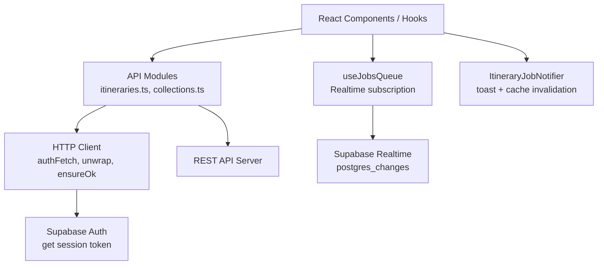
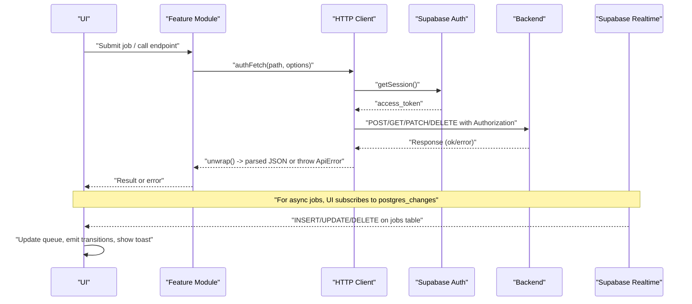
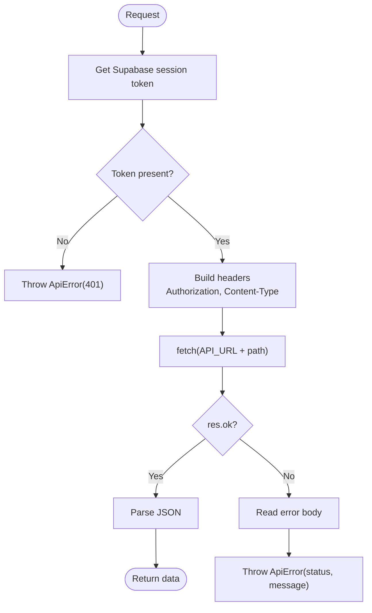
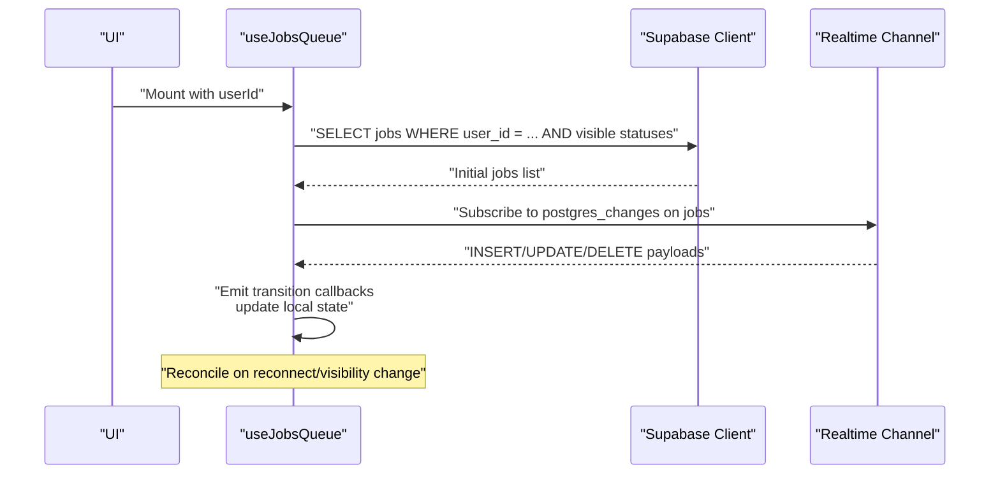
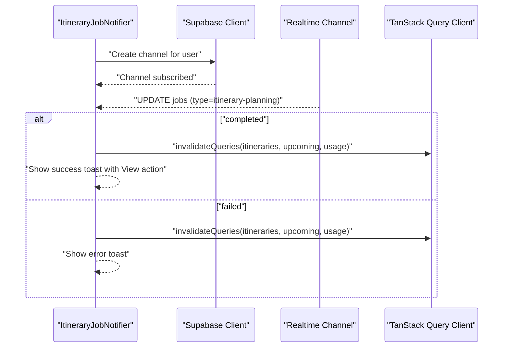
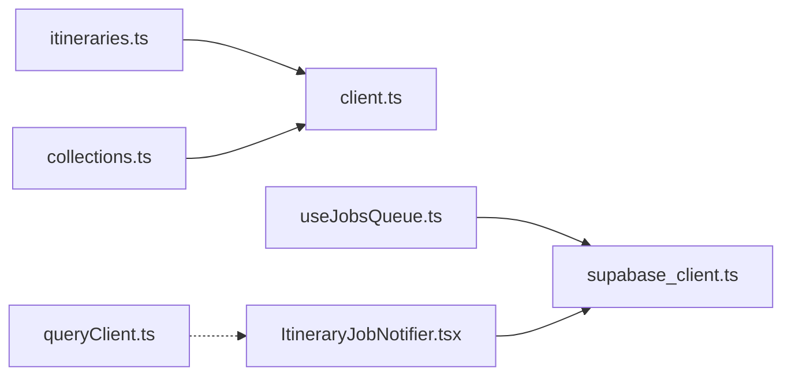

# REST API Client

<cite>
**Referenced Files in This Document**
- [client.ts](file://src/lib/api/client.ts)
- [itineraries.ts](file://src/lib/api/itineraries.ts)
- [collections.ts](file://src/lib/api/collections.ts)
- [useJobsQueue.ts](file://src/hooks/useJobsQueue.ts)
- [ItineraryJobNotifier.tsx](file://src/components/notifications/ItineraryJobNotifier.tsx)
- [queryClient.ts](file://src/lib/query/queryClient.ts)
- [userMessages.ts](file://src/lib/errors/userMessages.ts)
- [supabase_client.ts](file://src/lib/supabase/client.ts)
</cite>

## Table of Contents
1. [Introduction](#introduction)
2. [Project Structure](#project-structure)
3. [Core Components](#core-components)
4. [Architecture Overview](#architecture-overview)
5. [Detailed Component Analysis](#detailed-component-analysis)
6. [Dependency Analysis](#dependency-analysis)
7. [Performance Considerations](#performance-considerations)
8. [Troubleshooting Guide](#troubleshooting-guide)
9. [Conclusion](#conclusion)

## Introduction
This document explains the REST API client implementation used by the application, focusing on HTTP client configuration, request/response handling, error strategies, and the background job queue system for long-running tasks such as itinerary planning. It also covers authenticated requests, response parsing, caching via TanStack Query, retry behavior, real-time updates through Supabase Realtime, and performance considerations.

## Project Structure
The API layer is organized into a shared HTTP client with typed helpers and feature-scoped modules (e.g., itineraries, collections). Background jobs are managed via a React hook that subscribes to database changes and exposes a simple queue interface. Notifications listen for job completion and invalidate caches accordingly.

**Diagram sources**
- [client.ts:59-83](file://src/lib/api/client.ts#L59-L83)
- [itineraries.ts:54-120](file://src/lib/api/itineraries.ts#L54-L120)
- [collections.ts:65-93](file://src/lib/api/collections.ts#L65-L93)
- [useJobsQueue.ts:78-267](file://src/hooks/useJobsQueue.ts#L78-L267)
- [ItineraryJobNotifier.tsx:18-88](file://src/components/notifications/ItineraryJobNotifier.tsx#L18-L88)
- [supabase_client.ts:1-9](file://src/lib/supabase/client.ts#L1-L9)

**Section sources**
- [client.ts:1-156](file://src/lib/api/client.ts#L1-L156)
- [itineraries.ts:1-532](file://src/lib/api/itineraries.ts#L1-L532)
- [collections.ts:1-214](file://src/lib/api/collections.ts#L1-L214)
- [useJobsQueue.ts:1-296](file://src/hooks/useJobsQueue.ts#L1-L296)
- [ItineraryJobNotifier.tsx:1-92](file://src/components/notifications/ItineraryJobNotifier.tsx#L1-L92)
- [queryClient.ts:1-13](file://src/lib/query/queryClient.ts#L1-L13)
- [userMessages.ts:1-106](file://src/lib/errors/userMessages.ts#L1-L106)
- [supabase_client.ts:1-9](file://src/lib/supabase/client.ts#L1-L9)

## Core Components
- HTTP client with authentication and response unwrapping
  - Centralized auth header injection using Supabase session tokens
  - Typed error types and status propagation
  - JSON body parsing with safe fallbacks
- Feature modules
  - Itinerary endpoints: create, update, delete, generate, share, collaborate
  - Collection endpoints: CRUD, locations, collaborators, public access
- Job queue hook
  - Initial fetch, realtime updates, reconciliation on reconnect or visibility change
  - Optimistic UI updates and sorting rules
- Notification component
  - Listens for job completion/failure and triggers toast + cache invalidation

**Section sources**
- [client.ts:48-156](file://src/lib/api/client.ts#L48-L156)
- [itineraries.ts:54-532](file://src/lib/api/itineraries.ts#L54-L532)
- [collections.ts:65-214](file://src/lib/api/collections.ts#L65-L214)
- [useJobsQueue.ts:45-296](file://src/hooks/useJobsQueue.ts#L45-L296)
- [ItineraryJobNotifier.tsx:10-92](file://src/components/notifications/ItineraryJobNotifier.tsx#L10-L92)

## Architecture Overview
The client uses a thin HTTP wrapper around fetch to enforce authentication and consistent error handling. Feature modules call these helpers to interact with the backend. Long-running operations are submitted as jobs; the frontend tracks them via Supabase Realtime and provides progress and notifications.

**Diagram sources**
- [client.ts:48-156](file://src/lib/api/client.ts#L48-L156)
- [itineraries.ts:101-120](file://src/lib/api/itineraries.ts#L101-L120)
- [useJobsQueue.ts:78-267](file://src/hooks/useJobsQueue.ts#L78-L267)
- [ItineraryJobNotifier.tsx:18-88](file://src/components/notifications/ItineraryJobNotifier.tsx#L18-L88)

## Detailed Component Analysis

### HTTP Client Configuration and Interceptors
- Authentication flow
  - Retrieves Supabase session access token before each request
  - Injects Authorization header unless the body is FormData
  - Sets default Content-Type to application/json when not provided
- Response handling
  - unwrap parses JSON after ensuring success
  - ensureOk throws a typed ApiError with numeric status and message from response body
- Error classification
  - Transport errors surface without a Response; callers must handle network failures
  - Quota and domain-specific errors are converted to typed exceptions for better UX

**Diagram sources**
- [client.ts:48-107](file://src/lib/api/client.ts#L48-L107)

**Section sources**
- [client.ts:48-107](file://src/lib/api/client.ts#L48-L107)

### Request Patterns and Domain Modules
- Itineraries
  - Create blank or AI-generated itineraries
  - Manage activities, travel modes, route optimization, preview legs
  - Public sharing and collaboration tokens
- Collections
  - CRUD for collections and locations
  - Collaborators and public tokens
  - Public read endpoints for shared content

These modules consistently use authFetch and unwrap/ensureOk to maintain uniform behavior across all endpoints.

**Section sources**
- [itineraries.ts:54-532](file://src/lib/api/itineraries.ts#L54-L532)
- [collections.ts:65-214](file://src/lib/api/collections.ts#L65-L214)

### Job Queue System: Submission, Monitoring, Progress
- Submission
  - createJob posts a job with type and payload; handles specific server responses like already analyzed or quota exceeded
  - retryJob and detachJob provide lifecycle control
- Monitoring
  - useJobsQueue initializes with an initial fetch filtered by user and visibility rules
  - Subscribes to postgres_changes for INSERT/UPDATE/DELETE on the jobs table
  - Reconciles state on reconnect or tab visibility change to avoid stale states
- Progress tracking
  - Maintains per-job last known status to detect transitions
  - Sorts failed jobs to the top and keeps recent failures visible
  - Exposes optimistic upsert/remove helpers for immediate UI feedback

**Diagram sources**
- [useJobsQueue.ts:78-267](file://src/hooks/useJobsQueue.ts#L78-L267)

**Section sources**
- [client.ts:109-156](file://src/lib/api/client.ts#L109-L156)
- [useJobsQueue.ts:45-296](file://src/hooks/useJobsQueue.ts#L45-L296)

### Notification System and Real-Time Updates
- ItineraryJobNotifier listens for job updates scoped to itinerary planning
- On completion or failure, it invalidates relevant query caches and shows a toast with contextual actions
- Uses a unique channel suffix per instance to avoid Supabase Realtime channel deduplication conflicts

**Diagram sources**
- [ItineraryJobNotifier.tsx:18-88](file://src/components/notifications/ItineraryJobNotifier.tsx#L18-L88)

**Section sources**
- [ItineraryJobNotifier.tsx:10-92](file://src/components/notifications/ItineraryJobNotifier.tsx#L10-L92)

### Caching and Retry Behavior
- TanStack Query client defaults
  - Stale time and garbage collection times configured for queries
  - Single retry by default; window focus refetch disabled
- Cache invalidation
  - Job completion triggers targeted invalidations to refresh related lists and details
- No explicit request-level retry logic in the HTTP client; rely on TanStack Query retries and manual re-invocation where appropriate

**Section sources**
- [queryClient.ts:1-13](file://src/lib/query/queryClient.ts#L1-L13)
- [ItineraryJobNotifier.tsx:57-82](file://src/components/notifications/ItineraryJobNotifier.tsx#L57-L82)

### Error Handling Strategies
- Typed errors
  - ApiError carries numeric status for precise handling
  - Domain-specific errors: AlreadyAnalyzedError, LinkQuotaError, ItineraryQuotaError
- User-friendly messages
  - getFriendlyApiError ensures only whitelisted backend messages are surfaced; otherwise a safe fallback is shown
- Transport vs HTTP errors
  - Network failures do not produce a Response; callers should catch and handle them separately

**Section sources**
- [client.ts:5-107](file://src/lib/api/client.ts#L5-L107)
- [itineraries.ts:89-120](file://src/lib/api/itineraries.ts#L89-L120)
- [userMessages.ts:49-106](file://src/lib/errors/userMessages.ts#L49-L106)

## Dependency Analysis

**Diagram sources**
- [itineraries.ts:1-120](file://src/lib/api/itineraries.ts#L1-L120)
- [collections.ts:1-93](file://src/lib/api/collections.ts#L1-L93)
- [client.ts:1-156](file://src/lib/api/client.ts#L1-L156)
- [useJobsQueue.ts:1-296](file://src/hooks/useJobsQueue.ts#L1-L296)
- [ItineraryJobNotifier.tsx:1-92](file://src/components/notifications/ItineraryJobNotifier.tsx#L1-L92)
- [supabase_client.ts:1-9](file://src/lib/supabase/client.ts#L1-L9)
- [queryClient.ts:1-13](file://src/lib/query/queryClient.ts#L1-L13)

**Section sources**
- [client.ts:1-156](file://src/lib/api/client.ts#L1-L156)
- [itineraries.ts:1-532](file://src/lib/api/itineraries.ts#L1-L532)
- [collections.ts:1-214](file://src/lib/api/collections.ts#L1-L214)
- [useJobsQueue.ts:1-296](file://src/hooks/useJobsQueue.ts#L1-L296)
- [ItineraryJobNotifier.tsx:1-92](file://src/components/notifications/ItineraryJobNotifier.tsx#L1-L92)
- [supabase_client.ts:1-9](file://src/lib/supabase/client.ts#L1-L9)
- [queryClient.ts:1-13](file://src/lib/query/queryClient.ts#L1-L13)

## Performance Considerations
- Prefer minimal polling intervals for job progress; the current realtime approach avoids frequent polling
- Use optimistic updates via upsertJob to reduce perceived latency
- Leverage TanStack Query caching to minimize redundant requests
- Avoid unnecessary full-page refetches; invalidate only affected queries
- For large datasets, consider pagination and selective field masks at the API level

[No sources needed since this section provides general guidance]

## Troubleshooting Guide
- Authentication failures
  - Ensure Supabase session exists; authFetch throws a 401 if missing
- Network errors
  - Catch transport errors outside of unwrap; they lack a Response object
- Quota limits
  - Handle LinkQuotaError and ItineraryQuotaError to prompt upgrades or inform users
- Realtime connection issues
  - useJobsQueue sets connectionError on channel errors/timeouts and reconciles on reconnect
- User-facing messages
  - Use getFriendlyApiError to prevent leaking technical details

**Section sources**
- [client.ts:48-107](file://src/lib/api/client.ts#L48-L107)
- [useJobsQueue.ts:250-260](file://src/hooks/useJobsQueue.ts#L250-L260)
- [userMessages.ts:49-106](file://src/lib/errors/userMessages.ts#L49-L106)

## Conclusion
The REST API client provides a consistent, authenticated, and typed interface to the backend, with robust error handling and clear separation between transport and HTTP errors. The job queue leverages Supabase Realtime for efficient, low-latency progress updates and integrates seamlessly with TanStack Query for caching and invalidation. Together, these patterns deliver a responsive user experience for both synchronous and asynchronous workflows.