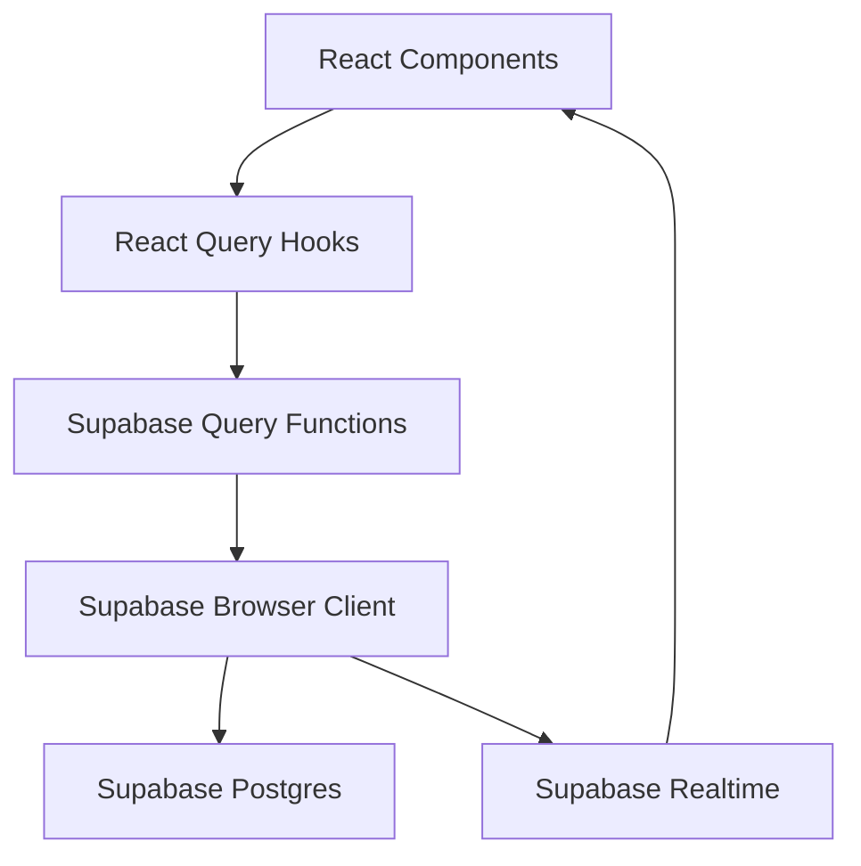
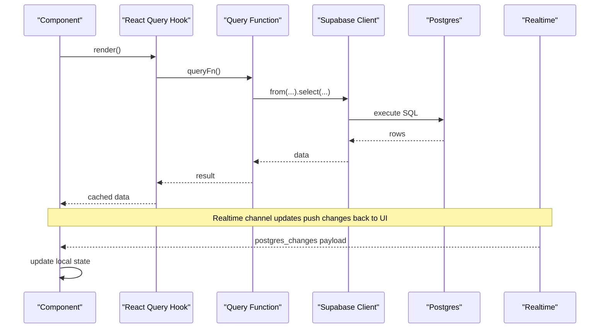
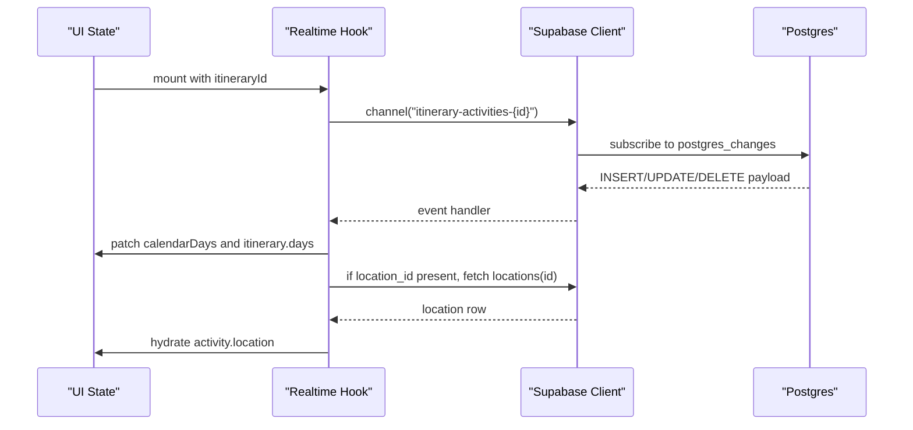
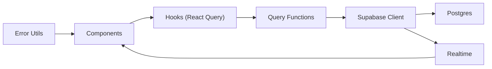

# Supabase Database Integration

<cite>
**Referenced Files in This Document**
- [client.ts](file://src/lib/supabase/client.ts)
- [queries.ts](file://src/lib/supabase/queries.ts)
- [home.ts](file://src/lib/supabase/queries/home.ts)
- [useItinerariesQuery.ts](file://src/hooks/queries/useItinerariesQuery.ts)
- [useCollectionsQuery.ts](file://src/hooks/queries/useCollectionsQuery.ts)
- [useProfileQuery.ts](file://src/hooks/queries/useProfileQuery.ts)
- [useItineraryRealtime.ts](file://src/hooks/useItineraryRealtime.ts)
- [userMessages.ts](file://src/lib/errors/userMessages.ts)
- [personalization-pipeline.md](file://docs/personalization-pipeline.md)
</cite>

## Table of Contents
1. [Introduction](#introduction)
2. [Project Structure](#project-structure)
3. [Core Components](#core-components)
4. [Architecture Overview](#architecture-overview)
5. [Detailed Component Analysis](#detailed-component-analysis)
6. [Dependency Analysis](#dependency-analysis)
7. [Performance Considerations](#performance-considerations)
8. [Troubleshooting Guide](#troubleshooting-guide)
9. [Conclusion](#conclusion)
10. [Appendices](#appendices)

## Introduction
This document explains how Argo integrates with Supabase for database access, authentication, and real-time collaboration. It covers client configuration, TypeScript type definitions for entities, query patterns using React Query hooks, real-time subscriptions, data modeling across itineraries, collections, and locations, and strategies for CRUD operations, complex queries, error handling, indexing, and validation. It also provides guidance for implementing new features while preserving type safety.

## Project Structure
Supabase integration is organized into:
- Client initialization and environment-based configuration
- Typed query functions that encapsulate table access and joins
- React Query hooks that wrap queries for caching and lifecycle management
- Real-time subscription hooks for collaborative editing and live updates
- Error utilities to translate technical errors into user-friendly messages

**Diagram sources**
- [client.ts:1-9](file://src/lib/supabase/client.ts#L1-L9)
- [queries.ts:1-150](file://src/lib/supabase/queries.ts#L1-L150)
- [home.ts:159-303](file://src/lib/supabase/queries/home.ts#L159-L303)
- [useProfileQuery.ts:1-20](file://src/hooks/queries/useProfileQuery.ts#L1-L20)
- [useItinerariesQuery.ts:1-17](file://src/hooks/queries/useItinerariesQuery.ts#L1-L17)
- [useCollectionsQuery.ts:1-17](file://src/hooks/queries/useCollectionsQuery.ts#L1-L17)
- [useItineraryRealtime.ts:1-534](file://src/hooks/useItineraryRealtime.ts#L1-L534)

**Section sources**
- [client.ts:1-9](file://src/lib/supabase/client.ts#L1-L9)
- [queries.ts:1-150](file://src/lib/supabase/queries.ts#L1-L150)
- [home.ts:159-303](file://src/lib/supabase/queries/home.ts#L159-L303)
- [useProfileQuery.ts:1-20](file://src/hooks/queries/useProfileQuery.ts#L1-L20)
- [useItinerariesQuery.ts:1-17](file://src/hooks/queries/useItinerariesQuery.ts#L1-L17)
- [useCollectionsQuery.ts:1-17](file://src/hooks/queries/useCollectionsQuery.ts#L1-L17)
- [useItineraryRealtime.ts:1-534](file://src/hooks/useItineraryRealtime.ts#L1-L534)

## Core Components
- Supabase browser client: created via a factory function using environment variables for URL and anonymous key.
- Typed query functions: encapsulate table reads, joins, and upserts with explicit TypeScript types for rows and responses.
- React Query hooks: provide caching, background refetching, and declarative data fetching for profiles, itineraries, and collections.
- Real-time subscriptions: listen to Postgres changes on itinerary-related tables to keep the UI in sync across collaborators.
- Error handling: maps Supabase auth and API errors to friendly messages for users.

Key responsibilities:
- Centralize client creation to ensure consistent configuration.
- Keep query logic isolated and typed to reduce duplication and risk.
- Use React Query for predictable state and caching behavior.
- Subscribe to relevant tables/events for live collaboration.
- Surface safe, user-friendly errors.

**Section sources**
- [client.ts:1-9](file://src/lib/supabase/client.ts#L1-L9)
- [queries.ts:1-150](file://src/lib/supabase/queries.ts#L1-L150)
- [useProfileQuery.ts:1-20](file://src/hooks/queries/useProfileQuery.ts#L1-L20)
- [useItinerariesQuery.ts:1-17](file://src/hooks/queries/useItinerariesQuery.ts#L1-L17)
- [useCollectionsQuery.ts:1-17](file://src/hooks/queries/useCollectionsQuery.ts#L1-L17)
- [useItineraryRealtime.ts:1-534](file://src/hooks/useItineraryRealtime.ts#L1-L534)
- [userMessages.ts:1-106](file://src/lib/errors/userMessages.ts#L1-L106)

## Architecture Overview
The application uses a layered approach:
- Presentation layer (React components) consumes data through React Query hooks.
- Query layer wraps Supabase client calls with typed functions and composes joins.
- Data layer interacts with Supabase Postgres and Realtime channels.
- Error layer translates backend errors into user-friendly messages.

**Diagram sources**
- [useProfileQuery.ts:1-20](file://src/hooks/queries/useProfileQuery.ts#L1-L20)
- [queries.ts:14-46](file://src/lib/supabase/queries.ts#L14-L46)
- [client.ts:1-9](file://src/lib/supabase/client.ts#L1-L9)
- [useItineraryRealtime.ts:39-333](file://src/hooks/useItineraryRealtime.ts#L39-L333)

## Detailed Component Analysis

### Supabase Client Configuration
- A single factory creates the browser client using environment variables for the Supabase URL and anonymous key.
- All modules import this factory to ensure consistent configuration across the app.

Typical usage pattern:
- Import the factory where needed.
- Call it to obtain a configured client instance.
- Pass the client into query functions or subscribe to realtime channels.

**Section sources**
- [client.ts:1-9](file://src/lib/supabase/client.ts#L1-L9)

### Authentication Setup
- The app retrieves the current session to resolve the authenticated user id.
- A hook obtains the session and extracts the user id for downstream queries.
- Auth errors are mapped to friendly messages before being shown to users.

Flow highlights:
- On mount, fetch the session and set the resolved user id.
- Use the user id to enable/disable profile queries.
- Convert technical auth errors into user-friendly strings.

**Section sources**
- [useSessionUserId.ts:1-19](file://src/hooks/useSessionUserId.ts#L1-L19)
- [userMessages.ts:1-106](file://src/lib/errors/userMessages.ts#L1-L106)

### Database Connection Patterns
- Query functions accept a Supabase client and perform table reads, joins, and upserts.
- Projections are explicitly selected to minimize payload size and improve performance.
- Errors are logged and handled gracefully by returning null or empty arrays when appropriate.

Examples:
- Fetching a profile by user id.
- Fetching multiple profiles by ids.
- Upserting collection-location associations with conflict handling.
- Aggregating preview images per collection.

**Section sources**
- [queries.ts:14-46](file://src/lib/supabase/queries.ts#L14-L46)
- [queries.ts:50-99](file://src/lib/supabase/queries.ts#L50-L99)
- [queries.ts:103-149](file://src/lib/supabase/queries.ts#L103-L149)

### TypeScript Type Definitions for Entities
- Types define the shape of returned data for profiles, itineraries, days, activities, and embedded locations.
- ActivityLocation mirrors the locations projection used in joins and must stay synchronized with realtime hydration fields.
- ItineraryDetail includes metadata such as collaborators, timezone, and public tokens.

Type safety benefits:
- Compile-time checks for field names and optional fields.
- Clear contracts between query functions and UI components.
- Reduced runtime errors due to mismatched shapes.

**Section sources**
- [queries.ts:7-29](file://src/lib/supabase/queries.ts#L7-L29)
- [home.ts:46-154](file://src/lib/supabase/queries/home.ts#L46-L154)

### Query Patterns Using React Query Hooks
- useProfileQuery wraps getProfile with caching and enables fetching only when a userId is present.
- useItinerariesQuery and useCollectionsQuery encapsulate list queries with stable keys and stale time settings.
- Hooks centralize query configuration, making it easy to adjust caching and refetch behavior.

Best practices:
- Use stable query keys derived from identifiers.
- Set appropriate staleTime/gcTime based on data volatility.
- Enable queries conditionally to avoid unnecessary requests.

**Section sources**
- [useProfileQuery.ts:1-20](file://src/hooks/queries/useProfileQuery.ts#L1-L20)
- [useItinerariesQuery.ts:1-17](file://src/hooks/queries/useItinerariesQuery.ts#L1-L17)
- [useCollectionsQuery.ts:1-17](file://src/hooks/queries/useCollectionsQuery.ts#L1-L17)

### Real-Time Subscription Implementation
- useItineraryRealtime subscribes to Postgres changes on itinerary-related tables to keep the UI in sync.
- Channels are scoped by itinerary id and handle INSERT, UPDATE, and DELETE events.
- For activity inserts without joined location data, the hook hydrates the location asynchronously and patches the itinerary state.
- Separate channels manage days, itinerary metadata, collaborators, flights, and lodgings.

Key behaviors:
- Maintain both calendar view state and itinerary detail state in sync.
- Deduplicate incoming activities and preserve ordering using position.
- Clean up channels on unmount to prevent leaks.

**Diagram sources**
- [useItineraryRealtime.ts:39-333](file://src/hooks/useItineraryRealtime.ts#L39-L333)
- [useItineraryRealtime.ts:335-440](file://src/hooks/useItineraryRealtime.ts#L335-L440)
- [useItineraryRealtime.ts:442-530](file://src/hooks/useItineraryRealtime.ts#L442-L530)

**Section sources**
- [useItineraryRealtime.ts:39-333](file://src/hooks/useItineraryRealtime.ts#L39-L333)
- [useItineraryRealtime.ts:335-440](file://src/hooks/useItineraryRealtime.ts#L335-L440)
- [useItineraryRealtime.ts:442-530](file://src/hooks/useItineraryRealtime.ts#L442-L530)

### Data Modeling and Relationships
- Itineraries contain days and activities; activities reference locations.
- Collaborators are tracked via a join table linking users to itineraries with roles.
- Collections group locations; content items can also be linked to locations.
- Indexes support efficient filtering by city and JSONB types.

Relationships:
- Itinerary -> Days -> Activities -> Locations
- User <-> Itinerary (collaboration)
- Collection <-> Location (many-to-many via association table)
- Content <-> Location (via association table)

Schema decisions:
- Time stored as minutes-from-midnight integers to avoid timezone corruption.
- JSONB used for flexible metadata like tags, opening hours, and price ranges.
- Expiration columns for caches to control TTL.

**Section sources**
- [personalization-pipeline.md:779-950](file://docs/personalization-pipeline.md#L779-L950)
- [home.ts:159-303](file://src/lib/supabase/queries/home.ts#L159-L303)

### CRUD Operations and Complex Queries
- Read operations:
  - Fetch detailed itinerary including days, activities, and locations with explicit projections.
  - Aggregate recent content across itineraries, collections, links, and locations with cursor pagination.
  - Fetch preview images per collection efficiently.
- Write operations:
  - Upsert collection-location associations with conflict resolution.
- Sorting and filtering:
  - Order by position and start_time for deterministic display order.
  - Filter by date range, archived/bookmarked flags, and processing status.

Complexity considerations:
- Joins are minimized to necessary fields to reduce payload.
- Aggregation is performed in JS when combining results from multiple tables.
- Pagination uses updated_at cursors for consistent ordering.

**Section sources**
- [home.ts:159-303](file://src/lib/supabase/queries/home.ts#L159-L303)
- [home.ts:311-780](file://src/lib/supabase/queries/home.ts#L311-L780)
- [queries.ts:103-149](file://src/lib/supabase/queries.ts#L103-L149)

### Error Handling Strategies
- Query functions log errors and return safe defaults (null or empty arrays).
- Auth errors are converted to user-friendly messages before display.
- Realtime handlers log warnings when hydration fails but continue operation gracefully.

Guidelines:
- Always handle error branches in query functions.
- Avoid surfacing technical details to users.
- Use fallback states in UI when data is unavailable.

**Section sources**
- [queries.ts:18-46](file://src/lib/supabase/queries.ts#L18-L46)
- [userMessages.ts:1-106](file://src/lib/errors/userMessages.ts#L1-L106)
- [useItineraryRealtime.ts:50-87](file://src/hooks/useItineraryRealtime.ts#L50-L87)

### Schema Design Decisions and Indexing Strategy
- Primary keys use UUIDs for uniqueness and scalability.
- Unique constraints enforce business rules (e.g., place_id uniqueness).
- Indexes:
  - City index for fast location searches.
  - GIN index on JSONB types for efficient array containment queries.
  - Status and created_at index on jobs for queue polling.
- TTL columns on caches ensure automatic expiration semantics.

Rationale:
- Improve query performance for common filters.
- Support rich metadata storage with JSONB while maintaining queryability.
- Ensure cache freshness and resource efficiency.

**Section sources**
- [personalization-pipeline.md:802-925](file://docs/personalization-pipeline.md#L802-L925)

### Data Validation Patterns
- Enforce domain constraints via check constraints (e.g., best_time_of_day, crowd_profile).
- Use enums or restricted text values for controlled vocabularies.
- Validate time representation as minutes-from-midnight integers to avoid timezone issues.
- Leverage foreign keys and unique constraints to maintain referential integrity.

Benefits:
- Prevent invalid data at the database level.
- Simplify application-side validation logic.
- Ensure consistency across services and clients.

**Section sources**
- [personalization-pipeline.md:843-858](file://docs/personalization-pipeline.md#L843-L858)
- [personalization-pipeline.md:927-947](file://docs/personalization-pipeline.md#L927-L947)

### Implementing New Features and Maintaining Type Safety
Steps:
- Define or extend TypeScript types for new entities and projections.
- Add typed query functions that select only required fields.
- Wrap queries in React Query hooks with appropriate keys and caching options.
- If real-time updates are needed, add channels for relevant tables and events.
- Update indexes and constraints to support new query patterns.
- Map errors to friendly messages and handle edge cases gracefully.

Checklist:
- Are types aligned with database schema?
- Are projections minimal and explicit?
- Is there an index supporting the new filter/sort?
- Are realtime channels scoped and cleaned up properly?
- Are errors handled and surfaced safely?

**Section sources**
- [queries.ts:1-150](file://src/lib/supabase/queries.ts#L1-150)
- [useProfileQuery.ts:1-20](file://src/hooks/queries/useProfileQuery.ts#L1-L20)
- [useItineraryRealtime.ts:1-534](file://src/hooks/useItineraryRealtime.ts#L1-L534)
- [personalization-pipeline.md:779-950](file://docs/personalization-pipeline.md#L779-L950)

## Dependency Analysis
The following diagram shows how components depend on each other for data flow and real-time updates.

**Diagram sources**
- [useProfileQuery.ts:1-20](file://src/hooks/queries/useProfileQuery.ts#L1-L20)
- [queries.ts:1-150](file://src/lib/supabase/queries.ts#L1-150)
- [client.ts:1-9](file://src/lib/supabase/client.ts#L1-L9)
- [useItineraryRealtime.ts:1-534](file://src/hooks/useItineraryRealtime.ts#L1-L534)
- [userMessages.ts:1-106](file://src/lib/errors/userMessages.ts#L1-L106)

**Section sources**
- [useProfileQuery.ts:1-20](file://src/hooks/queries/useProfileQuery.ts#L1-L20)
- [queries.ts:1-150](file://src/lib/supabase/queries.ts#L1-150)
- [client.ts:1-9](file://src/lib/supabase/client.ts#L1-L9)
- [useItineraryRealtime.ts:1-534](file://src/hooks/useItineraryRealtime.ts#L1-L534)
- [userMessages.ts:1-106](file://src/lib/errors/userMessages.ts#L1-L106)

## Performance Considerations
- Minimize payload size by selecting only needed fields in queries.
- Use indexes strategically for frequent filters (city, types JSONB).
- Prefer server-side sorting and filtering where possible.
- Cache aggressively with React Query for stable datasets.
- Limit realtime subscriptions to necessary tables and scope by entity id.
- Use cursor-based pagination for large lists to avoid deep offsets.

[No sources needed since this section provides general guidance]

## Troubleshooting Guide
Common issues and resolutions:
- Missing location data after realtime insert: ensure the hydration step runs and handles failures gracefully.
- Stale or duplicate activities: verify deduplication logic and ordering by position.
- Realtime channel conflicts: ensure unique channel names per instance and proper cleanup on unmount.
- Auth errors: map technical codes/messages to friendly strings and guide users to retry.

Actionable steps:
- Check console logs for query errors and realtime warnings.
- Validate that projections match expected fields in types.
- Confirm indexes exist for queried columns.
- Review error mapping utilities to ensure safe messages.

**Section sources**
- [useItineraryRealtime.ts:50-87](file://src/hooks/useItineraryRealtime.ts#L50-L87)
- [useItineraryRealtime.ts:39-333](file://src/hooks/useItineraryRealtime.ts#L39-L333)
- [userMessages.ts:1-106](file://src/lib/errors/userMessages.ts#L1-L106)

## Conclusion
Argo’s Supabase integration combines a clean client setup, strongly-typed query functions, React Query hooks for predictable data flow, and robust real-time subscriptions for collaboration. The schema emphasizes performance and flexibility with strategic indexing and JSONB usage. By following the patterns outlined here—explicit projections, careful error handling, and disciplined type alignment—you can implement new features confidently while maintaining reliability and performance.

[No sources needed since this section summarizes without analyzing specific files]

## Appendices

### Realtime Channel Reference
- Activities: INSERT/UPDATE/DELETE on itinerary_activities filtered by itinerary_id.
- Days: INSERT/DELETE on itinerary_days filtered by itinerary_id.
- Metadata: UPDATE on itineraries filtered by id.
- Collaborators: INSERT/DELETE on user_itinerary filtered by itinerary_id.
- Flights/Lodgings: INSERT/UPDATE/DELETE on respective tables filtered by itinerary_id.

**Section sources**
- [useItineraryRealtime.ts:39-333](file://src/hooks/useItineraryRealtime.ts#L39-L333)
- [useItineraryRealtime.ts:335-440](file://src/hooks/useItineraryRealtime.ts#L335-L440)
- [useItineraryRealtime.ts:442-530](file://src/hooks/useItineraryRealtime.ts#L442-L530)

### Query Examples Reference
- Profile retrieval by user id.
- Multi-profile lookup by ids.
- Itinerary detail with nested days and activities.
- Recent content aggregation with cursor pagination.
- Collection preview image aggregation.

**Section sources**
- [queries.ts:14-46](file://src/lib/supabase/queries.ts#L14-L46)
- [home.ts:159-303](file://src/lib/supabase/queries/home.ts#L159-L303)
- [home.ts:311-780](file://src/lib/supabase/queries/home.ts#L311-L780)
- [queries.ts:103-149](file://src/lib/supabase/queries.ts#L103-L149)