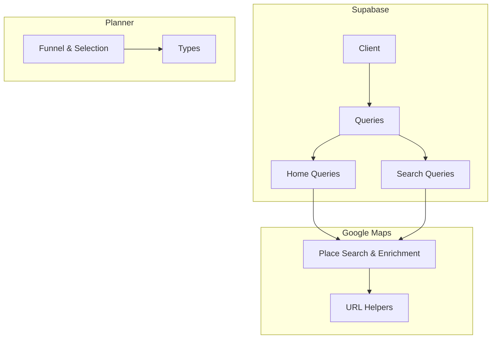
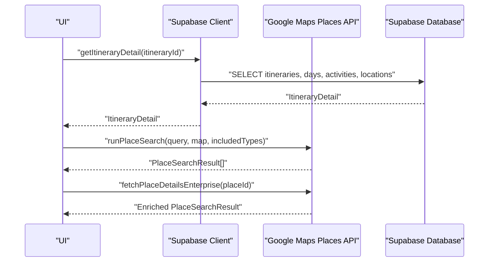
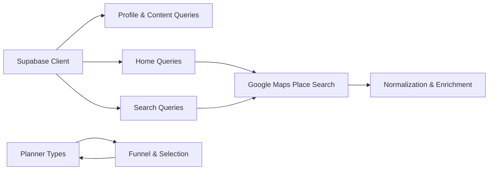

# API Reference

<cite>
**Referenced Files in This Document**
- [client.ts](file://src/lib/supabase/client.ts)
- [queries.ts](file://src/lib/supabase/queries.ts)
- [home.ts](file://src/lib/supabase/queries/home.ts)
- [search.ts](file://src/lib/supabase/queries/search.ts)
- [place-search.ts](file://src/lib/maps/place-search.ts)
- [google-maps-url.ts](file://src/lib/maps/google-maps-url.ts)
- [types.ts](file://src/lib/planner/types.ts)
- [funnel.ts](file://src/lib/planner/funnel.ts)
</cite>

## Table of Contents
1. Introduction
2. Project Structure
3. Core Components
4. Architecture Overview
5. Detailed Component Analysis
6. Dependency Analysis
7. Performance Considerations
8. Troubleshooting Guide
9. Conclusion

## Introduction
This document provides a comprehensive API reference for the application’s internal data layer and external integrations. It covers:
- Supabase client configuration, database queries, and real-time considerations
- Google Maps integration (Places API New), including search, enrichment, and URL handling
- Personalization pipeline types and deterministic selection logic used by planning features
- Authentication, rate limiting, error handling, and usage examples for each endpoint or function

The goal is to enable both frontend developers and backend collaborators to understand how data flows from UI actions through Supabase and Google Maps services into persisted entities and back to the user interface.

## Project Structure
The codebase organizes APIs and integrations under src/lib:
- Supabase client and query modules under src/lib/supabase
- Google Maps utilities under src/lib/maps
- Personalization pipeline types and algorithms under src/lib/planner

**Diagram sources**
- [client.ts:1-9](file://src/lib/supabase/client.ts#L1-L9)
- [queries.ts:1-150](file://src/lib/supabase/queries.ts#L1-L150)
- [home.ts:1-794](file://src/lib/supabase/queries/home.ts#L1-L794)
- [search.ts:1-161](file://src/lib/supabase/queries/search.ts#L1-L161)
- [place-search.ts:1-469](file://src/lib/maps/place-search.ts#L1-L469)
- [google-maps-url.ts:1-12](file://src/lib/maps/google-maps-url.ts#L1-L12)
- [types.ts:1-93](file://src/lib/planner/types.ts#L1-L93)
- [funnel.ts:1-271](file://src/lib/planner/funnel.ts#L1-L271)

**Section sources**
- [client.ts:1-9](file://src/lib/supabase/client.ts#L1-L9)
- [queries.ts:1-150](file://src/lib/supabase/queries.ts#L1-L150)
- [home.ts:1-794](file://src/lib/supabase/queries/home.ts#L1-L794)
- [search.ts:1-161](file://src/lib/supabase/queries/search.ts#L1-L161)
- [place-search.ts:1-469](file://src/lib/maps/place-search.ts#L1-L469)
- [google-maps-url.ts:1-12](file://src/lib/maps/google-maps-url.ts#L1-L12)
- [types.ts:1-93](file://src/lib/planner/types.ts#L1-L93)
- [funnel.ts:1-271](file://src/lib/planner/funnel.ts#L1-L271)

## Core Components
- Supabase Client: Browser client initialized with environment variables for URL and anon key. Used across all data operations.
- Query Modules:
  - Profile and content helpers for reading profiles and content details
  - Home queries for recent content, favorites, archived items, and itinerary detail
  - Search via RPC for unified search across links, collections, and itineraries
- Google Maps Integration:
  - Place search (text and nearby), normalization, and enrichment
  - URL validation for Google Maps links
- Planner Pipeline:
  - Types for preference profiles, scheduler options, candidate places, and enrichment
  - Deterministic funnel for shortlisting candidates with quotas and constraints

**Section sources**
- [client.ts:1-9](file://src/lib/supabase/client.ts#L1-L9)
- [queries.ts:14-149](file://src/lib/supabase/queries.ts#L14-L149)
- [home.ts:159-303](file://src/lib/supabase/queries/home.ts#L159-L303)
- [search.ts:21-67](file://src/lib/supabase/queries/search.ts#L21-L67)
- [place-search.ts:146-469](file://src/lib/maps/place-search.ts#L146-L469)
- [google-maps-url.ts:1-12](file://src/lib/maps/google-maps-url.ts#L1-L12)
- [types.ts:27-93](file://src/lib/planner/types.ts#L27-L93)
- [funnel.ts:25-135](file://src/lib/planner/funnel.ts#L25-L135)

## Architecture Overview
The system integrates three primary layers:
- Data Access Layer (Supabase): Reads/writes profiles, content, collections, itineraries, and locations; supports RPC-based search
- External Services Layer (Google Maps Places API New): Performs place search, enrichment, and photo retrieval; normalizes results for storage and display
- Planning Layer (Personalization Pipeline): Applies deterministic funnels and scoring to produce curated shortlists based on user preferences

**Diagram sources**
- [home.ts:159-303](file://src/lib/supabase/queries/home.ts#L159-L303)
- [place-search.ts:393-469](file://src/lib/maps/place-search.ts#L393-L469)
- [place-search.ts:378-385](file://src/lib/maps/place-search.ts#L378-L385)

## Detailed Component Analysis

### Supabase Client
- Purpose: Creates a browser-side Supabase client using environment variables for URL and anon key
- Usage: Imported by query modules to perform reads and writes
- Error Handling: Errors are handled per-query; client initialization relies on environment variables being present

**Section sources**
- [client.ts:1-9](file://src/lib/supabase/client.ts#L1-L9)

### Profiles and Content Queries
- getProfile(supabase, userId): Returns a single profile row or null
- getProfiles(supabase, userIds[]): Returns an array of profiles for given IDs
- getContentDetail(supabase, contentId): Returns content with nested locations via inner join and RLS scoping

Notes:
- All queries use Supabase client methods and handle errors by logging and returning safe defaults
- RLS ensures user-scoped access when joining user_content

**Section sources**
- [queries.ts:14-46](file://src/lib/supabase/queries.ts#L14-L46)
- [queries.ts:50-99](file://src/lib/supabase/queries.ts#L50-L99)

### Collection Locations and Preview Images
- addLocationsToCollection(supabase, collectionId, locationIds[]): Upserts many-to-many mapping with conflict ignore
- getCollectionPreviewImages(supabase, collectionIds[]): Aggregates up to four distinct preview images per collection

Notes:
- Efficiently groups photo_urls by collection_id to avoid redundant queries
- Used by home and search modules to enrich cards

**Section sources**
- [queries.ts:103-149](file://src/lib/supabase/queries.ts#L103-L149)

### Home Queries
Key functions:
- getItineraryDetail(supabase, itineraryId): Fetches itinerary base, collaborators, days, activities, and embedded locations; computes timezone if missing
- getRecentContent(supabase, userId, filter, limit, cursor?): Unified entrypoint routing to specific fetchers
- getEntityLocations(supabase, entityType, entityId): Retrieves unique locations tied to a link, collection, or itinerary

Behavior:
- Uses pagination via updated_at cursors where applicable
- Merges and deduplicates results for locations across collections and content
- Orders activities by position then start_time for stable rendering

**Section sources**
- [home.ts:159-303](file://src/lib/supabase/queries/home.ts#L159-L303)
- [home.ts:311-335](file://src/lib/supabase/queries/home.ts#L311-L335)
- [home.ts:441-563](file://src/lib/supabase/queries/home.ts#L441-L563)
- [search.ts:93-160](file://src/lib/supabase/queries/search.ts#L93-L160)

### Search via RPC
- searchViaRpc(supabase, userId, query, filterType?, offset?, limit?): Calls server-side RPC to search across entities and returns paginated results with relevance scores
- attachSearchCollectionPreviews(supabase, results): Enriches collection results with preview images

Notes:
- Uses supabase.rpc("search_all", ...) with parameters for filtering and pagination
- Handles empty queries gracefully

**Section sources**
- [search.ts:21-67](file://src/lib/supabase/queries/search.ts#L21-L67)

### Google Maps Integration
Core responsibilities:
- Validate Google Maps URLs
- Run text or nearby place searches with field masks
- Normalize results to a consistent shape
- Enrich Pro-tier results with Enterprise fields
- Build payloads for server-side persistence without redundant calls

Key functions:
- looksLikeGoogleMapsUrl(value): Validates host patterns for Google Maps links
- runPlaceSearch(placesLib, map, { query, includedTypes }): Executes search against current viewport; returns normalized results
- normalizePlace(place): Maps Maps JS Place to PlaceSearchResult, extracting photos, address components, opening hours, price info
- fetchPlaceDetailsEnterprise(placesLib, placeId): Enriches a Pro-tier result with Enterprise fields
- toPlaceDetailsPayload(place): Builds server payload only when Enterprise data is available

Error handling and limits:
- Caps radius to 50 km minimum/maximum bounds
- Limits stored photos to three per place
- Logs detailed request/response in development mode

Authentication and billing:
- Requires Google Maps JavaScript Places library and appropriate API keys
- Billing model emphasizes requesting Enterprise fields once to minimize total cost

Usage example outline:
- Initialize Places Library
- Call runPlaceSearch with query and active chip types
- For pin clicks on Pro-tier results, call fetchPlaceDetailsEnterprise
- Persist via server using toPlaceDetailsPayload when available

**Section sources**
- [google-maps-url.ts:1-12](file://src/lib/maps/google-maps-url.ts#L1-L12)
- [place-search.ts:146-175](file://src/lib/maps/place-search.ts#L146-L175)
- [place-search.ts:177-265](file://src/lib/maps/place-search.ts#L177-L265)
- [place-search.ts:378-385](file://src/lib/maps/place-search.ts#L378-L385)
- [place-search.ts:393-469](file://src/lib/maps/place-search.ts#L393-L469)

### Planner Pipeline Types and Funnel
Types:
- PreferenceProfile: Interests, dietary needs, pace, budget, type affinities
- SchedulerOptions: Clustering and scheduling knobs
- CandidatePlace: Retrieved place shape consumed by deterministic pipeline
- PlaceEnrichment: Cached enrichment data for tags, descriptions, visit duration, signature dishes, crowd profile

Funnel:
- runFunnel(clusters, profile, options?): Applies hard filters, per-cluster caps, global cap, and quotas to produce a shortlist
- pickSerendipity(candidates, profile?): Selects one wildcard per day within review-count threshold
- selectMealCandidates(bucket, profile, enrichmentTags?): Applies dietary degradation ladder
- widenBudget(bucket, profile?): Widens budget stepwise to fill buckets while recording reasons

Notes:
- Deterministic and logged stages for replayability
- Integrates with enrichment data to inform dietary and visit-duration decisions

**Section sources**
- [types.ts:27-93](file://src/lib/planner/types.ts#L27-L93)
- [funnel.ts:25-135](file://src/lib/planner/funnel.ts#L25-L135)
- [funnel.ts:150-217](file://src/lib/planner/funnel.ts#L150-L217)
- [funnel.ts:239-270](file://src/lib/planner/funnel.ts#L239-L270)

## Dependency Analysis

**Diagram sources**
- [client.ts:1-9](file://src/lib/supabase/client.ts#L1-L9)
- [queries.ts:14-149](file://src/lib/supabase/queries.ts#L14-L149)
- [home.ts:159-303](file://src/lib/supabase/queries/home.ts#L159-L303)
- [search.ts:21-67](file://src/lib/supabase/queries/search.ts#L21-L67)
- [place-search.ts:146-469](file://src/lib/maps/place-search.ts#L146-L469)
- [types.ts:27-93](file://src/lib/planner/types.ts#L27-L93)
- [funnel.ts:25-135](file://src/lib/planner/funnel.ts#L25-L135)

**Section sources**
- [client.ts:1-9](file://src/lib/supabase/client.ts#L1-L9)
- [queries.ts:14-149](file://src/lib/supabase/queries.ts#L14-L149)
- [home.ts:159-303](file://src/lib/supabase/queries/home.ts#L159-L303)
- [search.ts:21-67](file://src/lib/supabase/queries/search.ts#L21-L67)
- [place-search.ts:146-469](file://src/lib/maps/place-search.ts#L146-L469)
- [types.ts:27-93](file://src/lib/planner/types.ts#L27-L93)
- [funnel.ts:25-135](file://src/lib/planner/funnel.ts#L25-L135)

## Performance Considerations
- Google Maps billing: Requesting Enterprise fields in a single search reduces total cost compared to separate Place Details calls
- Result caps: Max 20 results per search; max 3 stored photos per place; radius capped at 50 km
- Query efficiency: Use in() and joins to minimize round trips; aggregate preview images per collection
- Ordering stability: Activities ordered by position then start_time to ensure consistent UI rendering
- Funnel caps: Global cap (~60) keeps LLM input manageable and improves consistency

[No sources needed since this section provides general guidance]

## Troubleshooting Guide
Common issues and resolutions:
- Missing environment variables: Ensure NEXT_PUBLIC_SUPABASE_URL and NEXT_PUBLIC_SUPABASE_ANON_KEY are set for client initialization
- Empty search results: Verify query string and includedTypes; check viewport bounds for nearby search
- Insufficient Enterprise data: If Pro-tier results lack rating/opening-hours/phone/website, call fetchPlaceDetailsEnterprise before persisting
- Rate limits: Respect Google Maps request limits; debounce user inputs and reuse results where possible
- Realtime updates: When adding activities optimistically, rely on correlation_id to match server echoes

**Section sources**
- [client.ts:1-9](file://src/lib/supabase/client.ts#L1-L9)
- [place-search.ts:393-469](file://src/lib/maps/place-search.ts#L393-L469)
- [place-search.ts:378-385](file://src/lib/maps/place-search.ts#L378-L385)
- [home.ts:159-303](file://src/lib/supabase/queries/home.ts#L159-L303)

## Conclusion
This API reference outlines the core data access patterns with Supabase, the Google Maps Places integration strategy, and the deterministic personalization pipeline. By following the documented functions, error handling practices, and performance guidelines, teams can build reliable, scalable features that deliver rich travel planning experiences.

[No sources needed since this section summarizes without analyzing specific files]