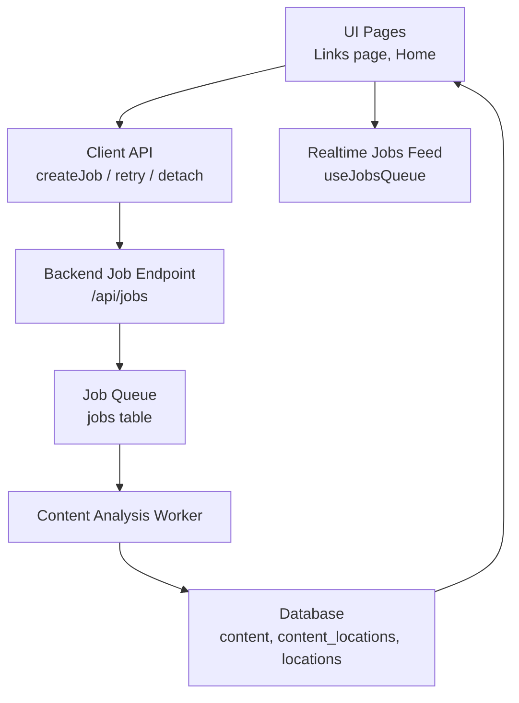
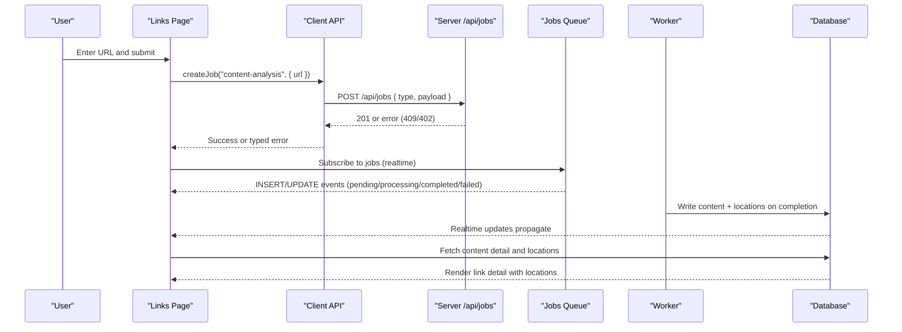
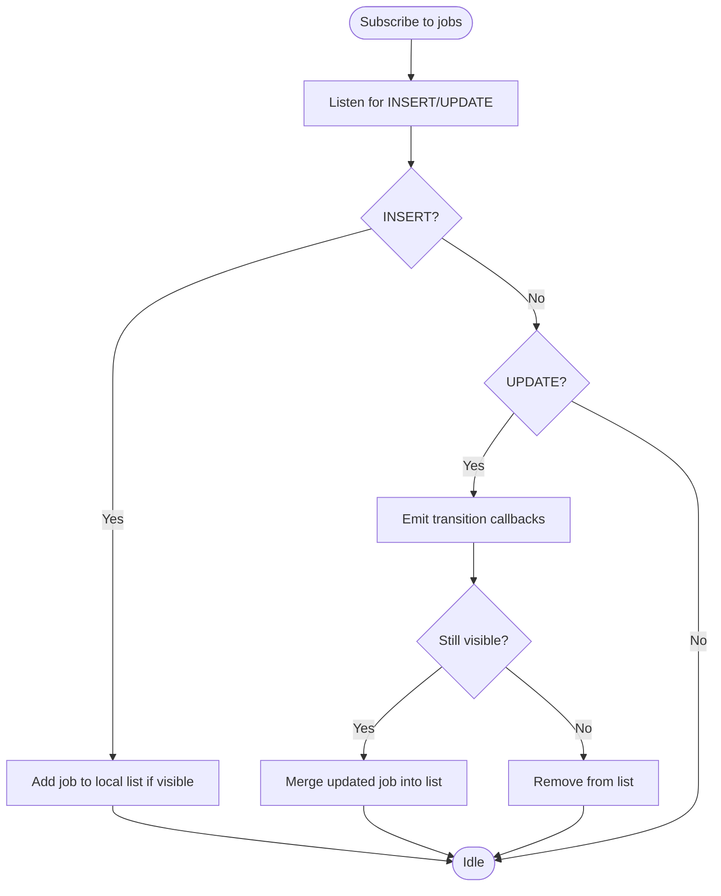
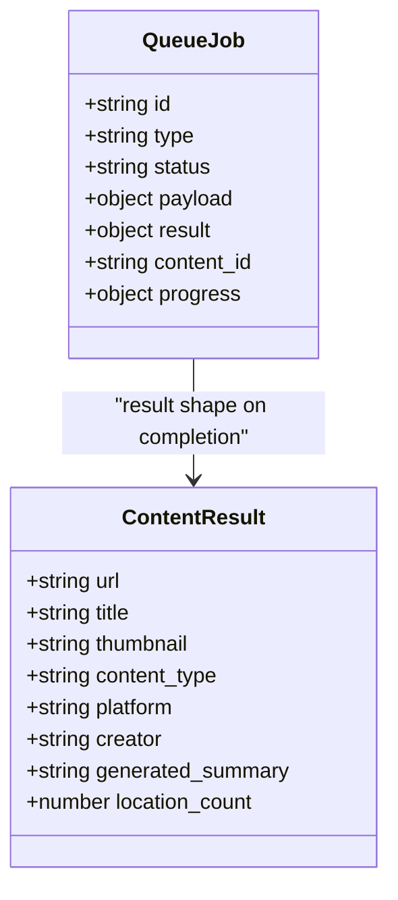
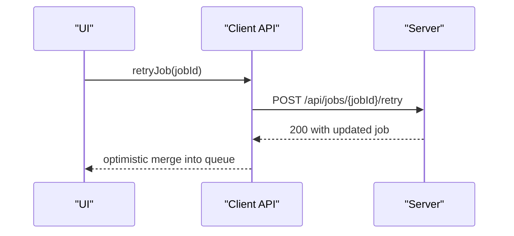
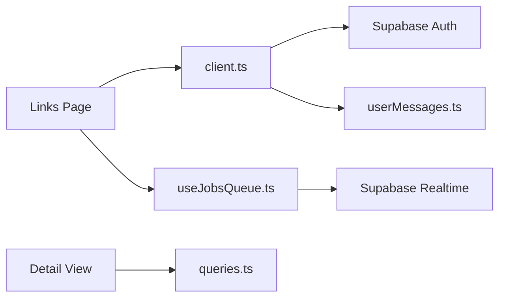

# Content Analysis API

<cite>
**Referenced Files in This Document**
- [client.ts](file://src/lib/api/client.ts)
- [content.ts](file://src/lib/api/content.ts)
- [useJobsQueue.ts](file://src/hooks/useJobsQueue.ts)
- [page.tsx (links)](file://src/app/links/page.tsx)
- [MainLayout.tsx](file://src/components/ui/layout/MainLayout.tsx)
- [queries.ts](file://src/lib/supabase/queries.ts)
- [userMessages.ts](file://src/lib/errors/userMessages.ts)
- [url-validation.ts](file://src/lib/utils/url-validation.ts)
- [google-maps-url.ts](file://src/lib/maps/google-maps-url.ts)
</cite>

## Table of Contents
1. [Introduction](#introduction)
2. [Project Structure](#project-structure)
3. [Core Components](#core-components)
4. [Architecture Overview](#architecture-overview)
5. [Detailed Component Analysis](#detailed-component-analysis)
6. [Dependency Analysis](#dependency-analysis)
7. [Performance Considerations](#performance-considerations)
8. [Troubleshooting Guide](#troubleshooting-guide)
9. [Conclusion](#conclusion)

## Introduction
This document describes the content analysis feature that processes user-submitted URLs to extract travel-related locations and information. It explains how users submit links, how jobs are queued and processed, how results are stored and displayed, and how errors and quotas are handled. It also covers authentication, rate limiting considerations, and security practices for processing external URLs and sanitizing extracted content.

## Project Structure
The content analysis flow spans client-side UI, a job queue, and data retrieval from the database:
- Client API helpers authenticate requests and create jobs.
- The UI submits URLs and listens to job progress via realtime updates.
- Completed jobs populate content records with extracted locations and metadata.
- Detail views render extracted locations and link context.

**Diagram sources**
- [client.ts:59-150](file://src/lib/api/client.ts#L59-L150)
- [useJobsQueue.ts:138-260](file://src/hooks/useJobsQueue.ts#L138-L260)
- [queries.ts:50-99](file://src/lib/supabase/queries.ts#L50-L99)

**Section sources**
- [client.ts:59-150](file://src/lib/api/client.ts#L59-L150)
- [useJobsQueue.ts:138-260](file://src/hooks/useJobsQueue.ts#L138-L260)
- [queries.ts:50-99](file://src/lib/supabase/queries.ts#L50-L99)

## Core Components
- Authentication and HTTP layer:
  - All outbound calls attach a Bearer token obtained from the session.
  - Non-OK responses are converted into typed errors with status codes.
- Job creation:
  - Submitting a URL creates a job of type "content-analysis" with a payload containing the URL.
  - Special handling for already-analyzed links and quota limits.
- Job monitoring:
  - A realtime subscription tracks job lifecycle transitions and renders progress.
  - Optimistic UI merges completed results immediately when available.
- Data retrieval:
  - After completion, content details and associated locations are fetched and rendered.

**Section sources**
- [client.ts:59-150](file://src/lib/api/client.ts#L59-L150)
- [useJobsQueue.ts:45-295](file://src/hooks/useJobsQueue.ts#L45-L295)
- [queries.ts:50-99](file://src/lib/supabase/queries.ts#L50-L99)

## Architecture Overview
End-to-end flow from submission to result display:

**Diagram sources**
- [client.ts:109-150](file://src/lib/api/client.ts#L109-L150)
- [useJobsQueue.ts:167-260](file://src/hooks/useJobsQueue.ts#L167-L260)
- [queries.ts:50-99](file://src/lib/supabase/queries.ts#L50-L99)

## Detailed Component Analysis

### Job Submission and Request/Response Schema
- Endpoint: POST /api/jobs
- Request body:
  - type: string — must be "content-analysis" for this feature
  - payload: object — contains at least url (string)
- Responses:
  - 201 Created: returns job record (id, status, etc.)
  - 409 Conflict: already analyzed; includes content summary for quick navigation
  - 402 Payment Required: quota exceeded; includes tier and limit info
- Authentication:
  - Authorization header with Bearer token is required; missing token yields 401
- Rate limiting:
  - Quota enforcement appears server-side per user plan; client surfaces quota errors and guides upgrades

Examples:
- Submit a URL for analysis:
  - From UI, call createJob("content-analysis", { url: "https://example.com" })
  - On success, show toast and navigate to links queue
- Handle already analyzed:
  - Catch AlreadyAnalyzedError and open existing link view
- Handle quota exceeded:
  - Catch LinkQuotaError and show upgrade prompt

**Section sources**
- [client.ts:59-150](file://src/lib/api/client.ts#L59-L150)
- [MainLayout.tsx:109-129](file://src/components/ui/layout/MainLayout.tsx#L109-L129)
- [page.tsx (links):222-261](file://src/app/links/page.tsx#L222-L261)

### Job Monitoring and Progress
- Realtime subscription to the jobs table scoped by user_id
- Tracks statuses: pending, queued, processing, completed, failed, cancelled
- Emits callbacks:
  - onJobCompleted: shows success toast and optimistic card
  - onJobFailed: shows error toast
  - onJobRejected: indicates no travel locations found
- Visual progress:
  - Uses step-based mapping or worker-reported percent for smooth UX

**Diagram sources**
- [useJobsQueue.ts:167-260](file://src/hooks/useJobsQueue.ts#L167-L260)

**Section sources**
- [useJobsQueue.ts:45-295](file://src/hooks/useJobsQueue.ts#L45-L295)
- [page.tsx (links):138-186](file://src/app/links/page.tsx#L138-L186)

### Content Parsing and Location Extraction
- Worker behavior (inferred from client usage):
  - Parses submitted URL to identify platform and content type (e.g., video vs webpage)
  - Extracts travel-related locations and enriches them with address, coordinates, photos, opening hours, phone, website, stay duration, price range, and primary type
  - Stores results in content and content_locations tables
- Display:
  - Detail view maps location rows into rich location items for rendering

**Diagram sources**
- [useJobsQueue.ts:6-34](file://src/hooks/useJobsQueue.ts#L6-L34)
- [page.tsx (links):81-118](file://src/app/links/page.tsx#L81-L118)

**Section sources**
- [queries.ts:50-99](file://src/lib/supabase/queries.ts#L50-L99)
- [page.tsx (links):81-118](file://src/app/links/page.tsx#L81-L118)

### Handling Different Content Types
- Supported types inferred from results:
  - video
  - webpage
- Platform detection and author/creator extraction are included in the result schema
- Thumbnails and summaries aid quick recognition and context

**Section sources**
- [page.tsx (links):81-118](file://src/app/links/page.tsx#L81-L118)

### Retry, Detach, and Error Handling
- Retry:
  - POST /api/jobs/{jobId}/retry re-enqueues a failed job
- Detach:
  - PATCH /api/jobs/{jobId}/detach marks a job detached so it no longer appears in the active queue
- Errors:
  - 401 Not authenticated: missing or invalid token
  - 409 Already analyzed: redirect to existing content
  - 402 Quota exceeded: show upgrade prompt
  - Network failures: transport errors surfaced with friendly messages

**Diagram sources**
- [client.ts:147-150](file://src/lib/api/client.ts#L147-L150)
- [useJobsQueue.ts:274-292](file://src/hooks/useJobsQueue.ts#L274-L292)

**Section sources**
- [client.ts:109-150](file://src/lib/api/client.ts#L109-L150)
- [useJobsQueue.ts:269-292](file://src/hooks/useJobsQueue.ts#L269-L292)

### Security Considerations
- Authentication:
  - All API calls require a valid Bearer token; unauthenticated requests fail early
- URL validation:
  - Enforce http/https protocols and basic hostname checks before submission
- External URL safety:
  - Recognize known hosts (e.g., Google Maps) to guide parsing paths
- Content sanitization:
  - Surface only whitelisted backend messages to avoid leaking technical details
  - Avoid executing or embedding raw HTML from external sources without sanitization

**Section sources**
- [client.ts:59-83](file://src/lib/api/client.ts#L59-L83)
- [url-validation.ts:1-17](file://src/lib/utils/url-validation.ts#L1-L17)
- [google-maps-url.ts:1-11](file://src/lib/maps/google-maps-url.ts#L1-L11)
- [userMessages.ts:49-106](file://src/lib/errors/userMessages.ts#L49-L106)

## Dependency Analysis
Key dependencies and relationships:
- UI pages depend on client API to create jobs and handle errors
- useJobsQueue depends on Supabase realtime to track job state
- Detail views depend on queries to fetch content and locations
- Error utilities centralize friendly messaging

**Diagram sources**
- [client.ts:59-150](file://src/lib/api/client.ts#L59-L150)
- [useJobsQueue.ts:138-260](file://src/hooks/useJobsQueue.ts#L138-L260)
- [queries.ts:50-99](file://src/lib/supabase/queries.ts#L50-L99)
- [userMessages.ts:49-106](file://src/lib/errors/userMessages.ts#L49-L106)

**Section sources**
- [client.ts:59-150](file://src/lib/api/client.ts#L59-L150)
- [useJobsQueue.ts:138-260](file://src/hooks/useJobsQueue.ts#L138-L260)
- [queries.ts:50-99](file://src/lib/supabase/queries.ts#L50-L99)
- [userMessages.ts:49-106](file://src/lib/errors/userMessages.ts#L49-L106)

## Performance Considerations
- Realtime efficiency:
  - Per-instance channel suffix avoids duplicate subscriptions across features
  - Reconciliation on visibility change prevents stale progress states
- Optimistic UI:
  - Immediately merge completed results using content_id to reduce perceived latency
- Query minimization:
  - Select only needed fields for content and locations to reduce payload size
- Progress UX:
  - Step-based percentage mapping provides smooth visual feedback even when workers report sparse updates

[No sources needed since this section provides general guidance]

## Troubleshooting Guide
Common issues and resolutions:
- Not authenticated:
  - Ensure a valid session exists; authFetch will throw a 401 if missing
- Already analyzed:
  - Redirect to existing content; do not requeue
- Quota exceeded:
  - Show upgrade prompt with plan details; refresh usage after action
- Job stuck in processing:
  - Visibility reconciliation and retries can recover from missed realtime events
- Network errors:
  - Use friendly messages and suggest retrying later

**Section sources**
- [client.ts:59-107](file://src/lib/api/client.ts#L59-L107)
- [useJobsQueue.ts:161-165](file://src/hooks/useJobsQueue.ts#L161-L165)
- [userMessages.ts:49-106](file://src/lib/errors/userMessages.ts#L49-L106)

## Conclusion
The content analysis API integrates a robust job queue, realtime progress tracking, and secure authentication to process URLs and extract travel-related locations. Clients handle edge cases like duplicates and quotas gracefully, while the UI provides immediate feedback and smooth progress visualization. Following the outlined patterns ensures reliable operation, clear error communication, and safe handling of external content.