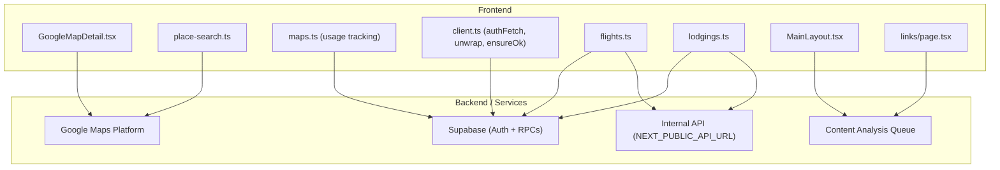
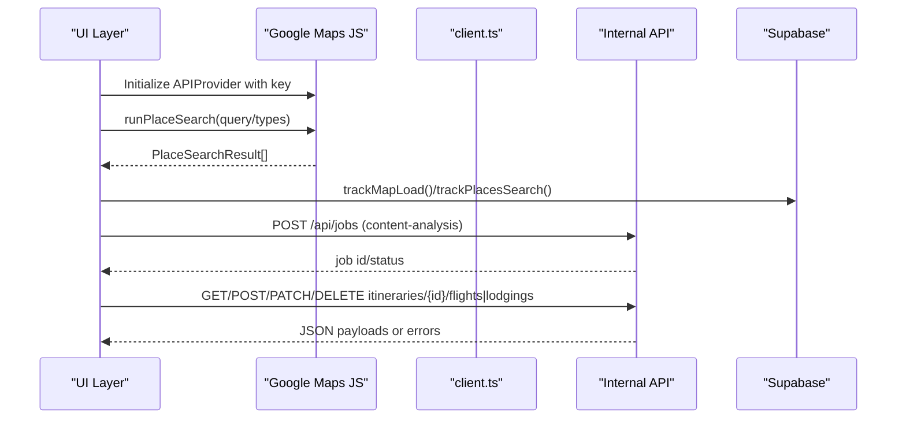
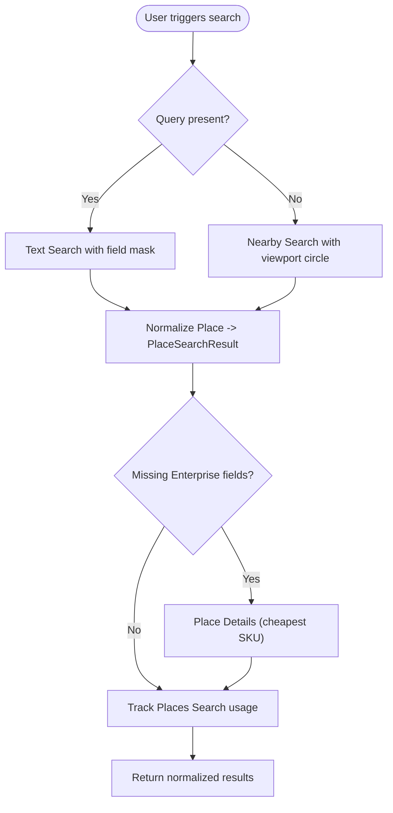
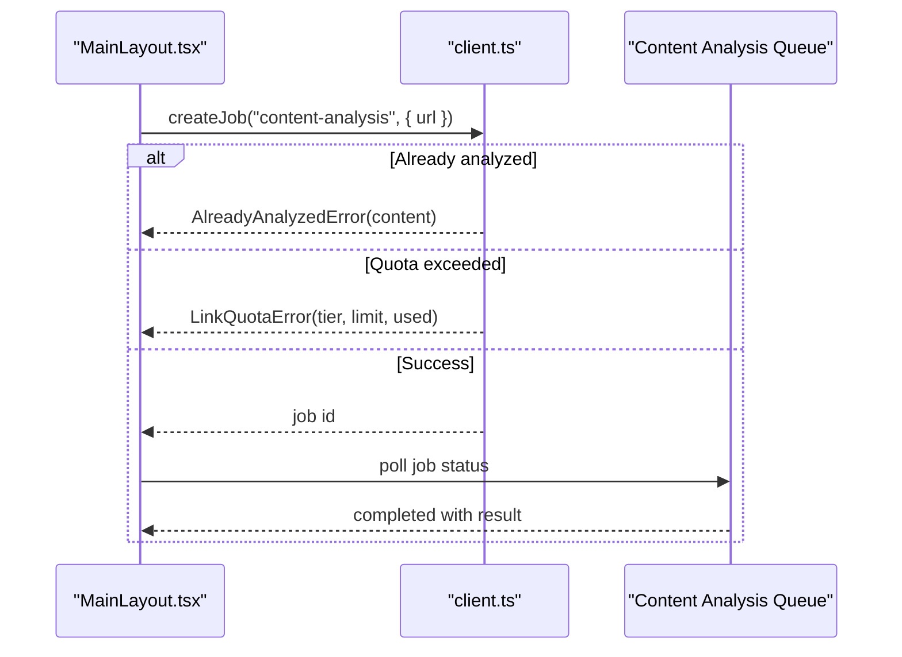
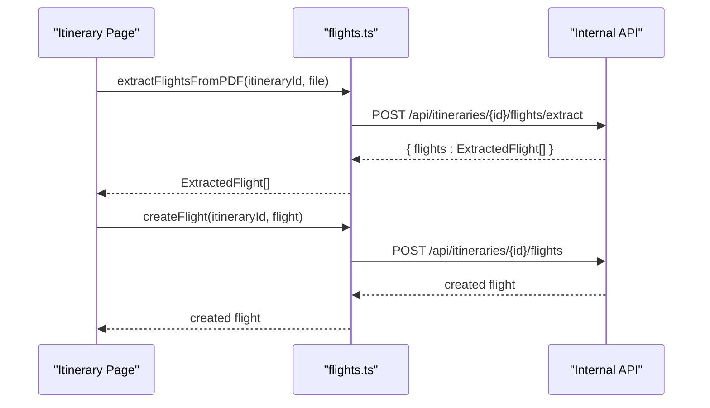
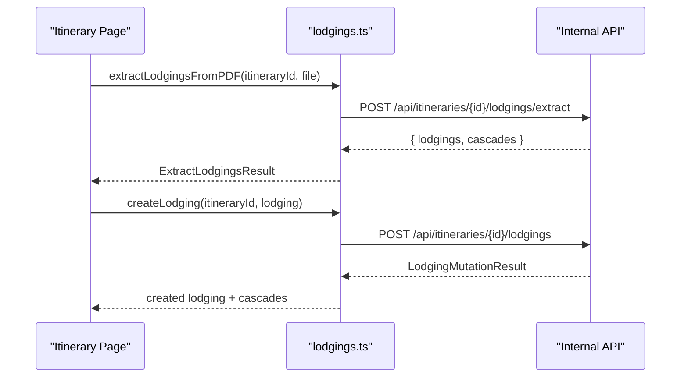
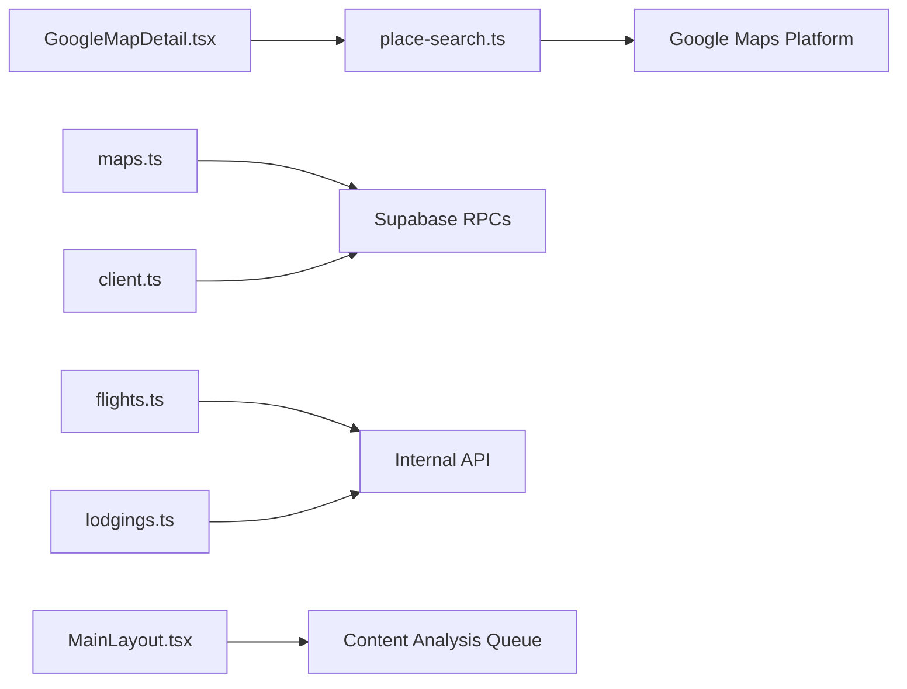

# External API Integrations

<cite>
**Referenced Files in This Document**
- [GoogleMapDetail.tsx](file://src/components/ui/map/GoogleMapDetail.tsx)
- [place-search.ts](file://src/lib/maps/place-search.ts)
- [maps.ts](file://src/lib/api/maps.ts)
- [flights.ts](file://src/lib/api/flights.ts)
- [lodgings.ts](file://src/lib/api/lodgings.ts)
- [client.ts](file://src/lib/api/client.ts)
- [MainLayout.tsx](file://src/components/ui/layout/MainLayout.tsx)
- [links/page.tsx](file://src/app/links/page.tsx)
- [usePaginatedContent.ts](file://src/hooks/usePaginatedContent.ts)
- [queries.ts](file://src/lib/supabase/queries.ts)
- [userMessages.ts](file://src/lib/errors/userMessages.ts)
- [personalization-pipeline.md](file://docs/personalization-pipeline.md)
</cite>

## Table of Contents
1. Introduction
2. Project Structure
3. Core Components
4. Architecture Overview
5. Detailed Component Analysis
6. Dependency Analysis
7. Performance Considerations
8. Troubleshooting Guide
9. Conclusion

## Introduction
This document describes all external API integrations used by the application, focusing on:
- Google Maps services (Places Search, Place Details, Photos, Autocomplete)
- Content analysis APIs (link/job queue for content extraction and enrichment)
- Flight information services (PDF upload/extraction and CRUD via backend)
- Lodging booking platforms (PDF upload/extraction and CRUD via backend)

For each integration, we specify endpoints, authentication, request/response schemas, rate limiting considerations, error handling patterns, usage examples within the app, and strategies for caching, retries, and fallbacks.

## Project Structure
External integrations are implemented across a few key areas:
- Google Maps UI and search logic: components and map utilities
- Backend API clients: authenticated fetch wrappers and typed errors
- Job queue for content analysis: create/retry/detach jobs and polling
- Itinerary resources: flights and lodgings endpoints for extraction and persistence

**Diagram sources**
- [GoogleMapDetail.tsx:23-26](file://src/components/ui/map/GoogleMapDetail.tsx#L23-L26)
- [place-search.ts:1-8](file://src/lib/maps/place-search.ts#L1-L8)
- [maps.ts:11-33](file://src/lib/api/maps.ts#L11-L33)
- [client.ts:48-83](file://src/lib/api/client.ts#L48-L83)
- [flights.ts:38-65](file://src/lib/api/flights.ts#L38-L65)
- [lodgings.ts:51-78](file://src/lib/api/lodgings.ts#L51-L78)
- [MainLayout.tsx:109-129](file://src/components/ui/layout/MainLayout.tsx#L109-L129)
- [links/page.tsx:138-170](file://src/app/links/page.tsx#L138-L170)

**Section sources**
- [GoogleMapDetail.tsx:23-26](file://src/components/ui/map/GoogleMapDetail.tsx#L23-L26)
- [place-search.ts:1-8](file://src/lib/maps/place-search.ts#L1-L8)
- [maps.ts:11-33](file://src/lib/api/maps.ts#L11-L33)
- [client.ts:48-83](file://src/lib/api/client.ts#L48-L83)
- [flights.ts:38-65](file://src/lib/api/flights.ts#L38-L65)
- [lodgings.ts:51-78](file://src/lib/api/lodgings.ts#L51-L78)
- [MainLayout.tsx:109-129](file://src/components/ui/layout/MainLayout.tsx#L109-L129)
- [links/page.tsx:138-170](file://src/app/links/page.tsx#L138-L170)

## Core Components
- Google Maps integration:
  - Map rendering with API key and map IDs from environment variables
  - Places Search (Text/Nearby) and Place Details using Maps JS library
  - Usage tracking for Places calls via Supabase RPCs
- Content analysis:
  - Create job for link analysis, retry and detach operations
  - Polling and optimistic UI updates for job progress/completion
- Flights and Lodgings:
  - PDF extraction endpoints and CRUD operations against internal API
  - Authenticated requests using Supabase session tokens

**Section sources**
- [GoogleMapDetail.tsx:23-26](file://src/components/ui/map/GoogleMapDetail.tsx#L23-L26)
- [place-search.ts:146-153](file://src/lib/maps/place-search.ts#L146-L153)
- [maps.ts:11-33](file://src/lib/api/maps.ts#L11-L33)
- [client.ts:109-150](file://src/lib/api/client.ts#L109-L150)
- [flights.ts:45-119](file://src/lib/api/flights.ts#L45-L119)
- [lodgings.ts:58-167](file://src/lib/api/lodgings.ts#L58-L167)

## Architecture Overview
The system integrates three primary external systems:
- Google Maps Platform for location search, details, photos, and autocomplete
- Internal backend API for itinerary resources (flights, lodgings) and content analysis queue
- Supabase for authentication and analytics RPCs to meter Google usage

**Diagram sources**
- [GoogleMapDetail.tsx:465-489](file://src/components/ui/map/GoogleMapDetail.tsx#L465-L489)
- [place-search.ts:393-431](file://src/lib/maps/place-search.ts#L393-L431)
- [maps.ts:11-33](file://src/lib/api/maps.ts#L11-L33)
- [client.ts:109-150](file://src/lib/api/client.ts#L109-L150)
- [flights.ts:53-65](file://src/lib/api/flights.ts#L53-L65)
- [lodgings.ts:66-78](file://src/lib/api/lodgings.ts#L66-L78)

## Detailed Component Analysis

### Google Maps Services
- Authentication:
  - API key provided via environment variable and passed to the Maps JS APIProvider
  - Usage metrics recorded through Supabase RPCs per user and globally
- Endpoints and SKUs:
  - Places Text Search and Nearby Search (Enterprise SKU when Enterprise fields requested)
  - Place Details (cheapest SKU; used to enrich Pro-tier results)
  - Place Photos (separate SKU; counted when images render)
  - Autocomplete (tracked separately)
- Request/Response Schemas:
  - PlaceSearchRequest includes query, includedTypes, nonce
  - PlaceSearchResult normalizes name, coordinates, types, address, photoUrl, rating, opening hours, phone, website, business status, links, price level/range, and raw payload
  - PlaceDetailsPayload is sent to server when adding places to avoid redundant calls
- Rate Limiting and Cost Controls:
  - Max 20 results per request; viewport radius capped at 50 km
  - Field masks deliberately include Enterprise fields to minimize extra calls
  - Usage tracked per month via RPCs for budgeting and billing
- Error Handling:
  - Analytics tracking wrapped in try/catch so failures do not break UI
  - Normalization filters out places without coordinates
- Caching Strategy:
  - Server-side cache for place searches keyed by city/query/type with 30-day TTL
  - Photos resolved late to avoid unnecessary billed calls
- Fallback Behavior:
  - If Pro-tier result lacks Enterprise fields, fetch Place Details to enrich
  - If photos unavailable, continue with text-only display

**Diagram sources**
- [place-search.ts:393-431](file://src/lib/maps/place-search.ts#L393-L431)
- [place-search.ts:177-265](file://src/lib/maps/place-search.ts#L177-L265)
- [place-search.ts:378-385](file://src/lib/maps/place-search.ts#L378-L385)
- [maps.ts:41-56](file://src/lib/api/maps.ts#L41-L56)

**Section sources**
- [GoogleMapDetail.tsx:23-26](file://src/components/ui/map/GoogleMapDetail.tsx#L23-L26)
- [place-search.ts:1-8](file://src/lib/maps/place-search.ts#L1-L8)
- [place-search.ts:146-153](file://src/lib/maps/place-search.ts#L146-L153)
- [place-search.ts:177-265](file://src/lib/maps/place-search.ts#L177-L265)
- [place-search.ts:378-385](file://src/lib/maps/place-search.ts#L378-L385)
- [place-search.ts:393-431](file://src/lib/maps/place-search.ts#L393-L431)
- [maps.ts:11-33](file://src/lib/api/maps.ts#L11-L33)
- [maps.ts:41-56](file://src/lib/api/maps.ts#L41-L56)
- [personalization-pipeline.md:278-288](file://docs/personalization-pipeline.md#L278-L288)

### Content Analysis APIs
- Purpose:
  - Analyze links to extract travel-related content (titles, thumbnails, summaries, locations)
- Endpoints:
  - Create job: POST /api/jobs with type "content-analysis" and payload { url }
  - Retry job: POST /api/jobs/{jobId}/retry
  - Detach job: PATCH /api/jobs/{jobId}/detach
- Authentication:
  - Bearer token obtained from Supabase session
- Request/Response Schemas:
  - Job creation returns job metadata; completion provides result fields like title, thumbnail, platform, summary, location_count
- Rate Limiting:
  - Quota enforcement via 402 responses; typed LinkQuotaError surfaces tier and limits
- Error Handling:
  - Already analyzed content returns 409 with content payload; handled explicitly
  - Friendly error messages mapped to safe whitelist for UI
- Caching and Retries:
  - Duplicate link detection prevents re-analysis
  - Retry mechanism available for failed jobs
- Fallback Behavior:
  - Optimistic UI updates upon job completion; graceful error notifications

**Diagram sources**
- [MainLayout.tsx:109-129](file://src/components/ui/layout/MainLayout.tsx#L109-L129)
- [client.ts:109-150](file://src/lib/api/client.ts#L109-L150)
- [links/page.tsx:138-170](file://src/app/links/page.tsx#L138-L170)

**Section sources**
- [client.ts:14-46](file://src/lib/api/client.ts#L14-L46)
- [client.ts:109-150](file://src/lib/api/client.ts#L109-L150)
- [MainLayout.tsx:109-129](file://src/components/ui/layout/MainLayout.tsx#L109-L129)
- [links/page.tsx:138-170](file://src/app/links/page.tsx#L138-L170)
- [userMessages.ts:94-106](file://src/lib/errors/userMessages.ts#L94-L106)

### Flight Information Services
- Endpoints:
  - Extract flights from PDF: POST /api/itineraries/{itineraryId}/flights/extract
  - Create flight: POST /api/itineraries/{itineraryId}/flights
  - Get flights: GET /api/itineraries/{itineraryId}/flights
- Authentication:
  - Bearer token from Supabase session
- Request/Response Schemas:
  - ExtractedFlight includes flight number, airline, dates/times, airport codes, cities, duration, confirmation, fare class, cost/currency, terminal, baggage allowance, ticket number, status, source attachment id, timestamps
- Error Handling:
  - Non-ok responses wrapped into ApiError with status code
- Caching and Retries:
  - No explicit client-side caching; rely on backend processing and eventual consistency
- Fallback Behavior:
  - UI handles missing data gracefully; airport coordinates loaded from locations table for visualization

**Diagram sources**
- [flights.ts:45-119](file://src/lib/api/flights.ts#L45-L119)

**Section sources**
- [flights.ts:6-36](file://src/lib/api/flights.ts#L6-L36)
- [flights.ts:45-119](file://src/lib/api/flights.ts#L45-L119)

### Lodging Booking Platforms
- Endpoints:
  - Extract lodgings from PDF: POST /api/itineraries/{itineraryId}/lodgings/extract
  - Create lodging: POST /api/itineraries/{itineraryId}/lodgings
  - Update lodging: PATCH /api/itineraries/{itineraryId}/lodgings/{lodgingId}
  - Delete lodging: DELETE /api/itineraries/{itineraryId}/lodgings/{lodgingId}
  - Get lodgings: GET /api/itineraries/{itineraryId}/lodgings
- Authentication:
  - Bearer token from Supabase session
- Request/Response Schemas:
  - ExtractLodgingsResult includes lodgings array and cascades (direction snapshots)
  - ExtractedLodging includes name/address, check-in/out dates/times, confirmation, cost/currency, place_id, coordinates, location_id, photo_url, source_attachment_id, timestamps
  - LodgingMutationResult extends ExtractedLodging with optional cascades
- Error Handling:
  - Non-ok responses wrapped into ApiError with status code
- Caching and Retries:
  - Cascades applied immediately to keep UI consistent without waiting for realtime events
- Fallback Behavior:
  - Missing fields handled gracefully; photo_url used for optimistic UI

**Diagram sources**
- [lodgings.ts:58-167](file://src/lib/api/lodgings.ts#L58-L167)

**Section sources**
- [lodgings.ts:7-20](file://src/lib/api/lodgings.ts#L7-L20)
- [lodgings.ts:22-49](file://src/lib/api/lodgings.ts#L22-L49)
- [lodgings.ts:58-167](file://src/lib/api/lodgings.ts#L58-L167)

## Dependency Analysis
- Google Maps:
  - UI initializes APIProvider with key; search uses Maps JS Places Library
  - Usage tracking via Supabase RPCs for monthly quotas
- Content Analysis:
  - Jobs created via authFetch; quota and duplicate checks enforced server-side
- Flights/Lodgings:
  - All requests authenticated with Supabase session token
  - Responses unwrapped into typed errors for consistent handling

**Diagram sources**
- [GoogleMapDetail.tsx:465-489](file://src/components/ui/map/GoogleMapDetail.tsx#L465-L489)
- [place-search.ts:393-431](file://src/lib/maps/place-search.ts#L393-L431)
- [maps.ts:11-33](file://src/lib/api/maps.ts#L11-L33)
- [client.ts:48-83](file://src/lib/api/client.ts#L48-L83)
- [flights.ts:53-65](file://src/lib/api/flights.ts#L53-L65)
- [lodgings.ts:66-78](file://src/lib/api/lodgings.ts#L66-L78)
- [MainLayout.tsx:109-129](file://src/components/ui/layout/MainLayout.tsx#L109-L129)

**Section sources**
- [place-search.ts:1-8](file://src/lib/maps/place-search.ts#L1-L8)
- [maps.ts:11-33](file://src/lib/api/maps.ts#L11-L33)
- [client.ts:48-83](file://src/lib/api/client.ts#L48-L83)
- [flights.ts:53-65](file://src/lib/api/flights.ts#L53-L65)
- [lodgings.ts:66-78](file://src/lib/api/lodgings.ts#L66-L78)
- [MainLayout.tsx:109-129](file://src/components/ui/layout/MainLayout.tsx#L109-L129)

## Performance Considerations
- Google Places:
  - One request returns up to ~20 places; always request Enterprise fields to minimize extra calls
  - Photos resolved only when needed to avoid billed calls during retrieval
  - Cache place searches with 30-day TTL to reduce costs
- Content Analysis:
  - Avoid re-analyzing same links; use 409 response to short-circuit
  - Quota enforcement via 402 to prevent overuse
- Flights/Lodgings:
  - Use cascades to apply travel legs and times immediately, improving perceived performance
- General:
  - Centralized error handling reduces overhead and ensures consistent UX

[No sources needed since this section provides general guidance]

## Troubleshooting Guide
- Authentication failures:
  - Ensure Supabase session exists; authFetch throws ApiError with status 401 if not authenticated
- Quota exceeded:
  - Handle LinkQuotaError to show upgrade prompts with tier and limits
- Already analyzed content:
  - Handle AlreadyAnalyzedError to navigate to existing content instead of re-processing
- Network errors:
  - Transport failures return status 0; wrap with friendly messages using getFriendlyApiError
- Google Maps issues:
  - Verify API key and map IDs; usage tracking will still work even if UI fails

**Section sources**
- [client.ts:48-83](file://src/lib/api/client.ts#L48-L83)
- [client.ts:109-150](file://src/lib/api/client.ts#L109-L150)
- [userMessages.ts:94-106](file://src/lib/errors/userMessages.ts#L94-L106)

## Conclusion
The application integrates Google Maps services, content analysis queues, and itinerary resource APIs with robust authentication, structured error handling, and cost-conscious design. Caching strategies and fallback behaviors ensure reliability and performance under varying conditions. Proper usage tracking enables budgeting and scaling as usage grows.

[No sources needed since this section summarizes without analyzing specific files]