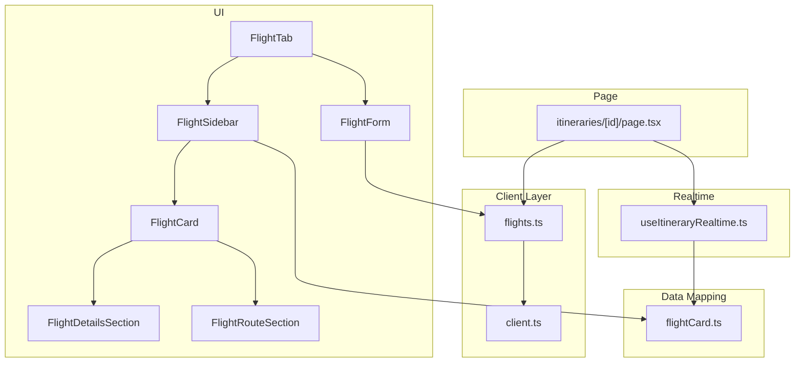
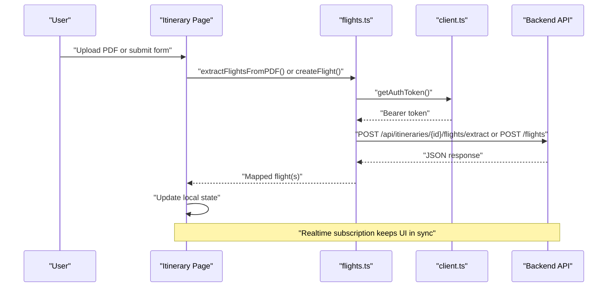
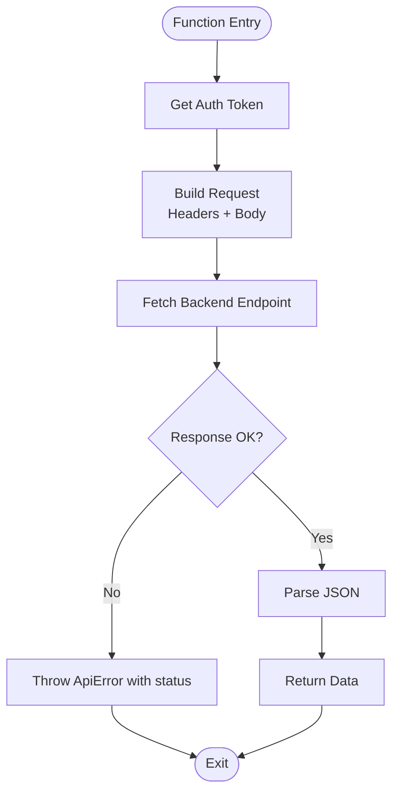
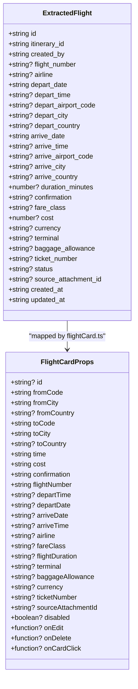
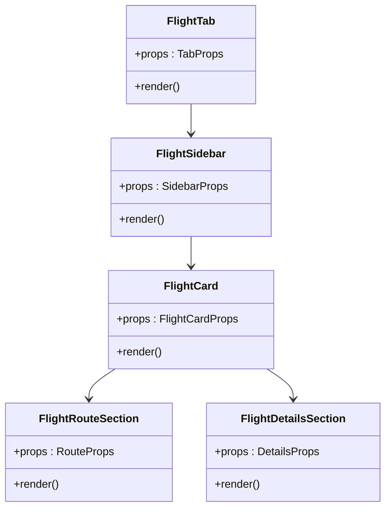
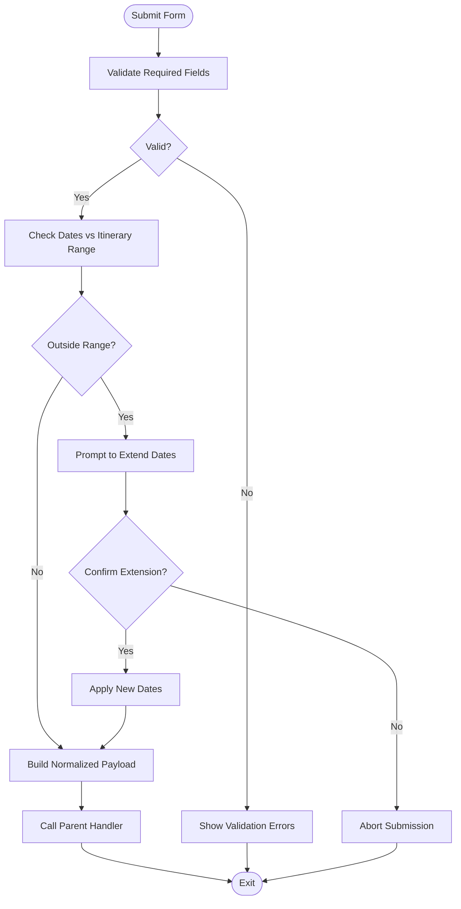
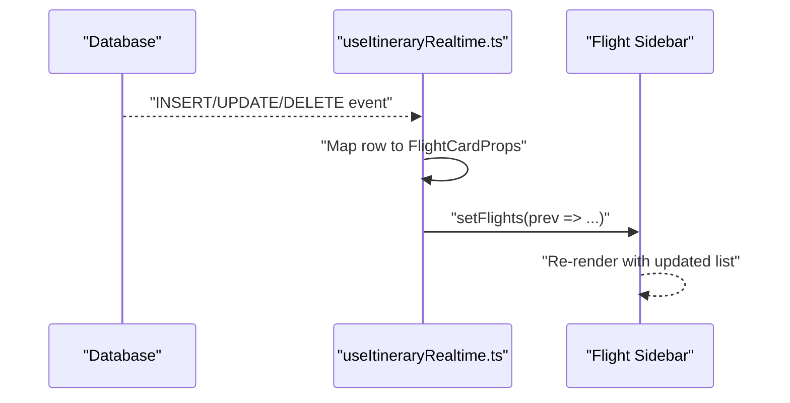
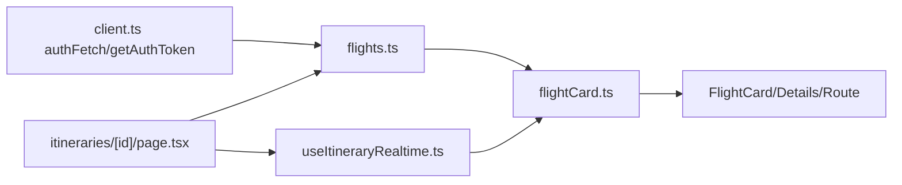

# Flight Information API

<cite>
**Referenced Files in This Document**
- [flights.ts](file://src/lib/api/flights.ts)
- [client.ts](file://src/lib/api/client.ts)
- [FlightCard.tsx](file://src/components/ui/detail-views/FlightCard.tsx)
- [FlightDetailsSection.tsx](file://src/components/ui/detail-views/FlightDetailsSection.tsx)
- [FlightRouteSection.tsx](file://src/components/ui/detail-views/FlightRouteSection.tsx)
- [FlightForm.tsx](file://src/components/ui/detail-views/FlightForm.tsx)
- [FlightSidebar.tsx](file://src/components/ui/detail-views/FlightSidebar.tsx)
- [FlightTab.tsx](file://src/components/ui/itinerary/tabs/FlightTab.tsx)
- [flightCard.ts](file://src/lib/utils/flightCard.ts)
- [useItineraryRealtime.ts](file://src/hooks/useItineraryRealtime.ts)
- [page.tsx](file://src/app/itineraries/[id]/page.tsx)
</cite>

## Table of Contents
1. [Introduction](#introduction)
2. [Project Structure](#project-structure)
3. [Core Components](#core-components)
4. [Architecture Overview](#architecture-overview)
5. [Detailed Component Analysis](#detailed-component-analysis)
6. [Dependency Analysis](#dependency-analysis)
7. [Performance Considerations](#performance-considerations)
8. [Troubleshooting Guide](#troubleshooting-guide)
9. [Conclusion](#conclusion)
10. [Appendices](#appendices)

## Introduction
This document explains how the application integrates flight information into itineraries, including extracting flights from uploaded documents, creating and listing flights, displaying flight cards with route details, handling form submissions, and keeping the UI synchronized via real-time updates. It also covers authentication, request/response schemas, data models, error handling, caching strategies, rate limiting considerations, and best practices for optimizing API calls.

## Project Structure
The flight feature spans several layers:
- API client layer: HTTP requests to the backend for flight extraction, creation, and listing.
- Data mapping: Converting server-side flight rows into UI-friendly card props.
- UI components: Cards, forms, sidebars, and tabs that render and interact with flight data.
- Real-time synchronization: Subscriptions to database changes to keep the UI current.
- Page orchestration: The itinerary page coordinates uploads, manual entry, state updates, and map rendering.

**Diagram sources**
- [FlightTab.tsx:21-31](file://src/components/ui/itinerary/tabs/FlightTab.tsx#L21-L31)
- [FlightSidebar.tsx:18-59](file://src/components/ui/detail-views/FlightSidebar.tsx#L18-L59)
- [FlightCard.tsx:43-139](file://src/components/ui/detail-views/FlightCard.tsx#L43-L139)
- [FlightDetailsSection.tsx:37-133](file://src/components/ui/detail-views/FlightDetailsSection.tsx#L37-L133)
- [FlightRouteSection.tsx:26-84](file://src/components/ui/detail-views/FlightRouteSection.tsx#L26-L84)
- [FlightForm.tsx:226-304](file://src/components/ui/detail-views/FlightForm.tsx#L226-L304)
- [flights.ts:45-119](file://src/lib/api/flights.ts#L45-L119)
- [client.ts:59-107](file://src/lib/api/client.ts#L59-L107)
- [flightCard.ts:10-44](file://src/lib/utils/flightCard.ts#L10-L44)
- [useItineraryRealtime.ts:442-479](file://src/hooks/useItineraryRealtime.ts#L442-L479)
- [page.tsx:3116-3151](file://src/app/itineraries/[id]/page.tsx#L3116-L3151)

**Section sources**
- [FlightTab.tsx:21-31](file://src/components/ui/itinerary/tabs/FlightTab.tsx#L21-L31)
- [FlightSidebar.tsx:18-59](file://src/components/ui/detail-views/FlightSidebar.tsx#L18-L59)
- [FlightCard.tsx:43-139](file://src/components/ui/detail-views/FlightCard.tsx#L43-L139)
- [FlightDetailsSection.tsx:37-133](file://src/components/ui/detail-views/FlightDetailsSection.tsx#L37-L133)
- [FlightRouteSection.tsx:26-84](file://src/components/ui/detail-views/FlightRouteSection.tsx#L26-L84)
- [FlightForm.tsx:226-304](file://src/components/ui/detail-views/FlightForm.tsx#L226-L304)
- [flights.ts:45-119](file://src/lib/api/flights.ts#L45-L119)
- [client.ts:59-107](file://src/lib/api/client.ts#L59-L107)
- [flightCard.ts:10-44](file://src/lib/utils/flightCard.ts#L10-L44)
- [useItineraryRealtime.ts:442-479](file://src/hooks/useItineraryRealtime.ts#L442-L479)
- [page.tsx:3116-3151](file://src/app/itineraries/[id]/page.tsx#L3116-L3151)

## Core Components
- Flight API client: Provides functions to extract flights from PDFs, create flights, and list flights for an itinerary. It handles authentication by retrieving a session token and attaching it as a Bearer token.
- Flight data model: A typed representation of extracted or persisted flights, including departure/arrival details, airline, cost, currency, confirmation, fare class, terminal, baggage allowance, ticket number, status, and source attachment reference.
- UI components:
  - FlightCard: Displays route and details, supports edit/delete actions, and can be interactive when linked to a source document.
  - FlightDetailsSection: Renders time, cost, booking reference, flight number, and optional secondary fields like baggage, terminal, and ticket number.
  - FlightRouteSection: Visualizes origin and destination with IATA codes, city/country labels, and optional duration.
  - FlightForm: Collects user input for manual flight entry, validates required fields, and manages date range expansion prompts.
  - FlightSidebar: Lists flights, shows loading and empty states, and wires up actions (edit, delete, open source).
  - FlightTab: Orchestrates file pills and the sidebar within the itinerary’s flight tab.
- Data mapping: Converts server-side flight rows into card props consistently across initial load, pagination, and realtime updates.
- Realtime sync: Subscribes to INSERT/UPDATE/DELETE events on the flights table to update the UI without full reloads.

**Section sources**
- [flights.ts:6-36](file://src/lib/api/flights.ts#L6-L36)
- [flights.ts:45-119](file://src/lib/api/flights.ts#L45-L119)
- [FlightCard.tsx:9-41](file://src/components/ui/detail-views/FlightCard.tsx#L9-L41)
- [FlightDetailsSection.tsx:9-26](file://src/components/ui/detail-views/FlightDetailsSection.tsx#L9-L26)
- [FlightRouteSection.tsx:6-14](file://src/components/ui/detail-views/FlightRouteSection.tsx#L6-L14)
- [FlightForm.tsx:18-43](file://src/components/ui/detail-views/FlightForm.tsx#L18-L43)
- [FlightSidebar.tsx:8-16](file://src/components/ui/detail-views/FlightSidebar.tsx#L8-L16)
- [FlightTab.tsx:8-19](file://src/components/ui/itinerary/tabs/FlightTab.tsx#L8-L19)
- [flightCard.ts:10-44](file://src/lib/utils/flightCard.ts#L10-L44)
- [useItineraryRealtime.ts:442-479](file://src/hooks/useItineraryRealtime.ts#L442-L479)

## Architecture Overview
The flight integration follows a layered architecture:
- Authentication: Each request includes a Bearer token obtained from the Supabase session.
- API endpoints:
  - Extract flights from PDF: POST /api/itineraries/{itineraryId}/flights/extract
  - Create flight: POST /api/itineraries/{itineraryId}/flights
  - List flights: GET /api/itineraries/{itineraryId}/flights
- Data flow:
  - Upload or manual form submission triggers API calls.
  - Responses are mapped to UI props and added to local state.
  - Realtime subscriptions keep the UI in sync with server-side changes.
- Error handling: Centralized helpers unwrap responses and throw typed errors with HTTP status codes.

**Diagram sources**
- [flights.ts:45-119](file://src/lib/api/flights.ts#L45-L119)
- [client.ts:48-83](file://src/lib/api/client.ts#L48-L83)
- [useItineraryRealtime.ts:442-479](file://src/hooks/useItineraryRealtime.ts#L442-L479)
- [page.tsx:3116-3151](file://src/app/itineraries/[id]/page.tsx#L3116-L3151)

## Detailed Component Analysis

### Flight API Client
- Authentication: Retrieves the current session access token and attaches it to requests.
- Endpoints:
  - Extract flights from PDF: Sends FormData with Authorization header; returns array of flights.
  - Create flight: Sends JSON payload with Authorization header; returns created flight object.
  - List flights: Returns array of flights for the itinerary.
- Error handling: Uses centralized ensureOk and unwrap to convert non-OK responses into typed errors with status codes.

**Diagram sources**
- [flights.ts:38-119](file://src/lib/api/flights.ts#L38-L119)
- [client.ts:59-107](file://src/lib/api/client.ts#L59-L107)

**Section sources**
- [flights.ts:38-119](file://src/lib/api/flights.ts#L38-L119)
- [client.ts:59-107](file://src/lib/api/client.ts#L59-L107)

### Flight Data Model and Mapping
- Data model: Defines all fields for extracted/persisted flights, including dates, times, airport codes, cities, countries, durations, costs, currencies, confirmation numbers, fare classes, terminals, baggage allowances, ticket numbers, status, and source attachment references.
- Mapping utility: Converts server rows into card props consistently, formatting times and durations and preserving source attachment IDs for interactivity.

**Diagram sources**
- [flights.ts:6-36](file://src/lib/api/flights.ts#L6-L36)
- [flightCard.ts:10-44](file://src/lib/utils/flightCard.ts#L10-L44)
- [FlightCard.tsx:9-41](file://src/components/ui/detail-views/FlightCard.tsx#L9-L41)

**Section sources**
- [flights.ts:6-36](file://src/lib/api/flights.ts#L6-L36)
- [flightCard.ts:10-44](file://src/lib/utils/flightCard.ts#L10-L44)

### Flight UI Components
- FlightCard: Composes route and details sections, supports accessibility attributes, and enables interaction when linked to a source document.
- FlightDetailsSection: Renders primary fields (cost, booking reference, flight number), optional per-leg times, and secondary fields (baggage, terminal, ticket number). Includes edit/delete menu.
- FlightRouteSection: Shows origin and destination with IATA codes, city/country labels, and optional duration.
- FlightSidebar: Handles loading and empty states, renders a list of FlightCards, and wires up actions.
- FlightTab: Combines file pills and the sidebar within the itinerary’s flight tab.

**Diagram sources**
- [FlightCard.tsx:43-139](file://src/components/ui/detail-views/FlightCard.tsx#L43-L139)
- [FlightDetailsSection.tsx:37-133](file://src/components/ui/detail-views/FlightDetailsSection.tsx#L37-L133)
- [FlightRouteSection.tsx:26-84](file://src/components/ui/detail-views/FlightRouteSection.tsx#L26-L84)
- [FlightSidebar.tsx:18-59](file://src/components/ui/detail-views/FlightSidebar.tsx#L18-L59)
- [FlightTab.tsx:21-31](file://src/components/ui/itinerary/tabs/FlightTab.tsx#L21-L31)

**Section sources**
- [FlightCard.tsx:43-139](file://src/components/ui/detail-views/FlightCard.tsx#L43-L139)
- [FlightDetailsSection.tsx:37-133](file://src/components/ui/detail-views/FlightDetailsSection.tsx#L37-L133)
- [FlightRouteSection.tsx:26-84](file://src/components/ui/detail-views/FlightRouteSection.tsx#L26-L84)
- [FlightSidebar.tsx:18-59](file://src/components/ui/detail-views/FlightSidebar.tsx#L18-L59)
- [FlightTab.tsx:21-31](file://src/components/ui/itinerary/tabs/FlightTab.tsx#L21-L31)

### Flight Form Submission Flow
- Validation: Ensures required fields (cities, flight number, departure date/time) before submission.
- Date range handling: Prompts users to extend itinerary dates if selected dates fall outside the current range.
- Submission: Builds normalized form data and invokes the parent handler to create or update flights.

**Diagram sources**
- [FlightForm.tsx:250-304](file://src/components/ui/detail-views/FlightForm.tsx#L250-L304)
- [FlightForm.tsx:393-429](file://src/components/ui/detail-views/FlightForm.tsx#L393-L429)

**Section sources**
- [FlightForm.tsx:250-304](file://src/components/ui/detail-views/FlightForm.tsx#L250-L304)
- [FlightForm.tsx:393-429](file://src/components/ui/detail-views/FlightForm.tsx#L393-L429)

### Realtime Updates for Flight Status Changes
- Subscription: When the flight sidebar is visible, subscribes to INSERT/UPDATE/DELETE events on the flights table scoped to the current itinerary.
- Sync behavior: Adds new flights, updates existing ones, and removes deleted flights from local state using the mapping utility.

**Diagram sources**
- [useItineraryRealtime.ts:442-479](file://src/hooks/useItineraryRealtime.ts#L442-L479)
- [flightCard.ts:10-44](file://src/lib/utils/flightCard.ts#L10-L44)

**Section sources**
- [useItineraryRealtime.ts:442-479](file://src/hooks/useItineraryRealtime.ts#L442-L479)
- [flightCard.ts:10-44](file://src/lib/utils/flightCard.ts#L10-L44)

## Dependency Analysis
- Authentication dependency: All flight API calls depend on obtaining a valid session token via the client helper.
- Mapping dependency: UI components rely on the mapping utility to ensure consistent prop shapes.
- Realtime dependency: The sidebar depends on the realtime hook to stay in sync with server-side changes.
- Page orchestration: The itinerary page coordinates uploads, manual entries, state updates, and map rendering based on flight data.

**Diagram sources**
- [client.ts:48-107](file://src/lib/api/client.ts#L48-L107)
- [flights.ts:45-119](file://src/lib/api/flights.ts#L45-L119)
- [flightCard.ts:10-44](file://src/lib/utils/flightCard.ts#L10-L44)
- [useItineraryRealtime.ts:442-479](file://src/hooks/useItineraryRealtime.ts#L442-L479)
- [page.tsx:3116-3151](file://src/app/itineraries/[id]/page.tsx#L3116-L3151)

**Section sources**
- [client.ts:48-107](file://src/lib/api/client.ts#L48-L107)
- [flights.ts:45-119](file://src/lib/api/flights.ts#L45-L119)
- [flightCard.ts:10-44](file://src/lib/utils/flightCard.ts#L10-L44)
- [useItineraryRealtime.ts:442-479](file://src/hooks/useItineraryRealtime.ts#L442-L479)
- [page.tsx:3116-3151](file://src/app/itineraries/[id]/page.tsx#L3116-L3151)

## Performance Considerations
- Avoid redundant network calls:
  - Use the mapping utility consistently to prevent duplicate parsing/formatting.
  - Defer heavy computations until necessary (e.g., map data only when needed).
- Realtime efficiency:
  - Subscribe only when the flight sidebar is visible to reduce overhead.
  - Ensure filters scope events to the current itinerary to minimize noise.
- Caching strategy:
  - Maintain local state for the current itinerary’s flights to avoid re-fetching on navigation.
  - For repeated reads, consider short-lived in-memory caches keyed by itinerary ID.
- Rate limiting considerations:
  - Batch operations where possible (e.g., upload multiple attachments sequentially with backoff).
  - Implement exponential backoff and retries for transient failures.
  - Respect any server-enforced quotas or limits indicated by error responses.
- Optimization tips:
  - Normalize inputs early (e.g., uppercase airport codes) to reduce server processing.
  - Minimize re-renders by memoizing derived data and avoiding unnecessary state updates.

[No sources needed since this section provides general guidance]

## Troubleshooting Guide
- Not authenticated:
  - Symptom: Requests fail due to missing or invalid session token.
  - Action: Ensure the Supabase session exists before calling flight APIs.
- Network issues:
  - Symptom: Transport errors or unreachable API.
  - Action: Catch fetch errors and present user-friendly messages; retry with backoff.
- Unavailable flights:
  - Symptom: Empty results or extraction fails.
  - Action: Log errors, show empty state, and allow manual entry as fallback.
- Quota exceeded:
  - Symptom: Server responds with quota-related codes.
  - Action: Handle specific error types and prompt upgrade or limit-aware UX.

**Section sources**
- [client.ts:48-107](file://src/lib/api/client.ts#L48-L107)
- [flights.ts:45-119](file://src/lib/api/flights.ts#L45-L119)
- [page.tsx:3116-3151](file://src/app/itineraries/[id]/page.tsx#L3116-L3151)

## Conclusion
The flight information integration combines robust API interactions, consistent data mapping, and responsive UI components to deliver a seamless experience for managing flights within itineraries. Authentication is centralized, error handling is standardized, and real-time updates keep the interface current. By following the outlined best practices—caching, efficient subscriptions, and careful rate limiting—you can optimize performance and reliability while maintaining a clear separation between concerns.

[No sources needed since this section summarizes without analyzing specific files]

## Appendices

### API Endpoints Summary
- Extract flights from PDF:
  - Method: POST
  - Path: /api/itineraries/{itineraryId}/flights/extract
  - Headers: Authorization: Bearer {token}
  - Body: FormData with file
  - Response: Array of flights
- Create flight:
  - Method: POST
  - Path: /api/itineraries/{itineraryId}/flights
  - Headers: Authorization: Bearer {token}, Content-Type: application/json
  - Body: Flight object with required fields
  - Response: Created flight object
- List flights:
  - Method: GET
  - Path: /api/itineraries/{itineraryId}/flights
  - Headers: Authorization: Bearer {token}
  - Response: Array of flights

**Section sources**
- [flights.ts:45-119](file://src/lib/api/flights.ts#L45-L119)

### Data Models Summary
- ExtractedFlight: Represents a flight row with all relevant fields, including optional and required attributes for dates, times, airports, airlines, costs, and metadata.
- FlightCardProps: UI-facing shape used by components to render route and details consistently.

**Section sources**
- [flights.ts:6-36](file://src/lib/api/flights.ts#L6-L36)
- [flightCard.ts:10-44](file://src/lib/utils/flightCard.ts#L10-L44)