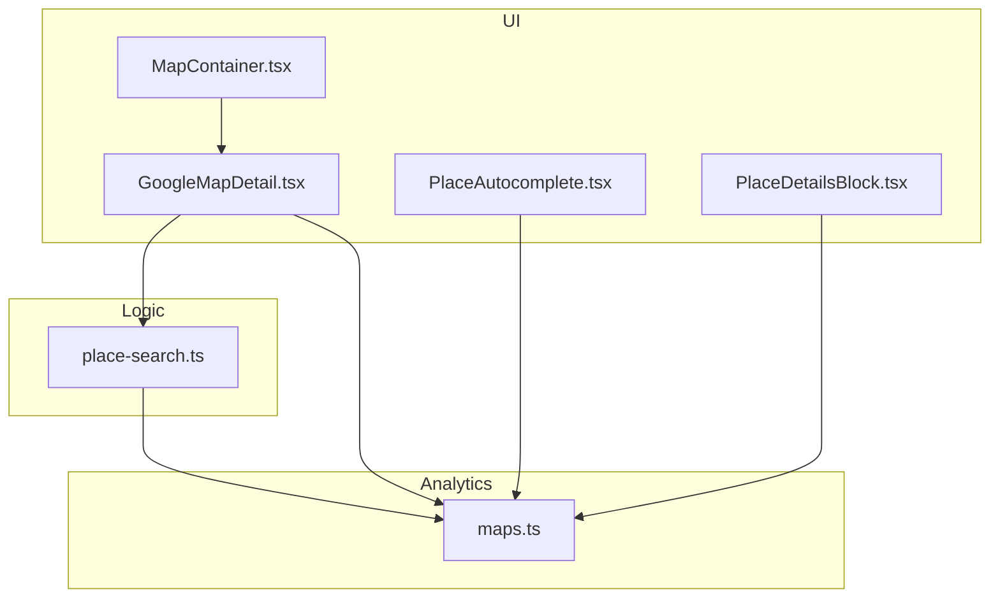
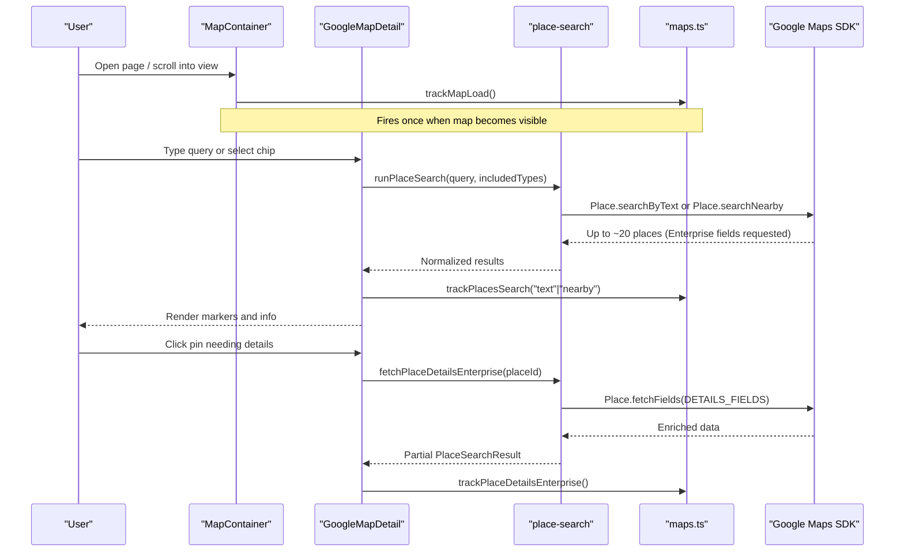
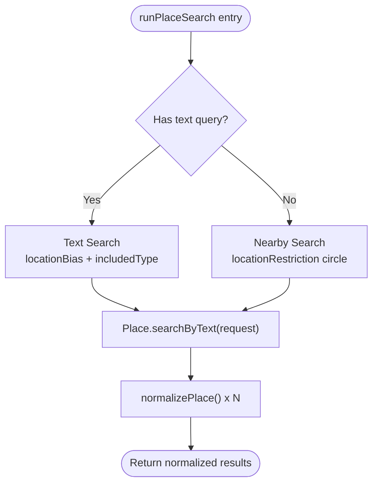
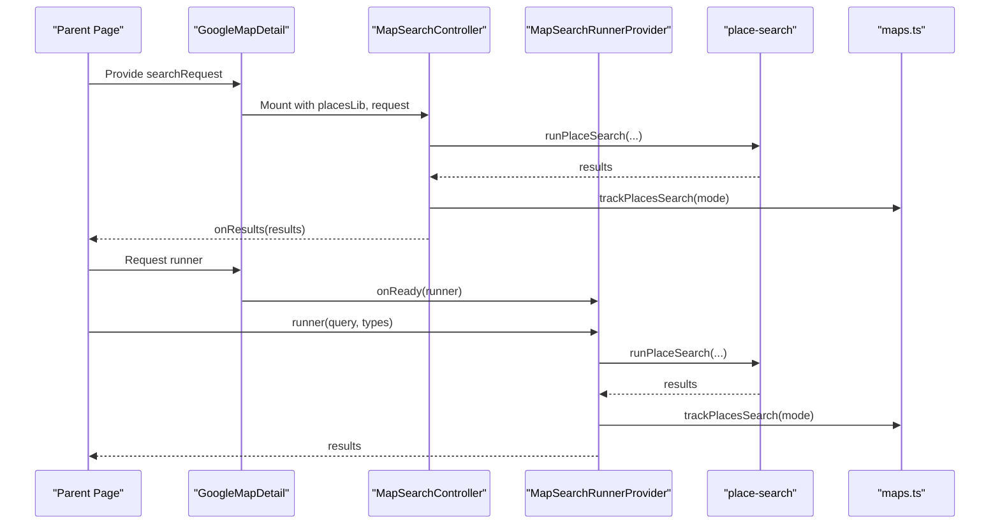
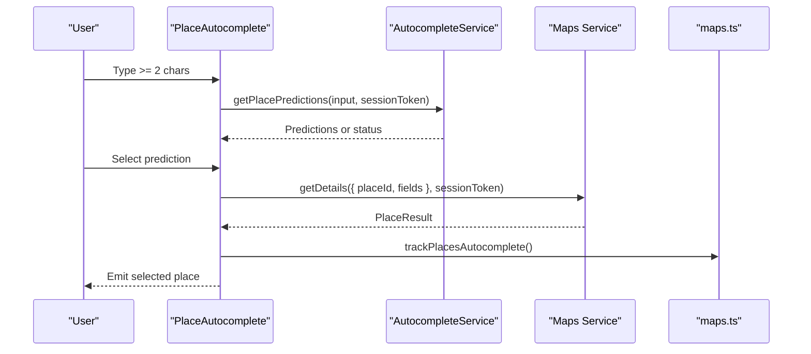
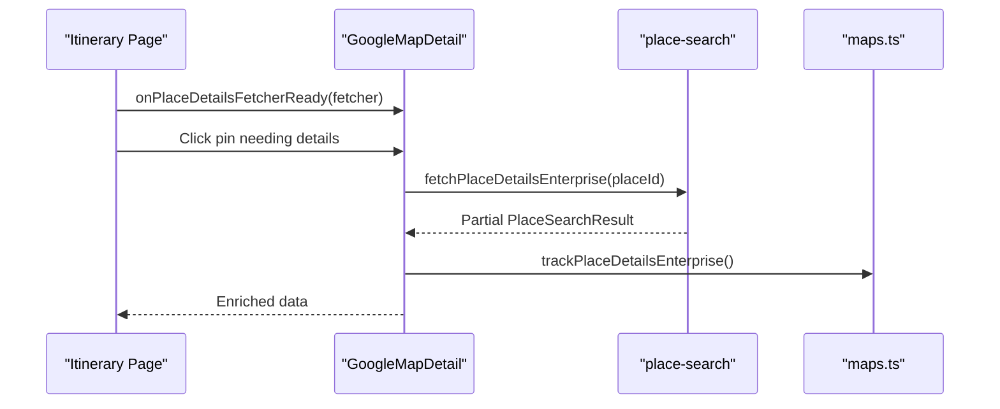
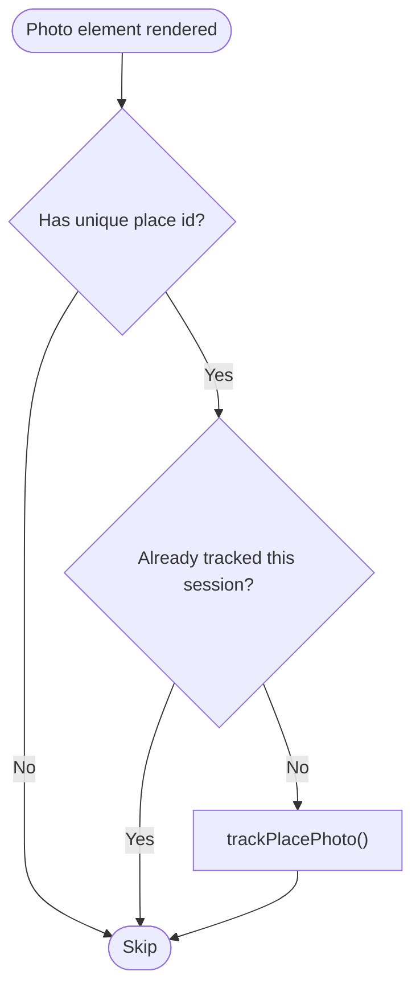
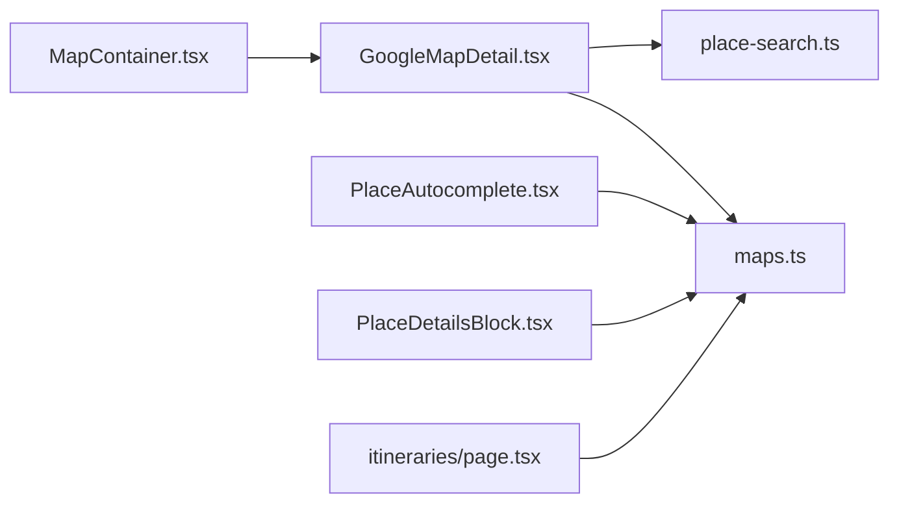

# Google Maps Integration

<cite>
**Referenced Files in This Document**
- [maps.ts](file://src/lib/api/maps.ts)
- [place-search.ts](file://src/lib/maps/place-search.ts)
- [GoogleMapDetail.tsx](file://src/components/ui/map/GoogleMapDetail.tsx)
- [MapContainer.tsx](file://src/components/ui/map/MapContainer.tsx)
- [PlaceAutocomplete.tsx](file://src/components/ui/primitives/PlaceAutocomplete.tsx)
- [PlaceDetailsBlock.tsx](file://src/components/ui/itinerary/PlaceDetailsBlock.tsx)
- [page.tsx](file://src/app/itineraries/[id]/page.tsx)
</cite>

## Table of Contents
1. [Introduction](#introduction)
2. [Project Structure](#project-structure)
3. [Core Components](#core-components)
4. [Architecture Overview](#architecture-overview)
5. [Detailed Component Analysis](#detailed-component-analysis)
6. [Dependency Analysis](#dependency-analysis)
7. [Performance Considerations](#performance-considerations)
8. [Troubleshooting Guide](#troubleshooting-guide)
9. [Conclusion](#conclusion)

## Introduction
This document explains how the application integrates Google Maps for place search, autocomplete, and location services, and how it tracks API usage to optimize billing between Enterprise and Pro tiers. It covers:
- Place search with text and nearby queries
- Autocomplete functionality
- Place details requests and enrichment
- Analytics tracking functions that record map loads, place searches, place details calls, and photo loads
- Billing optimization strategies that minimize costs by choosing the most efficient SKU per interaction
- Error handling patterns and fallback behaviors when Google Maps services are unavailable

## Project Structure
The Google Maps integration spans a small set of focused modules:
- Analytics tracking utilities for billing and usage metrics
- Place search logic using the Google Places (New) API via the Maps JS SDK
- Map components that orchestrate search, markers, and user interactions
- Autocomplete component for region/country selection
- Place details rendering and photo billing triggers

**Diagram sources**
- [MapContainer.tsx:40-54](file://src/components/ui/map/MapContainer.tsx#L40-L54)
- [GoogleMapDetail.tsx:116-184](file://src/components/ui/map/GoogleMapDetail.tsx#L116-L184)
- [place-search.ts:393-468](file://src/lib/maps/place-search.ts#L393-L468)
- [maps.ts:11-119](file://src/lib/api/maps.ts#L11-L119)
- [PlaceAutocomplete.tsx:115-184](file://src/components/ui/primitives/PlaceAutocomplete.tsx#L115-L184)
- [PlaceDetailsBlock.tsx:112-116](file://src/components/ui/itinerary/PlaceDetailsBlock.tsx#L112-L116)

**Section sources**
- [MapContainer.tsx:40-54](file://src/components/ui/map/MapContainer.tsx#L40-L54)
- [GoogleMapDetail.tsx:116-184](file://src/components/ui/map/GoogleMapDetail.tsx#L116-L184)
- [place-search.ts:393-468](file://src/lib/maps/place-search.ts#L393-L468)
- [maps.ts:11-119](file://src/lib/api/maps.ts#L11-L119)
- [PlaceAutocomplete.tsx:115-184](file://src/components/ui/primitives/PlaceAutocomplete.tsx#L115-L184)
- [PlaceDetailsBlock.tsx:112-116](file://src/components/ui/itinerary/PlaceDetailsBlock.tsx#L112-L116)

## Core Components
- Place search engine: Executes Text Search or Nearby Search based on query presence, normalizes results, and returns up to 20 places per request.
- Map controllers: Manage viewport-based searches, expose runners/fetchers to parent pages, and render result markers.
- Autocomplete: Provides region/country suggestions and resolves selected predictions to coordinates.
- Place details renderer: Displays rich information and triggers photo billing only when photos actually render.
- Analytics tracker: Records map loads, place searches, place details, and photo loads to Supabase RPCs for billing and analytics.

Key responsibilities:
- Minimize API calls by requesting Enterprise fields in search to avoid extra Place Details calls where possible
- Track each billed SKU accurately at the right moment (search, details, photo load)
- Provide robust error handling so UI remains functional even if tracking fails

**Section sources**
- [place-search.ts:1-8](file://src/lib/maps/place-search.ts#L1-L8)
- [place-search.ts:91-133](file://src/lib/maps/place-search.ts#L91-L133)
- [place-search.ts:393-468](file://src/lib/maps/place-search.ts#L393-L468)
- [GoogleMapDetail.tsx:116-184](file://src/components/ui/map/GoogleMapDetail.tsx#L116-L184)
- [PlaceAutocomplete.tsx:115-184](file://src/components/ui/primitives/PlaceAutocomplete.tsx#L115-L184)
- [PlaceDetailsBlock.tsx:112-116](file://src/components/ui/itinerary/PlaceDetailsBlock.tsx#L112-L116)
- [maps.ts:11-119](file://src/lib/api/maps.ts#L11-L119)

## Architecture Overview
The system uses the Google Maps JavaScript library to perform place searches and autocomplete. The map container lazily renders the map and tracks its first load. When a user types or filters by category chips, the map controller runs a single search call against the current viewport. Results are normalized and displayed as markers. If a result lacks Enterprise-tier fields, a separate Place Details call can enrich it. Autocomplete uses session tokens to group related queries and reduce costs. Photo loading is tracked only when images render to avoid double-counting.

**Diagram sources**
- [MapContainer.tsx:50-54](file://src/components/ui/map/MapContainer.tsx#L50-L54)
- [GoogleMapDetail.tsx:126-148](file://src/components/ui/map/GoogleMapDetail.tsx#L126-L148)
- [GoogleMapDetail.tsx:164-184](file://src/components/ui/map/GoogleMapDetail.tsx#L164-L184)
- [place-search.ts:393-468](file://src/lib/maps/place-search.ts#L393-L468)
- [place-search.ts:378-385](file://src/lib/maps/place-search.ts#L378-L385)
- [maps.ts:11-119](file://src/lib/api/maps.ts#L11-L119)

## Detailed Component Analysis

### Place Search Engine
- Determines mode:
  - Text query present → Text Search with viewport bias
  - No text query → Nearby Search restricted to a viewport-derived circle
- Always requests Enterprise fields to maximize value per request and reduce subsequent Place Details calls
- Normalizes results to a consistent shape, including photos, opening hours, price level, and metadata
- Caps radius to safe bounds and limits results to 20 per call

**Diagram sources**
- [place-search.ts:393-468](file://src/lib/maps/place-search.ts#L393-L468)
- [place-search.ts:155-175](file://src/lib/maps/place-search.ts#L155-L175)
- [place-search.ts:177-265](file://src/lib/maps/place-search.ts#L177-L265)

**Section sources**
- [place-search.ts:91-133](file://src/lib/maps/place-search.ts#L91-L133)
- [place-search.ts:155-175](file://src/lib/maps/place-search.ts#L155-L175)
- [place-search.ts:177-265](file://src/lib/maps/place-search.ts#L177-L265)
- [place-search.ts:393-468](file://src/lib/maps/place-search.ts#L393-L468)

### Map Search Controller and Runner
- Runs searches inside the map context where viewport is available
- Tracks the billed search type ("text" vs "nearby") after successful results
- Exposes a runner to parent pages for add-location flows and ensures tracking occurs consistently

**Diagram sources**
- [GoogleMapDetail.tsx:116-184](file://src/components/ui/map/GoogleMapDetail.tsx#L116-L184)
- [maps.ts:41-56](file://src/lib/api/maps.ts#L41-L56)

**Section sources**
- [GoogleMapDetail.tsx:116-184](file://src/components/ui/map/GoogleMapDetail.tsx#L116-L184)

### Autocomplete
- Uses AutocompleteService with session tokens to group related queries and reduce costs
- Debounces input to limit network calls
- On selection, resolves full details and tracks an autocomplete event

**Diagram sources**
- [PlaceAutocomplete.tsx:115-184](file://src/components/ui/primitives/PlaceAutocomplete.tsx#L115-L184)
- [maps.ts:96-119](file://src/lib/api/maps.ts#L96-L119)

**Section sources**
- [PlaceAutocomplete.tsx:115-184](file://src/components/ui/primitives/PlaceAutocomplete.tsx#L115-L184)
- [maps.ts:96-119](file://src/lib/api/maps.ts#L96-L119)

### Place Details and Enrichment
- For results missing Enterprise fields, a targeted Place Details call fetches rich data
- The page triggers this enrichment when needed and records the call
- A helper determines whether a result needs enrichment

**Diagram sources**
- [GoogleMapDetail.tsx:321-327](file://src/components/ui/map/GoogleMapDetail.tsx#L321-L327)
- [place-search.ts:378-385](file://src/lib/maps/place-search.ts#L378-L385)
- [maps.ts:63-75](file://src/lib/api/maps.ts#L63-L75)
- [page.tsx:48-569](file://src/app/itineraries/[id]/page.tsx#L48-L569)

**Section sources**
- [place-search.ts:361-385](file://src/lib/maps/place-search.ts#L361-L385)
- [GoogleMapDetail.tsx:321-327](file://src/components/ui/map/GoogleMapDetail.tsx#L321-L327)
- [page.tsx:48-569](file://src/app/itineraries/[id]/page.tsx#L48-L569)

### Photo Loading Tracking
- Photos bill a separate SKU; tracking fires only when an image actually renders
- Deduplicates per place ID within a session to prevent double-counting

**Diagram sources**
- [PlaceDetailsBlock.tsx:39-41](file://src/components/ui/itinerary/PlaceDetailsBlock.tsx#L39-L41)
- [PlaceDetailsBlock.tsx:112-116](file://src/components/ui/itinerary/PlaceDetailsBlock.tsx#L112-L116)
- [maps.ts:82-94](file://src/lib/api/maps.ts#L82-L94)

**Section sources**
- [PlaceDetailsBlock.tsx:39-41](file://src/components/ui/itinerary/PlaceDetailsBlock.tsx#L39-L41)
- [PlaceDetailsBlock.tsx:112-116](file://src/components/ui/itinerary/PlaceDetailsBlock.tsx#L112-L116)
- [maps.ts:82-94](file://src/lib/api/maps.ts#L82-L94)

## Dependency Analysis
- MapContainer lazily loads GoogleMapDetail and tracks map load when visible
- GoogleMapDetail depends on place-search for search execution and maps.ts for analytics
- PlaceAutocomplete depends on maps.ts for autocomplete tracking
- PlaceDetailsBlock depends on maps.ts for photo tracking
- Itinerary page orchestrates enrichment and triggers enterprise details tracking

**Diagram sources**
- [MapContainer.tsx:40-54](file://src/components/ui/map/MapContainer.tsx#L40-L54)
- [GoogleMapDetail.tsx:116-184](file://src/components/ui/map/GoogleMapDetail.tsx#L116-L184)
- [place-search.ts:393-468](file://src/lib/maps/place-search.ts#L393-L468)
- [maps.ts:11-119](file://src/lib/api/maps.ts#L11-L119)
- [PlaceAutocomplete.tsx:115-184](file://src/components/ui/primitives/PlaceAutocomplete.tsx#L115-L184)
- [PlaceDetailsBlock.tsx:112-116](file://src/components/ui/itinerary/PlaceDetailsBlock.tsx#L112-L116)
- [page.tsx:48-569](file://src/app/itineraries/[id]/page.tsx#L48-L569)

**Section sources**
- [MapContainer.tsx:40-54](file://src/components/ui/map/MapContainer.tsx#L40-L54)
- [GoogleMapDetail.tsx:116-184](file://src/components/ui/map/GoogleMapDetail.tsx#L116-L184)
- [place-search.ts:393-468](file://src/lib/maps/place-search.ts#L393-L468)
- [maps.ts:11-119](file://src/lib/api/maps.ts#L11-L119)
- [PlaceAutocomplete.tsx:115-184](file://src/components/ui/primitives/PlaceAutocomplete.tsx#L115-L184)
- [PlaceDetailsBlock.tsx:112-116](file://src/components/ui/itinerary/PlaceDetailsBlock.tsx#L112-L116)
- [page.tsx:48-569](file://src/app/itineraries/[id]/page.tsx#L48-L569)

## Performance Considerations
- One search call returns up to ~20 places; always request Enterprise fields to avoid extra Place Details calls later
- Use viewport bias/restriction to keep results relevant and reduce wasted calls
- Debounce autocomplete input to reduce network churn
- Track photo billing only on actual render and deduplicate per session
- Lazy-load map to avoid unnecessary initialization until visible

[No sources needed since this section provides general guidance]

## Troubleshooting Guide
Common issues and mitigations:
- Tracking failures do not break UI: all tracking functions wrap calls in try/catch and silently ignore errors
- Autocomplete status handling: if predictions fail, dropdown closes and state resets
- Map search errors: catch blocks log errors and clear results to maintain UI stability
- Missing Enterprise fields: use enrichment path to fetch details on demand

Operational tips:
- Verify environment variables for API keys and map IDs
- Ensure the map is visible before expecting map load tracking
- Confirm session token reuse in autocomplete to benefit from cost grouping

**Section sources**
- [maps.ts:30-33](file://src/lib/api/maps.ts#L30-L33)
- [maps.ts:53-56](file://src/lib/api/maps.ts#L53-L56)
- [maps.ts:72-75](file://src/lib/api/maps.ts#L72-L75)
- [maps.ts:91-94](file://src/lib/api/maps.ts#L91-L94)
- [maps.ts:115-119](file://src/lib/api/maps.ts#L115-L119)
- [GoogleMapDetail.tsx:141-146](file://src/components/ui/map/GoogleMapDetail.tsx#L141-L146)
- [PlaceAutocomplete.tsx:131-138](file://src/components/ui/primitives/PlaceAutocomplete.tsx#L131-L138)

## Conclusion
The integration leverages Google’s Places (New) API efficiently by consolidating data retrieval into fewer, richer calls and tracking each billed SKU precisely. Map loads, place searches, place details, and photo loads are recorded to support accurate billing and analytics. Autocomplete uses session tokens to reduce costs. Robust error handling ensures the UI remains responsive even when tracking or external services encounter issues.

[No sources needed since this section summarizes without analyzing specific files]