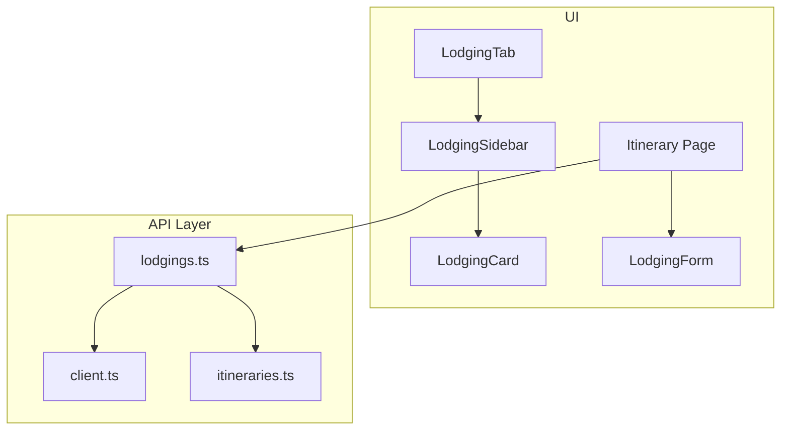
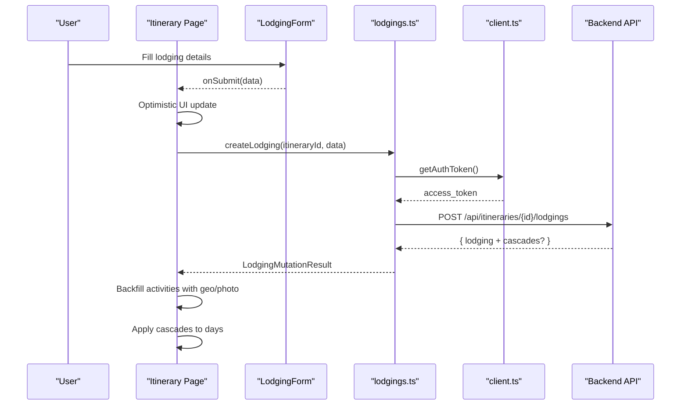
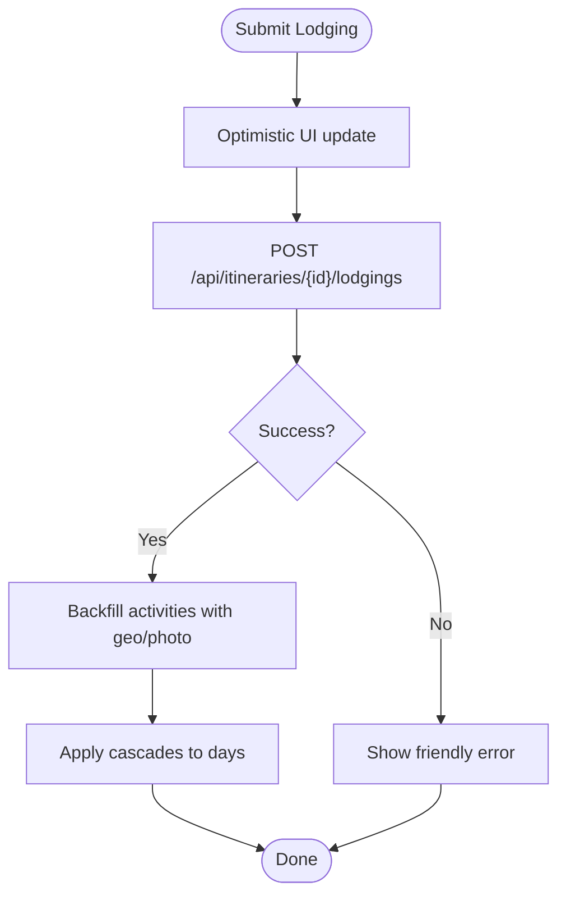
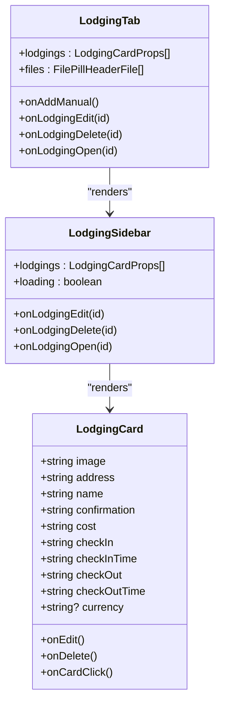
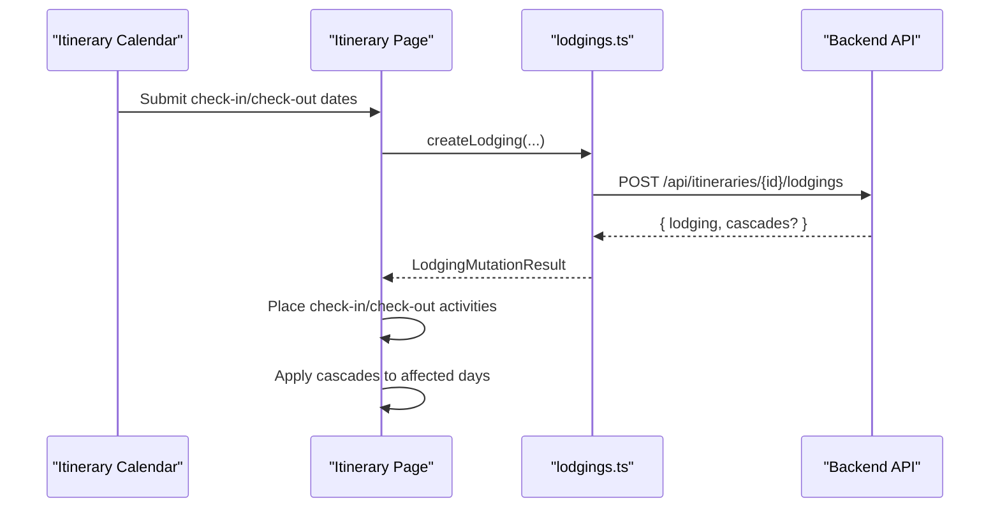
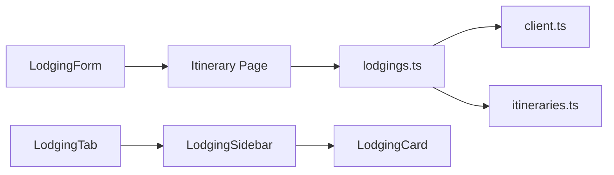

# Lodging Booking API

<cite>
**Referenced Files in This Document**
- [lodgings.ts](file://src/lib/api/lodgings.ts)
- [client.ts](file://src/lib/api/client.ts)
- [itineraries.ts](file://src/lib/api/itineraries.ts)
- [page.tsx](file://src/app/itineraries/[id]/page.tsx)
- [LodgingForm.tsx](file://src/components/ui/detail-views/LodgingForm.tsx)
- [LodgingCard.tsx](file://src/components/ui/detail-views/LodgingCard.tsx)
- [LodgingSidebar.tsx](file://src/components/ui/detail-views/LodgingSidebar.tsx)
- [LodgingTab.tsx](file://src/components/ui/itinerary/tabs/LodgingTab.tsx)
</cite>

## Table of Contents
1. [Introduction](#introduction)
2. [Project Structure](#project-structure)
3. [Core Components](#core-components)
4. [Architecture Overview](#architecture-overview)
5. [Detailed Component Analysis](#detailed-component-analysis)
6. [Dependency Analysis](#dependency-analysis)
7. [Performance Considerations](#performance-considerations)
8. [Troubleshooting Guide](#troubleshooting-guide)
9. [Conclusion](#conclusion)

## Introduction
This document explains the lodging booking integration implemented in the application. It covers how users add, extract, view, update, and delete lodging entries within an itinerary, how authentication is handled, and how the UI renders lodging cards and forms. It also describes availability-related workflows (check-in/check-out dates), price display logic, and confirmation handling. Where server-side availability checking or external payment processing is not present in this codebase, we clarify what exists and what would be required to extend it.

## Project Structure
The lodging feature spans a small set of focused modules:
- API client layer for lodging operations and shared HTTP helpers
- Itinerary page that orchestrates manual lodging creation and calendar updates
- UI components for form input, card display, sidebar listing, and tab integration

**Diagram sources**
- [LodgingTab.tsx:21-31](file://src/components/ui/itinerary/tabs/LodgingTab.tsx#L21-L31)
- [LodgingSidebar.tsx:21-70](file://src/components/ui/detail-views/LodgingSidebar.tsx#L21-L70)
- [LodgingCard.tsx:47-172](file://src/components/ui/detail-views/LodgingCard.tsx#L47-L172)
- [LodgingForm.tsx:156-185](file://src/components/ui/detail-views/LodgingForm.tsx#L156-L185)
- [page.tsx:2707-2899](file://src/app/itineraries/[id]/page.tsx#L2707-L2899)
- [lodgings.ts:58-167](file://src/lib/api/lodgings.ts#L58-L167)
- [client.ts:59-107](file://src/lib/api/client.ts#L59-L107)
- [itineraries.ts:162-206](file://src/lib/api/itineraries.ts#L162-L206)

**Section sources**
- [LodgingTab.tsx:21-31](file://src/components/ui/itinerary/tabs/LodgingTab.tsx#L21-L31)
- [LodgingSidebar.tsx:21-70](file://src/components/ui/detail-views/LodgingSidebar.tsx#L21-L70)
- [LodgingCard.tsx:47-172](file://src/components/ui/detail-views/LodgingCard.tsx#L47-L172)
- [LodgingForm.tsx:156-185](file://src/components/ui/detail-views/LodgingForm.tsx#L156-L185)
- [page.tsx:2707-2899](file://src/app/itineraries/[id]/page.tsx#L2707-L2899)
- [lodgings.ts:58-167](file://src/lib/api/lodgings.ts#L58-L167)
- [client.ts:59-107](file://src/lib/api/client.ts#L59-L107)
- [itineraries.ts:162-206](file://src/lib/api/itineraries.ts#L162-L206)

## Core Components
- Lodging API client: Provides functions to extract lodgings from PDFs, list, create, update, and delete lodging entries for an itinerary. All requests are authenticated via Supabase session tokens.
- Shared HTTP utilities: Centralized token retrieval, request headers, error unwrapping, and status validation.
- Itinerary page integration: Handles manual lodging submission, optimistic UI updates, and backfills activities with geolocation and photo data returned by the server. Also applies server-provided “cascades” to compute travel legs and times around check-in/check-out anchors.
- UI components: A form for entering lodging details; a card for displaying lodging information; a sidebar listing; and a tab container integrating file pills and the lodging list.

Key responsibilities:
- Authentication: Bearer token from Supabase session attached to all requests.
- Data model: Lodging entries include name, address, check-in/out dates and times, confirmation code, cost/currency, optional location metadata, and source attachment linkage.
- Availability workflow: The app uses check-in/check-out dates to place activities on the itinerary calendar; server cascades can adjust surrounding activity times and travel legs.
- Price display: Cost is stored as a numeric string and displayed alongside currency when present.

**Section sources**
- [lodgings.ts:22-49](file://src/lib/api/lodgings.ts#L22-L49)
- [lodgings.ts:58-167](file://src/lib/api/lodgings.ts#L58-L167)
- [client.ts:48-107](file://src/lib/api/client.ts#L48-L107)
- [page.tsx:2707-2899](file://src/app/itineraries/[id]/page.tsx#L2707-L2899)
- [LodgingForm.tsx:16-33](file://src/components/ui/detail-views/LodgingForm.tsx#L16-L33)
- [LodgingCard.tsx:10-36](file://src/components/ui/detail-views/LodgingCard.tsx#L10-L36)

## Architecture Overview
The lodging flow integrates UI, API client, and server endpoints under a single itinerary context.

**Diagram sources**
- [page.tsx:2707-2899](file://src/app/itineraries/[id]/page.tsx#L2707-L2899)
- [lodgings.ts:137-167](file://src/lib/api/lodgings.ts#L137-L167)
- [client.ts:48-83](file://src/lib/api/client.ts#L48-L83)

## Detailed Component Analysis

### API Endpoints and Data Model
- Extract lodgings from PDF
  - Method: POST
  - Path: /api/itineraries/{itineraryId}/lodgings/extract
  - Headers: Authorization: Bearer {token}
  - Body: multipart/form-data with file field
  - Response: { lodgings: ExtractedLodging[], cascades?: CascadeResult[] }
- List lodgings
  - Method: GET
  - Path: /api/itineraries/{itineraryId}/lodgings
  - Headers: Authorization: Bearer {token}
  - Response: ExtractedLodging[]
- Create lodging
  - Method: POST
  - Path: /api/itineraries/{itineraryId}/lodgings
  - Headers: Authorization: Bearer {token}, Content-Type: application/json
  - Body: { name?, address?, check_in_date, check_in_time?, check_out_date, check_out_time?, confirmation?, cost?, currency? }
  - Response: LodgingMutationResult = ExtractedLodging & { cascades? }
- Update lodging
  - Method: PATCH
  - Path: /api/itineraries/{itineraryId}/lodgings/{lodgingId}
  - Headers: Authorization: Bearer {token}, Content-Type: application/json
  - Body: Partial lodging fields
  - Response: LodgingMutationResult
- Delete lodging
  - Method: DELETE
  - Path: /api/itineraries/{itineraryId}/lodgings/{lodgingId}
  - Headers: Authorization: Bearer {token}
  - Response: No content (handled via ensureOk)

Data structures:
- ExtractedLodging includes id, itinerary_id, created_by, name, address, check_in_date, check_in_time, check_out_date, check_out_time, confirmation, cost, currency, display_in_itinerary, place_id, latitude, longitude, location_id, photo_url, source_attachment_id, created_at, updated_at.
- CascadeResult contains day_id, activities (CascadedActivity[]), and optional source_day snapshot. CascadedActivity includes start_time, end_time, travel_mode, travel_duration_seconds, travel_distance_meters, travel_polyline.

Authentication:
- All endpoints require a Supabase session access token passed as Authorization: Bearer {token}.
- Token retrieval is centralized in the client module; missing token yields a 401 error.

Error handling:
- Non-OK responses are converted into typed ApiError with numeric status and message.
- Transport failures (no Response) are caught and rethrown.

Availability and pricing:
- Availability is represented by check-in/check-out dates and times. The UI places check-in/check-out activities on the itinerary calendar based on these dates.
- Price display combines cost (numeric string) with currency for presentation.

**Section sources**
- [lodgings.ts:58-167](file://src/lib/api/lodgings.ts#L58-L167)
- [lodgings.ts:22-49](file://src/lib/api/lodgings.ts#L22-L49)
- [itineraries.ts:162-206](file://src/lib/api/itineraries.ts#L162-L206)
- [client.ts:59-107](file://src/lib/api/client.ts#L59-L107)

### Manual Lodging Submission Flow
When a user submits the lodging form:
- The page creates an optimistic card and inserts check-in/check-out activities into the calendar.
- It calls createLodging to persist the entry.
- On success, it backfills activities with geolocation and photo data returned by the server.
- It applies any server-provided cascades to adjust surrounding activities’ times and travel legs.

**Diagram sources**
- [page.tsx:2707-2899](file://src/app/itineraries/[id]/page.tsx#L2707-L2899)
- [lodgings.ts:137-167](file://src/lib/api/lodgings.ts#L137-L167)

**Section sources**
- [page.tsx:2707-2899](file://src/app/itineraries/[id]/page.tsx#L2707-L2899)
- [LodgingForm.tsx:156-185](file://src/components/ui/detail-views/LodgingForm.tsx#L156-L185)

### Lodging Card and Sidebar
- LodgingCard displays name, address, check-in/out times, cost with currency, and booking reference. It supports edit/delete actions and optional interactivity to open the source attachment.
- LodgingSidebar lists multiple lodging cards with loading and empty states, and forwards events to parent handlers.
- LodgingTab composes file pills and the lodging sidebar within the itinerary’s lodging tab.

**Diagram sources**
- [LodgingCard.tsx:10-36](file://src/components/ui/detail-views/LodgingCard.tsx#L10-L36)
- [LodgingSidebar.tsx:9-17](file://src/components/ui/detail-views/LodgingSidebar.tsx#L9-L17)
- [LodgingTab.tsx:8-18](file://src/components/ui/itinerary/tabs/LodgingTab.tsx#L8-L18)

**Section sources**
- [LodgingCard.tsx:47-172](file://src/components/ui/detail-views/LodgingCard.tsx#L47-L172)
- [LodgingSidebar.tsx:21-70](file://src/components/ui/detail-views/LodgingSidebar.tsx#L21-L70)
- [LodgingTab.tsx:21-31](file://src/components/ui/itinerary/tabs/LodgingTab.tsx#L21-L31)

### Availability Checking Workflow
- The application models availability through check-in/check-out date/time fields. These drive placement of check-in and check-out activities on the itinerary calendar.
- The server may return cascades that adjust surrounding activities’ times and travel legs based on new lodging anchors. The client applies these cascades to keep the schedule consistent.
- There is no explicit “availability query” endpoint in this codebase; availability is inferred from the presence and timing of check-in/check-out activities.

**Diagram sources**
- [page.tsx:2707-2899](file://src/app/itineraries/[id]/page.tsx#L2707-L2899)
- [lodgings.ts:137-167](file://src/lib/api/lodgings.ts#L137-L167)
- [itineraries.ts:162-206](file://src/lib/api/itineraries.ts#L162-L206)

**Section sources**
- [page.tsx:2707-2899](file://src/app/itineraries/[id]/page.tsx#L2707-L2899)
- [itineraries.ts:162-206](file://src/lib/api/itineraries.ts#L162-L206)

### Price Calculation Logic
- Cost is stored as a numeric string and displayed together with currency when provided.
- There is no server-side price calculation in this codebase; the UI formats and shows the value as entered.

**Section sources**
- [LodgingCard.tsx:76-81](file://src/components/ui/detail-views/LodgingCard.tsx#L76-L81)
- [LodgingForm.tsx:238-247](file://src/components/ui/detail-views/LodgingForm.tsx#L238-L247)

### Booking Confirmation Process
- Confirmation codes are captured in the lodging form and persisted with the lodging record.
- The UI displays the confirmation code in the lodging card.
- There is no payment processing flow in this codebase; confirmations represent user-provided booking references.

**Section sources**
- [LodgingForm.tsx:16-33](file://src/components/ui/detail-views/LodgingForm.tsx#L16-L33)
- [LodgingCard.tsx:143-147](file://src/components/ui/detail-views/LodgingCard.tsx#L143-L147)

## Dependency Analysis
The lodging feature depends on shared authentication and error-handling utilities, and on itinerary-level types for cascades.

**Diagram sources**
- [LodgingForm.tsx:156-185](file://src/components/ui/detail-views/LodgingForm.tsx#L156-L185)
- [page.tsx:2707-2899](file://src/app/itineraries/[id]/page.tsx#L2707-L2899)
- [lodgings.ts:58-167](file://src/lib/api/lodgings.ts#L58-L167)
- [client.ts:59-107](file://src/lib/api/client.ts#L59-L107)
- [itineraries.ts:162-206](file://src/lib/api/itineraries.ts#L162-L206)
- [LodgingSidebar.tsx:21-70](file://src/components/ui/detail-views/LodgingSidebar.tsx#L21-L70)
- [LodgingCard.tsx:47-172](file://src/components/ui/detail-views/LodgingCard.tsx#L47-L172)
- [LodgingTab.tsx:21-31](file://src/components/ui/itinerary/tabs/LodgingTab.tsx#L21-L31)

**Section sources**
- [lodgings.ts:58-167](file://src/lib/api/lodgings.ts#L58-L167)
- [client.ts:59-107](file://src/lib/api/client.ts#L59-L107)
- [itineraries.ts:162-206](file://src/lib/api/itineraries.ts#L162-L206)

## Performance Considerations
- Use optimistic UI updates for immediate feedback when creating lodging entries, then reconcile with server responses.
- Leverage server-provided cascades to avoid redundant client-side scheduling calculations.
- Avoid unnecessary re-renders by updating only affected activities and days when applying cascades.
- Cache property photos and location metadata locally after first fetch to reduce repeated network calls.
- Batch operations where possible (e.g., uploading multiple attachments) to minimize round trips.

[No sources needed since this section provides general guidance]

## Troubleshooting Guide
Common issues and handling:
- Not authenticated: Missing or invalid Supabase session token results in a 401 error before requests are sent. Ensure a valid session exists before calling lodging APIs.
- Network errors: If the API is unreachable, transport errors are thrown; surface a friendly message to the user.
- Non-OK responses: The unwrap/ensureOk utilities convert non-OK responses into typed errors with status codes; use these to show appropriate messages.
- Invalid form data: The lodging form validates required fields (name, check-in date, check-out date) and surfaces inline errors.
- Cascades not applied: If schedules appear inconsistent after adding lodging, verify that cascades returned by the server are applied to the affected days.

**Section sources**
- [client.ts:59-107](file://src/lib/api/client.ts#L59-L107)
- [LodgingForm.tsx:168-185](file://src/components/ui/detail-views/LodgingForm.tsx#L168-L185)
- [page.tsx:2894-2899](file://src/app/itineraries/[id]/page.tsx#L2894-L2899)

## Conclusion
The lodging booking integration centers on authenticated CRUD operations over itinerary-scoped lodging resources, with strong emphasis on user experience through optimistic updates and server-driven scheduling adjustments. While there is no built-in availability query or payment processing in this codebase, the structure supports extending those capabilities by adding dedicated endpoints and handling their responses similarly to existing flows.

[No sources needed since this section summarizes without analyzing specific files]