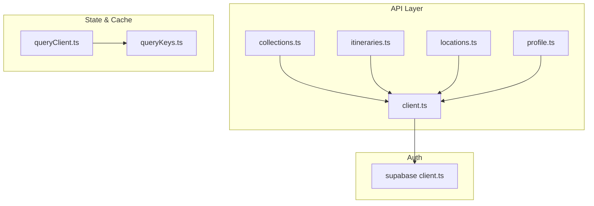
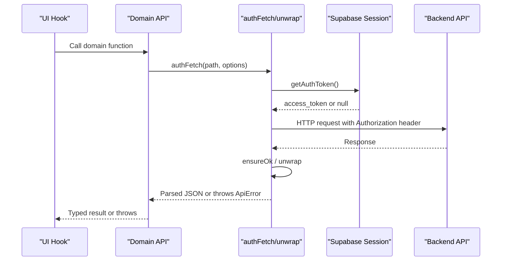
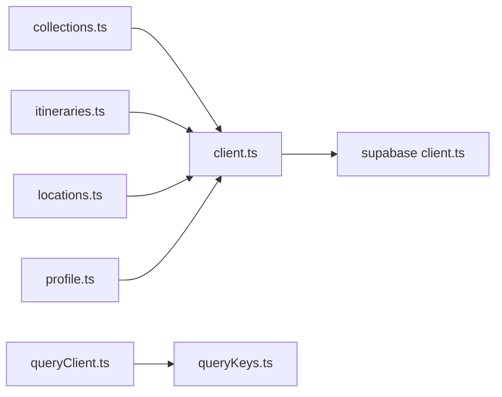

# Internal API Functions

<cite>
**Referenced Files in This Document**
- [client.ts](file://src/lib/api/client.ts)
- [collections.ts](file://src/lib/api/collections.ts)
- [itineraries.ts](file://src/lib/api/itineraries.ts)
- [locations.ts](file://src/lib/api/locations.ts)
- [profile.ts](file://src/lib/api/profile.ts)
- [queryClient.ts](file://src/lib/query/queryClient.ts)
- [queryKeys.ts](file://src/lib/query/queryKeys.ts)
- [supabase client.ts](file://src/lib/supabase/client.ts)
</cite>

## Table of Contents
1. Introduction
2. Project Structure
3. Core Components
4. Architecture Overview
5. Detailed Component Analysis
6. Dependency Analysis
7. Performance Considerations
8. Troubleshooting Guide
9. Conclusion

## Introduction
This document describes the internal API layer and data management utilities that power business logic for collections, itineraries, locations, and user profiles. It covers the HTTP client configuration, request/response handling, error patterns, and the key functions used to manage resources. It also explains state synchronization strategies including optimistic updates, cache invalidation via React Query keys, and job-based workflows.

## Project Structure
The API layer is organized by domain modules under src/lib/api, with a shared HTTP client and typed errors. Data fetching is coordinated through React Query using centralized query keys and a configured QueryClient. Supabase is used for authentication session retrieval.

**Diagram sources**
- [client.ts:1-156](file://src/lib/api/client.ts#L1-L156)
- [collections.ts:1-214](file://src/lib/api/collections.ts#L1-L214)
- [itineraries.ts:1-532](file://src/lib/api/itineraries.ts#L1-L532)
- [locations.ts:1-48](file://src/lib/api/locations.ts#L1-L48)
- [profile.ts:1-60](file://src/lib/api/profile.ts#L1-L60)
- [queryClient.ts:1-13](file://src/lib/query/queryClient.ts#L1-L13)
- [queryKeys.ts:1-42](file://src/lib/query/queryKeys.ts#L1-L42)
- [supabase client.ts:1-9](file://src/lib/supabase/client.ts#L1-L9)

**Section sources**
- [client.ts:1-156](file://src/lib/api/client.ts#L1-L156)
- [queryClient.ts:1-13](file://src/lib/query/queryClient.ts#L1-L13)
- [queryKeys.ts:1-42](file://src/lib/query/queryKeys.ts#L1-L42)
- [supabase client.ts:1-9](file://src/lib/supabase/client.ts#L1-L9)

## Core Components
- HTTP client and interceptors: authFetch attaches Bearer tokens from Supabase sessions; unwrap and ensureOk centralize error handling and JSON parsing; createJob/retryJob/detachJob handle background jobs with typed quota and already-analyzed errors.
- Domain APIs:
  - Collections: CRUD, public/invite tokens, collaborators, adding locations from Google Maps, deletion, and location removal.
  - Itineraries: listing, creation (blank or AI-driven), activity lifecycle (create, move, delete), travel mode changes, route optimization, preview legs, collaboration tokens, and public views.
  - Locations: resolving Google Maps URLs into persisted location rows.
  - Profile: quotas, account deletion impact, and permanent account deletion.
- State synchronization: React Query keys define stable identifiers for caching and invalidation; QueryClient sets default stale/gc times and retry behavior.

**Section sources**
- [client.ts:48-156](file://src/lib/api/client.ts#L48-L156)
- [collections.ts:65-214](file://src/lib/api/collections.ts#L65-L214)
- [itineraries.ts:54-532](file://src/lib/api/itineraries.ts#L54-L532)
- [locations.ts:39-47](file://src/lib/api/locations.ts#L39-L47)
- [profile.ts:13-60](file://src/lib/api/profile.ts#L13-L60)
- [queryClient.ts:1-13](file://src/lib/query/queryClient.ts#L1-L13)
- [queryKeys.ts:1-42](file://src/lib/query/queryKeys.ts#L1-L42)

## Architecture Overview
The application uses a thin HTTP client over fetch, authenticated via Supabase sessions. Each domain module exposes typed functions that return promises of structured types. Errors are normalized to ApiError with numeric status codes, and special cases (quota exceeded, already analyzed) are raised as typed errors. UI components consume these functions via hooks that use React Query for caching and invalidation.

**Diagram sources**
- [client.ts:48-107](file://src/lib/api/client.ts#L48-L107)
- [supabase client.ts:1-9](file://src/lib/supabase/client.ts#L1-L9)

## Detailed Component Analysis

### HTTP Client and Error Handling
- Authentication: Retrieves Supabase session token and injects it as Bearer Authorization on every request. Unauthenticated requests throw an ApiError with status 401.
- Response unwrapping: ensureOk throws ApiError when response.ok is false; unwrap parses JSON after ensuring success.
- Job helpers: createJob posts to /api/jobs with type/payload, handles 409 AlreadyAnalyzedError and 402 LinkQuotaError; retryJob and detachJob call corresponding endpoints.

Key behaviors:
- Transport failures bypass ensureOk and are thrown directly.
- Quota errors are typed so callers can show upgrade prompts.

Usage examples (described):
- Create a job: call createJob with type and payload; catch LinkQuotaError to prompt upgrade or AlreadyAnalyzedError to show existing content.
- Retry/detach: call retryJob or detachJob with jobId; unwrap returns typed results.

**Section sources**
- [client.ts:48-156](file://src/lib/api/client.ts#L48-L156)

### Collections API
Responsibilities:
- List/search collections and fetch a single collection with its locations.
- Create/update/delete collections.
- Add locations from Google Maps URLs into a collection.
- Manage public and invite tokens, collaborators, and public read access.

Notable functions and contracts:
- getCollections(params?): Promise<CollectionWithRole[]>
- getCollection(id): Promise<CollectionWithLocations>
- createCollection(name, country?, region?, latitude?, longitude?, tags?, source?): Promise<Collection>
- updateCollection(id, data): Promise<CollectionWithRole>
- addLocationFromGoogleMapsUrl(collectionId, url): Promise<AddFromGoogleMapsResult>
- generateCollectionPublicToken(collectionId): Promise<{token}>
- revokeCollectionPublicToken(collectionId): Promise<void>
- generateCollectionInviteToken(collectionId): Promise<{token; expires_at}>
- revokeCollectionInviteToken(collectionId): Promise<void>
- getCollectionCollaborators(collectionId): Promise<Collaborator[]>
- removeCollectionCollaborator(collectionId, userId): Promise<void>
- getCollectionInviteInfo(token): Promise<{id; name; country?; region?; type}>
- joinCollectionByToken(token): Promise<Collection>
- getPublicCollection(token): Promise<PublicCollection>
- deleteCollection(id): Promise<void>
- removeCollectionLocation(collectionId, locationId): Promise<void>

Optimistic updates and cache invalidation:
- After mutations (create/update/delete), invalidate collection-related keys such as collections(), collection(id), and entityLocations(entityType, entityId) to keep UI consistent.

**Section sources**
- [collections.ts:65-214](file://src/lib/api/collections.ts#L65-L214)
- [queryKeys.ts:1-42](file://src/lib/query/queryKeys.ts#L1-L42)

### Itineraries API
Responsibilities:
- List itineraries and perform full lifecycle operations for activities within days.
- Generate itineraries (AI planning) or create blank itineraries.
- Optimize routes per day, preview travel legs, and adjust transport modes.
- Manage collaboration tokens and public sharing.

Key functions and contracts:
- getItineraries(): Promise<ItineraryWithRole[]>
- generateItinerary(params): Promise<GenerateItineraryJob>
- updateItinerary(id, fields): Promise<Itinerary>
- createActivity(itineraryId, payload): Promise<CreatedActivity>
- deleteActivity(itineraryId, activityId, options?): Promise<CascadeResult | null>
- moveActivity(itineraryId, activityId, params): Promise<CascadeResult | null>
- setActivityTravelMode(itineraryId, activityId, mode): Promise<TravelModeResult>
- optimizeDayRoute(itineraryId, dayId, lockedIds): Promise<OptimizeDayRouteResult>
- previewDayLegs(itineraryId, dayId, legs): Promise<{legs: PreviewLeg[]}>
- createItinerary(...): Promise<Itinerary>
- createItineraryRouted(input): Promise<ItineraryCreateResult>
- generateItineraryPublicToken(itineraryId): Promise<{token}>
- revokeItineraryPublicToken(itineraryId): Promise<void>
- generateItineraryInviteToken(itineraryId): Promise<{token; expires_at}>
- revokeItineraryInviteToken(itineraryId): Promise<void>
- getItineraryCollaborators(itineraryId): Promise<ItineraryCollaborator[]>
- removeItineraryCollaborator(itineraryId, userId): Promise<void>
- getItineraryInviteInfo(token): Promise<{id; name; country?; region?; type}>
- joinItineraryByToken(token): Promise<Itinerary>
- getPublicItinerary(token): Promise<PublicItinerary>
- deleteItinerary(id): Promise<void>

Optimistic updates and cascade recompute:
- Activity moves and deletes support recompute_times to receive updated day legs/times server-side.
- Use correlation_id on activity creation to match optimistic cards to persisted rows.
- Invalidate itineraryDetail(id), upcomingItineraries(userId), and related keys after mutations.

**Section sources**
- [itineraries.ts:54-532](file://src/lib/api/itineraries.ts#L54-L532)
- [queryKeys.ts:1-42](file://src/lib/query/queryKeys.ts#L1-L42)

### Locations API
Responsibilities:
- Resolve Google Maps share links into persisted location rows with rich metadata suitable for rendering and linking to activities.

Key function:
- resolveGoogleMapsUrl(url): Promise<{location: ResolvedGoogleMapsLocation}>

Cache considerations:
- Invalidate locationReferences(locationId, exclude?) and any map cluster queries after resolution if needed.

**Section sources**
- [locations.ts:39-47](file://src/lib/api/locations.ts#L39-L47)
- [queryKeys.ts:1-42](file://src/lib/query/queryKeys.ts#L1-L42)

### Profile API
Responsibilities:
- Fetch usage quotas for links and itineraries.
- Inspect deletion impact before account deletion.
- Permanently delete the signed-in account.

Key functions:
- getQuota(): Promise<QuotaStatus>
- getItineraryQuota(): Promise<ItineraryQuotaStatus>
- getDeletionImpact(): Promise<DeletionImpact>
- deleteAccount(): Promise<void>

Cache considerations:
- Invalidate profile(userId), subscription(userId), linkUsage(userId), itineraryUsage(userId) after mutations.

**Section sources**
- [profile.ts:13-60](file://src/lib/api/profile.ts#L13-L60)
- [queryKeys.ts:1-42](file://src/lib/query/queryKeys.ts#L1-L42)

### React Query Configuration and Keys
- QueryClient defaults:
  - staleTime: 5 minutes
  - gcTime: 10 minutes
  - retry: 1
  - refetchOnWindowFocus: false
- Centralized query keys for consistent invalidation across features.

Typical invalidation strategy:
- On successful mutation, invalidate relevant keys using queryKeys to trigger refetches and maintain UI consistency.

**Section sources**
- [queryClient.ts:1-13](file://src/lib/query/queryClient.ts#L1-L13)
- [queryKeys.ts:1-42](file://src/lib/query/queryKeys.ts#L1-L42)

## Dependency Analysis
The API modules depend on the shared client for authenticated requests and error normalization. Domain modules do not import each other, keeping cohesion high and coupling low. State management depends on React Query keys for consistent cache behavior.

**Diagram sources**
- [collections.ts:1-214](file://src/lib/api/collections.ts#L1-L214)
- [itineraries.ts:1-532](file://src/lib/api/itineraries.ts#L1-L532)
- [locations.ts:1-48](file://src/lib/api/locations.ts#L1-L48)
- [profile.ts:1-60](file://src/lib/api/profile.ts#L1-L60)
- [client.ts:1-156](file://src/lib/api/client.ts#L1-L156)
- [supabase client.ts:1-9](file://src/lib/supabase/client.ts#L1-L9)
- [queryClient.ts:1-13](file://src/lib/query/queryClient.ts#L1-L13)
- [queryKeys.ts:1-42](file://src/lib/query/queryKeys.ts#L1-L42)

**Section sources**
- [client.ts:1-156](file://src/lib/api/client.ts#L1-L156)
- [queryKeys.ts:1-42](file://src/lib/query/queryKeys.ts#L1-L42)

## Performance Considerations
- Stale and garbage collection times are tuned to reduce unnecessary refetches while keeping data reasonably fresh.
- Avoid redundant Place Details calls by passing place_details when creating activities; this reduces external API costs and latency.
- Use recompute_times selectively for move/delete operations to minimize server-side computation overhead.
- Batch invalidations where possible to avoid excessive refetch storms.

[No sources needed since this section provides general guidance]

## Troubleshooting Guide
Common errors and how they surface:
- Not authenticated: authFetch throws ApiError with status 401 when no session exists.
- Generic request failure: ensureOk wraps non-OK responses into ApiError with status and message.
- Quota exceeded:
  - Links: createJob may throw LinkQuotaError with tier and usage details.
  - Itineraries: generateItinerary/createItinerary may throw ItineraryQuotaError with current_count and max_itineraries.
- Already analyzed: createJob may throw AlreadyAnalyzedError with content payload for reuse.

Debugging steps:
- Check network tab for status codes and payloads.
- Inspect thrown error.name and error.status to branch UI logic (e.g., show upgrade prompts).
- For job flows, verify job status via polling or realtime listeners and handle retries/detach accordingly.

**Section sources**
- [client.ts:48-156](file://src/lib/api/client.ts#L48-L156)
- [itineraries.ts:89-120](file://src/lib/api/itineraries.ts#L89-L120)
- [itineraries.ts:339-367](file://src/lib/api/itineraries.ts#L339-L367)

## Conclusion
The internal API layer provides a consistent, typed interface for managing collections, itineraries, locations, and profiles. Authenticated requests are centralized, errors are normalized and specialized for actionable UI states, and React Query keys enable predictable caching and invalidation. By following the documented function contracts and invalidation strategies, developers can implement robust features with clear error handling and efficient data synchronization.

[No sources needed since this section summarizes without analyzing specific files]