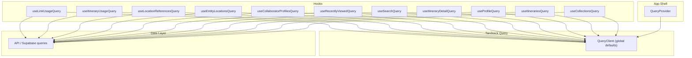
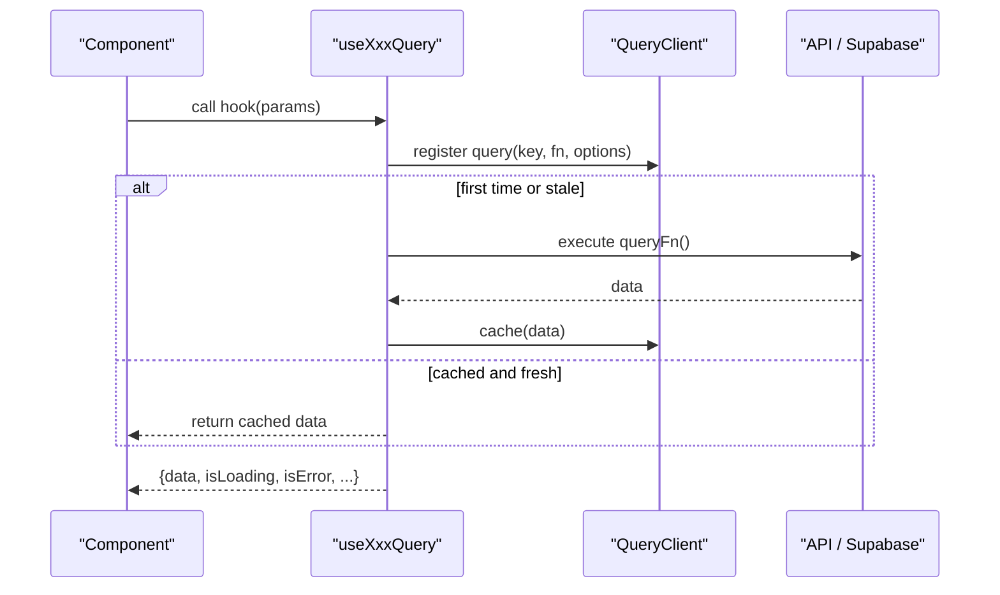
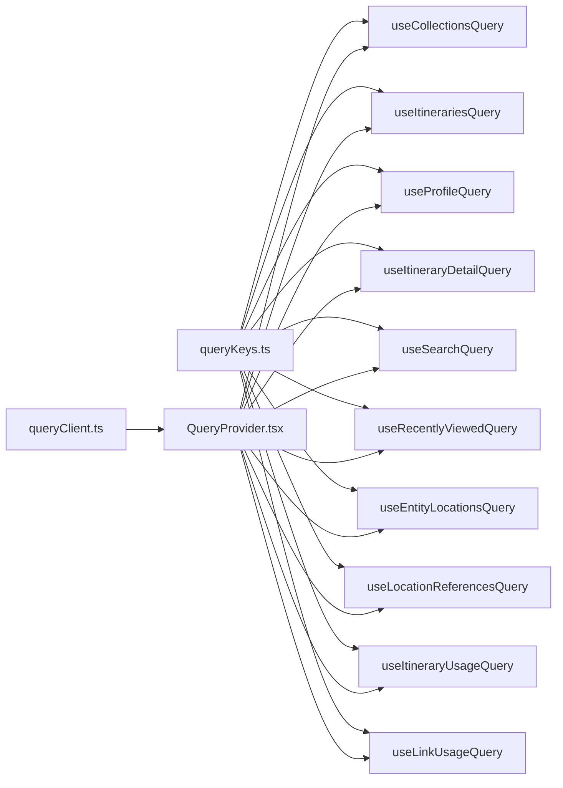

# Query Hooks & Data Fetching

<cite>
**Referenced Files in This Document**
- [QueryProvider.tsx](file://src/components/QueryProvider.tsx)
- [queryClient.ts](file://src/lib/query/queryClient.ts)
- [queryKeys.ts](file://src/lib/query/queryKeys.ts)
- [useCollectionsQuery.ts](file://src/hooks/queries/useCollectionsQuery.ts)
- [useItinerariesQuery.ts](file://src/hooks/queries/useItinerariesQuery.ts)
- [useProfileQuery.ts](file://src/hooks/queries/useProfileQuery.ts)
- [useItineraryDetailQuery.ts](file://src/hooks/queries/useItineraryDetailQuery.ts)
- [useSearchQuery.ts](file://src/hooks/queries/useSearchQuery.ts)
- [useRecentlyViewedQuery.ts](file://src/hooks/queries/useRecentlyViewedQuery.ts)
- [useCollaboratorProfilesQuery.ts](file://src/hooks/queries/useCollaboratorProfilesQuery.ts)
- [useEntityLocationsQuery.ts](file://src/hooks/queries/useEntityLocationsQuery.ts)
- [useLocationReferencesQuery.ts](file://src/hooks/queries/useLocationReferencesQuery.ts)
- [useItineraryUsageQuery.ts](file://src/hooks/queries/useItineraryUsageQuery.ts)
- [useLinkUsageQuery.ts](file://src/hooks/queries/useLinkUsageQuery.ts)
</cite>

## Table of Contents
1. [Introduction](#introduction)
2. [Project Structure](#project-structure)
3. [Core Components](#core-components)
4. [Architecture Overview](#architecture-overview)
5. [Detailed Component Analysis](#detailed-component-analysis)
6. [Dependency Analysis](#dependency-analysis)
7. [Performance Considerations](#performance-considerations)
8. [Troubleshooting Guide](#troubleshooting-guide)
9. [Conclusion](#conclusion)

## Introduction
This document explains the custom React hooks for data fetching and state management using TanStack Query. It covers:
- Query hooks for collections, itineraries, profiles, and specialized features
- Query key patterns and how they drive caching and invalidation
- Caching strategies, background refetching behavior, and error handling
- Composing hooks, loading states, and optimistic updates
- QueryProvider configuration and global query settings

## Project Structure
The data-fetching layer is organized into:
- Global provider and client setup under src/components and src/lib/query
- Feature-specific query hooks under src/hooks/queries
- Centralized query keys under src/lib/query/queryKeys.ts

**Diagram sources**
- [QueryProvider.tsx:7-12](file://src/components/QueryProvider.tsx#L7-L12)
- [queryClient.ts:3-12](file://src/lib/query/queryClient.ts#L3-L12)
- [useCollectionsQuery.ts:10-16](file://src/hooks/queries/useCollectionsQuery.ts#L10-L16)
- [useItinerariesQuery.ts:10-16](file://src/hooks/queries/useItinerariesQuery.ts#L10-L16)
- [useProfileQuery.ts:8-19](file://src/hooks/queries/useProfileQuery.ts#L8-L19)
- [useItineraryDetailQuery.ts:8-18](file://src/hooks/queries/useItineraryDetailQuery.ts#L8-L18)
- [useSearchQuery.ts:8-23](file://src/hooks/queries/useSearchQuery.ts#L8-L23)
- [useRecentlyViewedQuery.ts:8-18](file://src/hooks/queries/useRecentlyViewedQuery.ts#L8-L18)
- [useCollaboratorProfilesQuery.ts:7-17](file://src/hooks/queries/useCollaboratorProfilesQuery.ts#L7-L17)
- [useEntityLocationsQuery.ts:8-21](file://src/hooks/queries/useEntityLocationsQuery.ts#L8-L21)
- [useLocationReferencesQuery.ts:16-30](file://src/hooks/queries/useLocationReferencesQuery.ts#L16-L30)
- [useItineraryUsageQuery.ts:14-29](file://src/hooks/queries/useItineraryUsageQuery.ts#L14-L29)
- [useLinkUsageQuery.ts:20-35](file://src/hooks/queries/useLinkUsageQuery.ts#L20-L35)

**Section sources**
- [QueryProvider.tsx:7-12](file://src/components/QueryProvider.tsx#L7-L12)
- [queryClient.ts:3-12](file://src/lib/query/queryClient.ts#L3-L12)

## Core Components
- QueryProvider wraps the app with a QueryClient instance to enable TanStack Query across components.
- QueryClient defines global defaults for staleTime, gcTime, retry, and window focus refetch behavior.
- queryKeys centralizes all query key factories to ensure consistent cache keys and easy invalidation.

Key behaviors:
- Global default staleTime is set at the client level; individual hooks can override per use case.
- Some hooks disable automatic refetch on window focus to reduce network churn.
- Conditional execution via enabled flags prevents unnecessary requests when required parameters are missing.

**Section sources**
- [QueryProvider.tsx:7-12](file://src/components/QueryProvider.tsx#L7-L12)
- [queryClient.ts:3-12](file://src/lib/query/queryClient.ts#L3-L12)
- [queryKeys.ts:1-42](file://src/lib/query/queryKeys.ts#L1-L42)

## Architecture Overview
The architecture follows a clear separation:
- Providers configure the global QueryClient once.
- Hooks encapsulate query logic, including keys, functions, and options.
- The underlying data layer fetches from APIs or Supabase.

**Diagram sources**
- [queryClient.ts:3-12](file://src/lib/query/queryClient.ts#L3-L12)
- [useCollectionsQuery.ts:10-16](file://src/hooks/queries/useCollectionsQuery.ts#L10-L16)
- [useItinerariesQuery.ts:10-16](file://src/hooks/queries/useItinerariesQuery.ts#L10-L16)
- [useProfileQuery.ts:8-19](file://src/hooks/queries/useProfileQuery.ts#L8-L19)

## Detailed Component Analysis

### Global Query Configuration
- QueryProvider injects a single QueryClient into the React tree.
- Global defaults include:
  - staleTime: 5 minutes
  - gcTime: 10 minutes
  - retry: 1
  - refetchOnWindowFocus: false

These defaults apply unless overridden by individual hooks.

**Section sources**
- [QueryProvider.tsx:7-12](file://src/components/QueryProvider.tsx#L7-L12)
- [queryClient.ts:3-12](file://src/lib/query/queryClient.ts#L3-L12)

### Query Key Patterns
- Keys are centralized and typed via factory functions.
- Examples:
  - collections: ["collections"]
  - itineraries: ["itineraries"]
  - profile: ["profile", userId]
  - itineraryDetail: ["itritineries", id]
  - search: ["search", query, filterType, offset]
  - entityLocations: ["entityLocations", entityType, entityId]
  - locationReferences: ["locationReferences", locationId, exclude...]

Benefits:
- Predictable cache entries
- Easy invalidation by key parts
- Consistent serialization of parameters

**Section sources**
- [queryKeys.ts:1-42](file://src/lib/query/queryKeys.ts#L1-L42)

### useCollectionsQuery
- Purpose: Fetch user’s collections list.
- Key: ["collections"]
- Stale time: 60 seconds
- Behavior: Background refetch after staleness; no window-focus refetch due to global setting.

**Section sources**
- [useCollectionsQuery.ts:10-16](file://src/hooks/queries/useCollectionsQuery.ts#L10-L16)
- [queryKeys.ts:7-7](file://src/lib/query/queryKeys.ts#L7-L7)
- [queryClient.ts:3-12](file://src/lib/query/queryClient.ts#L3-L12)

### useItinerariesQuery
- Purpose: Fetch user’s itineraries list.
- Key: ["itineraries"]
- Stale time: 60 seconds

**Section sources**
- [useItinerariesQuery.ts:10-16](file://src/hooks/queries/useItinerariesQuery.ts#L10-L16)
- [queryKeys.ts:9-9](file://src/lib/query/queryKeys.ts#L9-L9)
- [queryClient.ts:3-12](file://src/lib/query/queryClient.ts#L3-L12)

### useProfileQuery
- Purpose: Fetch a specific profile by userId.
- Key: ["profile", userId]
- Options:
  - enabled: only run when userId is present
  - staleTime/gcTime: Infinity (persistent cache)
- Notes: Creates a Supabase client inside the query function.

**Section sources**
- [useProfileQuery.ts:8-19](file://src/hooks/queries/useProfileQuery.ts#L8-L19)
- [queryKeys.ts:4-4](file://src/lib/query/queryKeys.ts#L4-L4)

### useItineraryDetailQuery
- Purpose: Fetch detail for a specific itinerary.
- Key: ["itineraries", id]
- Options:
  - enabled: requires id
  - staleTime: 5 minutes

**Section sources**
- [useItineraryDetailQuery.ts:8-18](file://src/hooks/queries/useItineraryDetailQuery.ts#L8-L18)
- [queryKeys.ts:10-10](file://src/lib/query/queryKeys.ts#L10-L10)

### useSearchQuery
- Purpose: Search content with pagination via offset.
- Key: ["search", query, filterType, offset]
- Options:
  - enabled: requires userId and non-empty query
  - staleTime: 30 seconds

**Section sources**
- [useSearchQuery.ts:8-23](file://src/hooks/queries/useSearchQuery.ts#L8-L23)
- [queryKeys.ts:16-17](file://src/lib/query/queryKeys.ts#L16-L17)

### useRecentlyViewedQuery
- Purpose: Load recently viewed items for a user.
- Key: ["recentlyViewed", userId]
- Options:
  - enabled: requires userId and optional external flag
  - staleTime: 2 minutes

**Section sources**
- [useRecentlyViewedQuery.ts:8-18](file://src/hooks/queries/useRecentlyViewedQuery.ts#L8-L18)
- [queryKeys.ts:15-15](file://src/lib/query/queryKeys.ts#L15-L15)

### useCollaboratorProfilesQuery
- Purpose: Fetch multiple collaborator profiles by IDs.
- Key: ["collaboratorProfiles", sorted userIds]
- Options:
  - enabled: runs only when there are user IDs
  - staleTime: Infinity (long-lived cache)

**Section sources**
- [useCollaboratorProfilesQuery.ts:7-17](file://src/hooks/queries/useCollaboratorProfilesQuery.ts#L7-L17)

### useEntityLocationsQuery
- Purpose: Get locations associated with an entity (link/collection/itinerary).
- Key: ["entityLocations", entityType, entityId]
- Options:
  - enabled: requires both entityType and entityId
  - staleTime: 5 minutes

**Section sources**
- [useEntityLocationsQuery.ts:8-21](file://src/hooks/queries/useEntityLocationsQuery.ts#L8-L21)
- [queryKeys.ts:18-19](file://src/lib/query/queryKeys.ts#L18-L19)

### useLocationReferencesQuery
- Purpose: Find other collections/itineraries that reference a location, with optional exclusions.
- Key: ["locationReferences", locationId, exclude...]
- Options:
  - enabled: requires locationId and optional external flag
  - staleTime: 2 minutes

**Section sources**
- [useLocationReferencesQuery.ts:16-30](file://src/hooks/queries/useLocationReferencesQuery.ts#L16-L30)
- [queryKeys.ts:31-40](file://src/lib/query/queryKeys.ts#L31-L40)

### useItineraryUsageQuery
- Purpose: Retrieve quota and usage metrics for itineraries.
- Key: ["itineraryUsage", userId]
- Options:
  - enabled: requires userId
  - staleTime: 60 seconds

**Section sources**
- [useItineraryUsageQuery.ts:14-29](file://src/hooks/queries/useItineraryUsageQuery.ts#L14-L29)
- [queryKeys.ts:3-3](file://src/lib/query/queryKeys.ts#L3-L3)

### useLinkUsageQuery
- Purpose: Retrieve quota and usage metrics for links, including monthly reset date.
- Key: ["linkUsage", userId]
- Options:
  - enabled: requires userId
  - staleTime: 60 seconds

**Section sources**
- [useLinkUsageQuery.ts:20-35](file://src/hooks/queries/useLinkUsageQuery.ts#L20-L35)
- [queryKeys.ts:2-2](file://src/lib/query/queryKeys.ts#L2-L2)

## Dependency Analysis
- All hooks depend on:
  - @tanstack/react-query for caching and lifecycle
  - queryKeys for consistent key generation
  - API or Supabase clients for data retrieval
- Global QueryClient controls shared behavior like retries and focus refetching.

**Diagram sources**
- [queryKeys.ts:1-42](file://src/lib/query/queryKeys.ts#L1-L42)
- [queryClient.ts:3-12](file://src/lib/query/queryClient.ts#L3-L12)
- [QueryProvider.tsx:7-12](file://src/components/QueryProvider.tsx#L7-L12)
- [useCollectionsQuery.ts:10-16](file://src/hooks/queries/useCollectionsQuery.ts#L10-L16)
- [useItinerariesQuery.ts:10-16](file://src/hooks/queries/useItinerariesQuery.ts#L10-L16)
- [useProfileQuery.ts:8-19](file://src/hooks/queries/useProfileQuery.ts#L8-L19)
- [useItineraryDetailQuery.ts:8-18](file://src/hooks/queries/useItineraryDetailQuery.ts#L8-L18)
- [useSearchQuery.ts:8-23](file://src/hooks/queries/useSearchQuery.ts#L8-L23)
- [useRecentlyViewedQuery.ts:8-18](file://src/hooks/queries/useRecentlyViewedQuery.ts#L8-L18)
- [useEntityLocationsQuery.ts:8-21](file://src/hooks/queries/useEntityLocationsQuery.ts#L8-L21)
- [useLocationReferencesQuery.ts:16-30](file://src/hooks/queries/useLocationReferencesQuery.ts#L16-L30)
- [useItineraryUsageQuery.ts:14-29](file://src/hooks/queries/useItineraryUsageQuery.ts#L14-L29)
- [useLinkUsageQuery.ts:20-35](file://src/hooks/queries/useLinkUsageQuery.ts#L20-L35)

**Section sources**
- [queryKeys.ts:1-42](file://src/lib/query/queryKeys.ts#L1-L42)
- [queryClient.ts:3-12](file://src/lib/query/queryClient.ts#L3-L12)
- [QueryProvider.tsx:7-12](file://src/components/QueryProvider.tsx#L7-L12)

## Performance Considerations
- Use appropriate staleTime per hook:
  - Lists (collections, itineraries): short staleness to keep UI fresh
  - Profiles and collaborators: long staleness to avoid frequent revalidation
  - Search: moderate staleness to balance freshness and cost
- Disable window-focus refetch globally to reduce noise; rely on explicit invalidations where needed.
- Prefer conditional enabled flags to avoid unnecessary requests.
- Cache large or expensive datasets with longer gcTime/staleTime when appropriate.

[No sources needed since this section provides general guidance]

## Troubleshooting Guide
Common issues and resolutions:
- No data appears:
  - Check enabled flags; some hooks require userId or id to be present before fetching.
  - Verify query keys match expected parameters.
- Unexpected refetches:
  - Review global refetchOnWindowFocus setting and per-hook staleTime.
- Errors not surfaced:
  - Inspect the isError and error fields returned by hooks.
  - Ensure API calls handle errors consistently.
- Optimistic updates not reflecting:
  - Invalidate related query keys after mutations to refresh data.
  - Update local cache via setQueryData if you need immediate UI feedback.

**Section sources**
- [useProfileQuery.ts:8-19](file://src/hooks/queries/useProfileQuery.ts#L8-L19)
- [useItineraryDetailQuery.ts:8-18](file://src/hooks/queries/useItineraryDetailQuery.ts#L8-L18)
- [useSearchQuery.ts:8-23](file://src/hooks/queries/useSearchQuery.ts#L8-L23)
- [queryClient.ts:3-12](file://src/lib/query/queryClient.ts#L3-L12)

## Conclusion
The application uses a robust TanStack Query setup with centralized query keys and a configured QueryClient. Each feature has a dedicated hook that encapsulates fetching, caching, and conditional execution. By following consistent key patterns and tuning stale times, the app achieves predictable performance and maintainability. For mutations, pair them with query invalidations to keep the cache in sync and provide smooth user experiences.

[No sources needed since this section summarizes without analyzing specific files]