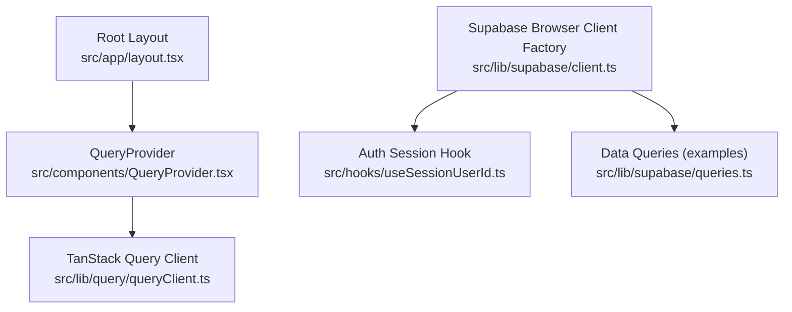
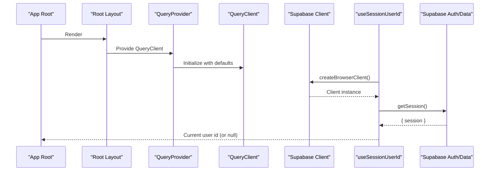
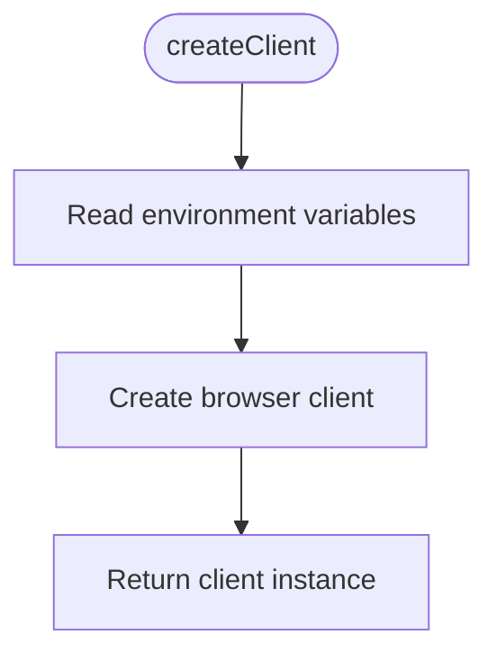
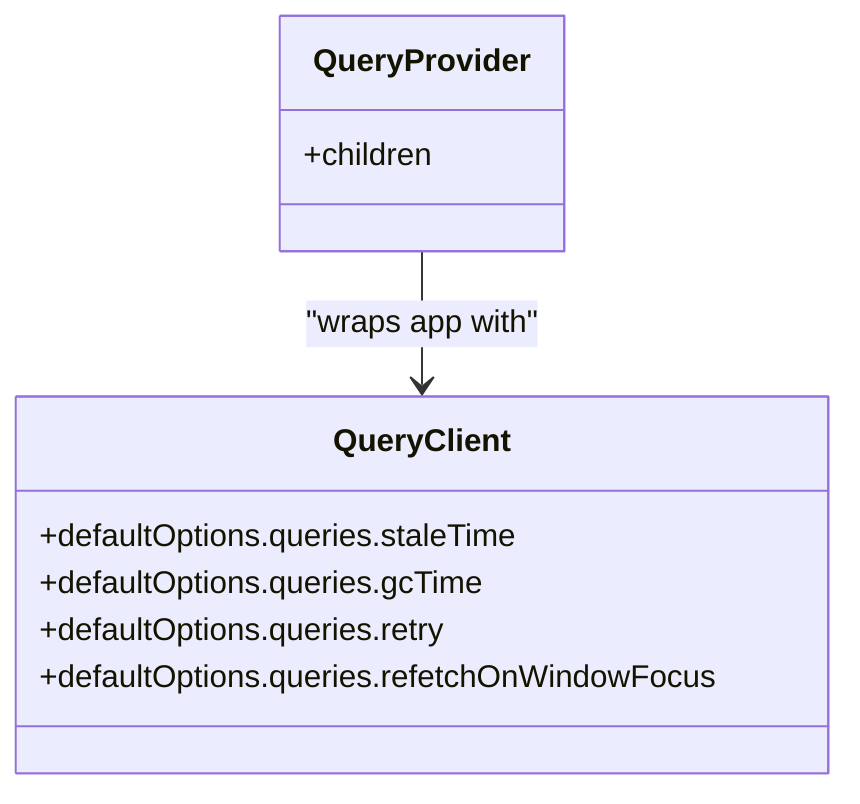
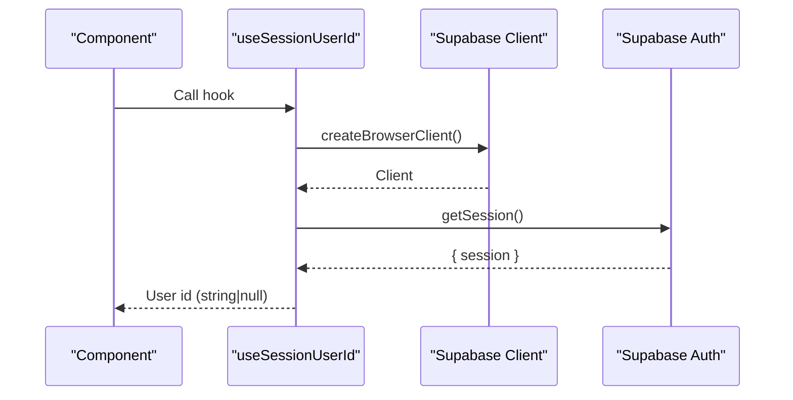
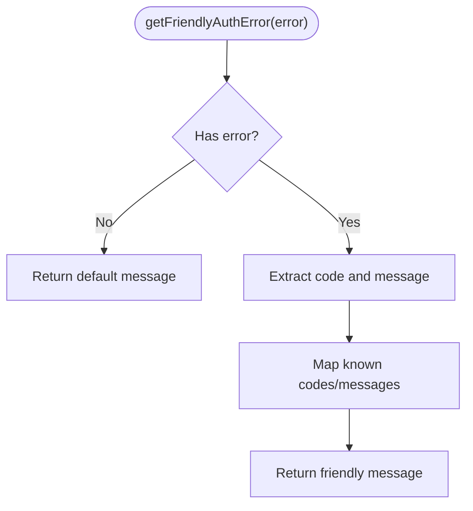
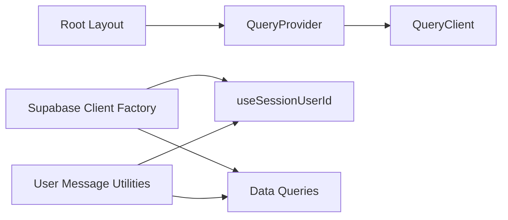

# Client Configuration & Setup

<cite>
**Referenced Files in This Document**
- [client.ts](file://src/lib/supabase/client.ts)
- [queryClient.ts](file://src/lib/query/queryClient.ts)
- [QueryProvider.tsx](file://src/components/QueryProvider.tsx)
- [layout.tsx](file://src/app/layout.tsx)
- [useSessionUserId.ts](file://src/hooks/useSessionUserId.ts)
- [queries.ts](file://src/lib/supabase/queries.ts)
- [userMessages.ts](file://src/lib/errors/userMessages.ts)
</cite>

## Table of Contents
1. Introduction
2. Project Structure
3. Core Components
4. Architecture Overview
5. Detailed Component Analysis
6. Dependency Analysis
7. Performance Considerations
8. Troubleshooting Guide
9. Conclusion

## Introduction
This document explains how the application configures and initializes the Supabase client, integrates TanStack Query for data fetching and caching, and handles authentication-related session access and user-facing errors. It also provides guidance on environment variables, connection management patterns, and production best practices based on the codebase.

## Project Structure
The Supabase client is created via a browser client factory that reads environment variables. TanStack Query is configured centrally and provided to the app through a provider at the root layout. Authentication session access is demonstrated by a hook that retrieves the current user ID from the Supabase session. Data operations are encapsulated in query modules that accept a Supabase client instance.

**Diagram sources**
- [layout.tsx:57-80](file://src/app/layout.tsx#L57-L80)
- [QueryProvider.tsx:7-12](file://src/components/QueryProvider.tsx#L7-L12)
- [queryClient.ts:3-12](file://src/lib/query/queryClient.ts#L3-L12)
- [client.ts:3-8](file://src/lib/supabase/client.ts#L3-L8)
- [useSessionUserId.ts:8-18](file://src/hooks/useSessionUserId.ts#L8-L18)
- [queries.ts:14-29](file://src/lib/supabase/queries.ts#L14-L29)

**Section sources**
- [layout.tsx:57-80](file://src/app/layout.tsx#L57-L80)
- [QueryProvider.tsx:7-12](file://src/components/QueryProvider.tsx#L7-L12)
- [queryClient.ts:3-12](file://src/lib/query/queryClient.ts#L3-L12)
- [client.ts:3-8](file://src/lib/supabase/client.ts#L3-L8)
- [useSessionUserId.ts:8-18](file://src/hooks/useSessionUserId.ts#L8-L18)
- [queries.ts:14-29](file://src/lib/supabase/queries.ts#L14-L29)

## Core Components
- Supabase browser client factory: Creates a browser-based Supabase client using environment variables for URL and anonymous key.
- TanStack Query client: Central configuration for stale time, garbage collection time, retry count, and refetch behavior.
- QueryProvider: Wraps the application with TanStack Query’s provider so components can use hooks like useQuery and useMutation.
- Root layout: Mounts QueryProvider at the app root, enabling global query caching and retries.
- Session hook: Demonstrates reading the current session to obtain the authenticated user ID.
- Query modules: Encapsulate data operations against Supabase tables, accepting a Supabase client instance.

**Section sources**
- [client.ts:3-8](file://src/lib/supabase/client.ts#L3-L8)
- [queryClient.ts:3-12](file://src/lib/query/queryClient.ts#L3-L12)
- [QueryProvider.tsx:7-12](file://src/components/QueryProvider.tsx#L7-L12)
- [layout.tsx:57-80](file://src/app/layout.tsx#L57-L80)
- [useSessionUserId.ts:8-18](file://src/hooks/useSessionUserId.ts#L8-L18)
- [queries.ts:14-29](file://src/lib/supabase/queries.ts#L14-L29)

## Architecture Overview
The runtime flow connects environment-driven Supabase initialization with TanStack Query caching and error handling. The root layout provides the query client globally; components fetch data via hooks or custom query functions that use the Supabase client. Authentication state is read from the Supabase session when needed.

**Diagram sources**
- [layout.tsx:57-80](file://src/app/layout.tsx#L57-L80)
- [QueryProvider.tsx:7-12](file://src/components/QueryProvider.tsx#L7-L12)
- [queryClient.ts:3-12](file://src/lib/query/queryClient.ts#L3-L12)
- [client.ts:3-8](file://src/lib/supabase/client.ts#L3-L8)
- [useSessionUserId.ts:8-18](file://src/hooks/useSessionUserId.ts#L8-L18)

## Detailed Component Analysis

### Supabase Client Initialization
- Purpose: Create a browser-compatible Supabase client using environment variables for endpoint and anonymous key.
- Behavior: Exposes a factory function that returns a ready-to-use client instance.
- Environment variables:
  - NEXT_PUBLIC_SUPABASE_URL
  - NEXT_PUBLIC_SUPABASE_ANON_KEY

**Diagram sources**
- [client.ts:3-8](file://src/lib/supabase/client.ts#L3-L8)

**Section sources**
- [client.ts:3-8](file://src/lib/supabase/client.ts#L3-L8)

### TanStack Query Integration
- Purpose: Configure global caching and retry behavior for queries.
- Key settings:
  - Stale time: 5 minutes
  - Garbage collection time: 10 minutes
  - Retry count: 1
  - Refetch on window focus: disabled
- Provider: Mounted at the root layout to make query hooks available throughout the app.

**Diagram sources**
- [queryClient.ts:3-12](file://src/lib/query/queryClient.ts#L3-L12)
- [QueryProvider.tsx:7-12](file://src/components/QueryProvider.tsx#L7-L12)

**Section sources**
- [queryClient.ts:3-12](file://src/lib/query/queryClient.ts#L3-L12)
- [QueryProvider.tsx:7-12](file://src/components/QueryProvider.tsx#L7-L12)
- [layout.tsx:57-80](file://src/app/layout.tsx#L57-L80)

### Authentication Session Handling
- Pattern: Use the Supabase client to retrieve the current session and extract the user ID.
- Usage: A React hook obtains the user ID once on mount and exposes it to components.

**Diagram sources**
- [useSessionUserId.ts:8-18](file://src/hooks/useSessionUserId.ts#L8-L18)
- [client.ts:3-8](file://src/lib/supabase/client.ts#L3-L8)

**Section sources**
- [useSessionUserId.ts:8-18](file://src/hooks/useSessionUserId.ts#L8-L18)
- [client.ts:3-8](file://src/lib/supabase/client.ts#L3-L8)

### Data Query Modules
- Purpose: Encapsulate Supabase data operations behind typed functions that accept a Supabase client.
- Example: Fetching profile records with error logging and safe return values.

```mermaid
flowchart TD
Entry(["getProfile(supabase, userId)"]) --> Query["supabase.from('profiles').select(...).eq('id', userId).single()"]
Query --> CheckError{"error?"}
CheckError --> |Yes| LogErr["Log error"] --> ReturnNull["Return null"]
CheckError --> |No| ReturnData["Return data"]
```

**Diagram sources**
- [queries.ts:14-29](file://src/lib/supabase/queries.ts#L14-L29)

**Section sources**
- [queries.ts:14-29](file://src/lib/supabase/queries.ts#L14-L29)

### Error Handling and User Messages
- Strategy: Map technical Supabase auth errors to friendly messages for UI display while preserving technical details in logs.
- Utility: Provides a function to convert auth errors into user-friendly strings.

**Diagram sources**
- [userMessages.ts:1-11](file://src/lib/errors/userMessages.ts#L1-L11)
- [userMessages.ts:94-106](file://src/lib/errors/userMessages.ts#L94-L106)

**Section sources**
- [userMessages.ts:1-11](file://src/lib/errors/userMessages.ts#L1-L11)
- [userMessages.ts:94-106](file://src/lib/errors/userMessages.ts#L94-L106)

## Dependency Analysis
- Root layout depends on QueryProvider to enable TanStack Query across the app.
- QueryProvider depends on the centralized QueryClient configuration.
- Supabase client factory depends on environment variables for connection details.
- Hooks and query modules depend on the Supabase client for session and data access.
- Error utilities are used to present user-friendly messages without leaking technical details.

**Diagram sources**
- [layout.tsx:57-80](file://src/app/layout.tsx#L57-L80)
- [QueryProvider.tsx:7-12](file://src/components/QueryProvider.tsx#L7-L12)
- [queryClient.ts:3-12](file://src/lib/query/queryClient.ts#L3-L12)
- [client.ts:3-8](file://src/lib/supabase/client.ts#L3-L8)
- [useSessionUserId.ts:8-18](file://src/hooks/useSessionUserId.ts#L8-L18)
- [queries.ts:14-29](file://src/lib/supabase/queries.ts#L14-L29)
- [userMessages.ts:1-11](file://src/lib/errors/userMessages.ts#L1-L11)

**Section sources**
- [layout.tsx:57-80](file://src/app/layout.tsx#L57-L80)
- [QueryProvider.tsx:7-12](file://src/components/QueryProvider.tsx#L7-L12)
- [queryClient.ts:3-12](file://src/lib/query/queryClient.ts#L3-L12)
- [client.ts:3-8](file://src/lib/supabase/client.ts#L3-L8)
- [useSessionUserId.ts:8-18](file://src/hooks/useSessionUserId.ts#L8-L18)
- [queries.ts:14-29](file://src/lib/supabase/queries.ts#L14-L29)
- [userMessages.ts:1-11](file://src/lib/errors/userMessages.ts#L1-L11)

## Performance Considerations
- Cache tuning: Stale time and garbage collection times are set to reduce unnecessary refetches while keeping data reasonably fresh.
- Retry strategy: A single retry balances resilience against transient failures with avoiding excessive network load.
- Window focus refetch: Disabled to prevent unexpected refetches when users switch tabs.
- Connection reuse: The Supabase browser client is created per call site; consider sharing a singleton client if you need consistent connection pooling or interceptors.

[No sources needed since this section provides general guidance]

## Troubleshooting Guide
- Missing environment variables: Ensure NEXT_PUBLIC_SUPABASE_URL and NEXT_PUBLIC_SUPABASE_ANON_KEY are defined before building or running the app.
- Session not loaded: When reading the user ID, handle null until the session resolves; avoid rendering protected content before the session is available.
- Query errors: Inspect console logs for detailed errors; surface only friendly messages to users using the provided utility.
- Network issues: With a single retry, repeated failures may require backoff strategies or user feedback; consider increasing retries cautiously for critical flows.

**Section sources**
- [client.ts:3-8](file://src/lib/supabase/client.ts#L3-L8)
- [useSessionUserId.ts:8-18](file://src/hooks/useSessionUserId.ts#L8-L18)
- [userMessages.ts:1-11](file://src/lib/errors/userMessages.ts#L1-L11)
- [userMessages.ts:94-106](file://src/lib/errors/userMessages.ts#L94-L106)

## Conclusion
The application uses a minimal, focused setup: a browser-based Supabase client initialized from environment variables, a centrally configured TanStack Query client for caching and retries, and a root-level provider to enable global query capabilities. Authentication sessions are accessed via a simple hook, and user-facing errors are sanitized through dedicated utilities. For production, ensure environment variables are correctly configured, monitor cache timings, and tailor retry policies to your reliability requirements.

[No sources needed since this section summarizes without analyzing specific files]