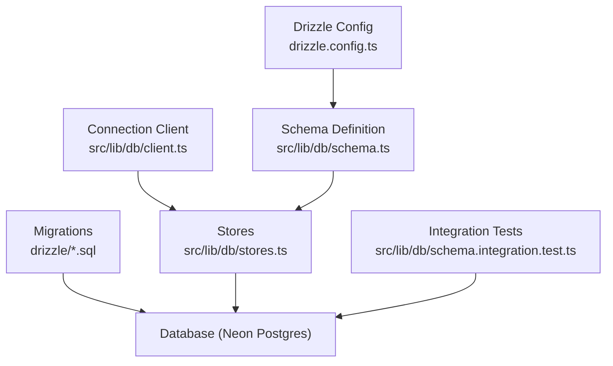
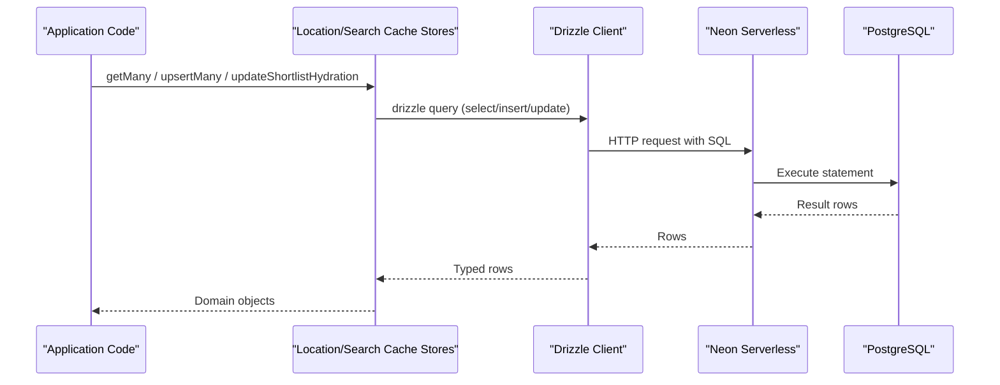
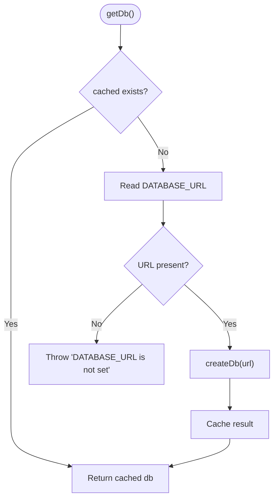
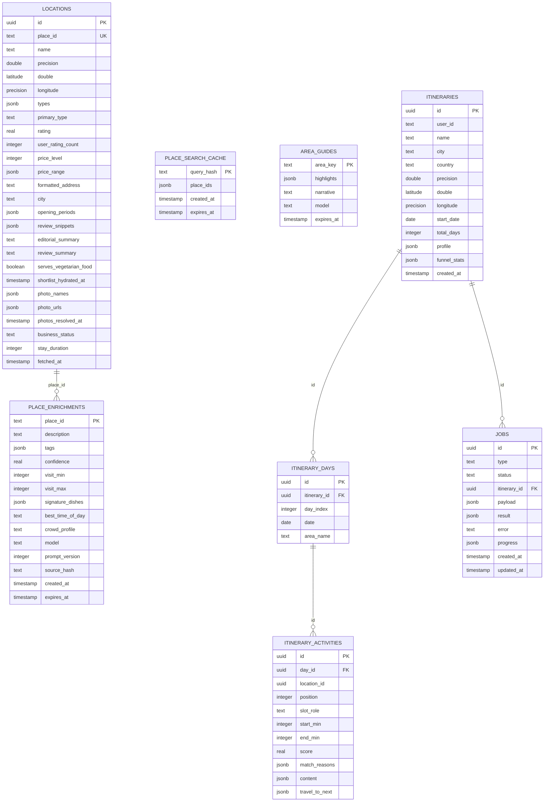
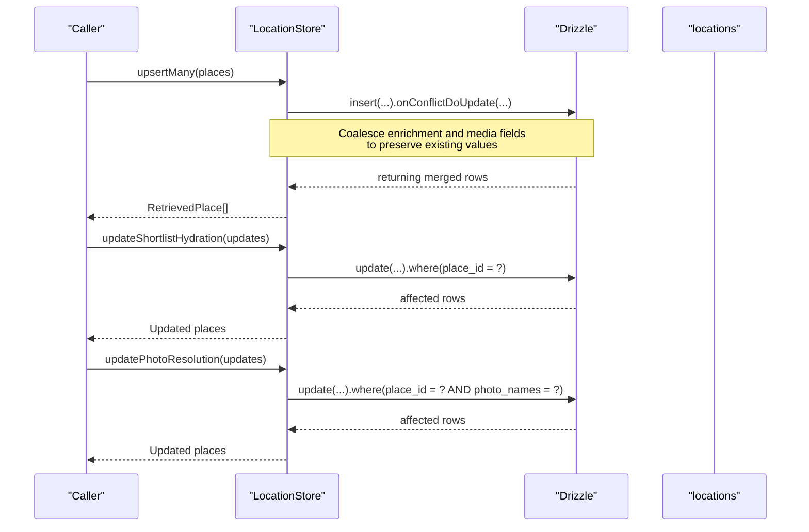
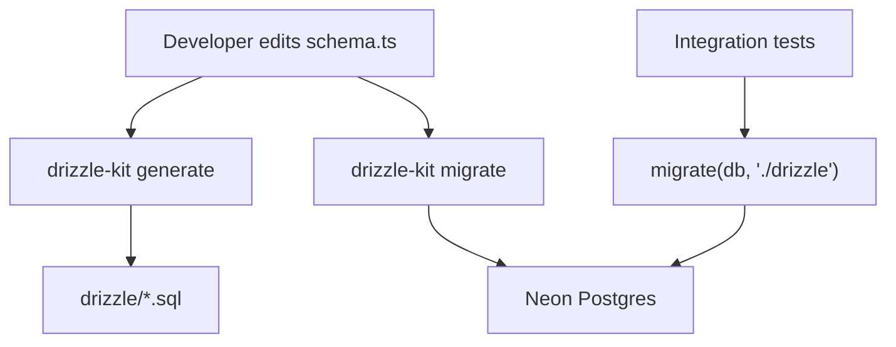
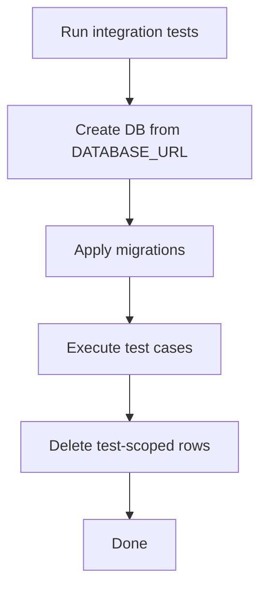
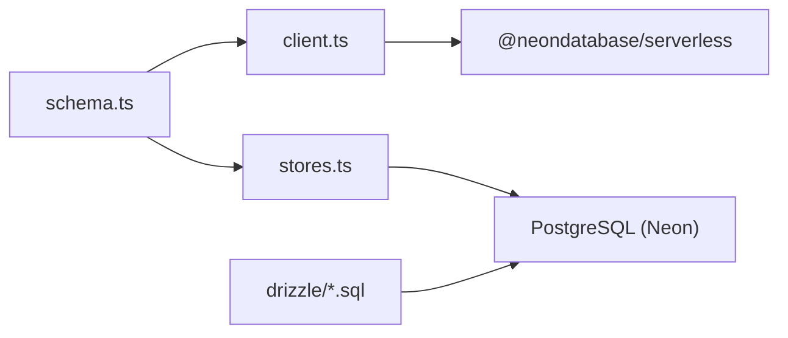

# Database Infrastructure

<cite>
**Referenced Files in This Document**
- [drizzle.config.ts](file://drizzle.config.ts)
- [package.json](file://package.json)
- [src/lib/db/client.ts](file://src/lib/db/client.ts)
- [src/lib/db/schema.ts](file://src/lib/db/schema.ts)
- [src/lib/db/stores.ts](file://src/lib/db/stores.ts)
- [src/lib/db/index.ts](file://src/lib/db/index.ts)
- [drizzle/0000_strange_the_professor.sql](file://drizzle/0000_strange_the_professor.sql)
- [drizzle/0001_living_warbound.sql](file://drizzle/0001_living_warbound.sql)
- [src/lib/db/schema.test.ts](file://src/lib/db/schema.test.ts)
- [src/lib/db/schema.integration.test.ts](file://src/lib/db/schema.integration.test.ts)
- [src/lib/supabase/client.ts](file://src/lib/supabase/client.ts)
</cite>

## Table of Contents
1. [Introduction](#introduction)
2. [Project Structure](#project-structure)
3. [Core Components](#core-components)
4. [Architecture Overview](#architecture-overview)
5. [Detailed Component Analysis](#detailed-component-analysis)
6. [Dependency Analysis](#dependency-analysis)
7. [Performance Considerations](#performance-considerations)
8. [Troubleshooting Guide](#troubleshooting-guide)
9. [Conclusion](#conclusion)

## Introduction
This document explains the database infrastructure for the project. The system uses a PostgreSQL-compatible database (Neon serverless) accessed via Drizzle ORM. Schema is defined in TypeScript, migrations are generated and applied with Drizzle Kit, and data access is encapsulated through typed stores that implement retrieval ports. The design emphasizes type safety, idempotent upserts, and safe preservation of enrichment and media metadata across refetches.

## Project Structure
The database layer is organized around four main concerns:
- Configuration and tooling: Drizzle configuration and scripts
- Connection management: Lazy Neon client creation and process-wide singleton
- Schema definition: Single source of truth for tables, columns, types, and constraints
- Data access: Stores implementing search cache and location persistence with robust upsert semantics

**Diagram sources**
- [drizzle.config.ts:1-11](file://drizzle.config.ts#L1-L11)
- [src/lib/db/schema.ts:1-257](file://src/lib/db/schema.ts#L1-L257)
- [src/lib/db/client.ts:1-31](file://src/lib/db/client.ts#L1-L31)
- [src/lib/db/stores.ts:1-237](file://src/lib/db/stores.ts#L1-L237)
- [drizzle/0000_strange_the_professor.sql:1-120](file://drizzle/0000_strange_the_professor.sql#L1-L120)
- [drizzle/0001_living_warbound.sql:1-4](file://drizzle/0001_living_warbound.sql#L1-L4)

**Section sources**
- [drizzle.config.ts:1-11](file://drizzle.config.ts#L1-L11)
- [package.json:1-67](file://package.json#L1-L67)

## Core Components
- Drizzle configuration points to the schema file, output directory, PostgreSQL dialect, and credentials from environment.
- Connection client creates a Neon-backed Drizzle instance lazily and exposes a process-wide singleton getter that throws if DATABASE_URL is missing.
- Schema defines all tables, column types, indexes, and constraints as the single source of truth.
- Stores implement typed interfaces for search cache and location persistence, including careful upsert logic to preserve enrichment and resolved photos.

Key responsibilities:
- Type-safe queries and mutations via Drizzle’s inferred row types
- Idempotent writes with conflict handling
- Preservation of enrichment and media resolution across refetches
- Clear separation between connection, schema, and data access

**Section sources**
- [drizzle.config.ts:1-11](file://drizzle.config.ts#L1-L11)
- [src/lib/db/client.ts:1-31](file://src/lib/db/client.ts#L1-L31)
- [src/lib/db/schema.ts:1-257](file://src/lib/db/schema.ts#L1-L257)
- [src/lib/db/stores.ts:1-237](file://src/lib/db/stores.ts#L1-L237)

## Architecture Overview
The runtime architecture centers on a Neon HTTP client wrapped by Drizzle ORM. Application code interacts with typed stores rather than raw SQL. Migrations ensure the database schema matches the TypeScript definitions. Integration tests validate end-to-end behavior against a real Neon branch.

**Diagram sources**
- [src/lib/db/stores.ts:33-173](file://src/lib/db/stores.ts#L33-L173)
- [src/lib/db/client.ts:17-31](file://src/lib/db/client.ts#L17-L31)
- [drizzle/0000_strange_the_professor.sql:1-120](file://drizzle/0000_strange_the_professor.sql#L1-L120)

## Detailed Component Analysis

### Connection Management
- Lazy initialization avoids import-time failures when no database is available.
- Singleton pattern ensures one connection per process.
- Explicit error when DATABASE_URL is not set.

**Diagram sources**
- [src/lib/db/client.ts:22-31](file://src/lib/db/client.ts#L22-L31)

**Section sources**
- [src/lib/db/client.ts:1-31](file://src/lib/db/client.ts#L1-L31)

### Schema Design
The schema defines:
- Cached Google data table with rich JSONB fields and indexes
- Place search cache with TTL defaults
- AI enrichment tables with model versioning and expiry
- Area guides with narrative content
- Itinerary entities (itineraries, days, activities) with unique constraints
- Job queue for background tasks

Notable design choices:
- Column names match snake_case to align with downstream UI types
- JSONB columns are strongly typed via $type annotations
- Constraints enforce valid enums and uniqueness
- Indexes optimize common queries (city, types GIN index, status+created_at)

**Diagram sources**
- [src/lib/db/schema.ts:59-257](file://src/lib/db/schema.ts#L59-L257)
- [drizzle/0000_strange_the_professor.sql:1-120](file://drizzle/0000_strange_the_professor.sql#L1-L120)
- [drizzle/0001_living_warbound.sql:1-4](file://drizzle/0001_living_warbound.sql#L1-L4)

**Section sources**
- [src/lib/db/schema.ts:1-257](file://src/lib/db/schema.ts#L1-L257)

### Data Access Stores
Two primary stores implement retrieval ports:
- Search cache store: read/write with upsert and TTL-aware expiration
- Location store: bulk reads, idempotent upserts preserving enrichment and resolved photos, narrow patch methods for hydration and photo resolution

Key behaviors:
- Upserts use coalesce to avoid overwriting enrichment or resolved media unless new resource names invalidate them
- Photo resolution updates are guarded by matching resource-name arrays
- Shortlist hydration supports writing false values explicitly without being overwritten by nulls

**Diagram sources**
- [src/lib/db/stores.ts:33-173](file://src/lib/db/stores.ts#L33-L173)

**Section sources**
- [src/lib/db/stores.ts:1-237](file://src/lib/db/stores.ts#L1-L237)

### Migrations
- Initial migration creates all tables, constraints, and indexes
- Subsequent migration adds enrichment-related columns to locations
- Drizzle config ties schema to migrations and database URL

**Diagram sources**
- [drizzle.config.ts:1-11](file://drizzle.config.ts#L1-L11)
- [drizzle/0000_strange_the_professor.sql:1-120](file://drizzle/0000_strange_the_professor.sql#L1-L120)
- [drizzle/0001_living_warbound.sql:1-4](file://drizzle/0001_living_warbound.sql#L1-L4)
- [src/lib/db/schema.integration.test.ts:1-44](file://src/lib/db/schema.integration.test.ts#L1-L44)

**Section sources**
- [drizzle/0000_strange_the_professor.sql:1-120](file://drizzle/0000_strange_the_professor.sql#L1-L120)
- [drizzle/0001_living_warbound.sql:1-4](file://drizzle/0001_living_warbound.sql#L1-L4)

### Testing Strategy
- Unit-style type assertions ensure critical columns remain present and correctly typed
- Integration tests run against a real Neon branch, apply migrations, and verify round-trips and edge cases like enrichment preservation and photo invalidation

**Diagram sources**
- [src/lib/db/schema.integration.test.ts:1-44](file://src/lib/db/schema.integration.test.ts#L1-L44)

**Section sources**
- [src/lib/db/schema.test.ts:1-74](file://src/lib/db/schema.test.ts#L1-L74)
- [src/lib/db/schema.integration.test.ts:1-285](file://src/lib/db/schema.integration.test.ts#L1-L285)

## Dependency Analysis
- Drizzle ORM depends on Neon serverless client for HTTP-based connections
- Schema module is imported by both client and stores
- Stores depend on schema for table definitions and types
- Migrations are driven by schema changes and applied via Drizzle migrator

**Diagram sources**
- [src/lib/db/schema.ts:1-257](file://src/lib/db/schema.ts#L1-L257)
- [src/lib/db/client.ts:1-31](file://src/lib/db/client.ts#L1-L31)
- [src/lib/db/stores.ts:1-237](file://src/lib/db/stores.ts#L1-L237)
- [drizzle/0000_strange_the_professor.sql:1-120](file://drizzle/0000_strange_the_professor.sql#L1-L120)

**Section sources**
- [package.json:22-48](file://package.json#L22-L48)
- [src/lib/db/index.ts:1-5](file://src/lib/db/index.ts#L1-L5)

## Performance Considerations
- Use GIN index on JSONB types array for efficient filtering by place types
- Index on jobs(status, created_at) optimizes job polling and scheduling
- Default TTLs on caches reduce redundant external calls and storage growth
- Idempotent upserts prevent unnecessary writes and preserve expensive enrichment data
- Lazy connection creation avoids overhead in offline paths

[No sources needed since this section provides general guidance]

## Troubleshooting Guide
Common issues and resolutions:
- Missing DATABASE_URL: The connection getter throws early; ensure environment is configured before calling getDb
- Migration errors: Verify migrations folder path and that migrations have been generated from the latest schema
- Enrichment loss after refetch: Ensure upserts use coalesce for enrichment fields; confirm resource-name sets haven’t changed when updating photo URLs
- Photo resolution stale writes: UpdatePhotoResolution requires matching photo_names; mismatched sets will be rejected

Operational tips:
- Run integration tests against a scratch Neon branch to validate schema and migration changes
- Use Drizzle Studio for interactive inspection of schema and data
- Keep schema and migrations in sync; any change should trigger regeneration and migration

**Section sources**
- [src/lib/db/client.ts:22-31](file://src/lib/db/client.ts#L22-L31)
- [src/lib/db/stores.ts:79-173](file://src/lib/db/stores.ts#L79-L173)
- [src/lib/db/schema.integration.test.ts:41-255](file://src/lib/db/schema.integration.test.ts#L41-L255)

## Conclusion
The database infrastructure leverages Drizzle ORM with a Neon serverless PostgreSQL backend to provide a type-safe, migration-driven, and resilient data layer. The schema acts as the single source of truth, while stores encapsulate complex write semantics to protect enrichment and media metadata. Comprehensive testing ensures correctness across both unit and integration scenarios.