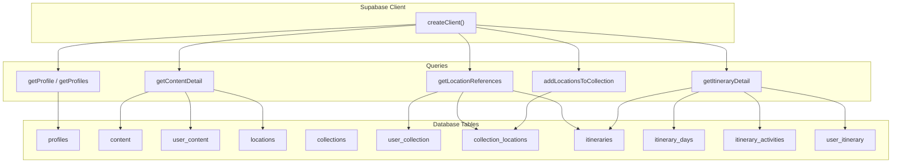
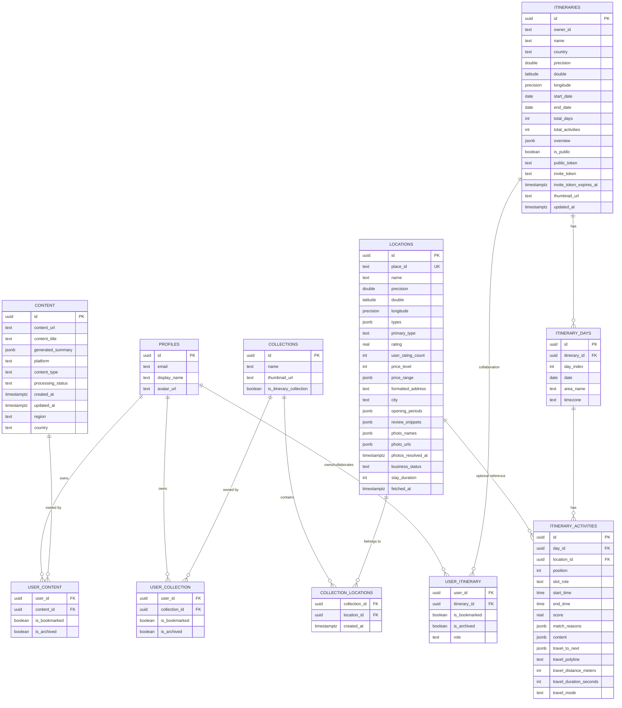
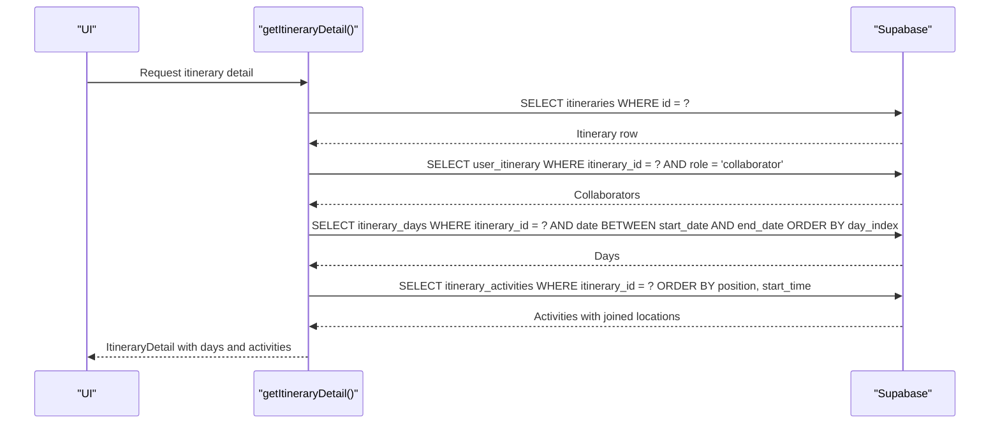
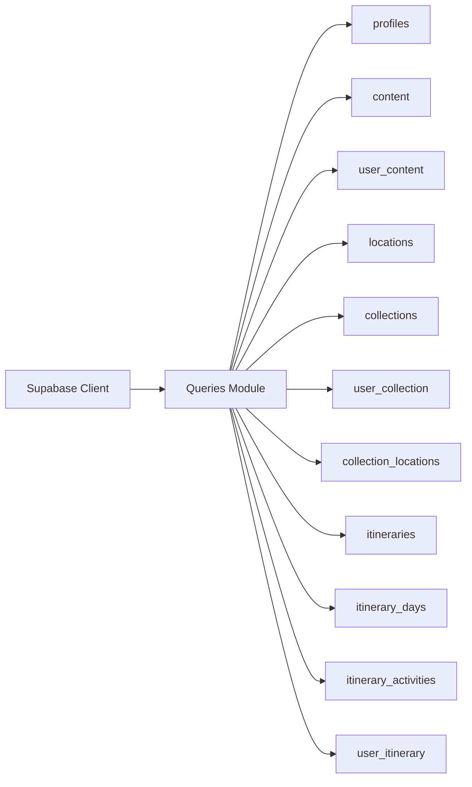

# Database Schema & Relationships

<cite>
**Referenced Files in This Document**
- [personalization-pipeline.md](file://docs/personalization-pipeline.md)
- [queries.ts](file://src/lib/supabase/queries.ts)
- [home.ts](file://src/lib/supabase/queries/home.ts)
- [location-references.ts](file://src/lib/supabase/queries/location-references.ts)
- [client.ts](file://src/lib/supabase/client.ts)
</cite>

## Table of Contents
1. Introduction
2. Project Structure
3. Core Components
4. Architecture Overview
5. Detailed Component Analysis
6. Dependency Analysis
7. Performance Considerations
8. Troubleshooting Guide
9. Conclusion

## Introduction
This document describes the database schema and relationships used by the application, focusing on collections, itineraries, locations, users, links (content), and their associations. It consolidates the authoritative SQL schema with the client-side queries that reveal additional tables and columns used at runtime. The goal is to provide a clear entity relationship model, field definitions, constraints, validation rules enforced at the database level, indexes, performance considerations, and migration strategies inferred from the codebase.

## Project Structure
The project uses Supabase as the backend data layer. Client code constructs queries against tables such as locations, itineraries, itinerary_days, itinerary_activities, collections, content, user_content, user_collection, user_itinerary, and collection_locations. A canonical SQL schema for core tables is documented in the project’s design notes.

**Diagram sources**
- [client.ts:1-9](file://src/lib/supabase/client.ts#L1-L9)
- [queries.ts:1-150](file://src/lib/supabase/queries.ts#L1-L150)
- [home.ts:159-303](file://src/lib/supabase/queries/home.ts#L159-L303)
- [location-references.ts:62-167](file://src/lib/supabase/queries/location-references.ts#L62-L167)
- [personalization-pipeline.md:808-929](file://docs/personalization-pipeline.md#L808-L929)

**Section sources**
- [client.ts:1-9](file://src/lib/supabase/client.ts#L1-L9)
- [personalization-pipeline.md:808-929](file://docs/personalization-pipeline.md#L808-L929)

## Core Components
This section summarizes the primary entities and how they relate to each other based on both the canonical SQL schema and the client queries.

- Locations: Canonical table storing cached Google Places data with geospatial and metadata fields.
- Itineraries: User-owned plans with date ranges and metadata; linked to days and activities.
- Itinerary Days: Ordered slices of an itinerary with dates and optional area labels.
- Itinerary Activities: Scheduled items within a day, optionally referencing locations and travel details.
- Collections: Reusable groups of locations; some are “itinerary-linked” and map to an itinerary.
- Content (Links): Saved links with enrichment and processing status; associated to users via a junction.
- Profiles: User profile records accessed by id.
- Junctions:
  - user_content: associates users to content (links).
  - user_collection: associates users to collections with bookmark/archive flags.
  - user_itinerary: associates users to itineraries with bookmark/archive flags.
  - collection_locations: many-to-many between collections and locations, also used to mirror activity scheduling into itinerary-linked collections.

Key relationships observed in queries:
- Itinerary detail joins itinerary_days and itinerary_activities, and can join locations through activities.
- Recent content queries join user_* junctions to filter by ownership and visibility.
- Location references query collection_locations to find which collections or itineraries contain a given location.

**Section sources**
- [personalization-pipeline.md:808-929](file://docs/personalization-pipeline.md#L808-L929)
- [queries.ts:14-46](file://src/lib/supabase/queries.ts#L14-L46)
- [queries.ts:50-99](file://src/lib/supabase/queries.ts#L50-L99)
- [queries.ts:103-114](file://src/lib/supabase/queries.ts#L103-L114)
- [home.ts:159-303](file://src/lib/supabase/queries/home.ts#L159-L303)
- [location-references.ts:62-167](file://src/lib/supabase/queries/location-references.ts#L62-L167)

## Architecture Overview
The data access layer builds typed queries against Supabase tables. The canonical schema defines core tables and constraints; client code reveals additional tables and columns used for collaboration, bookmarks, archives, and mirroring.

**Diagram sources**
- [personalization-pipeline.md:808-929](file://docs/personalization-pipeline.md#L808-L929)
- [queries.ts:14-46](file://src/lib/supabase/queries.ts#L14-L46)
- [queries.ts:50-99](file://src/lib/supabase/queries.ts#L50-L99)
- [queries.ts:103-114](file://src/lib/supabase/queries.ts#L103-L114)
- [home.ts:159-303](file://src/lib/supabase/queries/home.ts#L159-L303)
- [location-references.ts:62-167](file://src/lib/supabase/queries/location-references.ts#L62-L167)

## Detailed Component Analysis

### Locations
- Purpose: Cached Google Places data used across collections, itineraries, and search results.
- Key fields:
  - id (uuid, PK), place_id (text, unique), name, coordinates (latitude, longitude), types (jsonb array), primary_type, rating, user_rating_count, price_level, price_range (jsonb), formatted_address, city, opening_periods (jsonb), review_snippets (jsonb), photo_names (jsonb), photo_urls (jsonb), photos_resolved_at (timestamptz), business_status, stay_duration (int), fetched_at (timestamptz).
- Constraints and validation:
  - place_id is unique.
  - JSONB fields store structured data; business logic validates values at application level.
- Indexes:
  - locations_city_idx on city.
  - locations_types_idx GIN index on types.
- Usage in app:
  - Joined when fetching itinerary activities to enrich cards with location details.
  - Referenced by collection_locations and itinerary_activities (optional).

**Section sources**
- [personalization-pipeline.md:808-835](file://docs/personalization-pipeline.md#L808-L835)
- [home.ts:193-212](file://src/lib/supabase/queries/home.ts#L193-L212)

### Itineraries, Itinerary Days, Itinerary Activities
- Itineraries:
  - Fields include id, owner_id, name, country, coordinates, start_date, end_date, total_days, total_activities, overview, is_public, public_token, invite_token, invite_token_expires_at, thumbnail_url, updated_at.
  - Used to scope access via RLS and to drive recent/favorite/archived listings.
- Itinerary Days:
  - One row per day with date, day_index, area_name, timezone; ordered by day_index.
- Itinerary Activities:
  - Represents scheduled items within a day with time windows, optional location reference, travel metadata, and ordering via position.
  - Ordering rule: position is authoritative for display order; start_time is used for tie-breaking.
- Relationships:
  - itinerary_days references itineraries (cascade delete).
  - itinerary_activities references itinerary_days (cascade delete) and optionally locations.
- Business logic at DB level:
  - Unique constraints ensure one day per index and one activity per position within a day.
  - Cascade deletes maintain referential integrity when itineraries or days are removed.

**Diagram sources**
- [home.ts:159-303](file://src/lib/supabase/queries/home.ts#L159-L303)
- [personalization-pipeline.md:875-912](file://docs/personalization-pipeline.md#L875-L912)

**Section sources**
- [personalization-pipeline.md:875-912](file://docs/personalization-pipeline.md#L875-L912)
- [home.ts:159-303](file://src/lib/supabase/queries/home.ts#L159-L303)

### Collections and Collection Locations
- Collections:
  - Groups of locations; may be regular or itinerary-linked (is_itinerary_collection).
  - Support thumbnails and membership tracking via user_collection.
- Collection Locations:
  - Many-to-many between collections and locations; includes created_at to reflect when a location was added.
  - Mirrors activity scheduling into itinerary-linked collections via a database trigger referenced in comments.
- Usage:
  - Recent collections list filters out itinerary-linked collections.
  - Location references use collection_locations to discover where a location appears.

**Section sources**
- [queries.ts:103-114](file://src/lib/supabase/queries.ts#L103-L114)
- [location-references.ts:62-124](file://src/lib/supabase/queries/location-references.ts#L62-L124)
- [home.ts:369-400](file://src/lib/supabase/queries/home.ts#L369-L400)

### Users, Profiles, and Ownership/Junctions
- Profiles:
  - Basic user profile with id, email, display_name, avatar_url.
- Ownership and Collaboration:
  - user_content: associates users to content (links) with bookmark/archive flags.
  - user_collection: associates users to collections with bookmark/archive flags.
  - user_itinerary: associates users to itineraries with bookmark/archive flags and role (e.g., collaborator).
- Usage:
  - Recent content queries filter by user_id and archive/bookmark flags.
  - Itinerary detail fetches collaborators via user_itinerary.

**Section sources**
- [queries.ts:14-46](file://src/lib/supabase/queries.ts#L14-L46)
- [home.ts:311-367](file://src/lib/supabase/queries/home.ts#L311-L367)
- [home.ts:623-649](file://src/lib/supabase/queries/home.ts#L623-L649)

### Links (Content)
- Content:
  - Stores link metadata including URL, title, thumbnail, processing status, and enrichment fields.
- Associations:
  - user_content ties content to users with bookmark/archive flags.
  - content_locations associates content with locations (referenced in queries).
- Usage:
  - Recent links and favorites are retrieved by filtering content and user_content.

**Section sources**
- [queries.ts:50-99](file://src/lib/supabase/queries.ts#L50-L99)
- [home.ts:402-433](file://src/lib/supabase/queries/home.ts#L402-L433)
- [home.ts:565-591](file://src/lib/supabase/queries/home.ts#L565-L591)

## Dependency Analysis
- Client initialization:
  - createClient() configures Supabase browser client using environment variables.
- Query dependencies:
  - getProfile/getProfiles depend on profiles table.
  - getContentDetail depends on content, user_content, and locations via joins.
  - addLocationsToCollection upserts collection_locations with conflict handling.
  - getItineraryDetail composes multiple tables to return rich itinerary data.
  - getLocationReferences composes collection_locations, collections, and itineraries to show “Also found in”.

**Diagram sources**
- [client.ts:1-9](file://src/lib/supabase/client.ts#L1-L9)
- [queries.ts:1-150](file://src/lib/supabase/queries.ts#L1-L150)
- [home.ts:159-303](file://src/lib/supabase/queries/home.ts#L159-L303)
- [location-references.ts:62-167](file://src/lib/supabase/queries/location-references.ts#L62-L167)

**Section sources**
- [client.ts:1-9](file://src/lib/supabase/client.ts#L1-L9)
- [queries.ts:1-150](file://src/lib/supabase/queries.ts#L1-L150)
- [home.ts:159-303](file://src/lib/supabase/queries/home.ts#L159-L303)
- [location-references.ts:62-167](file://src/lib/supabase/queries/location-references.ts#L62-L167)

## Performance Considerations
- Indexes:
  - locations_city_idx improves city-based lookups.
  - locations_types_idx (GIN) accelerates type-array queries.
  - jobs_status_idx supports job queue operations (if used).
- Query patterns:
  - Use selective selects to minimize payload size.
  - Leverage IN clauses and precomputed maps to reduce round-trips.
  - Order by stable columns (e.g., position, day_index) to avoid expensive client-side sorting.
- Data freshness:
  - Enrichment caches have TTLs (e.g., place_enrichments expires_at) to balance cost and freshness.
- Concurrency:
  - Upsert with conflict handling prevents duplicate memberships in collection_locations.

[No sources needed since this section provides general guidance]

## Troubleshooting Guide
- Common issues:
  - Missing collaborators: Ensure user_itinerary has correct role and user_id.
  - Orphaned days/activities: Verify cascade deletes and foreign keys on itinerary_days and itinerary_activities.
  - Duplicate locations in collections: Confirm upsert behavior on collection_locations with conflict on composite key.
  - Incorrect ordering: Check that position is set correctly for itinerary_activities; start_time is only a tie-breaker.
- Debugging steps:
  - Inspect query logs for errors and messages returned by Supabase.
  - Validate RLS policies if rows are unexpectedly hidden.
  - Use “Also found in” queries to verify membership via collection_locations.

**Section sources**
- [home.ts:176-181](file://src/lib/supabase/queries/home.ts#L176-L181)
- [personalization-pipeline.md:890-912](file://docs/personalization-pipeline.md#L890-L912)
- [queries.ts:103-114](file://src/lib/supabase/queries.ts#L103-L114)

## Conclusion
The database schema centers around locations, itineraries, collections, and content, with robust junction tables enabling flexible associations and user-level scoping. The canonical SQL schema enforces strong constraints and indexes for performance, while client queries reveal additional operational tables and behaviors like collaboration roles, bookmarks, archives, and mirroring of activities into collections. Together, these components support efficient retrieval, accurate ordering, and scalable planning workflows.

[No sources needed since this section summarizes without analyzing specific files]