# Query Patterns & Data Fetching

<cite>
**Referenced Files in This Document**
- [QueryProvider.tsx](file://src/components/QueryProvider.tsx)
- [queryClient.ts](file://src/lib/query/queryClient.ts)
- [queryKeys.ts](file://src/lib/query/queryKeys.ts)
- [client.ts](file://src/lib/supabase/client.ts)
- [queries.ts](file://src/lib/supabase/queries.ts)
- [search.ts](file://src/lib/supabase/queries/search.ts)
- [recentlyViewed.ts](file://src/lib/supabase/queries/recentlyViewed.ts)
- [useCollectionsQuery.ts](file://src/hooks/queries/useCollectionsQuery.ts)
- [useItinerariesQuery.ts](file://src/hooks/queries/useItinerariesQuery.ts)
- [useProfileQuery.ts](file://src/hooks/queries/useProfileQuery.ts)
- [useItineraryDetailQuery.ts](file://src/hooks/queries/useItineraryDetailQuery.ts)
- [useSearchQuery.ts](file://src/hooks/queries/useSearchQuery.ts)
- [useRecentlyViewedQuery.ts](file://src/hooks/queries/useRecentlyViewedQuery.ts)
- [useCollaboratorProfilesQuery.ts](file://src/hooks/queries/useCollaboratorProfilesQuery.ts)
- [useEntityLocationsQuery.ts](file://src/hooks/queries/useEntityLocationsQuery.ts)
- [useLocationReferencesQuery.ts](file://src/hooks/queries/useLocationReferencesQuery.ts)
</cite>

## Table of Contents
1. [Introduction](#introduction)
2. [Project Structure](#project-structure)
3. [Core Components](#core-components)
4. [Architecture Overview](#architecture-overview)
5. [Detailed Component Analysis](#detailed-component-analysis)
6. [Dependency Analysis](#dependency-analysis)
7. [Performance Considerations](#performance-considerations)
8. [Troubleshooting Guide](#troubleshooting-guide)
9. [Conclusion](#conclusion)

## Introduction
This document explains how the application fetches, caches, and updates data using Supabase with TanStack Query. It focuses on custom hooks for collections, itineraries, profiles, search, recently viewed content, entity locations, and location references. You will learn:
- How queries are structured and keyed
- Caching strategies and invalidation patterns
- Optimistic update approaches
- Complex queries, filtering, pagination, and real-time considerations
- Error handling, loading states, and performance optimizations per domain

## Project Structure
The data layer is organized into:
- React Query provider and client configuration
- Centralized query key definitions
- Supabase client and typed query functions
- Domain-specific hooks that wrap useQuery with appropriate options

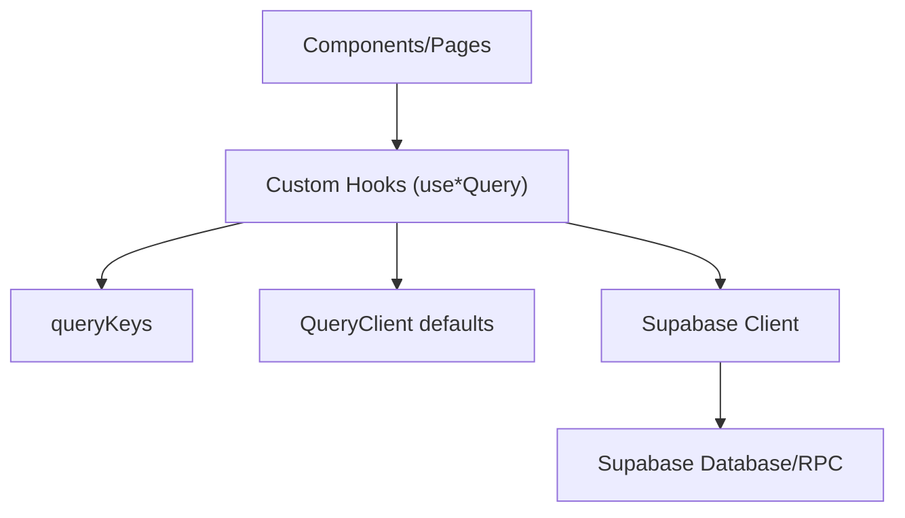

**Diagram sources**
- [QueryProvider.tsx:7-12](file://src/components/QueryProvider.tsx#L7-L12)
- [queryClient.ts:3-12](file://src/lib/query/queryClient.ts#L3-L12)
- [queryKeys.ts:1-42](file://src/lib/query/queryKeys.ts#L1-L42)
- [client.ts:3-8](file://src/lib/supabase/client.ts#L3-L8)

**Section sources**
- [QueryProvider.tsx:7-12](file://src/components/QueryProvider.tsx#L7-L12)
- [queryClient.ts:3-12](file://src/lib/query/queryClient.ts#L3-L12)
- [queryKeys.ts:1-42](file://src/lib/query/queryKeys.ts#L1-L42)
- [client.ts:3-8](file://src/lib/supabase/client.ts#L3-L8)

## Core Components
- QueryProvider wraps the app with a configured QueryClient instance to enable caching and lifecycle management.
- QueryClient sets global defaults such as staleTime, gcTime, retry behavior, and refetchOnWindowFocus policy.
- queryKeys centralizes stable, serializable keys for all queries, enabling precise invalidation and deduplication.
- Supabase client factory creates a browser client with environment-based credentials.
- Typed query functions encapsulate database access, error logging, and result shaping.

Key responsibilities:
- Provider: injects QueryClient into the React tree
- Client: defines cache lifetimes and network behavior
- Keys: define unique identifiers per query scope
- Queries: implement domain logic and data transformation
- Hooks: expose declarative data fetching with enabled flags and per-query overrides

**Section sources**
- [QueryProvider.tsx:7-12](file://src/components/QueryProvider.tsx#L7-L12)
- [queryClient.ts:3-12](file://src/lib/query/queryClient.ts#L3-L12)
- [queryKeys.ts:1-42](file://src/lib/query/queryKeys.ts#L1-L42)
- [client.ts:3-8](file://src/lib/supabase/client.ts#L3-L8)
- [queries.ts:14-29](file://src/lib/supabase/queries.ts#L14-L29)

## Architecture Overview
The data flow follows a consistent pattern:
- A hook calls useQuery with a stable queryKey and a queryFn that invokes a Supabase function via the client.
- The QueryClient caches results based on staleTime and gcTime.
- Components consume hook state (data, isLoading, isError) and trigger mutations or refetches as needed.

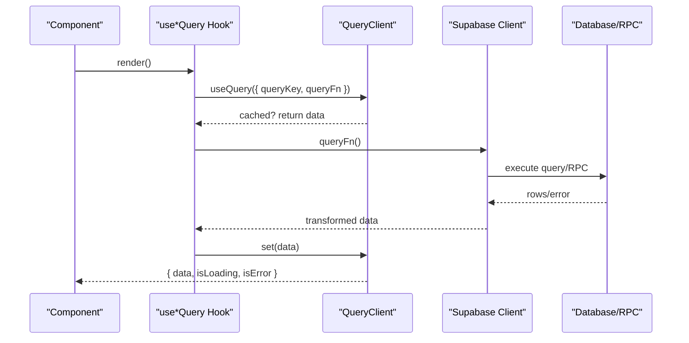

**Diagram sources**
- [queryClient.ts:3-12](file://src/lib/query/queryClient.ts#L3-L12)
- [client.ts:3-8](file://src/lib/supabase/client.ts#L3-L8)
- [useProfileQuery.ts:8-18](file://src/hooks/queries/useProfileQuery.ts#L8-L18)
- [useItineraryDetailQuery.ts:8-17](file://src/hooks/queries/useItineraryDetailQuery.ts#L8-L17)

## Detailed Component Analysis

### Collections
- Hook: useCollectionsQuery
- Key: collections
- Behavior: fetches user’s collections; short staleTime for near-real-time lists
- Use cases: listing, navigation, selection

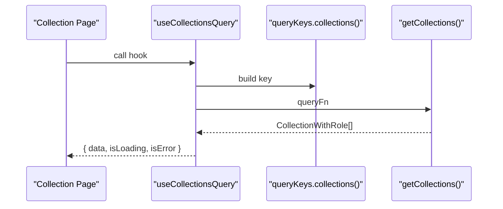

**Diagram sources**
- [useCollectionsQuery.ts:10-16](file://src/hooks/queries/useCollectionsQuery.ts#L10-L16)
- [queryKeys.ts:7-8](file://src/lib/query/queryKeys.ts#L7-L8)

**Section sources**
- [useCollectionsQuery.ts:10-16](file://src/hooks/queries/useCollectionsQuery.ts#L10-L16)
- [queryKeys.ts:7-8](file://src/lib/query/queryKeys.ts#L7-L8)

### Itineraries
- Hook: useItinerariesQuery
- Key: itineraries
- Behavior: fetches user’s itineraries; short staleTime for list freshness
- Use cases: dashboard, navigation, detail entry

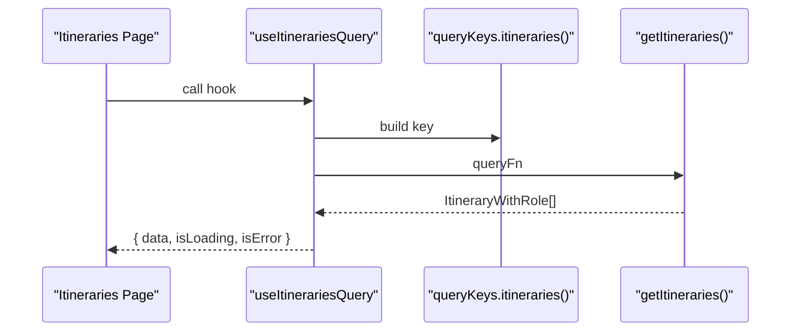

**Diagram sources**
- [useItinerariesQuery.ts:10-16](file://src/hooks/queries/useItinerariesQuery.ts#L10-L16)
- [queryKeys.ts:9](file://src/lib/query/queryKeys.ts#L9)

**Section sources**
- [useItinerariesQuery.ts:10-16](file://src/hooks/queries/useItinerariesQuery.ts#L10-L16)
- [queryKeys.ts:9](file://src/lib/query/queryKeys.ts#L9)

### Profiles
- Hook: useProfileQuery
- Key: profile(userId)
- Behavior: fetches a single profile; disabled until userId is present; long-lived cache due to infrequent changes
- Use cases: header avatar, settings, permissions

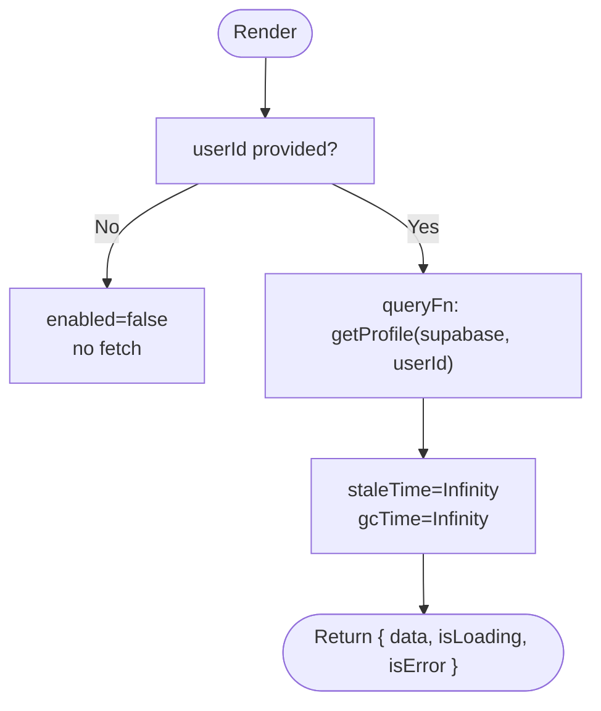

**Diagram sources**
- [useProfileQuery.ts:8-18](file://src/hooks/queries/useProfileQuery.ts#L8-L18)
- [queries.ts:14-29](file://src/lib/supabase/queries.ts#L14-L29)
- [queryKeys.ts:4](file://src/lib/query/queryKeys.ts#L4)

**Section sources**
- [useProfileQuery.ts:8-18](file://src/hooks/queries/useProfileQuery.ts#L8-L18)
- [queries.ts:14-29](file://src/lib/supabase/queries.ts#L14-L29)
- [queryKeys.ts:4](file://src/lib/query/queryKeys.ts#L4)

### Itinerary Detail
- Hook: useItineraryDetailQuery
- Key: itineraryDetail(id)
- Behavior: fetches full itinerary details; disabled until id exists; moderate staleTime
- Use cases: detail page, editing, map view

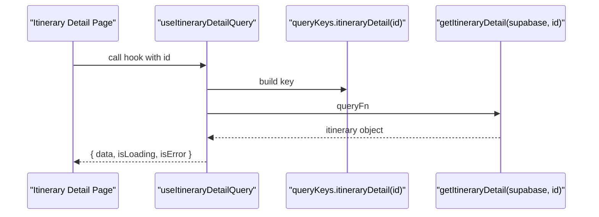

**Diagram sources**
- [useItineraryDetailQuery.ts:8-17](file://src/hooks/queries/useItineraryDetailQuery.ts#L8-L17)
- [queryKeys.ts:10](file://src/lib/query/queryKeys.ts#L10)

**Section sources**
- [useItineraryDetailQuery.ts:8-17](file://src/hooks/queries/useItineraryDetailQuery.ts#L8-L17)
- [queryKeys.ts:10](file://src/lib/query/queryKeys.ts#L10)

### Search
- Hook: useSearchQuery
- Key: search(query, filterType, offset)
- Behavior: paginated search via RPC; enabled only when userId and non-empty query; short staleTime for responsive UX
- Pagination: uses offset and hasMore flag from RPC response
- Enrichment: attaches collection preview images where applicable

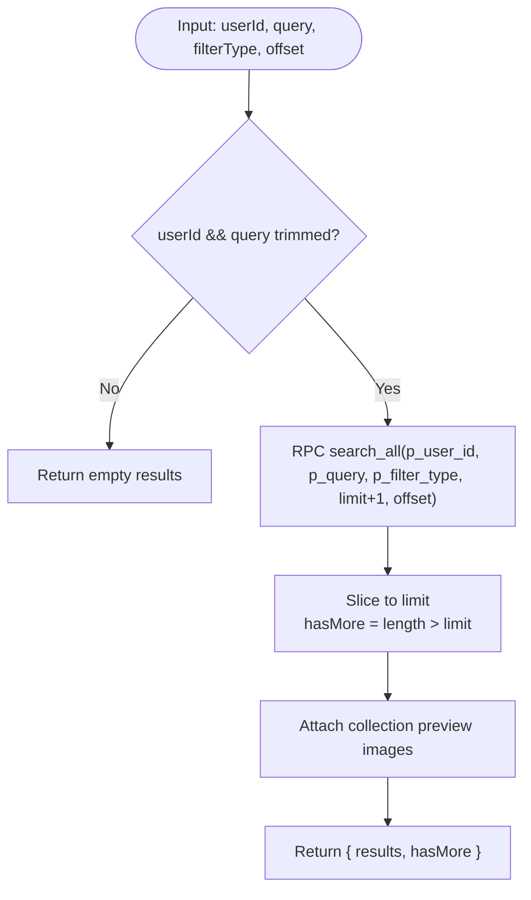

**Diagram sources**
- [useSearchQuery.ts:8-23](file://src/hooks/queries/useSearchQuery.ts#L8-L23)
- [search.ts:21-67](file://src/lib/supabase/queries/search.ts#L21-L67)
- [search.ts:69-85](file://src/lib/supabase/queries/search.ts#L69-L85)
- [queryKeys.ts:16-17](file://src/lib/query/queryKeys.ts#L16-L17)

**Section sources**
- [useSearchQuery.ts:8-23](file://src/hooks/queries/useSearchQuery.ts#L8-L23)
- [search.ts:21-67](file://src/lib/supabase/queries/search.ts#L21-L67)
- [search.ts:69-85](file://src/lib/supabase/queries/search.ts#L69-L85)
- [queryKeys.ts:16-17](file://src/lib/query/queryKeys.ts#L16-L17)

### Recently Viewed
- Hook: useRecentlyViewedQuery
- Key: recentlyViewed(userId)
- Behavior: fetches recent items grouped by type; enriches with previews; medium staleTime
- Use cases: dashboard, quick access

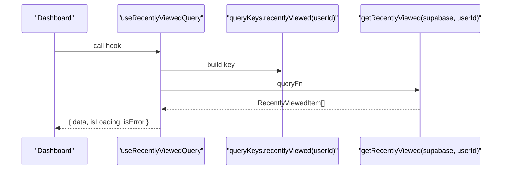

**Diagram sources**
- [useRecentlyViewedQuery.ts:8-18](file://src/hooks/queries/useRecentlyViewedQuery.ts#L8-L18)
- [recentlyViewed.ts:13-93](file://src/lib/supabase/queries/recentlyViewed.ts#L13-L93)
- [queryKeys.ts:15](file://src/lib/query/queryKeys.ts#L15)

**Section sources**
- [useRecentlyViewedQuery.ts:8-18](file://src/hooks/queries/useRecentlyViewedQuery.ts#L8-L18)
- [recentlyViewed.ts:13-93](file://src/lib/supabase/queries/recentlyViewed.ts#L13-L93)
- [queryKeys.ts:15](file://src/lib/query/queryKeys.ts#L15)

### Collaborator Profiles
- Hook: useCollaboratorProfilesQuery
- Key: ["collaboratorProfiles", ...sorted(userIds)]
- Behavior: batch fetches multiple profiles; enabled when at least one userId; long-lived cache
- Use cases: collaboration panels, sharing views

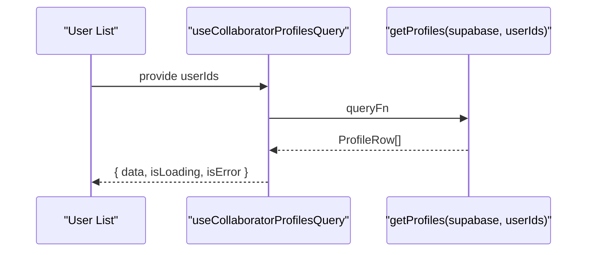

**Diagram sources**
- [useCollaboratorProfilesQuery.ts:7-17](file://src/hooks/queries/useCollaboratorProfilesQuery.ts#L7-L17)
- [queries.ts:31-46](file://src/lib/supabase/queries.ts#L31-L46)

**Section sources**
- [useCollaboratorProfilesQuery.ts:7-17](file://src/hooks/queries/useCollaboratorProfilesQuery.ts#L7-L17)
- [queries.ts:31-46](file://src/lib/supabase/queries.ts#L31-L46)

### Entity Locations
- Hook: useEntityLocationsQuery
- Key: entityLocations(entityType, entityId)
- Behavior: fetches locations associated with an entity (link, collection, itinerary); supports distinct aggregation for itineraries; medium staleTime
- Use cases: sidebar maps, related places

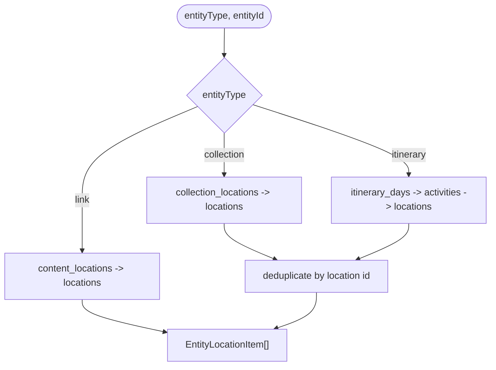

**Diagram sources**
- [useEntityLocationsQuery.ts:8-21](file://src/hooks/queries/useEntityLocationsQuery.ts#L8-L21)
- [search.ts:93-160](file://src/lib/supabase/queries/search.ts#L93-L160)
- [queryKeys.ts:18-19](file://src/lib/query/queryKeys.ts#L18-L19)

**Section sources**
- [useEntityLocationsQuery.ts:8-21](file://src/hooks/queries/useEntityLocationsQuery.ts#L8-L21)
- [search.ts:93-160](file://src/lib/supabase/queries/search.ts#L93-L160)
- [queryKeys.ts:18-19](file://src/lib/query/queryKeys.ts#L18-L19)

### Location References
- Hook: useLocationReferencesQuery
- Key: locationReferences(locationId, exclude)
- Behavior: finds other collections/itineraries referencing a location; disabled until locationId exists; medium staleTime
- Use cases: “Also in” suggestions, cross-references

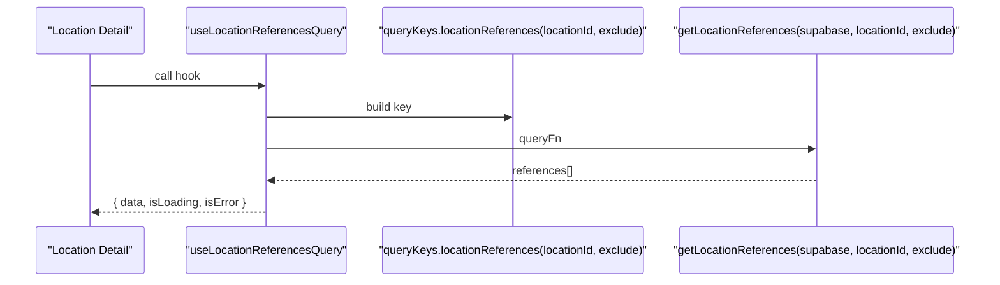

**Diagram sources**
- [useLocationReferencesQuery.ts:16-30](file://src/hooks/queries/useLocationReferencesQuery.ts#L16-L30)
- [queryKeys.ts:31-40](file://src/lib/query/queryKeys.ts#L31-L40)

**Section sources**
- [useLocationReferencesQuery.ts:16-30](file://src/hooks/queries/useLocationReferencesQuery.ts#L16-L30)
- [queryKeys.ts:31-40](file://src/lib/query/queryKeys.ts#L31-L40)

## Dependency Analysis
- All hooks depend on:
  - queryKeys for stable identification
  - Supabase client for network access
  - QueryClient defaults for caching behavior
- Domain modules encapsulate complex joins and enrichment to keep hooks thin and reusable

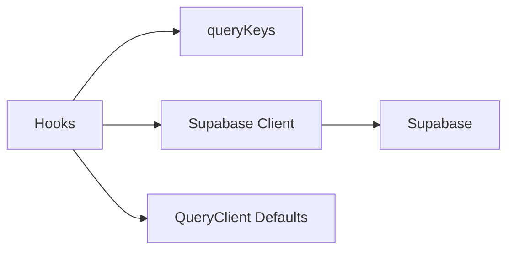

**Diagram sources**
- [queryKeys.ts:1-42](file://src/lib/query/queryKeys.ts#L1-L42)
- [client.ts:3-8](file://src/lib/supabase/client.ts#L3-L8)
- [queryClient.ts:3-12](file://src/lib/query/queryClient.ts#L3-L12)

**Section sources**
- [queryKeys.ts:1-42](file://src/lib/query/queryKeys.ts#L1-L42)
- [client.ts:3-8](file://src/lib/supabase/client.ts#L3-L8)
- [queryClient.ts:3-12](file://src/lib/query/queryClient.ts#L3-L12)

## Performance Considerations
- Stale times:
  - Lists (collections, itineraries): short staleTime to keep listings fresh without excessive refetches
  - Profiles: infinite staleTime/gcTime since profiles change rarely
  - Search: short staleTime for responsiveness
  - Recently viewed and entity/location queries: medium staleTime balancing freshness and cost
- Enabled flags:
  - Disable queries until required parameters exist (e.g., userId, id, entityType) to avoid unnecessary requests
- Deduplication:
  - queryKeys ensure identical queries are coalesced and cached once
- Batch operations:
  - Collaborator profiles batch-fetch multiple users in a single request
- Enrichment:
  - Search and recently viewed attach collection preview images efficiently after primary queries complete
- Network:
  - Retry count is low globally; consider per-query retries for critical flows if needed

[No sources needed since this section provides general guidance]

## Troubleshooting Guide
Common issues and resolutions:
- No data returned:
  - Verify enabled flags (e.g., userId, id) are true before fetching
  - Check Supabase RLS policies and filters applied in queries
- Stale or outdated data:
  - Adjust staleTime per hook or invalidate specific keys after mutations
- Excessive network calls:
  - Ensure queryKeys include all variables that affect results (e.g., offset, filterType)
  - Use batched queries where possible (e.g., collaborator profiles)
- Errors:
  - Inspect console logs from query functions for detailed errors
  - Handle isLoading and isError states in components to show user feedback

**Section sources**
- [useProfileQuery.ts:8-18](file://src/hooks/queries/useProfileQuery.ts#L8-L18)
- [useItineraryDetailQuery.ts:8-17](file://src/hooks/queries/useItineraryDetailQuery.ts#L8-L17)
- [useSearchQuery.ts:8-23](file://src/hooks/queries/useSearchQuery.ts#L8-L23)
- [queries.ts:14-29](file://src/lib/supabase/queries.ts#L14-L29)

## Conclusion
The application uses a consistent, scalable pattern for data fetching:
- Thin hooks with clear enabled conditions and per-query staleTimes
- Centralized query keys for precise invalidation and deduplication
- Supabase query functions that encapsulate complex joins and enrichment
- Global caching defaults tuned for responsiveness and efficiency

Adopt these patterns when adding new entities:
- Define a queryKey function
- Implement a typed query function
- Create a hook with enabled checks and appropriate staleTime
- Invalidate keys after mutations to keep UI consistent

[No sources needed since this section summarizes without analyzing specific files]