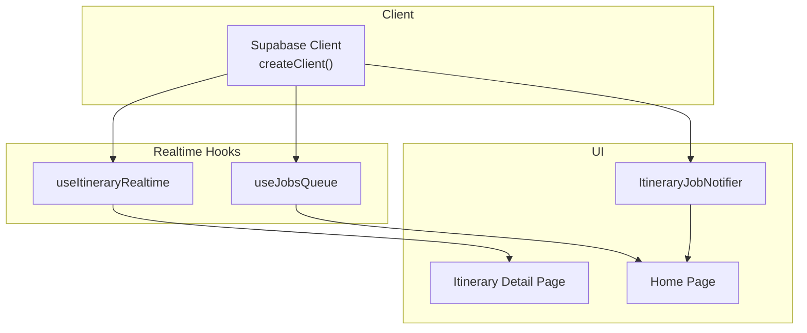
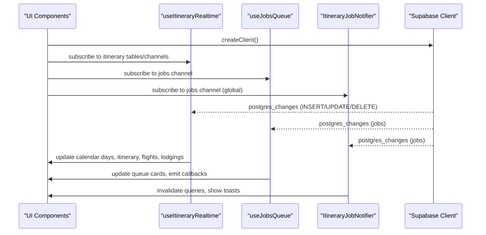
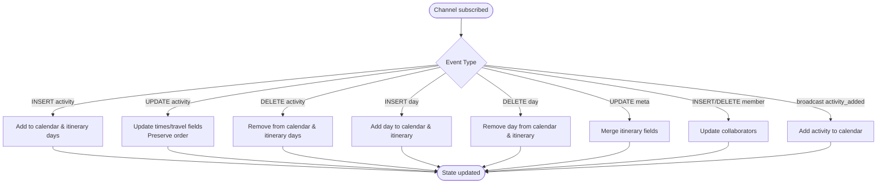
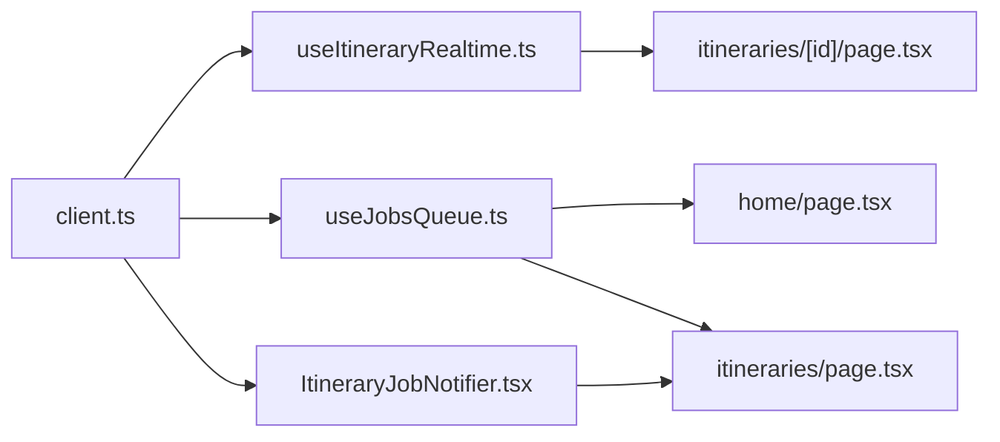

# Real-time Subscriptions & Live Updates

<cite>
**Referenced Files in This Document**
- [useItineraryRealtime.ts](file://src/hooks/useItineraryRealtime.ts)
- [useJobsQueue.ts](file://src/hooks/useJobsQueue.ts)
- [ItineraryJobNotifier.tsx](file://src/components/notifications/ItineraryJobNotifier.tsx)
- [client.ts](file://src/lib/supabase/client.ts)
- [itineraries page.tsx](file://src/app/itineraries/[id]/page.tsx)
- [home page.tsx](file://src/app/home/page.tsx)
- [itineraries page.tsx](file://src/app/itineraries/page.tsx)
- [personalization-pipeline.md](file://docs/personalization-pipeline.md)
</cite>

## Table of Contents
1. [Introduction](#introduction)
2. [Project Structure](#project-structure)
3. [Core Components](#core-components)
4. [Architecture Overview](#architecture-overview)
5. [Detailed Component Analysis](#detailed-component-analysis)
6. [Dependency Analysis](#dependency-analysis)
7. [Performance Considerations](#performance-considerations)
8. [Troubleshooting Guide](#troubleshooting-guide)
9. [Conclusion](#conclusion)

## Introduction
This document explains how the application uses Supabase real-time to power live updates across job queues, itinerary changes, and collaborative editing. It covers subscription patterns, event handling, message formats, connection management, notifications, presence detection via database rows, and conflict resolution strategies for multi-user edits. It also provides guidance on implementing live collaboration features and handling connection interruptions.

## Project Structure
The real-time behavior is implemented primarily through:
- A client factory that creates a Supabase browser client with environment configuration.
- A hook that subscribes to multiple tables and channels for itinerary data and collaborator presence.
- A hook that subscribes to job queue updates and reconciles missed events after reconnects or visibility changes.
- A global notifier component that listens for itinerary planning jobs and surfaces user-facing notifications.
- Pages that consume these hooks to render live UI updates.



**Diagram sources**
- [client.ts:1-9](file://src/lib/supabase/client.ts#L1-L9)
- [useItineraryRealtime.ts:27-533](file://src/hooks/useItineraryRealtime.ts#L27-L533)
- [useJobsQueue.ts:45-296](file://src/hooks/useJobsQueue.ts#L45-L296)
- [ItineraryJobNotifier.tsx:10-92](file://src/components/notifications/ItineraryJobNotifier.tsx#L10-L92)
- [itineraries page.tsx:74-162](file://src/app/itineraries/page.tsx#L74-L162)
- [home page.tsx:192-240](file://src/app/home/page.tsx#L192-L240)

**Section sources**
- [client.ts:1-9](file://src/lib/supabase/client.ts#L1-L9)
- [useItineraryRealtime.ts:27-533](file://src/hooks/useItineraryRealtime.ts#L27-L533)
- [useJobsQueue.ts:45-296](file://src/hooks/useJobsQueue.ts#L45-L296)
- [ItineraryJobNotifier.tsx:10-92](file://src/components/notifications/ItineraryJobNotifier.tsx#L10-L92)
- [itineraries page.tsx:74-162](file://src/app/itineraries/page.tsx#L74-L162)
- [home page.tsx:192-240](file://src/app/home/page.tsx#L192-L240)

## Core Components
- Supabase client factory: Creates a browser client using environment variables for URL and anon key.
- Itinerary realtime hook: Subscribes to activity, day, meta, member, flight, and lodging changes; handles inserts, updates, deletes, and broadcast events; hydrates related data when needed.
- Jobs queue hook: Subscribes to job table changes per user and type; reconciles missed transitions; emits completion/failure/rejection callbacks; manages connection errors and reconnection.
- Job notifier component: Listens for itinerary planning job updates and invalidates queries while showing success/error toasts.

**Section sources**
- [client.ts:1-9](file://src/lib/supabase/client.ts#L1-L9)
- [useItineraryRealtime.ts:27-533](file://src/hooks/useItineraryRealtime.ts#L27-L533)
- [useJobsQueue.ts:45-296](file://src/hooks/useJobsQueue.ts#L45-L296)
- [ItineraryJobNotifier.tsx:10-92](file://src/components/notifications/ItineraryJobNotifier.tsx#L10-L92)

## Architecture Overview
The system relies on Supabase Postgres change events to propagate updates in near real time. Each feature area opens one or more channels scoped by resource identifiers (e.g., itinerary id, user id). The UI subscribes to these channels and applies deltas to local state, ensuring consistent views across collaborators.



**Diagram sources**
- [useItineraryRealtime.ts:89-333](file://src/hooks/useItineraryRealtime.ts#L89-L333)
- [useJobsQueue.ts:167-267](file://src/hooks/useJobsQueue.ts#L167-L267)
- [ItineraryJobNotifier.tsx:45-88](file://src/components/notifications/ItineraryJobNotifier.tsx#L45-L88)
- [client.ts:1-9](file://src/lib/supabase/client.ts#L1-L9)

## Detailed Component Analysis

### Itinerary Realtime Hook
Responsibilities:
- Subscribe to changes on activities, days, itineraries metadata, members, flights, and lodgings.
- Apply inserts, updates, and deletes to both calendar view and itinerary detail state.
- Handle cross-day moves and preserve ordering semantics.
- Hydrate location details for newly inserted activities asynchronously.
- Listen to broadcast events for immediate UI feedback.

Key behaviors:
- Activity INSERT: Adds to calendar and itinerary days; hydrates location if available.
- Activity UPDATE: Updates times, travel legs, mode; preserves same-day placement to avoid reordering artifacts.
- Activity DELETE: Removes from both calendar and itinerary days.
- Day INSERT/DELETE: Adjusts date range and mirrors into itinerary days.
- Meta UPDATE: Merges itinerary-level fields like name and country.
- Members INSERT/DELETE: Updates collaborator list for presence-like behavior.
- Flights/Lodgings: Conditional subscriptions based on sidebar visibility.

Message format highlights:
- postgres_changes payloads include eventType, new, old records typed according to schema.
- Broadcast event activity_added carries a CalendarActivity shape.

Connection lifecycle:
- Channels are created per itinerary id and removed on unmount.
- Activities channel reference is stored for potential programmatic control.



**Diagram sources**
- [useItineraryRealtime.ts:89-333](file://src/hooks/useItineraryRealtime.ts#L89-L333)
- [useItineraryRealtime.ts:335-440](file://src/hooks/useItineraryRealtime.ts#L335-L440)
- [useItineraryRealtime.ts:442-530](file://src/hooks/useItineraryRealtime.ts#L442-L530)

**Section sources**
- [useItineraryRealtime.ts:27-533](file://src/hooks/useItineraryRealtime.ts#L27-L533)

### Jobs Queue Hook
Responsibilities:
- Maintain a local queue of jobs per user and type.
- Subscribe to all changes on the jobs table filtered by user id.
- Reconcile missed transitions after reconnect or tab visibility changes.
- Emit terminal transition callbacks for completed, failed, and rejected jobs.
- Manage connection error states and cleanup channels on unmount.

Key behaviors:
- Initial fetch includes recent failed jobs for retry visibility.
- Visibility change triggers reconciliation to settle jobs stuck mid-progress.
- Channel status events set connectionError and trigger reconcile on SUBSCRIBED.
- Optimistic upsert supports immediate UI updates after retries.

Message format highlights:
- postgres_changes payloads include eventType, new, old records with QueueJob shape.
- Status transitions tracked via Map to avoid duplicate callbacks.

```mermaid
sequenceDiagram
participant UI as "UI"
participant JQ as "useJobsQueue"
participant SB as "Supabase Client"
UI->>JQ : mount with userId & type
JQ->>SB : initial query (queued/pending/processing + recent failed)
SB-->>JQ : jobs[]
JQ->>SB : subscribe to jobs channel (user filter)
SB-->>JQ : INSERT/UPDATE/DELETE
JQ->>JQ : reconcile on reconnect/visibility
JQ->>UI : update queue, emit callbacks
Note over JQ,SB : Connection errors set flag; SUBSCRIBED triggers reconcile
```

**Diagram sources**
- [useJobsQueue.ts:78-165](file://src/hooks/useJobsQueue.ts#L78-L165)
- [useJobsQueue.ts:167-267](file://src/hooks/useJobsQueue.ts#L167-L267)
- [useJobsQueue.ts:269-296](file://src/hooks/useJobsQueue.ts#L269-L296)

**Section sources**
- [useJobsQueue.ts:45-296](file://src/hooks/useJobsQueue.ts#L45-L296)

### Itinerary Job Notifier
Responsibilities:
- Track current user session and subscribe to itinerary-planning job updates.
- Invalidate relevant queries upon completion or failure.
- Show success or error toasts once per status transition.

Key behaviors:
- Maintains a Map of last known statuses to detect transitions.
- Filters for itinerary-planning type and active statuses during initialization.
- Invalidates caches for itineraries, upcoming itineraries, and usage metrics.

**Section sources**
- [ItineraryJobNotifier.tsx:10-92](file://src/components/notifications/ItineraryJobNotifier.tsx#L10-L92)

### Pages Consuming Realtime
- Itineraries page: Uses useJobsQueue for planning jobs, shows optimistic cards, invalidates queries on completion, and removes or retries jobs.
- Home page: Uses useJobsQueue for content analysis and planning jobs, shows toasts, and refreshes lists.

These pages demonstrate how to integrate job queue realtime with UI flows and query cache invalidation.

**Section sources**
- [itineraries page.tsx:74-162](file://src/app/itineraries/page.tsx#L74-L162)
- [home page.tsx:192-240](file://src/app/home/page.tsx#L192-L240)

## Dependency Analysis
- All real-time components depend on the Supabase client factory for channel creation.
- Itinerary realtime depends on utility functions for time parsing and formatting, and types for itinerary structures.
- Jobs queue depends on the QueueJob interface and integrates with query client invalidation via notifier.
- Pages depend on hooks and query keys to keep UI and cache consistent.



**Diagram sources**
- [client.ts:1-9](file://src/lib/supabase/client.ts#L1-L9)
- [useItineraryRealtime.ts:27-533](file://src/hooks/useItineraryRealtime.ts#L27-L533)
- [useJobsQueue.ts:45-296](file://src/hooks/useJobsQueue.ts#L45-L296)
- [ItineraryJobNotifier.tsx:10-92](file://src/components/notifications/ItineraryJobNotifier.tsx#L10-L92)
- [itineraries page.tsx:74-162](file://src/app/itineraries/page.tsx#L74-L162)
- [home page.tsx:192-240](file://src/app/home/page.tsx#L192-L240)

**Section sources**
- [client.ts:1-9](file://src/lib/supabase/client.ts#L1-L9)
- [useItineraryRealtime.ts:27-533](file://src/hooks/useItineraryRealtime.ts#L27-L533)
- [useJobsQueue.ts:45-296](file://src/hooks/useJobsQueue.ts#L45-L296)
- [ItineraryJobNotifier.tsx:10-92](file://src/components/notifications/ItineraryJobNotifier.tsx#L10-L92)
- [itineraries page.tsx:74-162](file://src/app/itineraries/page.tsx#L74-L162)
- [home page.tsx:192-240](file://src/app/home/page.tsx#L192-L240)

## Performance Considerations
- Channel deduplication: Multiple mounts with the same topic share a single channel; the code adds instance-specific suffixes to avoid conflicts when subscribing to the same table with different filters.
- Reconciliation: After reconnect or visibility change, the jobs queue re-reads active jobs to settle transitions missed during downtime.
- Conditional subscriptions: Flight and lodging channels are only active when their sidebars are open, reducing unnecessary traffic.
- Local deduplication: Insert handlers check for existing items before appending to prevent duplicates in arrays.
- Efficient updates: Same-day updates replace items in place to avoid re-sorting artifacts and preserve map pin numbering.

[No sources needed since this section provides general guidance]

## Troubleshooting Guide
Common issues and resolutions:
- Missed updates after reconnect: Use reconciliation to re-fetch active jobs and apply terminal transitions.
- Duplicate items in lists: Ensure insert handlers check for existing ids before adding.
- Stale legs after reorder: Clear stale leg references until server cascade returns new values.
- Connection errors: Monitor channel status; set connection flags and reconcile on SUBSCRIBED.
- Overlap conflicts during drag-and-drop: Preview leg durations and cascade times; present a deconflict confirmation before applying changes.

Operational tips:
- Keep channel names unique per instance to avoid subscription conflicts.
- Unsubscribe channels on unmount to prevent memory leaks.
- Use optimistic updates judiciously; reconcile with server state promptly.

**Section sources**
- [useJobsQueue.ts:105-136](file://src/hooks/useJobsQueue.ts#L105-L136)
- [useJobsQueue.ts:250-267](file://src/hooks/useJobsQueue.ts#L250-L267)
- [itineraries page.tsx:926-1003](file://src/app/itineraries/[id]/page.tsx#L926-L1003)

## Conclusion
The application implements robust real-time capabilities using Supabase channels and postgres_changes to deliver live updates for job queues, itinerary changes, and collaborative editing. It combines direct database subscriptions with broadcast events, careful reconciliation, and optimistic UI updates to maintain consistency and responsiveness. For future enhancements, consider explicit presence channels and operational safeguards such as rate limiting and conflict resolution policies aligned with business rules.

[No sources needed since this section summarizes without analyzing specific files]