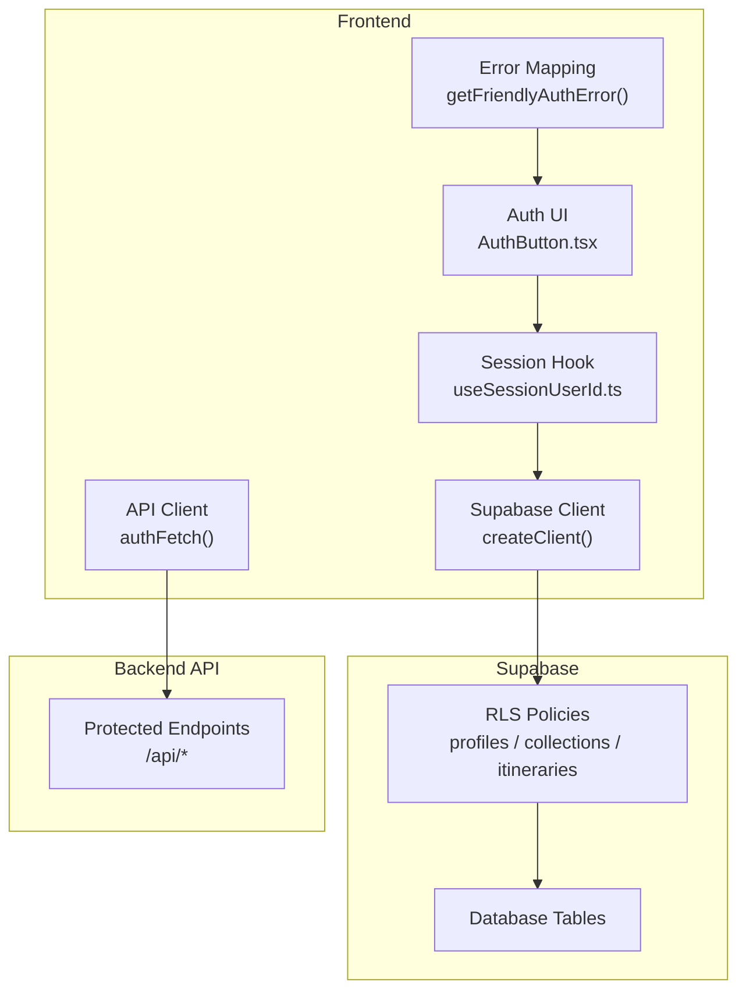
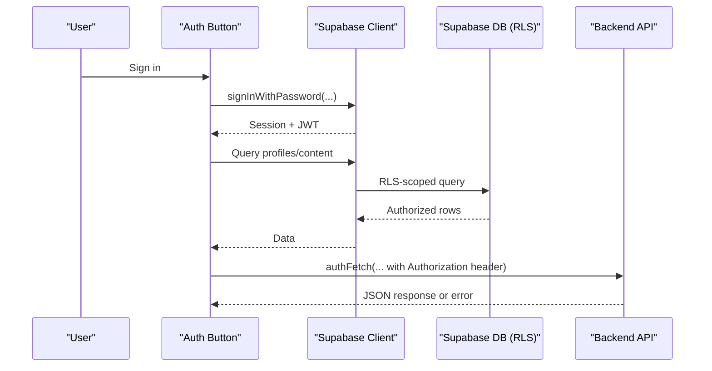
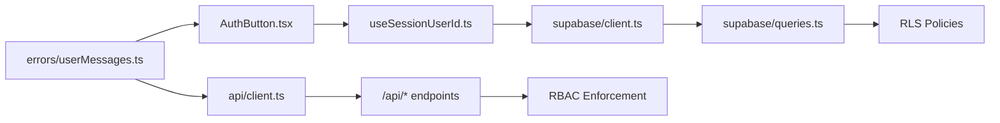

# Security & Row Level Security

<cite>
**Referenced Files in This Document**
- [client.ts](file://src/lib/supabase/client.ts)
- [queries.ts](file://src/lib/supabase/queries.ts)
- [location-references.ts](file://src/lib/supabase/queries/location-references.ts)
- [useSessionUserId.ts](file://src/hooks/useSessionUserId.ts)
- [userMessages.ts](file://src/lib/errors/userMessages.ts)
- [password-policy.ts](file://src/lib/auth/password-policy.ts)
- [AuthButton.tsx](file://src/components/ui/auth/AuthButton.tsx)
- [client.ts](file://src/lib/api/client.ts)
- [collections.ts](file://src/lib/api/collections.ts)
</cite>

## Table of Contents
1. Introduction
2. Project Structure
3. Core Components
4. Architecture Overview
5. Detailed Component Analysis
6. Dependency Analysis
7. Performance Considerations
8. Troubleshooting Guide
9. Conclusion

## Introduction
This document explains how Supabase security is implemented in the application, focusing on Row Level Security (RLS), authentication flows, authorization patterns, and secure API interactions. It covers role-based access control concepts as enforced by RLS policies, policy-driven data isolation, JWT token handling for both Supabase and backend APIs, session management, and user-friendly error handling. Where applicable, it also outlines patterns for audit logging of sensitive operations via server-side endpoints.

## Project Structure
Security-related code is organized into:
- Supabase client initialization and queries that rely on RLS for data isolation
- Authentication utilities and UI components
- Error mapping to friendly messages
- Backend API client that attaches JWT tokens for authorization

**Diagram sources**
- [client.ts:1-9](file://src/lib/supabase/client.ts#L1-L9)
- [AuthButton.tsx:1-41](file://src/components/ui/auth/AuthButton.tsx#L1-L41)
- [useSessionUserId.ts:1-19](file://src/hooks/useSessionUserId.ts#L1-L19)
- [client.ts:52-94](file://src/lib/api/client.ts#L52-L94)
- [userMessages.ts:1-107](file://src/lib/errors/userMessages.ts#L1-L107)

**Section sources**
- [client.ts:1-9](file://src/lib/supabase/client.ts#L1-L9)
- [AuthButton.tsx:1-41](file://src/components/ui/auth/AuthButton.tsx#L1-L41)
- [useSessionUserId.ts:1-19](file://src/hooks/useSessionUserId.ts#L1-L19)
- [client.ts:52-94](file://src/lib/api/client.ts#L52-L94)
- [userMessages.ts:1-107](file://src/lib/errors/userMessages.ts#L1-L107)

## Core Components
- Supabase client creation using environment variables for URL and anon key
- Session-aware hooks to read current user id from Supabase session
- Queries that depend on RLS to enforce per-user data visibility
- Password policy validation mirrored on the client side
- Friendly error mapping for auth and API errors
- Backend API client that injects JWT Authorization headers

Key responsibilities:
- Data isolation: RLS ensures users only see their own or permitted data
- Authentication: Supabase Auth manages sessions; client reads session state
- Authorization: Backend API validates JWT and enforces RBAC
- UX safety: User-facing messages avoid leaking technical details

**Section sources**
- [client.ts:1-9](file://src/lib/supabase/client.ts#L1-L9)
- [useSessionUserId.ts:1-19](file://src/hooks/useSessionUserId.ts#L1-L19)
- [queries.ts:14-29](file://src/lib/supabase/queries.ts#L14-L29)
- [password-policy.ts:1-41](file://src/lib/auth/password-policy.ts#L1-L41)
- [userMessages.ts:1-107](file://src/lib/errors/userMessages.ts#L1-L107)
- [client.ts:52-94](file://src/lib/api/client.ts#L52-L94)

## Architecture Overview
The application uses a layered security model:
- Frontend relies on Supabase RLS for row-level data isolation
- Supabase Auth provides sessions and JWTs
- Backend API endpoints validate JWTs and apply role-based checks
- UI surfaces friendly errors and guides users through secure flows

**Diagram sources**
- [AuthButton.tsx:1-41](file://src/components/ui/auth/AuthButton.tsx#L1-L41)
- [client.ts:1-9](file://src/lib/supabase/client.ts#L1-L9)
- [queries.ts:50-99](file://src/lib/supabase/queries.ts#L50-L99)
- [client.ts:52-94](file://src/lib/api/client.ts#L52-L94)

## Detailed Component Analysis

### Supabase Client and Session Management
- The browser client is created with environment variables for URL and anon key
- A hook retrieves the current user id from the Supabase session, returning null until loaded or signed out
- This pattern centralizes session reading and avoids repeated session calls across components

Best practices:
- Always create a single client instance per module or reuse via factory
- Guard UI and queries when userId is null to prevent unauthorized requests

**Section sources**
- [client.ts:1-9](file://src/lib/supabase/client.ts#L1-L9)
- [useSessionUserId.ts:1-19](file://src/hooks/useSessionUserId.ts#L1-L19)

### Row Level Security (RLS) and Data Isolation
- Queries select from tables such as profiles and content, relying on RLS to filter rows by the authenticated user’s context
- Comments in the code explicitly note that scoping is enforced by RLS and inner joins, so passing userId in the request body is unnecessary for these queries
- Location references queries demonstrate RLS-scoped joins and ordering based on membership timestamps

Implementation notes:
- Use .select() with minimal fields
- Prefer inner joins where ownership must be verified at the database level
- Order results to stabilize UI behavior during optimistic updates

**Section sources**
- [queries.ts:50-99](file://src/lib/supabase/queries.ts#L50-L99)
- [location-references.ts:47-73](file://src/lib/supabase/queries/location-references.ts#L47-L73)

### Role-Based Access Control (RBAC) and Authorization Patterns
- While RLS handles row-level isolation, the backend API enforces RBAC for actions like generating public tokens, invite tokens, listing collaborators, and removing collaborators
- The frontend calls protected endpoints via an API client that attaches the Supabase JWT in the Authorization header
- Error mapping whitelists safe backend messages to display to users while suppressing technical details

Patterns:
- Generate/revoke tokens for sharing resources (collections, itineraries)
- List/remove collaborators with owner-only checks on the server
- Return consistent error contracts for 401/403 scenarios

**Section sources**
- [collections.ts:127-157](file://src/lib/api/collections.ts#L127-L157)
- [client.ts:52-94](file://src/lib/api/client.ts#L52-L94)
- [userMessages.ts:49-107](file://src/lib/errors/userMessages.ts#L49-L107)

### JWT Token Handling and Secure API Interactions
- The API client extracts the current session access token and attaches it as a Bearer Authorization header
- Requests without a valid token are rejected early with a 401-style error
- Response unwrapping centralizes error handling and status checking

Security considerations:
- Never log or expose tokens in logs or analytics
- Ensure HTTPS for all API calls
- Validate responses and handle network failures gracefully

**Section sources**
- [client.ts:52-94](file://src/lib/api/client.ts#L52-L94)

### Authentication Flows and Password Policy
- The password policy is mirrored on the client to provide immediate feedback while the server enforces the authoritative rules
- The policy includes minimum length, lowercase, uppercase, digit, and symbol requirements aligned with Supabase settings
- UI components render live requirement checks and disable submission until valid

Operational guidance:
- Keep client and server policies synchronized
- Surface clear, actionable feedback to users
- Map backend auth errors to friendly messages

**Section sources**
- [password-policy.ts:1-41](file://src/lib/auth/password-policy.ts#L1-L41)
- [userMessages.ts:1-48](file://src/lib/errors/userMessages.ts#L1-L48)
- [AuthButton.tsx:1-41](file://src/components/ui/auth/AuthButton.tsx#L1-L41)

### Audit Logging for Sensitive Operations
- Sensitive operations (e.g., generating or revoking tokens, adding/removing collaborators) are performed via backend endpoints
- These endpoints should log immutable audit records including actor identity, action type, target resource, timestamp, and outcome
- Frontend should not assume success without server confirmation and should surface user-friendly errors

Recommended audit fields:
- actor_id (from JWT)
- action (e.g., generate_public_token, revoke_invite_token)
- resource_type and resource_id
- ip_address and user_agent (from request)
- result (success/failure)
- timestamp (UTC)

[No sources needed since this section provides general guidance]

## Dependency Analysis
The following diagram shows how security-related modules depend on each other:

**Diagram sources**
- [AuthButton.tsx:1-41](file://src/components/ui/auth/AuthButton.tsx#L1-L41)
- [useSessionUserId.ts:1-19](file://src/hooks/useSessionUserId.ts#L1-L19)
- [client.ts:1-9](file://src/lib/supabase/client.ts#L1-L9)
- [queries.ts:14-29](file://src/lib/supabase/queries.ts#L14-L29)
- [client.ts:52-94](file://src/lib/api/client.ts#L52-L94)
- [userMessages.ts:1-107](file://src/lib/errors/userMessages.ts#L1-L107)

**Section sources**
- [AuthButton.tsx:1-41](file://src/components/ui/auth/AuthButton.tsx#L1-L41)
- [useSessionUserId.ts:1-19](file://src/hooks/useSessionUserId.ts#L1-L19)
- [client.ts:1-9](file://src/lib/supabase/client.ts#L1-L9)
- [queries.ts:14-29](file://src/lib/supabase/queries.ts#L14-L29)
- [client.ts:52-94](file://src/lib/api/client.ts#L52-L94)
- [userMessages.ts:1-107](file://src/lib/errors/userMessages.ts#L1-L107)

## Performance Considerations
- Leverage RLS to minimize client-side filtering and reduce payload sizes
- Select only necessary columns to lower bandwidth and improve query performance
- Cache frequently accessed data with appropriate stale times to reduce redundant requests
- Avoid excessive re-renders by memoizing session-dependent computations
- Batch operations where possible (e.g., upserting multiple location memberships)

[No sources needed since this section provides general guidance]

## Troubleshooting Guide
Common issues and resolutions:
- Unauthenticated requests: Ensure a valid session exists before calling protected endpoints; the API client will reject missing tokens
- Permission denied: Verify RLS policies allow the current user to access the requested rows; check ownership and collaboration roles
- Weak password: Align client password policy with Supabase configuration; guide users to meet requirements
- Network or SMTP errors: Display friendly messages and retry with backoff; do not expose internal stack traces

Useful tools:
- Inspect Supabase logs for RLS denials and auth events
- Check network tab for Authorization header presence and response codes
- Use error mapping functions to ensure consistent user messaging

**Section sources**
- [userMessages.ts:1-107](file://src/lib/errors/userMessages.ts#L1-L107)
- [client.ts:52-94](file://src/lib/api/client.ts#L52-L94)

## Conclusion
The application combines Supabase RLS for robust data isolation with JWT-based authorization for backend operations. Sessions are managed centrally, queries are scoped by RLS, and the API client ensures secure communication with protected endpoints. User-friendly error handling and synchronized password policies enhance the security posture while maintaining a smooth user experience. For sensitive operations, implement server-side audit logging to maintain accountability and support incident response.

[No sources needed since this section summarizes without analyzing specific files]