# Supabase Integration

<cite>
**Referenced Files in This Document**
- [client.ts](file://src/lib/supabase/client.ts)
- [next.config.js](file://next.config.js)
- [useSessionUserId.ts](file://src/hooks/useSessionUserId.ts)
- [AuthButton.tsx](file://src/components/ui/auth/AuthButton.tsx)
- [GoogleAuthButton.tsx](file://src/components/ui/auth/GoogleAuthButton.tsx)
- [userMessages.ts](file://src/lib/errors/userMessages.ts)
- [QueryProvider.tsx](file://src/components/QueryProvider.tsx)
- [queryClient.ts](file://src/lib/query/queryClient.ts)
- [useItinerariesQuery.ts](file://src/hooks/queries/useItinerariesQuery.ts)
- [useCollectionsQuery.ts](file://src/hooks/queries/useCollectionsQuery.ts)
- [useProfileQuery.ts](file://src/hooks/queries/useProfileQuery.ts)
- [home.ts](file://src/lib/supabase/queries/home.ts)
- [location-references.ts](file://src/lib/supabase/queries/location-references.ts)
- [personalization-pipeline.md](file://docs/personalization-pipeline.md)
- [useJobsQueue.ts](file://src/hooks/useJobsQueue.ts)
- [usePaginatedContent.ts](file://src/hooks/usePaginatedContent.ts)
- [useItineraryRealtime.ts](file://src/hooks/useItineraryRealtime.ts)
</cite>

## Table of Contents
1. Introduction
2. Project Structure
3. Core Components
4. Architecture Overview
5. Detailed Component Analysis
6. Dependency Analysis
7. Performance Considerations
8. Troubleshooting Guide
9. Conclusion
10. Appendices

## Introduction
This document explains how the application integrates with Supabase for authentication, database access, and real-time features. It covers client configuration, session handling, TanStack Query patterns, database schema and relationships (collections, itineraries, locations, users), CRUD and query patterns, RLS considerations, data validation, performance techniques, and real-time capabilities such as job queue monitoring and collaborative editing.

## Project Structure
The Supabase integration spans several layers:
- Client initialization and environment configuration
- Authentication hooks and UI components
- Data fetching via TanStack Query and direct Supabase queries
- Real-time subscriptions for live updates and collaboration
- Schema documentation defining tables and relationships

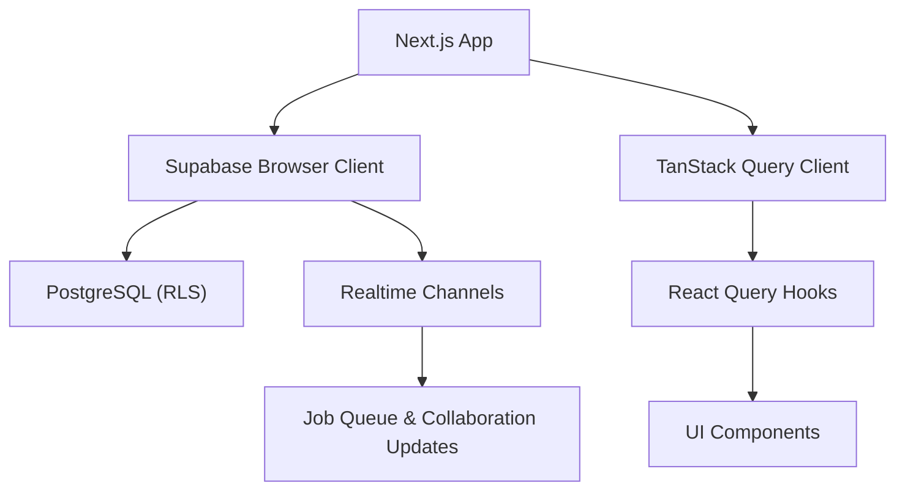

**Diagram sources**
- [client.ts:1-9](file://src/lib/supabase/client.ts#L1-L9)
- [queryClient.ts:1-12](file://src/lib/query/queryClient.ts#L1-L12)
- [useItinerariesQuery.ts:1-17](file://src/hooks/queries/useItinerariesQuery.ts#L1-L17)
- [useJobsQueue.ts:45-272](file://src/hooks/useJobsQueue.ts#L45-L272)

**Section sources**
- [client.ts:1-9](file://src/lib/supabase/client.ts#L1-L9)
- [next.config.js:1-17](file://next.config.js#L1-L17)
- [queryClient.ts:1-12](file://src/lib/query/queryClient.ts#L1-L12)

## Core Components
- Supabase client creation using environment variables for URL and anon key
- Session-based user ID resolution hook
- TanStack Query provider and default caching strategy
- Query hooks for itineraries, collections, and profile
- Direct Supabase queries for itinerary details and location references
- Realtime hooks for job queue and itinerary collaboration
- Error mapping for friendly auth messages

**Section sources**
- [client.ts:1-9](file://src/lib/supabase/client.ts#L1-L9)
- [useSessionUserId.ts:1-19](file://src/hooks/useSessionUserId.ts#L1-L19)
- [QueryProvider.tsx:1-13](file://src/components/QueryProvider.tsx#L1-L13)
- [queryClient.ts:1-12](file://src/lib/query/queryClient.ts#L1-L12)
- [useItinerariesQuery.ts:1-17](file://src/hooks/queries/useItinerariesQuery.ts#L1-L17)
- [useCollectionsQuery.ts:1-17](file://src/hooks/queries/useCollectionsQuery.ts#L1-L17)
- [useProfileQuery.ts:1-20](file://src/hooks/queries/useProfileQuery.ts#L1-L20)
- [home.ts:46-190](file://src/lib/supabase/queries/home.ts#L46-L190)
- [location-references.ts:47-145](file://src/lib/supabase/queries/location-references.ts#L47-L145)
- [useJobsQueue.ts:45-272](file://src/hooks/useJobsQueue.ts#L45-L272)
- [useItineraryRealtime.ts:385-440](file://src/hooks/useItineraryRealtime.ts#L385-L440)
- [userMessages.ts:1-11](file://src/lib/errors/userMessages.ts#L1-L11)

## Architecture Overview
The app uses a browser-side Supabase client to interact with PostgreSQL under Row Level Security. TanStack Query caches and deduplicates requests, while realtime channels provide live updates for jobs and collaborative edits.

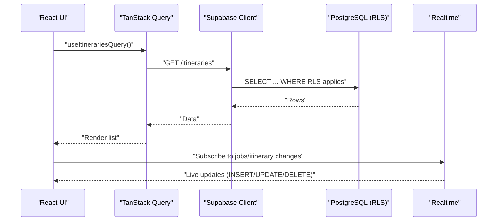

**Diagram sources**
- [useItinerariesQuery.ts:1-17](file://src/hooks/queries/useItinerariesQuery.ts#L1-L17)
- [useJobsQueue.ts:45-272](file://src/hooks/useJobsQueue.ts#L45-L272)
- [useItineraryRealtime.ts:385-440](file://src/hooks/useItineraryRealtime.ts#L385-L440)

## Detailed Component Analysis

### Supabase Client Configuration
- The browser client is created with environment variables for URL and anon key.
- Next.js config allows loading public images from Supabase storage domains.

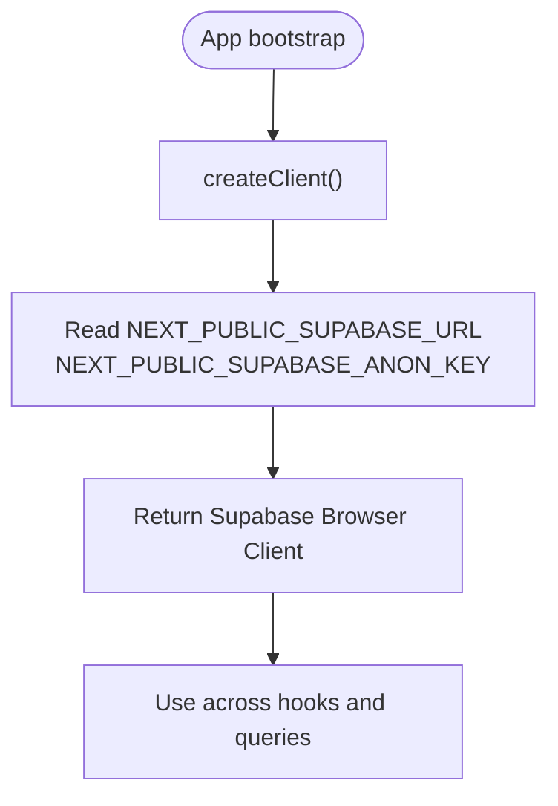

**Diagram sources**
- [client.ts:1-9](file://src/lib/supabase/client.ts#L1-L9)
- [next.config.js:1-17](file://next.config.js#L1-L17)

**Section sources**
- [client.ts:1-9](file://src/lib/supabase/client.ts#L1-L9)
- [next.config.js:1-17](file://next.config.js#L1-L17)

### Authentication Setup
- Session-based user ID retrieval via a React hook that reads the current Supabase session.
- Auth UI components provide consistent button states and accessibility.
- Friendly error mapping translates Supabase auth errors into user-facing messages.

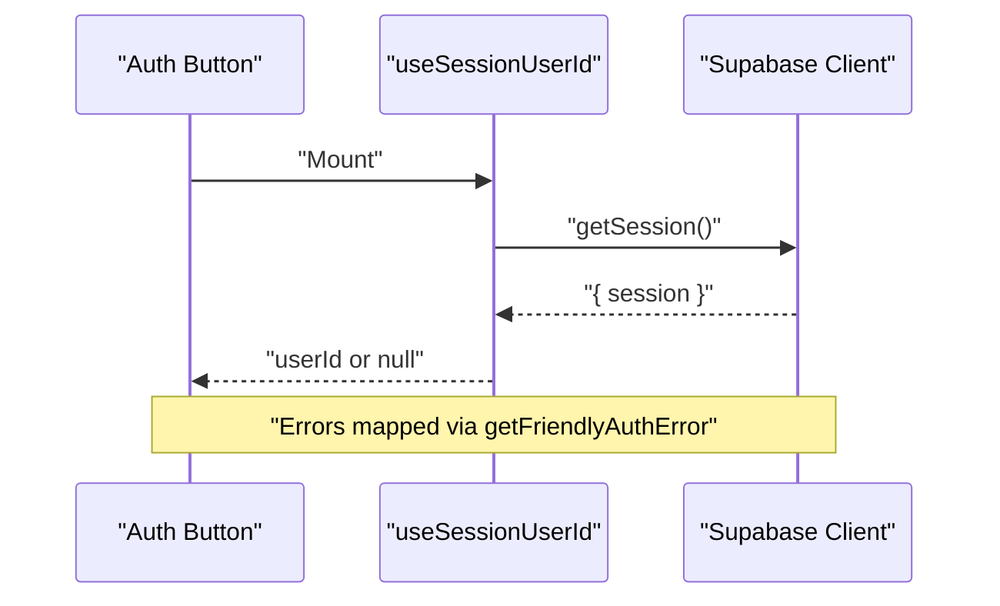

**Diagram sources**
- [useSessionUserId.ts:1-19](file://src/hooks/useSessionUserId.ts#L1-L19)
- [AuthButton.tsx:1-40](file://src/components/ui/auth/AuthButton.tsx#L1-L40)
- [GoogleAuthButton.tsx:10-60](file://src/components/ui/auth/GoogleAuthButton.tsx#L10-L60)
- [userMessages.ts:1-11](file://src/lib/errors/userMessages.ts#L1-L11)

**Section sources**
- [useSessionUserId.ts:1-19](file://src/hooks/useSessionUserId.ts#L1-L19)
- [AuthButton.tsx:1-40](file://src/components/ui/auth/AuthButton.tsx#L1-L40)
- [GoogleAuthButton.tsx:10-60](file://src/components/ui/auth/GoogleAuthButton.tsx#L10-L60)
- [userMessages.ts:1-11](file://src/lib/errors/userMessages.ts#L1-L11)

### TanStack Query Patterns
- Provider wraps the app with a configured QueryClient.
- Default options include stale time, garbage collection time, retry count, and focus refetch behavior.
- Feature-specific hooks encapsulate query keys and functions for itineraries, collections, and profiles.

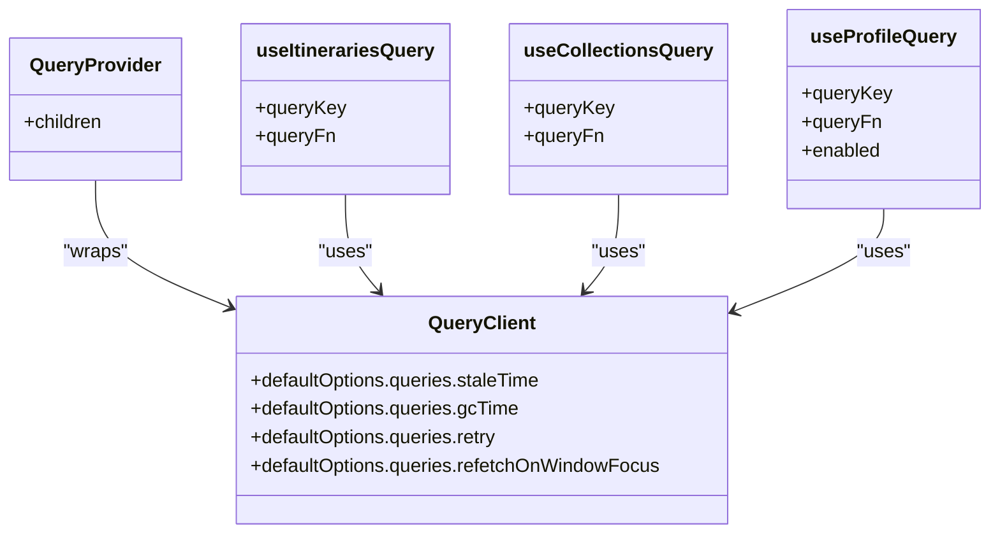

**Diagram sources**
- [QueryProvider.tsx:1-13](file://src/components/QueryProvider.tsx#L1-L13)
- [queryClient.ts:1-12](file://src/lib/query/queryClient.ts#L1-L12)
- [useItinerariesQuery.ts:1-17](file://src/hooks/queries/useItinerariesQuery.ts#L1-L17)
- [useCollectionsQuery.ts:1-17](file://src/hooks/queries/useCollectionsQuery.ts#L1-L17)
- [useProfileQuery.ts:1-20](file://src/hooks/queries/useProfileQuery.ts#L1-L20)

**Section sources**
- [QueryProvider.tsx:1-13](file://src/components/QueryProvider.tsx#L1-L13)
- [queryClient.ts:1-12](file://src/lib/query/queryClient.ts#L1-L12)
- [useItinerariesQuery.ts:1-17](file://src/hooks/queries/useItinerariesQuery.ts#L1-L17)
- [useCollectionsQuery.ts:1-17](file://src/hooks/queries/useCollectionsQuery.ts#L1-L17)
- [useProfileQuery.ts:1-20](file://src/hooks/queries/useProfileQuery.ts#L1-L20)

### Database Schema and Relationships
Core tables and relationships:
- locations: cached place data with geospatial and media fields
- itineraries, itinerary_days, itinerary_activities: plan structure with positions and roles
- jobs: background task queue with progress tracking
- Additional cache/enrichment tables supporting search and AI-driven features

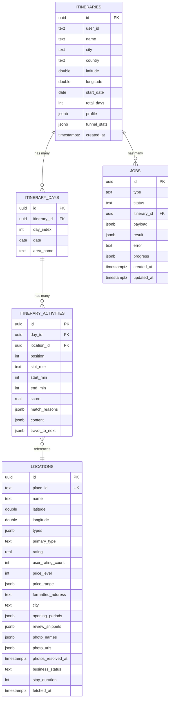

**Diagram sources**
- [personalization-pipeline.md:802-925](file://docs/personalization-pipeline.md#L802-L925)

**Section sources**
- [personalization-pipeline.md:802-925](file://docs/personalization-pipeline.md#L802-L925)

### CRUD Operations and Query Patterns
- Reading full itinerary detail including days, activities, and collaborators via direct Supabase queries.
- Resolving where a location appears across collections and itineraries through junction tables and filters.
- Paginated content loading with realtime reconciliation to avoid duplicates.

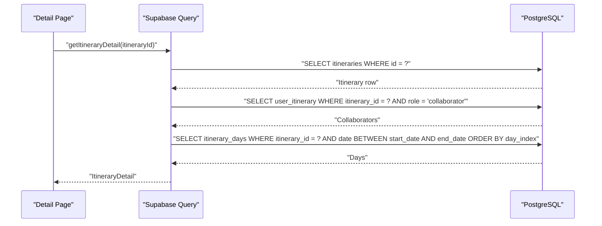

**Diagram sources**
- [home.ts:156-190](file://src/lib/supabase/queries/home.ts#L156-L190)

**Section sources**
- [home.ts:46-190](file://src/lib/supabase/queries/home.ts#L46-L190)
- [location-references.ts:47-145](file://src/lib/supabase/queries/location-references.ts#L47-L145)
- [usePaginatedContent.ts:181-220](file://src/hooks/usePaginatedContent.ts#L181-L220)

### Real-Time Subscriptions
- Job queue monitoring subscribes to INSERT/UPDATE/DELETE on jobs, reconciles state, and handles connection errors.
- Itinerary collaboration listens to updates on itineraries and membership changes in user_itinerary to reflect collaborator lists in real time.

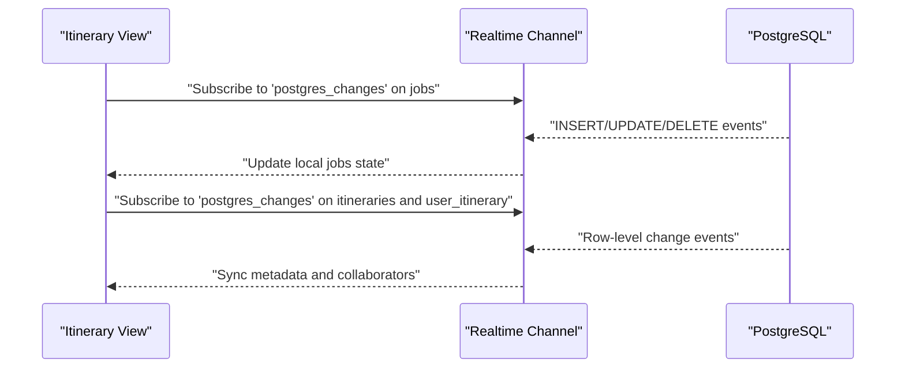

**Diagram sources**
- [useJobsQueue.ts:45-272](file://src/hooks/useJobsQueue.ts#L45-L272)
- [useItineraryRealtime.ts:385-440](file://src/hooks/useItineraryRealtime.ts#L385-L440)

**Section sources**
- [useJobsQueue.ts:45-272](file://src/hooks/useJobsQueue.ts#L45-L272)
- [useItineraryRealtime.ts:385-440](file://src/hooks/useItineraryRealtime.ts#L385-L440)

### RLS (Row Level Security) Policies
- Queries are scoped by RLS; for example, retrieving only collaborator rows for an itinerary and reading itineraries filtered by access permissions.
- Location references resolve memberships through junction tables, relying on RLS to ensure only visible collections/itineraries are returned.

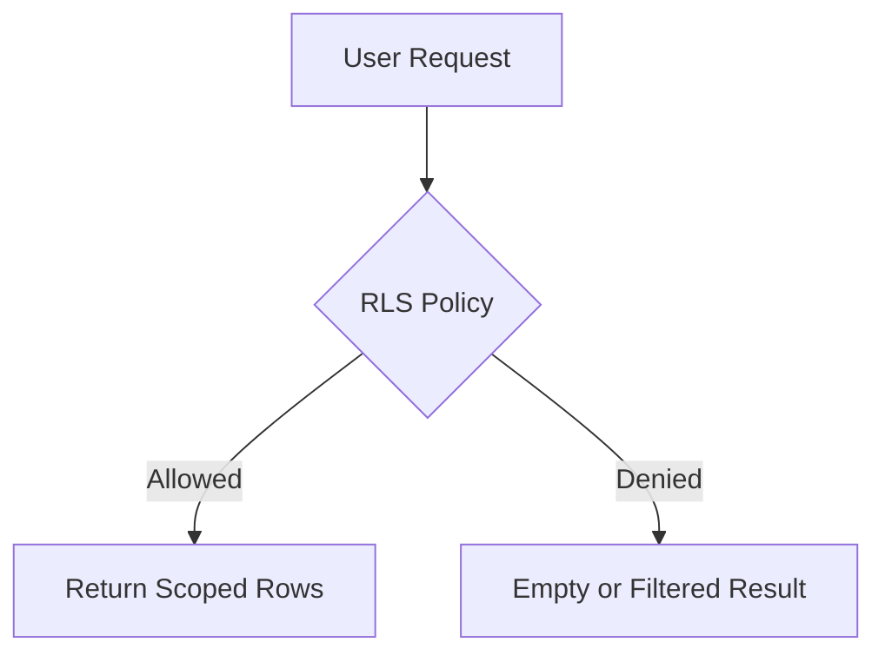

**Diagram sources**
- [home.ts:176-181](file://src/lib/supabase/queries/home.ts#L176-L181)
- [location-references.ts:138-143](file://src/lib/supabase/queries/location-references.ts#L138-L143)

**Section sources**
- [home.ts:176-181](file://src/lib/supabase/queries/home.ts#L176-L181)
- [location-references.ts:138-143](file://src/lib/supabase/queries/location-references.ts#L138-L143)

### Data Validation Rules
- Itinerary activity times are stored as minutes-from-midnight integers to avoid timezone issues and simplify validation.
- Enrichment and caching tables include constraints and indexes to maintain consistency and performance.

**Section sources**
- [personalization-pipeline.md:927-948](file://docs/personalization-pipeline.md#L927-L948)

### Performance Optimization Techniques
- QueryClient defaults reduce unnecessary refetches and manage cache lifetime.
- Pagination with deduplication prevents duplicate entries when realtime updates arrive concurrently.
- Realtime channels are instance-scoped to avoid channel collisions and enable efficient reconciliation.

**Section sources**
- [queryClient.ts:1-12](file://src/lib/query/queryClient.ts#L1-L12)
- [usePaginatedContent.ts:181-220](file://src/hooks/usePaginatedContent.ts#L181-L220)
- [useJobsQueue.ts:45-272](file://src/hooks/useJobsQueue.ts#L45-L272)

## Dependency Analysis
High-level dependencies between modules:

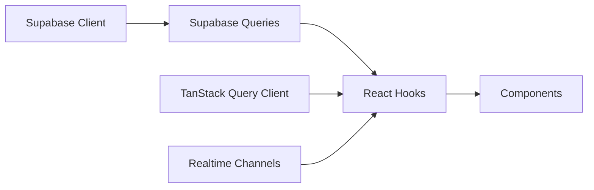

**Diagram sources**
- [client.ts:1-9](file://src/lib/supabase/client.ts#L1-L9)
- [home.ts:156-190](file://src/lib/supabase/queries/home.ts#L156-L190)
- [useJobsQueue.ts:45-272](file://src/hooks/useJobsQueue.ts#L45-L272)
- [queryClient.ts:1-12](file://src/lib/query/queryClient.ts#L1-L12)

**Section sources**
- [client.ts:1-9](file://src/lib/supabase/client.ts#L1-L9)
- [home.ts:156-190](file://src/lib/supabase/queries/home.ts#L156-L190)
- [useJobsQueue.ts:45-272](file://src/hooks/useJobsQueue.ts#L45-L272)
- [queryClient.ts:1-12](file://src/lib/query/queryClient.ts#L1-L12)

## Performance Considerations
- Prefer TanStack Query for caching and deduplication; tune staleTime and gcTime based on data volatility.
- Use pagination and incremental loading to minimize payload sizes.
- Leverage realtime channels for live updates instead of polling.
- Ensure indexes exist on frequently filtered columns (e.g., status, created_at).
- Keep realtime channels per-instance to avoid conflicts and improve reliability.

[No sources needed since this section provides general guidance]

## Troubleshooting Guide
- Authentication errors: map technical codes to friendly messages before surfacing to users.
- Realtime connection issues: detect CHANNEL_ERROR or TIMED_OUT and reconcile state upon reconnection.
- Missing data: verify RLS policies and ensure the correct scopes (e.g., collaborator-only rows) are applied.

**Section sources**
- [userMessages.ts:1-11](file://src/lib/errors/userMessages.ts#L1-L11)
- [useJobsQueue.ts:244-272](file://src/hooks/useJobsQueue.ts#L244-L272)

## Conclusion
The application integrates Supabase through a browser client, TanStack Query, and realtime channels to deliver secure, performant, and collaborative experiences. The schema supports rich planning workflows, while RLS ensures data isolation. Realtime subscriptions power live job monitoring and collaborative editing, and careful caching and pagination keep interactions responsive.

[No sources needed since this section summarizes without analyzing specific files]

## Appendices

### Example: Itinerary Detail Fetch Flow
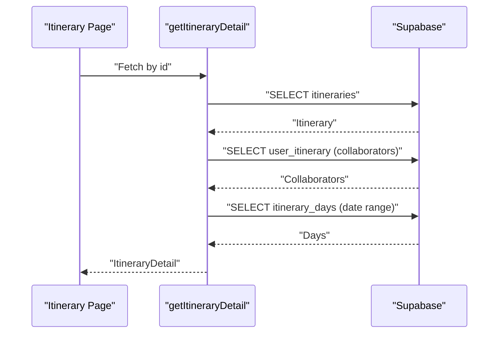

**Diagram sources**
- [home.ts:156-190](file://src/lib/supabase/queries/home.ts#L156-L190)

### Example: Job Queue Monitoring Flow
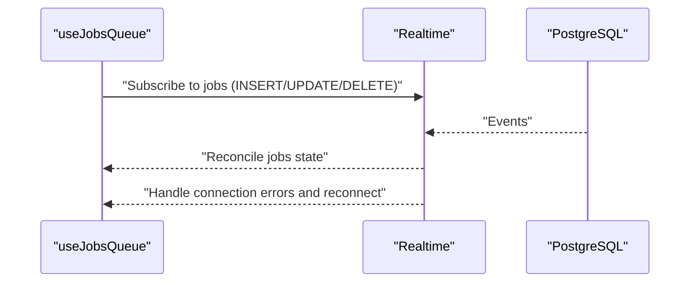

**Diagram sources**
- [useJobsQueue.ts:45-272](file://src/hooks/useJobsQueue.ts#L45-L272)