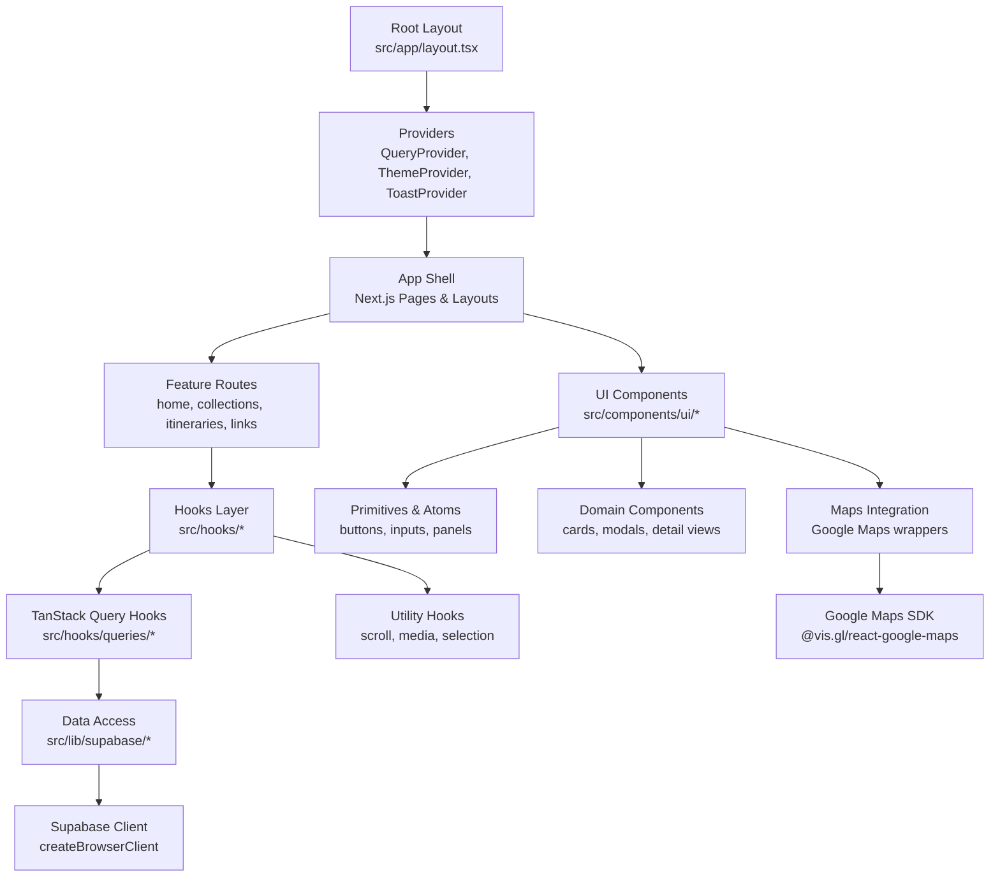
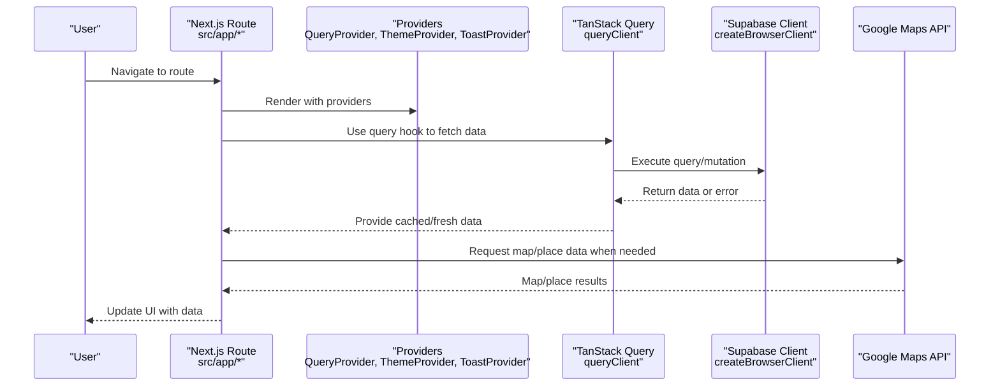
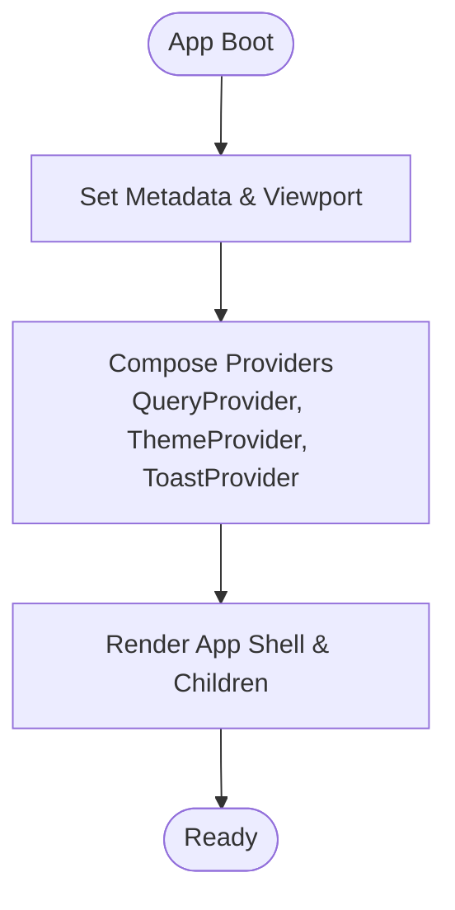
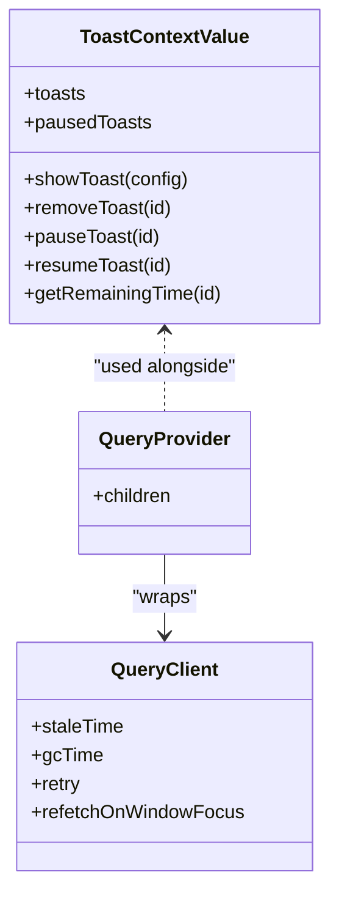
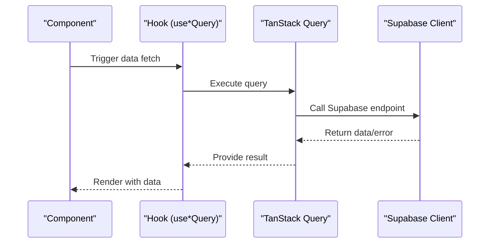
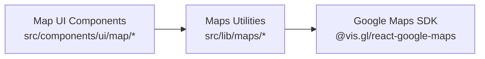
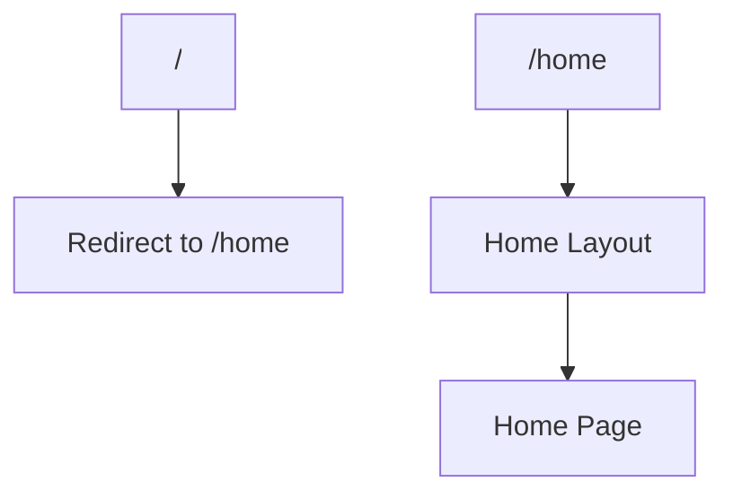
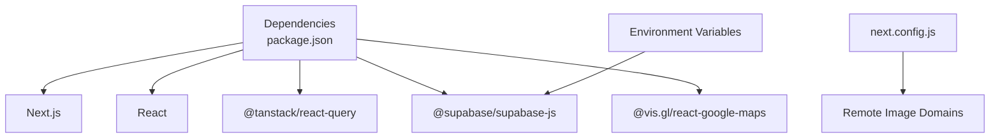

# Architecture Overview

<cite>
**Referenced Files in This Document**
- [package.json](file://package.json)
- [next.config.js](file://next.config.js)
- [src/app/layout.tsx](file://src/app/layout.tsx)
- [src/components/QueryProvider.tsx](file://src/components/QueryProvider.tsx)
- [src/components/ThemeProvider.tsx](file://src/components/ThemeProvider.tsx)
- [src/lib/query/queryClient.ts](file://src/lib/query/queryClient.ts)
- [src/lib/supabase/client.ts](file://src/lib/supabase/client.ts)
- [src/lib/site.ts](file://src/lib/site.ts)
- [src/contexts/ToastContext.tsx](file://src/contexts/ToastContext.tsx)
- [src/app/page.tsx](file://src/app/page.tsx)
</cite>

## Table of Contents
1. [Introduction](#introduction)
2. [Project Structure](#project-structure)
3. [Core Components](#core-components)
4. [Architecture Overview](#architecture-overview)
5. [Detailed Component Analysis](#detailed-component-analysis)
6. [Dependency Analysis](#dependency-analysis)
7. [Performance Considerations](#performance-considerations)
8. [Troubleshooting Guide](#troubleshooting-guide)
9. [Conclusion](#conclusion)

## Introduction
This document describes the architecture of the Argo application, a Next.js-based itinerary planner that transforms saved links into map locations and generates day-by-day plans. It covers system boundaries, component architecture, data flow patterns, state management with TanStack Query and React Context, Supabase backend integration, external service integrations (Google Maps), and deployment considerations.

## Project Structure
Argo follows the Next.js App Router convention:
- Routes live under src/app with feature folders for collections, itineraries, links, and home.
- UI components are organized under src/components/ui with subfolders for primitives, cards, modals, maps, and more.
- Business logic is encapsulated in hooks under src/hooks, including query hooks for TanStack Query and utility hooks for interactions.
- Data access and utilities are under src/lib, including Supabase client setup, queries/mutations, maps helpers, and domain types.
- Global providers and contexts are at src/components and src/contexts to share app-wide state like theme, toasts, and navigation loading.

**Diagram sources**
- [src/app/layout.tsx:57-80](file://src/app/layout.tsx#L57-L80)
- [src/components/QueryProvider.tsx:7-12](file://src/components/QueryProvider.tsx#L7-L12)
- [src/components/ThemeProvider.tsx:5-15](file://src/components/ThemeProvider.tsx#L5-L15)
- [src/lib/supabase/client.ts:3-8](file://src/lib/supabase/client.ts#L3-L8)
- [package.json:14-35](file://package.json#L14-L35)

**Section sources**
- [src/app/layout.tsx:57-80](file://src/app/layout.tsx#L57-L80)
- [package.json:14-35](file://package.json#L14-L35)

## Core Components
- Root layout and providers: The root layout composes global providers including TanStack Query, toast notifications, theme, and tooltips. It also sets metadata, fonts, and viewport settings.
- Query provider: Wraps the app with TanStack Query’s QueryClient configured with default caching and retry behavior.
- Theme provider: Uses next-themes to manage light/dark themes via class attributes.
- Toast context: Provides a centralized notification system with lifecycle control (show, pause, resume, remove).
- Supabase client: Creates a browser client using environment variables for URL and anon key.

Key responsibilities:
- Application shell and global state initialization
- Cross-cutting concerns (theme, toasts, query cache)
- Secure configuration for external services

**Section sources**
- [src/app/layout.tsx:1-85](file://src/app/layout.tsx#L1-L85)
- [src/components/QueryProvider.tsx:1-14](file://src/components/QueryProvider.tsx#L1-L14)
- [src/components/ThemeProvider.tsx:1-17](file://src/components/ThemeProvider.tsx#L1-L17)
- [src/contexts/ToastContext.tsx:1-155](file://src/contexts/ToastContext.tsx#L1-L155)
- [src/lib/supabase/client.ts:1-9](file://src/lib/supabase/client.ts#L1-L9)

## Architecture Overview
The system is a client-side rich application built on Next.js with server-rendered routes and client components for interactivity. Data flows from UI components through hooks to TanStack Query, which caches and refetches data via Supabase. External services include Google Maps for location search and display, and Supabase for authentication, database, and storage.

**Diagram sources**
- [src/app/layout.tsx:57-80](file://src/app/layout.tsx#L57-L80)
- [src/components/QueryProvider.tsx:7-12](file://src/components/QueryProvider.tsx#L7-L12)
- [src/lib/query/queryClient.ts:3-12](file://src/lib/query/queryClient.ts#L3-L12)
- [src/lib/supabase/client.ts:3-8](file://src/lib/supabase/client.ts#L3-L8)
- [package.json:14-35](file://package.json#L14-L35)

## Detailed Component Analysis

### Root Layout and Providers
- Responsibilities:
  - Define metadata, SEO, and Open Graph tags
  - Compose global providers for query caching, theme, toasts, and tooltips
  - Inject fonts and styles
- Design patterns:
  - Provider composition for cross-cutting concerns
  - Centralized configuration for query cache lifetimes and retries

**Diagram sources**
- [src/app/layout.tsx:15-49](file://src/app/layout.tsx#L15-L49)
- [src/app/layout.tsx:57-80](file://src/app/layout.tsx#L57-L80)

**Section sources**
- [src/app/layout.tsx:1-85](file://src/app/layout.tsx#L1-L85)

### State Management: TanStack Query and Context API
- TanStack Query:
  - Centralized query client with default stale time, garbage collection time, and retry policy
  - Used by hooks under src/hooks/queries to fetch and cache data
- Context API:
  - ToastContext provides user feedback across the app
  - Additional contexts exist for navbar visibility, filters, right sidebar, and navigation loading

**Diagram sources**
- [src/lib/query/queryClient.ts:3-12](file://src/lib/query/queryClient.ts#L3-L12)
- [src/components/QueryProvider.tsx:7-12](file://src/components/QueryProvider.tsx#L7-L12)
- [src/contexts/ToastContext.tsx:28-36](file://src/contexts/ToastContext.tsx#L28-L36)

**Section sources**
- [src/lib/query/queryClient.ts:1-13](file://src/lib/query/queryClient.ts#L1-L13)
- [src/components/QueryProvider.tsx:1-14](file://src/components/QueryProvider.tsx#L1-L14)
- [src/contexts/ToastContext.tsx:1-155](file://src/contexts/ToastContext.tsx#L1-L155)

### Data Access Layer: Supabase Integration
- Browser client creation using environment variables for URL and anon key
- Queries and mutations are organized under src/lib/supabase/queries and src/lib/supabase/mutations
- Separation of concerns:
  - UI components call hooks
  - Hooks use TanStack Query to invoke Supabase clients
  - Supabase client handles network requests and auth context

**Diagram sources**
- [src/lib/supabase/client.ts:3-8](file://src/lib/supabase/client.ts#L3-L8)
- [src/components/QueryProvider.tsx:7-12](file://src/components/QueryProvider.tsx#L7-L12)

**Section sources**
- [src/lib/supabase/client.ts:1-9](file://src/lib/supabase/client.ts#L1-L9)

### External Integrations: Google Maps
- Dependency on @vis.gl/react-google-maps for map rendering and place search
- Maps utilities under src/lib/maps provide helpers for URLs, locality pins, price levels, and place search
- UI components under src/components/ui/map wrap map behaviors and markers

**Diagram sources**
- [package.json:14-35](file://package.json#L14-L35)

**Section sources**
- [package.json:14-35](file://package.json#L14-L35)

### Routing and Entry Points
- Root page redirects to /home
- Root layout sets up providers and metadata
- Feature routes under src/app organize pages and layouts per domain

**Diagram sources**
- [src/app/page.tsx:1-6](file://src/app/page.tsx#L1-L6)
- [src/app/layout.tsx:57-80](file://src/app/layout.tsx#L57-L80)

**Section sources**
- [src/app/page.tsx:1-6](file://src/app/page.tsx#L1-L6)
- [src/app/layout.tsx:57-80](file://src/app/layout.tsx#L57-L80)

## Dependency Analysis
- Runtime dependencies include Next.js, React, TanStack Query, Supabase JS, Google Maps wrapper, and UI libraries.
- Build-time configuration enables remote image domains and optimizes package imports.
- Environment-driven configuration ensures secure access to Supabase endpoints.

**Diagram sources**
- [package.json:14-35](file://package.json#L14-L35)
- [next.config.js:8-14](file://next.config.js#L8-L14)
- [src/lib/supabase/client.ts:3-8](file://src/lib/supabase/client.ts#L3-L8)

**Section sources**
- [package.json:14-35](file://package.json#L14-L35)
- [next.config.js:1-18](file://next.config.js#L1-L18)
- [src/lib/supabase/client.ts:1-9](file://src/lib/supabase/client.ts#L1-L9)

## Performance Considerations
- Query caching: Default stale and garbage collection times reduce unnecessary refetches; consider tuning based on data volatility.
- Retry policy: Single retry balances resilience and performance; adjust for flaky networks.
- Image optimization: Remote patterns allow safe loading from Unsplash, UI avatars, and Supabase storage.
- Package import optimization: Reduces bundle size for large icon libraries and UI primitives.

[No sources needed since this section provides general guidance]

## Troubleshooting Guide
- Missing environment variables:
  - Ensure NEXT_PUBLIC_SUPABASE_URL and NEXT_PUBLIC_SUPABASE_ANON_KEY are set; missing values will cause client initialization failures.
- Image loading errors:
  - Verify remotePatterns in next.config.js include required domains; add new domains if necessary.
- Query failures:
  - Check retry and refetch policies; inspect network requests and Supabase responses.
- Toast issues:
  - Confirm ToastProvider wraps the app; verify IDs and timers are managed correctly.

**Section sources**
- [src/lib/supabase/client.ts:3-8](file://src/lib/supabase/client.ts#L3-L8)
- [next.config.js:8-14](file://next.config.js#L8-L14)
- [src/lib/query/queryClient.ts:3-12](file://src/lib/query/queryClient.ts#L3-L12)
- [src/contexts/ToastContext.tsx:42-147](file://src/contexts/ToastContext.tsx#L42-L147)

## Conclusion
Argo’s architecture separates concerns cleanly:
- UI components focus on presentation and interaction
- Hooks encapsulate business logic and data fetching
- Data access layer abstracts Supabase operations
- Providers standardize cross-cutting concerns like caching, theme, and notifications
External integrations (Google Maps, Supabase) are isolated behind well-defined interfaces, enabling maintainability and scalability. Deployment relies on environment variables and Next.js configuration for security and performance.

[No sources needed since this section summarizes without analyzing specific files]