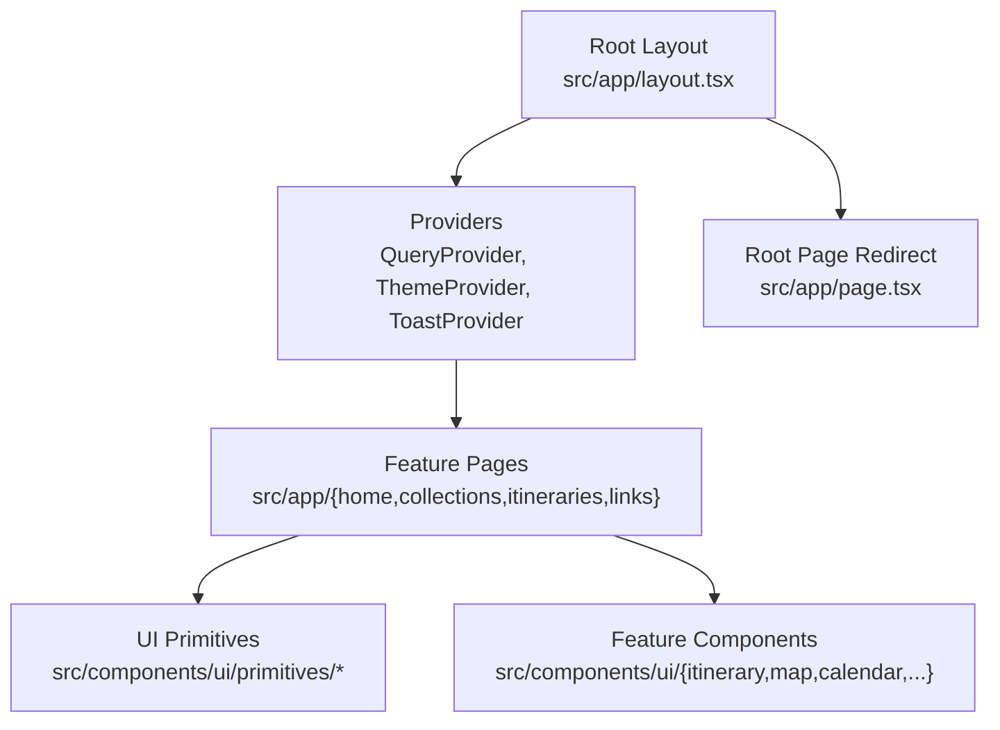
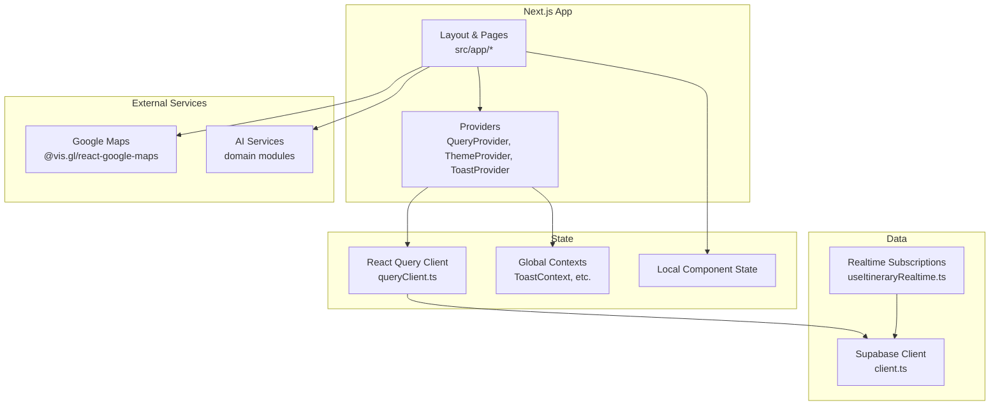
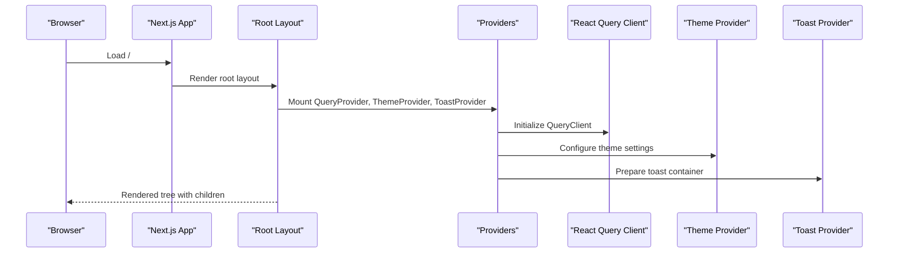
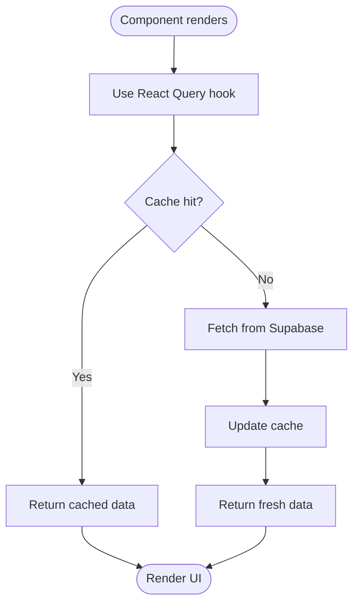
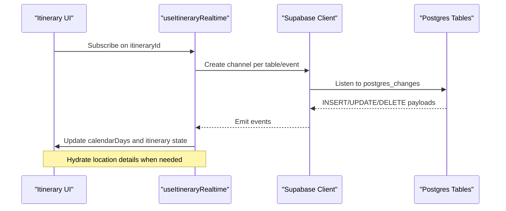
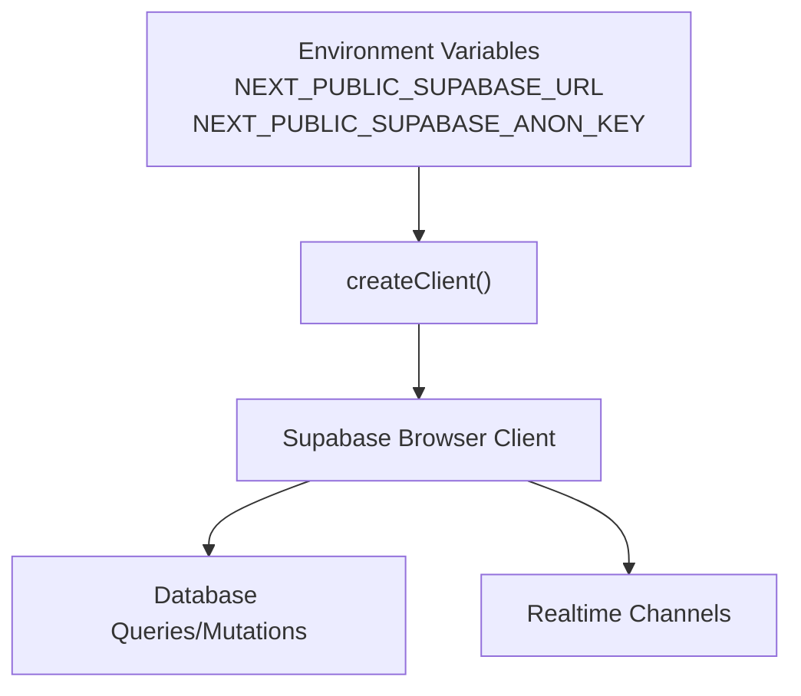
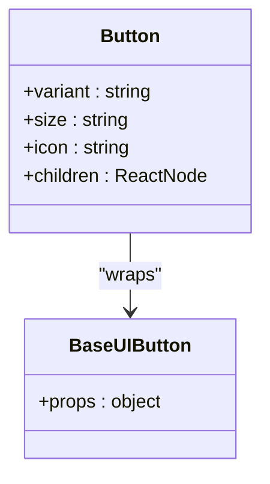
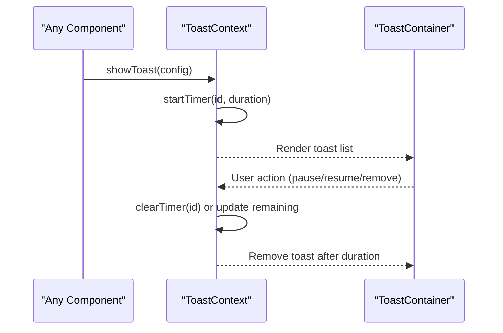
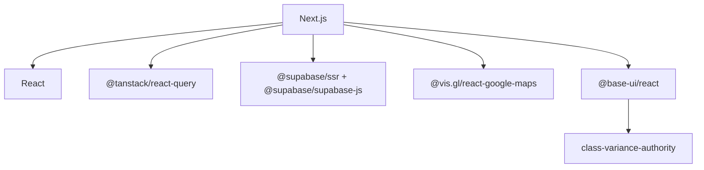

# Architecture Overview

<cite>
**Referenced Files in This Document**
- [layout.tsx](file://src/app/layout.tsx)
- [page.tsx](file://src/app/page.tsx)
- [QueryProvider.tsx](file://src/components/QueryProvider.tsx)
- [queryClient.ts](file://src/lib/query/queryClient.ts)
- [client.ts](file://src/lib/supabase/client.ts)
- [useItineraryRealtime.ts](file://src/hooks/useItineraryRealtime.ts)
- [Button.tsx](file://src/components/ui/primitives/Button.tsx)
- [ToastContext.tsx](file://src/contexts/ToastContext.tsx)
- [package.json](file://package.json)
</cite>

## Table of Contents
1. [Introduction](#introduction)
2. [Project Structure](#project-structure)
3. [Core Components](#core-components)
4. [Architecture Overview](#architecture-overview)
5. [Detailed Component Analysis](#detailed-component-analysis)
6. [Dependency Analysis](#dependency-analysis)
7. [Performance Considerations](#performance-considerations)
8. [Security and Compliance](#security-and-compliance)
9. [Scalability and Deployment](#scalability-and-deployment)
10. [Troubleshooting Guide](#troubleshooting-guide)
11. [Conclusion](#conclusion)

## Introduction
This document describes the system architecture of the Argo platform, a Next.js application that transforms saved links into map-based places and generates day-by-day itineraries. It covers the App Router layout, component hierarchy, data flow patterns, client/server rendering strategies, state management (React Query, Context API, local state), Supabase integrations for database operations and real-time subscriptions, authentication flows, external service boundaries (Google Maps, AI services), security considerations, scalability patterns, performance optimizations, and deployment architecture.

## Project Structure
Argo uses the Next.js App Router with feature-oriented pages under src/app and a shared UI library under src/components/ui. Global providers are mounted at the root layout to ensure consistent behavior across routes.

Key structural elements:
- Root layout wraps the app with providers for queries, theme, tooltips, and toast notifications.
- The root page redirects to the home route.
- Feature pages (collections, itineraries, links, home) define their own layouts and loading states.
- A primitive-based design system lives under src/components/ui/primitives and is composed into higher-level components.
- Real-time collaboration and live updates are handled via hooks that subscribe to Supabase channels.

**Diagram sources**
- [layout.tsx:57-81](file://src/app/layout.tsx#L57-L81)
- [page.tsx:1-6](file://src/app/page.tsx#L1-L6)

**Section sources**
- [layout.tsx:1-85](file://src/app/layout.tsx#L1-L85)
- [page.tsx:1-6](file://src/app/page.tsx#L1-L6)

## Core Components
- Root Providers:
  - QueryProvider initializes React Query client for server state caching and synchronization.
  - ThemeProvider configures theme handling for the application.
  - ToastProvider manages global user feedback via context.
- Data Layer:
  - Supabase browser client factory creates authenticated clients using environment variables.
  - React Query client defines default caching and retry policies.
- Real-Time Collaboration:
  - useItineraryRealtime subscribes to Supabase Postgres changes and broadcasts events to keep UI in sync across collaborators.

**Section sources**
- [QueryProvider.tsx:1-14](file://src/components/QueryProvider.tsx#L1-L14)
- [queryClient.ts:1-13](file://src/lib/query/queryClient.ts#L1-L13)
- [client.ts:1-9](file://src/lib/supabase/client.ts#L1-L9)
- [useItineraryRealtime.ts:1-534](file://src/hooks/useItineraryRealtime.ts#L1-L534)
- [ToastContext.tsx:1-155](file://src/contexts/ToastContext.tsx#L1-L155)

## Architecture Overview
The application follows a layered architecture:
- Presentation Layer: Next.js App Router pages compose feature-specific UI from primitives and domain components.
- State Management Layer:
  - Server state is managed by React Query with a configured client.
  - Global client state is provided via React Context (e.g., Toast).
  - Local component state handles transient UI concerns.
- Data Access Layer:
  - Supabase client performs database queries and mutations.
  - Real-time subscriptions synchronize UI changes across clients.
- External Integrations:
  - Google Maps integration for map rendering and place details.
  - AI services referenced in domain modules for content analysis and itinerary generation.

**Diagram sources**
- [layout.tsx:57-81](file://src/app/layout.tsx#L57-L81)
- [QueryProvider.tsx:1-14](file://src/components/QueryProvider.tsx#L1-L14)
- [queryClient.ts:1-13](file://src/lib/query/queryClient.ts#L1-L13)
- [client.ts:1-9](file://src/lib/supabase/client.ts#L1-L9)
- [useItineraryRealtime.ts:1-534](file://src/hooks/useItineraryRealtime.ts#L1-L534)
- [package.json:12-33](file://package.json#L12-L33)

## Detailed Component Analysis

### Root Layout and Providers
The root layout sets metadata, viewport configuration, and mounts global providers. It ensures consistent theming, query caching, and toast notifications across all routes.

**Diagram sources**
- [layout.tsx:15-81](file://src/app/layout.tsx#L15-L81)
- [QueryProvider.tsx:1-14](file://src/components/QueryProvider.tsx#L1-L14)
- [queryClient.ts:1-13](file://src/lib/query/queryClient.ts#L1-L13)

**Section sources**
- [layout.tsx:1-85](file://src/app/layout.tsx#L1-L85)

### Data Flow: Server State with React Query
React Query is initialized with sensible defaults for stale time, garbage collection, retries, and refetch behavior. Components fetch and cache server state through this client.

**Diagram sources**
- [queryClient.ts:1-13](file://src/lib/query/queryClient.ts#L1-L13)

**Section sources**
- [queryClient.ts:1-13](file://src/lib/query/queryClient.ts#L1-L13)

### Real-Time Collaboration: Itinerary Updates
The realtime hook subscribes to multiple Supabase channels to synchronize activities, days, flights, lodgings, and collaborator membership changes. It maintains both calendar view state and itinerary detail state to keep different UI modes consistent.

**Diagram sources**
- [useItineraryRealtime.ts:39-333](file://src/hooks/useItineraryRealtime.ts#L39-L333)
- [useItineraryRealtime.ts:335-440](file://src/hooks/useItineraryRealtime.ts#L335-L440)
- [useItineraryRealtime.ts:442-530](file://src/hooks/useItineraryRealtime.ts#L442-L530)

**Section sources**
- [useItineraryRealtime.ts:1-534](file://src/hooks/useItineraryRealtime.ts#L1-L534)

### Authentication and Supabase Client
The Supabase browser client is created using environment variables for URL and anonymous key. Authentication flows rely on Supabase’s SSR utilities and are consumed by feature components and hooks.

**Diagram sources**
- [client.ts:1-9](file://src/lib/supabase/client.ts#L1-L9)

**Section sources**
- [client.ts:1-9](file://src/lib/supabase/client.ts#L1-L9)

### Primitive-Based Design System
The Button primitive demonstrates a composable, variant-driven approach using Base UI and class-variance-authority. It encapsulates styling, accessibility attributes, and interaction behaviors, enabling consistent UI across features.

**Diagram sources**
- [Button.tsx:1-132](file://src/components/ui/primitives/Button.tsx#L1-L132)

**Section sources**
- [Button.tsx:1-132](file://src/components/ui/primitives/Button.tsx#L1-L132)

### Global Notifications with Context
ToastContext provides a centralized mechanism to display, pause, resume, and remove notifications. It manages timers and remaining durations to ensure reliable UX feedback.

**Diagram sources**
- [ToastContext.tsx:42-155](file://src/contexts/ToastContext.tsx#L42-L155)

**Section sources**
- [ToastContext.tsx:1-155](file://src/contexts/ToastContext.tsx#L1-L155)

## Dependency Analysis
The application depends on several libraries to implement its architecture:
- Next.js for routing and server-side rendering.
- React Query for server state caching and synchronization.
- Supabase for database access and real-time subscriptions.
- Google Maps integration for mapping capabilities.
- Base UI and class-variance-authority for accessible, variant-driven primitives.

**Diagram sources**
- [package.json:12-33](file://package.json#L12-L33)

**Section sources**
- [package.json:1-45](file://package.json#L1-L45)

## Performance Considerations
- Caching Strategy:
  - React Query default options set staleTime and gcTime to balance freshness and performance.
  - RefetchOnWindowFocus disabled to reduce unnecessary network calls.
- Rendering:
  - Next.js App Router enables efficient server-side rendering and streaming.
  - Route-level loading components improve perceived performance.
- Real-Time Efficiency:
  - Scoped channels per itinerary minimize payload size and processing overhead.
  - Selective subscriptions (e.g., only when sidebars are open) reduce bandwidth usage.
- UI Optimization:
  - Primitive components leverage CSS classes and motion tokens for smooth transitions.
  - Skeleton components provide loading states without blocking interactions.

[No sources needed since this section provides general guidance]

## Security and Compliance
- Environment Configuration:
  - Supabase credentials are loaded from environment variables to avoid hardcoding secrets.
- Authentication:
  - Supabase SSR client supports secure session handling; enforce server-side checks where applicable.
- Data Access:
  - Database Row Level Security (RLS) should be enforced on Supabase tables to restrict access based on user roles and ownership.
- External APIs:
  - Validate and sanitize inputs before calling Google Maps or AI services.
  - Rate limit and handle errors gracefully to prevent abuse.
- Privacy:
  - Exclude sensitive routes from crawling and indexing via robots configuration.

[No sources needed since this section provides general guidance]

## Scalability and Deployment
- Horizontal Scaling:
  - Stateless Next.js deployments scale horizontally behind a CDN or edge network.
- Database:
  - Supabase scales PostgreSQL with connection pooling and read replicas if needed.
- Real-Time:
  - Supabase real-time scales with channel limits; consider sharding by resource IDs (e.g., itinerary_id).
- Caching:
  - Leverage React Query cache and CDN caching for static assets and public pages.
- Build and Deploy:
  - Use Next.js build pipeline with Turbopack for faster development builds.
  - Containerize or deploy to platforms supporting Node.js environments.

[No sources needed since this section provides general guidance]

## Troubleshooting Guide
- Real-Time Sync Issues:
  - Verify channel subscriptions are active and scoped to the correct itinerary ID.
  - Check Postgres change events and filters for correctness.
- Network Errors:
  - Inspect React Query retry settings and error handling in hooks.
  - Ensure environment variables for Supabase are correctly set.
- UI State Drift:
  - Confirm that both calendar and itinerary states are updated consistently on real-time events.
  - Use toast notifications to surface errors and guide users.

**Section sources**
- [useItineraryRealtime.ts:39-530](file://src/hooks/useItineraryRealtime.ts#L39-L530)
- [queryClient.ts:1-13](file://src/lib/query/queryClient.ts#L1-L13)
- [ToastContext.tsx:42-155](file://src/contexts/ToastContext.tsx#L42-L155)

## Conclusion
Argo’s architecture combines Next.js App Router, a robust state management strategy with React Query and Context, and Supabase-powered database and real-time capabilities. The primitive-based design system ensures consistent UI, while careful attention to security, performance, and scalability enables a responsive and collaborative itinerary planning experience.

[No sources needed since this section summarizes without analyzing specific files]