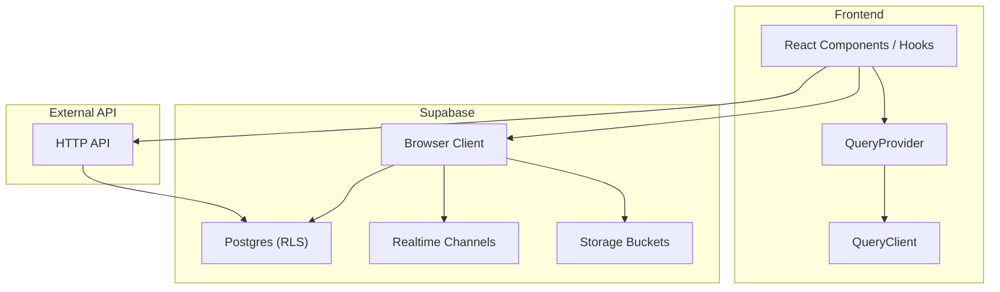
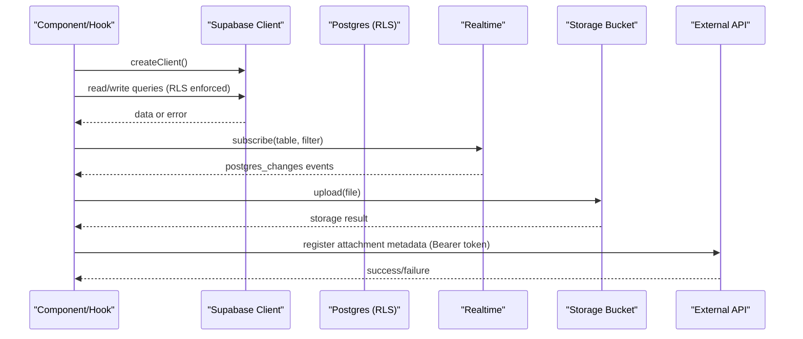
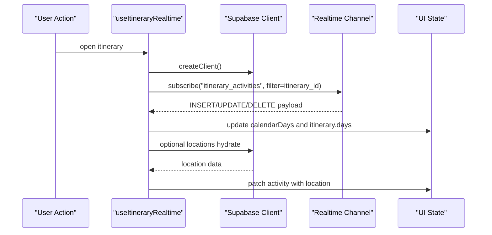
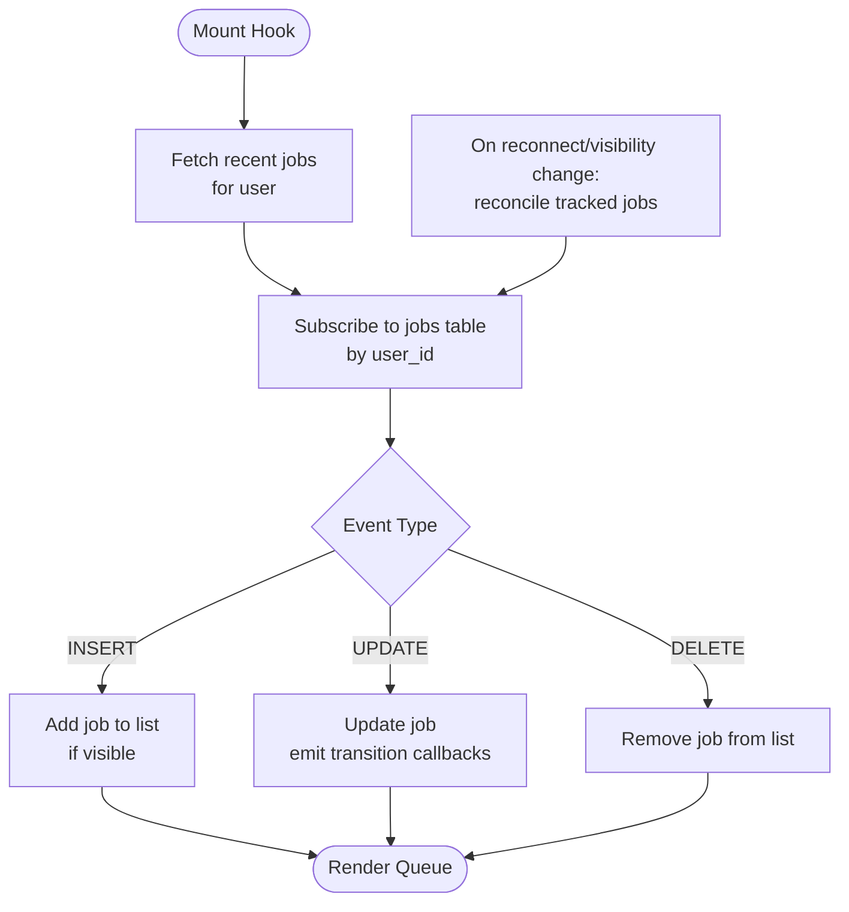
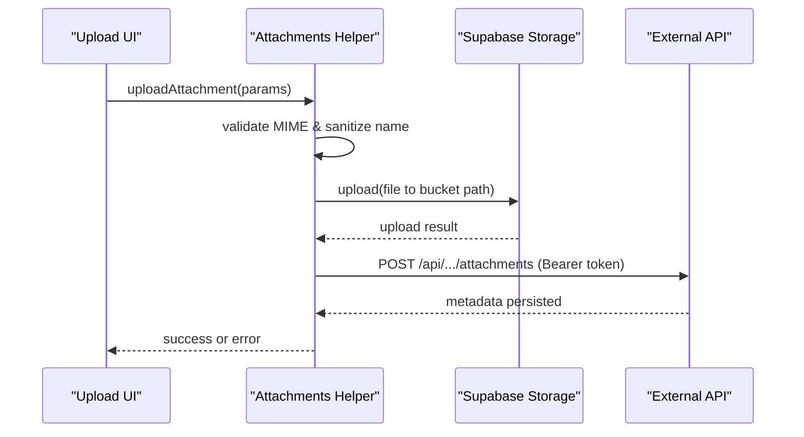
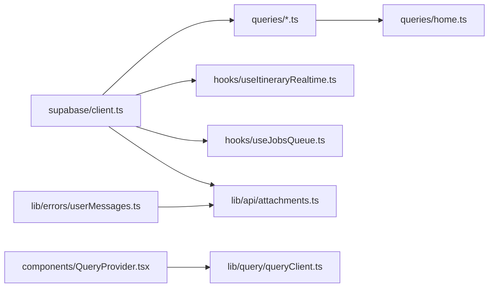

# Backend Integration

<cite>
**Referenced Files in This Document**
- [client.ts](file://src/lib/supabase/client.ts)
- [queries.ts](file://src/lib/supabase/queries.ts)
- [home.ts](file://src/lib/supabase/queries/home.ts)
- [queryClient.ts](file://src/lib/query/queryClient.ts)
- [QueryProvider.tsx](file://src/components/QueryProvider.tsx)
- [useItineraryRealtime.ts](file://src/hooks/useItineraryRealtime.ts)
- [useJobsQueue.ts](file://src/hooks/useJobsQueue.ts)
- [password-policy.ts](file://src/lib/auth/password-policy.ts)
- [userMessages.ts](file://src/lib/errors/userMessages.ts)
- [attachments.ts](file://src/lib/api/attachments.ts)
</cite>

## Table of Contents
1. Introduction
2. Project Structure
3. Core Components
4. Architecture Overview
5. Detailed Component Analysis
6. Dependency Analysis
7. Performance Considerations
8. Troubleshooting Guide
9. Conclusion

## Introduction
This document explains the backend integration layer for a Next.js application that uses Supabase as its primary data and real-time service, with an external API for certain operations (e.g., attachments). It covers client setup, authentication flows, database queries, real-time subscriptions, job queue processing, file uploads/downloads, error handling strategies, connection management, and security considerations including Row Level Security (RLS).

## Project Structure
The backend integration is organized around:
- A shared Supabase browser client factory
- Typed query modules for domain features (profiles, itineraries, collections, content)
- React Query configuration and provider
- Realtime hooks for live collaboration
- A job queue hook for background task progress and completion
- Error utilities for user-friendly messages
- File attachment helpers that use Supabase Storage and an external API

**Diagram sources**
- [QueryProvider.tsx:1-14](file://src/components/QueryProvider.tsx#L1-L14)
- [queryClient.ts:1-13](file://src/lib/query/queryClient.ts#L1-L13)
- [client.ts:1-9](file://src/lib/supabase/client.ts#L1-L9)
- [useItineraryRealtime.ts:1-534](file://src/hooks/useItineraryRealtime.ts#L1-L534)
- [useJobsQueue.ts:1-296](file://src/hooks/useJobsQueue.ts#L1-L296)
- [attachments.ts:1-83](file://src/lib/api/attachments.ts#L1-L83)

**Section sources**
- [QueryProvider.tsx:1-14](file://src/components/QueryProvider.tsx#L1-L14)
- [queryClient.ts:1-13](file://src/lib/query/queryClient.ts#L1-L13)
- [client.ts:1-9](file://src/lib/supabase/client.ts#L1-L9)

## Core Components
- Supabase Browser Client: Factory to create a typed client using environment variables.
- Query Modules: Typed functions for reading profiles, itineraries, collections, and content; includes joins and RLS-aware scoping.
- React Query: Centralized caching and retry policy via a shared QueryClient instance.
- Realtime Collaboration: Per-feature channels listening to Postgres changes and broadcasting events.
- Job Queue: Realtime-driven queue UI with reconciliation on reconnect or visibility change.
- Attachments: Secure upload flow to Supabase Storage followed by metadata registration via an authenticated HTTP call.
- Auth Policy: Client-side password validation mirroring server rules.
- Error Handling: Friendly message mapping for auth and API errors.

**Section sources**
- [client.ts:1-9](file://src/lib/supabase/client.ts#L1-L9)
- [queries.ts:1-150](file://src/lib/supabase/queries.ts#L1-L150)
- [home.ts:1-794](file://src/lib/supabase/queries/home.ts#L1-L794)
- [queryClient.ts:1-13](file://src/lib/query/queryClient.ts#L1-L13)
- [useItineraryRealtime.ts:1-534](file://src/hooks/useItineraryRealtime.ts#L1-L534)
- [useJobsQueue.ts:1-296](file://src/hooks/useJobsQueue.ts#L1-L296)
- [attachments.ts:1-83](file://src/lib/api/attachments.ts#L1-L83)
- [password-policy.ts:1-41](file://src/lib/auth/password-policy.ts#L1-L41)
- [userMessages.ts:1-106](file://src/lib/errors/userMessages.ts#L1-L106)

## Architecture Overview
The frontend uses a single Supabase client instance per request context to perform:
- Authenticated reads/writes against Postgres tables protected by RLS
- Realtime subscriptions to specific tables filtered by entity IDs or user IDs
- Storage operations for files under bucket paths scoped by itinerary and entity type
- Optional calls to an external API that validates permissions and persists metadata

**Diagram sources**
- [client.ts:1-9](file://src/lib/supabase/client.ts#L1-L9)
- [useItineraryRealtime.ts:1-534](file://src/hooks/useItineraryRealtime.ts#L1-L534)
- [attachments.ts:1-83](file://src/lib/api/attachments.ts#L1-L83)

## Detailed Component Analysis

### Supabase Client Setup and Connection Management
- The client is created via a factory that reads environment variables for URL and anon key.
- Each realtime subscription creates its own channel and removes it on cleanup to avoid leaks.
- React Query is configured with sensible defaults for stale time, garbage collection, retries, and refetch behavior.

Key responsibilities:
- Provide a consistent entry point for all Supabase interactions
- Ensure channels are subscribed/unsubscribed safely within component lifecycles
- Centralize caching policies through React Query

**Section sources**
- [client.ts:1-9](file://src/lib/supabase/client.ts#L1-L9)
- [queryClient.ts:1-13](file://src/lib/query/queryClient.ts#L1-L13)
- [QueryProvider.tsx:1-14](file://src/components/QueryProvider.tsx#L1-L14)

### Authentication Flows and Password Policy
- Client-side password validation mirrors server-side requirements to improve UX while relying on server enforcement as the first line of defense.
- Authenticated requests to external APIs include the Supabase access token in the Authorization header.
- User-facing error messages are mapped from technical codes to friendly text.

Common patterns:
- Validate input before submission
- Surface concise, actionable errors
- Use session tokens when calling external endpoints

**Section sources**
- [password-policy.ts:1-41](file://src/lib/auth/password-policy.ts#L1-L41)
- [attachments.ts:48-83](file://src/lib/api/attachments.ts#L48-L83)
- [userMessages.ts:1-106](file://src/lib/errors/userMessages.ts#L1-L106)

### Database Operations and Queries
- Profile retrieval and batch fetching are implemented with explicit column selection and error logging.
- Itinerary detail fetches join related tables and compute derived values like timezone.
- Recent content aggregation composes multiple queries and merges results efficiently.
- Collection preview images are fetched once and reused across modules to reduce redundant network calls.

Examples of typical operations:
- Single-row lookup with safe null handling
- Batch lookups with IN filters
- Complex joins with nested selects
- Aggregation and de-duplication in memory

**Section sources**
- [queries.ts:14-46](file://src/lib/supabase/queries.ts#L14-L46)
- [queries.ts:50-99](file://src/lib/supabase/queries.ts#L50-L99)
- [queries.ts:103-149](file://src/lib/supabase/queries.ts#L103-L149)
- [home.ts:159-303](file://src/lib/supabase/queries/home.ts#L159-L303)
- [home.ts:311-335](file://src/lib/supabase/queries/home.ts#L311-L335)
- [home.ts:764-780](file://src/lib/supabase/queries/home.ts#L764-L780)

### Real-Time Subscriptions and Collaboration
- Dedicated channels listen to INSERT/UPDATE/DELETE events on itinerary-related tables, filtered by itinerary ID.
- Updates are mirrored into both calendar state and itinerary state to keep different views consistent.
- Location details are lazily hydrated after activity inserts to ensure rich display without blocking initial render.
- Member changes (collaborators) are reflected in real time.

**Diagram sources**
- [useItineraryRealtime.ts:39-167](file://src/hooks/useItineraryRealtime.ts#L39-L167)
- [useItineraryRealtime.ts:170-312](file://src/hooks/useItineraryRealtime.ts#L170-L312)
- [useItineraryRealtime.ts:335-405](file://src/hooks/useItineraryRealtime.ts#L335-L405)
- [useItineraryRealtime.ts:407-440](file://src/hooks/useItineraryRealtime.ts#L407-L440)

**Section sources**
- [useItineraryRealtime.ts:39-167](file://src/hooks/useItineraryRealtime.ts#L39-L167)
- [useItineraryRealtime.ts:170-312](file://src/hooks/useItineraryRealtime.ts#L170-L312)
- [useItineraryRealtime.ts:335-405](file://src/hooks/useItineraryRealtime.ts#L335-L405)
- [useItineraryRealtime.ts:407-440](file://src/hooks/useItineraryRealtime.ts#L407-L440)

### Job Queue Processing for Background Tasks
- Initial load fetches recent jobs for the current user, including failed jobs within a time window.
- Realtime listens to all changes on the jobs table scoped by user ID.
- Reconciliation runs on reconnect or tab visibility change to settle any missed transitions.
- Optimistic updates allow immediate UI feedback even if realtime lags.

**Diagram sources**
- [useJobsQueue.ts:78-159](file://src/hooks/useJobsQueue.ts#L78-L159)
- [useJobsQueue.ts:167-266](file://src/hooks/useJobsQueue.ts#L167-L266)

**Section sources**
- [useJobsQueue.ts:78-159](file://src/hooks/useJobsQueue.ts#L78-L159)
- [useJobsQueue.ts:167-266](file://src/hooks/useJobsQueue.ts#L167-L266)
- [useJobsQueue.ts:269-295](file://src/hooks/useJobsQueue.ts#L269-L295)

### File Upload and Download Operations
- Uploads validate MIME types and sanitize filenames.
- Files are uploaded to a bucket path structured by itinerary, entity type, and entity ID.
- After successful storage upload, metadata is registered via an authenticated HTTP call to an external API.
- Downloads are typically served directly from the storage bucket using public or signed URLs (implementation depends on bucket policies).

**Diagram sources**
- [attachments.ts:8-19](file://src/lib/api/attachments.ts#L8-L19)
- [attachments.ts:34-83](file://src/lib/api/attachments.ts#L34-L83)

**Section sources**
- [attachments.ts:8-19](file://src/lib/api/attachments.ts#L8-L19)
- [attachments.ts:34-83](file://src/lib/api/attachments.ts#L34-L83)

### Security Considerations and Row Level Security (RLS)
- All database reads and writes go through the Supabase client, which enforces RLS policies based on the active session.
- Some queries explicitly rely on RLS-scoped joins (e.g., inner joins to user-scoped tables) to ensure data isolation.
- External API calls carry the Supabase access token for server-side authorization checks.
- Client-side validations complement but do not replace server-side rules.

Best practices:
- Always scope queries by user or entity ownership where possible
- Prefer inner joins to user-scoped tables to leverage RLS
- Never trust client-only constraints for security decisions

**Section sources**
- [queries.ts:50-99](file://src/lib/supabase/queries.ts#L50-L99)
- [attachments.ts:48-83](file://src/lib/api/attachments.ts#L48-L83)

## Dependency Analysis
The integration layer has clear separation of concerns:
- Client creation is isolated and reused
- Query modules encapsulate data shape and access patterns
- Realtime hooks manage channel lifecycle and state synchronization
- Job queue hook centralizes queue logic and reconciliation
- Error utilities provide consistent messaging

**Diagram sources**
- [client.ts:1-9](file://src/lib/supabase/client.ts#L1-L9)
- [queries.ts:1-150](file://src/lib/supabase/queries.ts#L1-L150)
- [home.ts:1-794](file://src/lib/supabase/queries/home.ts#L1-L794)
- [useItineraryRealtime.ts:1-534](file://src/hooks/useItineraryRealtime.ts#L1-L534)
- [useJobsQueue.ts:1-296](file://src/hooks/useJobsQueue.ts#L1-L296)
- [attachments.ts:1-83](file://src/lib/api/attachments.ts#L1-L83)
- [QueryProvider.tsx:1-14](file://src/components/QueryProvider.tsx#L1-L14)
- [queryClient.ts:1-13](file://src/lib/query/queryClient.ts#L1-L13)
- [userMessages.ts:1-106](file://src/lib/errors/userMessages.ts#L1-L106)

**Section sources**
- [client.ts:1-9](file://src/lib/supabase/client.ts#L1-L9)
- [queries.ts:1-150](file://src/lib/supabase/queries.ts#L1-L150)
- [home.ts:1-794](file://src/lib/supabase/queries/home.ts#L1-L794)
- [useItineraryRealtime.ts:1-534](file://src/hooks/useItineraryRealtime.ts#L1-L534)
- [useJobsQueue.ts:1-296](file://src/hooks/useJobsQueue.ts#L1-L296)
- [attachments.ts:1-83](file://src/lib/api/attachments.ts#L1-L83)
- [QueryProvider.tsx:1-14](file://src/components/QueryProvider.tsx#L1-L14)
- [queryClient.ts:1-13](file://src/lib/query/queryClient.ts#L1-L13)
- [userMessages.ts:1-106](file://src/lib/errors/userMessages.ts#L1-L106)

## Performance Considerations
- Use selective column projections to minimize payload size.
- Cache aggressively with React Query defaults tuned for low churn data.
- Defer non-critical hydration (e.g., location details) until needed.
- Avoid duplicate realtime channels by scoping topics uniquely per instance.
- Reconcile missed realtime updates on reconnect or visibility change to prevent stale UI.

[No sources needed since this section provides general guidance]

## Troubleshooting Guide
Common issues and resolutions:
- Realtime channel drops: The job queue hook detects CHANNEL_ERROR/TIMED_OUT and triggers reconciliation to catch up.
- Stale or missing realtime updates: Visibility change triggers a reconcile pass to refresh in-flight jobs.
- Authentication failures on external API: Ensure a valid session exists before attaching the bearer token.
- User-friendly errors: Map technical errors to friendly messages to guide users.

Operational tips:
- Log errors centrally and surface only safe messages to users
- Keep realtime channels scoped and cleaned up on unmount
- Validate inputs early to fail fast and reduce server load

**Section sources**
- [useJobsQueue.ts:250-266](file://src/hooks/useJobsQueue.ts#L250-L266)
- [useJobsQueue.ts:161-165](file://src/hooks/useJobsQueue.ts#L161-L165)
- [attachments.ts:48-52](file://src/lib/api/attachments.ts#L48-L52)
- [userMessages.ts:1-106](file://src/lib/errors/userMessages.ts#L1-L106)

## Conclusion
This integration layer combines a robust Supabase client, typed query modules, real-time collaboration, and a resilient job queue UI. It emphasizes secure, RLS-enforced data access, efficient caching, and graceful handling of connectivity issues. By following the patterns outlined here—scoped channels, selective projections, optimistic updates, and friendly error messaging—you can build responsive, collaborative experiences with strong security guarantees.