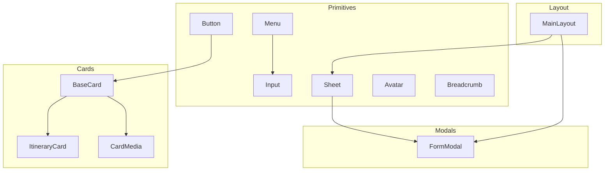
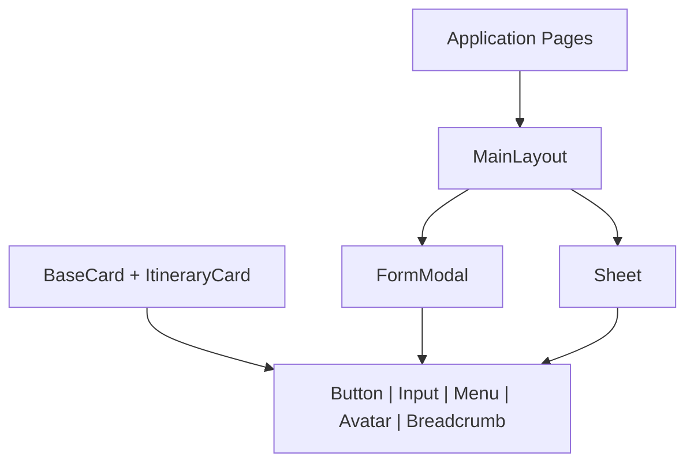
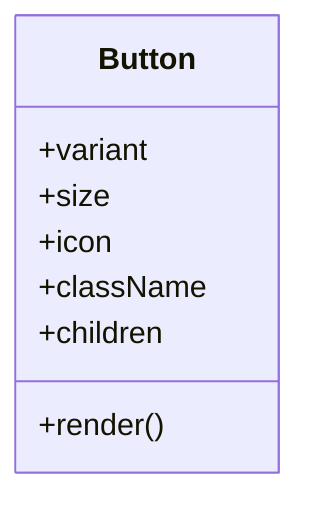
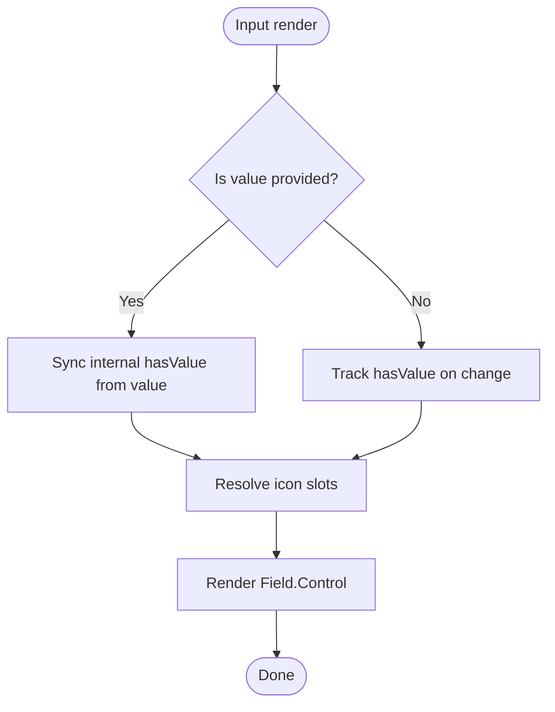
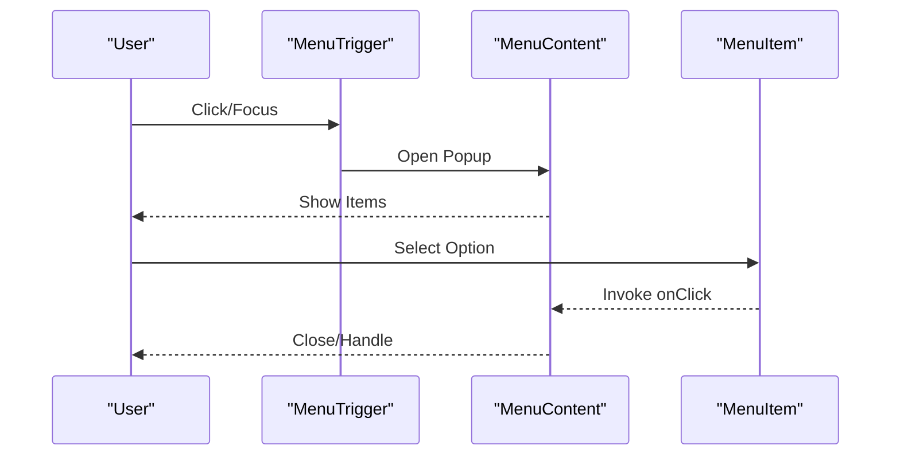
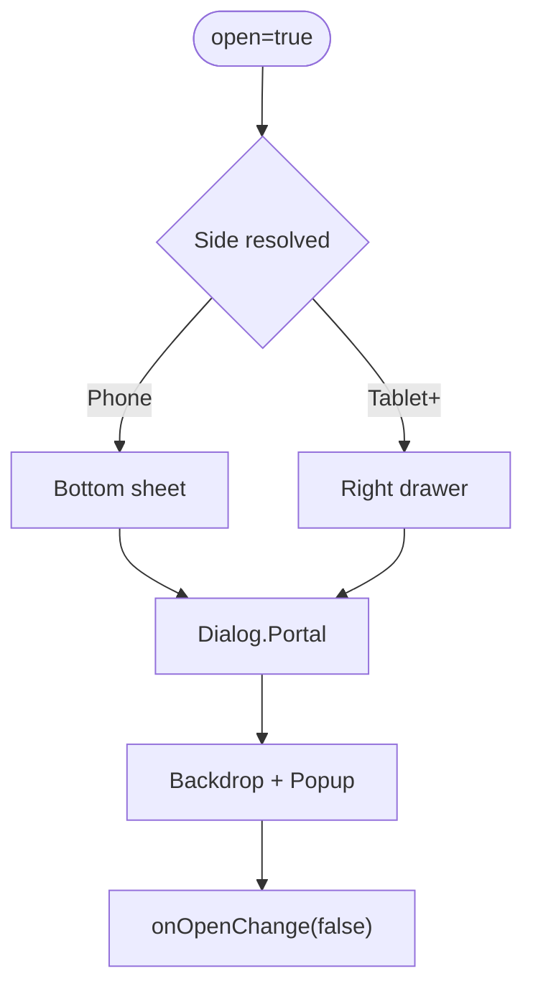
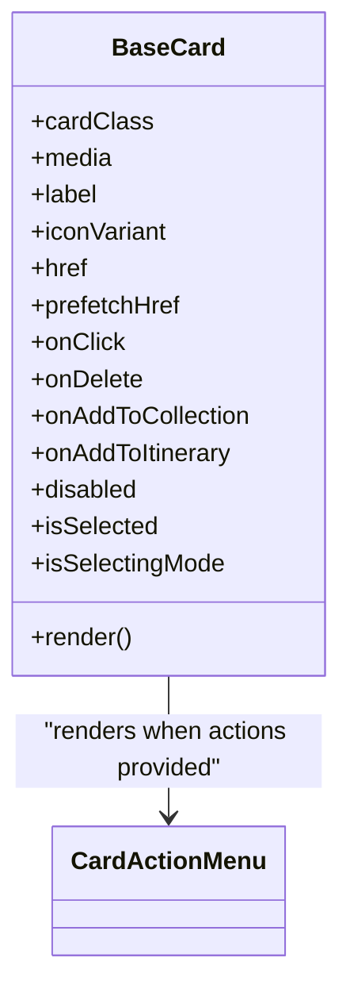
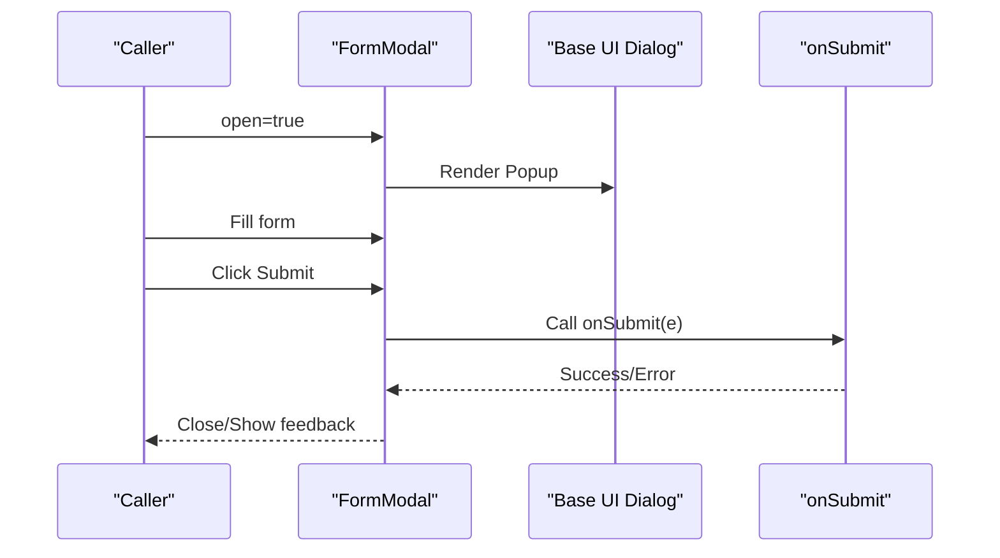
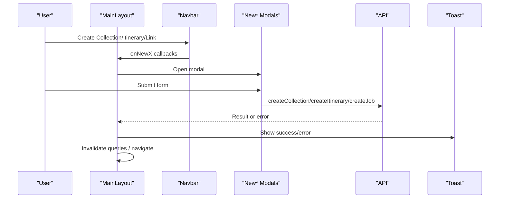
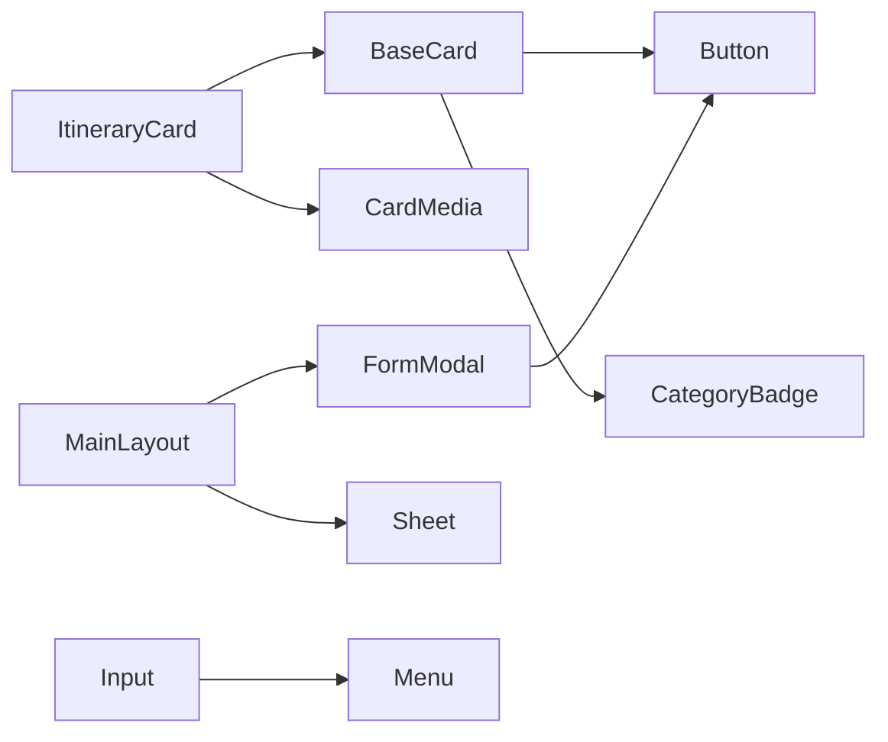

# Component Architecture

<cite>
**Referenced Files in This Document**
- [Button.tsx](file://src/components/ui/primitives/Button.tsx)
- [Input.tsx](file://src/components/ui/primitives/Input.tsx)
- [Menu.tsx](file://src/components/ui/primitives/Menu.tsx)
- [Sheet.tsx](file://src/components/ui/primitives/Sheet.tsx)
- [Avatar.tsx](file://src/components/ui/primitives/Avatar.tsx)
- [Breadcrumb.tsx](file://src/components/ui/primitives/Breadcrumb.tsx)
- [BaseCard.tsx](file://src/components/ui/cards/BaseCard.tsx)
- [ItineraryCard.tsx](file://src/components/ui/cards/ItineraryCard.tsx)
- [CardMedia.tsx](file://src/components/ui/cards/CardMedia.tsx)
- [FormModal.tsx](file://src/components/ui/modals/FormModal.tsx)
- [MainLayout.tsx](file://src/components/ui/layout/MainLayout.tsx)
- [index.ts](file://src/components/ui/index.ts)
</cite>

## Table of Contents
1. Introduction
2. Project Structure
3. Core Components
4. Architecture Overview
5. Detailed Component Analysis
6. Dependency Analysis
7. Performance Considerations
8. Troubleshooting Guide
9. Conclusion

## Introduction
This document explains the hierarchical organization of UI components in Argo, focusing on:
- Primitive layer (Button, Input, Menu, Sheet, Avatar, Breadcrumb)
- Composite components (cards, forms, layouts)
- Feature-specific components and modals
- Composition patterns, prop interfaces, and styling with Tailwind CSS via class-variance-authority
- Reuse strategies, theming support, and accessibility considerations
- Library structure and naming conventions

The design system is built around a small set of primitives that are composed into higher-level cards, forms, and layout shells. Styling uses Tailwind utility classes combined with CVA variants for consistent, themeable surfaces. Accessibility is provided by Base UI primitives and semantic HTML patterns.

## Project Structure
The component library lives under src/components/ui and is organized by responsibility:
- primitives: low-level interactive and display building blocks
- cards: composite card shells and media slots
- modals: form-driven and confirmation dialogs
- layout: application shell and navigation integration
- index: curated barrel exports for common imports

**Diagram sources**
- [Button.tsx:1-132](file://src/components/ui/primitives/Button.tsx#L1-L132)
- [Input.tsx:1-513](file://src/components/ui/primitives/Input.tsx#L1-L513)
- [Menu.tsx:1-384](file://src/components/ui/primitives/Menu.tsx#L1-L384)
- [Sheet.tsx:1-97](file://src/components/ui/primitives/Sheet.tsx#L1-L97)
- [Avatar.tsx:1-127](file://src/components/ui/primitives/Avatar.tsx#L1-L127)
- [Breadcrumb.tsx:1-127](file://src/components/ui/primitives/Breadcrumb.tsx#L1-L127)
- [BaseCard.tsx:1-211](file://src/components/ui/cards/BaseCard.tsx#L1-L211)
- [ItineraryCard.tsx:1-55](file://src/components/ui/cards/ItineraryCard.tsx#L1-L55)
- [CardMedia.tsx:1-63](file://src/components/ui/cards/CardMedia.tsx#L1-L63)
- [FormModal.tsx:1-224](file://src/components/ui/modals/FormModal.tsx#L1-L224)
- [MainLayout.tsx:1-397](file://src/components/ui/layout/MainLayout.tsx#L1-L397)

**Section sources**
- [index.ts:1-46](file://src/components/ui/index.ts#L1-L46)

## Core Components
- Button: A varianted primitive using CVA for size, icon placement, and visual variants. It composes Base UI’s button and adds layered decorations for filled styles.
- Input: A flexible input with leading/trailing icons, clear behavior, controlled/uncontrolled value handling, and a DropdownSelector mode backed by Base UI menu.
- Menu: A full menu system (root, trigger, content, items, separators) with consistent item variants and positioning utilities.
- Sheet: A responsive overlay (bottom sheet on mobile, side drawer on desktop) built on Base UI dialog with focus management and backdrop dismissal.
- Avatar: Displays initials, images, or icons with size/type variants and accessible alt text.
- Breadcrumb: Navigation crumbs with previous/current semantics and keyboard-friendly interactions.

Styling approach:
- Tailwind utilities for layout, spacing, colors, and typography
- CVA for variant composition (size, icon placement, state)
- Design tokens via CSS variables for motion and color accents
- Consistent data attributes for testing and targeting

Accessibility highlights:
- Base UI provides focus trapping, keyboard navigation, and ARIA wiring for menus and dialogs
- Semantic roles and aria-* attributes used across primitives (e.g., aria-invalid, aria-current)
- Screen-reader-only titles/descriptions where appropriate

**Section sources**
- [Button.tsx:9-132](file://src/components/ui/primitives/Button.tsx#L9-L132)
- [Input.tsx:11-513](file://src/components/ui/primitives/Input.tsx#L11-L513)
- [Menu.tsx:16-384](file://src/components/ui/primitives/Menu.tsx#L16-L384)
- [Sheet.tsx:10-97](file://src/components/ui/primitives/Sheet.tsx#L10-L97)
- [Avatar.tsx:9-127](file://src/components/ui/primitives/Avatar.tsx#L9-L127)
- [Breadcrumb.tsx:15-127](file://src/components/ui/primitives/Breadcrumb.tsx#L15-L127)

## Architecture Overview
Argo’s UI architecture follows a layered composition model:
- Primitives provide atomic behaviors and styles
- Composites combine primitives to implement domain surfaces (cards, forms)
- Layouts orchestrate global chrome (navbar, sidebar, overlays) and integrate feature modals

**Diagram sources**
- [MainLayout.tsx:33-397](file://src/components/ui/layout/MainLayout.tsx#L33-L397)
- [BaseCard.tsx:13-211](file://src/components/ui/cards/BaseCard.tsx#L13-L211)
- [ItineraryCard.tsx:8-55](file://src/components/ui/cards/ItineraryCard.tsx#L8-L55)
- [FormModal.tsx:50-224](file://src/components/ui/modals/FormModal.tsx#L50-L224)
- [Sheet.tsx:30-97](file://src/components/ui/primitives/Sheet.tsx#L30-L97)

## Detailed Component Analysis

### Primitive Layer

#### Button
- Purpose: Primary action control with multiple visual variants and icon placements
- Props: variant, size, icon placement, className, children, plus Base UI button props
- Styling: CVA variants; layered decorations for filled styles; token-driven motion
- Accessibility: Focus ring, disabled states, pointer-events handling

**Diagram sources**
- [Button.tsx:9-132](file://src/components/ui/primitives/Button.tsx#L9-L132)

**Section sources**
- [Button.tsx:9-132](file://src/components/ui/primitives/Button.tsx#L9-L132)

#### Input
- Purpose: Text input with optional leading/trailing icons, clear behavior, and dropdown selector mode
- Props: variant, size, icon slots, value/defaultValue, placeholder, clearable/onClear, trailingIcon, aria-invalid, plus Field.Control props
- Behavior: Controlled/uncontrolled value sync; clear triggers change/input events; dropdown mode delegates to Menu-based selector
- Accessibility: aria-invalid propagation; clear button has aria-label

**Diagram sources**
- [Input.tsx:148-276](file://src/components/ui/primitives/Input.tsx#L148-L276)

**Section sources**
- [Input.tsx:11-513](file://src/components/ui/primitives/Input.tsx#L11-L513)

#### Menu
- Purpose: Accessible dropdown menus with item variants, alignment, and positioning
- Props: root, trigger, content (align/side/sideOffset), items (size/icon/variant/selected), separators
- Behavior: Uses Base UI menu primitives; positions popup with collision padding; supports destructive items

**Diagram sources**
- [Menu.tsx:192-384](file://src/components/ui/primitives/Menu.tsx#L192-L384)

**Section sources**
- [Menu.tsx:16-384](file://src/components/ui/primitives/Menu.tsx#L16-L384)

#### Sheet
- Purpose: Responsive overlay (bottom sheet on phone, side drawer on tablet+)
- Props: open, onOpenChange, side override, title, description, children, trigger, className
- Behavior: Backdrop dismissal, focus trap, scroll lock via Base UI dialog; responsive side resolution

**Diagram sources**
- [Sheet.tsx:30-97](file://src/components/ui/primitives/Sheet.tsx#L30-L97)

**Section sources**
- [Sheet.tsx:10-97](file://src/components/ui/primitives/Sheet.tsx#L10-L97)

#### Avatar
- Purpose: Identity indicator with initials, image, or icon
- Props: name/src/alt/initials, type, size, icon
- Accessibility: Alt text for images; meaningful labels via context

**Section sources**
- [Avatar.tsx:9-127](file://src/components/ui/primitives/Avatar.tsx#L9-L127)

#### Breadcrumb
- Purpose: Hierarchical navigation with previous/current semantics
- Props: step, icon, children
- Accessibility: aria-current for current page; screen-reader friendly separators

**Section sources**
- [Breadcrumb.tsx:15-127](file://src/components/ui/primitives/Breadcrumb.tsx#L15-L127)

### Composite Components

#### BaseCard
- Purpose: Shared shell for entity cards with selection, header, actions, and link/button modes
- Props: cardClass, media, label, iconVariant, href/prefetchHref, onClick, onDelete/onAddToCollection/onAddToItinerary, disabled, isSelected/isSelectingMode
- Behavior: Kebab menu anchored to click coordinates; right-click context menu; hover prefetch; keyboard activation for non-link mode

**Diagram sources**
- [BaseCard.tsx:20-211](file://src/components/ui/cards/BaseCard.tsx#L20-L211)

**Section sources**
- [BaseCard.tsx:13-211](file://src/components/ui/cards/BaseCard.tsx#L13-L211)

#### ItineraryCard
- Purpose: Domain-specific card composing BaseCard with itinerary media
- Props: imageUrl/imageAlt/imageAspect/gradient plus inherited BaseCard props
- Composition: Passes media via CardMedia and sets category icon variant

**Section sources**
- [ItineraryCard.tsx:8-55](file://src/components/ui/cards/ItineraryCard.tsx#L8-L55)
- [CardMedia.tsx:7-63](file://src/components/ui/cards/CardMedia.tsx#L7-L63)

#### CardMedia
- Purpose: Standardized media slot for cards with image fallbacks and gradient placeholders
- Props: imageUrl/imageAlt/imageAspect/gradient/label, optional children slot

**Section sources**
- [CardMedia.tsx:7-63](file://src/components/ui/cards/CardMedia.tsx#L7-L63)

### Feature-Specific Components

#### FormModal
- Purpose: Reusable form dialog with icon/sticker treatment, title/description, submit/cancel flows, and loading state
- Props: trigger/open/onOpenChange, variant, icon/stickerUrl, title/description, children, cancelLabel/submitLabel/submittingLabel, onSubmit/onCancel, cancelCloses, submitDisabled, isSubmitting
- Behavior: Responsive presentation (phone bottom sheet vs centered modal); integrates Base UI dialog for focus/backdrop; disables submit while submitting

**Diagram sources**
- [FormModal.tsx:78-224](file://src/components/ui/modals/FormModal.tsx#L78-L224)

**Section sources**
- [FormModal.tsx:50-224](file://src/components/ui/modals/FormModal.tsx#L50-L224)

#### MainLayout
- Purpose: Application shell integrating navbar, main content area, right sidebar (inline or sheet), and global modals
- Behavior: Navbar auto-hide on scroll with hysteresis; responsive sidebar; quota and toast notifications; query invalidation on create flows

**Diagram sources**
- [MainLayout.tsx:33-397](file://src/components/ui/layout/MainLayout.tsx#L33-L397)

**Section sources**
- [MainLayout.tsx:33-397](file://src/components/ui/layout/MainLayout.tsx#L33-L397)

## Dependency Analysis
Key dependency relationships:
- Cards depend on primitives (Button, CategoryBadge) and shared CardMedia
- Modals depend on primitives (Button) and Base UI dialog
- Layout composes primitives and modals, and orchestrates global state via contexts
- Menu is reused by Input’s dropdown selector and other interactive elements

**Diagram sources**
- [BaseCard.tsx:1-211](file://src/components/ui/cards/BaseCard.tsx#L1-L211)
- [ItineraryCard.tsx:1-55](file://src/components/ui/cards/ItineraryCard.tsx#L1-L55)
- [FormModal.tsx:1-224](file://src/components/ui/modals/FormModal.tsx#L1-L224)
- [MainLayout.tsx:1-397](file://src/components/ui/layout/MainLayout.tsx#L1-L397)
- [Input.tsx:1-513](file://src/components/ui/primitives/Input.tsx#L1-L513)

**Section sources**
- [BaseCard.tsx:1-211](file://src/components/ui/cards/BaseCard.tsx#L1-L211)
- [ItineraryCard.tsx:1-55](file://src/components/ui/cards/ItineraryCard.tsx#L1-L55)
- [FormModal.tsx:1-224](file://src/components/ui/modals/FormModal.tsx#L1-L224)
- [MainLayout.tsx:1-397](file://src/components/ui/layout/MainLayout.tsx#L1-L397)
- [Input.tsx:1-513](file://src/components/ui/primitives/Input.tsx#L1-L513)

## Performance Considerations
- Prefer controlled inputs only when necessary; use defaultValue for uncontrolled cases to reduce re-renders
- Use lazy rendering for heavy overlays (menus, sheets) and avoid unnecessary reflows
- Leverage hover prefetch on cards to improve perceived performance
- Keep variant computations minimal; CVA resolves at build time
- Debounce or throttle expensive handlers (e.g., scroll observers) if added later

[No sources needed since this section provides general guidance]

## Troubleshooting Guide
Common issues and resolutions:
- Input not clearing: Ensure clearable is enabled and onClear either updates external state or triggers native input events
- Menu not closing after action: Confirm action handlers close the menu or rely on default behavior
- Sheet not dismissing: Verify onOpenChange is wired and backdrop dismiss is enabled via Base UI
- Form submission stuck: Check isSubmitting flag and ensure onSubmit completes or throws to surface errors

**Section sources**
- [Input.tsx:170-186](file://src/components/ui/primitives/Input.tsx#L170-L186)
- [Menu.tsx:246-300](file://src/components/ui/primitives/Menu.tsx#L246-L300)
- [Sheet.tsx:57-97](file://src/components/ui/primitives/Sheet.tsx#L57-L97)
- [FormModal.tsx:170-212](file://src/components/ui/modals/FormModal.tsx#L170-L212)

## Conclusion
Argo’s component architecture emphasizes a clean separation between primitives, composites, and feature modules. The design leverages Tailwind and CVA for consistent, themeable styling, while Base UI ensures robust accessibility and interaction patterns. Composition through well-defined prop interfaces enables reuse across cards, forms, and layouts, and the MainLayout orchestrates global chrome and modals for a cohesive user experience.

[No sources needed since this section summarizes without analyzing specific files]