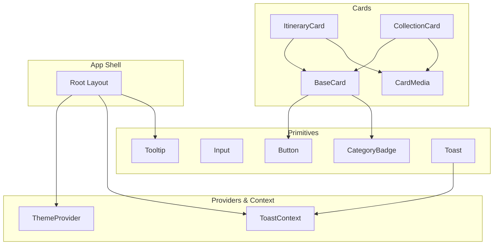
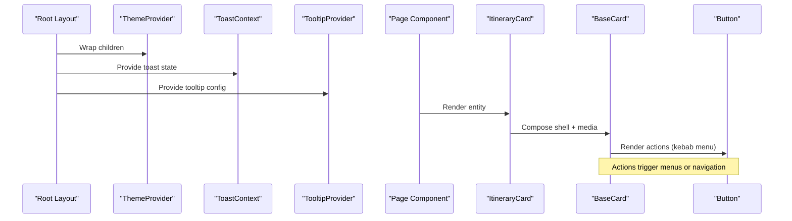
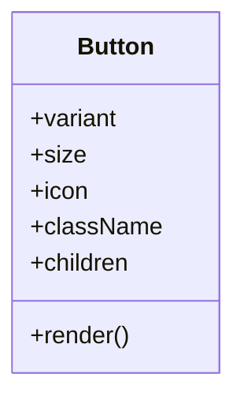
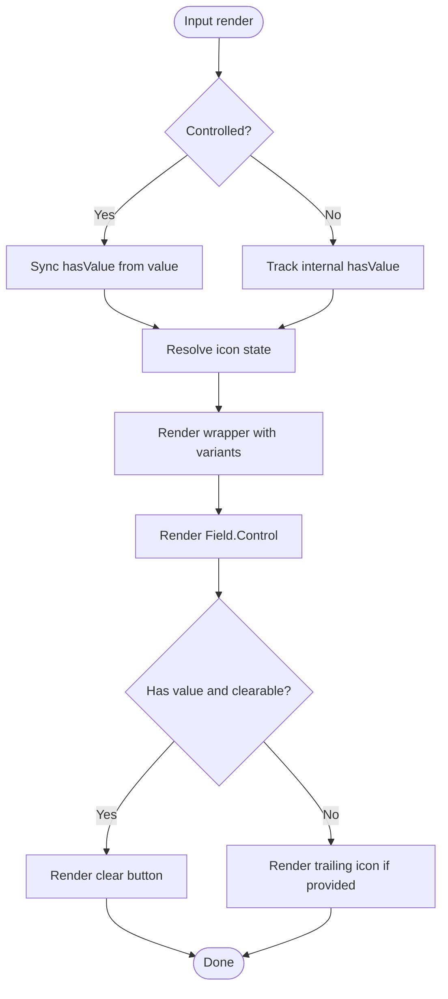
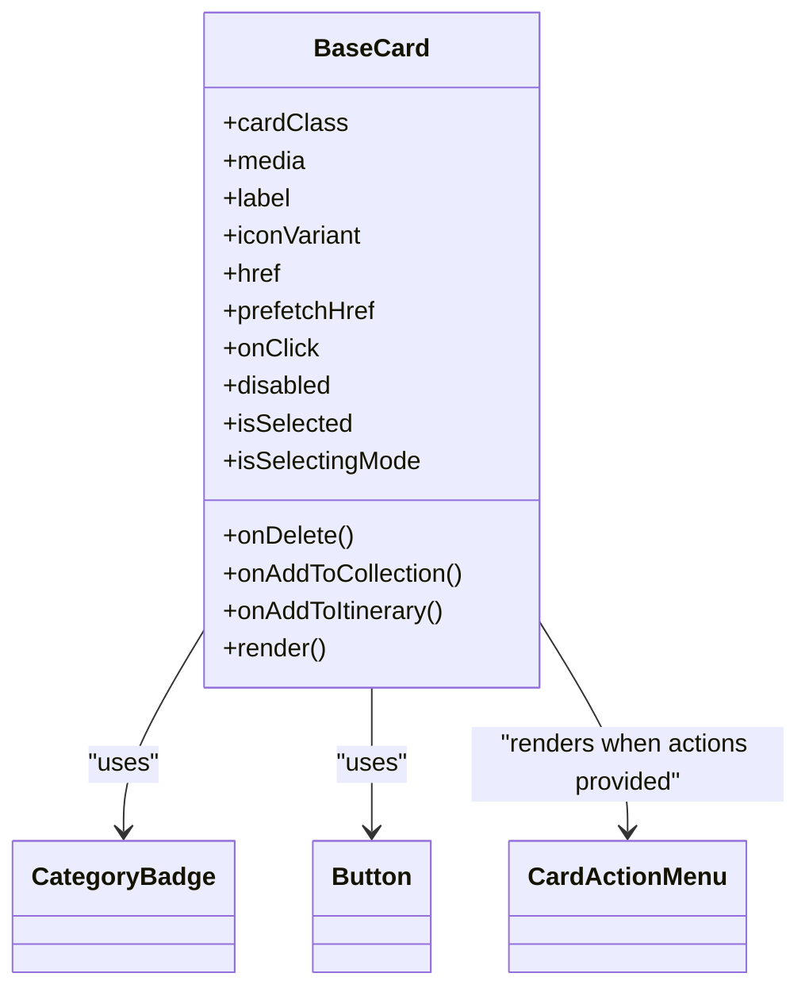
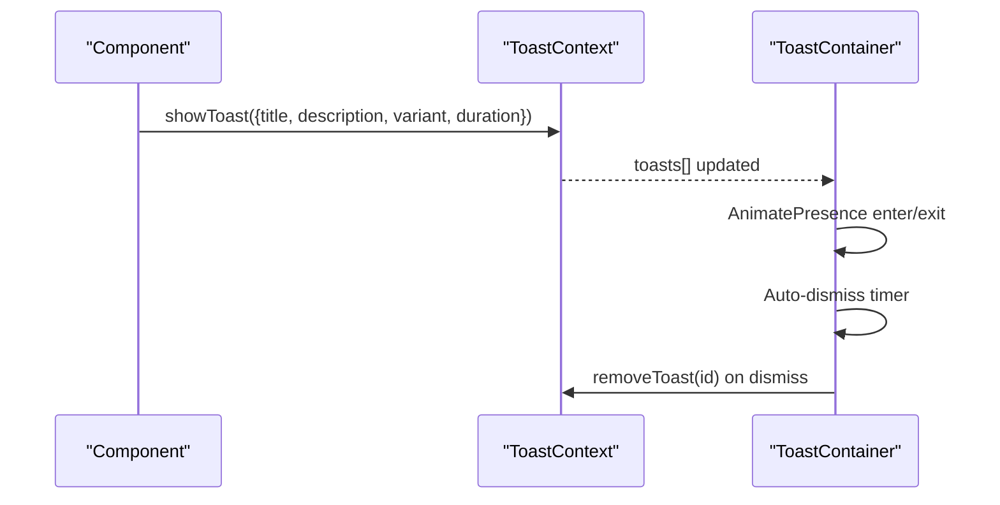
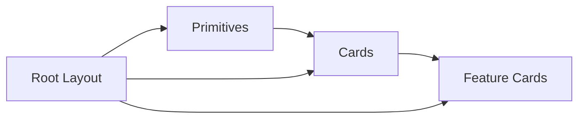

# Component Architecture

<cite>
**Referenced Files in This Document**
- [Button.tsx](file://src/components/ui/primitives/Button.tsx)
- [Input.tsx](file://src/components/ui/primitives/Input.tsx)
- [BaseCard.tsx](file://src/components/ui/cards/BaseCard.tsx)
- [ItineraryCard.tsx](file://src/components/ui/cards/ItineraryCard.tsx)
- [CollectionCard.tsx](file://src/components/ui/cards/CollectionCard.tsx)
- [CardMedia.tsx](file://src/components/ui/cards/CardMedia.tsx)
- [CategoryBadge.tsx](file://src/components/ui/primitives/CategoryBadge.tsx)
- [ThemeProvider.tsx](file://src/components/ThemeProvider.tsx)
- [ToastContext.tsx](file://src/contexts/ToastContext.tsx)
- [Toast.tsx](file://src/components/ui/primitives/Toast.tsx)
- [Tooltip.tsx](file://src/components/ui/primitives/Tooltip.tsx)
- [index.ts](file://src/components/ui/index.ts)
- [layout.tsx](file://src/app/layout.tsx)
- [userMessages.ts](file://src/lib/errors/userMessages.ts)
</cite>

## Table of Contents
1. Introduction
2. Project Structure
3. Core Components
4. Architecture Overview
5. Detailed Component Analysis
6. Dependency Analysis
7. Performance Considerations
8. Troubleshooting Guide
9. Conclusion

## Introduction
This document explains the Argo platform design system’s component architecture with a focus on its primitive-based hierarchy, composition patterns, prop interfaces, styling approach using Tailwind CSS and class-variance-authority, theme and context providers, global state integration, lifecycle patterns, error handling strategies, accessibility compliance, customization and extension patterns, and performance considerations such as code splitting and lazy loading.

## Project Structure
The design system is organized by responsibility:
- Primitives: low-level interactive and display building blocks (Button, Input, CategoryBadge, Tooltip, Toast).
- Cards: composable card shells and media slots used across feature-specific cards.
- Feature-specific components: higher-order components that compose primitives and cards to implement domain features.
- Contexts and Providers: global state and theming providers at the application root.
- Utilities: shared helpers for class merging and styling.

**Diagram sources**
- [Button.tsx:1-132](file://src/components/ui/primitives/Button.tsx#L1-L132)
- [Input.tsx:1-513](file://src/components/ui/primitives/Input.tsx#L1-L513)
- [BaseCard.tsx:1-211](file://src/components/ui/cards/BaseCard.tsx#L1-L211)
- [ItineraryCard.tsx:1-55](file://src/components/ui/cards/ItineraryCard.tsx#L1-L55)
- [CollectionCard.tsx:1-115](file://src/components/ui/cards/CollectionCard.tsx#L1-L115)
- [CardMedia.tsx:1-63](file://src/components/ui/cards/CardMedia.tsx#L1-L63)
- [CategoryBadge.tsx:1-119](file://src/components/ui/primitives/CategoryBadge.tsx#L1-L119)
- [ThemeProvider.tsx:1-17](file://src/components/ThemeProvider.tsx#L1-L17)
- [ToastContext.tsx:1-155](file://src/contexts/ToastContext.tsx#L1-L155)
- [Toast.tsx:1-174](file://src/components/ui/primitives/Toast.tsx#L1-L174)
- [Tooltip.tsx:1-185](file://src/components/ui/primitives/Tooltip.tsx#L1-L185)
- [layout.tsx:1-85](file://src/app/layout.tsx#L1-L85)

**Section sources**
- [layout.tsx:57-80](file://src/app/layout.tsx#L57-L80)
- [index.ts:1-46](file://src/components/ui/index.ts#L1-L46)

## Core Components
- Button: A variant-driven primitive built on Base UI with Tailwind classes and cva variants for size, icon placement, and visual style. It supports accessible focus states, disabled states, and layered decorations for filled variants.
- Input: A flexible input primitive supporting default and underline variants, sizes, leading/trailing icons, clearable behavior, controlled/uncontrolled modes, and a DropdownSelector mode backed by Base UI Menu.
- BaseCard: A reusable card shell providing consistent layout, selection states, keyboard navigation, hover effects, and an optional action menu anchored to a kebab button or right-click.
- CardMedia: A standardized media slot with image, gradient, and placeholder fallbacks, plus a children slot for custom content like multi-image grids.
- CategoryBadge: A small category indicator with category-driven colors and default icons, suitable for use in headers and metadata.
- ThemeProvider: Wraps the app with next-themes to apply theme classes globally; currently forced to light theme.
- ToastContext + Toast: Global toast notifications with auto-dismiss, pause/resume on hover, animated entrance/exit, and optional actions.
- Tooltip: A consistent tooltip system with centralized delay configuration and Base UI positioning.

**Section sources**
- [Button.tsx:9-42](file://src/components/ui/primitives/Button.tsx#L9-L42)
- [Button.tsx:69-132](file://src/components/ui/primitives/Button.tsx#L69-L132)
- [Input.tsx:11-70](file://src/components/ui/primitives/Input.tsx#L11-L70)
- [Input.tsx:93-123](file://src/components/ui/primitives/Input.tsx#L93-L123)
- [Input.tsx:125-276](file://src/components/ui/primitives/Input.tsx#L125-L276)
- [BaseCard.tsx:13-18](file://src/components/ui/cards/BaseCard.tsx#L13-L18)
- [BaseCard.tsx:20-50](file://src/components/ui/cards/BaseCard.tsx#L20-L50)
- [BaseCard.tsx:57-205](file://src/components/ui/cards/BaseCard.tsx#L57-L205)
- [CardMedia.tsx:7-21](file://src/components/ui/cards/CardMedia.tsx#L7-L21)
- [CardMedia.tsx:30-62](file://src/components/ui/cards/CardMedia.tsx#L30-L62)
- [CategoryBadge.tsx:21-41](file://src/components/ui/primitives/CategoryBadge.tsx#L21-L41)
- [CategoryBadge.tsx:67-77](file://src/components/ui/primitives/CategoryBadge.tsx#L67-L77)
- [CategoryBadge.tsx:79-119](file://src/components/ui/primitives/CategoryBadge.tsx#L79-L119)
- [ThemeProvider.tsx:5-16](file://src/components/ThemeProvider.tsx#L5-L16)
- [ToastContext.tsx:12-36](file://src/contexts/ToastContext.tsx#L12-L36)
- [ToastContext.tsx:42-147](file://src/contexts/ToastContext.tsx#L42-L147)
- [Toast.tsx:47-174](file://src/components/ui/primitives/Toast.tsx#L47-L174)
- [Tooltip.tsx:11-37](file://src/components/ui/primitives/Tooltip.tsx#L11-L37)
- [Tooltip.tsx:98-109](file://src/components/ui/primitives/Tooltip.tsx#L98-L109)
- [Tooltip.tsx:135-170](file://src/components/ui/primitives/Tooltip.tsx#L135-L170)

## Architecture Overview
The design system follows a layered composition model:
- Primitives provide atomic UI elements with robust props, variants, and accessibility.
- Cards compose primitives and media slots into cohesive entity surfaces.
- Feature-specific components build on cards and primitives to implement domain screens.
- Providers wrap the app to supply theme and global state (toasts, tooltips).

**Diagram sources**
- [layout.tsx:62-79](file://src/app/layout.tsx#L62-L79)
- [ItineraryCard.tsx:30-48](file://src/components/ui/cards/ItineraryCard.tsx#L30-L48)
- [BaseCard.tsx:120-176](file://src/components/ui/cards/BaseCard.tsx#L120-L176)
- [Button.tsx:76-132](file://src/components/ui/primitives/Button.tsx#L76-L132)

## Detailed Component Analysis

### Primitive: Button
- Purpose: Accessible, variant-driven button with layered decorations for filled styles.
- Composition: Wraps Base UI Button; applies cva variants for variant, size, and icon placement; renders decorative layers for brand-like fills.
- Props: Variant, size, icon placement, className, children, and all Base UI button props.
- Styling: Tailwind utility classes combined with cva; motion tokens via CSS variables; focus-visible ring and disabled states.
- Accessibility: Focus-visible outlines, aria attributes inherited from Base UI, pointer-events handling for nested SVGs.

**Diagram sources**
- [Button.tsx:69-132](file://src/components/ui/primitives/Button.tsx#L69-L132)

**Section sources**
- [Button.tsx:9-42](file://src/components/ui/primitives/Button.tsx#L9-L42)
- [Button.tsx:76-132](file://src/components/ui/primitives/Button.tsx#L76-L132)

### Primitive: Input
- Purpose: Flexible text input with variants, sizes, icon slots, clearable behavior, and dropdown selector mode.
- Composition: Uses Base UI Field.Control; computes icon state to adjust padding; supports controlled and uncontrolled value modes; delegates legacy dropdown usage to DropdownSelector.
- Props: variant, size, icon, trailingIcon, clearable, onClear, value/defaultValue, inputClassName, iconClassName, trailingIconClassName, and field props.
- Styling: cva-based variants for default/underline, focus-within rings, inner shadows, and asymmetric padding based on icon presence.
- Accessibility: aria-invalid propagation, clear button with aria-label, keyboard-friendly controls.

**Diagram sources**
- [Input.tsx:125-276](file://src/components/ui/primitives/Input.tsx#L125-L276)

**Section sources**
- [Input.tsx:11-70](file://src/components/ui/primitives/Input.tsx#L11-L70)
- [Input.tsx:93-123](file://src/components/ui/primitives/Input.tsx#L93-L123)
- [Input.tsx:125-276](file://src/components/ui/primitives/Input.tsx#L125-L276)

### Card Shell: BaseCard
- Purpose: Shared card shell with consistent layout, selection states, hover/focus behaviors, and optional action menu.
- Composition: Renders media area, header with category badge and label, and optional kebab menu; supports Link vs div rendering with keyboard support.
- Props: cardClass, media, label, iconVariant, href/prefetchHref, onClick, onDelete/onAddToCollection/onAddToItinerary, disabled, isSelected, isSelectingMode.
- Styling: Consistent border, background transitions, focus rings, and selection highlight; hover states when not in selecting mode.
- Accessibility: role="button", tabIndex management, aria-disabled, keyboard activation for Enter/Space, context menu handling.

**Diagram sources**
- [BaseCard.tsx:20-50](file://src/components/ui/cards/BaseCard.tsx#L20-L50)
- [BaseCard.tsx:120-176](file://src/components/ui/cards/BaseCard.tsx#L120-L176)

**Section sources**
- [BaseCard.tsx:13-18](file://src/components/ui/cards/BaseCard.tsx#L13-L18)
- [BaseCard.tsx:57-205](file://src/components/ui/cards/BaseCard.tsx#L57-L205)

### Media Slot: CardMedia
- Purpose: Standardized frame for card media with image, gradient, and placeholder fallbacks; supports custom children for complex layouts.
- Behavior: Tracks image errors to fallback to gradient or placeholder; respects aspect ratio classes; provides alt text via label when imageAlt is absent.

**Section sources**
- [CardMedia.tsx:7-21](file://src/components/ui/cards/CardMedia.tsx#L7-L21)
- [CardMedia.tsx:30-62](file://src/components/ui/cards/CardMedia.tsx#L30-L62)

### Feature Card: ItineraryCard
- Purpose: Domain-specific card composing BaseCard with itinerary media and category badge.
- Composition: Passes media via CardMedia and sets iconVariant to itinerary; forwards common card props.

**Section sources**
- [ItineraryCard.tsx:8-28](file://src/components/ui/cards/ItineraryCard.tsx#L8-L28)
- [ItineraryCard.tsx:30-48](file://src/components/ui/cards/ItineraryCard.tsx#L30-L48)

### Feature Card: CollectionCard
- Purpose: Domain-specific card supporting single image, multi-image grid, Unsplash fallback, and gradients.
- Composition: Uses CardMedia with either a custom grid or standard media; integrates location photo hook for fallback imagery.

**Section sources**
- [CollectionCard.tsx:10-55](file://src/components/ui/cards/CollectionCard.tsx#L10-L55)
- [CollectionCard.tsx:57-115](file://src/components/ui/cards/CollectionCard.tsx#L57-L115)

### Badge: CategoryBadge
- Purpose: Small category indicator with category-driven colors and default icons.
- Props: category, icon override, iconSize.
- Styling: Outer ring and inner circle with category-specific color tokens; uses lucide icons.

**Section sources**
- [CategoryBadge.tsx:21-41](file://src/components/ui/primitives/CategoryBadge.tsx#L21-L41)
- [CategoryBadge.tsx:67-77](file://src/components/ui/primitives/CategoryBadge.tsx#L67-L77)
- [CategoryBadge.tsx:79-119](file://src/components/ui/primitives/CategoryBadge.tsx#L79-L119)

### Provider: ThemeProvider
- Purpose: Provides theme context to the app; currently forces light theme and applies theme classes to the root element.

**Section sources**
- [ThemeProvider.tsx:5-16](file://src/components/ThemeProvider.tsx#L5-L16)

### Global State: ToastContext and Toast
- Purpose: Centralized notification system with auto-dismiss, pause/resume, animations, and optional actions.
- Integration: Root layout wraps app with ToastProvider and renders ToastContainer portal; components call showToast to surface messages.

**Diagram sources**
- [ToastContext.tsx:42-147](file://src/contexts/ToastContext.tsx#L42-L147)
- [Toast.tsx:47-174](file://src/components/ui/primitives/Toast.tsx#L47-L174)

**Section sources**
- [ToastContext.tsx:12-36](file://src/contexts/ToastContext.tsx#L12-L36)
- [ToastContext.tsx:42-147](file://src/contexts/ToastContext.tsx#L42-L147)
- [Toast.tsx:47-174](file://src/components/ui/primitives/Toast.tsx#L47-L174)

### Tooltip System
- Purpose: Consistent tooltip experience with centralized hover timing and Base UI positioning.
- Usage: TooltipProvider sets delay/closeDelay; TooltipContent renders Portal, Positioner, Popup, and Arrow with standardized styling.

**Section sources**
- [Tooltip.tsx:11-37](file://src/components/ui/primitives/Tooltip.tsx#L11-L37)
- [Tooltip.tsx:98-109](file://src/components/ui/primitives/Tooltip.tsx#L98-L109)
- [Tooltip.tsx:135-170](file://src/components/ui/primitives/Tooltip.tsx#L135-L170)

## Dependency Analysis
- Primitives depend on Base UI for accessibility and interaction semantics, and on class-variance-authority for variant management.
- Cards depend on primitives (Button, CategoryBadge) and share a media slot abstraction.
- Feature cards depend on BaseCard and CardMedia to compose domain-specific visuals.
- Providers are consumed at the root layout to scope global state and theme.

**Diagram sources**
- [layout.tsx:62-79](file://src/app/layout.tsx#L62-L79)
- [ItineraryCard.tsx:30-48](file://src/components/ui/cards/ItineraryCard.tsx#L30-L48)
- [CollectionCard.tsx:79-107](file://src/components/ui/cards/CollectionCard.tsx#L79-L107)
- [BaseCard.tsx:120-176](file://src/components/ui/cards/BaseCard.tsx#L120-L176)

**Section sources**
- [index.ts:15-46](file://src/components/ui/index.ts#L15-L46)

## Performance Considerations
- Code splitting and lazy loading:
  - Use Next.js dynamic imports for heavy feature components (e.g., map-heavy or large lists) to reduce initial bundle size.
  - Lazy-load third-party integrations (maps, analytics) behind user interactions.
- Image optimization:
  - Prefer Next.js Image where possible; ensure proper sizing and formats.
  - Use CardMedia fallbacks to avoid layout shifts when images fail to load.
- Animation and motion:
  - Respect reduced motion preferences; Toast and other motion-aware components already adapt to user preferences.
- Bundle optimization:
  - Tree-shake unused icons and utilities.
  - Avoid importing large libraries at the top level; prefer dynamic imports for non-critical paths.
- Rendering efficiency:
  - Memoize expensive computations in hooks and components where appropriate.
  - Keep primitive props minimal and stable to prevent unnecessary re-renders.

[No sources needed since this section provides general guidance]

## Troubleshooting Guide
- Error messaging:
  - Use friendly error mapping for authentication and API errors to present user-friendly messages while logging technical details separately.
- Toast debugging:
  - Verify ToastProvider is mounted; ensure showToast is called with required fields; check timers and pause/resume behavior during hover.
- Input validation:
  - Propagate aria-invalid to reflect invalid states; ensure onChange handlers update controlled values consistently.
- Card actions:
  - Confirm action callbacks are provided to render the kebab menu; verify menu coordinates and open/close logic when integrating custom menus.

**Section sources**
- [userMessages.ts:7-46](file://src/lib/errors/userMessages.ts#L7-L46)
- [userMessages.ts:94-106](file://src/lib/errors/userMessages.ts#L94-L106)
- [ToastContext.tsx:42-147](file://src/contexts/ToastContext.tsx#L42-L147)
- [Input.tsx:125-276](file://src/components/ui/primitives/Input.tsx#L125-L276)
- [BaseCard.tsx:120-176](file://src/components/ui/cards/BaseCard.tsx#L120-L176)

## Conclusion
The Argo design system employs a clear, layered architecture: primitives define consistent, accessible building blocks; cards compose these primitives into cohesive surfaces; feature-specific components extend cards to implement domain functionality. Theming and global state are provided via context providers at the app root, ensuring consistent behavior across the interface. The system emphasizes accessibility, composability, and performance, with well-defined prop interfaces and styling approaches that scale across the application.