# Component Composition Patterns

<cite>
**Referenced Files in This Document**
- [Kanban.tsx](file://src/components/ui/primitives/Kanban.tsx)
- [Menu.tsx](file://src/components/ui/primitives/Menu.tsx)
- [NavTabs.tsx](file://src/components/ui/primitives/NavTabs.tsx)
- [Tab.tsx](file://src/components/ui/primitives/Tab.tsx)
- [ToggleGroup.tsx](file://src/components/ui/primitives/ToggleGroup.tsx)
- [CollapsibleSection.tsx](file://src/components/ui/primitives/CollapsibleSection.tsx)
- [Popover.tsx](file://src/components/ui/primitives/Popover.tsx)
- [Switch.tsx](file://src/components/ui/primitives/Switch.tsx)
- [Button.tsx](file://src/components/ui/primitives/Button.tsx)
- [CardActionMenu.tsx](file://src/components/ui/dashboard/CardActionMenu.tsx)
- [OpeningHoursAccordion.tsx](file://src/components/ui/detail-views/OpeningHoursAccordion.tsx)
- [ToastContext.tsx](file://src/contexts/ToastContext.tsx)
</cite>

## Table of Contents
1. Introduction
2. Project Structure
3. Core Components
4. Architecture Overview
5. Detailed Component Analysis
6. Dependency Analysis
7. Performance Considerations
8. Troubleshooting Guide
9. Conclusion

## Introduction
This document explains advanced component composition patterns used across the Argo platform’s UI layer. It focuses on compound components, render props, higher-order patterns, and stateful compositions that power complex interactions such as Kanban boards, toggle groups, menus, tabs, accordions, popovers, and switches. You will learn how these components collaborate, manage state, propagate events, validate props, and enable flexible APIs for conditional rendering and dynamic content injection. The goal is to provide a practical guide for building maintainable, reusable composition patterns.

## Project Structure
The UI primitives live under src/components/ui/primitives and are composed into feature-specific components (e.g., dashboard, detail views). Contexts in src/contexts provide cross-cutting concerns like toast notifications. The architecture favors:
- Compound components: multiple cooperating parts with shared state via context (e.g., Menu, Popover, CollapsibleSection, Kanban).
- Render prop patterns: controlled rendering through callbacks and value props (e.g., ToggleGroup, Switch).
- Controlled vs uncontrolled states: consistent interfaces that support both patterns.
- Event-driven composition: parent components own data; child components emit events.

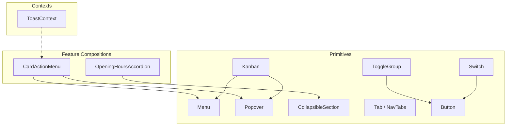

**Diagram sources**
- [Menu.tsx:192-374](file://src/components/ui/primitives/Menu.tsx#L192-L374)
- [Popover.tsx:97-183](file://src/components/ui/primitives/Popover.tsx#L97-L183)
- [CollapsibleSection.tsx:26-113](file://src/components/ui/primitives/CollapsibleSection.tsx#L26-L113)
- [Kanban.tsx:216-747](file://src/components/ui/primitives/Kanban.tsx#L216-L747)
- [NavTabs.tsx:26-68](file://src/components/ui/primitives/NavTabs.tsx#L26-L68)
- [Tab.tsx:50-83](file://src/components/ui/primitives/Tab.tsx#L50-L83)
- [ToggleGroup.tsx:20-53](file://src/components/ui/primitives/ToggleGroup.tsx#L20-L53)
- [Switch.tsx:47-97](file://src/components/ui/primitives/Switch.tsx#L47-L97)
- [Button.tsx:76-128](file://src/components/ui/primitives/Button.tsx#L76-L128)
- [CardActionMenu.tsx:52-113](file://src/components/ui/dashboard/CardActionMenu.tsx#L52-L113)
- [OpeningHoursAccordion.tsx:19-75](file://src/components/ui/detail-views/OpeningHoursAccordion.tsx#L19-L75)
- [ToastContext.tsx:42-147](file://src/contexts/ToastContext.tsx#L42-L147)

**Section sources**
- [Menu.tsx:192-374](file://src/components/ui/primitives/Menu.tsx#L192-L374)
- [Popover.tsx:97-183](file://src/components/ui/primitives/Popover.tsx#L97-L183)
- [CollapsibleSection.tsx:26-113](file://src/components/ui/primitives/CollapsibleSection.tsx#L26-L113)
- [Kanban.tsx:216-747](file://src/components/ui/primitives/Kanban.tsx#L216-L747)
- [NavTabs.tsx:26-68](file://src/components/ui/primitives/NavTabs.tsx#L26-L68)
- [Tab.tsx:50-83](file://src/components/ui/primitives/Tab.tsx#L50-L83)
- [ToggleGroup.tsx:20-53](file://src/components/ui/primitives/ToggleGroup.tsx#L20-L53)
- [Switch.tsx:47-97](file://src/components/ui/primitives/Switch.tsx#L47-L97)
- [Button.tsx:76-128](file://src/components/ui/primitives/Button.tsx#L76-L128)
- [CardActionMenu.tsx:52-113](file://src/components/ui/dashboard/CardActionMenu.tsx#L52-L113)
- [OpeningHoursAccordion.tsx:19-75](file://src/components/ui/detail-views/OpeningHoursAccordion.tsx#L19-L75)
- [ToastContext.tsx:42-147](file://src/contexts/ToastContext.tsx#L42-L147)

## Core Components
- Compound components: Menu, Popover, CollapsibleSection, Kanban expose Root/Trigger/Content or Column/Board/Item parts that share internal state via contexts.
- Controlled inputs: ToggleGroup and Switch accept value/checked and onChange/onCheckedChange, enabling fully controlled usage.
- Navigation tabs: NavTabs and Tab separate navigation routing from tab styling and state.
- Feature compositions: CardActionMenu composes Popover and Menu primitives; OpeningHoursAccordion composes local state and layout for collapsible content.

Key composition strategies:
- Shared state via React context (e.g., KanbanContext, Base UI contexts).
- Controlled/uncontrolled flexibility (e.g., CollapsibleSection supports open/defaultOpen and onOpenChange).
- Event propagation through callbacks (e.g., onMove, onValueCommit, onDragStart/End/Cancel).
- Prop validation via TypeScript interfaces and runtime guards (e.g., duplicate id warnings in Kanban).

**Section sources**
- [Kanban.tsx:59-81](file://src/components/ui/primitives/Kanban.tsx#L59-L81)
- [Menu.tsx:192-374](file://src/components/ui/primitives/Menu.tsx#L192-L374)
- [Popover.tsx:97-183](file://src/components/ui/primitives/Popover.tsx#L97-L183)
- [CollapsibleSection.tsx:26-113](file://src/components/ui/primitives/CollapsibleSection.tsx#L26-L113)
- [ToggleGroup.tsx:20-53](file://src/components/ui/primitives/ToggleGroup.tsx#L20-L53)
- [Switch.tsx:47-97](file://src/components/ui/primitives/Switch.tsx#L47-L97)
- [NavTabs.tsx:26-68](file://src/components/ui/primitives/NavTabs.tsx#L26-L68)
- [Tab.tsx:50-83](file://src/components/ui/primitives/Tab.tsx#L50-L83)

## Architecture Overview
The UI layer is built around small, focused primitives that compose into larger features. Primitives rely on Base UI for accessibility and behavior, while design tokens and variants define visual consistency. Contexts centralize global state (e.g., Toast), and feature components orchestrate primitives to implement domain-specific interactions.

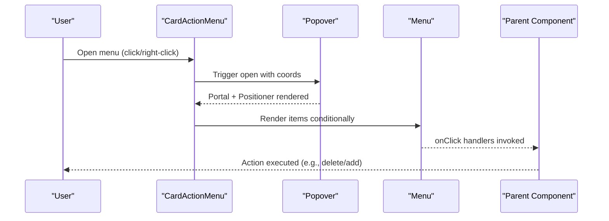

**Diagram sources**
- [CardActionMenu.tsx:52-113](file://src/components/ui/dashboard/CardActionMenu.tsx#L52-L113)
- [Popover.tsx:97-183](file://src/components/ui/primitives/Popover.tsx#L97-L183)
- [Menu.tsx:192-374](file://src/components/ui/primitives/Menu.tsx#L192-L374)

## Detailed Component Analysis

### Kanban Board (Compound + Drag-and-Drop Composition)
- Pattern: Compound component with KanbanRoot, KanbanBoard, KanbanColumn, and item slots sharing drag state via context.
- State management: Centralized columns state and activeId; uses refs to keep handler identities stable and avoid re-renders during drag.
- Event handling: onDragStart/Over/End/Cancel orchestrate live preview and commit semantics; onMove allows consumer-driven updates; onValueCommit provides final deltas with previousValue.
- Prop validation: Warns on duplicate item ids; supports custom collision detection and sensors; resolves slot drop targets for insertion points.
- Conditional rendering: Overlay context prevents column dragging when rendering overlays; cursor changes based on active drag.

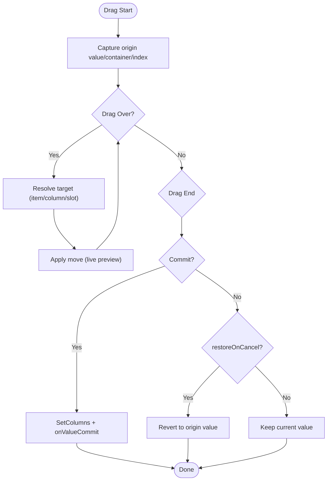

**Diagram sources**
- [Kanban.tsx:412-693](file://src/components/ui/primitives/Kanban.tsx#L412-L693)

**Section sources**
- [Kanban.tsx:59-81](file://src/components/ui/primitives/Kanban.tsx#L59-L81)
- [Kanban.tsx:216-747](file://src/components/ui/primitives/Kanban.tsx#L216-L747)
- [Kanban.tsx:263-281](file://src/components/ui/primitives/Kanban.tsx#L263-L281)
- [Kanban.tsx:412-693](file://src/components/ui/primitives/Kanban.tsx#L412-L693)

### Menu (Compound + Render Props)
- Pattern: Menu.Root/Trigger/Content/Item/DescriptiveMenuItem/Separator form a compound API. Content renders via portal and positioner with alignment and side options.
- Styling: Class Variance Authority defines variants for size, icon placement, and selected state; compound variants handle persistent selection styles.
- Composition: Consumers compose items and separators; DescriptiveMenuItem supports two-line content with leading icons.

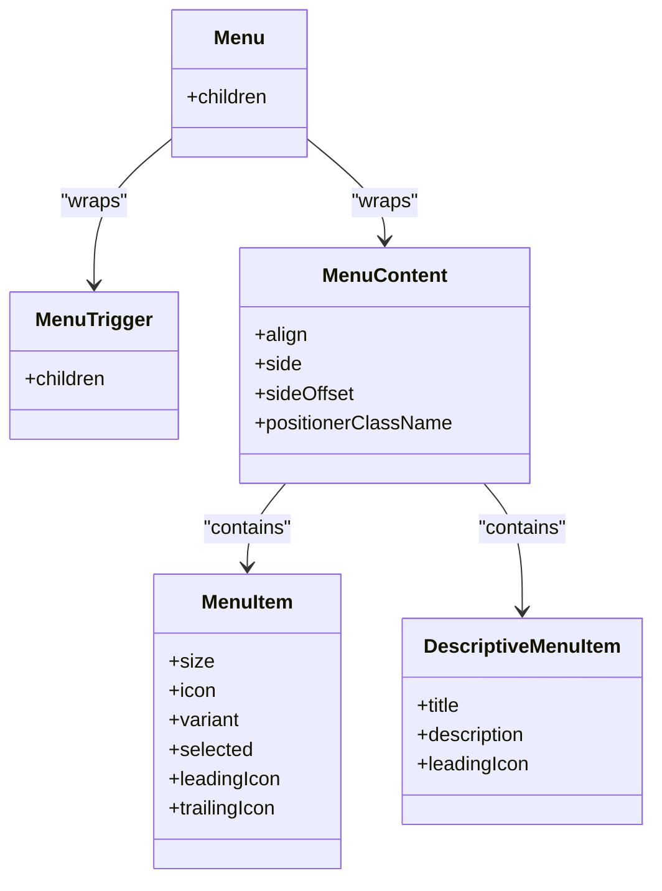

**Diagram sources**
- [Menu.tsx:192-374](file://src/components/ui/primitives/Menu.tsx#L192-L374)

**Section sources**
- [Menu.tsx:192-374](file://src/components/ui/primitives/Menu.tsx#L192-L374)

### Popover (Compound + Portal Composition)
- Pattern: Popover.Root/Trigger/Content with optional arrow and anchor positioning. Uses portals to escape clipping containers.
- Configuration: Alignments, sides, offsets, and collision padding allow precise placement; hover-to-open supported with delay.
- Composition: Used by CardActionMenu to render fixed-position menus anchored to coordinates.

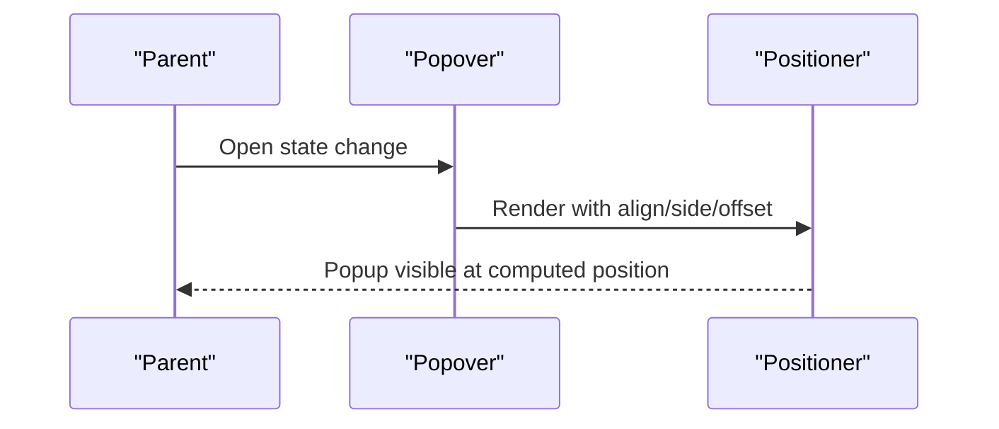

**Diagram sources**
- [Popover.tsx:97-183](file://src/components/ui/primitives/Popover.tsx#L97-L183)
- [CardActionMenu.tsx:52-113](file://src/components/ui/dashboard/CardActionMenu.tsx#L52-L113)

**Section sources**
- [Popover.tsx:97-183](file://src/components/ui/primitives/Popover.tsx#L97-L183)
- [CardActionMenu.tsx:52-113](file://src/components/ui/dashboard/CardActionMenu.tsx#L52-L113)

### ToggleGroup (Controlled Compound)
- Pattern: Renders a group of radio-like buttons driven by value and onChange. Each option maps to a Button with role="radio".
- State management: Fully controlled via value and onChange; no internal state.
- Accessibility: role="group", role="radio", aria-checked set per option.

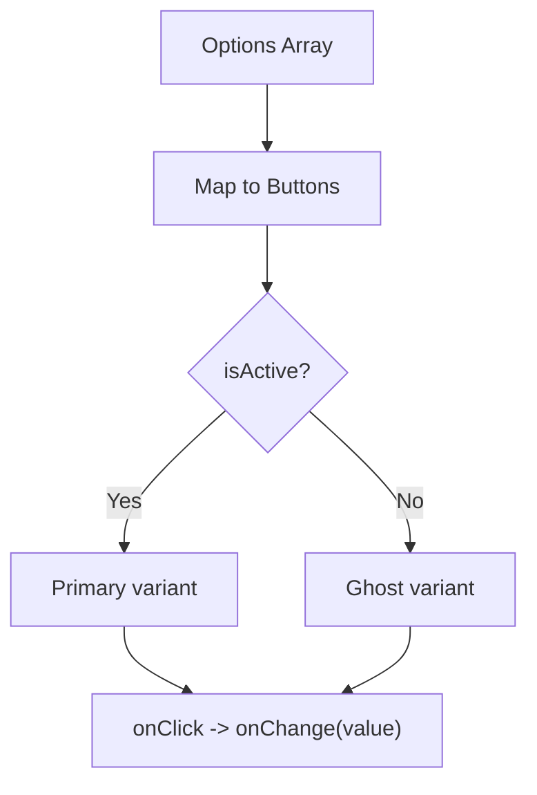

**Diagram sources**
- [ToggleGroup.tsx:20-53](file://src/components/ui/primitives/ToggleGroup.tsx#L20-L53)
- [Button.tsx:76-128](file://src/components/ui/primitives/Button.tsx#L76-L128)

**Section sources**
- [ToggleGroup.tsx:20-53](file://src/components/ui/primitives/ToggleGroup.tsx#L20-L53)
- [Button.tsx:76-128](file://src/components/ui/primitives/Button.tsx#L76-L128)

### Tabs (NavTabs + Tab)
- Pattern: NavTabs renders navigation links with active state derived from pathname; Tab provides accessible tab button with underline indicator and variants.
- State management: NavTabs uses Next.js router to determine active tab; Tab is presentational and relies on parent-controlled selected state.
- Composition: Combine NavTabs for route-based tabs and Tab for in-page tab headers.

```mermaid
sequenceDiagram
participant Router as "Next Router"
participant Nav as "NavTabs"
participant Link as "Link"
Router-->>Nav : pathname
Nav->>Link : isActive check
Link-->>Nav : Render with active/inactive classes
```

**Diagram sources**
- [NavTabs.tsx:26-68](file://src/components/ui/primitives/NavTabs.tsx#L26-L68)
- [Tab.tsx:50-83](file://src/components/ui/primitives/Tab.tsx#L50-L83)

**Section sources**
- [NavTabs.tsx:26-68](file://src/components/ui/primitives/NavTabs.tsx#L26-L68)
- [Tab.tsx:50-83](file://src/components/ui/primitives/Tab.tsx#L50-L83)

### CollapsibleSection (Compound Accordion)
- Pattern: Wraps Base UI Accordion to provide a single-section pattern with label, defaultOpen/open, and onOpenChange.
- State management: Supports both controlled (open/onOpenChange) and uncontrolled (defaultOpen) modes; translates boolean to array-based value required by Accordion.
- Composition: Header contains trigger with chevron; Panel animates height using CSS variables and transitions.

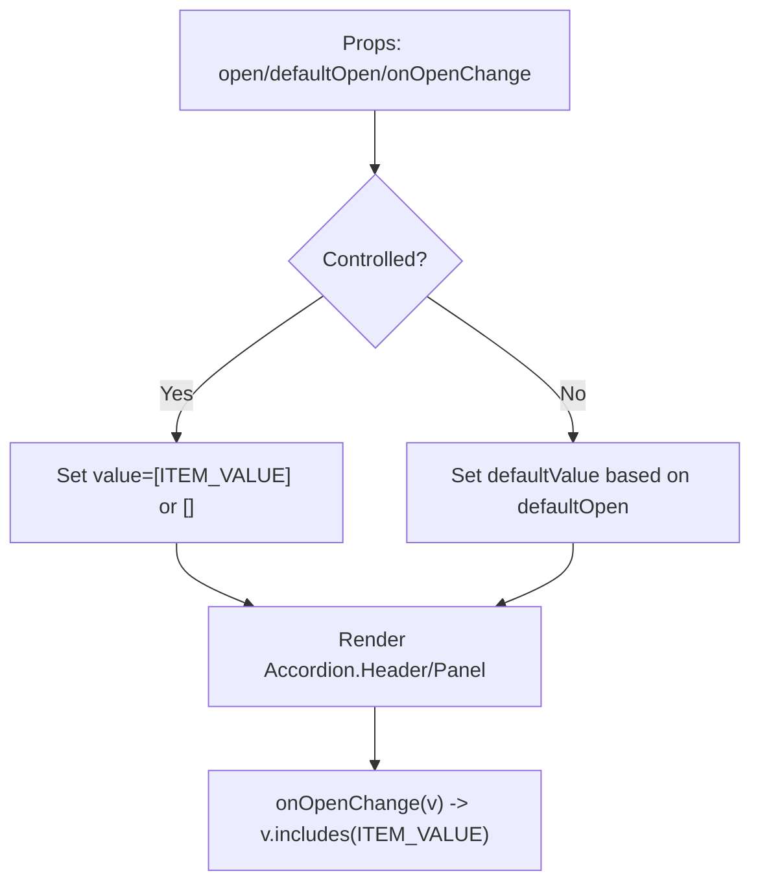

**Diagram sources**
- [CollapsibleSection.tsx:26-113](file://src/components/ui/primitives/CollapsibleSection.tsx#L26-L113)

**Section sources**
- [CollapsibleSection.tsx:26-113](file://src/components/ui/primitives/CollapsibleSection.tsx#L26-L113)

### Switch (Controlled Input)
- Pattern: Controlled switch with checked/defaultChecked and onCheckedChange; supports sizes and accessible label.
- State management: No internal state; delegates to Base UI Switch; visually styled via variants and CSS transitions.
- Composition: Can be embedded in forms or settings panels; integrates with theme tokens.

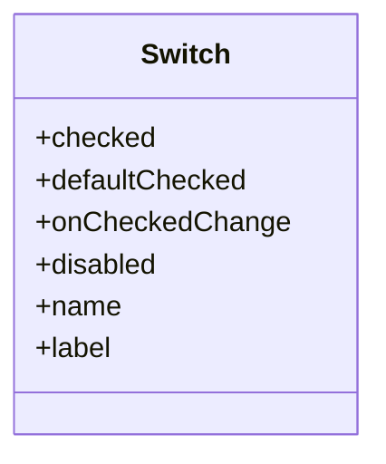

**Diagram sources**
- [Switch.tsx:47-97](file://src/components/ui/primitives/Switch.tsx#L47-L97)

**Section sources**
- [Switch.tsx:47-97](file://src/components/ui/primitives/Switch.tsx#L47-L97)

### CardActionMenu (Feature Composition)
- Pattern: Composes Popover and Menu primitives to create a per-card action menu anchored to fixed coordinates.
- Dynamic content: Conditionally renders actions based on provided callbacks; separator inserted between add-to-destination and delete actions.
- Integration: Uses Menu variants for consistent styling; leverages Popover’s portal and positioner for correct stacking.

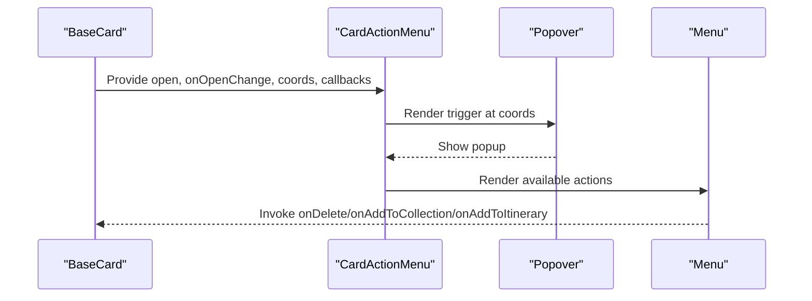

**Diagram sources**
- [CardActionMenu.tsx:52-113](file://src/components/ui/dashboard/CardActionMenu.tsx#L52-L113)
- [Popover.tsx:97-183](file://src/components/ui/primitives/Popover.tsx#L97-L183)
- [Menu.tsx:192-374](file://src/components/ui/primitives/Menu.tsx#L192-L374)

**Section sources**
- [CardActionMenu.tsx:52-113](file://src/components/ui/dashboard/CardActionMenu.tsx#L52-L113)

### OpeningHoursAccordion (Local State Composition)
- Pattern: Local state toggles expanded view; computes today’s hours and highlights current day.
- Conditional rendering: Shows summary line when collapsed; expands to full list with animated grid rows.
- Accessibility: aria-expanded toggled; chevron rotates on expand; keyboard focusable toggle.

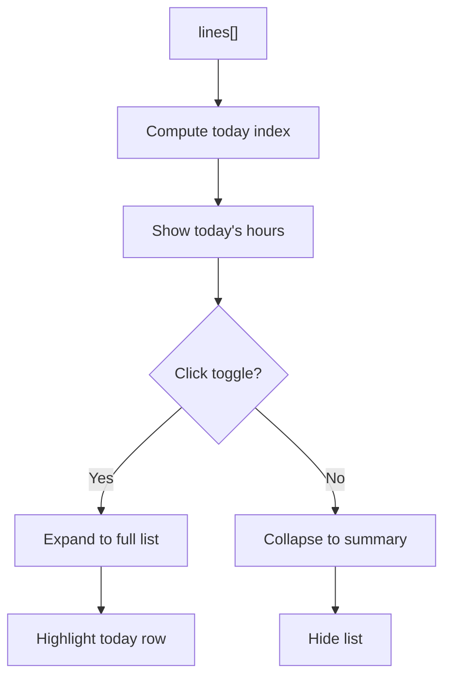

**Diagram sources**
- [OpeningHoursAccordion.tsx:19-75](file://src/components/ui/detail-views/OpeningHoursAccordion.tsx#L19-L75)

**Section sources**
- [OpeningHoursAccordion.tsx:19-75](file://src/components/ui/detail-views/OpeningHoursAccordion.tsx#L19-L75)

## Dependency Analysis
- Primitives depend on Base UI for robust behaviors (menu, popover, accordion, switch, button).
- Feature components depend on primitives and may depend on contexts (e.g., ToastContext) for global notifications.
- Contexts encapsulate global state and lifecycle (e.g., timers for toasts), providing hooks for consumers.

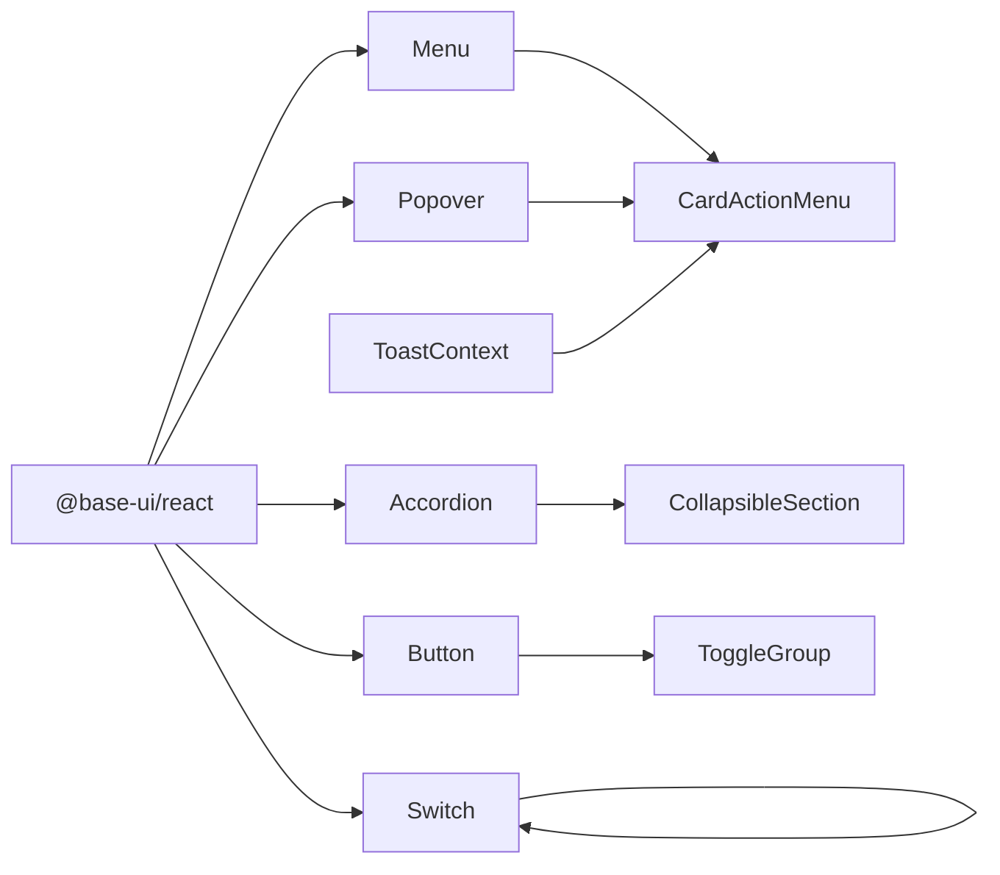

**Diagram sources**
- [Menu.tsx:192-374](file://src/components/ui/primitives/Menu.tsx#L192-L374)
- [Popover.tsx:97-183](file://src/components/ui/primitives/Popover.tsx#L97-L183)
- [CollapsibleSection.tsx:26-113](file://src/components/ui/primitives/CollapsibleSection.tsx#L26-L113)
- [Switch.tsx:47-97](file://src/components/ui/primitives/Switch.tsx#L47-L97)
- [Button.tsx:76-128](file://src/components/ui/primitives/Button.tsx#L76-L128)
- [ToggleGroup.tsx:20-53](file://src/components/ui/primitives/ToggleGroup.tsx#L20-L53)
- [CardActionMenu.tsx:52-113](file://src/components/ui/dashboard/CardActionMenu.tsx#L52-L113)
- [ToastContext.tsx:42-147](file://src/contexts/ToastContext.tsx#L42-L147)

**Section sources**
- [Menu.tsx:192-374](file://src/components/ui/primitives/Menu.tsx#L192-L374)
- [Popover.tsx:97-183](file://src/components/ui/primitives/Popover.tsx#L97-L183)
- [CollapsibleSection.tsx:26-113](file://src/components/ui/primitives/CollapsibleSection.tsx#L26-L113)
- [Switch.tsx:47-97](file://src/components/ui/primitives/Switch.tsx#L47-L97)
- [Button.tsx:76-128](file://src/components/ui/primitives/Button.tsx#L76-L128)
- [ToggleGroup.tsx:20-53](file://src/components/ui/primitives/ToggleGroup.tsx#L20-L53)
- [CardActionMenu.tsx:52-113](file://src/components/ui/dashboard/CardActionMenu.tsx#L52-L113)
- [ToastContext.tsx:42-147](file://src/contexts/ToastContext.tsx#L42-L147)

## Performance Considerations
- Stable handler identities: Use useCallback and refs to prevent unnecessary re-renders during frequent events (e.g., drag over).
- Live preview vs commit: Kanban applies moves during drag for responsiveness; commit only on end/cancel to reduce write frequency.
- Controlled inputs: Prefer controlled patterns for predictable state updates; avoid mixing controlled and uncontrolled states.
- Portals and stacking: Use portals for overlays to avoid clipping and ensure proper z-index stacking.
- Animation efficiency: Leverage CSS transitions and transforms; animate height via CSS variables where possible.

[No sources needed since this section provides general guidance]

## Troubleshooting Guide
- Duplicate item IDs in Kanban: Ensure unique ids across all columns; the component warns on duplicates to prevent misbehavior.
- Toast timing issues: Ensure ToastProvider wraps your app; use pause/resume APIs to manage timers when toasts are hovered or interacted with.
- Menu/Popover positioning: Adjust align, side, sideOffset, and collisionPadding to avoid viewport clipping; use positionerClassName to override z-index if needed.
- Accordion state: For single-section patterns, map boolean open/defaultOpen to array values expected by Base UI Accordion.

**Section sources**
- [Kanban.tsx:263-281](file://src/components/ui/primitives/Kanban.tsx#L263-L281)
- [ToastContext.tsx:42-147](file://src/contexts/ToastContext.tsx#L42-L147)
- [Popover.tsx:97-183](file://src/components/ui/primitives/Popover.tsx#L97-L183)
- [CollapsibleSection.tsx:26-113](file://src/components/ui/primitives/CollapsibleSection.tsx#L26-L113)

## Conclusion
The Argo platform employs robust composition patterns to build complex UIs from simple, reusable primitives. Compound components coordinate state via contexts, while controlled inputs and event-driven APIs enable flexible integration. By following these patterns—stable handlers, clear prop contracts, and thoughtful state boundaries—you can create maintainable, scalable component architectures that adapt to evolving product needs.

[No sources needed since this section summarizes without analyzing specific files]