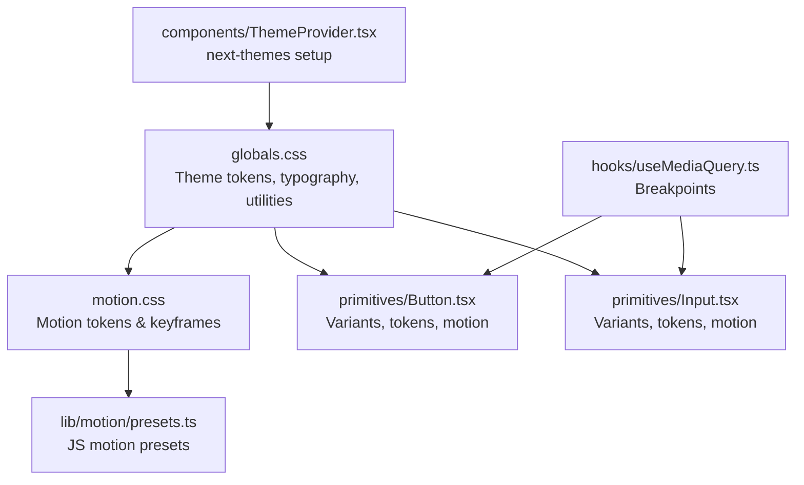
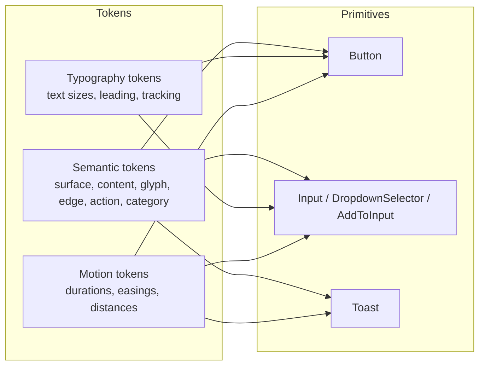
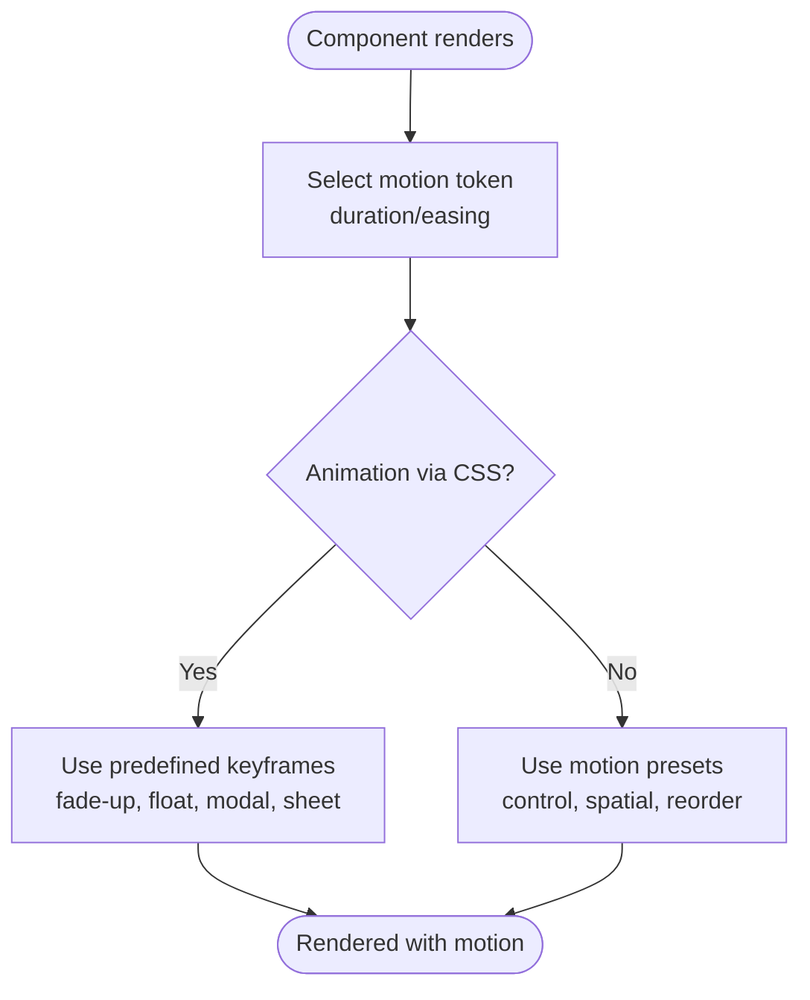
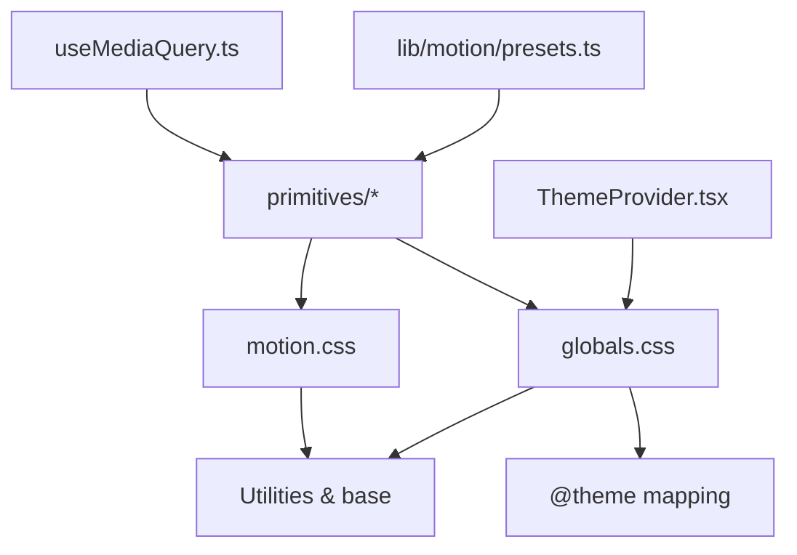

# Design System Overview

<cite>
**Referenced Files in This Document**
- [globals.css](file://src/app/globals.css)
- [motion.css](file://src/styles/tokens/motion.css)
- [presets.ts](file://src/lib/motion/presets.ts)
- [Button.tsx](file://src/components/ui/primitives/Button.tsx)
- [Input.tsx](file://src/components/ui/primitives/Input.tsx)
- [Toast.tsx](file://src/components/ui/primitives/Toast.tsx)
- [ThemeProvider.tsx](file://src/components/ThemeProvider.tsx)
- [useMediaQuery.ts](file://src/hooks/useMediaQuery.ts)
- [postcss.config.js](file://postcss.config.js)
</cite>

## Table of Contents
1. [Introduction](#introduction)
2. [Project Structure](#project-structure)
3. [Core Components](#core-components)
4. [Architecture Overview](#architecture-overview)
5. [Detailed Component Analysis](#detailed-component-analysis)
6. [Dependency Analysis](#dependency-analysis)
7. [Performance Considerations](#performance-considerations)
8. [Troubleshooting Guide](#troubleshooting-guide)
9. [Conclusion](#conclusion)
10. [Appendices](#appendices)

## Introduction
This document explains the Argo platform’s design system architecture with a focus on consistency, reusability, and accessibility. It covers:
- Foundational principles for component development
- Theme system built on Tailwind CSS with custom tokens and CSS variables
- Motion system integration for animations and transitions
- Guidelines for color schemes, typography scales, spacing systems, and responsive breakpoints
- Practical guidance for extending the design system with new components while maintaining consistency

The system is centered around semantic tokens (surface, content, glyph, edge, action, category), a robust motion token set, and accessible primitives that compose higher-level UI.

## Project Structure
At a high level:
- Global styles define theme tokens, typography, and utilities
- Motion tokens are centralized and consumed by both CSS and JavaScript animation presets
- Primitives implement consistent behavior and styling using tokens and variants
- Theme provider configures runtime theme behavior
- Hooks provide responsive breakpoint logic aligned with Tailwind defaults

**Diagram sources**
- [globals.css:12-784](file://src/app/globals.css#L12-L784)
- [motion.css:7-55](file://src/styles/tokens/motion.css#L7-L55)
- [Button.tsx:9-42](file://src/components/ui/primitives/Button.tsx#L9-L42)
- [Input.tsx:11-70](file://src/components/ui/primitives/Input.tsx#L11-L70)
- [presets.ts:8-45](file://src/lib/motion/presets.ts#L8-L45)
- [ThemeProvider.tsx:5-15](file://src/components/ThemeProvider.tsx#L5-L15)
- [useMediaQuery.ts:53-67](file://src/hooks/useMediaQuery.ts#L53-L67)

**Section sources**
- [globals.css:12-784](file://src/app/globals.css#L12-L784)
- [motion.css:7-55](file://src/styles/tokens/motion.css#L7-L55)
- [postcss.config.js:1-5](file://postcss.config.js#L1-L5)

## Core Components
- Button: Uses class-variance-authority to manage variants (primary, secondary, ghost, outline, dark), sizes, and icon placement. Applies motion tokens for transition duration and easing, and semantic tokens for colors and borders.
- Input: Provides default and underline variants, size options, and icon slot handling. Uses semantic tokens for backgrounds, borders, focus rings, and motion tokens for transitions. Includes DropdownSelector and AddToInput patterns.
- Toast: Renders notifications with AnimatePresence and motion presets, respects reduced motion preferences, and includes an auto-dismiss progress indicator.

These primitives demonstrate how to build reusable, accessible components grounded in shared tokens and motion guidelines.

**Section sources**
- [Button.tsx:9-42](file://src/components/ui/primitives/Button.tsx#L9-L42)
- [Button.tsx:44-67](file://src/components/ui/primitives/Button.tsx#L44-L67)
- [Input.tsx:11-70](file://src/components/ui/primitives/Input.tsx#L11-L70)
- [Input.tsx:125-276](file://src/components/ui/primitives/Input.tsx#L125-L276)
- [Toast.tsx:47-174](file://src/components/ui/primitives/Toast.tsx#L47-L174)

## Architecture Overview
The design system follows a layered approach:
- Tokens layer: CSS variables for colors, surfaces, actions, edges, categories, typography, and motion durations/easings
- Utilities and base layer: Typography classes, scrollbars, global resets, and utility animations
- Primitives layer: Accessible React components that consume tokens and motion presets
- Application layer: Pages and features composed from primitives

**Diagram sources**
- [globals.css:12-784](file://src/app/globals.css#L12-L784)
- [motion.css:7-55](file://src/styles/tokens/motion.css#L7-L55)
- [Button.tsx:9-42](file://src/components/ui/primitives/Button.tsx#L9-L42)
- [Input.tsx:11-70](file://src/components/ui/primitives/Input.tsx#L11-L70)
- [Toast.tsx:47-174](file://src/components/ui/primitives/Toast.tsx#L47-L174)

## Detailed Component Analysis

### Theme System
- Semantic tokens: Surface, content, glyph, edge, action, category, chart, sidebar, and calendar-specific tokens are defined as CSS variables under light and dark themes. These are then exposed via @theme inline mappings so they can be used as Tailwind utilities.
- Typography: Headings and body text use dedicated tokens for font-size, line-height, and letter-spacing, applied through type-* classes.
- Custom fonts: Primary and secondary font families are registered as tokens.
- Dark mode: A .dark scope overrides semantic tokens to ensure contrast and brand consistency across modes.

Guidelines:
- Prefer semantic tokens over raw color values in components
- Use type-* classes for consistent typography
- Keep brand scale centralized; avoid ad-hoc color literals

**Section sources**
- [globals.css:12-254](file://src/app/globals.css#L12-L254)
- [globals.css:256-492](file://src/app/globals.css#L256-L492)
- [globals.css:494-784](file://src/app/globals.css#L494-L784)
- [globals.css:786-854](file://src/app/globals.css#L786-L854)

### Motion System
- CSS motion tokens: Centralized durations, easings, spatial distances, stagger offsets, and semantic aliases for buttons, controls, overlays, and decorative animations. Reduced motion support disables or simplifies animations.
- Keyframes and utilities: Modal popups, backdrops, sheets, fade-up, floating decorations, highlight pulse, progress fill/drain, and map marker interactions all leverage motion tokens.
- JS motion presets: Duration and easing presets mapped to seconds for stateful choreography where CSS transitions cannot express complex sequences.

Guidelines:
- Consume motion tokens via CSS classes and motion presets
- Respect prefers-reduced-motion for accessibility
- Use semantic aliases like --motion-button-duration and --motion-overlay-ease

**Diagram sources**
- [motion.css:7-55](file://src/styles/tokens/motion.css#L7-L55)
- [motion.css:96-219](file://src/styles/tokens/motion.css#L96-L219)
- [presets.ts:8-45](file://src/lib/motion/presets.ts#L8-L45)

**Section sources**
- [motion.css:7-55](file://src/styles/tokens/motion.css#L7-L55)
- [motion.css:96-219](file://src/styles/tokens/motion.css#L96-L219)
- [presets.ts:8-45](file://src/lib/motion/presets.ts#L8-L45)

### Color Schemes
- Light and dark themes define semantic tokens for surface, content, glyph, edge, action, and category. Category tokens remain uniform across themes for consistent meaning.
- Brand palette is defined as a custom scale and mapped into Tailwind’s @theme for direct usage.
- Chart and calendar palettes are tokenized for data visualization and scheduling contexts.

Guidelines:
- Use semantic tokens for foreground/background relationships
- Maintain category semantics across themes
- Avoid hard-coded hex values in components

**Section sources**
- [globals.css:12-254](file://src/app/globals.css#L12-L254)
- [globals.css:256-492](file://src/app/globals.css#L256-L492)
- [globals.css:494-784](file://src/app/globals.css#L494-L784)

### Typography Scale
- Headings and body types are defined as tokens for font-size, line-height, and tracking.
- Type classes apply primary and secondary fonts consistently.
- Base typography is set at the html level for global consistency.

Guidelines:
- Use type-h1..h4 and type-body-1..4 classes
- Reserve secondary font for specific accents or quotes
- Do not override type tokens per component

**Section sources**
- [globals.css:494-784](file://src/app/globals.css#L494-L784)
- [globals.css:786-854](file://src/app/globals.css#L786-L854)

### Spacing Systems
- Spacing is primarily expressed via Tailwind utilities and container/grid layouts.
- The bento grid and day-board use CSS custom properties to derive column widths and row heights based on container queries, ensuring proportional spacing at any viewport.

Guidelines:
- Rely on Tailwind spacing utilities for most cases
- Use derived layout tokens for complex grids to maintain aspect ratios and alignment

**Section sources**
- [globals.css:1080-1134](file://src/app/globals.css#L1080-L1134)

### Responsive Breakpoints
- Breakpoint hook aligns with Tailwind v4 defaults (sm 640, md 768, lg 1024, xl 1280).
- Provides boolean flags (isPhone, isTablet, isDesktop) and active breakpoint bucket for conditional rendering.

Guidelines:
- Use the hook for JS branching to stay synchronized with CSS variants
- Prefer CSS media queries and Tailwind variants for presentation logic

**Section sources**
- [useMediaQuery.ts:53-67](file://src/hooks/useMediaQuery.ts#L53-L67)

### Accessibility Principles
- Focus management: Inputs and buttons include focus-visible outlines and ring tokens for clear focus states.
- Reduced motion: Motion tokens and keyframes adapt to prefers-reduced-motion to minimize motion.
- Live regions: Toast uses aria-live attributes appropriate to context (alert vs status).
- Semantics: Components use native elements and roles where applicable.

Guidelines:
- Ensure focus indicators are visible and consistent
- Honor user motion preferences
- Use semantic HTML and ARIA attributes appropriately

**Section sources**
- [Button.tsx:9-42](file://src/components/ui/primitives/Button.tsx#L9-L42)
- [Input.tsx:11-70](file://src/components/ui/primitives/Input.tsx#L11-L70)
- [Toast.tsx:47-174](file://src/components/ui/primitives/Toast.tsx#L47-L174)
- [motion.css:57-94](file://src/styles/tokens/motion.css#L57-L94)

### Extending the Design System
When adding new components:
- Define variants using class-variance-authority if needed
- Consume semantic tokens for colors, borders, and backgrounds
- Apply motion tokens for transitions and animations
- Follow existing naming conventions (data-slot, data-name) for testing and debugging
- Provide accessible props and keyboard interaction patterns
- Align responsive behavior with the breakpoint hook and Tailwind variants

Example pattern references:
- Button variant composition and decoration layers
- Input icon slot resolution and controlled/uncontrolled value handling
- Toast motion integration and progress indicator

**Section sources**
- [Button.tsx:9-42](file://src/components/ui/primitives/Button.tsx#L9-L42)
- [Button.tsx:44-67](file://src/components/ui/primitives/Button.tsx#L44-L67)
- [Input.tsx:11-70](file://src/components/ui/primitives/Input.tsx#L11-L70)
- [Input.tsx:125-276](file://src/components/ui/primitives/Input.tsx#L125-L276)
- [Toast.tsx:47-174](file://src/components/ui/primitives/Toast.tsx#L47-L174)

## Dependency Analysis
The design system has clear separation between tokens, utilities, and components:
- globals.css defines tokens and exposes them to Tailwind
- motion.css centralizes motion tokens and keyframes
- primitives depend on tokens and motion presets
- ThemeProvider configures runtime theme behavior
- useMediaQuery provides responsive state aligned with Tailwind defaults

**Diagram sources**
- [globals.css:12-784](file://src/app/globals.css#L12-L784)
- [motion.css:7-55](file://src/styles/tokens/motion.css#L7-L55)
- [presets.ts:8-45](file://src/lib/motion/presets.ts#L8-L45)
- [Button.tsx:9-42](file://src/components/ui/primitives/Button.tsx#L9-L42)
- [Input.tsx:11-70](file://src/components/ui/primitives/Input.tsx#L11-L70)
- [ThemeProvider.tsx:5-15](file://src/components/ThemeProvider.tsx#L5-L15)
- [useMediaQuery.ts:53-67](file://src/hooks/useMediaQuery.ts#L53-L67)

**Section sources**
- [postcss.config.js:1-5](file://postcss.config.js#L1-L5)
- [globals.css:12-784](file://src/app/globals.css#L12-L784)
- [motion.css:7-55](file://src/styles/tokens/motion.css#L7-L55)

## Performance Considerations
- Prefer CSS transitions and keyframes for simple animations to leverage GPU acceleration
- Use motion presets sparingly for complex stateful choreography
- Respect reduced motion to avoid unnecessary work for sensitive users
- Minimize layout thrashing by animating transform and opacity when possible
- Leverage container queries for responsive layouts to reduce reflows

[No sources needed since this section provides general guidance]

## Troubleshooting Guide
Common issues and resolutions:
- Inconsistent theme colors: Ensure components use semantic tokens rather than hardcoded values; verify @theme mappings in globals.css
- Animations not respecting motion tokens: Confirm motion.css is imported and tokens are present; check reduced motion settings
- Focus states missing: Verify focus-visible utilities and ring tokens are applied; test keyboard navigation
- Responsive mismatches: Validate breakpoint hook usage matches Tailwind defaults; ensure CSS media queries align with JS conditions

**Section sources**
- [globals.css:12-784](file://src/app/globals.css#L12-L784)
- [motion.css:57-94](file://src/styles/tokens/motion.css#L57-L94)
- [Button.tsx:9-42](file://src/components/ui/primitives/Button.tsx#L9-L42)
- [Input.tsx:11-70](file://src/components/ui/primitives/Input.tsx#L11-L70)
- [useMediaQuery.ts:53-67](file://src/hooks/useMediaQuery.ts#L53-L67)

## Conclusion
Argo’s design system centers on semantic tokens, consistent motion, and accessible primitives. By adhering to these foundations—using tokens, following motion guidelines, and leveraging responsive utilities—you can extend the system with new components that feel cohesive, performant, and inclusive.

[No sources needed since this section summarizes without analyzing specific files]

## Appendices

### Token Reference Summary
- Semantic tokens: surface, content, glyph, edge, action, category, chart, sidebar, calendar
- Typography tokens: headings and body sizes, leading, tracking
- Motion tokens: durations, easings, distances, stagger offsets, semantic aliases
- Breakpoints: sm 640, md 768, lg 1024, xl 1280

**Section sources**
- [globals.css:12-784](file://src/app/globals.css#L12-L784)
- [motion.css:7-55](file://src/styles/tokens/motion.css#L7-L55)
- [useMediaQuery.ts:53-67](file://src/hooks/useMediaQuery.ts#L53-L67)