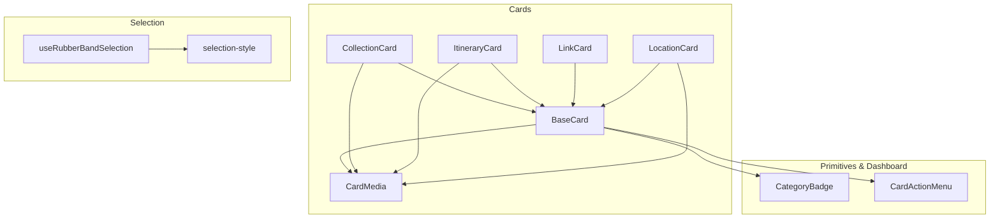
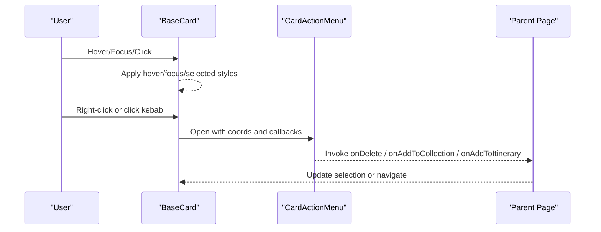
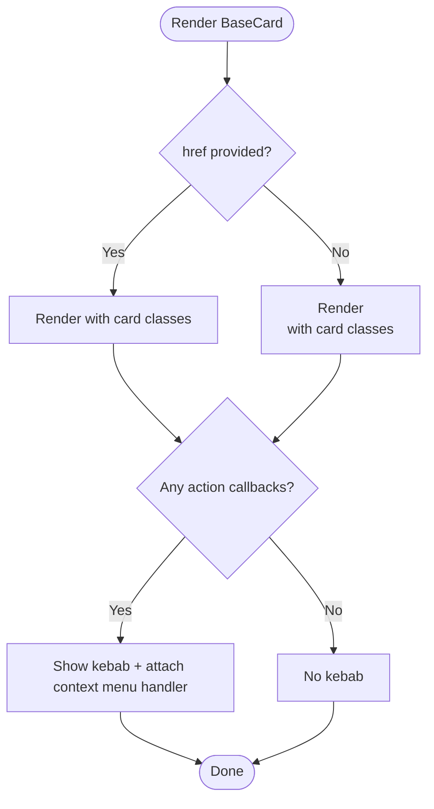
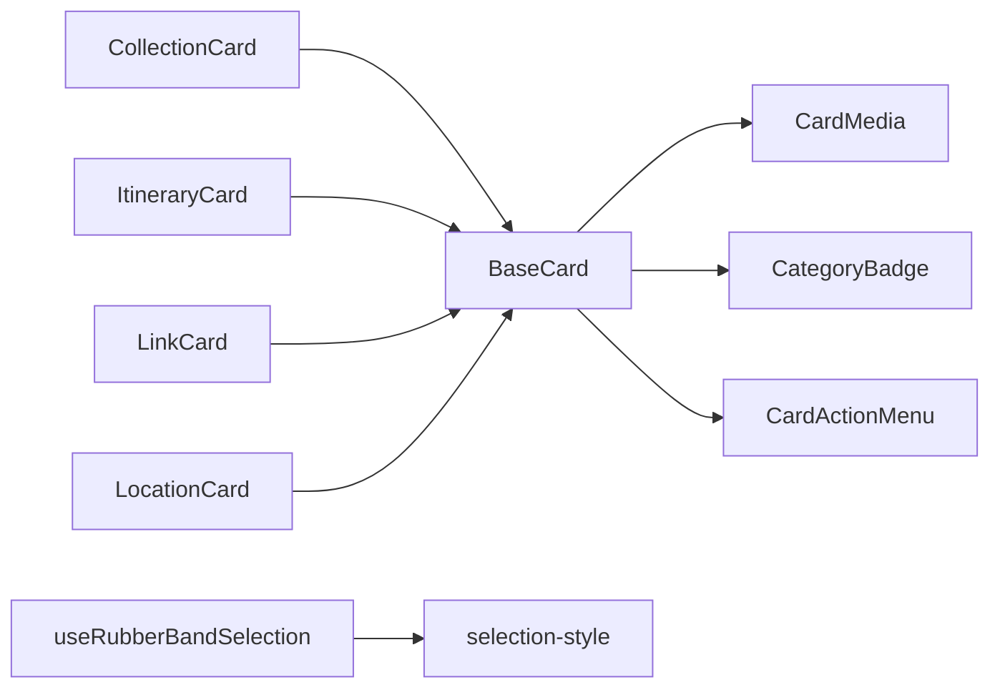

# Card System

<cite>
**Referenced Files in This Document**
- [BaseCard.tsx](file://src/components/ui/cards/BaseCard.tsx)
- [CollectionCard.tsx](file://src/components/ui/cards/CollectionCard.tsx)
- [ItineraryCard.tsx](file://src/components/ui/cards/ItineraryCard.tsx)
- [LinkCard.tsx](file://src/components/ui/cards/LinkCard.tsx)
- [LocationCard.tsx](file://src/components/ui/cards/LocationCard.tsx)
- [CardMedia.tsx](file://src/components/ui/cards/CardMedia.tsx)
- [CardActionMenu.tsx](file://src/components/ui/dashboard/CardActionMenu.tsx)
- [CategoryBadge.tsx](file://src/components/ui/primitives/CategoryBadge.tsx)
- [useRubberBandSelection.ts](file://src/hooks/useRubberBandSelection.ts)
- [selection-style.ts](file://src/lib/selection-style.ts)
- [constants.ts](file://src/components/ui/cards/constants.ts)
</cite>

## Table of Contents
1. [Introduction](#introduction)
2. [Project Structure](#project-structure)
3. [Core Components](#core-components)
4. [Architecture Overview](#architecture-overview)
5. [Detailed Component Analysis](#detailed-component-analysis)
6. [Dependency Analysis](#dependency-analysis)
7. [Performance Considerations](#performance-considerations)
8. [Troubleshooting Guide](#troubleshooting-guide)
9. [Conclusion](#conclusion)
10. [Appendices](#appendices)

## Introduction
This document explains the card system architecture that provides a unified interface for displaying different entity types (collections, itineraries, links, locations). BaseCard is the foundational component that standardizes media area, header with category badge, action menu, selection states, and interaction patterns. Specialized cards extend BaseCard to implement domain-specific visuals while reusing shared behavior. The system also supports multi-select modes via rubber-band selection and context menus.

## Project Structure
The card system lives under the UI cards directory and composes primitives and dashboard utilities:
- BaseCard: shared shell for all cards
- CardMedia: standardized media frame with image/gradient/placeholder fallbacks
- CategoryBadge: semantic icon badges per entity type
- CardActionMenu: kebab/context-menu actions (Add to Collection/Itinerary, Delete)
- Specialized cards: CollectionCard, ItineraryCard, LinkCard, LocationCard
- Selection integration: useRubberBandSelection hook and selection styles

**Diagram sources**
- [BaseCard.tsx:20-50](file://src/components/ui/cards/BaseCard.tsx#L20-L50)
- [CollectionCard.tsx:57-108](file://src/components/ui/cards/CollectionCard.tsx#L57-L108)
- [ItineraryCard.tsx:8-48](file://src/components/ui/cards/ItineraryCard.tsx#L8-L48)
- [LinkCard.tsx:8-71](file://src/components/ui/cards/LinkCard.tsx#L8-L71)
- [LocationCard.tsx:8-48](file://src/components/ui/cards/LocationCard.tsx#L8-L48)
- [CardMedia.tsx:7-21](file://src/components/ui/cards/CardMedia.tsx#L7-L21)
- [CardActionMenu.tsx:10-18](file://src/components/ui/dashboard/CardActionMenu.tsx#L10-L18)
- [CategoryBadge.tsx:79-86](file://src/components/ui/primitives/CategoryBadge.tsx#L79-L86)
- [useRubberBandSelection.ts:76-98](file://src/hooks/useRubberBandSelection.ts#L76-L98)
- [selection-style.ts:1-36](file://src/lib/selection-style.ts#L1-L36)

**Section sources**
- [BaseCard.tsx:20-50](file://src/components/ui/cards/BaseCard.tsx#L20-L50)
- [CardMedia.tsx:7-21](file://src/components/ui/cards/CardMedia.tsx#L7-L21)
- [CardActionMenu.tsx:10-18](file://src/components/ui/dashboard/CardActionMenu.tsx#L10-L18)
- [CategoryBadge.tsx:79-86](file://src/components/ui/primitives/CategoryBadge.tsx#L79-L86)
- [useRubberBandSelection.ts:76-98](file://src/hooks/useRubberBandSelection.ts#L76-L98)
- [selection-style.ts:1-36](file://src/lib/selection-style.ts#L1-L36)

## Core Components
- BaseCard: Provides the card shell including media slot, header with label and category badge, optional link/button wrapper, hover/focus states, disabled state, selection styling, and integrated action menu. It exposes props for media, label, href/prefetch, onClick, action callbacks (delete/add-to-collection/add-to-itinerary), disabled flag, and selection flags (isSelected, isSelectingMode).
- CardMedia: Renders a consistent media frame with precedence: custom children > imageUrl > gradient > placeholder. Supports aspect ratio and alt text fallback to label.
- CategoryBadge: Displays a small circular badge with a category-specific icon and color tokens. Categories include link, collection, itinerary, location, brand, neutral, flight, accommodation, expense.
- CardActionMenu: A popover-based menu anchored at fixed coordinates (kebab or cursor). Offers Add to Collection, Add to Itinerary, and Delete actions. Owned by BaseCard; pages supply callbacks.
- Specialized Cards: CollectionCard, ItineraryCard, LinkCard, LocationCard extend BaseCard with domain-specific media and icon variants.

Key prop surface (from BaseCard):
- Media: ReactNode passed into the media slot
- Label: string rendered in the header
- Icon variant: maps to CategoryBadge category
- Navigation: href and prefetchHref
- Interaction: onClick, onDelete, onAddToCollection, onAddToItinerary
- State: disabled, isSelected, isSelectingMode

**Section sources**
- [BaseCard.tsx:20-50](file://src/components/ui/cards/BaseCard.tsx#L20-L50)
- [BaseCard.tsx:120-148](file://src/components/ui/cards/BaseCard.tsx#L120-L148)
- [BaseCard.tsx:161-203](file://src/components/ui/cards/BaseCard.tsx#L161-L203)
- [CardMedia.tsx:7-21](file://src/components/ui/cards/CardMedia.tsx#L7-L21)
- [CardMedia.tsx:30-62](file://src/components/ui/cards/CardMedia.tsx#L30-L62)
- [CategoryBadge.tsx:79-86](file://src/components/ui/primitives/CategoryBadge.tsx#L79-L86)
- [CardActionMenu.tsx:10-18](file://src/components/ui/dashboard/CardActionMenu.tsx#L10-L18)

## Architecture Overview
BaseCard composes CardMedia and CategoryBadge, and renders CardActionMenu when actions are provided. Specialized cards configure their own media and iconVariant while inheriting BaseCard’s layout, keyboard navigation, hover/focus states, and selection styling. Multi-select integration is handled by a parent hook that toggles isSelected on cards and manages selection rectangles and context menus.

**Diagram sources**
- [BaseCard.tsx:81-109](file://src/components/ui/cards/BaseCard.tsx#L81-L109)
- [BaseCard.tsx:131-159](file://src/components/ui/cards/BaseCard.tsx#L131-L159)
- [CardActionMenu.tsx:52-113](file://src/components/ui/dashboard/CardActionMenu.tsx#L52-L113)

## Detailed Component Analysis

### BaseCard
- Responsibilities:
  - Renders media area above header
  - Header includes CategoryBadge and truncated label
  - Optional trailing kebab button opens CardActionMenu
  - Supports Link or div wrapper with keyboard support (Enter/Space)
  - Applies hover, focus-visible, disabled, and selected visual states
  - Prefetches href on hover when provided
- Props:
  - cardClass, className, style
  - media, label, iconVariant
  - href, prefetchHref, onClick
  - onDelete, onAddToCollection, onAddToItinerary
  - disabled, isSelected, isSelectingMode
- Accessibility:
  - role="button", tabIndex management, aria-disabled
  - Keyboard activation for Enter/Space
  - Context menu handling for right-click

**Diagram sources**
- [BaseCard.tsx:111-118](file://src/components/ui/cards/BaseCard.tsx#L111-L118)
- [BaseCard.tsx:161-203](file://src/components/ui/cards/BaseCard.tsx#L161-L203)
- [BaseCard.tsx:131-159](file://src/components/ui/cards/BaseCard.tsx#L131-L159)

**Section sources**
- [BaseCard.tsx:20-50](file://src/components/ui/cards/BaseCard.tsx#L20-L50)
- [BaseCard.tsx:81-109](file://src/components/ui/cards/BaseCard.tsx#L81-L109)
- [BaseCard.tsx:111-118](file://src/components/ui/cards/BaseCard.tsx#L111-L118)
- [BaseCard.tsx:120-148](file://src/components/ui/cards/BaseCard.tsx#L120-L148)
- [BaseCard.tsx:161-203](file://src/components/ui/cards/BaseCard.tsx#L161-L203)

### CardMedia
- Responsibilities:
  - Standardized media frame with rounded corners and overflow hidden
  - Precedence: children > imageUrl > gradient > placeholder
  - Aspect ratio control and alt text fallback to label
  - Image error handling to fallback gracefully
- Usage:
  - Used by ItineraryCard, LocationCard, and optionally CollectionCard when not using custom grid

**Section sources**
- [CardMedia.tsx:7-21](file://src/components/ui/cards/CardMedia.tsx#L7-L21)
- [CardMedia.tsx:30-62](file://src/components/ui/cards/CardMedia.tsx#L30-L62)

### CategoryBadge
- Responsibilities:
  - Renders a small circular badge with category-specific colors and icons
  - Supports multiple categories: link, collection, itinerary, location, brand, neutral, flight, accommodation, expense
  - Allows custom icon override and size

**Section sources**
- [CategoryBadge.tsx:21-41](file://src/components/ui/primitives/CategoryBadge.tsx#L21-L41)
- [CategoryBadge.tsx:43-65](file://src/components/ui/primitives/CategoryBadge.tsx#L43-L65)
- [CategoryBadge.tsx:67-77](file://src/components/ui/primitives/CategoryBadge.tsx#L67-L77)
- [CategoryBadge.tsx:79-119](file://src/components/ui/primitives/CategoryBadge.tsx#L79-L119)

### CardActionMenu
- Responsibilities:
  - Popover-based menu anchored at fixed coordinates
  - Actions: Add to Collection, Add to Itinerary, Delete
  - Non-destructive Delete styling (no red)
  - Separates add-to-destination actions from Delete with a divider
- Integration:
  - Owned by BaseCard; pages provide callbacks

**Section sources**
- [CardActionMenu.tsx:10-18](file://src/components/ui/dashboard/CardActionMenu.tsx#L10-L18)
- [CardActionMenu.tsx:20-41](file://src/components/ui/dashboard/CardActionMenu.tsx#L20-L41)
- [CardActionMenu.tsx:52-113](file://src/components/ui/dashboard/CardActionMenu.tsx#L52-L113)

### Specialized Cards

#### CollectionCard
- Extends BaseCard with:
  - Custom multi-image grid (up to 4 images) via CardMedia children
  - Fallback to Unsplash image based on query, then gradient/placeholder
  - Icon variant set to "collection"
- Props: images, imageAspect, gradient, fallbackQuery, plus inherited BaseCard props

**Section sources**
- [CollectionCard.tsx:10-55](file://src/components/ui/cards/CollectionCard.tsx#L10-L55)
- [CollectionCard.tsx:57-108](file://src/components/ui/cards/CollectionCard.tsx#L57-L108)

#### ItineraryCard
- Extends BaseCard with:
  - CardMedia for single image, gradient, or placeholder
  - Icon variant set to "itinerary"
- Props: imageUrl, imageAlt, imageAspect, gradient, plus inherited BaseCard props

**Section sources**
- [ItineraryCard.tsx:8-48](file://src/components/ui/cards/ItineraryCard.tsx#L8-L48)

#### LinkCard
- Extends BaseCard with:
  - Phone-frame thumbnail with optional image or gradient
  - Subtle rotation on hover/selected
  - Icon variant set to "link"
- Props: imageUrl, imageAlt, gradient, plus inherited BaseCard props

**Section sources**
- [LinkCard.tsx:8-71](file://src/components/ui/cards/LinkCard.tsx#L8-L71)

#### LocationCard
- Extends BaseCard with:
  - CardMedia for single image, gradient, or placeholder
  - Icon variant set to "location"
- Props: imageUrl, imageAlt, imageAspect, gradient, plus inherited BaseCard props

**Section sources**
- [LocationCard.tsx:8-48](file://src/components/ui/cards/LocationCard.tsx#L8-L48)

### Interaction Patterns

#### Hover States
- BaseCard applies hover background/border transitions and group-hover visibility for the kebab menu
- LinkCard adds a subtle rotate on hover/selected

**Section sources**
- [BaseCard.tsx:111-118](file://src/components/ui/cards/BaseCard.tsx#L111-L118)
- [BaseCard.tsx:131-145](file://src/components/ui/cards/BaseCard.tsx#L131-L145)
- [LinkCard.tsx:31-58](file://src/components/ui/cards/LinkCard.tsx#L31-L58)

#### Keyboard Navigation
- BaseCard supports Enter/Space activation when focused
- Focus-visible ring and border applied for accessibility

**Section sources**
- [BaseCard.tsx:180-203](file://src/components/ui/cards/BaseCard.tsx#L180-L203)

#### Context Menus
- BaseCard handles right-click to open CardActionMenu at cursor coordinates
- CardActionMenu anchors to fixed coordinates and offers Add/Delete actions

**Section sources**
- [BaseCard.tsx:81-109](file://src/components/ui/cards/BaseCard.tsx#L81-L109)
- [CardActionMenu.tsx:52-113](file://src/components/ui/dashboard/CardActionMenu.tsx#L52-L113)

#### Multi-Select Modes
- useRubberBandSelection provides:
  - Rubber-band rectangle rendering and intersection detection
  - Shift+click toggle, Escape to clear, select-all, clear-selection
  - Context menu coordination and suppression of clicks during drag
- selection-style defines rubber band and unselected card styles

**Section sources**
- [useRubberBandSelection.ts:76-98](file://src/hooks/useRubberBandSelection.ts#L76-L98)
- [useRubberBandSelection.ts:139-173](file://src/hooks/useRubberBandSelection.ts#L139-L173)
- [useRubberBandSelection.ts:201-223](file://src/hooks/useRubberBandSelection.ts#L201-L223)
- [useRubberBandSelection.ts:225-352](file://src/hooks/useRubberBandSelection.ts#L225-L352)
- [selection-style.ts:1-36](file://src/lib/selection-style.ts#L1-L36)

## Dependency Analysis
- BaseCard depends on:
  - CardMedia for media rendering
  - CategoryBadge for header icons
  - CardActionMenu for actions
- Specialized cards depend on BaseCard and optionally CardMedia
- Selection integration depends on useRubberBandSelection and selection-style

**Diagram sources**
- [BaseCard.tsx:20-50](file://src/components/ui/cards/BaseCard.tsx#L20-L50)
- [CollectionCard.tsx:57-108](file://src/components/ui/cards/CollectionCard.tsx#L57-L108)
- [ItineraryCard.tsx:8-48](file://src/components/ui/cards/ItineraryCard.tsx#L8-L48)
- [LinkCard.tsx:8-71](file://src/components/ui/cards/LinkCard.tsx#L8-L71)
- [LocationCard.tsx:8-48](file://src/components/ui/cards/LocationCard.tsx#L8-L48)
- [useRubberBandSelection.ts:76-98](file://src/hooks/useRubberBandSelection.ts#L76-L98)
- [selection-style.ts:1-36](file://src/lib/selection-style.ts#L1-L36)

**Section sources**
- [BaseCard.tsx:20-50](file://src/components/ui/cards/BaseCard.tsx#L20-L50)
- [useRubberBandSelection.ts:76-98](file://src/hooks/useRubberBandSelection.ts#L76-L98)
- [selection-style.ts:1-36](file://src/lib/selection-style.ts#L1-L36)

## Performance Considerations
- Use CardMedia to centralize image loading and fallback logic, reducing duplication across cards
- Prefer href + prefetchHref in BaseCard to leverage Next.js prefetching for faster navigation
- Avoid heavy computations in render paths; rely on memoization in hooks like useRubberBandSelection for selection updates
- Keep media slots lightweight; large grids should be paginated or virtualized at the page level

[No sources needed since this section provides general guidance]

## Troubleshooting Guide
- Kebab menu does not appear:
  - Ensure at least one action callback is provided (onDelete, onAddToCollection, onAddToItinerary)
- Right-click menu not opening:
  - Verify BaseCard receives action callbacks and that context menu handler is attached
- Selection not updating:
  - Confirm parent uses useRubberBandSelection and passes isSelected to each card
  - Ensure data-card attributes are present if relying on grid-level selection
- Image not showing:
  - Check imageUrl validity; CardMedia falls back to gradient or placeholder on error
- Accessibility issues:
  - Ensure disabled state sets aria-disabled and removes keyboard activation
  - Provide meaningful labels for images or rely on alt text fallback

**Section sources**
- [BaseCard.tsx:81-109](file://src/components/ui/cards/BaseCard.tsx#L81-L109)
- [BaseCard.tsx:161-203](file://src/components/ui/cards/BaseCard.tsx#L161-L203)
- [CardMedia.tsx:30-62](file://src/components/ui/cards/CardMedia.tsx#L30-L62)
- [useRubberBandSelection.ts:201-223](file://src/hooks/useRubberBandSelection.ts#L201-L223)

## Conclusion
The card system centers around BaseCard, which standardizes layout, interactions, and accessibility across entity types. Specialized cards compose BaseCard with domain-specific media and badges, while CardActionMenu and CategoryBadge provide consistent actions and categorization. Multi-select and context menus are integrated via a dedicated hook and styles, enabling robust selection workflows. Following these patterns ensures consistency, scalability, and maintainability across the application.

[No sources needed since this section summarizes without analyzing specific files]

## Appendices

### Creating a New Card Type
Steps:
- Create a new component file extending BaseCard
- Define a narrow prop interface picking relevant BaseCard props
- Compose media using CardMedia or custom children
- Set cardClass and iconVariant appropriate to the entity
- Export the component and its props type

Example references:
- ItineraryCard pattern: [ItineraryCard.tsx:8-48](file://src/components/ui/cards/ItineraryCard.tsx#L8-L48)
- LinkCard pattern: [LinkCard.tsx:8-71](file://src/components/ui/cards/LinkCard.tsx#L8-L71)
- CollectionCard pattern: [CollectionCard.tsx:57-108](file://src/components/ui/cards/CollectionCard.tsx#L57-L108)

**Section sources**
- [ItineraryCard.tsx:8-48](file://src/components/ui/cards/ItineraryCard.tsx#L8-L48)
- [LinkCard.tsx:8-71](file://src/components/ui/cards/LinkCard.tsx#L8-L71)
- [CollectionCard.tsx:57-108](file://src/components/ui/cards/CollectionCard.tsx#L57-L108)

### Best Practices for Responsive Design and Accessibility
- Use CardMedia with imageAspect to maintain consistent proportions across screen sizes
- Leverage BaseCard’s hover/focus-visible styles for clear interactive cues
- Provide alt text or rely on label fallback in CardMedia for images
- Ensure disabled state disables both pointer events and keyboard activation
- Integrate with useRubberBandSelection for accessible multi-select behaviors

**Section sources**
- [CardMedia.tsx:7-21](file://src/components/ui/cards/CardMedia.tsx#L7-L21)
- [BaseCard.tsx:111-118](file://src/components/ui/cards/BaseCard.tsx#L111-L118)
- [BaseCard.tsx:180-203](file://src/components/ui/cards/BaseCard.tsx#L180-L203)
- [useRubberBandSelection.ts:76-98](file://src/hooks/useRubberBandSelection.ts#L76-L98)