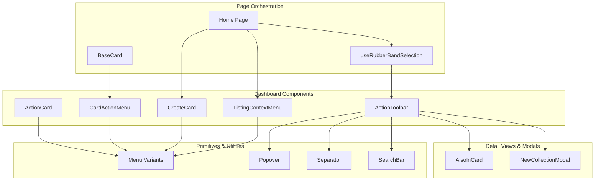
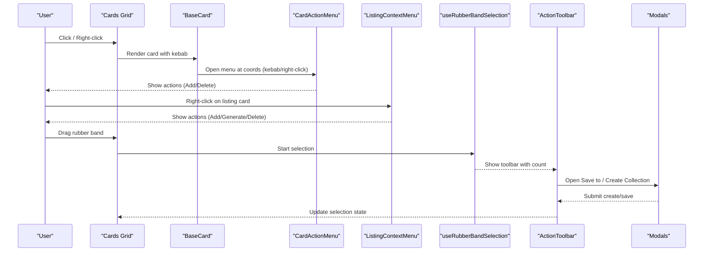
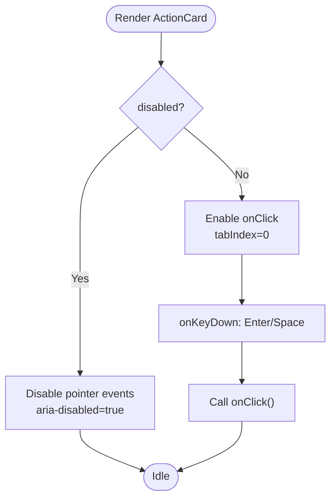
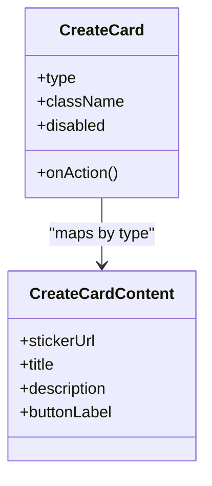
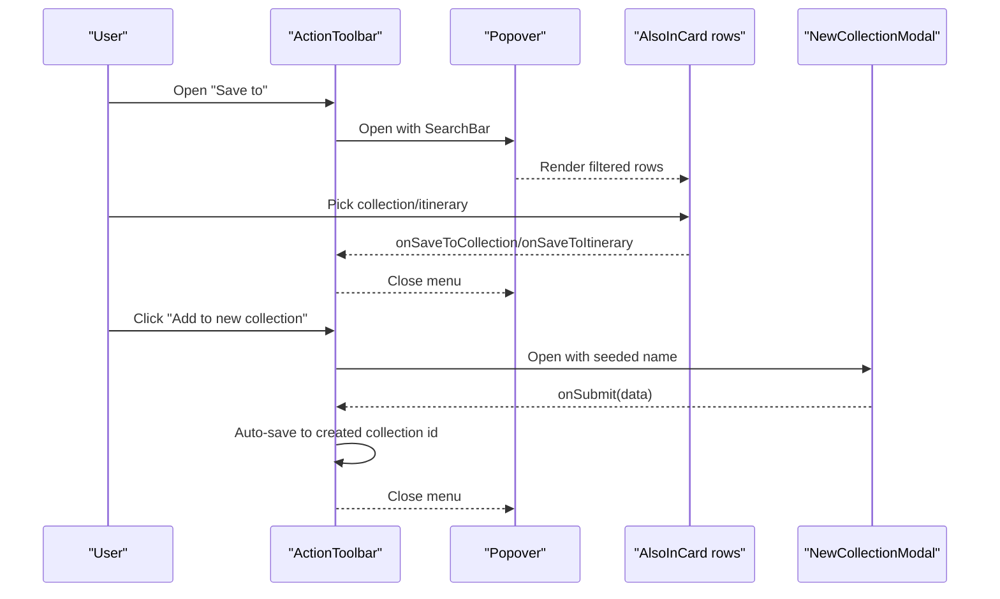
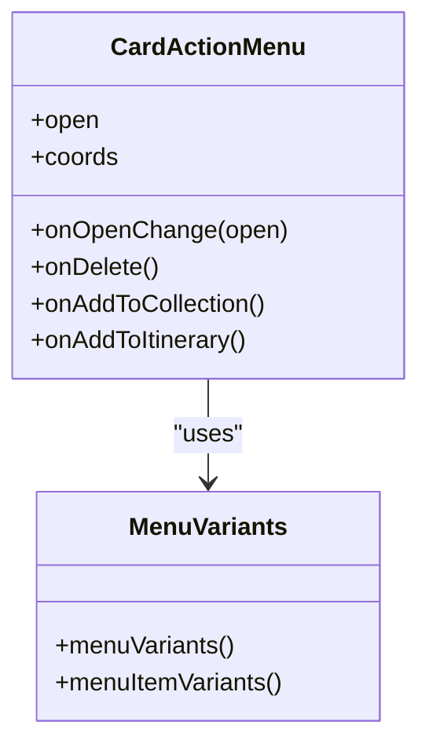
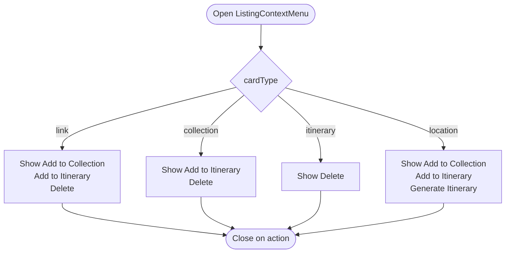
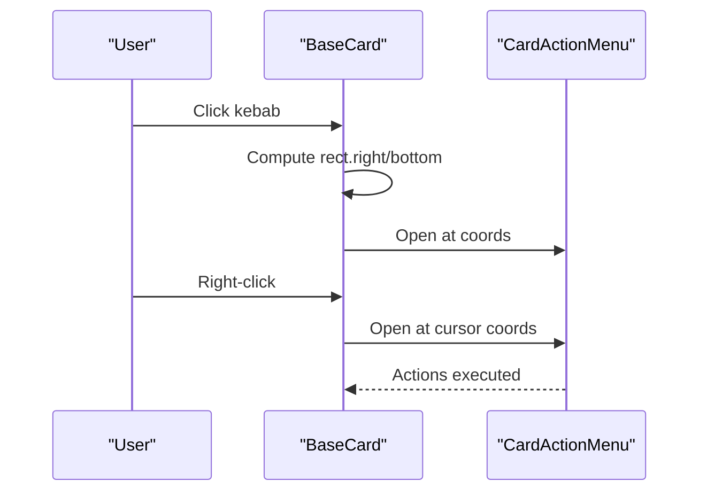
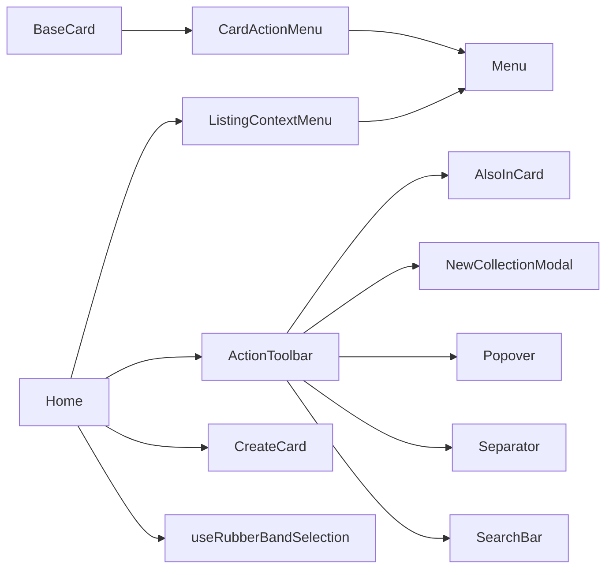

# Dashboard Components

<cite>
**Referenced Files in This Document**
- [ActionCard.tsx](file://src/components/ui/dashboard/ActionCard.tsx)
- [CreateCard.tsx](file://src/components/ui/dashboard/CreateCard.tsx)
- [ActionToolbar.tsx](file://src/components/ui/dashboard/ActionToolbar.tsx)
- [CardActionMenu.tsx](file://src/components/ui/dashboard/CardActionMenu.tsx)
- [ListingContextMenu.tsx](file://src/components/ui/dashboard/ListingContextMenu.tsx)
- [BaseCard.tsx](file://src/components/ui/cards/BaseCard.tsx)
- [Menu.tsx](file://src/components/ui/primitives/Menu.tsx)
- [AlsoInCard.tsx](file://src/components/ui/detail-views/AlsoInCard.tsx)
- [NewCollectionModal.tsx](file://src/components/ui/modals/NewCollectionModal.tsx)
- [page.tsx](file://src/app/home/page.tsx)
- [useRubberBandSelection.ts](file://src/hooks/useRubberBandSelection.ts)
</cite>

## Table of Contents
1. [Introduction](#introduction)
2. [Project Structure](#project-structure)
3. [Core Components](#core-components)
4. [Architecture Overview](#architecture-overview)
5. [Detailed Component Analysis](#detailed-component-analysis)
6. [Dependency Analysis](#dependency-analysis)
7. [Performance Considerations](#performance-considerations)
8. [Troubleshooting Guide](#troubleshooting-guide)
9. [Conclusion](#conclusion)
10. [Appendices](#appendices)

## Introduction
This document explains the dashboard-specific components that power interactive actions and list management across the application’s home and entity pages. It focuses on:
- ActionCard for primary dashboard actions
- CreateCard for content creation workflows
- ActionToolbar for contextual multi-select toolbars
- CardActionMenu and ListingContextMenu for right-click and overflow menu interactions

It covers component composition patterns, event handling strategies, state management approaches, responsive behavior, accessibility considerations, and integration with broader application state. It also provides guidance for extending existing components and implementing new dashboard features following established patterns.

## Project Structure
The dashboard UI is composed of reusable primitives (menus, buttons, popovers), detail-view tiles, modals, and page-level orchestration. The key files are organized as follows:
- Dashboard components live under src/components/ui/dashboard
- Shared primitives (menu variants, separators, search bar, popover) live under src/components/ui/primitives
- Detail views used by menus (e.g., AlsoInCard) live under src/components/ui/detail-views
- Modals (e.g., NewCollectionModal) live under src/components/ui/modals
- Page-level logic (home dashboard) lives under src/app/home/page.tsx
- Selection and interaction hooks live under src/hooks

**Diagram sources**
- [ActionCard.tsx:1-101](file://src/components/ui/dashboard/ActionCard.tsx#L1-L101)
- [CreateCard.tsx:1-99](file://src/components/ui/dashboard/CreateCard.tsx#L1-L99)
- [ActionToolbar.tsx:1-372](file://src/components/ui/dashboard/ActionToolbar.tsx#L1-L372)
- [CardActionMenu.tsx:1-115](file://src/components/ui/dashboard/CardActionMenu.tsx#L1-L115)
- [ListingContextMenu.tsx:1-164](file://src/components/ui/dashboard/ListingContextMenu.tsx#L1-L164)
- [BaseCard.tsx:1-200](file://src/components/ui/cards/BaseCard.tsx#L1-L200)
- [Menu.tsx:1-384](file://src/components/ui/primitives/Menu.tsx#L1-L384)
- [AlsoInCard.tsx:1-96](file://src/components/ui/detail-views/AlsoInCard.tsx#L1-L96)
- [NewCollectionModal.tsx:1-226](file://src/components/ui/modals/NewCollectionModal.tsx#L1-L226)
- [page.tsx:1-800](file://src/app/home/page.tsx#L1-L800)
- [useRubberBandSelection.ts:51-354](file://src/hooks/useRubberBandSelection.ts#L51-L354)

**Section sources**
- [ActionCard.tsx:1-101](file://src/components/ui/dashboard/ActionCard.tsx#L1-L101)
- [CreateCard.tsx:1-99](file://src/components/ui/dashboard/CreateCard.tsx#L1-L99)
- [ActionToolbar.tsx:1-372](file://src/components/ui/dashboard/ActionToolbar.tsx#L1-L372)
- [CardActionMenu.tsx:1-115](file://src/components/ui/dashboard/CardActionMenu.tsx#L1-L115)
- [ListingContextMenu.tsx:1-164](file://src/components/ui/dashboard/ListingContextMenu.tsx#L1-L164)
- [BaseCard.tsx:1-200](file://src/components/ui/cards/BaseCard.tsx#L1-L200)
- [Menu.tsx:1-384](file://src/components/ui/primitives/Menu.tsx#L1-L384)
- [AlsoInCard.tsx:1-96](file://src/components/ui/detail-views/AlsoInCard.tsx#L1-L96)
- [NewCollectionModal.tsx:1-226](file://src/components/ui/modals/NewCollectionModal.tsx#L1-L226)
- [page.tsx:1-800](file://src/app/home/page.tsx#L1-L800)
- [useRubberBandSelection.ts:51-354](file://src/hooks/useRubberBandSelection.ts#L51-L354)

## Core Components
- ActionCard: A keyboard-accessible action tile with label, optional sticker image, hover/focus states, and a click handler. It uses class-based styling and exposes props for label, stickerUrl, onClick, disabled, and className.
- CreateCard: A promotional card for creating links, collections, or itineraries. It renders a sticker, title, description, and an action button wired to a modal via onAction. Content is driven by a type mapping.
- ActionToolbar: A floating toolbar shown during multi-selection. It displays selection count, a “Save to” popover with search, merged lists of collections and itineraries, optional generate/delete actions, and a close button. It supports controlled open state for its menu and integrates inline collection creation.
- CardActionMenu: A per-card kebab/right-click menu anchored at fixed coordinates. It conditionally shows Add to Collection, Add to Itinerary, and Delete actions based on provided callbacks.
- ListingContextMenu: A context menu for listing cards with behavior gated by card type. It can show Add to Collection, Add to Itinerary, Generate Itinerary (for locations), and Delete, with destructive variant support.

These components follow consistent patterns:
- Composition over inheritance: small, focused components composed into larger flows
- Controlled vs uncontrolled state: menus accept open/onOpenChange; some internal state is managed locally when appropriate
- Event-driven actions: handlers passed from parent pages perform side effects (API calls, state updates)
- Accessibility: role="button", tabIndex, aria-disabled, semantic labels, keyboard activation where applicable

**Section sources**
- [ActionCard.tsx:23-99](file://src/components/ui/dashboard/ActionCard.tsx#L23-L99)
- [CreateCard.tsx:8-99](file://src/components/ui/dashboard/CreateCard.tsx#L8-L99)
- [ActionToolbar.tsx:14-372](file://src/components/ui/dashboard/ActionToolbar.tsx#L14-L372)
- [CardActionMenu.tsx:10-115](file://src/components/ui/dashboard/CardActionMenu.tsx#L10-L115)
- [ListingContextMenu.tsx:13-164](file://src/components/ui/dashboard/ListingContextMenu.tsx#L13-L164)

## Architecture Overview
The dashboard composes user actions through layered components:
- Cards render media and headers; BaseCard adds kebab and right-click support, wiring CardActionMenu
- Context menus (CardActionMenu, ListingContextMenu) use Popover primitives to position menus at fixed coordinates
- Multi-selection triggers ActionToolbar, which orchestrates save-to destinations and bulk actions
- Creation flows use CreateCard to launch modals (NewLinkModal, NewCollectionModal, NewItineraryModal)
- Page-level state manages selections, modals, and data synchronization with queries and queues

**Diagram sources**
- [BaseCard.tsx:81-159](file://src/components/ui/cards/BaseCard.tsx#L81-L159)
- [CardActionMenu.tsx:52-115](file://src/components/ui/dashboard/CardActionMenu.tsx#L52-L115)
- [ListingContextMenu.tsx:72-164](file://src/components/ui/dashboard/ListingContextMenu.tsx#L72-L164)
- [useRubberBandSelection.ts:225-354](file://src/hooks/useRubberBandSelection.ts#L225-L354)
- [ActionToolbar.tsx:96-372](file://src/components/ui/dashboard/ActionToolbar.tsx#L96-L372)

## Detailed Component Analysis

### ActionCard
- Purpose: Primary action tile with accessible keyboard interaction and optional sticker imagery
- Props: label, stickerUrl, onClick, disabled, className
- Behavior:
  - Keyboard activation via Enter/Space
  - Focus-visible ring and border changes
  - Hover lift and icon reveal
  - Disabled state prevents interaction
- Integration: Used within dashboards to surface quick actions; typically wrapped in grids or carousels

**Diagram sources**
- [ActionCard.tsx:36-99](file://src/components/ui/dashboard/ActionCard.tsx#L36-L99)

**Section sources**
- [ActionCard.tsx:23-99](file://src/components/ui/dashboard/ActionCard.tsx#L23-L99)

### CreateCard
- Purpose: Promotes creation flows for link, collection, and itinerary
- Props: type, onAction, className, disabled
- Behavior:
  - Renders sticker, title, description based on type mapping
  - Button triggers onAction (typically opening a modal)
  - Accessible via standard button semantics
- Integration: Placed in mobile carousel or grid on home page; connects to modals like NewLinkModal, NewCollectionModal, NewItineraryModal

**Diagram sources**
- [CreateCard.tsx:8-99](file://src/components/ui/dashboard/CreateCard.tsx#L8-L99)

**Section sources**
- [CreateCard.tsx:8-99](file://src/components/ui/dashboard/CreateCard.tsx#L8-L99)

### ActionToolbar
- Purpose: Floating toolbar for multi-selected items
- Props: count, collections, onSaveToCollection, itineraries, onSaveToItinerary, onCreateCollection, onGenerate, onDelete, onClose, menuOpen, onMenuOpenChange, className
- Behavior:
  - Displays selection count
  - Opens “Save to” popover with search and merged list of collections and itineraries sorted by updatedAt
  - Supports inline creation of new collections via NewCollectionModal, then auto-saves selection
  - Optional generate and delete actions
  - Stops propagation to avoid interfering with rubber-band selection
- State:
  - Internal menu open state unless controlled via menuOpen/onMenuOpenChange
  - Local query state for filtering
  - Inline create modal open and name seeding from search query

**Diagram sources**
- [ActionToolbar.tsx:96-372](file://src/components/ui/dashboard/ActionToolbar.tsx#L96-L372)
- [AlsoInCard.tsx:1-96](file://src/components/ui/detail-views/AlsoInCard.tsx#L1-L96)
- [NewCollectionModal.tsx:1-226](file://src/components/ui/modals/NewCollectionModal.tsx#L1-L226)

**Section sources**
- [ActionToolbar.tsx:14-372](file://src/components/ui/dashboard/ActionToolbar.tsx#L14-L372)

### CardActionMenu
- Purpose: Per-card kebab/right-click menu
- Props: open, onOpenChange, coords, onDelete, onAddToCollection, onAddToItinerary
- Behavior:
  - Anchors at fixed coords (zero-size trigger)
  - Conditionally renders actions based on provided callbacks
  - Uses Menu variants for consistent styling
- Integration: Owned by BaseCard; pages supply action callbacks

**Diagram sources**
- [CardActionMenu.tsx:10-115](file://src/components/ui/dashboard/CardActionMenu.tsx#L10-L115)
- [Menu.tsx:111-124](file://src/components/ui/primitives/Menu.tsx#L111-L124)

**Section sources**
- [CardActionMenu.tsx:10-115](file://src/components/ui/dashboard/CardActionMenu.tsx#L10-L115)

### ListingContextMenu
- Purpose: Context menu for listing cards with type-gated actions
- Props: open, onOpenChange, coords, cardType, selectedCount, onAddToCollection, onAddToItinerary, onGenerateItinerary, onDelete
- Behavior:
  - Shows Add to Collection/Add to Itinerary based on cardType map
  - Adds Generate Itinerary for location type
  - Provides Delete with destructive variant when allowed
  - Uses Popover positioning and Menu variants

**Diagram sources**
- [ListingContextMenu.tsx:51-70](file://src/components/ui/dashboard/ListingContextMenu.tsx#L51-L70)
- [ListingContextMenu.tsx:72-164](file://src/components/ui/dashboard/ListingContextMenu.tsx#L72-L164)

**Section sources**
- [ListingContextMenu.tsx:13-164](file://src/components/ui/dashboard/ListingContextMenu.tsx#L13-L164)

### BaseCard Integration
- Purpose: Shared shell for all entity cards; adds kebab and right-click support
- Behavior:
  - Renders category badge, label, and optional kebab
  - Opens CardActionMenu at kebab or cursor position
  - Wraps content in Link or div with keyboard/click handling
  - Supports selection styles for multi-select mode

**Diagram sources**
- [BaseCard.tsx:81-159](file://src/components/ui/cards/BaseCard.tsx#L81-L159)
- [CardActionMenu.tsx:52-115](file://src/components/ui/dashboard/CardActionMenu.tsx#L52-L115)

**Section sources**
- [BaseCard.tsx:1-200](file://src/components/ui/cards/BaseCard.tsx#L1-L200)

## Dependency Analysis
- Dashboard components depend on primitives (Menu, Popover, Separator, SearchBar) and detail views (AlsoInCard)
- BaseCard composes CardActionMenu and provides unified kebab/right-click behavior
- ActionToolbar depends on AlsoInCard for destination rows and NewCollectionModal for inline creation
- Page-level code (home) wires CreateCard to modals and handles context menu actions
- Selection hook drives toolbar visibility and selection state

**Diagram sources**
- [BaseCard.tsx:1-200](file://src/components/ui/cards/BaseCard.tsx#L1-L200)
- [CardActionMenu.tsx:1-115](file://src/components/ui/dashboard/CardActionMenu.tsx#L1-L115)
- [ListingContextMenu.tsx:1-164](file://src/components/ui/dashboard/ListingContextMenu.tsx#L1-L164)
- [ActionToolbar.tsx:1-372](file://src/components/ui/dashboard/ActionToolbar.tsx#L1-L372)
- [Menu.tsx:1-384](file://src/components/ui/primitives/Menu.tsx#L1-L384)
- [AlsoInCard.tsx:1-96](file://src/components/ui/detail-views/AlsoInCard.tsx#L1-L96)
- [NewCollectionModal.tsx:1-226](file://src/components/ui/modals/NewCollectionModal.tsx#L1-L226)
- [page.tsx:1-800](file://src/app/home/page.tsx#L1-L800)
- [useRubberBandSelection.ts:51-354](file://src/hooks/useRubberBandSelection.ts#L51-L354)

**Section sources**
- [BaseCard.tsx:1-200](file://src/components/ui/cards/BaseCard.tsx#L1-L200)
- [ActionToolbar.tsx:1-372](file://src/components/ui/dashboard/ActionToolbar.tsx#L1-L372)
- [CardActionMenu.tsx:1-115](file://src/components/ui/dashboard/CardActionMenu.tsx#L1-L115)
- [ListingContextMenu.tsx:1-164](file://src/components/ui/dashboard/ListingContextMenu.tsx#L1-L164)
- [Menu.tsx:1-384](file://src/components/ui/primitives/Menu.tsx#L1-L384)
- [AlsoInCard.tsx:1-96](file://src/components/ui/detail-views/AlsoInCard.tsx#L1-L96)
- [NewCollectionModal.tsx:1-226](file://src/components/ui/modals/NewCollectionModal.tsx#L1-L226)
- [page.tsx:1-800](file://src/app/home/page.tsx#L1-L800)
- [useRubberBandSelection.ts:51-354](file://src/hooks/useRubberBandSelection.ts#L51-L354)

## Performance Considerations
- Avoid unnecessary re-renders by memoizing derived lists in ActionToolbar (collections + itineraries) and filtering only when query changes
- Use controlled open states for menus to prevent redundant opens/closes
- Debounce or throttle heavy operations triggered from menus (e.g., API calls) at the page level
- Prefer stable keys for list items (e.g., collection/itinerary ids) to optimize reconciliation
- Keep menu content minimal; defer heavy computations until the menu opens

[No sources needed since this section provides general guidance]

## Troubleshooting Guide
Common issues and resolutions:
- Menu not appearing at expected position: Ensure coords are set correctly and Popover Positioner has sufficient z-index; verify collisionPadding and sideOffset
- Toolbar not responding to clicks: Confirm stopPropagation is not blocking intended events; check that toolbar is mounted and not obscured
- Context menu actions not firing: Verify callbacks are provided and not null; ensure runAction pattern closes menu before executing
- Selection state inconsistencies: Validate that rubber-band selection hook is properly attached to the grid container and that selection clearing occurs via toolbar close or Escape

**Section sources**
- [ActionToolbar.tsx:197-211](file://src/components/ui/dashboard/ActionToolbar.tsx#L197-L211)
- [CardActionMenu.tsx:62-115](file://src/components/ui/dashboard/CardActionMenu.tsx#L62-L115)
- [ListingContextMenu.tsx:86-164](file://src/components/ui/dashboard/ListingContextMenu.tsx#L86-L164)
- [useRubberBandSelection.ts:225-354](file://src/hooks/useRubberBandSelection.ts#L225-L354)

## Conclusion
The dashboard components provide a cohesive system for actions, creation workflows, and list management. They leverage shared primitives for consistent UX, integrate tightly with page-level state and selection hooks, and maintain accessibility and responsiveness. Extending these components involves adding new types, callbacks, and menu items while adhering to established composition and event-handling patterns.

[No sources needed since this section summarizes without analyzing specific files]

## Appendices

### Extending Existing Components
- Adding a new action to CardActionMenu:
  - Provide a new callback prop (e.g., onArchive)
  - Render a new menu item using menuItemVariants
  - Wire the action in BaseCard or page-level handlers
- Extending ListingContextMenu:
  - Update the cardType maps to include new actions
  - Add a new ContextMenuItem with appropriate icon and variant
- Enhancing ActionToolbar:
  - Add new rows to the merged list (collections/itineraries)
  - Implement new handlers (e.g., export, share)
  - Integrate with modals or external services

### Responsive Behavior
- ActionToolbar adapts layout on small screens (centered horizontally, compact spacing)
- CreateCard fits into mobile carousel with snap scrolling and pagination controls
- Menus use Popover positioning to avoid overflow and respect collisionPadding

### Accessibility Considerations
- Keyboard navigation: ActionCard supports Enter/Space; BaseCard supports focus and keyboard activation
- ARIA attributes: aria-disabled, role="button", aria-labels for icons and actions
- Focus management: Menus close on action; toolbar stops propagation to avoid unintended selection

### Integration with Broader Application State
- Home page manages modals, selection, and data refresh via queries and jobs queue
- Context menu actions call API functions and update local state (removeItem, prependItem)
- Toast notifications provide feedback for success/error states

**Section sources**
- [page.tsx:553-679](file://src/app/home/page.tsx#L553-L679)
- [ActionToolbar.tsx:124-162](file://src/components/ui/dashboard/ActionToolbar.tsx#L124-L162)
- [BaseCard.tsx:120-199](file://src/components/ui/cards/BaseCard.tsx#L120-L199)