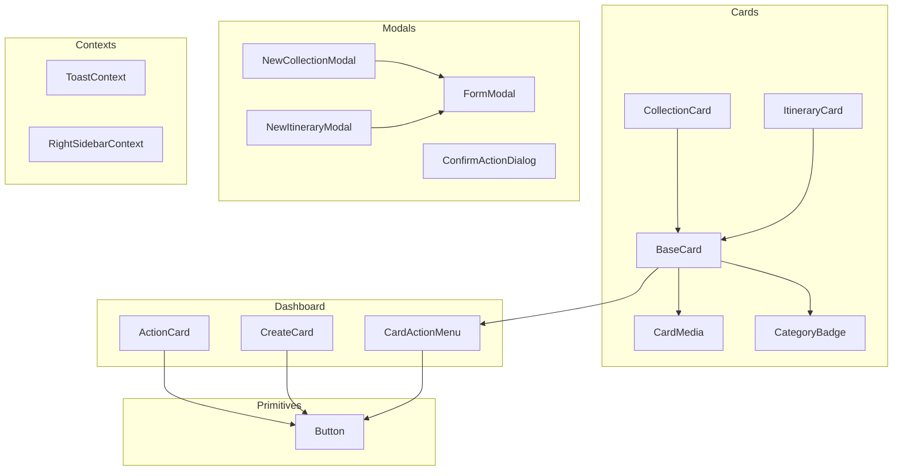
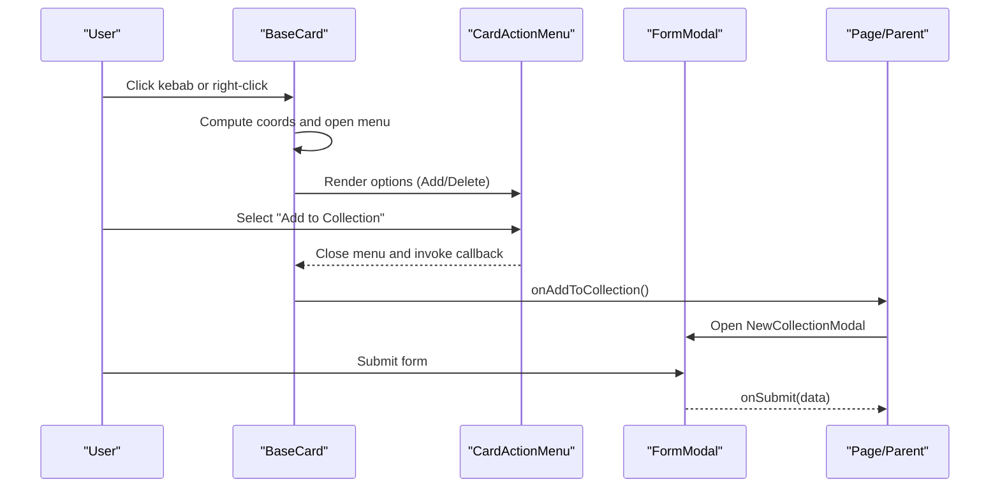
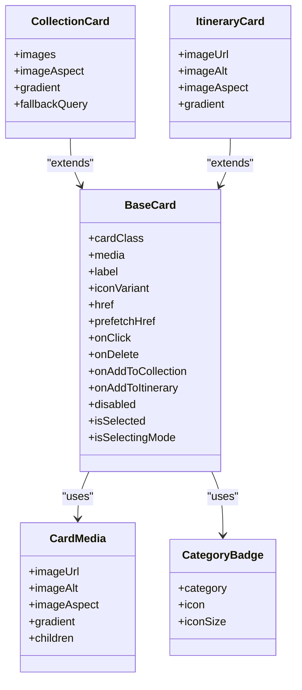
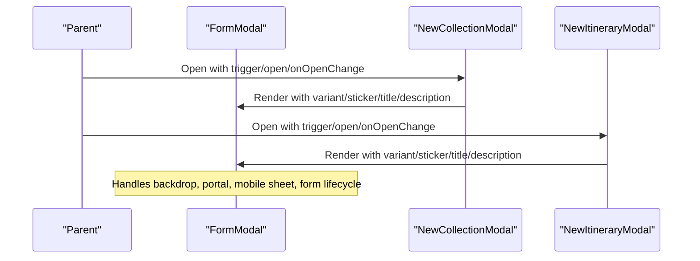
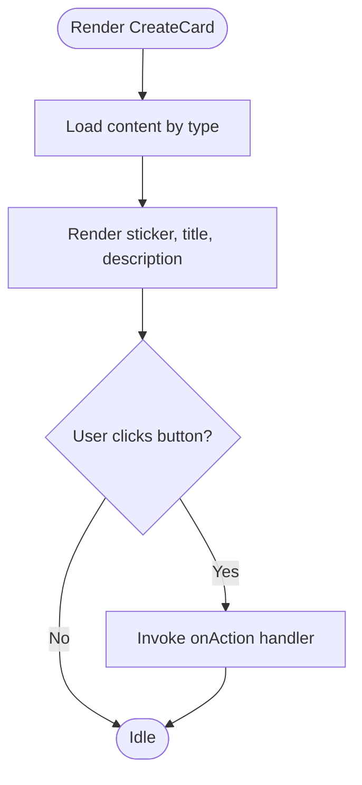
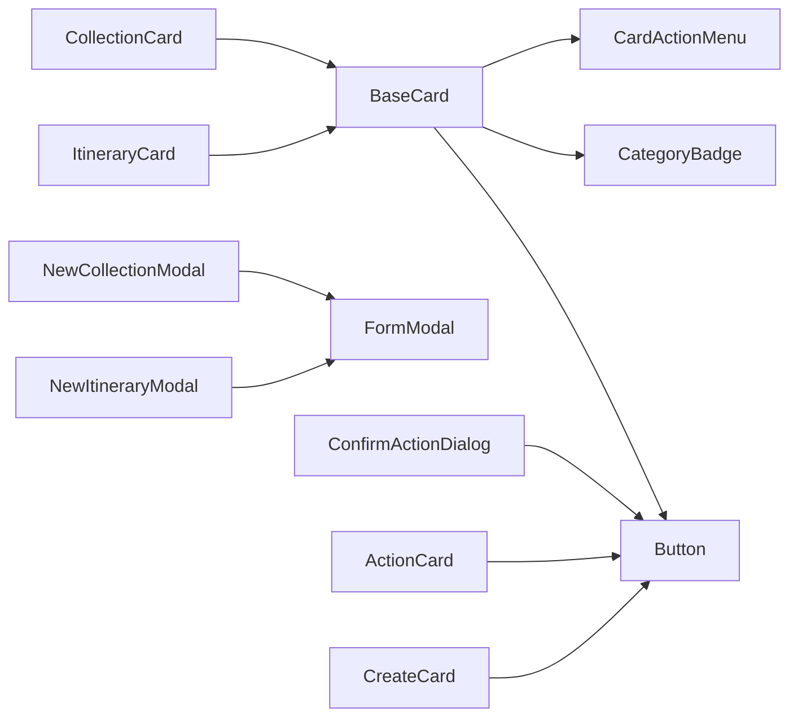

# Feature Components

<cite>
**Referenced Files in This Document**
- [BaseCard.tsx](file://src/components/ui/cards/BaseCard.tsx)
- [CollectionCard.tsx](file://src/components/ui/cards/CollectionCard.tsx)
- [ItineraryCard.tsx](file://src/components/ui/cards/ItineraryCard.tsx)
- [CardMedia.tsx](file://src/components/ui/cards/CardMedia.tsx)
- [ActionCard.tsx](file://src/components/ui/dashboard/ActionCard.tsx)
- [CreateCard.tsx](file://src/components/ui/dashboard/CreateCard.tsx)
- [CardActionMenu.tsx](file://src/components/ui/dashboard/CardActionMenu.tsx)
- [FormModal.tsx](file://src/components/ui/modals/FormModal.tsx)
- [NewCollectionModal.tsx](file://src/components/ui/modals/NewCollectionModal.tsx)
- [NewItineraryModal.tsx](file://src/components/ui/modals/NewItineraryModal.tsx)
- [ConfirmActionDialog.tsx](file://src/components/ui/modals/ConfirmActionDialog.tsx)
- [CategoryBadge.tsx](file://src/components/ui/primitives/CategoryBadge.tsx)
- [Button.tsx](file://src/components/ui/primitives/Button.tsx)
- [ToastContext.tsx](file://src/contexts/ToastContext.tsx)
- [RightSidebarContext.tsx](file://src/contexts/RightSidebarContext.tsx)
</cite>

## Table of Contents
1. Introduction
2. Project Structure
3. Core Components
4. Architecture Overview
5. Detailed Component Analysis
6. Dependency Analysis
7. Performance Considerations
8. Troubleshooting Guide
9. Conclusion

## Introduction
This document explains the feature-specific components that compose primitives into meaningful UI elements: the card system, modal system, and dashboard components. It covers composition strategies, prop drilling alternatives via context, styling approaches, responsive behavior, performance optimizations, and guidance for extending or creating new components following established patterns.

## Project Structure
The feature components are organized under src/components/ui with clear separation:
- Cards: BaseCard as the shared shell; specialized cards (CollectionCard, ItineraryCard) compose media and metadata.
- Dashboard: ActionCard and CreateCard provide action-oriented entry points; CardActionMenu supplies per-card actions.
- Modals: FormModal is a reusable form dialog; NewCollectionModal and NewItineraryModal implement domain flows; ConfirmActionDialog handles confirmations.
- Primitives: Button, CategoryBadge, etc., provide low-level building blocks.
- Contexts: ToastContext and RightSidebarContext provide cross-cutting state without prop drilling.

**Diagram sources**
- [BaseCard.tsx:57-207](file://src/components/ui/cards/BaseCard.tsx#L57-L207)
- [CollectionCard.tsx:79-108](file://src/components/ui/cards/CollectionCard.tsx#L79-L108)
- [ItineraryCard.tsx:30-49](file://src/components/ui/cards/ItineraryCard.tsx#L30-L49)
- [CardMedia.tsx:30-62](file://src/components/ui/cards/CardMedia.tsx#L30-L62)
- [CategoryBadge.tsx:88-113](file://src/components/ui/primitives/CategoryBadge.tsx#L88-L113)
- [ActionCard.tsx:36-95](file://src/components/ui/dashboard/ActionCard.tsx#L36-L95)
- [CreateCard.tsx:50-94](file://src/components/ui/dashboard/CreateCard.tsx#L50-L94)
- [CardActionMenu.tsx:52-113](file://src/components/ui/dashboard/CardActionMenu.tsx#L52-L113)
- [FormModal.tsx:78-217](file://src/components/ui/modals/FormModal.tsx#L78-L217)
- [NewCollectionModal.tsx:42-218](file://src/components/ui/modals/NewCollectionModal.tsx#L42-L218)
- [NewItineraryModal.tsx:45-278](file://src/components/ui/modals/NewItineraryModal.tsx#L45-L278)
- [ConfirmActionDialog.tsx:21-76](file://src/components/ui/modals/ConfirmActionDialog.tsx#L21-L76)
- [Button.tsx:76-128](file://src/components/ui/primitives/Button.tsx#L76-L128)
- [ToastContext.tsx:42-147](file://src/contexts/ToastContext.tsx#L42-L147)
- [RightSidebarContext.tsx:34-45](file://src/contexts/RightSidebarContext.tsx#L34-L45)

**Section sources**
- [BaseCard.tsx:57-207](file://src/components/ui/cards/BaseCard.tsx#L57-L207)
- [FormModal.tsx:78-217](file://src/components/ui/modals/FormModal.tsx#L78-L217)
- [ActionCard.tsx:36-95](file://src/components/ui/dashboard/ActionCard.tsx#L36-L95)

## Core Components
- BaseCard: Shared shell providing selection states, header with category badge, optional kebab menu, link vs button rendering, keyboard accessibility, hover/prefetch behaviors, and consistent styling.
- CollectionCard and ItineraryCard: Specialized cards that supply media (image grid or single image), aspect ratios, gradients, and labels to BaseCard.
- CardMedia: Centralized media slot handling images, gradients, placeholders, and custom children slots.
- ActionCard: Compact action tile with label, optional sticker, hover/focus states, and keyboard support.
- CreateCard: Promotional card driving create flows (link/collection/itinerary) with content-driven labels and stickers.
- CardActionMenu: Per-card contextual menu anchored by coordinates, offering Add to Collection, Add to Itinerary, and Delete.
- FormModal: Reusable dialog with icon/sticker area, title/description, form slot, cancel/submit buttons, mobile sheet mode, and submission states.
- NewCollectionModal and NewItineraryModal: Domain forms built on FormModal with validation, multi-step flow, and data aggregation.
- ConfirmActionDialog: Confirmation dialog with warning iconography and standard footer actions.
- Primitives: Button and CategoryBadge provide consistent interaction and visual identity.
- Contexts: ToastContext for global notifications; RightSidebarContext for sidebar presentation across breakpoints.

**Section sources**
- [BaseCard.tsx:20-50](file://src/components/ui/cards/BaseCard.tsx#L20-L50)
- [CollectionCard.tsx:57-77](file://src/components/ui/cards/CollectionCard.tsx#L57-L77)
- [ItineraryCard.tsx:8-28](file://src/components/ui/cards/ItineraryCard.tsx#L8-L28)
- [CardMedia.tsx:7-21](file://src/components/ui/cards/CardMedia.tsx#L7-L21)
- [ActionCard.tsx:23-34](file://src/components/ui/dashboard/ActionCard.tsx#L23-L34)
- [CreateCard.tsx:8-13](file://src/components/ui/dashboard/CreateCard.tsx#L8-L13)
- [CardActionMenu.tsx:10-18](file://src/components/ui/dashboard/CardActionMenu.tsx#L10-L18)
- [FormModal.tsx:50-76](file://src/components/ui/modals/FormModal.tsx#L50-L76)
- [NewCollectionModal.tsx:22-40](file://src/components/ui/modals/NewCollectionModal.tsx#L22-L40)
- [NewItineraryModal.tsx:16-43](file://src/components/ui/modals/NewItineraryModal.tsx#L16-L43)
- [ConfirmActionDialog.tsx:11-19](file://src/components/ui/modals/ConfirmActionDialog.tsx#L11-L19)
- [Button.tsx:9-42](file://src/components/ui/primitives/Button.tsx#L9-L42)
- [CategoryBadge.tsx:21-41](file://src/components/ui/primitives/CategoryBadge.tsx#L21-L41)
- [ToastContext.tsx:14-36](file://src/contexts/ToastContext.tsx#L14-L36)
- [RightSidebarContext.tsx:6-11](file://src/contexts/RightSidebarContext.tsx#L6-L11)

## Architecture Overview
The architecture follows a layered composition model:
- Primitives (Button, CategoryBadge) define base interactions and visuals.
- Feature shells (BaseCard, FormModal) encapsulate common layout, accessibility, and state.
- Specialized components (CollectionCard, ItineraryCard, NewCollectionModal, NewItineraryModal) compose primitives and shells with domain-specific logic.
- Contexts (ToastContext, RightSidebarContext) provide cross-cutting concerns without prop drilling.

**Diagram sources**
- [BaseCard.tsx:81-109](file://src/components/ui/cards/BaseCard.tsx#L81-L109)
- [CardActionMenu.tsx:52-113](file://src/components/ui/dashboard/CardActionMenu.tsx#L52-L113)
- [FormModal.tsx:124-213](file://src/components/ui/modals/FormModal.tsx#L124-L213)
- [NewCollectionModal.tsx:118-135](file://src/components/ui/modals/NewCollectionModal.tsx#L118-L135)

## Detailed Component Analysis

### Card System: BaseCard and Specialized Cards
BaseCard provides:
- Selection states (isSelected, isSelectingMode) with visual feedback.
- Header with CategoryBadge and label.
- Optional trailing kebab menu with coordinate-based anchoring.
- Link vs button rendering with prefetching and keyboard navigation.
- Consistent focus/hover/disabled states.

Specialized cards:
- CollectionCard composes a multi-image grid or fallback media via CardMedia.
- ItineraryCard composes single image or gradient media via CardMedia.

**Diagram sources**
- [BaseCard.tsx:20-50](file://src/components/ui/cards/BaseCard.tsx#L20-L50)
- [CollectionCard.tsx:57-77](file://src/components/ui/cards/CollectionCard.tsx#L57-L77)
- [ItineraryCard.tsx:8-28](file://src/components/ui/cards/ItineraryCard.tsx#L8-L28)
- [CardMedia.tsx:7-21](file://src/components/ui/cards/CardMedia.tsx#L7-L21)
- [CategoryBadge.tsx:79-86](file://src/components/ui/primitives/CategoryBadge.tsx#L79-L86)

**Section sources**
- [BaseCard.tsx:57-207](file://src/components/ui/cards/BaseCard.tsx#L57-L207)
- [CollectionCard.tsx:79-108](file://src/components/ui/cards/CollectionCard.tsx#L79-L108)
- [ItineraryCard.tsx:30-49](file://src/components/ui/cards/ItineraryCard.tsx#L30-L49)
- [CardMedia.tsx:30-62](file://src/components/ui/cards/CardMedia.tsx#L30-L62)
- [CategoryBadge.tsx:88-113](file://src/components/ui/primitives/CategoryBadge.tsx#L88-L113)

### Modal System: FormModal and Dialogs
FormModal offers:
- Icon/sticker area with variant-based theming.
- Title/description header.
- Content slot for forms.
- Cancel/Submit buttons with submitting state and disabled controls.
- Mobile sheet mode with safe-area padding and increased height for inputs.

Domain modals:
- NewCollectionModal: Name input, optional place, tag selection, and submit payload.
- NewItineraryModal: Two-step wizard with trip name/place, date range, AI toggle, and validation feedback.

Confirmation dialogs:
- ConfirmActionDialog: Warning iconography, content slot, and standard footer actions.

**Diagram sources**
- [FormModal.tsx:78-217](file://src/components/ui/modals/FormModal.tsx#L78-L217)
- [NewCollectionModal.tsx:137-218](file://src/components/ui/modals/NewCollectionModal.tsx#L137-L218)
- [NewItineraryModal.tsx:162-278](file://src/components/ui/modals/NewItineraryModal.tsx#L162-L278)

**Section sources**
- [FormModal.tsx:50-76](file://src/components/ui/modals/FormModal.tsx#L50-L76)
- [NewCollectionModal.tsx:42-218](file://src/components/ui/modals/NewCollectionModal.tsx#L42-L218)
- [NewItineraryModal.tsx:45-278](file://src/components/ui/modals/NewItineraryModal.tsx#L45-L278)
- [ConfirmActionDialog.tsx:21-76](file://src/components/ui/modals/ConfirmActionDialog.tsx#L21-L76)

### Dashboard Components: ActionCard and CreateCard
ActionCard:
- Label and optional sticker with hover/focus states.
- Keyboard accessible with Enter/Space activation.
- Uses Button variants for consistent interaction.

CreateCard:
- Content-driven configuration for link/collection/itinerary flows.
- Sticker, title, description, and primary action button.

**Diagram sources**
- [CreateCard.tsx:15-34](file://src/components/ui/dashboard/CreateCard.tsx#L15-L34)
- [CreateCard.tsx:50-94](file://src/components/ui/dashboard/CreateCard.tsx#L50-L94)
- [ActionCard.tsx:36-95](file://src/components/ui/dashboard/ActionCard.tsx#L36-L95)

**Section sources**
- [ActionCard.tsx:23-34](file://src/components/ui/dashboard/ActionCard.tsx#L23-L34)
- [CreateCard.tsx:8-13](file://src/components/ui/dashboard/CreateCard.tsx#L8-L13)
- [CreateCard.tsx:50-94](file://src/components/ui/dashboard/CreateCard.tsx#L50-L94)

### Context Usage Patterns and Prop Drilling Alternatives
- ToastContext: Provides showToast, removeToast, pause/resume, and remaining time tracking. Use this to surface global notifications from any component without passing callbacks down.
- RightSidebarContext: Supplies current sidebar node and presentation mode (inline vs overlay) based on breakpoint. Consumers can render sidebars consistently across layouts.

Best practices:
- Prefer contexts for cross-cutting concerns (toasts, sidebar, theme).
- Keep component props focused on local state and behavior.
- Avoid deep prop drilling by lifting state to providers where appropriate.

**Section sources**
- [ToastContext.tsx:42-147](file://src/contexts/ToastContext.tsx#L42-L147)
- [RightSidebarContext.tsx:34-45](file://src/contexts/RightSidebarContext.tsx#L34-L45)

## Dependency Analysis
Key dependencies and relationships:
- BaseCard depends on CardActionMenu, CategoryBadge, Button, and Next.js router/link utilities.
- CollectionCard and ItineraryCard depend on BaseCard and CardMedia.
- Modals depend on FormModal and primitives (Input, Calendar, PlaceAutocomplete).
- Dashboard components depend on Button and design tokens.
- Contexts are independent providers consumed by feature components.

**Diagram sources**
- [BaseCard.tsx:57-207](file://src/components/ui/cards/BaseCard.tsx#L57-L207)
- [CardActionMenu.tsx:52-113](file://src/components/ui/dashboard/CardActionMenu.tsx#L52-L113)
- [CategoryBadge.tsx:88-113](file://src/components/ui/primitives/CategoryBadge.tsx#L88-L113)
- [Button.tsx:76-128](file://src/components/ui/primitives/Button.tsx#L76-L128)
- [CollectionCard.tsx:79-108](file://src/components/ui/cards/CollectionCard.tsx#L79-L108)
- [ItineraryCard.tsx:30-49](file://src/components/ui/cards/ItineraryCard.tsx#L30-L49)
- [FormModal.tsx:78-217](file://src/components/ui/modals/FormModal.tsx#L78-L217)
- [NewCollectionModal.tsx:137-218](file://src/components/ui/modals/NewCollectionModal.tsx#L137-L218)
- [NewItineraryModal.tsx:162-278](file://src/components/ui/modals/NewItineraryModal.tsx#L162-L278)
- [ConfirmActionDialog.tsx:21-76](file://src/components/ui/modals/ConfirmActionDialog.tsx#L21-L76)
- [ActionCard.tsx:36-95](file://src/components/ui/dashboard/ActionCard.tsx#L36-L95)
- [CreateCard.tsx:50-94](file://src/components/ui/dashboard/CreateCard.tsx#L50-L94)

**Section sources**
- [BaseCard.tsx:57-207](file://src/components/ui/cards/BaseCard.tsx#L57-L207)
- [FormModal.tsx:78-217](file://src/components/ui/modals/FormModal.tsx#L78-L217)
- [Button.tsx:76-128](file://src/components/ui/primitives/Button.tsx#L76-L128)

## Performance Considerations
- Media handling: CardMedia uses error state to gracefully fall back to gradients or placeholders, preventing broken image layouts.
- Prefetching: BaseCard triggers route prefetch on hover when href is provided, improving perceived performance.
- Responsive modals: FormModal switches to sheet mode on phones, optimizing touch interactions and reducing layout shifts.
- Animation tokens: Consistent motion durations and easing reduce jank and improve perceived responsiveness.
- Context usage: Using ToastContext avoids re-renders caused by prop drilling for global notifications.

[No sources needed since this section provides general guidance]

## Troubleshooting Guide
Common issues and resolutions:
- Kebab menu not opening: Ensure BaseCard receives at least one action callback (onDelete, onAddToCollection, onAddToItinerary) to render the menu. Verify coords are set correctly when triggered via right-click.
- Form submission not closing modal: Ensure FormModal’s onSubmit is wired and isSubmitting toggles appropriately; verify cancelCloses behavior matches your workflow.
- Validation feedback: For NewItineraryModal, use shaking fields to highlight invalid inputs; ensure animation classes are available and cleared after animation ends.
- Toast not appearing: Confirm ToastProvider wraps the app tree and use useToast to call showToast; check duration and paused states if toasts disappear unexpectedly.
- Sidebar not rendering: Ensure RightSidebarProvider is present and setRightSidebar is called; presentation mode adapts to breakpoints automatically.

**Section sources**
- [BaseCard.tsx:81-109](file://src/components/ui/cards/BaseCard.tsx#L81-L109)
- [FormModal.tsx:124-213](file://src/components/ui/modals/FormModal.tsx#L124-L213)
- [NewItineraryModal.tsx:118-160](file://src/components/ui/modals/NewItineraryModal.tsx#L118-L160)
- [ToastContext.tsx:90-127](file://src/contexts/ToastContext.tsx#L90-L127)
- [RightSidebarContext.tsx:34-45](file://src/contexts/RightSidebarContext.tsx#L34-L45)

## Conclusion
The feature components follow a robust composition pattern: primitives form the foundation, feature shells encapsulate shared behavior, and specialized components deliver domain functionality. Contexts provide scalable state management without prop drilling. Styling leverages consistent tokens and responsive techniques, while performance considerations like media fallbacks and prefetching enhance user experience. Extending or creating new components should adhere to these patterns: compose primitives, leverage shared shells, manage state locally or via contexts, and maintain accessibility and responsiveness.

[No sources needed since this section summarizes without analyzing specific files]