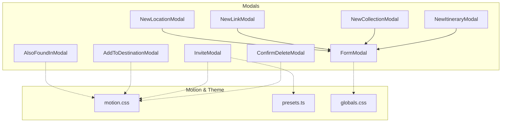
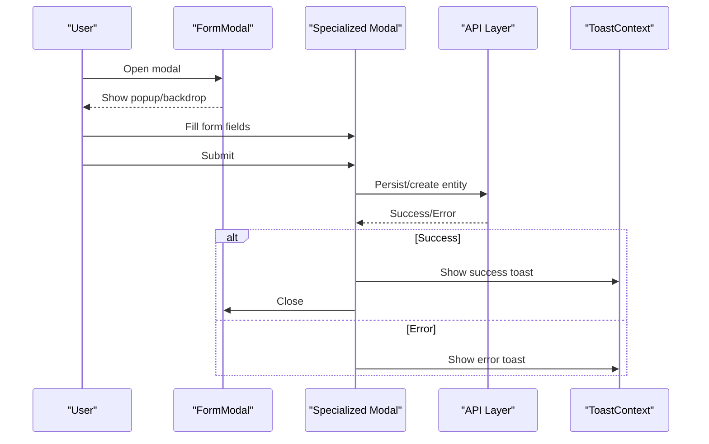
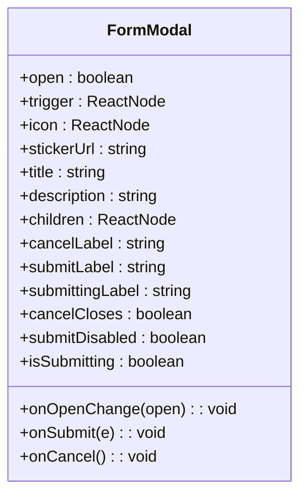
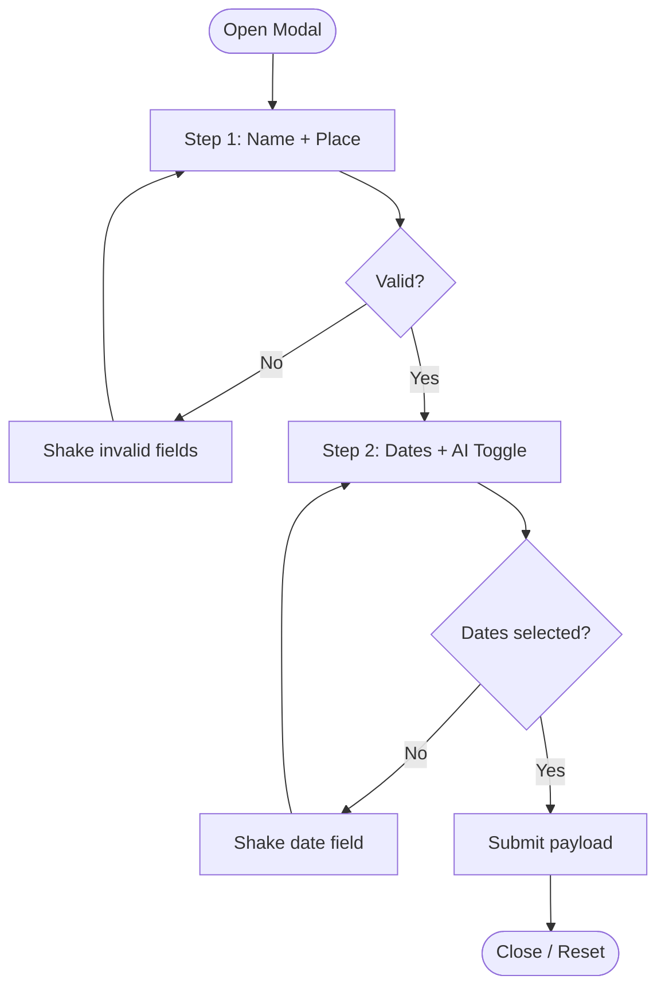
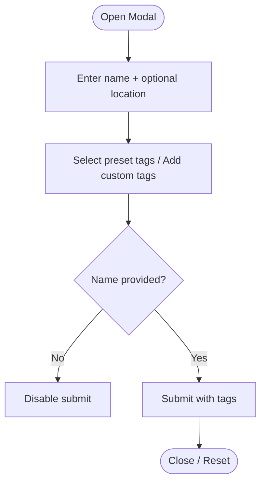
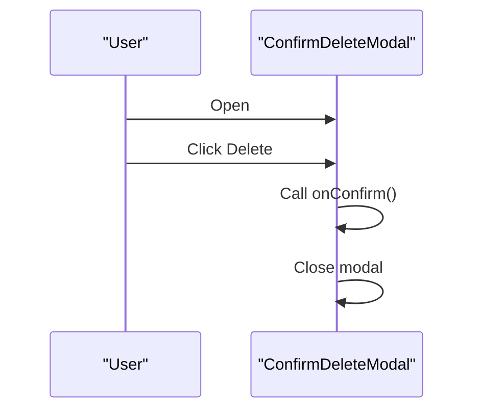
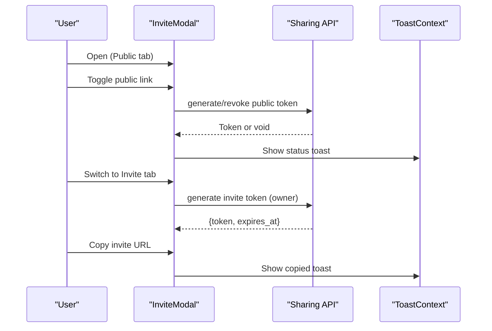
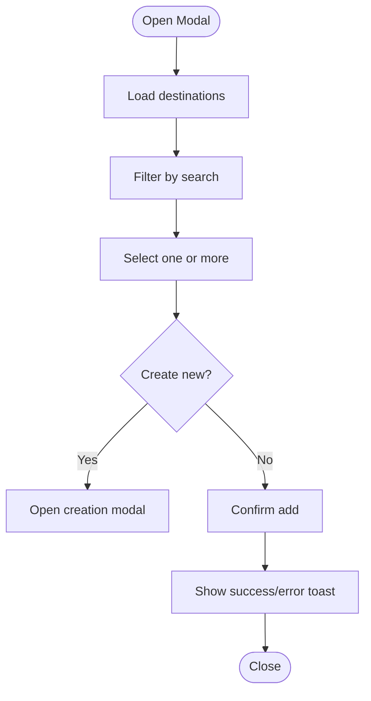
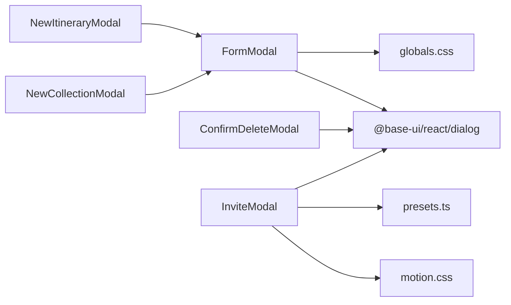

# Modal System

<cite>
**Referenced Files in This Document**
- [FormModal.tsx](file://src/components/ui/modals/FormModal.tsx)
- [NewItineraryModal.tsx](file://src/components/ui/modals/NewItineraryModal.tsx)
- [NewCollectionModal.tsx](file://src/components/ui/modals/NewCollectionModal.tsx)
- [ConfirmDeleteModal.tsx](file://src/components/ui/modals/ConfirmDeleteModal.tsx)
- [InviteModal.tsx](file://src/components/ui/modals/InviteModal.tsx)
- [AddToDestinationModal.tsx](file://src/components/ui/modals/AddToDestinationModal.tsx)
- [AlsoFoundInModal.tsx](file://src/components/ui/modals/AlsoFoundInModal.tsx)
- [NewLinkModal.tsx](file://src/components/ui/modals/NewLinkModal.tsx)
- [NewLocationModal.tsx](file://src/components/ui/modals/NewLocationModal.tsx)
- [useModalAnimation.ts](file://src/hooks/useModalAnimation.ts)
- [motion.css](file://src/styles/tokens/motion.css)
- [presets.ts](file://src/lib/motion/presets.ts)
- [globals.css](file://src/app/globals.css)
</cite>

## Table of Contents
1. Introduction
2. Project Structure
3. Core Components
4. Architecture Overview
5. Detailed Component Analysis
6. Dependency Analysis
7. Performance Considerations
8. Troubleshooting Guide
9. Conclusion
10. Appendices

## Introduction
This document explains the modal system that provides consistent dialog experiences across the application. It focuses on FormModal as the base component for lifecycle, animations, and form integration, and documents specialized modals: NewItineraryModal, NewCollectionModal, ConfirmDeleteModal, and InviteModal. It also covers composition patterns, prop interfaces, event handling, state management, animation configuration, focus management, keyboard navigation, accessibility, and guidance for creating new modals.

## Project Structure
The modal system is implemented under src/components/ui/modals with a clear separation between:
- Base form modal (FormModal)
- Specialized modals for domain tasks (itinerary, collection, delete confirmation, sharing)
- Utility modals for cross-cutting flows (add-to-destination, also-found-in)
- Animation tokens and presets shared by modals

**Diagram sources**
- [FormModal.tsx:1-224](file://src/components/ui/modals/FormModal.tsx#L1-L224)
- [NewItineraryModal.tsx:1-286](file://src/components/ui/modals/NewItineraryModal.tsx#L1-L286)
- [NewCollectionModal.tsx:1-226](file://src/components/ui/modals/NewCollectionModal.tsx#L1-L226)
- [ConfirmDeleteModal.tsx:1-107](file://src/components/ui/modals/ConfirmDeleteModal.tsx#L1-L107)
- [InviteModal.tsx:1-789](file://src/components/ui/modals/InviteModal.tsx#L1-L789)
- [AddToDestinationModal.tsx:1-343](file://src/components/ui/modals/AddToDestinationModal.tsx#L1-L343)
- [AlsoFoundInModal.tsx:1-134](file://src/components/ui/modals/AlsoFoundInModal.tsx#L1-L134)
- [NewLinkModal.tsx:1-136](file://src/components/ui/modals/NewLinkModal.tsx#L1-L136)
- [NewLocationModal.tsx:1-99](file://src/components/ui/modals/NewLocationModal.tsx#L1-L99)
- [motion.css:1-219](file://src/styles/tokens/motion.css#L1-L219)
- [presets.ts:1-63](file://src/lib/motion/presets.ts#L1-L63)
- [globals.css:1-800](file://src/app/globals.css#L1-L800)

**Section sources**
- [FormModal.tsx:1-224](file://src/components/ui/modals/FormModal.tsx#L1-L224)
- [motion.css:1-219](file://src/styles/tokens/motion.css#L1-L219)
- [presets.ts:1-63](file://src/lib/motion/presets.ts#L1-L63)
- [globals.css:1-800](file://src/app/globals.css#L1-L800)

## Core Components
- FormModal: Base form-driven modal providing portal, backdrop, popup, title/description, content slot, cancel/submit buttons, variant-based icon treatment, mobile sheet behavior, and submission states.
- NewItineraryModal: Two-step wizard to create an itinerary with trip name, region selection, date range, and AI recommendations toggle.
- NewCollectionModal: Create a collection with name, optional location, and tags (preset + custom).
- ConfirmDeleteModal: Confirmation dialog for destructive actions with collaborator-aware messaging.
- InviteModal: Sharing dialog with public link and invite link tabs, collaborator list, token generation/revoke, copy-to-clipboard, and inline/dialog render modes.

Key responsibilities:
- Lifecycle: open/onOpenChange, controlled visibility, reset on close where appropriate.
- Forms: Controlled/uncontrolled inputs, validation, submit flow, submitting state.
- Accessibility: Dialog primitives, titles, descriptions, labels, aria attributes, focus management via primitives.
- Animations: CSS transitions keyed by data-[starting-style]/data-[ending-style], motion tokens, reduced-motion support.

**Section sources**
- [FormModal.tsx:50-224](file://src/components/ui/modals/FormModal.tsx#L50-L224)
- [NewItineraryModal.tsx:16-286](file://src/components/ui/modals/NewItineraryModal.tsx#L16-L286)
- [NewCollectionModal.tsx:22-226](file://src/components/ui/modals/NewCollectionModal.tsx#L22-L226)
- [ConfirmDeleteModal.tsx:9-107](file://src/components/ui/modals/ConfirmDeleteModal.tsx#L9-L107)
- [InviteModal.tsx:55-537](file://src/components/ui/modals/InviteModal.tsx#L55-L537)

## Architecture Overview
The modal system composes a small set of primitives from @base-ui/react/dialog with Tailwind classes and shared motion tokens. FormModal encapsulates common UI and behavior; specialized modals extend it or build their own dialogs for complex flows.

**Diagram sources**
- [FormModal.tsx:100-216](file://src/components/ui/modals/FormModal.tsx#L100-L216)
- [NewItineraryModal.tsx:118-160](file://src/components/ui/modals/NewItineraryModal.tsx#L118-L160)
- [NewCollectionModal.tsx:118-135](file://src/components/ui/modals/NewCollectionModal.tsx#L118-L135)
- [InviteModal.tsx:194-231](file://src/components/ui/modals/InviteModal.tsx#L194-L231)

## Detailed Component Analysis

### FormModal
- Purpose: Reusable form modal with consistent layout, variants, and submission UX.
- Props: open/onOpenChange, trigger, icon/stickerUrl, title, description, children (content slot), cancelLabel/submitLabel/submittingLabel, onSubmit/onCancel, cancelCloses, submitDisabled, isSubmitting.
- Behavior:
  - Uses Dialog.Root/Portal/Backdrop/Popup for structure and accessibility.
  - Mobile sheet mode when on phone viewport; desktop centered popup otherwise.
  - Variant-based icon ring/circle colors for category branding.
  - Submit button shows spinner and disabled state during submission.
  - Cancel can close or act as Back depending on cancelCloses.
- Accessibility:
  - Dialog primitives provide focus trapping and role semantics.
  - Title/Description exposed via Dialog.Title/Dialog.Description.
  - Buttons use semantic types and disable during submission.

**Diagram sources**
- [FormModal.tsx:50-97](file://src/components/ui/modals/FormModal.tsx#L50-L97)

**Section sources**
- [FormModal.tsx:1-224](file://src/components/ui/modals/FormModal.tsx#L1-L224)

### NewItineraryModal
- Purpose: Two-step wizard to create an itinerary with trip name, region, dates, and AI recommendations.
- State: page (step), selectedPlace, dateRange, aiRecommendations, shakingFields for validation feedback, isSubmitting, submittedRef to distinguish close-after-submit vs abandonment.
- Validation:
  - Step 1 requires trip name and place selection; invalid fields shake.
  - Step 2 requires date range; invalid field shakes.
- Data flow:
  - On submit, emits structured payload including tripName, location details, startDate/endDate, totalDays, aiRecommendations, selectedLocationIds.
- Composition: Wraps FormModal with variant="itinerary" and sticker asset.

**Diagram sources**
- [NewItineraryModal.tsx:59-160](file://src/components/ui/modals/NewItineraryModal.tsx#L59-L160)

**Section sources**
- [NewItineraryModal.tsx:16-286](file://src/components/ui/modals/NewItineraryModal.tsx#L16-L286)

### NewCollectionModal
- Purpose: Create a collection with name, optional location, and tags (preset + custom).
- State: selectedPlace, selectedTags, customTags, isAddingTag/newTagValue, isSubmitting.
- Tagging:
  - Preset tags are toggled; custom tags can be added and removed.
  - Keyboard support: Enter to add tag, Escape to cancel adding.
- Submission: Emits name, optional location coordinates, and tags array if any.

**Diagram sources**
- [NewCollectionModal.tsx:54-135](file://src/components/ui/modals/NewCollectionModal.tsx#L54-L135)

**Section sources**
- [NewCollectionModal.tsx:22-226](file://src/components/ui/modals/NewCollectionModal.tsx#L22-L226)

### ConfirmDeleteModal
- Purpose: Destructive confirmation dialog with contextual messaging based on collaborator count.
- Behavior:
  - Shows warning icon when collaborators exist.
  - Provides Cancel and Delete actions; Delete calls onConfirm and closes.
- Styling: Uses Dialog primitives with transition classes for entrance/exit.

**Diagram sources**
- [ConfirmDeleteModal.tsx:18-107](file://src/components/ui/modals/ConfirmDeleteModal.tsx#L18-L107)

**Section sources**
- [ConfirmDeleteModal.tsx:9-107](file://src/components/ui/modals/ConfirmDeleteModal.tsx#L9-L107)

### InviteModal
- Purpose: Share an entity (itinerary or collection) via public link and invite link; manage collaborators.
- Modes: Dialog or inline rendering; supports initial tab control.
- Public link:
  - Toggle generates/revoke public token; displays URL; copy to clipboard with feedback.
- Invite link:
  - Auto-generates invite token when owner views Invite tab; shows expiry countdown; revoke available to owners.
- Collaborators:
  - Fetches list on open; remove collaborator action with loading state.
- Animations:
  - Tab panel transitions with motion; respects prefers-reduced-motion.
- Integration:
  - Injects API functions per entity type; exposes onSharingChange callback to sync parent state.

**Diagram sources**
- [InviteModal.tsx:194-231](file://src/components/ui/modals/InviteModal.tsx#L194-L231)
- [InviteModal.tsx:246-270](file://src/components/ui/modals/InviteModal.tsx#L246-L270)
- [InviteModal.tsx:272-283](file://src/components/ui/modals/InviteModal.tsx#L272-L283)

**Section sources**
- [InviteModal.tsx:55-537](file://src/components/ui/modals/InviteModal.tsx#L55-L537)

### AddToDestinationModal
- Purpose: Select existing collections or itineraries to add locations to; supports creating new items inline.
- Behavior:
  - Fetches destinations based on mode; search filtering; multi-select with visual indicators.
  - Creates new collection/itinerary by launching nested NewCollectionModal/NewItineraryModal.
  - Confirms addition with Promise.allSettled and toast feedback.

**Diagram sources**
- [AddToDestinationModal.tsx:72-156](file://src/components/ui/modals/AddToDestinationModal.tsx#L72-L156)

**Section sources**
- [AddToDestinationModal.tsx:35-313](file://src/components/ui/modals/AddToDestinationModal.tsx#L35-L313)

### AlsoFoundInModal
- Purpose: Display other collections/itineraries containing the current location.
- Behavior:
  - Header card with location info; list of references with loading/empty states; close action.

**Section sources**
- [AlsoFoundInModal.tsx:12-134](file://src/components/ui/modals/AlsoFoundInModal.tsx#L12-L134)

### NewLinkModal and NewLocationModal
- NewLinkModal: Adds a link with URL validation and friendly error messages; uses FormModal with variant="link".
- NewLocationModal: Adds a Google Maps share link with format validation; uses FormModal with variant="location".

**Section sources**
- [NewLinkModal.tsx:12-136](file://src/components/ui/modals/NewLinkModal.tsx#L12-L136)
- [NewLocationModal.tsx:11-99](file://src/components/ui/modals/NewLocationModal.tsx#L11-L99)

## Dependency Analysis
- Dialog primitives: All modals rely on @base-ui/react/dialog for accessible overlay behavior, focus management, and keyboard interactions.
- Motion: Shared CSS transitions and keyframes define modal entrance/exit and field validation animations; motion presets used for tab panel transitions in InviteModal.
- Theme: Semantic tokens and categories drive colors and typography consistently across modals.

**Diagram sources**
- [FormModal.tsx:1-224](file://src/components/ui/modals/FormModal.tsx#L1-L224)
- [InviteModal.tsx:1-789](file://src/components/ui/modals/InviteModal.tsx#L1-L789)
- [motion.css:1-219](file://src/styles/tokens/motion.css#L1-L219)
- [presets.ts:1-63](file://src/lib/motion/presets.ts#L1-L63)
- [globals.css:1-800](file://src/app/globals.css#L1-L800)

**Section sources**
- [FormModal.tsx:1-224](file://src/components/ui/modals/FormModal.tsx#L1-L224)
- [InviteModal.tsx:1-789](file://src/components/ui/modals/InviteModal.tsx#L1-L789)
- [motion.css:1-219](file://src/styles/tokens/motion.css#L1-L219)
- [presets.ts:1-63](file://src/lib/motion/presets.ts#L1-L63)
- [globals.css:1-800](file://src/app/globals.css#L1-L800)

## Performance Considerations
- Use controlled open state to avoid unnecessary re-renders; reset internal state on close where applicable (e.g., NewItineraryModal resets step and selections).
- Debounce or throttle heavy operations like fetching collaborators or destinations; already present in modals via loading states.
- Prefer CSS transitions for simple animations; reserve JS motion for complex choreography (e.g., tab panels).
- Respect prefers-reduced-motion to minimize jank for sensitive users.

[No sources needed since this section provides general guidance]

## Troubleshooting Guide
- Modal not closing after submit: Ensure onOpenChange(false) is called after successful submission; verify submittedRef usage in wizards to prevent accidental resets.
- Validation feedback not visible: Check that shaking fields are applied conditionally and animations are enabled; ensure no conflicting styles override motion tokens.
- Invite link not generating: Confirm user role is owner; check API injection and error handling paths; verify onSharingChange updates parent state.
- Copy to clipboard fails: Handle browser permissions; show user-friendly errors via toast.

**Section sources**
- [NewItineraryModal.tsx:104-160](file://src/components/ui/modals/NewItineraryModal.tsx#L104-L160)
- [InviteModal.tsx:194-231](file://src/components/ui/modals/InviteModal.tsx#L194-L231)
- [InviteModal.tsx:272-283](file://src/components/ui/modals/InviteModal.tsx#L272-L283)

## Conclusion
The modal system provides a robust foundation for consistent, accessible, and animated dialog experiences. FormModal standardizes form-driven modals, while specialized modals handle domain-specific workflows. The shared motion tokens and theme ensure cohesive visuals and performance. Following the patterns outlined here will help maintain consistency and scalability as new modals are introduced.

[No sources needed since this section summarizes without analyzing specific files]

## Appendices

### Creating a New Modal: Best Practices
- Choose base:
  - Use FormModal for simple forms with title, description, and submit/cancel.
  - Build custom Dialog for complex flows (e.g., InviteModal, ConfirmDeleteModal).
- Control visibility:
  - Manage open/onOpenChange at the caller; reset internal state on close.
- Form handling:
  - Provide controlled or uncontrolled inputs; validate before submit; show submitting state.
- Accessibility:
  - Use Dialog primitives; expose titles, descriptions, and labels; ensure keyboard navigation works out of the box.
- Animations:
  - Rely on CSS transitions for entrance/exit; use motion presets only when necessary.
- Integration:
  - Emit events or callbacks to parent for data changes; use toast for user feedback.

**Section sources**
- [FormModal.tsx:50-224](file://src/components/ui/modals/FormModal.tsx#L50-L224)
- [InviteModal.tsx:55-537](file://src/components/ui/modals/InviteModal.tsx#L55-L537)
- [motion.css:1-219](file://src/styles/tokens/motion.css#L1-L219)
- [presets.ts:1-63](file://src/lib/motion/presets.ts#L1-L63)