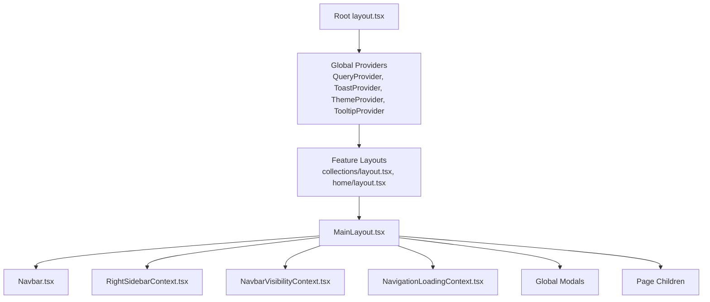
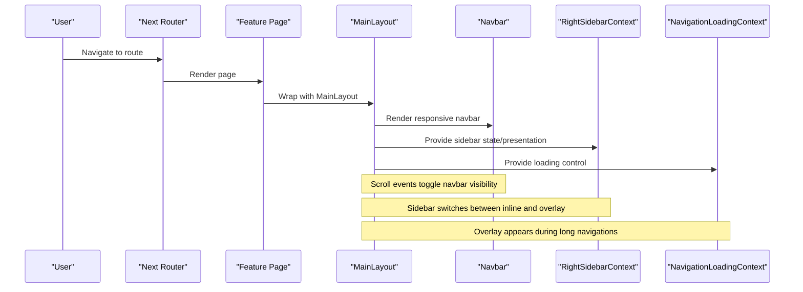
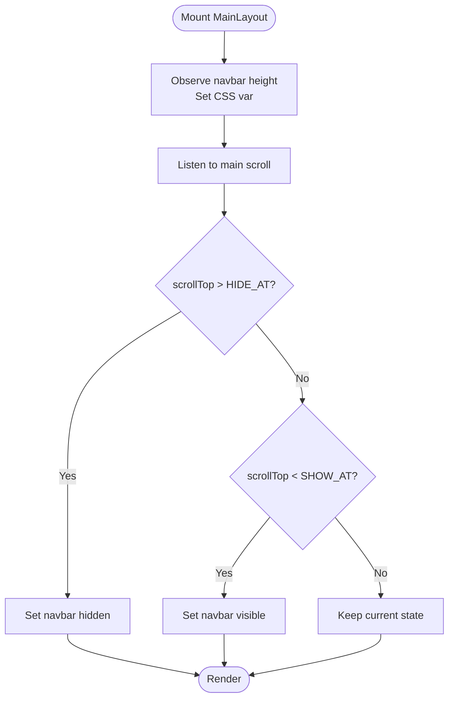
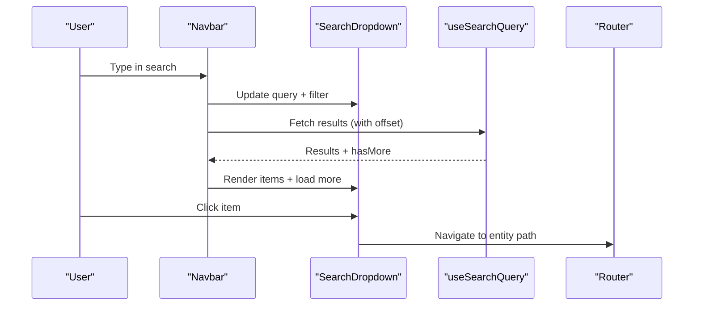
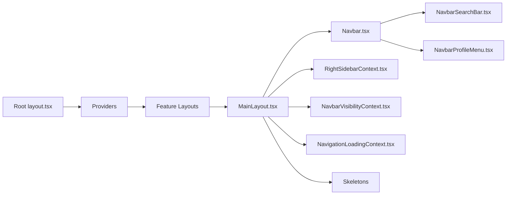

# Layout Components

<cite>
**Referenced Files in This Document**
- [MainLayout.tsx](file://src/components/ui/layout/MainLayout.tsx)
- [Root layout.tsx](file://src/app/layout.tsx)
- [Collections layout.tsx](file://src/app/collections/layout.tsx)
- [Home layout.tsx](file://src/app/home/layout.tsx)
- [Navbar.tsx](file://src/components/ui/navbar/Navbar.tsx)
- [NavbarSearchBar.tsx](file://src/components/ui/navbar/NavbarSearchBar.tsx)
- [NavbarProfileMenu.tsx](file://src/components/ui/navbar/NavbarProfileMenu.tsx)
- [CardGridSkeleton.tsx](file://src/components/ui/skeletons/CardGridSkeleton.tsx)
- [FilterToolbarSkeleton.tsx](file://src/components/ui/skeletons/FilterToolbarSkeleton.tsx)
- [RightSidebarContext.tsx](file://src/contexts/RightSidebarContext.tsx)
- [NavbarVisibilityContext.tsx](file://src/contexts/NavbarVisibilityContext.tsx)
- [NavigationLoadingContext.tsx](file://src/contexts/NavigationLoadingContext.tsx)
</cite>

## Table of Contents
1. Introduction
2. Project Structure
3. Core Components
4. Architecture Overview
5. Detailed Component Analysis
6. Dependency Analysis
7. Performance Considerations
8. Troubleshooting Guide
9. Conclusion
10. Appendices

## Introduction
This document explains the layout component architecture that provides structural organization for the application. It focuses on how MainLayout composes global UI, manages navigation and page structure, integrates a responsive navbar with search and user menu, and renders skeleton loading states to improve perceived performance. It also documents routing integration patterns, context providers setup, and strategies for building custom layouts within this system.

## Project Structure
The layout system is built around:
- A root app layout that sets up global providers (theme, queries, toasts, tooltips).
- Feature-level Next.js layouts that wrap pages with MainLayout.
- MainLayout as the central orchestrator for navbar visibility, right sidebar presentation, modals, and navigation loading overlays.
- A rich Navbar with responsive behavior, search overlay, filters, and profile actions.
- Skeleton components used by list/detail views during data fetching.
- Contexts for cross-cutting concerns like right sidebar state, navbar visibility, and navigation loading.

**Diagram sources**
- [Root layout.tsx:57-83](file://src/app/layout.tsx#L57-L83)
- [Collections layout.tsx:5-11](file://src/app/collections/layout.tsx#L5-L11)
- [Home layout.tsx:5-11](file://src/app/home/layout.tsx#L5-L11)
- [MainLayout.tsx:386-396](file://src/components/ui/layout/MainLayout.tsx#L386-L396)
- [Navbar.tsx:326-533](file://src/components/ui/navbar/Navbar.tsx#L326-L533)
- [RightSidebarContext.tsx:34-46](file://src/contexts/RightSidebarContext.tsx#L34-L46)
- [NavbarVisibilityContext.tsx:11-23](file://src/contexts/NavbarVisibilityContext.tsx#L11-L23)
- [NavigationLoadingContext.tsx:20-42](file://src/contexts/NavigationLoadingContext.tsx#L20-L42)

**Section sources**
- [Root layout.tsx:57-83](file://src/app/layout.tsx#L57-L83)
- [Collections layout.tsx:5-11](file://src/app/collections/layout.tsx#L5-L11)
- [Home layout.tsx:5-11](file://src/app/home/layout.tsx#L5-L11)

## Core Components
- MainLayout: Orchestrates global UI, navbar visibility, right sidebar, modals, and navigation loading overlay. It wraps children with necessary contexts and exposes hooks for child components to interact with shared state.
- Navbar: Responsive header with logo, tabs, search overlay, filter pills, create actions, notifications, and profile menu.
- Skeletons: Lightweight placeholders for lists and toolbars to reduce perceived latency during data fetches.
- Contexts: Provide cross-cutting state for right sidebar presentation, navbar visibility, and navigation loading.

Key responsibilities:
- Maintain a consistent shell across feature routes.
- Manage responsive behaviors (e.g., inline vs overlay sidebar).
- Centralize global modals and toast interactions.
- Provide predictable loading experiences via skeletons and navigation overlays.

**Section sources**
- [MainLayout.tsx:33-396](file://src/components/ui/layout/MainLayout.tsx#L33-L396)
- [Navbar.tsx:36-538](file://src/components/ui/navbar/Navbar.tsx#L36-L538)
- [CardGridSkeleton.tsx:1-23](file://src/components/ui/skeletons/CardGridSkeleton.tsx#L1-L23)
- [FilterToolbarSkeleton.tsx:1-31](file://src/components/ui/skeletons/FilterToolbarSkeleton.tsx#L1-L31)
- [RightSidebarContext.tsx:6-46](file://src/contexts/RightSidebarContext.tsx#L6-L46)
- [NavbarVisibilityContext.tsx:5-27](file://src/contexts/NavbarVisibilityContext.tsx#L5-L27)
- [NavigationLoadingContext.tsx:5-48](file://src/contexts/NavigationLoadingContext.tsx#L5-L48)

## Architecture Overview
The layout architecture follows a layered approach:
- Root layout sets up global providers and metadata.
- Feature layouts opt into MainLayout to get consistent chrome.
- MainLayout composes:
  - Navbar with responsive behavior and search overlay.
  - Page content area with scroll-driven navbar hide/show.
  - Right sidebar rendered inline at larger breakpoints or as an overlay sheet below lg.
  - Global modals for creating links, collections, and itineraries.
  - Navigation loading overlay controlled via context.

**Diagram sources**
- [MainLayout.tsx:49-91](file://src/components/ui/layout/MainLayout.tsx#L49-L91)
- [MainLayout.tsx:299-342](file://src/components/ui/layout/MainLayout.tsx#L299-L342)
- [MainLayout.tsx:371-376](file://src/components/ui/layout/MainLayout.tsx#L371-L376)
- [Navbar.tsx:127-130](file://src/components/ui/navbar/Navbar.tsx#L127-L130)
- [RightSidebarContext.tsx:34-46](file://src/contexts/RightSidebarContext.tsx#L34-L46)
- [NavigationLoadingContext.tsx:20-42](file://src/contexts/NavigationLoadingContext.tsx#L20-L42)

## Detailed Component Analysis

### MainLayout
MainLayout is the central layout component that:
- Wraps children with providers for navigation loading, navbar filters, and right sidebar.
- Observes navbar height and exposes it via CSS variable for consistent spacing.
- Implements position-based hysteresis to hide/show the navbar on scroll without flicker.
- Manages global modals for creating links, collections, and itineraries.
- Renders the right sidebar either inline (desktop) or as a sheet (mobile/tablet).
- Shows a full-screen navigation loading overlay when needed.

Key implementation highlights:
- Scroll observer toggles navbar hidden state based on thresholds to avoid jitter.
- Uses motion for smooth transitions and respects reduced motion preferences.
- Integrates Supabase auth to resolve user profile and avatar.
- Invalidates query cache and dispatches custom events to update other parts of the app after mutations.

**Diagram sources**
- [MainLayout.tsx:49-91](file://src/components/ui/layout/MainLayout.tsx#L49-L91)

**Section sources**
- [MainLayout.tsx:33-396](file://src/components/ui/layout/MainLayout.tsx#L33-L396)

### Navbar
The Navbar provides:
- Logo and navigation tabs.
- Search bar with active state, placeholder truncation, clear button, and scan action.
- Filter pill support to scope searches to specific entities or types.
- Create actions for links, collections, and itineraries via a dropdown.
- Notifications and profile menu with sign-out.
- A full-page search overlay portaled to body for better stacking and positioning.

Responsive behavior:
- Desktop: horizontal layout with centered search anchor and right-aligned actions.
- Mobile/Tablet: compact layout with hamburger menu containing create actions, notifications, billing, and sign out.

Search flow:
- Debounced input triggers search queries with pagination offset.
- Results are accumulated and filtered based on active filters.
- Selecting a result navigates to the appropriate entity page; location results can highlight within a parent entity.

**Diagram sources**
- [Navbar.tsx:127-130](file://src/components/ui/navbar/Navbar.tsx#L127-L130)
- [Navbar.tsx:132-184](file://src/components/ui/navbar/Navbar.tsx#L132-L184)
- [Navbar.tsx:221-235](file://src/components/ui/navbar/Navbar.tsx#L221-L235)
- [Navbar.tsx:237-324](file://src/components/ui/navbar/Navbar.tsx#L237-L324)

**Section sources**
- [Navbar.tsx:36-538](file://src/components/ui/navbar/Navbar.tsx#L36-L538)
- [NavbarSearchBar.tsx:15-203](file://src/components/ui/navbar/NavbarSearchBar.tsx#L15-L203)
- [NavbarProfileMenu.tsx:17-71](file://src/components/ui/navbar/NavbarProfileMenu.tsx#L17-L71)

### Skeleton Loading Components
Skeletons provide lightweight placeholders to improve perceived performance:
- CardGridSkeleton: Renders a grid of pulsing cards with configurable count and height.
- FilterToolbarSkeleton: Renders a toolbar with placeholder pills and action buttons.

Usage guidance:
- Show skeletons while initial data loads or when paginating.
- Match skeleton dimensions to actual content to minimize layout shifts.
- Use Tailwind’s animate-pulse for subtle motion.

**Section sources**
- [CardGridSkeleton.tsx:1-23](file://src/components/ui/skeletons/CardGridSkeleton.tsx#L1-L23)
- [FilterToolbarSkeleton.tsx:1-31](file://src/components/ui/skeletons/FilterToolbarSkeleton.tsx#L1-L31)

### Routing Integration Patterns
- Feature layouts (e.g., collections, home) wrap their pages with MainLayout to inherit global chrome.
- The root layout sets global providers and metadata once, ensuring consistent behavior across all routes.
- Navigation loading overlay can be triggered from anywhere using the navigation loading context to indicate long-running operations.

Example pattern:
- Wrap any feature route with MainLayout to gain consistent navbar, sidebar, and modals.
- Use navigation loading context to show a full-screen overlay during heavy operations.

**Section sources**
- [Collections layout.tsx:5-11](file://src/app/collections/layout.tsx#L5-L11)
- [Home layout.tsx:5-11](file://src/app/home/layout.tsx#L5-L11)
- [Root layout.tsx:57-83](file://src/app/layout.tsx#L57-L83)
- [NavigationLoadingContext.tsx:20-42](file://src/contexts/NavigationLoadingContext.tsx#L20-L42)

### Context Providers Setup
- RightSidebarContext: Provides right sidebar node and presentation mode (inline vs overlay) based on breakpoint.
- NavbarVisibilityContext: Allows child components to trigger navbar hide/show programmatically.
- NavigationLoadingContext: Controls a global loading overlay with optional title/subtitle.

These contexts enable decoupled communication between layout and page components.

**Section sources**
- [RightSidebarContext.tsx:6-46](file://src/contexts/RightSidebarContext.tsx#L6-L46)
- [NavbarVisibilityContext.tsx:5-27](file://src/contexts/NavbarVisibilityContext.tsx#L5-L27)
- [NavigationLoadingContext.tsx:5-48](file://src/contexts/NavigationLoadingContext.tsx#L5-L48)

## Dependency Analysis
High-level dependencies among layout-related modules:

**Diagram sources**
- [Root layout.tsx:57-83](file://src/app/layout.tsx#L57-L83)
- [MainLayout.tsx:386-396](file://src/components/ui/layout/MainLayout.tsx#L386-L396)
- [Navbar.tsx:326-533](file://src/components/ui/navbar/Navbar.tsx#L326-L533)
- [NavbarSearchBar.tsx:15-203](file://src/components/ui/navbar/NavbarSearchBar.tsx#L15-L203)
- [NavbarProfileMenu.tsx:17-71](file://src/components/ui/navbar/NavbarProfileMenu.tsx#L17-L71)
- [RightSidebarContext.tsx:34-46](file://src/contexts/RightSidebarContext.tsx#L34-L46)
- [NavbarVisibilityContext.tsx:11-23](file://src/contexts/NavbarVisibilityContext.tsx#L11-L23)
- [NavigationLoadingContext.tsx:20-42](file://src/contexts/NavigationLoadingContext.tsx#L20-L42)

**Section sources**
- [MainLayout.tsx:386-396](file://src/components/ui/layout/MainLayout.tsx#L386-L396)
- [Navbar.tsx:326-533](file://src/components/ui/navbar/Navbar.tsx#L326-L533)

## Performance Considerations
- Reduced motion: Both MainLayout and Navbar respect prefers-reduced-motion to disable animations where appropriate.
- Scroll hysteresis: Position-based thresholds prevent navbar flicker during programmatic scrolls and minor adjustments.
- Portaled search overlay: Improves z-index handling and avoids stacking context issues.
- Debounced search: Reduces query frequency and network load.
- Skeletons: Minimize layout shift and provide immediate visual feedback during loading.
- Query invalidation: After mutations, relevant caches are invalidated to keep UI fresh without unnecessary re-renders.

[No sources needed since this section provides general guidance]

## Troubleshooting Guide
Common issues and resolutions:
- Navbar not hiding/showing: Ensure the main content container has a scrollable element and that the event listener is attached to the correct target. Check thresholds and ensure no overflow:hidden blocks scrolling.
- Search overlay not appearing: Verify menusMounted flag and that the portal mounts to document.body. Confirm z-index values and stacking contexts.
- Sidebar not rendering: Ensure RightSidebarProvider wraps the tree and that setRightSidebar is called with a valid node. On small screens, confirm presentation switches to overlay.
- Navigation loading overlay stuck: Make sure stopLoading is called after long operations complete. Validate that startLoading is invoked with proper config if needed.

**Section sources**
- [MainLayout.tsx:49-91](file://src/components/ui/layout/MainLayout.tsx#L49-L91)
- [Navbar.tsx:237-324](file://src/components/ui/navbar/Navbar.tsx#L237-L324)
- [RightSidebarContext.tsx:34-46](file://src/contexts/RightSidebarContext.tsx#L34-L46)
- [NavigationLoadingContext.tsx:20-42](file://src/contexts/NavigationLoadingContext.tsx#L20-L42)

## Conclusion
The layout system centers around MainLayout, which unifies global UI, responsive behavior, and cross-cutting concerns through well-defined contexts. The Navbar delivers a rich, responsive experience with search, filters, and user actions. Skeletons enhance perceived performance during data fetching. By composing feature layouts with MainLayout and leveraging contexts, teams can build consistent, scalable interfaces with minimal duplication.

[No sources needed since this section summarizes without analyzing specific files]

## Appendices

### Creating Custom Layouts
To integrate with the existing layout system:
- Wrap your feature route with MainLayout to inherit global chrome and behaviors.
- Use RightSidebarContext to render side panels conditionally based on viewport.
- Trigger navigation loading via NavigationLoadingContext for long-running tasks.
- Compose skeletons in list/detail views to improve loading UX.

Example steps:
- Import MainLayout in your feature layout file and wrap children.
- In page components, use useRightSidebar to set a right panel node.
- Use useNavigationLoading to start/stop loading overlays around async flows.
- Insert skeletons while fetching data to avoid layout shifts.

**Section sources**
- [Collections layout.tsx:5-11](file://src/app/collections/layout.tsx#L5-L11)
- [Home layout.tsx:5-11](file://src/app/home/layout.tsx#L5-L11)
- [RightSidebarContext.tsx:6-46](file://src/contexts/RightSidebarContext.tsx#L6-L46)
- [NavigationLoadingContext.tsx:5-48](file://src/contexts/NavigationLoadingContext.tsx#L5-L48)