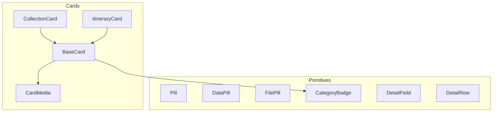
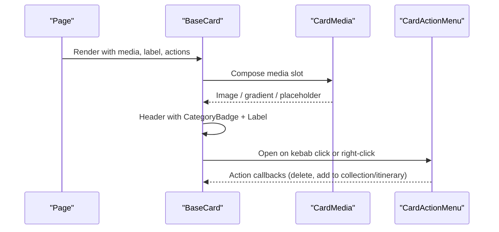
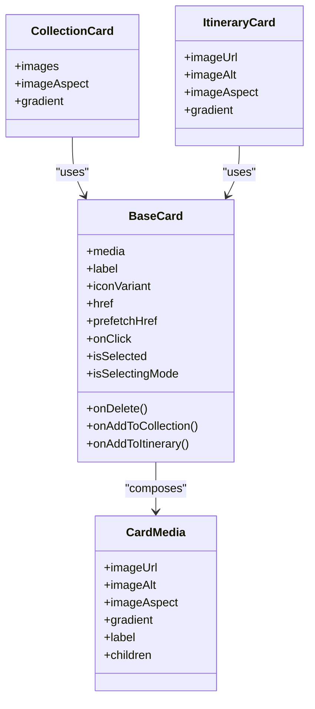
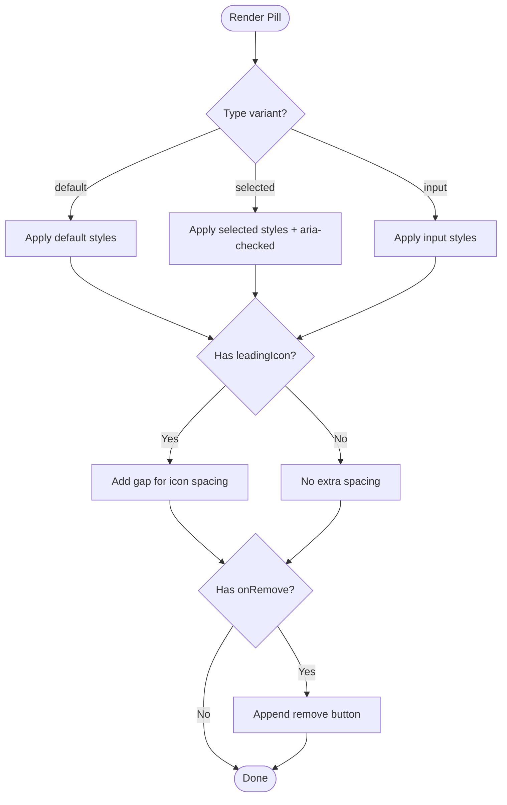
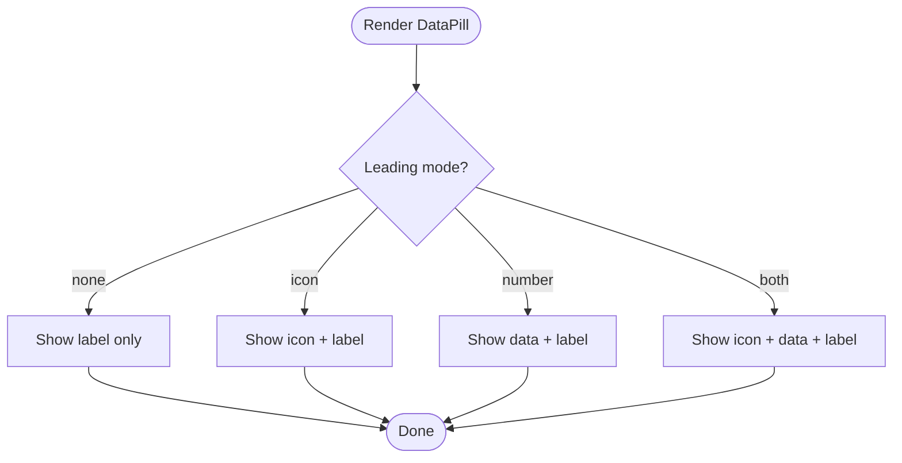
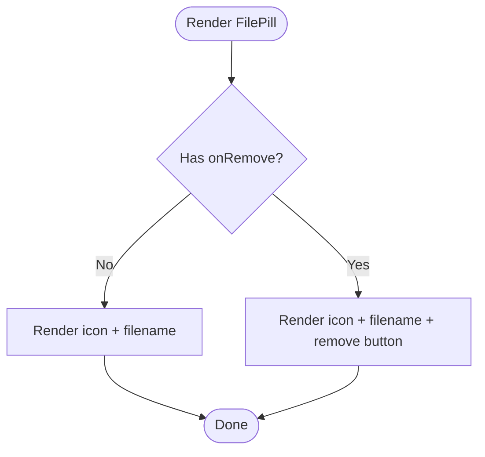
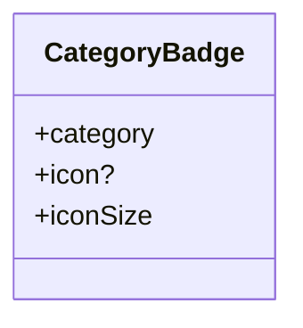
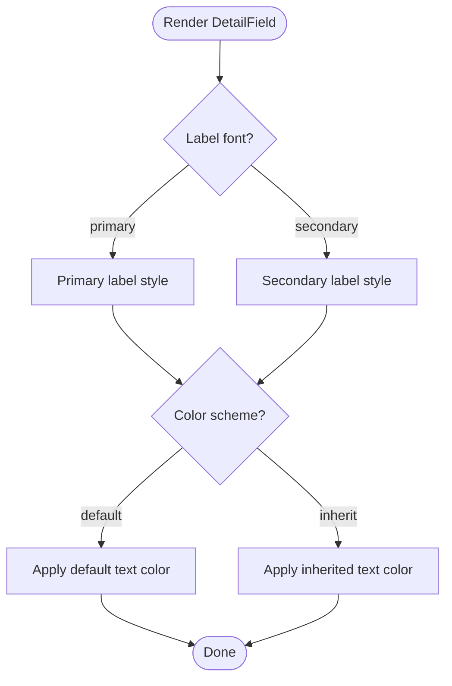
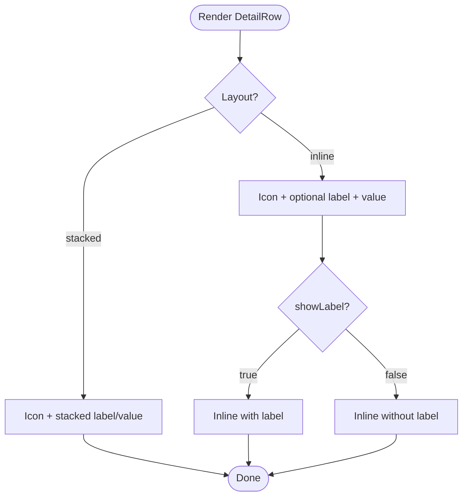
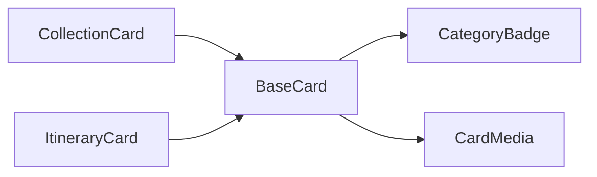

# Display Components

<cite>
**Referenced Files in This Document**
- [BaseCard.tsx](file://src/components/ui/cards/BaseCard.tsx)
- [CardMedia.tsx](file://src/components/ui/cards/CardMedia.tsx)
- [CollectionCard.tsx](file://src/components/ui/cards/CollectionCard.tsx)
- [ItineraryCard.tsx](file://src/components/ui/cards/ItineraryCard.tsx)
- [Pill.tsx](file://src/components/ui/primitives/Pill.tsx)
- [DataPill.tsx](file://src/components/ui/primitives/DataPill.tsx)
- [FilePill.tsx](file://src/components/ui/primitives/FilePill.tsx)
- [CategoryBadge.tsx](file://src/components/ui/primitives/CategoryBadge.tsx)
- [DetailField.tsx](file://src/components/ui/primitives/DetailField.tsx)
- [DetailRow.tsx](file://src/components/ui/primitives/DetailRow.tsx)
</cite>

## Table of Contents
1. [Introduction](#introduction)
2. [Project Structure](#project-structure)
3. [Core Components](#core-components)
4. [Architecture Overview](#architecture-overview)
5. [Detailed Component Analysis](#detailed-component-analysis)
6. [Dependency Analysis](#dependency-analysis)
7. [Performance Considerations](#performance-considerations)
8. [Troubleshooting Guide](#troubleshooting-guide)
9. [Conclusion](#conclusion)

## Introduction
This document provides detailed documentation for display-oriented primitive components used to present information and data: Card, Pill, DataPill, FilePill, CategoryBadge, DetailField, and DetailRow. It explains their visual hierarchy, content presentation patterns, responsive behavior, media integration, and layout considerations. It also includes examples of data visualization patterns and strategies for organizing content effectively across different screen sizes and contexts.

## Project Structure
The display components are organized into two primary areas:
- Cards: A reusable card shell (BaseCard), a media slot (CardMedia), and concrete cards (CollectionCard, ItineraryCard).
- Primitives: Small, focused UI building blocks such as Pill, DataPill, FilePill, CategoryBadge, DetailField, and DetailRow.

**Diagram sources**
- [BaseCard.tsx:13-148](file://src/components/ui/cards/BaseCard.tsx#L13-L148)
- [CardMedia.tsx:30-62](file://src/components/ui/cards/CardMedia.tsx#L30-L62)
- [CollectionCard.tsx:79-107](file://src/components/ui/cards/CollectionCard.tsx#L79-L107)
- [ItineraryCard.tsx:30-48](file://src/components/ui/cards/ItineraryCard.tsx#L30-L48)
- [CategoryBadge.tsx:88-113](file://src/components/ui/primitives/CategoryBadge.tsx#L88-L113)

**Section sources**
- [BaseCard.tsx:13-148](file://src/components/ui/cards/BaseCard.tsx#L13-L148)
- [CardMedia.tsx:30-62](file://src/components/ui/cards/CardMedia.tsx#L30-L62)
- [CollectionCard.tsx:79-107](file://src/components/ui/cards/CollectionCard.tsx#L79-L107)
- [ItineraryCard.tsx:30-48](file://src/components/ui/cards/ItineraryCard.tsx#L30-L48)
- [CategoryBadge.tsx:88-113](file://src/components/ui/primitives/CategoryBadge.tsx#L88-L113)

## Core Components
- Card (BaseCard + CardMedia): Provides a consistent card shell with media area, header label, category badge, and optional action menu. Concrete cards compose the base to render specific content types.
- Pill: Compact, selectable tag-like control with variants and optional leading icon and remove action.
- DataPill: Displays a small metric or value paired with a label, with optional icon and number/data slot.
- FilePill: Represents a file item with filename and optional removable action.
- CategoryBadge: Small circular indicator with category-specific color and icon.
- DetailField: Vertical label-value pair for read-only details.
- DetailRow: Horizontal row with icon, label, and value; supports stacked and inline layouts.

These primitives share common design tokens and styling utilities to ensure consistency across the application.

**Section sources**
- [BaseCard.tsx:20-50](file://src/components/ui/cards/BaseCard.tsx#L20-L50)
- [CardMedia.tsx:7-21](file://src/components/ui/cards/CardMedia.tsx#L7-L21)
- [Pill.tsx:36-43](file://src/components/ui/primitives/Pill.tsx#L36-L43)
- [DataPill.tsx:29-36](file://src/components/ui/primitives/DataPill.tsx#L29-L36)
- [FilePill.tsx:8-15](file://src/components/ui/primitives/FilePill.tsx#L8-L15)
- [CategoryBadge.tsx:79-86](file://src/components/ui/primitives/CategoryBadge.tsx#L79-L86)
- [DetailField.tsx:46-53](file://src/components/ui/primitives/DetailField.tsx#L46-L53)
- [DetailRow.tsx:33-44](file://src/components/ui/primitives/DetailRow.tsx#L33-L44)

## Architecture Overview
The card system is layered:
- BaseCard defines the shared structure: media slot, header with category badge and label, and an optional kebab menu that opens a context menu.
- CardMedia standardizes image rendering, aspect ratios, gradients, and fallbacks.
- Concrete cards (CollectionCard, ItineraryCard) configure BaseCard with appropriate media and category.

**Diagram sources**
- [BaseCard.tsx:81-159](file://src/components/ui/cards/BaseCard.tsx#L81-L159)
- [CardMedia.tsx:30-62](file://src/components/ui/cards/CardMedia.tsx#L30-L62)

**Section sources**
- [BaseCard.tsx:81-159](file://src/components/ui/cards/BaseCard.tsx#L81-L159)
- [CardMedia.tsx:30-62](file://src/components/ui/cards/CardMedia.tsx#L30-L62)

## Detailed Component Analysis

### Card System (BaseCard, CardMedia, CollectionCard, ItineraryCard)
- Visual hierarchy: Media area at top, followed by a compact header containing a CategoryBadge and truncated label, plus an optional kebab menu for actions.
- Content presentation:
  - Media supports images, gradients, custom children slots, and aspect ratio constraints.
  - Header uses truncation to handle long labels and integrates a category badge for semantic context.
- Responsive behavior:
  - Media adapts via aspect ratio classes or flex growth when no aspect is specified.
  - Header label truncates to prevent overflow.
- Layout considerations:
  - Cards can be links or buttons; keyboard navigation and focus states are handled consistently.
  - Selection mode visually highlights selected cards with brand border and background.
- Media integration:
  - CardMedia handles image errors gracefully by falling back to gradient or placeholder.
  - Custom children allow complex media like multi-image grids.

**Diagram sources**
- [BaseCard.tsx:20-50](file://src/components/ui/cards/BaseCard.tsx#L20-L50)
- [CardMedia.tsx:7-21](file://src/components/ui/cards/CardMedia.tsx#L7-L21)
- [CollectionCard.tsx:57-77](file://src/components/ui/cards/CollectionCard.tsx#L57-L77)
- [ItineraryCard.tsx:8-28](file://src/components/ui/cards/ItineraryCard.tsx#L8-L28)

**Section sources**
- [BaseCard.tsx:13-148](file://src/components/ui/cards/BaseCard.tsx#L13-L148)
- [CardMedia.tsx:30-62](file://src/components/ui/cards/CardMedia.tsx#L30-L62)
- [CollectionCard.tsx:79-107](file://src/components/ui/cards/CollectionCard.tsx#L79-L107)
- [ItineraryCard.tsx:30-48](file://src/components/ui/cards/ItineraryCard.tsx#L30-L48)

### Pill
- Purpose: Compact, selectable tag with optional leading icon and remove action.
- Variants: Default, selected, input styles; supports disabled state and focus ring.
- Content: Supports arbitrary ReactNode children and a leading icon slot.
- Interaction: Acts as a button with role="checkbox" when selected; supports removal via X icon.

**Diagram sources**
- [Pill.tsx:8-34](file://src/components/ui/primitives/Pill.tsx#L8-L34)
- [Pill.tsx:45-80](file://src/components/ui/primitives/Pill.tsx#L45-L80)

**Section sources**
- [Pill.tsx:36-80](file://src/components/ui/primitives/Pill.tsx#L36-L80)

### DataPill
- Purpose: Display a small data value alongside a label, optionally with an icon.
- Variants: Default and brand; leading modes none, icon, number, both.
- Content: Renders optional icon, data value, and label based on leading configuration.
- Use cases: Metrics, counters, or short stats within dashboards or summaries.

**Diagram sources**
- [DataPill.tsx:7-27](file://src/components/ui/primitives/DataPill.tsx#L7-L27)
- [DataPill.tsx:38-63](file://src/components/ui/primitives/DataPill.tsx#L38-L63)

**Section sources**
- [DataPill.tsx:29-63](file://src/components/ui/primitives/DataPill.tsx#L29-L63)

### FilePill
- Purpose: Represent a file item with filename and optional removal.
- Behavior: Shows a file icon and truncated filename; if onRemove is provided, renders an accessible remove button.
- Accessibility: Remove button has an aria-label derived from filename when not explicitly set.

**Diagram sources**
- [FilePill.tsx:17-49](file://src/components/ui/primitives/FilePill.tsx#L17-L49)

**Section sources**
- [FilePill.tsx:8-49](file://src/components/ui/primitives/FilePill.tsx#L8-L49)

### CategoryBadge
- Purpose: Small circular indicator with category-specific color and icon.
- Variants: link, collection, itinerary, location, brand, neutral, flight, accommodation, expense.
- Composition: Outer ring with lighter halo color; inner circle with base fill and high-contrast glyph.
- Customization: Accepts a custom icon and size.

**Diagram sources**
- [CategoryBadge.tsx:21-65](file://src/components/ui/primitives/CategoryBadge.tsx#L21-L65)
- [CategoryBadge.tsx:88-113](file://src/components/ui/primitives/CategoryBadge.tsx#L88-L113)

**Section sources**
- [CategoryBadge.tsx:79-113](file://src/components/ui/primitives/CategoryBadge.tsx#L79-L113)

### DetailField
- Purpose: Read-only vertical label-value pair for metadata.
- Variants: Label font (primary/secondary) and color scheme (default/inherit).
- Layout: Flex column with consistent spacing; value always medium weight, label switches font style based on variant.

**Diagram sources**
- [DetailField.tsx:17-44](file://src/components/ui/primitives/DetailField.tsx#L17-L44)
- [DetailField.tsx:55-76](file://src/components/ui/primitives/DetailField.tsx#L55-L76)

**Section sources**
- [DetailField.tsx:46-76](file://src/components/ui/primitives/DetailField.tsx#L46-L76)

### DetailRow
- Purpose: Icon + label + value metadata row with two layouts.
- Layouts:
  - Stacked: Icon left, label above value.
  - Inline: Icon, optional label beside value; value truncates to fit.
- Customization: Swappable leading icon; showLabel toggles label visibility in inline mode.

**Diagram sources**
- [DetailRow.tsx:21-31](file://src/components/ui/primitives/DetailRow.tsx#L21-L31)
- [DetailRow.tsx:46-86](file://src/components/ui/primitives/DetailRow.tsx#L46-L86)

**Section sources**
- [DetailRow.tsx:33-86](file://src/components/ui/primitives/DetailRow.tsx#L33-L86)

## Dependency Analysis
- BaseCard depends on:
  - CategoryBadge for semantic category indicators.
  - CardMedia for standardized media rendering.
  - CardActionMenu for contextual actions (via props).
- Concrete cards depend on BaseCard and CardMedia to compose specific experiences.
- Primitives are self-contained and rely on shared utility functions for class merging and styling.

**Diagram sources**
- [BaseCard.tsx:10-11](file://src/components/ui/cards/BaseCard.tsx#L10-L11)
- [CollectionCard.tsx:7-8](file://src/components/ui/cards/CollectionCard.tsx#L7-L8)
- [ItineraryCard.tsx:5-6](file://src/components/ui/cards/ItineraryCard.tsx#L5-L6)

**Section sources**
- [BaseCard.tsx:10-11](file://src/components/ui/cards/BaseCard.tsx#L10-L11)
- [CollectionCard.tsx:7-8](file://src/components/ui/cards/CollectionCard.tsx#L7-L8)
- [ItineraryCard.tsx:5-6](file://src/components/ui/cards/ItineraryCard.tsx#L5-L6)

## Performance Considerations
- Images:
  - Use appropriate aspect ratios to avoid layout shifts.
  - Handle image errors gracefully to maintain visual stability.
- Truncation:
  - Rely on CSS truncation for long labels and values to prevent overflow issues.
- Interactions:
  - Debounce heavy operations triggered by card actions where necessary.
- Rendering:
  - Prefer lightweight primitives (Pill, DataPill, FilePill) for dense data displays to reduce DOM overhead.

[No sources needed since this section provides general guidance]

## Troubleshooting Guide
- Card media not showing:
  - Ensure imageUrl is valid and not errored; verify fallback gradient or placeholder is configured.
- Long labels overflowing:
  - Confirm truncation classes are applied; check container widths and flex behavior.
- Pill interactions:
  - Verify onClick and onRemove handlers are correctly bound; ensure disabled state prevents unintended actions.
- DataPill display:
  - Check leading mode configuration to ensure expected icon/data combinations render.
- FilePill removal:
  - Confirm onRemove callback is provided to render the remove button; validate aria-label for accessibility.
- CategoryBadge mismatch:
  - Ensure category prop matches supported variants; provide custom icon if needed.
- DetailField/DetailRow alignment:
  - Validate layout prop and showLabel usage; confirm parent containers allow proper flex behavior.

**Section sources**
- [CardMedia.tsx:30-62](file://src/components/ui/cards/CardMedia.tsx#L30-L62)
- [BaseCard.tsx:120-148](file://src/components/ui/cards/BaseCard.tsx#L120-L148)
- [Pill.tsx:45-80](file://src/components/ui/primitives/Pill.tsx#L45-L80)
- [DataPill.tsx:38-63](file://src/components/ui/primitives/DataPill.tsx#L38-L63)
- [FilePill.tsx:17-49](file://src/components/ui/primitives/FilePill.tsx#L17-L49)
- [CategoryBadge.tsx:88-113](file://src/components/ui/primitives/CategoryBadge.tsx#L88-L113)
- [DetailField.tsx:55-76](file://src/components/ui/primitives/DetailField.tsx#L55-L76)
- [DetailRow.tsx:46-86](file://src/components/ui/primitives/DetailRow.tsx#L46-L86)

## Conclusion
The card system and primitives form a cohesive design language for presenting information and data. BaseCard provides a robust shell with media and header semantics, while primitives offer flexible, composable building blocks for labels, metrics, files, and metadata rows. By leveraging consistent variants, truncation, and accessible interactions, these components support clear visual hierarchy and responsive layouts across diverse content types and screen sizes.

[No sources needed since this section summarizes without analyzing specific files]