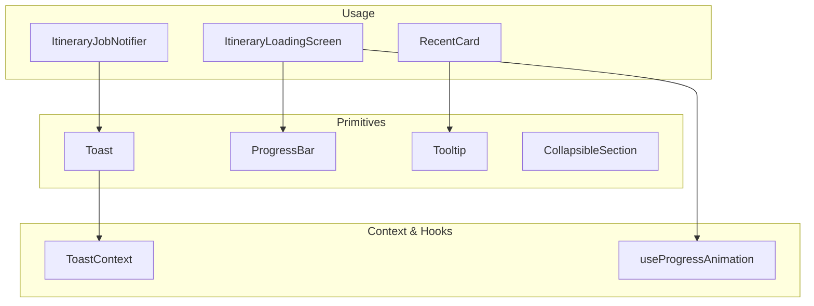
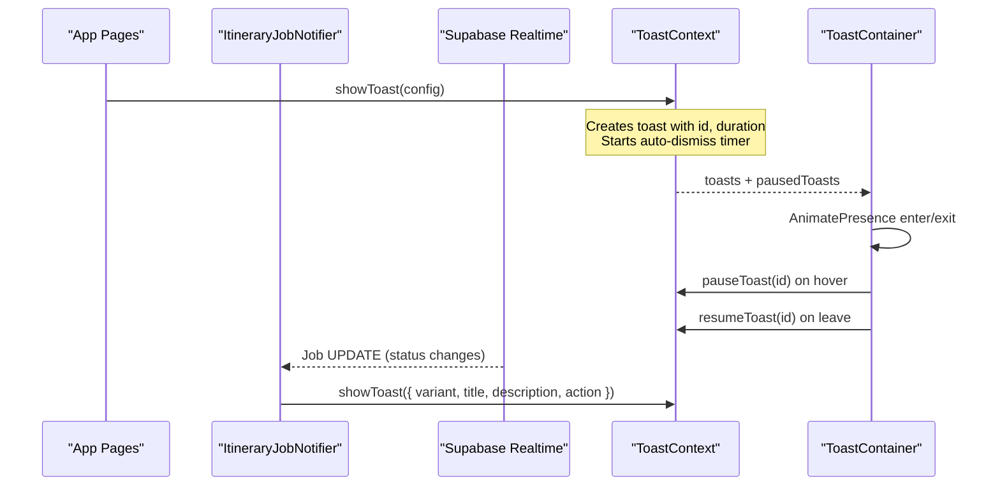
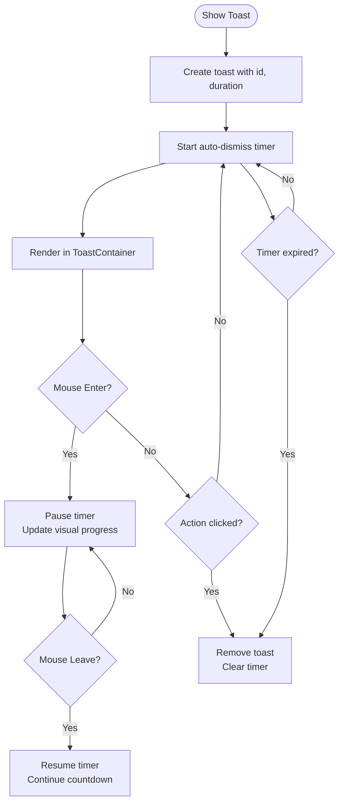
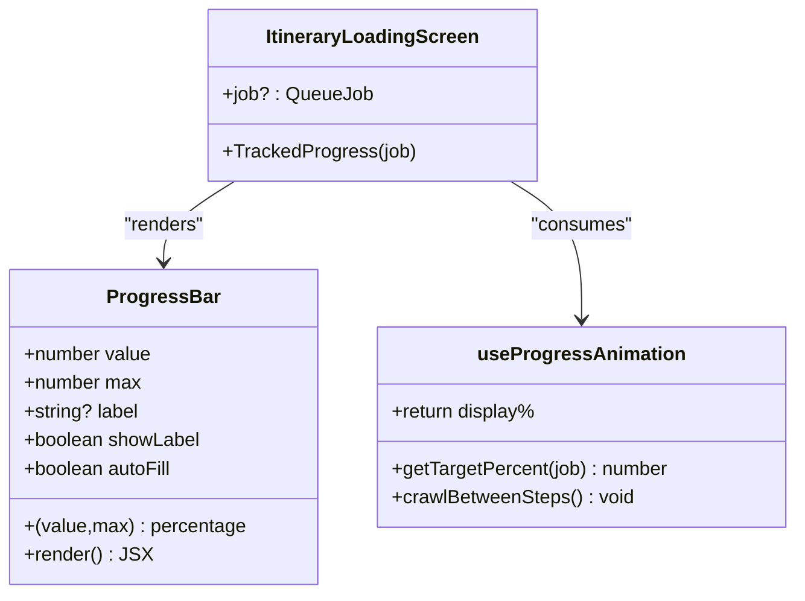
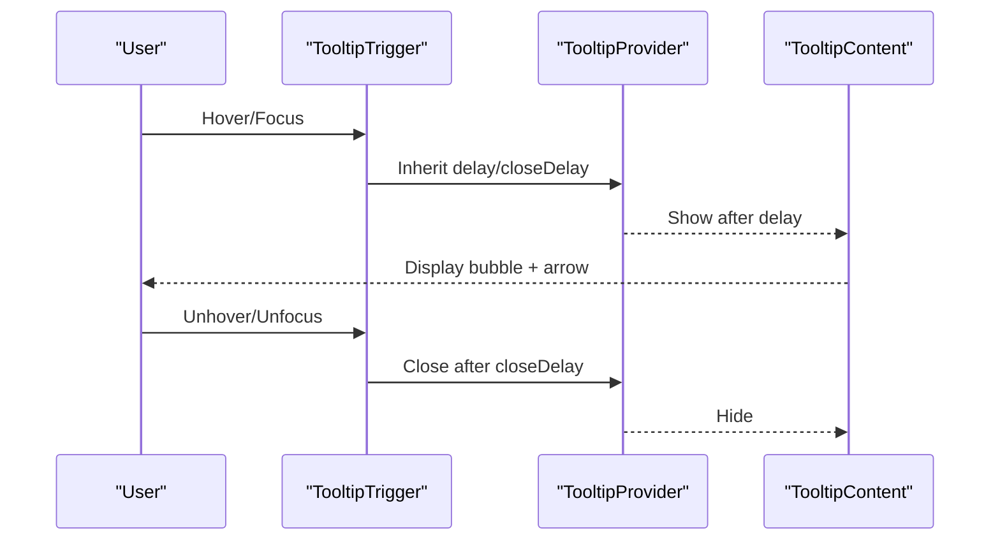
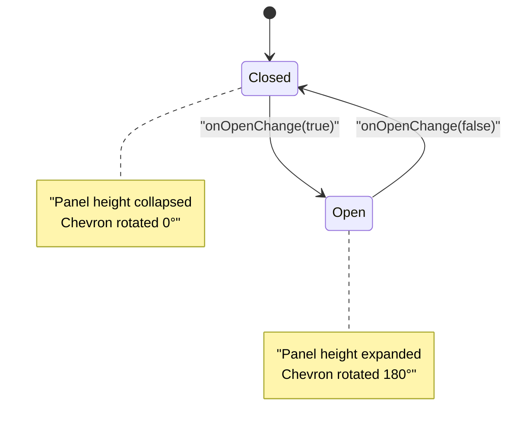
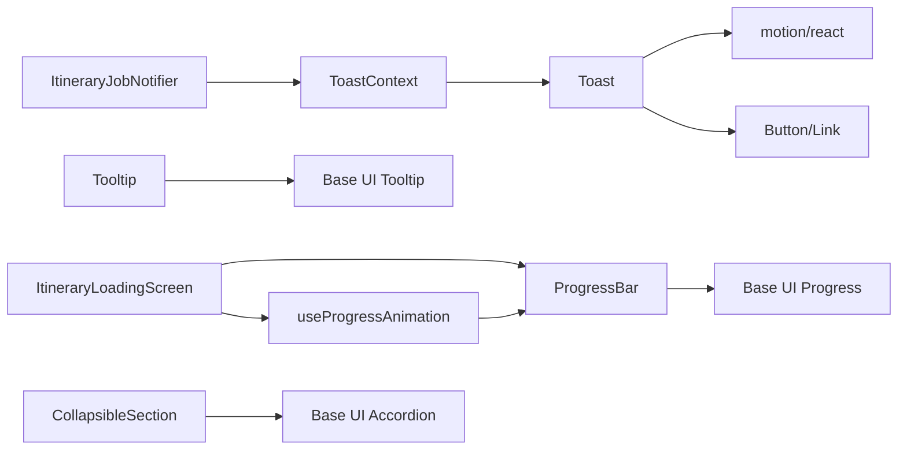

# Feedback Components

<cite>
**Referenced Files in This Document**
- [Toast.tsx](file://src/components/ui/primitives/Toast.tsx)
- [ProgressBar.tsx](file://src/components/ui/primitives/ProgressBar.tsx)
- [Tooltip.tsx](file://src/components/ui/primitives/Tooltip.tsx)
- [CollapsibleSection.tsx](file://src/components/ui/primitives/CollapsibleSection.tsx)
- [ToastContext.tsx](file://src/contexts/ToastContext.tsx)
- [ItineraryJobNotifier.tsx](file://src/components/notifications/ItineraryJobNotifier.tsx)
- [useProgressAnimation.ts](file://src/hooks/useProgressAnimation.ts)
- [presets.ts](file://src/lib/motion/presets.ts)
- [ItineraryLoadingScreen.tsx](file://src/components/ui/itinerary/ItineraryLoadingScreen.tsx)
- [RecentCard.tsx](file://src/components/ui/cards/RecentCard.tsx)
</cite>

## Table of Contents
1. Introduction
2. Project Structure
3. Core Components
4. Architecture Overview
5. Detailed Component Analysis
6. Dependency Analysis
7. Performance Considerations
8. Troubleshooting Guide
9. Conclusion

## Introduction
This document explains the feedback and status primitive components that provide user guidance and system state indication: Toast, ProgressBar, Tooltip, and CollapsibleSection. It covers timing behaviors, animation patterns, user interaction responses, notification systems, progress tracking, contextual help delivery, and content expansion patterns. It also includes examples of error handling, loading states, and user confirmation workflows as implemented in the codebase.

## Project Structure
The feedback primitives live under src/components/ui/primitives and are used across the app to communicate status, guide users, and manage expandable content. Notifications are coordinated via a global context and can be triggered from pages or background listeners. Progress is driven by hooks that compute smooth animations over backend job updates. Motion presets standardize transitions.

**Diagram sources**
- [Toast.tsx:47-173](file://src/components/ui/primitives/Toast.tsx#L47-L173)
- [ToastContext.tsx:42-148](file://src/contexts/ToastContext.tsx#L42-L148)
- [ItineraryJobNotifier.tsx:10-90](file://src/components/notifications/ItineraryJobNotifier.tsx#L10-L90)
- [ProgressBar.tsx:20-64](file://src/components/ui/primitives/ProgressBar.tsx#L20-L64)
- [useProgressAnimation.ts:37-103](file://src/hooks/useProgressAnimation.ts#L37-L103)
- [ItineraryLoadingScreen.tsx:27-96](file://src/components/ui/itinerary/ItineraryLoadingScreen.tsx#L27-L96)
- [Tooltip.tsx:98-177](file://src/components/ui/primitives/Tooltip.tsx#L98-L177)
- [RecentCard.tsx:27-58](file://src/components/ui/cards/RecentCard.tsx#L27-L58)

**Section sources**
- [Toast.tsx:47-173](file://src/components/ui/primitives/Toast.tsx#L47-L173)
- [ToastContext.tsx:42-148](file://src/contexts/ToastContext.tsx#L42-L148)
- [ProgressBar.tsx:20-64](file://src/components/ui/primitives/ProgressBar.tsx#L20-L64)
- [Tooltip.tsx:98-177](file://src/components/ui/primitives/Tooltip.tsx#L98-L177)
- [CollapsibleSection.tsx:26-118](file://src/components/ui/primitives/CollapsibleSection.tsx#L26-L118)
- [ItineraryJobNotifier.tsx:10-90](file://src/components/notifications/ItineraryJobNotifier.tsx#L10-L90)
- [useProgressAnimation.ts:37-103](file://src/hooks/useProgressAnimation.ts#L37-L103)
- [ItineraryLoadingScreen.tsx:27-96](file://src/components/ui/itinerary/ItineraryLoadingScreen.tsx#L27-L96)
- [RecentCard.tsx:27-58](file://src/components/ui/cards/RecentCard.tsx#L27-L58)

## Core Components
- Toast: A floating notification with auto-dismiss timer, hover pause/resume, optional thumbnail, action button, and accessible roles. Rendered via portal into the document body.
- ProgressBar: A labeled progress bar with clamped values, percentage display, optional custom formatter, and two modes: animated width transition or auto-fill animation.
- Tooltip: A standardized tooltip with provider-controlled delay, directional arrow, and positioning relative to trigger.
- CollapsibleSection: A single-section accordion with controlled/uncontrolled open state, chevron rotation, and height-animated panel.

Key behaviors:
- Toast timing: default duration, pausing on hover, resuming on leave, precise remaining time tracking.
- Progress animation: step-based targets, crawling between steps, ETA-aware trailing label.
- Tooltip timing: centralized delay constants for consistent UX.
- CollapsibleSection: accessible header/panel with motion tokens.

**Section sources**
- [Toast.tsx:13-45](file://src/components/ui/primitives/Toast.tsx#L13-L45)
- [Toast.tsx:47-173](file://src/components/ui/primitives/Toast.tsx#L47-L173)
- [ProgressBar.tsx:20-64](file://src/components/ui/primitives/ProgressBar.tsx#L20-L64)
- [Tooltip.tsx:15-20](file://src/components/ui/primitives/Tooltip.tsx#L15-L20)
- [Tooltip.tsx:98-177](file://src/components/ui/primitives/Tooltip.tsx#L98-L177)
- [CollapsibleSection.tsx:26-118](file://src/components/ui/primitives/CollapsibleSection.tsx#L26-L118)
- [useProgressAnimation.ts:37-103](file://src/hooks/useProgressAnimation.ts#L37-L103)

## Architecture Overview
The notification and progress architecture combines a global toast context with UI primitives and hooks that respond to real-time job updates.

**Diagram sources**
- [ItineraryJobNotifier.tsx:29-88](file://src/components/notifications/ItineraryJobNotifier.tsx#L29-L88)
- [ToastContext.tsx:90-127](file://src/contexts/ToastContext.tsx#L90-L127)
- [Toast.tsx:47-173](file://src/components/ui/primitives/Toast.tsx#L47-L173)

## Detailed Component Analysis

### Toast and Notification System
- Auto-dismiss timer: Each toast has a configurable duration; default is applied when not provided. Timers are tracked per toast and cleared on removal.
- Hover behavior: Pauses the dismiss timer while the mouse is over the toast; resumes when it leaves. The internal progress indicator reflects remaining time.
- Variants and accessibility: Error variant sets role="alert" and aria-live="assertive"; others use status and polite.
- Actions: Optional action button renders a link-style button; clicking removes the toast.
- Thumbnail: Optional image displayed with a slight rotation and shadow.
- Rendering: Portaled to document.body with AnimatePresence for enter/exit animations using motion presets.

**Diagram sources**
- [ToastContext.tsx:56-88](file://src/contexts/ToastContext.tsx#L56-L88)
- [ToastContext.tsx:100-127](file://src/contexts/ToastContext.tsx#L100-L127)
- [Toast.tsx:47-173](file://src/components/ui/primitives/Toast.tsx#L47-L173)

**Section sources**
- [ToastContext.tsx:42-148](file://src/contexts/ToastContext.tsx#L42-L148)
- [Toast.tsx:13-45](file://src/components/ui/primitives/Toast.tsx#L13-L45)
- [Toast.tsx:47-173](file://src/components/ui/primitives/Toast.tsx#L47-L173)
- [ItineraryJobNotifier.tsx:63-82](file://src/components/notifications/ItineraryJobNotifier.tsx#L63-L82)

### ProgressBar and Loading States
- Value clamping: Ensures value stays within [0, max].
- Labeling: Shows left label and right formatted value; supports custom formatter.
- Modes:
  - Transition mode: Width animates with CSS transition using motion tokens.
  - Auto-fill mode: Uses an animation keyframe to fill once.
- Visuals: Track with inset shadow and pill-shaped indicator with borders/highlights.

Usage in loading screens:
- Indeterminate one-shot fill when no job is present.
- Tracked progress when a job is present, combining stage labels and ETA-driven trailing text.

**Diagram sources**
- [ProgressBar.tsx:20-64](file://src/components/ui/primitives/ProgressBar.tsx#L20-L64)
- [ItineraryLoadingScreen.tsx:27-96](file://src/components/ui/itinerary/ItineraryLoadingScreen.tsx#L27-L96)
- [useProgressAnimation.ts:37-103](file://src/hooks/useProgressAnimation.ts#L37-L103)

**Section sources**
- [ProgressBar.tsx:20-64](file://src/components/ui/primitives/ProgressBar.tsx#L20-L64)
- [ItineraryLoadingScreen.tsx:27-96](file://src/components/ui/itinerary/ItineraryLoadingScreen.tsx#L27-L96)
- [useProgressAnimation.ts:37-103](file://src/hooks/useProgressAnimation.ts#L37-L103)

### Tooltip and Contextual Help
- Provider controls global delay and closeDelay for all tooltips in its subtree.
- Trigger wraps interactive elements; content is portaled and positioned relative to trigger with side and alignment options.
- Arrow adapts orientation based on side.
- Consistent styling ensures a unified look and feel across the app.

**Diagram sources**
- [Tooltip.tsx:98-177](file://src/components/ui/primitives/Tooltip.tsx#L98-L177)

**Section sources**
- [Tooltip.tsx:15-20](file://src/components/ui/primitives/Tooltip.tsx#L15-L20)
- [Tooltip.tsx:98-177](file://src/components/ui/primitives/Tooltip.tsx#L98-L177)
- [RecentCard.tsx:27-58](file://src/components/ui/cards/RecentCard.tsx#L27-L58)

### CollapsibleSection and Content Expansion
- Single-section accordion pattern with fixed item value.
- Supports both controlled (open/onOpenChange) and uncontrolled (defaultOpen) modes.
- Header contains truncated label and rotating chevron; panel animates height using CSS transitions tied to motion tokens.
- Disabled state reduces opacity and prevents interaction.

**Diagram sources**
- [CollapsibleSection.tsx:26-118](file://src/components/ui/primitives/CollapsibleSection.tsx#L26-L118)

**Section sources**
- [CollapsibleSection.tsx:26-118](file://src/components/ui/primitives/CollapsibleSection.tsx#L26-L118)

## Dependency Analysis
- Toast depends on:
  - React DOM portal for rendering outside the component tree.
  - Motion library for enter/exit animations and reduced motion preference.
  - ToastContext for state management and timers.
  - Button and Link for actions.
- ProgressBar depends on Base UI Progress primitives and motion tokens for transitions.
- Tooltip depends on Base UI Tooltip primitives and a provider for centralized timing.
- CollapsibleSection depends on Base UI Accordion and motion tokens for height transitions.
- ItineraryJobNotifier depends on Supabase realtime to react to job status changes and triggers toasts accordingly.
- ItineraryLoadingScreen composes ProgressBar and useProgressAnimation to reflect job progress.

**Diagram sources**
- [Toast.tsx:1-11](file://src/components/ui/primitives/Toast.tsx#L1-L11)
- [ToastContext.tsx:42-148](file://src/contexts/ToastContext.tsx#L42-L148)
- [ProgressBar.tsx:1-6](file://src/components/ui/primitives/ProgressBar.tsx#L1-L6)
- [Tooltip.tsx:1-9](file://src/components/ui/primitives/Tooltip.tsx#L1-L9)
- [CollapsibleSection.tsx:1-7](file://src/components/ui/primitives/CollapsibleSection.tsx#L1-L7)
- [ItineraryJobNotifier.tsx:1-8](file://src/components/notifications/ItineraryJobNotifier.tsx#L1-L8)
- [ItineraryLoadingScreen.tsx:1-10](file://src/components/ui/itinerary/ItineraryLoadingScreen.tsx#L1-L10)

**Section sources**
- [Toast.tsx:1-11](file://src/components/ui/primitives/Toast.tsx#L1-L11)
- [ProgressBar.tsx:1-6](file://src/components/ui/primitives/ProgressBar.tsx#L1-L6)
- [Tooltip.tsx:1-9](file://src/components/ui/primitives/Tooltip.tsx#L1-L9)
- [CollapsibleSection.tsx:1-7](file://src/components/ui/primitives/CollapsibleSection.tsx#L1-L7)
- [ItineraryJobNotifier.tsx:1-8](file://src/components/notifications/ItineraryJobNotifier.tsx#L1-L8)
- [ItineraryLoadingScreen.tsx:1-10](file://src/components/ui/itinerary/ItineraryLoadingScreen.tsx#L1-L10)

## Performance Considerations
- Reduced motion: Toast respects prefers-reduced-motion to disable layout animations.
- Timer efficiency: Toast timers are stored in refs and cleared on unmount or removal to avoid leaks.
- Progress crawling: useProgressAnimation uses intervals only during processing and clears them on cleanup.
- Portal usage: Toast and Tooltip use portals to avoid reflows in deep trees.
- Motion tokens: Centralized durations/easings ensure consistent performance across animations.

[No sources needed since this section provides general guidance]

## Troubleshooting Guide
Common issues and resolutions:
- Toast not dismissing: Ensure ToastProvider wraps the app and that removeToast is called on action clicks or completion. Verify timers are not stuck due to missing resume calls.
- Toast not pausing on hover: Confirm onMouseEnter/onMouseLeave handlers are attached to the toast card and that pauseToast/resumeToast are invoked with correct ids.
- ProgressBar not animating: Check that value changes trigger re-renders and that autoFill vs transition modes are set appropriately. Ensure motion tokens are available.
- Tooltip not showing: Verify TooltipProvider is mounted at a high level and that the trigger is interactive. Check z-index and positioning conflicts.
- CollapsibleSection not expanding: Ensure Accordion.Root receives proper value/defaultValue and that onOpenChange updates state if controlled.

Error handling examples:
- Error toasts: Use variant "error" with descriptive titles and optional descriptions.
- Job failure notifications: Background listener shows error toasts when jobs fail.
- API errors: Wrap operations in try/catch and surface friendly error messages via toasts.

**Section sources**
- [Toast.tsx:47-173](file://src/components/ui/primitives/Toast.tsx#L47-L173)
- [ToastContext.tsx:56-88](file://src/contexts/ToastContext.tsx#L56-L88)
- [ItineraryJobNotifier.tsx:63-82](file://src/components/notifications/ItineraryJobNotifier.tsx#L63-L82)
- [ProgressBar.tsx:20-64](file://src/components/ui/primitives/ProgressBar.tsx#L20-L64)
- [Tooltip.tsx:98-177](file://src/components/ui/primitives/Tooltip.tsx#L98-L177)
- [CollapsibleSection.tsx:26-118](file://src/components/ui/primitives/CollapsibleSection.tsx#L26-L118)

## Conclusion
The feedback primitives provide a cohesive system for notifications, progress indication, contextual help, and content expansion. Toast delivers timely, accessible alerts with precise timing control. ProgressBar offers flexible, animated progress visualization integrated with job-driven hooks. Tooltip standardizes contextual information with consistent timing and positioning. CollapsibleSection enables clear content hierarchy through accessible, animated expansion. Together, they support robust user workflows including error handling, loading states, and confirmations.

[No sources needed since this section summarizes without analyzing specific files]