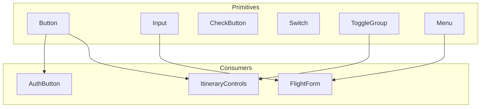
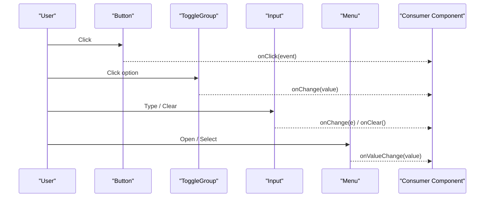
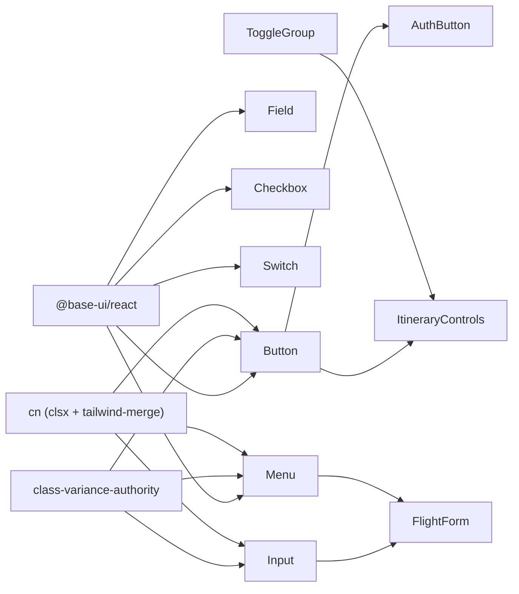

# Interactive Components

<cite>
**Referenced Files in This Document**
- [Button.tsx](file://src/components/ui/primitives/Button.tsx)
- [Input.tsx](file://src/components/ui/primitives/Input.tsx)
- [CheckButton.tsx](file://src/components/ui/primitives/CheckButton.tsx)
- [Switch.tsx](file://src/components/ui/primitives/Switch.tsx)
- [ToggleGroup.tsx](file://src/components/ui/primitives/ToggleGroup.tsx)
- [Menu.tsx](file://src/components/ui/primitives/Menu.tsx)
- [ItineraryControls.tsx](file://src/components/ui/itinerary/ItineraryControls.tsx)
- [FlightForm.tsx](file://src/components/ui/detail-views/FlightForm.tsx)
- [AuthButton.tsx](file://src/components/ui/auth/AuthButton.tsx)
- [utils.ts](file://src/lib/utils.ts)
</cite>

## Table of Contents
1. Introduction
2. Project Structure
3. Core Components
4. Architecture Overview
5. Detailed Component Analysis
6. Dependency Analysis
7. Performance Considerations
8. Troubleshooting Guide
9. Conclusion

## Introduction
This document provides comprehensive documentation for interactive primitive components that handle user input and actions: Button, Input, CheckButton, Switch, and ToggleGroup. It covers their props interfaces, event handling patterns, accessibility features (keyboard navigation, focus management, screen reader support), form integration patterns, and styling customization using Tailwind CSS. Usage examples demonstrate common interaction scenarios, validation patterns, and how these primitives are composed in real application code.

## Project Structure
The interactive primitives live under src/components/ui/primitives and are used across the app to build higher-level UI. They rely on Base UI primitives for robust behavior and accessibility, with class-variance-authority for variant-driven styling and a shared utility for class merging.

**Diagram sources**
- [Button.tsx:1-132](file://src/components/ui/primitives/Button.tsx#L1-L132)
- [Input.tsx:1-513](file://src/components/ui/primitives/Input.tsx#L1-L513)
- [CheckButton.tsx:1-91](file://src/components/ui/primitives/CheckButton.tsx#L1-L91)
- [Switch.tsx:1-104](file://src/components/ui/primitives/Switch.tsx#L1-L104)
- [ToggleGroup.tsx:1-54](file://src/components/ui/primitives/ToggleGroup.tsx#L1-L54)
- [Menu.tsx:1-384](file://src/components/ui/primitives/Menu.tsx#L1-L384)
- [ItineraryControls.tsx:1-166](file://src/components/ui/itinerary/ItineraryControls.tsx#L1-L166)
- [FlightForm.tsx:1-433](file://src/components/ui/detail-views/FlightForm.tsx#L1-L433)
- [AuthButton.tsx:1-41](file://src/components/ui/auth/AuthButton.tsx#L1-L41)

**Section sources**
- [Button.tsx:1-132](file://src/components/ui/primitives/Button.tsx#L1-L132)
- [Input.tsx:1-513](file://src/components/ui/primitives/Input.tsx#L1-L513)
- [Menu.tsx:1-384](file://src/components/ui/primitives/Menu.tsx#L1-L384)
- [ItineraryControls.tsx:1-166](file://src/components/ui/itinerary/ItineraryControls.tsx#L1-L166)
- [FlightForm.tsx:1-433](file://src/components/ui/detail-views/FlightForm.tsx#L1-L433)
- [AuthButton.tsx:1-41](file://src/components/ui/auth/AuthButton.tsx#L1-L41)
- [utils.ts:1-7](file://src/lib/utils.ts#L1-L7)

## Core Components
- Button: A styled, accessible button built on Base UI with variants, sizes, and icon placement. Supports focus-visible rings, disabled states, and layered decoration for filled variants.
- Input: A flexible input wrapper with leading/trailing icons, clearable state, controlled/uncontrolled value modes, and an optional dropdown selector mode. Integrates with Base UI Field for accessibility and keyboard behavior.
- CheckButton: An animated checkbox-like control with accessible state, reduced motion support, and visual feedback.
- Switch: A toggle switch with size variants, accessible label support, and focus ring.
- ToggleGroup: A radio-group style selection bar composed of Buttons with role="radio" and aria-checked for single-selection groups.

Key cross-cutting concerns:
- Accessibility: All components use Base UI primitives or explicit ARIA attributes to ensure correct semantics, keyboard navigation, and screen reader announcements.
- Styling: Class-variance-authority defines variants; Tailwind classes provide consistent design tokens; cn utility merges classes safely.
- Form integration: Inputs integrate with React forms via standard events and can be paired with validation logic at the consumer layer.

**Section sources**
- [Button.tsx:69-132](file://src/components/ui/primitives/Button.tsx#L69-L132)
- [Input.tsx:93-276](file://src/components/ui/primitives/Input.tsx#L93-L276)
- [CheckButton.tsx:10-91](file://src/components/ui/primitives/CheckButton.tsx#L10-L91)
- [Switch.tsx:37-104](file://src/components/ui/primitives/Switch.tsx#L37-L104)
- [ToggleGroup.tsx:7-54](file://src/components/ui/primitives/ToggleGroup.tsx#L7-L54)
- [utils.ts:1-7](file://src/lib/utils.ts#L1-L7)

## Architecture Overview
The primitives follow a layered architecture:
- Base UI primitives provide low-level behavior and accessibility (button, field, checkbox, switch, menu).
- Primitives wrap Base UI with design system styling and additional UX features (variants, animations, slots).
- Consumers compose primitives into feature-specific components (e.g., ItineraryControls uses Button and ToggleGroup; FlightForm composes inputs, menus, and dialogs).

**Diagram sources**
- [Button.tsx:76-129](file://src/components/ui/primitives/Button.tsx#L76-L129)
- [ToggleGroup.tsx:20-53](file://src/components/ui/primitives/ToggleGroup.tsx#L20-L53)
- [Input.tsx:125-276](file://src/components/ui/primitives/Input.tsx#L125-L276)
- [Menu.tsx:192-240](file://src/components/ui/primitives/Menu.tsx#L192-L240)

## Detailed Component Analysis

### Button
- Props interface: Extends Base UI button props with variant, size, icon placement, className, children.
- Event handling: Pass-through of all Base UI button events; consumers attach onClick handlers.
- Accessibility: Focus-visible ring, disabled state, semantic button element.
- Styling: Variants define color schemes; compound variants adjust padding for icon-only buttons; layered decorations create crisp borders.

Usage example references:
- AuthButton wraps Button to add loading state and full-width styling.
- ItineraryControls uses Button for secondary actions with leading icons.

**Section sources**
- [Button.tsx:9-42](file://src/components/ui/primitives/Button.tsx#L9-L42)
- [Button.tsx:69-132](file://src/components/ui/primitives/Button.tsx#L69-L132)
- [AuthButton.tsx:9-39](file://src/components/ui/auth/AuthButton.tsx#L9-L39)
- [ItineraryControls.tsx:140-149](file://src/components/ui/itinerary/ItineraryControls.tsx#L140-L149)

### Input
- Props interface: Controlled/uncontrolled value, placeholder, clearable flag, trailingIcon, icon slots, variant, size, aria-invalid, and more. Also supports a legacy showDropdown mode that renders DropdownSelector.
- Event handling: onChange propagated from Field.Control; clearable triggers onClear or clears internal value and dispatches input/change events.
- Accessibility: Uses Base UI Field.Control for proper labeling and keyboard behavior; aria-invalid for validation state; clear button has aria-label.
- Styling: Variants for default/underline styles; dynamic padding based on icon presence; inner shadow when hasValue is true.

DropdownSelector:
- Acts as a trigger with chevron and optional options list rendered via Menu.
- When options provided, MenuItem items update selected state and call onValueChange.

AddToInput:
- Fixed both-icon layout with leading/trailing slots and Field.Control for accessibility.

Usage example references:
- FlightForm composes custom text/select/date fields using inputVariants and inputControlVariants for consistent styling and behavior.

**Section sources**
- [Input.tsx:11-70](file://src/components/ui/primitives/Input.tsx#L11-L70)
- [Input.tsx:93-276](file://src/components/ui/primitives/Input.tsx#L93-L276)
- [Input.tsx:284-405](file://src/components/ui/primitives/Input.tsx#L284-L405)
- [Input.tsx:411-503](file://src/components/ui/primitives/Input.tsx#L411-L503)
- [FlightForm.tsx:62-149](file://src/components/ui/detail-views/FlightForm.tsx#L62-L149)

### CheckButton
- Props interface: checked/defaultChecked, onCheckedChange, disabled, className, aria-label.
- Event handling: Controlled/uncontrolled mode; emits nextChecked to parent.
- Accessibility: Built on Base UI Checkbox.Root; supports aria-label and keyboard toggling.
- Styling: Animated dot appears when checked; respects prefers-reduced-motion.

**Section sources**
- [CheckButton.tsx:10-91](file://src/components/ui/primitives/CheckButton.tsx#L10-L91)

### Switch
- Props interface: checked/defaultChecked, onCheckedChange, disabled, name, label, size, className.
- Event handling: Controlled/uncontrolled; emits boolean change.
- Accessibility: Base UI Switch.Root with aria-label; focus-visible ring; name enables form association.
- Styling: Size variants adjust track/thumb dimensions; thumb transitions and bevel shadows reflect checked state.

**Section sources**
- [Switch.tsx:9-35](file://src/components/ui/primitives/Switch.tsx#L9-L35)
- [Switch.tsx:37-104](file://src/components/ui/primitives/Switch.tsx#L37-L104)

### ToggleGroup
- Props interface: options array with value/label/icon, controlled value, onChange handler, className.
- Event handling: Renders each option as a Button with role="radio" and aria-checked; onClick calls onChange with selected value.
- Accessibility: Grouped radio semantics via role="group" and per-item role="radio"; keyboard navigation handled by browser defaults on radio buttons.
- Styling: Pill-shaped container with active item highlighted via primary variant.

Usage example references:
- ItineraryControls uses ToggleGroup to switch between view/edit modes with controlled value.

**Section sources**
- [ToggleGroup.tsx:7-54](file://src/components/ui/primitives/ToggleGroup.tsx#L7-L54)
- [ItineraryControls.tsx:151-161](file://src/components/ui/itinerary/ItineraryControls.tsx#L151-L161)

## Dependency Analysis
- Base UI dependencies: Button, Field, Checkbox, Switch, Menu primitives provide core behavior and accessibility.
- Styling: class-variance-authority drives variant APIs; Tailwind classes implement design tokens; cn utility merges classes deterministically.
- Consumer coupling:
  - ItineraryControls depends on Button and ToggleGroup for mode switching and actions.
  - FlightForm composes Input variants and Menu for selections and date/time inputs.
  - AuthButton extends Button for loading/disabled states.

**Diagram sources**
- [Button.tsx:3-7](file://src/components/ui/primitives/Button.tsx#L3-L7)
- [Input.tsx:3-9](file://src/components/ui/primitives/Input.tsx#L3-L9)
- [CheckButton.tsx:3-8](file://src/components/ui/primitives/CheckButton.tsx#L3-L8)
- [Switch.tsx:3-7](file://src/components/ui/primitives/Switch.tsx#L3-L7)
- [ToggleGroup.tsx:3-5](file://src/components/ui/primitives/ToggleGroup.tsx#L3-L5)
- [Menu.tsx:3-10](file://src/components/ui/primitives/Menu.tsx#L3-L10)
- [utils.ts:1-7](file://src/lib/utils.ts#L1-L7)

**Section sources**
- [Button.tsx:3-7](file://src/components/ui/primitives/Button.tsx#L3-L7)
- [Input.tsx:3-9](file://src/components/ui/primitives/Input.tsx#L3-L9)
- [Menu.tsx:3-10](file://src/components/ui/primitives/Menu.tsx#L3-L10)
- [ItineraryControls.tsx:1-166](file://src/components/ui/itinerary/ItineraryControls.tsx#L1-L166)
- [FlightForm.tsx:1-433](file://src/components/ui/detail-views/FlightForm.tsx#L1-L433)
- [AuthButton.tsx:1-41](file://src/components/ui/auth/AuthButton.tsx#L1-L41)
- [utils.ts:1-7](file://src/lib/utils.ts#L1-L7)

## Performance Considerations
- Prefer controlled components for predictable state updates in forms; avoid excessive re-renders by lifting state to the nearest stable parent.
- Use memoization where appropriate for large lists of options in DropdownSelector or Menu.
- Respect reduced motion preferences in CheckButton to improve performance and comfort for users who prefer minimal animations.
- Avoid unnecessary prop changes to minimize re-renders in high-frequency interactions like typing in Input.

[No sources needed since this section provides general guidance]

## Troubleshooting Guide
Common issues and resolutions:
- Input not clearing: Ensure clearable is enabled and onClear is either implemented or the internal clear path is allowed; verify that onChange is wired if using controlled mode.
- Validation state not reflected: Set aria-invalid on Input wrappers and display error messages; ensure form submission prevents default and validates before submitting.
- Keyboard navigation in ToggleGroup: Confirm each option is rendered as a button with role="radio" and aria-checked; group should have role="group".
- Screen reader labels: Provide aria-label or associate labels with inputs; for Switch, pass label via aria-label or pair with visible label elements.
- Menu not opening: Verify MenuTrigger is attached to a clickable element and MenuContent is present; check z-index and positioning if overlays are clipped.

**Section sources**
- [Input.tsx:170-186](file://src/components/ui/primitives/Input.tsx#L170-L186)
- [Input.tsx:213-224](file://src/components/ui/primitives/Input.tsx#L213-L224)
- [ToggleGroup.tsx:27-51](file://src/components/ui/primitives/ToggleGroup.tsx#L27-L51)
- [Switch.tsx:61-95](file://src/components/ui/primitives/Switch.tsx#L61-L95)
- [Menu.tsx:192-240](file://src/components/ui/primitives/Menu.tsx#L192-L240)

## Conclusion
These interactive primitives provide a robust, accessible foundation for building forms and controls. By leveraging Base UI for behavior, class-variance-authority for styling, and Tailwind for design tokens, they enable consistent, maintainable UIs. Consumers like ItineraryControls and FlightForm demonstrate practical composition patterns for real-world applications, including validation, keyboard navigation, and screen reader support.

[No sources needed since this section summarizes without analyzing specific files]