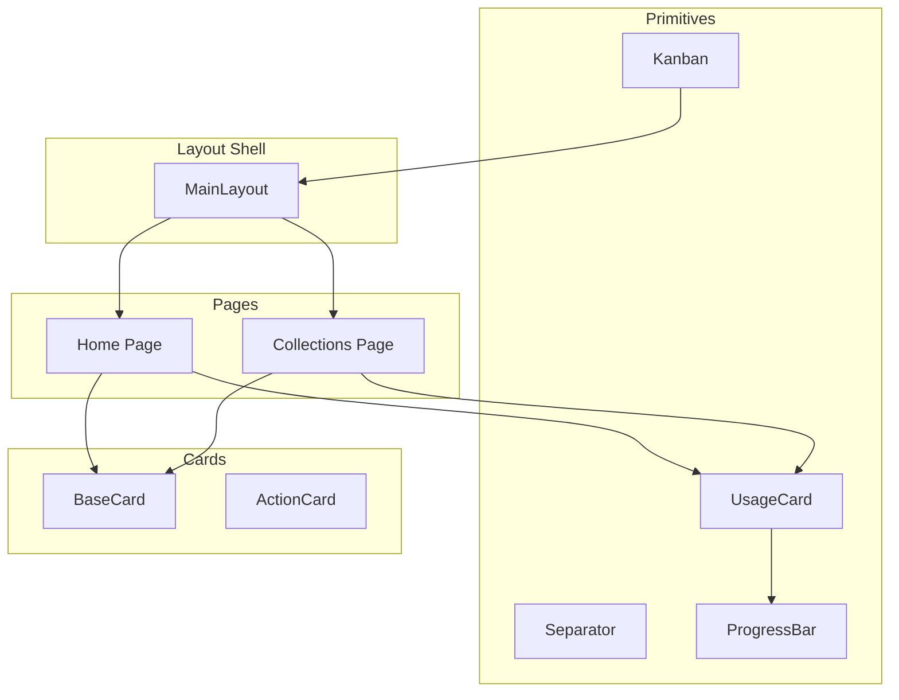
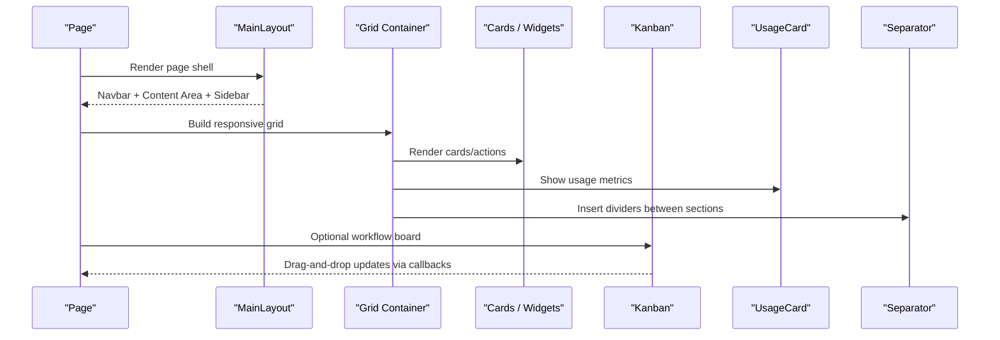
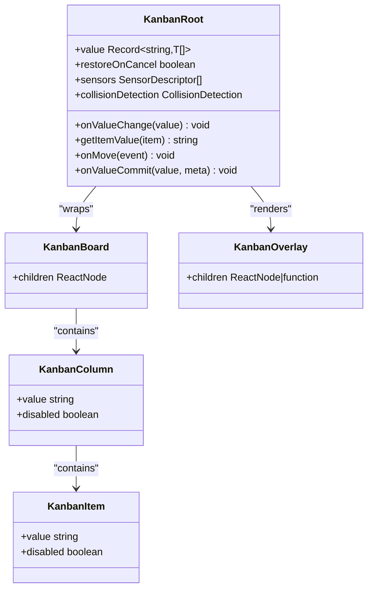
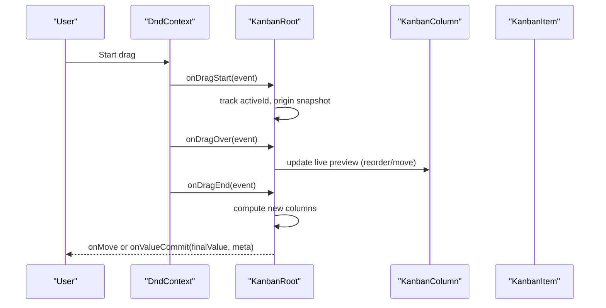
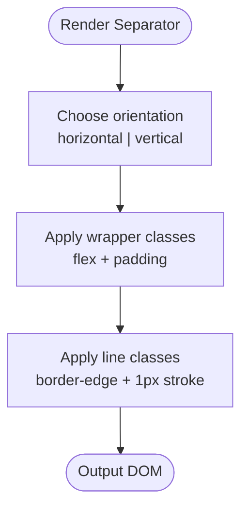
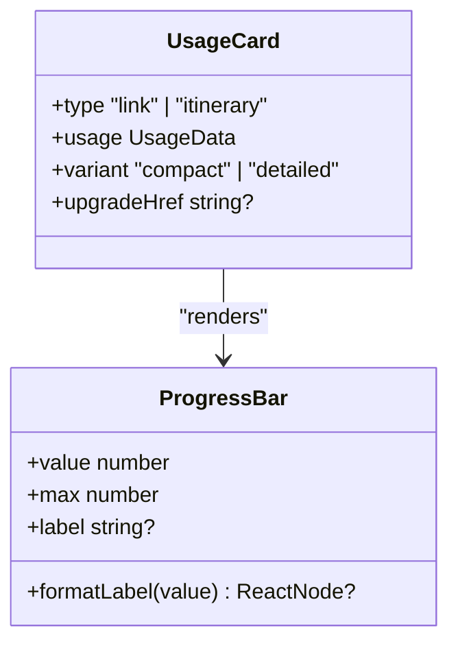
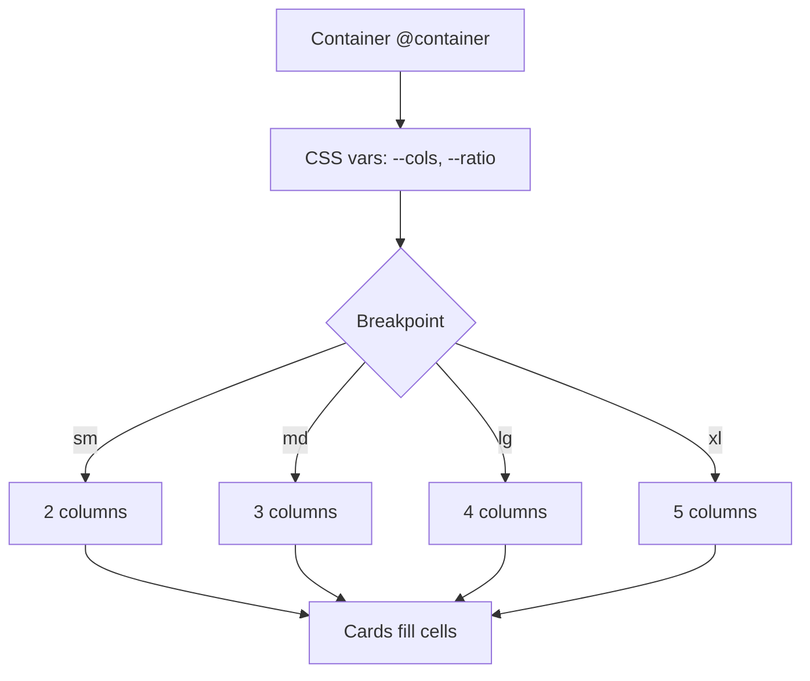
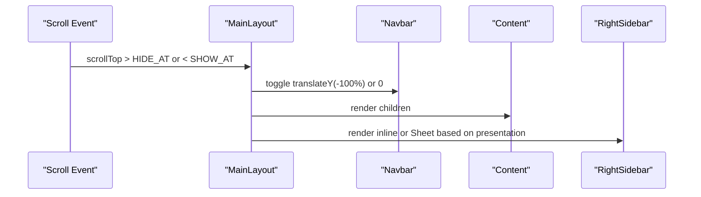
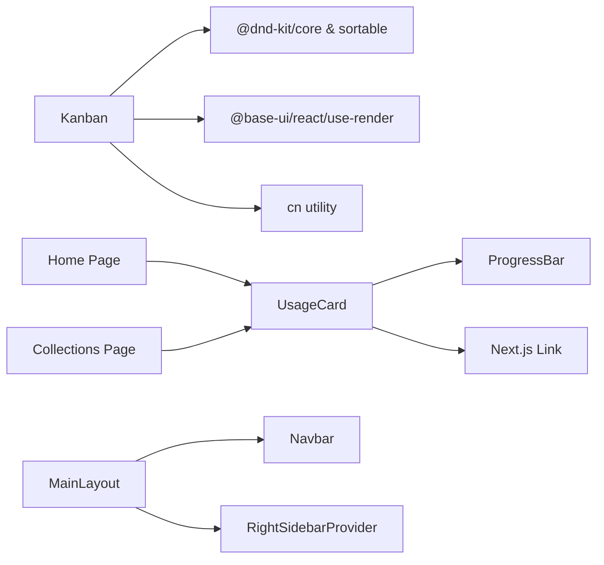

# Layout Components

<cite>
**Referenced Files in This Document**
- [Kanban.tsx](file://src/components/ui/primitives/Kanban.tsx)
- [Separator.tsx](file://src/components/ui/primitives/Separator.tsx)
- [UsageCard.tsx](file://src/components/ui/primitives/UsageCard.tsx)
- [MainLayout.tsx](file://src/components/ui/layout/MainLayout.tsx)
- [BaseCard.tsx](file://src/components/ui/cards/BaseCard.tsx)
- [ActionCard.tsx](file://src/components/ui/dashboard/ActionCard.tsx)
- [ProgressBar.tsx](file://src/components/ui/primitives/ProgressBar.tsx)
- [home/page.tsx](file://src/app/home/page.tsx)
- [collections/page.tsx](file://src/app/collections/page.tsx)
</cite>

## Table of Contents
1. [Introduction](#introduction)
2. [Project Structure](#project-structure)
3. [Core Components](#core-components)
4. [Architecture Overview](#architecture-overview)
5. [Detailed Component Analysis](#detailed-component-analysis)
6. [Dependency Analysis](#dependency-analysis)
7. [Performance Considerations](#performance-considerations)
8. [Troubleshooting Guide](#troubleshooting-guide)
9. [Conclusion](#conclusion)
10. [Appendices](#appendices)

## Introduction
This document explains the layout and structural primitive components that organize content and provide visual separation across the application. It focuses on:
- Kanban: a full-featured, drag-and-drop board for workflow-style layouts with columns and items.
- Separator: a lightweight visual divider for horizontal or vertical spacing.
- UsageCard: a card-based presentation for quota and usage metrics with progress visualization.
It also covers grid layouts, responsive behaviors, and how these primitives compose into dashboards, workflow boards, and content organization patterns.

## Project Structure
The layout system is built from reusable primitives under src/components/ui/primitives and layout shells under src/components/ui/layout. Pages compose these primitives to build dashboards and lists.

**Diagram sources**
- [Kanban.tsx:216-747](file://src/components/ui/primitives/Kanban.tsx#L216-L747)
- [Separator.tsx:41-65](file://src/components/ui/primitives/Separator.tsx#L41-L65)
- [UsageCard.tsx:51-93](file://src/components/ui/primitives/UsageCard.tsx#L51-L93)
- [MainLayout.tsx:273-377](file://src/components/ui/layout/MainLayout.tsx#L273-L377)
- [BaseCard.tsx:57-205](file://src/components/ui/cards/BaseCard.tsx#L57-L205)
- [ActionCard.tsx:36-99](file://src/components/ui/dashboard/ActionCard.tsx#L36-L99)
- [home/page.tsx:681-800](file://src/app/home/page.tsx#L681-L800)
- [collections/page.tsx:113-196](file://src/app/collections/page.tsx#L113-L196)

**Section sources**
- [Kanban.tsx:216-747](file://src/components/ui/primitives/Kanban.tsx#L216-L747)
- [Separator.tsx:41-65](file://src/components/ui/primitives/Separator.tsx#L41-L65)
- [UsageCard.tsx:51-93](file://src/components/ui/primitives/UsageCard.tsx#L51-L93)
- [MainLayout.tsx:273-377](file://src/components/ui/layout/MainLayout.tsx#L273-L377)
- [BaseCard.tsx:57-205](file://src/components/ui/cards/BaseCard.tsx#L57-L205)
- [ActionCard.tsx:36-99](file://src/components/ui/dashboard/ActionCard.tsx#L36-L99)
- [home/page.tsx:681-800](file://src/app/home/page.tsx#L681-L800)
- [collections/page.tsx:113-196](file://src/app/collections/page.tsx#L113-L196)

## Core Components
- Kanban: A drag-and-drop board with columns and items, supporting cross-column moves, reordering, custom sensors, collision detection, and overlay rendering.
- Separator: A thin visual divider with horizontal or vertical orientation and consistent padding.
- UsageCard: A compact or detailed card showing used/max values with a progress bar and optional upgrade link.

These primitives are designed to be composable, accessible, and responsive. They integrate with shared styling utilities and motion tokens.

**Section sources**
- [Kanban.tsx:216-747](file://src/components/ui/primitives/Kanban.tsx#L216-L747)
- [Separator.tsx:41-65](file://src/components/ui/primitives/Separator.tsx#L41-L65)
- [UsageCard.tsx:51-93](file://src/components/ui/primitives/UsageCard.tsx#L51-L93)

## Architecture Overview
At a high level:
- MainLayout provides the page shell, including a sticky navbar, main content area, and a right sidebar (inline or sheet).
- Pages like Home and Collections use grids to present cards and include UsageCard for quota visibility.
- Kanban can be embedded within pages to enable workflow boards with drag-and-drop.
- Separator divides sections visually without imposing layout semantics.

**Diagram sources**
- [MainLayout.tsx:273-377](file://src/components/ui/layout/MainLayout.tsx#L273-L377)
- [home/page.tsx:681-800](file://src/app/home/page.tsx#L681-L800)
- [collections/page.tsx:113-196](file://src/app/collections/page.tsx#L113-L196)
- [Kanban.tsx:216-747](file://src/components/ui/primitives/Kanban.tsx#L216-L747)
- [UsageCard.tsx:51-93](file://src/components/ui/primitives/UsageCard.tsx#L51-L93)
- [Separator.tsx:41-65](file://src/components/ui/primitives/Separator.tsx#L41-L65)

## Detailed Component Analysis

### Kanban: Workflow Board with Drag-and-Drop
- Purpose: Organize items into columns with drag-and-drop reordering and cross-column movement.
- Key capabilities:
  - DnD context and sensors (mouse, touch, keyboard) with configurable activation constraints.
  - Column and item sorting strategies; supports both column reordering and item reordering.
  - Live preview during drag; commit behavior on cancel or end.
  - Custom collision detection and drop target resolution for insertion slots.
  - Overlay rendering via portal for smooth dragging visuals.
- Props and events:
  - value/onValueChange: controlled data model mapping columns to arrays of items.
  - getItemValue: resolves unique IDs for items.
  - onMove: optional callback to handle move coordinates when you manage state yourself.
  - onValueCommit: final commit metadata including previous value and indices.
  - restoreOnCancel: whether to revert live-preview changes on cancel.
  - modifiers, accessibility, sensors, collisionDetection: advanced customization.
- Responsive behavior:
  - Board uses a responsive grid class to adapt column count based on viewport.
  - Columns and items render flex stacks with gaps; overlays avoid SSR issues.

**Diagram sources**
- [Kanban.tsx:216-747](file://src/components/ui/primitives/Kanban.tsx#L216-L747)
- [Kanban.tsx:751-851](file://src/components/ui/primitives/Kanban.tsx#L751-L851)
- [Kanban.tsx:892-962](file://src/components/ui/primitives/Kanban.tsx#L892-L962)
- [Kanban.tsx:1035-1079](file://src/components/ui/primitives/Kanban.tsx#L1035-L1079)

**Diagram sources**
- [Kanban.tsx:412-693](file://src/components/ui/primitives/Kanban.tsx#L412-L693)

Spacing and layout notes:
- Board grid: responsive columns with gap and auto rows.
- Column content: vertical stack with gap for items.
- Overlays: portal-rendered to avoid stacking and z-index conflicts.

**Section sources**
- [Kanban.tsx:216-747](file://src/components/ui/primitives/Kanban.tsx#L216-L747)
- [Kanban.tsx:751-851](file://src/components/ui/primitives/Kanban.tsx#L751-L851)
- [Kanban.tsx:892-962](file://src/components/ui/primitives/Kanban.tsx#L892-L962)
- [Kanban.tsx:1035-1079](file://src/components/ui/primitives/Kanban.tsx#L1035-L1079)

### Separator: Visual Divider
- Purpose: Provide a 1px rule with consistent padding for clear section separation.
- Orientation: Horizontal or vertical; defaults to horizontal.
- Styling: Uses a wrapper with padding and an inner line with border-edge color.
- Use cases: Dividing headers from content, separating lists, or marking boundaries in dashboards.

**Diagram sources**
- [Separator.tsx:41-65](file://src/components/ui/primitives/Separator.tsx#L41-L65)

**Section sources**
- [Separator.tsx:41-65](file://src/components/ui/primitives/Separator.tsx#L41-L65)

### UsageCard: Quota and Progress Presentation
- Purpose: Display usage metrics (used/max) with a progress bar and plan name or upgrade link.
- Variants: Compact (default) and detailed (shows reset date if provided).
- Behavior:
  - ProgressBar clamps value to [0, max] while label remains honest.
  - formatLabel allows rendering a Link for upgrades when over limit.
- Integration: Used in dashboard and collections pages to show link usage limits.

**Diagram sources**
- [UsageCard.tsx:51-93](file://src/components/ui/primitives/UsageCard.tsx#L51-L93)
- [ProgressBar.tsx:20-65](file://src/components/ui/primitives/ProgressBar.tsx#L20-L65)

**Section sources**
- [UsageCard.tsx:51-93](file://src/components/ui/primitives/UsageCard.tsx#L51-L93)
- [ProgressBar.tsx:20-65](file://src/components/ui/primitives/ProgressBar.tsx#L20-L65)

### Grid Layouts and Responsive Behaviors
- Dashboard grid: Uses CSS container queries and CSS variables to control columns and aspect ratios. Breakpoints adjust column counts and ratios for different screen sizes.
- Collections grid: Similar pattern with explicit column counts per breakpoint.
- Cards: BaseCard and ActionCard provide consistent sizing, hover states, focus rings, and action menus.

**Diagram sources**
- [home/page.tsx:795-800](file://src/app/home/page.tsx#L795-L800)
- [collections/page.tsx:139-145](file://src/app/collections/page.tsx#L139-L145)
- [BaseCard.tsx:57-205](file://src/components/ui/cards/BaseCard.tsx#L57-L205)
- [ActionCard.tsx:36-99](file://src/components/ui/dashboard/ActionCard.tsx#L36-L99)

**Section sources**
- [home/page.tsx:795-800](file://src/app/home/page.tsx#L795-L800)
- [collections/page.tsx:139-145](file://src/app/collections/page.tsx#L139-L145)
- [BaseCard.tsx:57-205](file://src/components/ui/cards/BaseCard.tsx#L57-L205)
- [ActionCard.tsx:36-99](file://src/components/ui/dashboard/ActionCard.tsx#L36-L99)

### MainLayout: Page Shell and Right Sidebar
- Provides a full-viewport layout with a sticky navbar that hides/shows based on scroll position using hysteresis thresholds.
- Main content area scrolls independently; right sidebar can be inline at larger screens or a sheet overlay below lg.
- Wraps providers for navigation loading, filters, and right sidebar state.

**Diagram sources**
- [MainLayout.tsx:61-91](file://src/components/ui/layout/MainLayout.tsx#L61-L91)
- [MainLayout.tsx:273-377](file://src/components/ui/layout/MainLayout.tsx#L273-L377)

**Section sources**
- [MainLayout.tsx:61-91](file://src/components/ui/layout/MainLayout.tsx#L61-L91)
- [MainLayout.tsx:273-377](file://src/components/ui/layout/MainLayout.tsx#L273-L377)

## Dependency Analysis
- Kanban depends on dnd-kit for drag-and-drop, Base UI for rendering utilities, and shared style helpers. It exposes contexts for columns and items to coordinate interactions.
- UsageCard depends on ProgressBar for visualizing quotas and Next.js Link for upgrade actions.
- Pages depend on these primitives to build dashboards and lists; they also rely on hooks and query clients for data fetching and mutations.
- MainLayout composes multiple providers and integrates with routing and modals.

**Diagram sources**
- [Kanban.tsx:1-57](file://src/components/ui/primitives/Kanban.tsx#L1-L57)
- [UsageCard.tsx:1-99](file://src/components/ui/primitives/UsageCard.tsx#L1-L99)
- [home/page.tsx:1-47](file://src/app/home/page.tsx#L1-L47)
- [collections/page.tsx:1-21](file://src/app/collections/page.tsx#L1-L21)
- [MainLayout.tsx:1-31](file://src/components/ui/layout/MainLayout.tsx#L1-L31)

**Section sources**
- [Kanban.tsx:1-57](file://src/components/ui/primitives/Kanban.tsx#L1-L57)
- [UsageCard.tsx:1-99](file://src/components/ui/primitives/UsageCard.tsx#L1-L99)
- [home/page.tsx:1-47](file://src/app/home/page.tsx#L1-L47)
- [collections/page.tsx:1-21](file://src/app/collections/page.tsx#L1-L21)
- [MainLayout.tsx:1-31](file://src/components/ui/layout/MainLayout.tsx#L1-L31)

## Performance Considerations
- Kanban:
  - Uses refs to keep handler identities stable and avoid unnecessary re-renders.
  - Leverages dnd-kit’s strategies and measuring config for efficient reflows.
  - Portal-based overlay avoids layout thrashing during drag.
- UsageCard:
  - ProgressBar clamps values to prevent overflow; animations respect reduced motion preferences.
- MainLayout:
  - Scroll-based navbar hiding uses hysteresis to reduce flicker and frequent state updates.
  - Right sidebar transitions honor reduced motion settings.

[No sources needed since this section provides general guidance]

## Troubleshooting Guide
- Kanban duplicate IDs:
  - The component warns if item IDs are not unique across columns; ensure getItemValue returns unique identifiers.
- Drop target resolution:
  - If using custom insertion slots, implement resolveDropTarget to map slot targets to containers and indices; otherwise drops may be ignored.
- Cancel behavior:
  - With restoreOnCancel enabled, live-preview changes revert on cancel; otherwise, onValueCommit applies the current state.
- UsageCard over-limit:
  - Label shows actual used/max even if the bar is clamped; consider providing upgradeHref to guide users.
- MainLayout navbar:
  - If navbar hides unexpectedly, verify scroll container and thresholds; ensure the main content element is scrollable.

**Section sources**
- [Kanban.tsx:263-281](file://src/components/ui/primitives/Kanban.tsx#L263-L281)
- [Kanban.tsx:298-354](file://src/components/ui/primitives/Kanban.tsx#L298-L354)
- [Kanban.tsx:528-552](file://src/components/ui/primitives/Kanban.tsx#L528-L552)
- [UsageCard.tsx:60-81](file://src/components/ui/primitives/UsageCard.tsx#L60-L81)
- [MainLayout.tsx:61-91](file://src/components/ui/layout/MainLayout.tsx#L61-L91)

## Conclusion
The layout primitives—Kanban, Separator, and UsageCard—provide a robust foundation for building dashboards, workflow boards, and content organization interfaces. Combined with responsive grids and a flexible MainLayout shell, they support scalable, accessible, and performant user experiences across devices. Use Kanban for interactive workflows, Separator for clear visual boundaries, and UsageCard for concise quota reporting.

[No sources needed since this section summarizes without analyzing specific files]

## Appendices

### Example Patterns and Usage Strategies
- Dashboard layout:
  - Use a responsive grid with CSS variables to control columns and aspect ratios.
  - Include UsageCard in the header row for immediate quota visibility.
  - Add separators between major sections to improve scannability.
- Workflow board:
  - Wrap content with Kanban and define columns/items with unique IDs.
  - Provide onMove or onValueCommit to persist changes; customize sensors and collision detection as needed.
- Content organization:
  - Compose BaseCard or ActionCard within grid cells for consistent interaction patterns.
  - Use Separator to divide lists or detail sections within cards.

[No sources needed since this section provides general guidance]