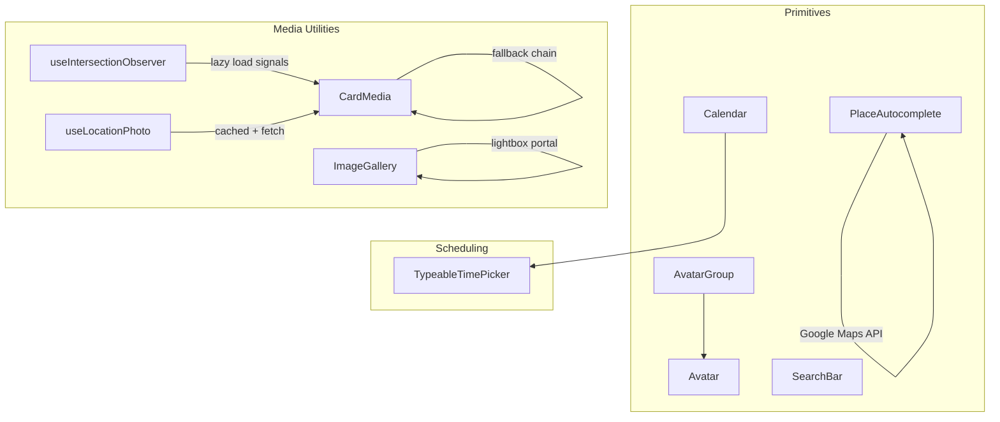
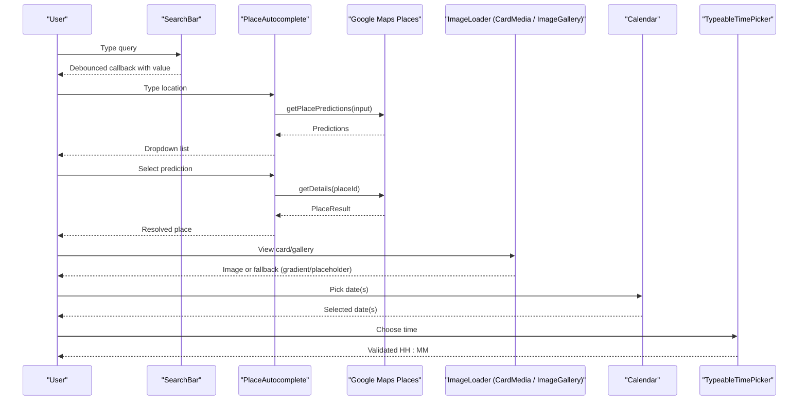
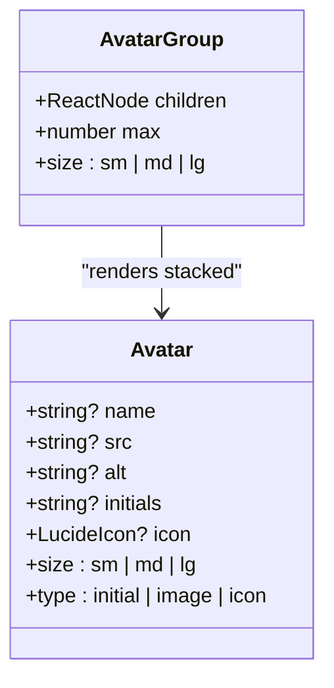
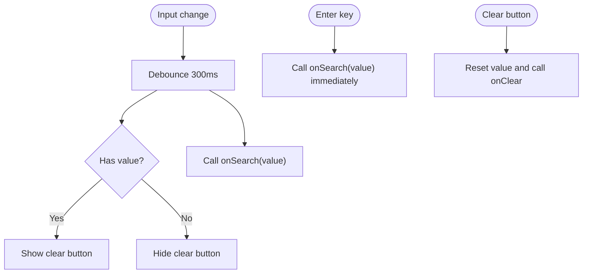
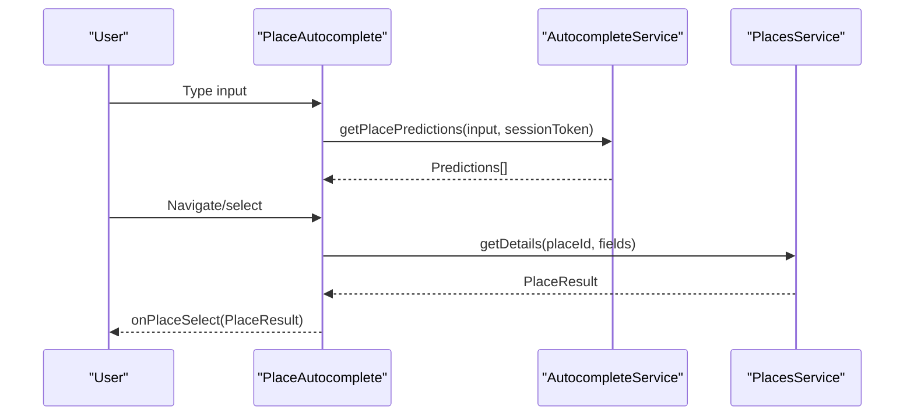
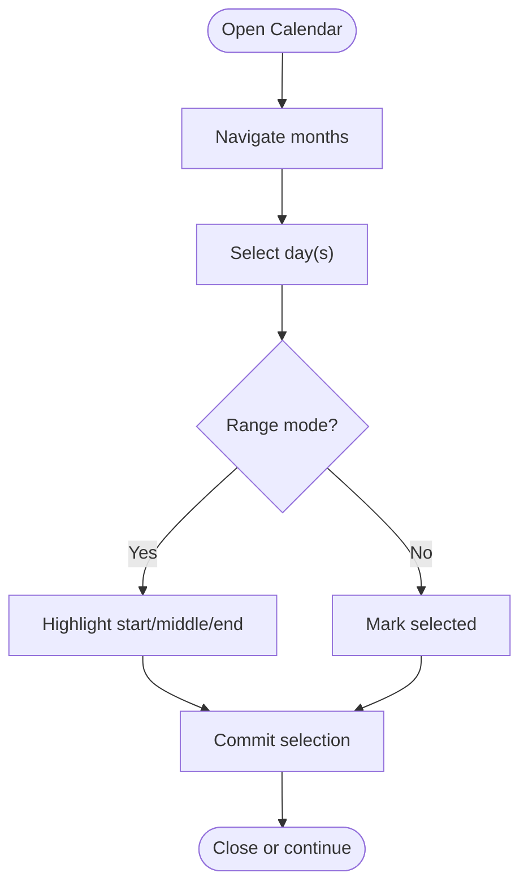
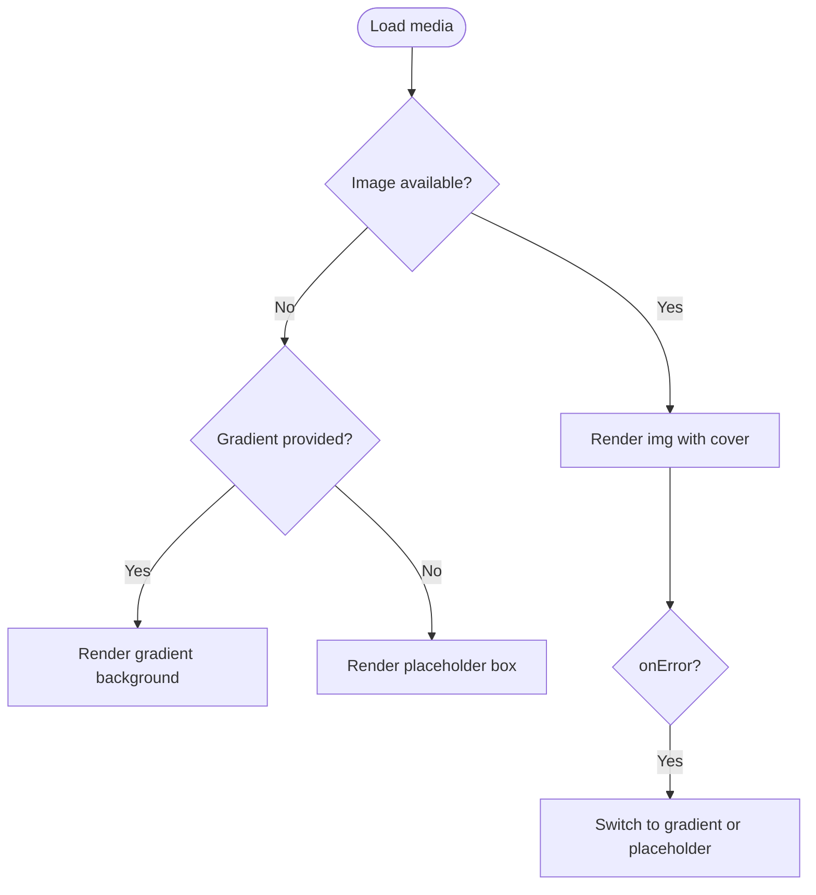
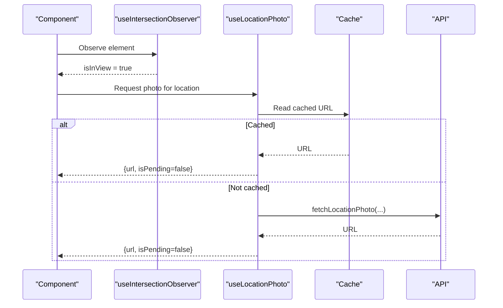
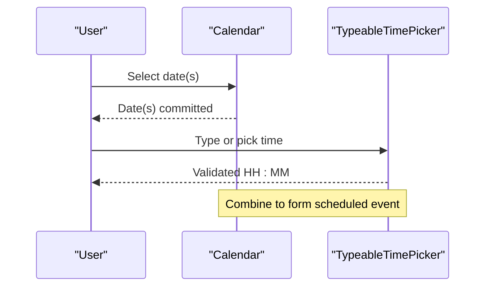
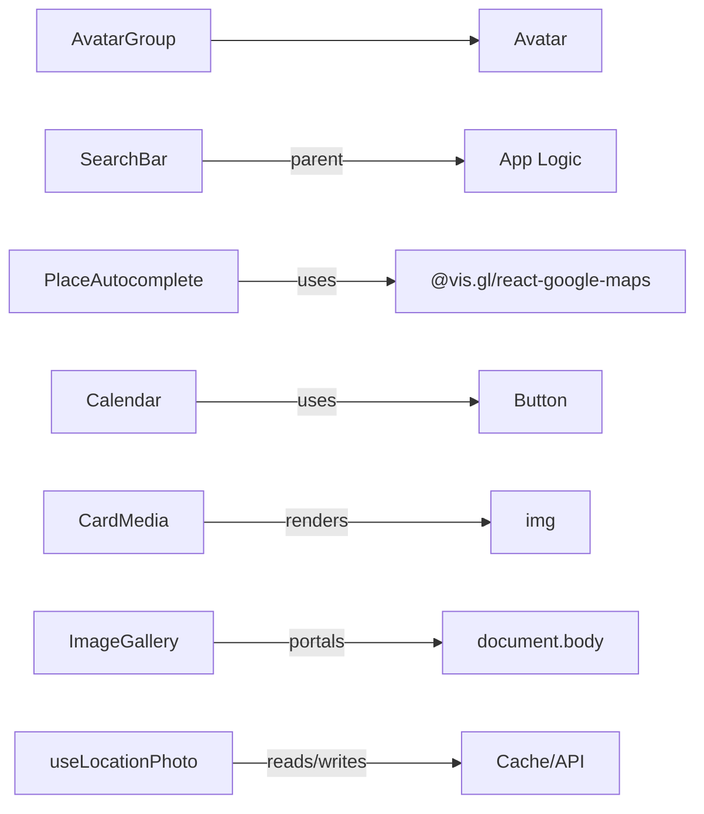

# Media Components

<cite>
**Referenced Files in This Document**
- [Avatar.tsx](file://src/components/ui/primitives/Avatar.tsx)
- [AvatarGroup.tsx](file://src/components/ui/primitives/AvatarGroup.tsx)
- [SearchBar.tsx](file://src/components/ui/primitives/SearchBar.tsx)
- [PlaceAutocomplete.tsx](file://src/components/ui/primitives/PlaceAutocomplete.tsx)
- [Calendar.tsx](file://src/components/ui/primitives/Calendar.tsx)
- [CardMedia.tsx](file://src/components/ui/cards/CardMedia.tsx)
- [ImageGallery.tsx](file://src/components/ui/modals/ImageGallery.tsx)
- [useIntersectionObserver.ts](file://src/hooks/useIntersectionObserver.ts)
- [useLocationPhoto.ts](file://src/hooks/useLocationPhoto.ts)
- [TypeableTimePicker.tsx](file://src/components/ui/detail-views/TypeableTimePicker.tsx)
</cite>

## Table of Contents
1. Introduction
2. Project Structure
3. Core Components
4. Architecture Overview
5. Detailed Component Analysis
6. Dependency Analysis
7. Performance Considerations
8. Troubleshooting Guide
9. Conclusion

## Introduction
This document explains the media and search primitive components that power rich content display and user discovery across the application. It focuses on:
- Avatar and AvatarGroup for identity presentation and profile displays
- SearchBar for general search experiences with debounced input and clear behavior
- PlaceAutocomplete for location-based autocomplete using Google Maps Places
- Calendar for date selection and scheduling interfaces, complemented by a time picker

You will learn how images are handled, how search algorithms and autocomplete patterns work, and how calendar integrations enable scheduling flows.

## Project Structure
The relevant primitives live under src/components/ui/primitives and are used throughout the app to build richer UIs such as cards, galleries, and itinerary views. Supporting hooks provide lazy loading and image fetching utilities.

**Diagram sources**
- [Avatar.tsx:1-127](file://src/components/ui/primitives/Avatar.tsx#L1-L127)
- [AvatarGroup.tsx:1-95](file://src/components/ui/primitives/AvatarGroup.tsx#L1-L95)
- [SearchBar.tsx:1-215](file://src/components/ui/primitives/SearchBar.tsx#L1-L215)
- [PlaceAutocomplete.tsx:1-351](file://src/components/ui/primitives/PlaceAutocomplete.tsx#L1-L351)
- [Calendar.tsx:1-164](file://src/components/ui/primitives/Calendar.tsx#L1-L164)
- [CardMedia.tsx:1-63](file://src/components/ui/cards/CardMedia.tsx#L1-L63)
- [ImageGallery.tsx:1-259](file://src/components/ui/modals/ImageGallery.tsx#L1-L259)
- [useIntersectionObserver.ts:1-28](file://src/hooks/useIntersectionObserver.ts#L1-L28)
- [useLocationPhoto.ts:1-65](file://src/hooks/useLocationPhoto.ts#L1-L65)
- [TypeableTimePicker.tsx:1-196](file://src/components/ui/detail-views/TypeableTimePicker.tsx#L1-L196)

**Section sources**
- [Avatar.tsx:1-127](file://src/components/ui/primitives/Avatar.tsx#L1-L127)
- [AvatarGroup.tsx:1-95](file://src/components/ui/primitives/AvatarGroup.tsx#L1-L95)
- [SearchBar.tsx:1-215](file://src/components/ui/primitives/SearchBar.tsx#L1-L215)
- [PlaceAutocomplete.tsx:1-351](file://src/components/ui/primitives/PlaceAutocomplete.tsx#L1-L351)
- [Calendar.tsx:1-164](file://src/components/ui/primitives/Calendar.tsx#L1-L164)
- [CardMedia.tsx:1-63](file://src/components/ui/cards/CardMedia.tsx#L1-L63)
- [ImageGallery.tsx:1-259](file://src/components/ui/modals/ImageGallery.tsx#L1-L259)
- [useIntersectionObserver.ts:1-28](file://src/hooks/useIntersectionObserver.ts#L1-L28)
- [useLocationPhoto.ts:1-65](file://src/hooks/useLocationPhoto.ts#L1-L65)
- [TypeableTimePicker.tsx:1-196](file://src/components/ui/detail-views/TypeableTimePicker.tsx#L1-L196)

## Core Components
- Avatar: Displays initials, images, or icons with consistent sizing and types. Supports fallback to initials when no image is provided.
- AvatarGroup: Stacks multiple Avatars with overlap and shows an overflow indicator for hidden items.
- SearchBar: Debounced text input with leading icon, clear button, keyboard support, and optional loading state.
- PlaceAutocomplete: Location autocomplete powered by Google Maps Places with prediction list, keyboard navigation, and details resolution.
- Calendar: Styled date picker supporting single and range selection with accessible controls and custom day buttons.

**Section sources**
- [Avatar.tsx:1-127](file://src/components/ui/primitives/Avatar.tsx#L1-L127)
- [AvatarGroup.tsx:1-95](file://src/components/ui/primitives/AvatarGroup.tsx#L1-L95)
- [SearchBar.tsx:1-215](file://src/components/ui/primitives/SearchBar.tsx#L1-L215)
- [PlaceAutocomplete.tsx:1-351](file://src/components/ui/primitives/PlaceAutocomplete.tsx#L1-L351)
- [Calendar.tsx:1-164](file://src/components/ui/primitives/Calendar.tsx#L1-L164)

## Architecture Overview
The components form a cohesive system:
- Identity layer: Avatar and AvatarGroup present users consistently across the app.
- Discovery layer: SearchBar provides fast, responsive search; PlaceAutocomplete integrates geolocation search via Google Maps.
- Scheduling layer: Calendar and TypeableTimePicker enable date and time selection for itineraries and bookings.
- Media layer: CardMedia and ImageGallery handle image rendering, fallbacks, and lightbox viewing. Lazy loading is supported via Intersection Observer and cached photo retrieval.

**Diagram sources**
- [SearchBar.tsx:109-156](file://src/components/ui/primitives/SearchBar.tsx#L109-L156)
- [PlaceAutocomplete.tsx:115-183](file://src/components/ui/primitives/PlaceAutocomplete.tsx#L115-L183)
- [CardMedia.tsx:30-62](file://src/components/ui/cards/CardMedia.tsx#L30-L62)
- [ImageGallery.tsx:169-253](file://src/components/ui/modals/ImageGallery.tsx#L169-L253)
- [Calendar.tsx:14-116](file://src/components/ui/primitives/Calendar.tsx#L14-L116)
- [TypeableTimePicker.tsx:53-195](file://src/components/ui/detail-views/TypeableTimePicker.tsx#L53-L195)

## Detailed Component Analysis

### Avatar
- Purpose: Render user identity as initials, image, or icon with consistent sizes and styles.
- Key behaviors:
  - Initials generation from name or explicit initials.
  - Image mode with object-fit cover and alt text.
  - Icon mode with size-aware icon sizing.
  - Variants for size and type, plus hover/active opacity states.
- Usage examples:
  - Profile chips in lists or headers.
  - Collaborator stacks inside AvatarGroup.

**Diagram sources**
- [Avatar.tsx:40-127](file://src/components/ui/primitives/Avatar.tsx#L40-L127)
- [AvatarGroup.tsx:25-95](file://src/components/ui/primitives/AvatarGroup.tsx#L25-L95)

**Section sources**
- [Avatar.tsx:1-127](file://src/components/ui/primitives/Avatar.tsx#L1-L127)
- [AvatarGroup.tsx:1-95](file://src/components/ui/primitives/AvatarGroup.tsx#L1-L95)

### SearchBar
- Purpose: Provide a compact, accessible search input with debounced callbacks and clear functionality.
- Key behaviors:
  - Debounced onChange to reduce request frequency.
  - Enter key triggers immediate submission.
  - Clear button resets controlled or internal value and fires onClear.
  - Loading spinner replaces icon while searching.
  - End slot for additional actions.
- Integration points:
  - Parent handles search logic (e.g., filtering, analytics).
  - Can be embedded in toolbars or nav bars.

**Diagram sources**
- [SearchBar.tsx:109-156](file://src/components/ui/primitives/SearchBar.tsx#L109-L156)
- [SearchBar.tsx:158-208](file://src/components/ui/primitives/SearchBar.tsx#L158-L208)

**Section sources**
- [SearchBar.tsx:1-215](file://src/components/ui/primitives/SearchBar.tsx#L1-L215)

### PlaceAutocomplete
- Purpose: Enable location search with predictive suggestions and detailed place resolution.
- Key behaviors:
  - Debounced input triggers predictions via Google Maps Places AutocompleteService.
  - Keyboard navigation (arrow keys, Enter, Escape) for accessibility.
  - Click-outside and scroll/resize dismiss dropdown.
  - Resolves selected prediction to structured PlaceResult (region, country, coordinates).
  - Tracks usage via analytics hook.
- Data flow:
  - Input → debounce → getPlacePredictions → render list → select → getDetails → extract result → callback.

**Diagram sources**
- [PlaceAutocomplete.tsx:115-183](file://src/components/ui/primitives/PlaceAutocomplete.tsx#L115-L183)
- [PlaceAutocomplete.tsx:186-241](file://src/components/ui/primitives/PlaceAutocomplete.tsx#L186-L241)
- [PlaceAutocomplete.tsx:254-340](file://src/components/ui/primitives/PlaceAutocomplete.tsx#L254-L340)

**Section sources**
- [PlaceAutocomplete.tsx:1-351](file://src/components/ui/primitives/PlaceAutocomplete.tsx#L1-L351)

### Calendar
- Purpose: Provide a styled date picker for single or range selection with accessible navigation.
- Key behaviors:
  - Customizable caption layout and navigation buttons.
  - Day buttons styled for selected, range start/middle/end, today, disabled, and outside days.
  - Integrates with Button primitives for consistent styling.
- Integration points:
  - Used in itinerary builders and scheduling forms.
  - Works alongside TypeableTimePicker for complete date/time selection.

**Diagram sources**
- [Calendar.tsx:14-116](file://src/components/ui/primitives/Calendar.tsx#L14-L116)
- [Calendar.tsx:118-161](file://src/components/ui/primitives/Calendar.tsx#L118-L161)

**Section sources**
- [Calendar.tsx:1-164](file://src/components/ui/primitives/Calendar.tsx#L1-L164)

### Media Handling: CardMedia and ImageGallery
- CardMedia:
  - Renders an image with aspect ratio control, falls back to gradient or placeholder on error.
  - Prevents default drag behavior and uses object-cover for consistent framing.
- ImageGallery:
  - Hero image plus thumbnail grid with “+N more” overlay.
  - Full-screen lightbox with keyboard navigation and aria attributes.
  - Uses portals for overlay rendering.

**Diagram sources**
- [CardMedia.tsx:30-62](file://src/components/ui/cards/CardMedia.tsx#L30-L62)
- [ImageGallery.tsx:169-253](file://src/components/ui/modals/ImageGallery.tsx#L169-L253)

**Section sources**
- [CardMedia.tsx:1-63](file://src/components/ui/cards/CardMedia.tsx#L1-L63)
- [ImageGallery.tsx:1-259](file://src/components/ui/modals/ImageGallery.tsx#L1-L259)

### Lazy Loading and Photo Fetching
- useIntersectionObserver:
  - Detects when an element enters the viewport to trigger lazy operations.
- useLocationPhoto:
  - Reads from cache first, then fetches if needed; exposes url and isPending to drive loading states.
- Combined pattern:
  - Use IntersectionObserver to defer photo requests until visible, then resolve via useLocationPhoto to show placeholders during pending.

**Diagram sources**
- [useIntersectionObserver.ts:1-28](file://src/hooks/useIntersectionObserver.ts#L1-L28)
- [useLocationPhoto.ts:21-64](file://src/hooks/useLocationPhoto.ts#L21-L64)

**Section sources**
- [useIntersectionObserver.ts:1-28](file://src/hooks/useIntersectionObserver.ts#L1-L28)
- [useLocationPhoto.ts:1-65](file://src/hooks/useLocationPhoto.ts#L1-L65)

### Scheduling: Calendar and TypeableTimePicker
- Calendar:
  - Provides date selection with range support and accessible controls.
- TypeableTimePicker:
  - Accepts typed times (“HH:MM”, “1430”, “14”) and validates against minTime constraints.
  - Offers a scrollable list of 10-minute intervals with auto-scroll to matches.
- Typical flow:
  - Select date(s) in Calendar, then choose start/end times in TypeableTimePicker to create scheduled activities.

**Diagram sources**
- [Calendar.tsx:14-116](file://src/components/ui/primitives/Calendar.tsx#L14-L116)
- [TypeableTimePicker.tsx:18-37](file://src/components/ui/detail-views/TypeableTimePicker.tsx#L18-L37)
- [TypeableTimePicker.tsx:53-195](file://src/components/ui/detail-views/TypeableTimePicker.tsx#L53-L195)

**Section sources**
- [Calendar.tsx:1-164](file://src/components/ui/primitives/Calendar.tsx#L1-L164)
- [TypeableTimePicker.tsx:1-196](file://src/components/ui/detail-views/TypeableTimePicker.tsx#L1-L196)

## Dependency Analysis
- Avatar depends on utility classes and Lucide icons; AvatarGroup composes multiple Avatars.
- SearchBar is self-contained but expects parent-provided onSearch logic.
- PlaceAutocomplete depends on Google Maps API via @vis.gl/react-google-maps and tracks analytics.
- Calendar composes Button primitives and react-day-picker internals.
- CardMedia and ImageGallery rely on standard HTML img and DOM portals.
- Hooks coordinate lazy loading and caching strategies.

**Diagram sources**
- [AvatarGroup.tsx:1-95](file://src/components/ui/primitives/AvatarGroup.tsx#L1-L95)
- [Avatar.tsx:1-127](file://src/components/ui/primitives/Avatar.tsx#L1-L127)
- [SearchBar.tsx:1-215](file://src/components/ui/primitives/SearchBar.tsx#L1-L215)
- [PlaceAutocomplete.tsx:1-351](file://src/components/ui/primitives/PlaceAutocomplete.tsx#L1-L351)
- [Calendar.tsx:1-164](file://src/components/ui/primitives/Calendar.tsx#L1-L164)
- [CardMedia.tsx:1-63](file://src/components/ui/cards/CardMedia.tsx#L1-L63)
- [ImageGallery.tsx:1-259](file://src/components/ui/modals/ImageGallery.tsx#L1-L259)
- [useLocationPhoto.ts:1-65](file://src/hooks/useLocationPhoto.ts#L1-L65)

**Section sources**
- [AvatarGroup.tsx:1-95](file://src/components/ui/primitives/AvatarGroup.tsx#L1-L95)
- [Avatar.tsx:1-127](file://src/components/ui/primitives/Avatar.tsx#L1-L127)
- [SearchBar.tsx:1-215](file://src/components/ui/primitives/SearchBar.tsx#L1-L215)
- [PlaceAutocomplete.tsx:1-351](file://src/components/ui/primitives/PlaceAutocomplete.tsx#L1-L351)
- [Calendar.tsx:1-164](file://src/components/ui/primitives/Calendar.tsx#L1-L164)
- [CardMedia.tsx:1-63](file://src/components/ui/cards/CardMedia.tsx#L1-L63)
- [ImageGallery.tsx:1-259](file://src/components/ui/modals/ImageGallery.tsx#L1-L259)
- [useLocationPhoto.ts:1-65](file://src/hooks/useLocationPhoto.ts#L1-L65)

## Performance Considerations
- Debouncing: Both SearchBar and PlaceAutocomplete debounce input to reduce network calls and improve responsiveness.
- Lazy loading: Use IntersectionObserver to defer heavy operations until elements are visible.
- Caching: useLocationPhoto reads from cache before network requests to minimize latency.
- Image fallbacks: CardMedia switches to gradients/placeholders on errors to avoid broken layouts.
- Portals: PlaceAutocomplete and ImageGallery use portals to ensure overlays render above other content without z-index conflicts.

[No sources needed since this section provides general guidance]

## Troubleshooting Guide
- Avatar image not showing:
  - Ensure src is valid and alt is set; verify type="image" and size variants.
  - Confirm container has sufficient dimensions; check CSS for overflow clipping.
- AvatarGroup truncation:
  - Adjust max prop to control visible count; verify negative margin overlap renders correctly.
- SearchBar not triggering search:
  - Verify onSearch is provided; check debounced timing; ensure Enter key handling is enabled.
  - For controlled inputs, ensure onChange updates the parent state.
- PlaceAutocomplete not opening:
  - Confirm Google Maps API key is configured; check placesLib availability.
  - Ensure minimum input length (two characters) before predictions are requested.
  - Validate click-outside listeners do not prematurely close the dropdown.
- Calendar selection issues:
  - Confirm modifiers (selected, range_start, range_end) are applied by parent logic.
  - Check custom classNames override any default styles unintentionally.
- Time picker validation:
  - Ensure minTime is set appropriately for end-time constraints.
  - Validate typed input formats; confirm commitDraft runs on blur/enter.

**Section sources**
- [Avatar.tsx:83-127](file://src/components/ui/primitives/Avatar.tsx#L83-L127)
- [AvatarGroup.tsx:49-95](file://src/components/ui/primitives/AvatarGroup.tsx#L49-L95)
- [SearchBar.tsx:109-208](file://src/components/ui/primitives/SearchBar.tsx#L109-L208)
- [PlaceAutocomplete.tsx:115-241](file://src/components/ui/primitives/PlaceAutocomplete.tsx#L115-L241)
- [Calendar.tsx:14-161](file://src/components/ui/primitives/Calendar.tsx#L14-L161)
- [TypeableTimePicker.tsx:18-195](file://src/components/ui/detail-views/TypeableTimePicker.tsx#L18-L195)

## Conclusion
These primitives deliver a robust foundation for media-rich interfaces and user discovery:
- Avatar and AvatarGroup standardize identity presentation.
- SearchBar and PlaceAutocomplete provide efficient, accessible search experiences.
- Calendar and TypeableTimePicker enable precise scheduling workflows.
- CardMedia and ImageGallery ensure resilient image handling with graceful fallbacks and immersive viewing.
- Hooks like useIntersectionObserver and useLocationPhoto optimize performance through lazy loading and caching.

Together, they support scalable, performant, and accessible user experiences across profiles, search, and scheduling contexts.

[No sources needed since this section summarizes without analyzing specific files]