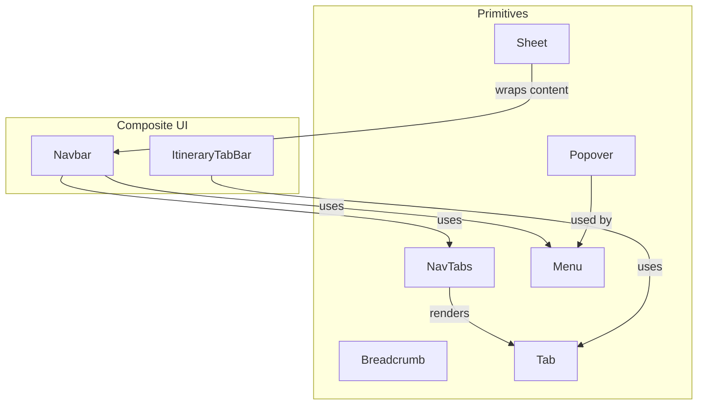
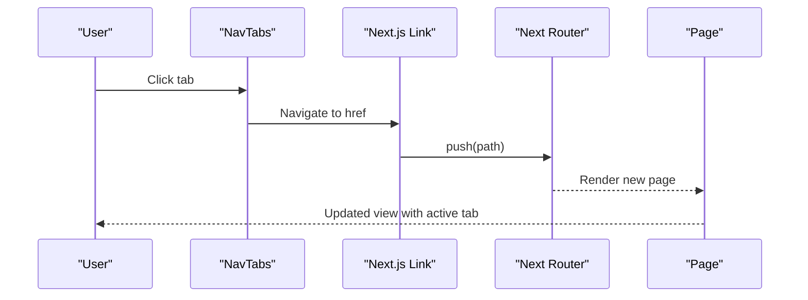
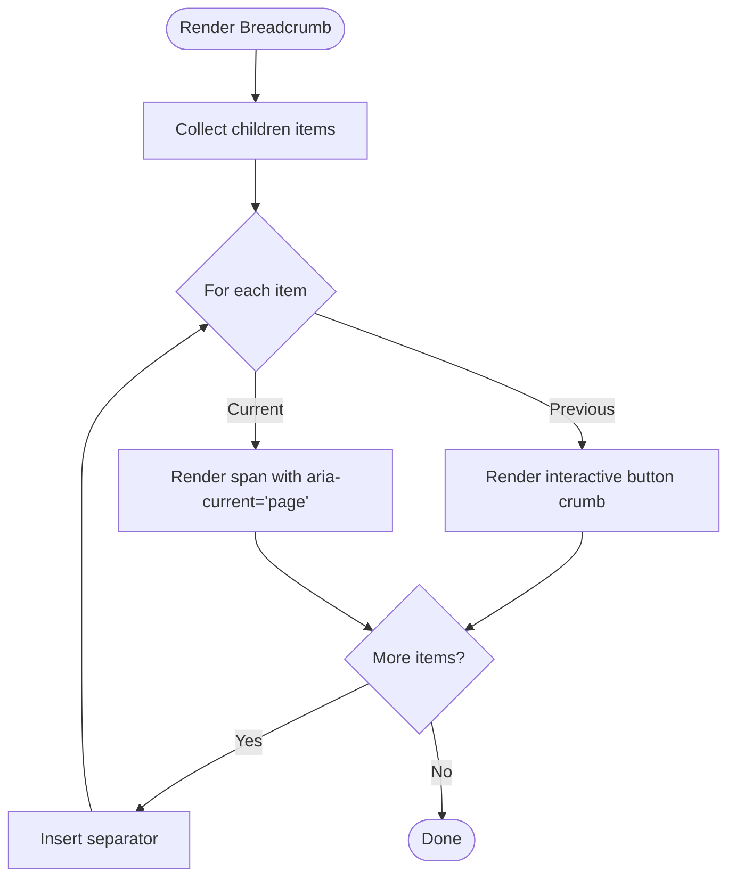
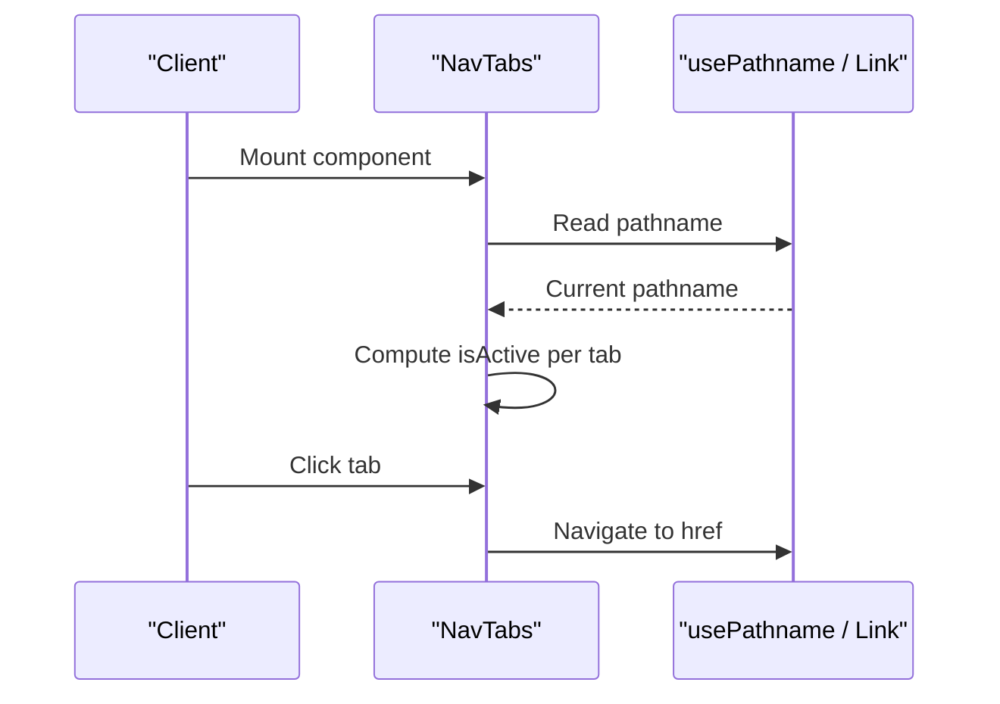
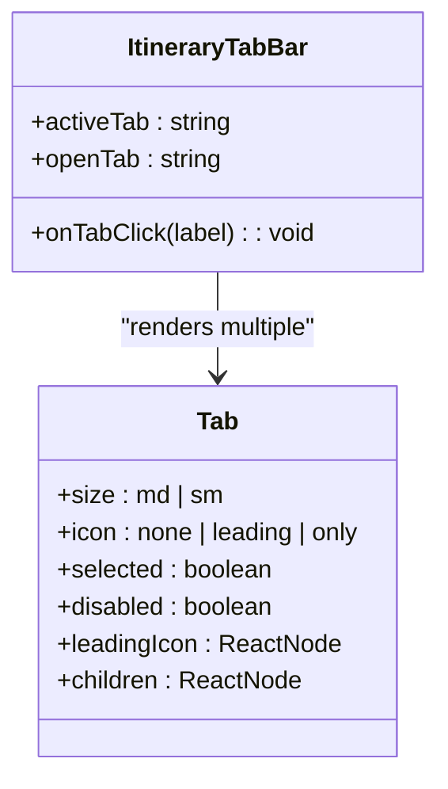
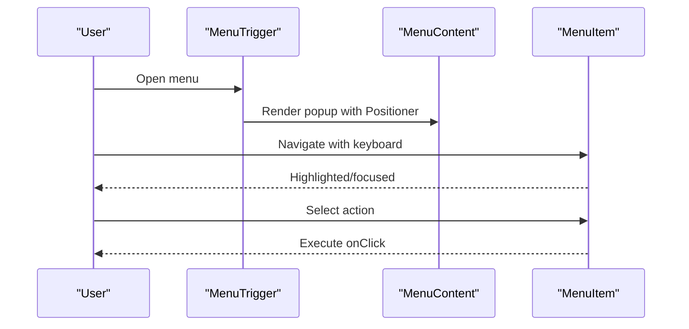
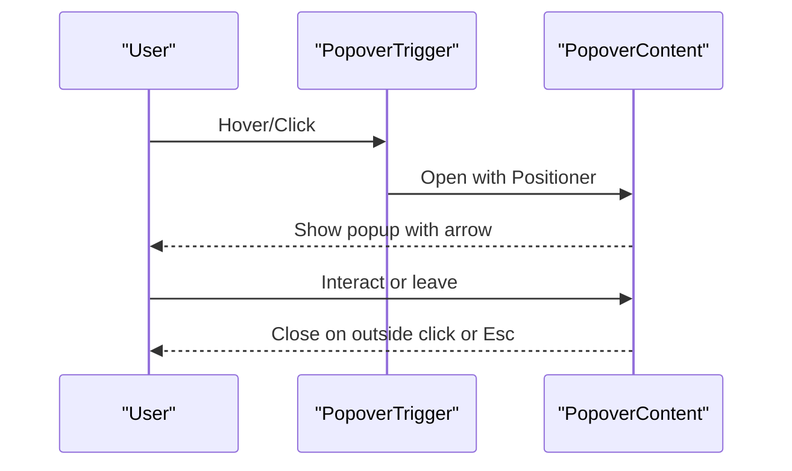
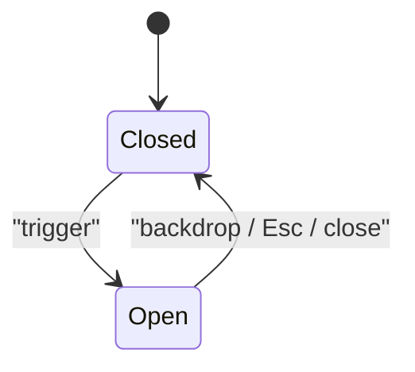
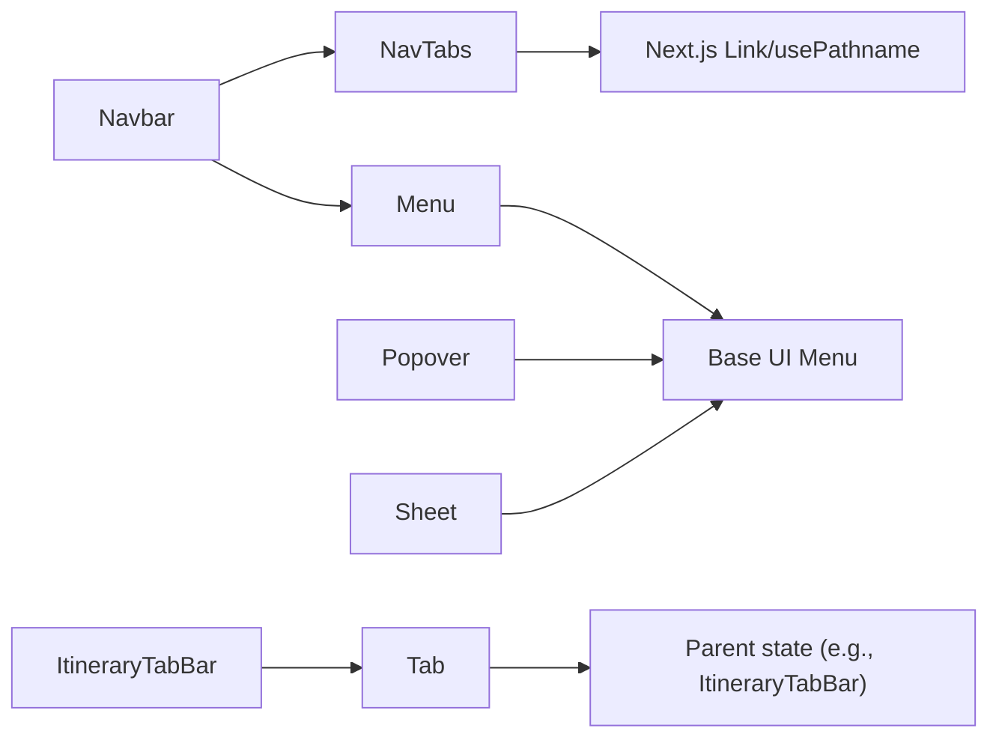

# Navigation Components

<cite>
**Referenced Files in This Document**
- [Breadcrumb.tsx](file://src/components/ui/primitives/Breadcrumb.tsx)
- [NavTabs.tsx](file://src/components/ui/primitives/NavTabs.tsx)
- [Tab.tsx](file://src/components/ui/primitives/Tab.tsx)
- [Menu.tsx](file://src/components/ui/primitives/Menu.tsx)
- [Popover.tsx](file://src/components/ui/primitives/Popover.tsx)
- [Sheet.tsx](file://src/components/ui/primitives/Sheet.tsx)
- [Navbar.tsx](file://src/components/ui/navbar/Navbar.tsx)
- [ItineraryTabBar.tsx](file://src/components/ui/itinerary/ItineraryTabBar.tsx)
</cite>

## Table of Contents
1. Introduction
2. Project Structure
3. Core Components
4. Architecture Overview
5. Detailed Component Analysis
6. Dependency Analysis
7. Performance Considerations
8. Troubleshooting Guide
9. Conclusion

## Introduction
This document explains the navigation and orientation primitive components used across the application: Breadcrumb, NavTabs, Tab, Menu, Popover, and Sheet. It covers their navigation patterns, state management, routing integration, tab switching logic, menu hierarchies, modal behaviors, accessibility features (keyboard navigation, focus management, screen reader support), and responsive design considerations. It also provides examples of complex navigation scenarios and best practices for building consistent user experiences.

## Project Structure
The primitives live under src/components/ui/primitives and are composed into higher-level UI like the Navbar and ItineraryTabBar. The primitives rely on Base UI primitives for robust behavior (menu, popover, dialog) and use class-variance-authority for styling variants. Routing is integrated via Next.js Link and usePathname for active states.

**Diagram sources**
- [NavTabs.tsx:26-67](file://src/components/ui/primitives/NavTabs.tsx#L26-L67)
- [Tab.tsx:50-82](file://src/components/ui/primitives/Tab.tsx#L50-L82)
- [Menu.tsx:192-241](file://src/components/ui/primitives/Menu.tsx#L192-L241)
- [Popover.tsx:97-183](file://src/components/ui/primitives/Popover.tsx#L97-L183)
- [Sheet.tsx:57-90](file://src/components/ui/primitives/Sheet.tsx#L57-L90)
- [Navbar.tsx:326-533](file://src/components/ui/navbar/Navbar.tsx#L326-L533)
- [ItineraryTabBar.tsx:37-90](file://src/components/ui/itinerary/ItineraryTabBar.tsx#L37-L90)

**Section sources**
- [NavTabs.tsx:26-67](file://src/components/ui/primitives/NavTabs.tsx#L26-L67)
- [Tab.tsx:50-82](file://src/components/ui/primitives/Tab.tsx#L50-L82)
- [Menu.tsx:192-241](file://src/components/ui/primitives/Menu.tsx#L192-L241)
- [Popover.tsx:97-183](file://src/components/ui/primitives/Popover.tsx#L97-L183)
- [Sheet.tsx:57-90](file://src/components/ui/primitives/Sheet.tsx#L57-L90)
- [Navbar.tsx:326-533](file://src/components/ui/navbar/Navbar.tsx#L326-L533)
- [ItineraryTabBar.tsx:37-90](file://src/components/ui/itinerary/ItineraryTabBar.tsx#L37-L90)

## Core Components
- Breadcrumb: Provides a navigable path with previous/current steps, separators, and accessible labeling.
- NavTabs: Top-level navigation tabs that integrate with Next.js routing and highlight the active route.
- Tab: Underline-style tab button intended to be paired with a tab panel manager; supports sizes, icons, and selection states.
- Menu: Accessible dropdown menus with items, separators, and descriptive items; built on Base UI for keyboard and focus management.
- Popover: Floating overlay with optional arrow, positioning, and collision handling; supports hover or click triggers.
- Sheet: Responsive overlay (bottom sheet on phone, side drawer on tablet+) using Dialog semantics for focus trapping and backdrop dismissal.

**Section sources**
- [Breadcrumb.tsx:105-127](file://src/components/ui/primitives/Breadcrumb.tsx#L105-L127)
- [NavTabs.tsx:26-67](file://src/components/ui/primitives/NavTabs.tsx#L26-L67)
- [Tab.tsx:50-82](file://src/components/ui/primitives/Tab.tsx#L50-L82)
- [Menu.tsx:192-241](file://src/components/ui/primitives/Menu.tsx#L192-L241)
- [Popover.tsx:97-183](file://src/components/ui/primitives/Popover.tsx#L97-L183)
- [Sheet.tsx:57-90](file://src/components/ui/primitives/Sheet.tsx#L57-L90)

## Architecture Overview
The navigation architecture combines URL-driven navigation (NavTabs) with local state-driven interactions (Tab, Menu, Popover, Sheet). Higher-level components like Navbar orchestrate these primitives to deliver a cohesive experience across devices.

**Diagram sources**
- [NavTabs.tsx:26-67](file://src/components/ui/primitives/NavTabs.tsx#L26-L67)
- [Navbar.tsx:326-533](file://src/components/ui/navbar/Navbar.tsx#L326-L533)

**Section sources**
- [NavTabs.tsx:26-67](file://src/components/ui/primitives/NavTabs.tsx#L26-L67)
- [Navbar.tsx:326-533](file://src/components/ui/navbar/Navbar.tsx#L326-L533)

## Detailed Component Analysis

### Breadcrumb
- Purpose: Show hierarchical navigation with current step emphasis and previous-step interactivity.
- Behavior: Renders an ordered list with auto-inserted separators; last item is non-interactive and marked as current.
- Accessibility: Uses aria-current="page" for the current crumb and aria-hidden for decorative separators; semantic nav and ol provide structure for assistive tech.
- Keyboard: Previous crumbs are buttons; focus ring is visible via focus-visible styles.
- Integration: Typically placed above content to orient users within deep routes.

**Diagram sources**
- [Breadcrumb.tsx:105-127](file://src/components/ui/primitives/Breadcrumb.tsx#L105-L127)

**Section sources**
- [Breadcrumb.tsx:10-79](file://src/components/ui/primitives/Breadcrumb.tsx#L10-L79)
- [Breadcrumb.tsx:81-95](file://src/components/ui/primitives/Breadcrumb.tsx#L81-L95)
- [Breadcrumb.tsx:105-127](file://src/components/ui/primitives/Breadcrumb.tsx#L105-L127)

### NavTabs
- Purpose: Primary site navigation with active state based on current pathname.
- Routing: Uses Next.js Link and usePathname to compute active state; supports disabled tabs.
- UX: Active tab uses stronger weight/color; inactive tabs gain emphasis on hover; width reservation prevents layout shift when font-weight changes.
- Accessibility: Wrapped in nav with aria-label; disabled tabs set aria-disabled and tabIndex -1.

**Diagram sources**
- [NavTabs.tsx:26-67](file://src/components/ui/primitives/NavTabs.tsx#L26-L67)

**Section sources**
- [NavTabs.tsx:8-19](file://src/components/ui/primitives/NavTabs.tsx#L8-L19)
- [NavTabs.tsx:26-67](file://src/components/ui/primitives/NavTabs.tsx#L26-L67)

### Tab
- Purpose: Underline-style tab button for tab strips; selection and interaction are controlled by parent state.
- States: Supports size (md/sm), icon placement (none/leading/only), selected/hover/disabled visual states; reserved bottom border avoids layout shifts.
- Accessibility: role="tab", aria-selected, aria-disabled; keyboard focus via outline-none but relies on parent tablist for full keyboard behavior.
- Usage: See ItineraryTabBar for a real-world composition pattern where selection and click handling are managed by the parent.

**Diagram sources**
- [Tab.tsx:39-82](file://src/components/ui/primitives/Tab.tsx#L39-L82)
- [ItineraryTabBar.tsx:37-90](file://src/components/ui/itinerary/ItineraryTabBar.tsx#L37-L90)

**Section sources**
- [Tab.tsx:11-37](file://src/components/ui/primitives/Tab.tsx#L11-L37)
- [Tab.tsx:50-82](file://src/components/ui/primitives/Tab.tsx#L50-L82)
- [ItineraryTabBar.tsx:37-90](file://src/components/ui/itinerary/ItineraryTabBar.tsx#L37-L90)

### Menu
- Purpose: Accessible dropdown menus with single/multi-level capability, item variants, and descriptive two-line items.
- Behavior: Built on Base UI Menu; supports alignment, side, sideOffset, and custom positioner z-index; items can be default or destructive; supports persistent selected state styling.
- Accessibility: Focus management, keyboard navigation, and highlighting handled by Base UI; separators group related actions.
- Integration: Used in Navbar for mobile menu and other contexts; can be nested or combined with Popover for richer overlays.

**Diagram sources**
- [Menu.tsx:192-241](file://src/components/ui/primitives/Menu.tsx#L192-L241)
- [Menu.tsx:246-301](file://src/components/ui/primitives/Menu.tsx#L246-L301)

**Section sources**
- [Menu.tsx:16-86](file://src/components/ui/primitives/Menu.tsx#L16-L86)
- [Menu.tsx:111-124](file://src/components/ui/primitives/Menu.tsx#L111-L124)
- [Menu.tsx:192-241](file://src/components/ui/primitives/Menu.tsx#L192-L241)
- [Menu.tsx:246-301](file://src/components/ui/primitives/Menu.tsx#L246-L301)
- [Menu.tsx:306-358](file://src/components/ui/primitives/Menu.tsx#L306-L358)

### Popover
- Purpose: Floating overlay anchored to a trigger or external anchor, with optional directional arrow and collision handling.
- Behavior: Supports openOnHover/delay, side/align/sideOffset, collisionPadding, and custom anchor ref; renders Portal to avoid stacking context issues.
- Accessibility: Focus ring on content; arrow positioned relative to resolved side; suitable for tooltips, help text, or quick actions.
- Integration: Often used alongside Menu or as standalone contextual info.

**Diagram sources**
- [Popover.tsx:97-183](file://src/components/ui/primitives/Popover.tsx#L97-L183)

**Section sources**
- [Popover.tsx:16-31](file://src/components/ui/primitives/Popover.tsx#L16-L31)
- [Popover.tsx:42-51](file://src/components/ui/primitives/Popover.tsx#L42-L51)
- [Popover.tsx:97-183](file://src/components/ui/primitives/Popover.tsx#L97-L183)

### Sheet
- Purpose: Responsive overlay container that presents as a bottom sheet on phones and a side drawer on tablets/desktops.
- Behavior: Wraps Base UI Dialog to provide focus trap, Escape-to-close, scroll lock, and backdrop dismissal; responsive side chosen via breakpoint hook.
- Accessibility: Screen-reader-only title and description; proper portal and backdrop semantics.
- Integration: Used for modals, panels, and mobile-first flows; composes well with Menu and Popover inside its content.

**Diagram sources**
- [Sheet.tsx:57-90](file://src/components/ui/primitives/Sheet.tsx#L57-L90)

**Section sources**
- [Sheet.tsx:10-26](file://src/components/ui/primitives/Sheet.tsx#L10-L26)
- [Sheet.tsx:57-90](file://src/components/ui/primitives/Sheet.tsx#L57-L90)

## Dependency Analysis
- NavTabs depends on Next.js Link and usePathname for routing and active state.
- Tab is presentation-only; selection and keyboard behavior are provided by consumers (e.g., ItineraryTabBar).
- Menu and Popover depend on Base UI primitives for robust behavior and accessibility.
- Sheet depends on Base UI Dialog and a breakpoint hook for responsive presentation.
- Navbar composes NavTabs, Menu, and other UI to form the top-level navigation shell.

**Diagram sources**
- [NavTabs.tsx:26-67](file://src/components/ui/primitives/NavTabs.tsx#L26-L67)
- [Tab.tsx:50-82](file://src/components/ui/primitives/Tab.tsx#L50-L82)
- [Menu.tsx:192-241](file://src/components/ui/primitives/Menu.tsx#L192-L241)
- [Popover.tsx:97-183](file://src/components/ui/primitives/Popover.tsx#L97-L183)
- [Sheet.tsx:57-90](file://src/components/ui/primitives/Sheet.tsx#L57-L90)
- [Navbar.tsx:326-533](file://src/components/ui/navbar/Navbar.tsx#L326-L533)
- [ItineraryTabBar.tsx:37-90](file://src/components/ui/itinerary/ItineraryTabBar.tsx#L37-L90)

**Section sources**
- [NavTabs.tsx:26-67](file://src/components/ui/primitives/NavTabs.tsx#L26-L67)
- [Tab.tsx:50-82](file://src/components/ui/primitives/Tab.tsx#L50-L82)
- [Menu.tsx:192-241](file://src/components/ui/primitives/Menu.tsx#L192-L241)
- [Popover.tsx:97-183](file://src/components/ui/primitives/Popover.tsx#L97-L183)
- [Sheet.tsx:57-90](file://src/components/ui/primitives/Sheet.tsx#L57-L90)
- [Navbar.tsx:326-533](file://src/components/ui/navbar/Navbar.tsx#L326-L533)
- [ItineraryTabBar.tsx:37-90](file://src/components/ui/itinerary/ItineraryTabBar.tsx#L37-L90)

## Performance Considerations
- Avoid unnecessary re-renders in NavTabs by memoizing tab lists and keeping configuration stable.
- Use lazy rendering for heavy menu/popover content; leverage portals to minimize DOM overhead in the main tree.
- Prefer CSS transitions and transforms for animations; respect reduced motion preferences where applicable.
- In large menus, virtualize long lists if needed to maintain smooth scrolling and input responsiveness.
- For Sheets, ensure content height constraints prevent excessive layout thrashing on small screens.

[No sources needed since this section provides general guidance]

## Troubleshooting Guide
- Active tab not highlighting: Ensure NavTabs receives correct href values and that the current pathname matches exactly or starts with the tab’s base path.
- Tab keyboard navigation not working: Tab is presentation-only; wrap it with a tablist and manage focus/selection in the parent (see ItineraryTabBar pattern).
- Menu items not receiving focus: Verify MenuContent is rendered and not clipped; check z-index and positionerClassName if nested in overlays.
- Popover clipping or misplacement: Adjust sideOffset, align, side, and collisionPadding; consider using anchor instead of trigger when needed.
- Sheet not trapping focus: Confirm Sheet wraps content with Dialog semantics; ensure no focus escapes to background elements.

**Section sources**
- [NavTabs.tsx:26-67](file://src/components/ui/primitives/NavTabs.tsx#L26-L67)
- [ItineraryTabBar.tsx:37-90](file://src/components/ui/itinerary/ItineraryTabBar.tsx#L37-L90)
- [Menu.tsx:192-241](file://src/components/ui/primitives/Menu.tsx#L192-L241)
- [Popover.tsx:97-183](file://src/components/ui/primitives/Popover.tsx#L97-L183)
- [Sheet.tsx:57-90](file://src/components/ui/primitives/Sheet.tsx#L57-L90)

## Conclusion
These primitives provide a consistent, accessible, and responsive foundation for navigation and orientation across the application. NavTabs integrates seamlessly with Next.js routing, while Tab offers flexible tab strip building blocks. Menu and Popover deliver rich, accessible overlays, and Sheet ensures mobile-first modal experiences. By composing these components thoughtfully, teams can build complex navigation patterns that are performant, accessible, and delightful to use.

[No sources needed since this section summarizes without analyzing specific files]