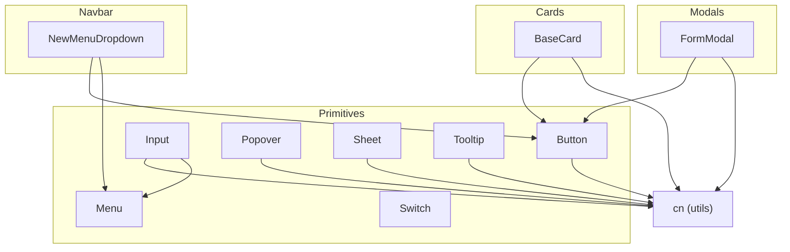
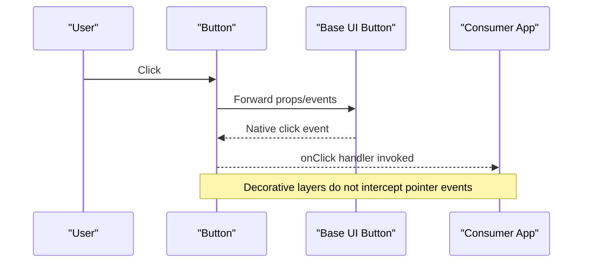
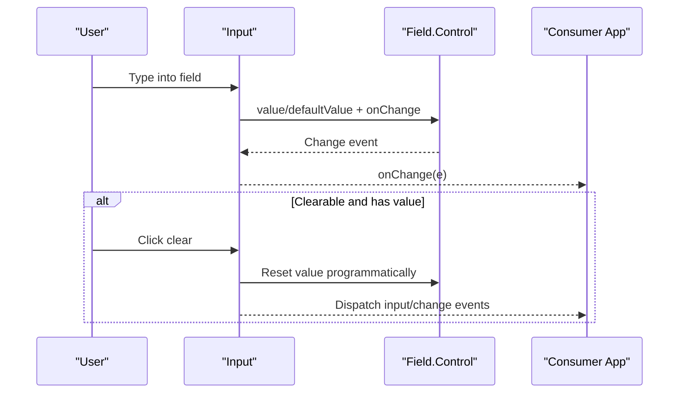
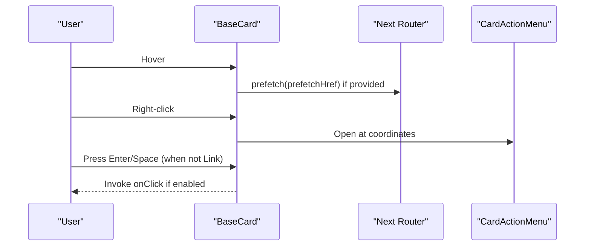
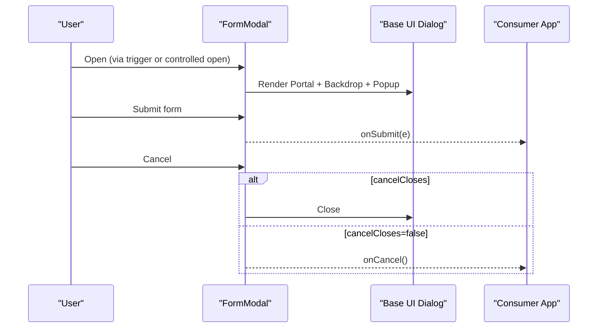
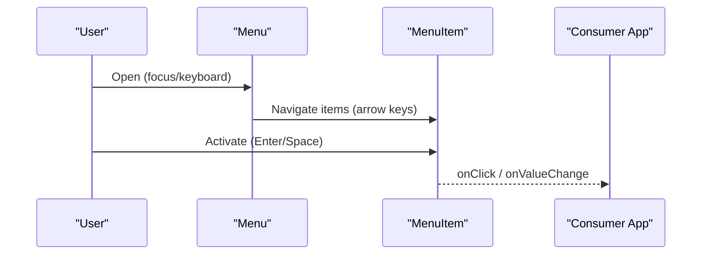
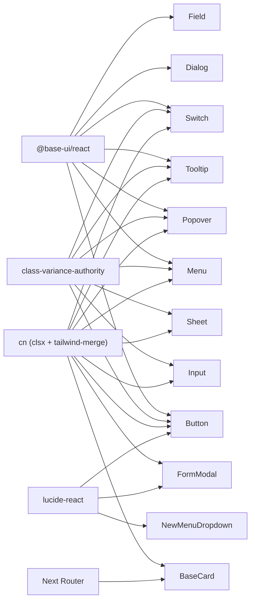

# Primitive Components

<cite>
**Referenced Files in This Document**
- [Button.tsx](file://src/components/ui/primitives/Button.tsx)
- [Input.tsx](file://src/components/ui/primitives/Input.tsx)
- [BaseCard.tsx](file://src/components/ui/cards/BaseCard.tsx)
- [FormModal.tsx](file://src/components/ui/modals/FormModal.tsx)
- [Menu.tsx](file://src/components/ui/primitives/Menu.tsx)
- [Popover.tsx](file://src/components/ui/primitives/Popover.tsx)
- [Sheet.tsx](file://src/components/ui/primitives/Sheet.tsx)
- [Tooltip.tsx](file://src/components/ui/primitives/Tooltip.tsx)
- [Switch.tsx](file://src/components/ui/primitives/Switch.tsx)
- [NewMenuDropdown.tsx](file://src/components/ui/navbar/NewMenuDropdown.tsx)
- [utils.ts](file://src/lib/utils.ts)
</cite>

## Table of Contents
1. [Introduction](#introduction)
2. [Project Structure](#project-structure)
3. [Core Components](#core-components)
4. [Architecture Overview](#architecture-overview)
5. [Detailed Component Analysis](#detailed-component-analysis)
6. [Dependency Analysis](#dependency-analysis)
7. [Performance Considerations](#performance-considerations)
8. [Troubleshooting Guide](#troubleshooting-guide)
9. [Conclusion](#conclusion)

## Introduction
This document describes the primitive component layer that underpins the UI system. It focuses on foundational building blocks such as Button, Input, Card, Modal, and Dropdown (menu-driven), explaining their props interfaces, default behaviors, customization options, composition patterns, event handling, state management, accessibility features, keyboard navigation, focus management, and styling approaches using Tailwind CSS classes and CSS-in-JS via class-variance-authority. Usage examples demonstrate common patterns and advanced customization scenarios.

## Project Structure
The primitives live under src/components/ui/primitives and are composed with Base UI primitives for robust behavior and accessibility. Cards are organized under src/components/ui/cards, while modals and dropdowns are implemented in dedicated folders but rely on shared primitives. A utility function cn merges Tailwind classes deterministically.

**Diagram sources**
- [Button.tsx:1-132](file://src/components/ui/primitives/Button.tsx#L1-L132)
- [Input.tsx:1-513](file://src/components/ui/primitives/Input.tsx#L1-L513)
- [BaseCard.tsx:1-211](file://src/components/ui/cards/BaseCard.tsx#L1-L211)
- [FormModal.tsx:1-224](file://src/components/ui/modals/FormModal.tsx#L1-L224)
- [Menu.tsx:1-384](file://src/components/ui/primitives/Menu.tsx#L1-L384)
- [Popover.tsx:1-200](file://src/components/ui/primitives/Popover.tsx#L1-L200)
- [Sheet.tsx:1-97](file://src/components/ui/primitives/Sheet.tsx#L1-L97)
- [Tooltip.tsx:1-185](file://src/components/ui/primitives/Tooltip.tsx#L1-L185)
- [Switch.tsx:1-104](file://src/components/ui/primitives/Switch.tsx#L1-L104)
- [NewMenuDropdown.tsx:1-73](file://src/components/ui/navbar/NewMenuDropdown.tsx#L1-L73)
- [utils.ts:1-7](file://src/lib/utils.ts#L1-L7)

**Section sources**
- [Button.tsx:1-132](file://src/components/ui/primitives/Button.tsx#L1-L132)
- [Input.tsx:1-513](file://src/components/ui/primitives/Input.tsx#L1-L513)
- [BaseCard.tsx:1-211](file://src/components/ui/cards/BaseCard.tsx#L1-L211)
- [FormModal.tsx:1-224](file://src/components/ui/modals/FormModal.tsx#L1-L224)
- [Menu.tsx:1-384](file://src/components/ui/primitives/Menu.tsx#L1-L384)
- [Popover.tsx:1-200](file://src/components/ui/primitives/Popover.tsx#L1-L200)
- [Sheet.tsx:1-97](file://src/components/ui/primitives/Sheet.tsx#L1-L97)
- [Tooltip.tsx:1-185](file://src/components/ui/primitives/Tooltip.tsx#L1-L185)
- [Switch.tsx:1-104](file://src/components/ui/primitives/Switch.tsx#L1-L104)
- [NewMenuDropdown.tsx:1-73](file://src/components/ui/navbar/NewMenuDropdown.tsx#L1-L73)
- [utils.ts:1-7](file://src/lib/utils.ts#L1-L7)

## Core Components
This section summarizes each primitive’s purpose, props, defaults, and key behaviors.

- Button
  - Purpose: Primary interactive element with variants, sizes, and icon placement.
  - Props: variant (primary, secondary, ghost, outline, dark), size (xs, sm, md), icon (none, leading, trailing, only), plus all underlying button props; className and children.
  - Defaults: primary, md, none.
  - Behavior: Uses Base UI Button for semantics; layered decoration for filled variants; focus-visible ring and disabled states.
  - Accessibility: Keyboard focusable, visible focus ring, aria-hidden decorations.
  - Styling: Tailwind + class-variance-authority; uses design tokens via CSS variables.

- Input
  - Purpose: Text input with optional leading/trailing icons, clear button, and a dropdown selector mode.
  - Props: variant (default, underline), size (sm, md), icon slots, value/defaultValue, placeholder, clearable, onClear, trailingIcon, aria-invalid, onChange, plus Field.Control props.
  - Defaults: default, md, no icons, not clearable by default unless enabled.
  - Behavior: Controlled/uncontrolled support; internal has-value tracking; clear button triggers input events; showDropdown delegates to DropdownSelector.
  - Accessibility: aria-invalid propagation; clear button has aria-label; keyboard-friendly.
  - Styling: CVA-based variants; inner shadow and focus rings; responsive padding based on icon presence.

- Card (BaseCard)
  - Purpose: Shared card shell with media area, header label, category badge, and optional action menu.
  - Props: cardClass, media, label, iconVariant, href/prefetchHref, onClick, onDelete/onAddToCollection/onAddToItinerary, disabled, isSelected/isSelectingMode.
  - Defaults: No actions; link or button wrapper depending on href.
  - Behavior: Renders Link when href provided; otherwise renders div with role="button" and Enter/Space activation; right-click opens context menu; hover prefetches route if prefetchHref set.
  - Accessibility: Focusable when used as button; aria-disabled; semantic Link when navigational.
  - Styling: Consistent border, background, focus ring; selection highlight; group hover effects.

- Modal (FormModal)
  - Purpose: Accessible dialog for forms with title, description, form content slot, and submit/cancel buttons.
  - Props: trigger, open, onOpenChange, icon/stickerUrl, title, description, children, cancelLabel, submitLabel, submittingLabel, onSubmit, onCancel, cancelCloses, submitDisabled, isSubmitting.
  - Defaults: Cancel closes; primary submit; loading spinner during submission.
  - Behavior: Uses Base UI Dialog; mobile sheet presentation on phone; portal-backed overlay; form wrapping for native submission.
  - Accessibility: Dialog semantics, title/description, focus trap, backdrop dismiss, Esc key support.
  - Styling: Responsive layout; branded icon treatments; consistent spacing and typography.

- Dropdown (Menu-based)
  - Purpose: Menu-driven dropdowns for selections and actions.
  - Props: Root Menu props; MenuContent alignment/side/offset; MenuItem sizes/variants/icons; DescriptiveMenuItem for two-line items.
  - Defaults: End-aligned, small items, transparent borders to avoid layout shift.
  - Behavior: Portal-based positioning; highlighted state for keyboard navigation; selected persistent style.
  - Accessibility: Keyboard navigation, focus management, ARIA roles via Base UI.
  - Styling: CVA-based item/content variants; consistent spacing and shadows.

Additional primitives used across the system:
- Popover: Floating content with optional arrow and anchor support.
- Sheet: Side/bottom drawer with dialog semantics and responsive behavior.
- Tooltip: Lightweight floating text with configurable delay and directional arrow.
- Switch: Toggle control with track/thumb variants and accessible state.

**Section sources**
- [Button.tsx:69-132](file://src/components/ui/primitives/Button.tsx#L69-L132)
- [Input.tsx:93-278](file://src/components/ui/primitives/Input.tsx#L93-L278)
- [BaseCard.tsx:20-211](file://src/components/ui/cards/BaseCard.tsx#L20-L211)
- [FormModal.tsx:50-224](file://src/components/ui/modals/FormModal.tsx#L50-L224)
- [Menu.tsx:130-384](file://src/components/ui/primitives/Menu.tsx#L130-L384)
- [Popover.tsx:57-200](file://src/components/ui/primitives/Popover.tsx#L57-L200)
- [Sheet.tsx:30-97](file://src/components/ui/primitives/Sheet.tsx#L30-L97)
- [Tooltip.tsx:63-185](file://src/components/ui/primitives/Tooltip.tsx#L63-L185)
- [Switch.tsx:37-104](file://src/components/ui/primitives/Switch.tsx#L37-L104)

## Architecture Overview
The primitives compose higher-level components through a consistent pattern:
- Base UI primitives provide semantics, focus management, and keyboard navigation.
- CVA defines visual variants and compound variants for consistent styling.
- The cn utility merges Tailwind classes safely.
- Consumers customize via props and className overrides.

**Diagram sources**
- [Button.tsx:86-127](file://src/components/ui/primitives/Button.tsx#L86-L127)

**Diagram sources**
- [Input.tsx:147-274](file://src/components/ui/primitives/Input.tsx#L147-L274)

**Diagram sources**
- [BaseCard.tsx:111-203](file://src/components/ui/cards/BaseCard.tsx#L111-L203)

**Diagram sources**
- [FormModal.tsx:78-217](file://src/components/ui/modals/FormModal.tsx#L78-L217)

**Diagram sources**
- [Menu.tsx:192-300](file://src/components/ui/primitives/Menu.tsx#L192-L300)

## Detailed Component Analysis

### Button
- Props interface: Extends Base UI Button props with variant, size, icon, className, children.
- Default behaviors: Primary variant, medium size, no icon; fills use layered backgrounds and borders; disabled disables pointer events and reduces opacity.
- Customization: Use variants for color schemes; sizes for compactness; icon placement for leading/trailing icons; className for overrides.
- Event handling: Forwards all props/events to Base UI Button; decorative spans are non-interactive.
- State management: None beyond disabled state; relies on Base UI for focus/active states.
- Accessibility: Focus-visible ring; aria-hidden decorations; keyboard operable.
- Styling: Tailwind + CVA; motion variables for transitions; brand tokens for colors.

Usage examples
- Basic usage: Provide children and optional className.
- Icon-only: Set icon="only" with xs/sm/md sizes.
- Ghost/outline: Use for secondary actions or outlines.
- Disabled: Pass disabled prop to prevent interaction.

**Section sources**
- [Button.tsx:9-42](file://src/components/ui/primitives/Button.tsx#L9-L42)
- [Button.tsx:69-132](file://src/components/ui/primitives/Button.tsx#L69-L132)

### Input
- Props interface: Supports default/underline variants, sizes, icon slots, controlled/uncontrolled value, clearable, trailingIcon, aria-invalid, onChange, plus Field.Control attributes.
- Default behaviors: Default variant with rounded borders and focus ring; md size; no icons by default; clearable can be toggled.
- Customization: Adjust icon slots for leading/trailing icons; use underline for minimal inputs; pass custom inputClassName/iconClassName/trailingIconClassName.
- Event handling: Handles change events; clears value and dispatches input/change events when clearing; supports controlled updates.
- State management: Tracks hasValue internally for uncontrolled mode; syncs with controlled value.
- Accessibility: aria-invalid propagated; clear button labeled; keyboard-friendly.
- Styling: CVA variants; inner shadow when hasValue; focus-within styles; asymmetric padding based on icon presence.

Usage examples
- Simple text input: Provide placeholder and onChange.
- With leading/trailing icons: Pass icon and/or trailingIcon.
- Clearable: Enable clearable and handle onClear or let it reset automatically.
- Dropdown mode: Use showDropdown to render DropdownSelector.

**Section sources**
- [Input.tsx:11-70](file://src/components/ui/primitives/Input.tsx#L11-L70)
- [Input.tsx:93-278](file://src/components/ui/primitives/Input.tsx#L93-L278)
- [Input.tsx:280-405](file://src/components/ui/primitives/Input.tsx#L280-L405)

### BaseCard
- Props interface: cardClass, media, label, iconVariant, href/prefetchHref, onClick, action callbacks, disabled, isSelected/isSelectingMode.
- Default behaviors: Renders Link when href provided; otherwise renders a focusable div with role="button"; shows kebab menu when actions provided; highlights when selected.
- Customization: Supply media slot; configure iconVariant for CategoryBadge; add actions for delete/add-to-collection/add-to-itinerary; enable selection modes.
- Event handling: Opens context menu on right-click; prefetches routes on hover; handles Enter/Space activation when used as button.
- State management: Local state for menu open and coordinates; disabled state affects interactivity.
- Accessibility: Focusable when acting as button; aria-disabled; semantic Link when navigational; keyboard activation supported.
- Styling: Consistent border/background/focus ring; hover and selected states; group hover reveals menu button.

Usage examples
- Navigational card: Provide href and media; label and iconVariant.
- Actionable card: Provide onClick and action callbacks; display kebab menu.
- Selection mode: Set isSelected/isSelectingMode for multi-select visuals.

**Section sources**
- [BaseCard.tsx:13-18](file://src/components/ui/cards/BaseCard.tsx#L13-L18)
- [BaseCard.tsx:20-50](file://src/components/ui/cards/BaseCard.tsx#L20-L50)
- [BaseCard.tsx:57-203](file://src/components/ui/cards/BaseCard.tsx#L57-L203)

### FormModal
- Props interface: trigger, open, onOpenChange, icon/stickerUrl, title, description, children, cancelLabel, submitLabel, submittingLabel, onSubmit, onCancel, cancelCloses, submitDisabled, isSubmitting.
- Default behaviors: Cancel closes by default; submit button disabled while submitting; mobile sheet presentation on phones.
- Customization: Replace icon with stickerUrl; customize labels; disable submit; control open state externally.
- Event handling: Submits form via onSubmit; cancels via onCancel or Dialog.Close; shows loading indicator during submission.
- State management: Uses Base UI Dialog for open/close; responsive breakpoint for mobile sheet.
- Accessibility: Dialog semantics, title/description, focus trap, backdrop dismiss, Esc key support.
- Styling: Branded icon treatments; responsive layout; consistent spacing and typography.

Usage examples
- Simple form: Provide title, description, children with form fields, and onSubmit.
- Wizard step: Set cancelCloses=false to treat cancel as back.
- Loading state: Pass isSubmitting to show spinner and disable submit.

**Section sources**
- [FormModal.tsx:12-48](file://src/components/ui/modals/FormModal.tsx#L12-L48)
- [FormModal.tsx:50-224](file://src/components/ui/modals/FormModal.tsx#L50-L224)

### Menu (Dropdown)
- Props interface: MenuRoot, MenuTrigger, MenuContent (align, side, sideOffset, positionerClassName), MenuItem (size, variant, icon, selected), DescriptiveMenuItem (title, description, leadingIcon).
- Default behaviors: End-aligned content; small items; transparent borders to avoid layout shift; highlighted state for keyboard navigation.
- Customization: Choose sizes and variants; add leading/trailing icons; mark selected items; adjust alignment and offsets.
- Event handling: Items respond to clicks; selected state persists visually.
- State management: Relies on Base UI for focus/highlighted state; consumers manage selection if needed.
- Accessibility: Keyboard navigation, focus management, ARIA roles via Base UI.
- Styling: CVA-based variants; consistent spacing and shadows; fixed widths for certain layouts.

Usage examples
- Simple list: Wrap items in MenuContent with MenuItem entries.
- Descriptive items: Use DescriptiveMenuItem for two-line entries with titles and descriptions.
- Anchored menu: Configure align/side/sideOffset for precise placement.

**Section sources**
- [Menu.tsx:16-86](file://src/components/ui/primitives/Menu.tsx#L16-L86)
- [Menu.tsx:130-183](file://src/components/ui/primitives/Menu.tsx#L130-L183)
- [Menu.tsx:192-300](file://src/components/ui/primitives/Menu.tsx#L192-L300)
- [Menu.tsx:306-358](file://src/components/ui/primitives/Menu.tsx#L306-L358)

### Additional Primitives
- Popover: Floating content with optional arrow and anchor; supports hover-triggered opening and delays.
- Sheet: Side/bottom drawer with dialog semantics; responsive presentation; sr-only title/description.
- Tooltip: Lightweight floating text with configurable delay and directional arrow; provider centralizes timing.
- Switch: Toggle control with track/thumb variants; accessible checked state; focus-visible ring.

Usage examples
- Popover: Wrap trigger with PopoverTrigger and content with PopoverContent; optionally add arrow.
- Sheet: Provide open/onOpenChange and children; optional trigger; title for accessibility.
- Tooltip: Wrap trigger with TooltipTrigger and content with TooltipContent; configure side/align/offset.
- Switch: Provide checked/defaultChecked and onCheckedChange; optional label for aria-label.

**Section sources**
- [Popover.tsx:57-200](file://src/components/ui/primitives/Popover.tsx#L57-L200)
- [Sheet.tsx:30-97](file://src/components/ui/primitives/Sheet.tsx#L30-L97)
- [Tooltip.tsx:63-185](file://src/components/ui/primitives/Tooltip.tsx#L63-L185)
- [Switch.tsx:37-104](file://src/components/ui/primitives/Switch.tsx#L37-L104)

## Dependency Analysis
- Base UI integration: All interactive primitives delegate core behavior to Base UI components (Button, Dialog, Menu, Popover, Tooltip, Switch, Field).
- Styling: class-variance-authority defines variants; Tailwind CSS provides utility classes; cn merges classes deterministically.
- Composition: Higher-level components (BaseCard, FormModal, NewMenuDropdown) compose primitives and utilities.
- External dependencies: Next.js router for prefetch/navigation; lucide-react icons; Base UI for semantics and focus management.

**Diagram sources**
- [Button.tsx:3-7](file://src/components/ui/primitives/Button.tsx#L3-L7)
- [Input.tsx:3-9](file://src/components/ui/primitives/Input.tsx#L3-L9)
- [BaseCard.tsx:3-11](file://src/components/ui/cards/BaseCard.tsx#L3-L11)
- [FormModal.tsx:3-10](file://src/components/ui/modals/FormModal.tsx#L3-L10)
- [Menu.tsx:3-10](file://src/components/ui/primitives/Menu.tsx#L3-L10)
- [Popover.tsx:3-10](file://src/components/ui/primitives/Popover.tsx#L3-L10)
- [Sheet.tsx:3-8](file://src/components/ui/primitives/Sheet.tsx#L3-L8)
- [Tooltip.tsx:3-9](file://src/components/ui/primitives/Tooltip.tsx#L3-L9)
- [Switch.tsx:3-7](file://src/components/ui/primitives/Switch.tsx#L3-L7)
- [utils.ts:1-7](file://src/lib/utils.ts#L1-L7)

**Section sources**
- [Button.tsx:3-7](file://src/components/ui/primitives/Button.tsx#L3-L7)
- [Input.tsx:3-9](file://src/components/ui/primitives/Input.tsx#L3-L9)
- [BaseCard.tsx:3-11](file://src/components/ui/cards/BaseCard.tsx#L3-L11)
- [FormModal.tsx:3-10](file://src/components/ui/modals/FormModal.tsx#L3-L10)
- [Menu.tsx:3-10](file://src/components/ui/primitives/Menu.tsx#L3-L10)
- [Popover.tsx:3-10](file://src/components/ui/primitives/Popover.tsx#L3-L10)
- [Sheet.tsx:3-8](file://src/components/ui/primitives/Sheet.tsx#L3-L8)
- [Tooltip.tsx:3-9](file://src/components/ui/primitives/Tooltip.tsx#L3-L9)
- [Switch.tsx:3-7](file://src/components/ui/primitives/Switch.tsx#L3-L7)
- [utils.ts:1-7](file://src/lib/utils.ts#L1-L7)

## Performance Considerations
- Avoid unnecessary re-renders: Keep Input controlled only when necessary; prefer uncontrolled with defaultValue for simple cases.
- Minimize DOM overhead: Decorative spans in Button are non-interactive and hidden from screen readers to reduce noise.
- Efficient positioning: Menu/Popover/Tooltip use portals and positioners to avoid layout thrashing; configure collisionPadding appropriately.
- Prefetching: BaseCard prefetches routes on hover to improve perceived performance.
- Motion variables: Use design tokens for consistent animations without heavy recalculations.

[No sources needed since this section provides general guidance]

## Troubleshooting Guide
- Input not clearing: Ensure clearable is true and either onClear is handled or the internal clear logic runs; verify value/defaultValue usage for controlled vs uncontrolled.
- Menu not closing after action: Actions in BaseCard close the menu before invoking handlers; ensure consumer handlers do not reopen unintentionally.
- Modal not trapping focus: Confirm Dialog.Root is used and content is within Dialog.Popup; avoid custom focus traps that conflict with Base UI.
- Tooltip/Popover misplacement: Adjust side, align, sideOffset, and collisionPadding; use anchor prop when positioning relative to a specific element.
- Switch not updating: Ensure checked/defaultChecked and onCheckedChange are properly wired; check disabled state.

**Section sources**
- [Input.tsx:170-186](file://src/components/ui/primitives/Input.tsx#L170-L186)
- [BaseCard.tsx:107-109](file://src/components/ui/cards/BaseCard.tsx#L107-L109)
- [FormModal.tsx:101-217](file://src/components/ui/modals/FormModal.tsx#L101-L217)
- [Menu.tsx:214-240](file://src/components/ui/primitives/Menu.tsx#L214-L240)
- [Popover.tsx:126-183](file://src/components/ui/primitives/Popover.tsx#L126-L183)
- [Tooltip.tsx:135-171](file://src/components/ui/primitives/Tooltip.tsx#L135-L171)
- [Switch.tsx:47-97](file://src/components/ui/primitives/Switch.tsx#L47-L97)

## Conclusion
The primitive layer provides a cohesive, accessible, and customizable foundation for the UI system. By leveraging Base UI for semantics and focus management, CVA for variant-driven styling, and Tailwind for utility classes, these components deliver consistent behavior and appearance across the application. They support keyboard navigation, screen reader compatibility, and flexible composition patterns, enabling both simple and advanced use cases with minimal effort.

[No sources needed since this section summarizes without analyzing specific files]