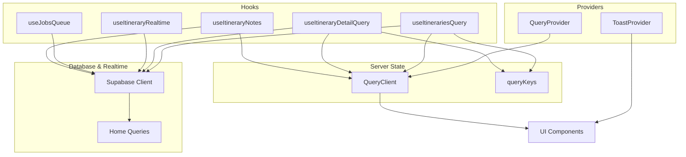
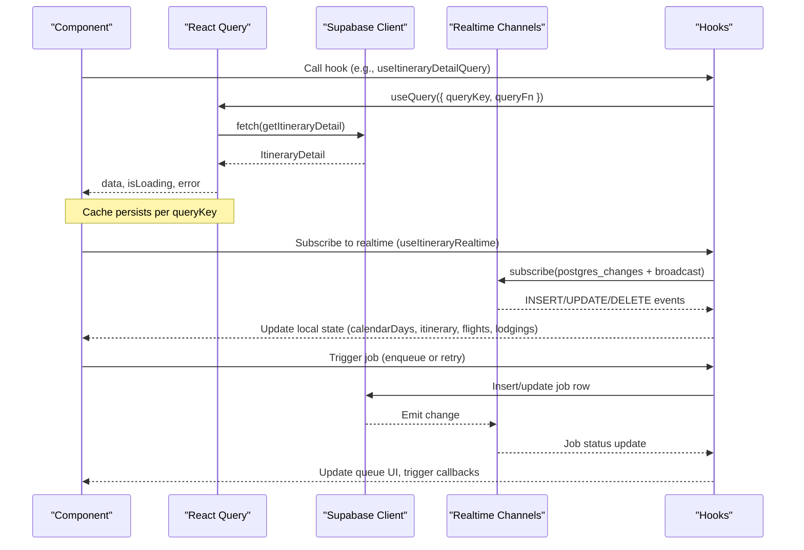
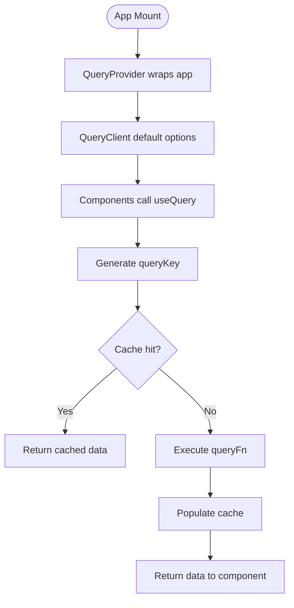
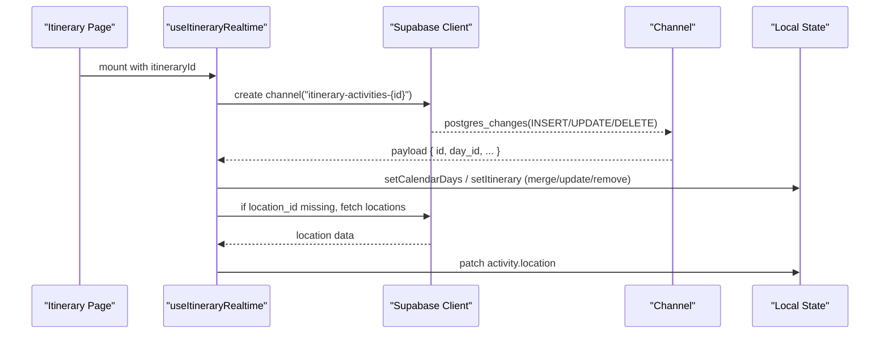
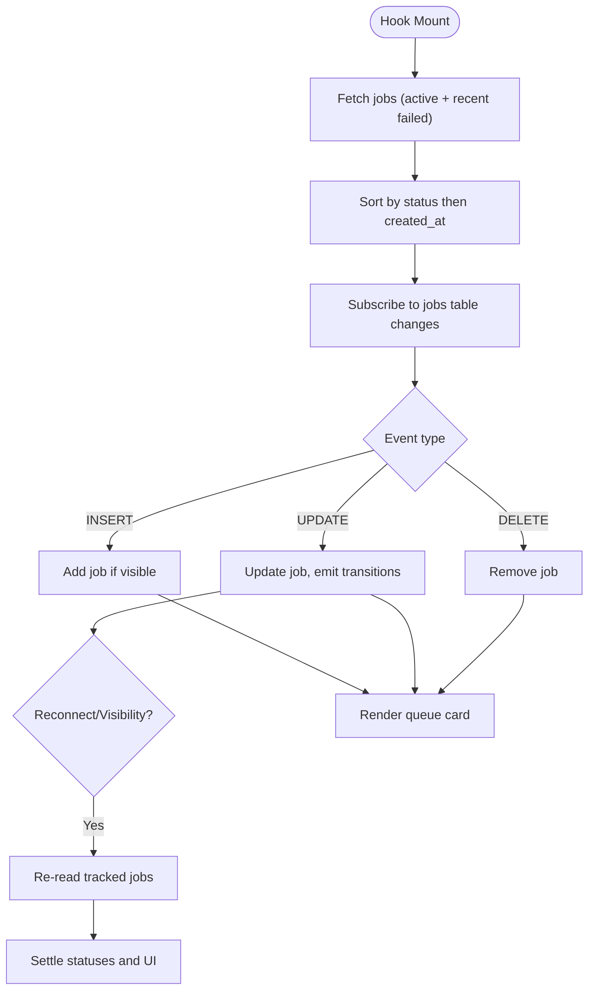
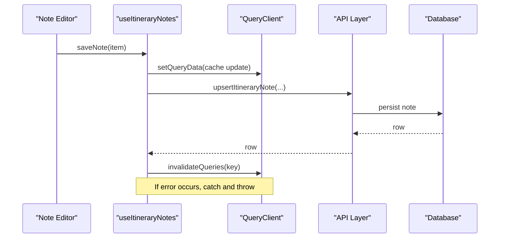
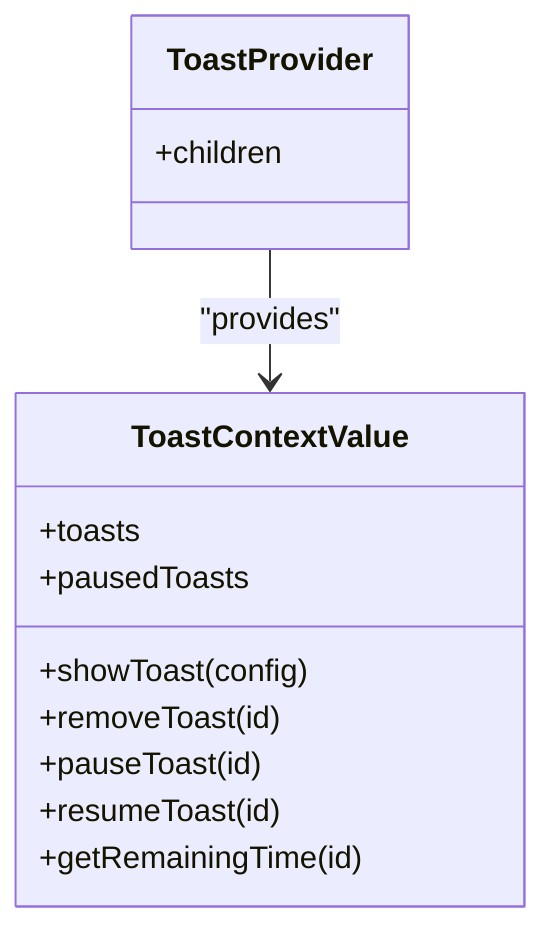
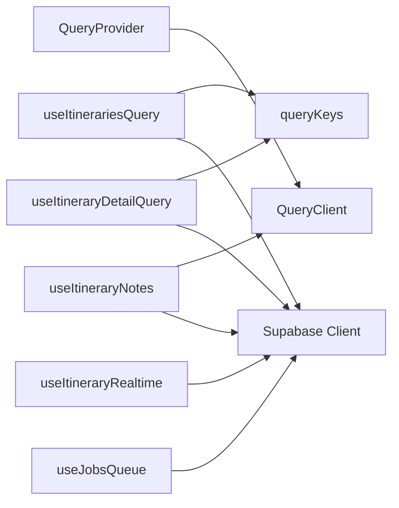

# Data Flow Patterns

<cite>
**Referenced Files in This Document**
- [QueryProvider.tsx](file://src/components/QueryProvider.tsx)
- [queryClient.ts](file://src/lib/query/queryClient.ts)
- [queryKeys.ts](file://src/lib/query/queryKeys.ts)
- [useItinerariesQuery.ts](file://src/hooks/queries/useItinerariesQuery.ts)
- [useItineraryDetailQuery.ts](file://src/hooks/queries/useItineraryDetailQuery.ts)
- [client.ts](file://src/lib/supabase/client.ts)
- [home.ts](file://src/lib/supabase/queries/home.ts)
- [useItineraryRealtime.ts](file://src/hooks/useItineraryRealtime.ts)
- [useJobsQueue.ts](file://src/hooks/useJobsQueue.ts)
- [useItineraryNotes.ts](file://src/hooks/useItineraryNotes.ts)
- [ToastContext.tsx](file://src/contexts/ToastContext.tsx)
</cite>

## Table of Contents
1. [Introduction](#introduction)
2. [Project Structure](#project-structure)
3. [Core Components](#core-components)
4. [Architecture Overview](#architecture-overview)
5. [Detailed Component Analysis](#detailed-component-analysis)
6. [Dependency Analysis](#dependency-analysis)
7. [Performance Considerations](#performance-considerations)
8. [Troubleshooting Guide](#troubleshooting-guide)
9. [Conclusion](#conclusion)

## Introduction
This document explains how data moves through the Argo application with a focus on:
- TanStack Query for server state management and caching
- Custom hooks encapsulating business logic
- Context API for global UI state
- Real-time synchronization with Supabase
- Job queue processing and progress tracking
- Optimistic updates and error handling patterns

The goal is to provide both high-level architecture and code-level detail so developers can understand, extend, and troubleshoot data flows confidently.

## Project Structure
Data flow spans several layers:
- Providers wrap the app with global services (TanStack Query client, Toast context).
- Hooks encapsulate data fetching, real-time subscriptions, and mutations.
- Supabase client provides database access and real-time channels.
- Pages and components consume hooks to render UI and react to changes.

**Diagram sources**
- [QueryProvider.tsx:7-12](file://src/components/QueryProvider.tsx#L7-L12)
- [queryClient.ts:3-12](file://src/lib/query/queryClient.ts#L3-L12)
- [queryKeys.ts:1-42](file://src/lib/query/queryKeys.ts#L1-L42)
- [useItinerariesQuery.ts:10-16](file://src/hooks/queries/useItinerariesQuery.ts#L10-L16)
- [useItineraryDetailQuery.ts:8-18](file://src/hooks/queries/useItineraryDetailQuery.ts#L8-L18)
- [client.ts:3-8](file://src/lib/supabase/client.ts#L3-L8)
- [home.ts:159-303](file://src/lib/supabase/queries/home.ts#L159-L303)
- [useItineraryRealtime.ts:27-333](file://src/hooks/useItineraryRealtime.ts#L27-L333)
- [useJobsQueue.ts:45-295](file://src/hooks/useJobsQueue.ts#L45-L295)
- [useItineraryNotes.ts:39-134](file://src/hooks/useItineraryNotes.ts#L39-L134)

**Section sources**
- [QueryProvider.tsx:7-12](file://src/components/QueryProvider.tsx#L7-L12)
- [queryClient.ts:3-12](file://src/lib/query/queryClient.ts#L3-L12)
- [queryKeys.ts:1-42](file://src/lib/query/queryKeys.ts#L1-L42)
- [useItinerariesQuery.ts:10-16](file://src/hooks/queries/useItinerariesQuery.ts#L10-L16)
- [useItineraryDetailQuery.ts:8-18](file://src/hooks/queries/useItineraryDetailQuery.ts#L8-L18)
- [client.ts:3-8](file://src/lib/supabase/client.ts#L3-L8)
- [home.ts:159-303](file://src/lib/supabase/queries/home.ts#L159-L303)
- [useItineraryRealtime.ts:27-333](file://src/hooks/useItineraryRealtime.ts#L27-L333)
- [useJobsQueue.ts:45-295](file://src/hooks/useJobsQueue.ts#L45-L295)
- [useItineraryNotes.ts:39-134](file://src/hooks/useItineraryNotes.ts#L39-L134)

## Core Components
- TanStack Query Provider: Wraps the app with a configured QueryClient that sets default caching and retry behavior.
- Query Keys: Centralized key factories to ensure consistent cache keys across queries.
- Supabase Client: Browser client factory for DB access and real-time subscriptions.
- Itinerary Detail Query: Fetches full itinerary data including days, activities, and locations.
- Itinerary Realtime Hook: Subscribes to Postgres changes and broadcasts to keep UI in sync.
- Jobs Queue Hook: Manages background job lifecycle, progress, and reconciliation.
- Itinerary Notes Hook: Encapsulates notes CRUD with optimistic cache updates and invalidation.
- Toast Context: Global notifications for user feedback.

**Section sources**
- [QueryProvider.tsx:7-12](file://src/components/QueryProvider.tsx#L7-L12)
- [queryClient.ts:3-12](file://src/lib/query/queryClient.ts#L3-L12)
- [queryKeys.ts:1-42](file://src/lib/query/queryKeys.ts#L1-L42)
- [useItineraryDetailQuery.ts:8-18](file://src/hooks/queries/useItineraryDetailQuery.ts#L8-L18)
- [useItineraryRealtime.ts:27-333](file://src/hooks/useItineraryRealtime.ts#L27-L333)
- [useJobsQueue.ts:45-295](file://src/hooks/useJobsQueue.ts#L45-L295)
- [useItineraryNotes.ts:39-134](file://src/hooks/useItineraryNotes.ts#L39-L134)
- [ToastContext.tsx:42-148](file://src/contexts/ToastContext.tsx#L42-L148)

## Architecture Overview
The data architecture combines:
- Server state via TanStack Query with stable keys and sensible defaults
- Real-time updates via Supabase channels for collaborative features
- Background jobs tracked in real time with reconciliation for resilience
- Local UI state via React contexts for transient concerns like toasts

**Diagram sources**
- [useItineraryDetailQuery.ts:8-18](file://src/hooks/queries/useItineraryDetailQuery.ts#L8-L18)
- [home.ts:159-303](file://src/lib/supabase/queries/home.ts#L159-L303)
- [useItineraryRealtime.ts:89-333](file://src/hooks/useItineraryRealtime.ts#L89-L333)
- [useJobsQueue.ts:167-260](file://src/hooks/useJobsQueue.ts#L167-L260)

## Detailed Component Analysis

### TanStack Query Integration
- Provider setup configures default staleTime, gcTime, retry, and refetchOnWindowFocus.
- Query keys are centralized to avoid drift and enable targeted invalidation.
- List and detail queries demonstrate read patterns with enabled guards and custom stale times.

**Diagram sources**
- [QueryProvider.tsx:7-12](file://src/components/QueryProvider.tsx#L7-L12)
- [queryClient.ts:3-12](file://src/lib/query/queryClient.ts#L3-L12)
- [queryKeys.ts:1-42](file://src/lib/query/queryKeys.ts#L1-L42)
- [useItinerariesQuery.ts:10-16](file://src/hooks/queries/useItinerariesQuery.ts#L10-L16)
- [useItineraryDetailQuery.ts:8-18](file://src/hooks/queries/useItineraryDetailQuery.ts#L8-L18)

**Section sources**
- [queryClient.ts:3-12](file://src/lib/query/queryClient.ts#L3-L12)
- [queryKeys.ts:1-42](file://src/lib/query/queryKeys.ts#L1-L42)
- [useItinerariesQuery.ts:10-16](file://src/hooks/queries/useItinerariesQuery.ts#L10-L16)
- [useItineraryDetailQuery.ts:8-18](file://src/hooks/queries/useItineraryDetailQuery.ts#L8-L18)

### Real-Time Data Synchronization with Supabase
- The itinerary realtime hook subscribes to multiple tables and channels scoped by itineraryId.
- Handles INSERT, UPDATE, DELETE for activities and days, plus metadata and collaborators.
- Mirrors updates into both calendar view state and itinerary model state to keep different views consistent.
- Hydrates activity location details asynchronously when missing after inserts.

**Diagram sources**
- [useItineraryRealtime.ts:40-333](file://src/hooks/useItineraryRealtime.ts#L40-L333)

**Section sources**
- [useItineraryRealtime.ts:40-333](file://src/hooks/useItineraryRealtime.ts#L40-L333)

### Job Queue Processing and Progress Tracking
- Initial load fetches active and recent failed jobs for the user.
- Realtime subscription listens to all changes on the jobs table filtered by userId.
- Reconciliation ensures missed updates are recovered on reconnect or visibility change.
- Optimistic upsert allows immediate UI updates before realtime arrives.
- Failed jobs are pinned to the front; newest first within groups.

**Diagram sources**
- [useJobsQueue.ts:78-267](file://src/hooks/useJobsQueue.ts#L78-L267)

**Section sources**
- [useJobsQueue.ts:78-267](file://src/hooks/useJobsQueue.ts#L78-L267)

### Optimistic Updates and Error Handling
- Itinerary notes hook uses optimistic cache updates:
  - Immediately insert or update the note in the query cache
  - Invalidate the query to reconcile with server
  - Errors are caught and re-thrown for caller handling
- Realtime channels handle inconsistent states gracefully:
  - Activity hydration falls back if location fetch fails
  - Duplicate prevention checks avoid adding existing items
- Jobs queue handles connection errors and reconciles missed updates

**Diagram sources**
- [useItineraryNotes.ts:48-121](file://src/hooks/useItineraryNotes.ts#L48-L121)

**Section sources**
- [useItineraryNotes.ts:48-121](file://src/hooks/useItineraryNotes.ts#L48-L121)
- [useItineraryRealtime.ts:50-87](file://src/hooks/useItineraryRealtime.ts#L50-L87)
- [useJobsQueue.ts:250-260](file://src/hooks/useJobsQueue.ts#L250-L260)

### Context API for Global State
- ToastContext provides global notification management:
  - Create, pause, resume, remove toasts
  - Timers managed per toast with remaining time tracking
  - Cleanup on unmount to prevent leaks

**Diagram sources**
- [ToastContext.tsx:28-148](file://src/contexts/ToastContext.tsx#L28-L148)

**Section sources**
- [ToastContext.tsx:42-148](file://src/contexts/ToastContext.tsx#L42-L148)

### Data Fetching Patterns and Caching Strategies
- Read patterns:
  - useItinerariesQuery returns a list with a short staleTime for freshness
  - useItineraryDetailQuery fetches full detail with longer staleTime
- Caching:
  - Default staleTime and gcTime configured at QueryClient level
  - queryKeys centralize key generation for consistency and invalidation
- Realtime complement:
  - Even with caching, realtime keeps UI live without polling

**Section sources**
- [queryClient.ts:3-12](file://src/lib/query/queryClient.ts#L3-L12)
- [queryKeys.ts:1-42](file://src/lib/query/queryKeys.ts#L1-L42)
- [useItinerariesQuery.ts:10-16](file://src/hooks/queries/useItinerariesQuery.ts#L10-L16)
- [useItineraryDetailQuery.ts:8-18](file://src/hooks/queries/useItineraryDetailQuery.ts#L8-L18)

### State Synchronization Between Components
- Calendar days and itinerary model are kept in sync via realtime updates:
  - Activities inserted/updated/deleted mirror into both calendar and itinerary state
  - Days inserted/deleted mirror into both structures
  - Collaborator joins/leaves update itinerary collaborators
- Flights and Lodgings sidebars update only when open to reduce overhead

**Section sources**
- [useItineraryRealtime.ts:104-333](file://src/hooks/useItineraryRealtime.ts#L104-L333)
- [useItineraryRealtime.ts:335-440](file://src/hooks/useItineraryRealtime.ts#L335-L440)
- [useItineraryRealtime.ts:442-530](file://src/hooks/useItineraryRealtime.ts#L442-L530)

## Dependency Analysis
- QueryProvider depends on QueryClient configuration
- Hooks depend on queryKeys for consistent cache keys
- Realtime hook depends on Supabase client and typed payloads
- Jobs queue depends on Supabase client and visibility APIs
- Notes hook depends on QueryClient for cache manipulation and API layer for persistence

**Diagram sources**
- [QueryProvider.tsx:7-12](file://src/components/QueryProvider.tsx#L7-L12)
- [queryKeys.ts:1-42](file://src/lib/query/queryKeys.ts#L1-L42)
- [useItinerariesQuery.ts:10-16](file://src/hooks/queries/useItinerariesQuery.ts#L10-L16)
- [useItineraryDetailQuery.ts:8-18](file://src/hooks/queries/useItineraryDetailQuery.ts#L8-L18)
- [useItineraryRealtime.ts:27-333](file://src/hooks/useItineraryRealtime.ts#L27-L333)
- [useJobsQueue.ts:45-295](file://src/hooks/useJobsQueue.ts#L45-L295)
- [useItineraryNotes.ts:39-134](file://src/hooks/useItineraryNotes.ts#L39-L134)

**Section sources**
- [queryKeys.ts:1-42](file://src/lib/query/queryKeys.ts#L1-L42)
- [useItinerariesQuery.ts:10-16](file://src/hooks/queries/useItinerariesQuery.ts#L10-L16)
- [useItineraryDetailQuery.ts:8-18](file://src/hooks/queries/useItineraryDetailQuery.ts#L8-L18)
- [useItineraryRealtime.ts:27-333](file://src/hooks/useItineraryRealtime.ts#L27-L333)
- [useJobsQueue.ts:45-295](file://src/hooks/useJobsQueue.ts#L45-L295)
- [useItineraryNotes.ts:39-134](file://src/hooks/useItineraryNotes.ts#L39-L134)

## Performance Considerations
- Caching:
  - Use appropriate staleTime per query to balance freshness and network usage
  - Leverage queryKeys for precise invalidation
- Realtime:
  - Scope channels by resource IDs to minimize noise
  - Avoid duplicating work by checking for existing items before updates
- Jobs:
  - Reconcile on reconnect and visibility change to recover missed updates
  - Keep UI responsive with optimistic upserts
- Rendering:
  - Mirror updates into multiple state shapes carefully to avoid unnecessary re-renders
  - Use stable identifiers and order fields to maintain UI stability

[No sources needed since this section provides general guidance]

## Troubleshooting Guide
- Realtime issues:
  - Verify channel names and filters match resource IDs
  - Check for duplicate handlers causing conflicts
  - Ensure cleanup removes channels on unmount
- Cache inconsistencies:
  - Confirm queryKeys are consistent across reads and invalidations
  - Validate that optimistic updates align with server responses
- Job queue stalls:
  - Inspect visibilitychange and reconnect handlers
  - Use reconciliation to settle stuck jobs
- Error handling:
  - Catch and log errors in mutations and realtime hydration
  - Provide user feedback via ToastContext

**Section sources**
- [useItineraryRealtime.ts:50-87](file://src/hooks/useItineraryRealtime.ts#L50-L87)
- [useJobsQueue.ts:250-260](file://src/hooks/useJobsQueue.ts#L250-L260)
- [useItineraryNotes.ts:84-121](file://src/hooks/useItineraryNotes.ts#L84-L121)
- [ToastContext.tsx:90-148](file://src/contexts/ToastContext.tsx#L90-L148)

## Conclusion
Argo’s data flow combines robust server state management with TanStack Query, resilient real-time synchronization via Supabase, and clear separation of concerns through custom hooks and contexts. This design supports collaborative editing, background job processing, and responsive UI updates while maintaining performance and reliability.

[No sources needed since this section summarizes without analyzing specific files]