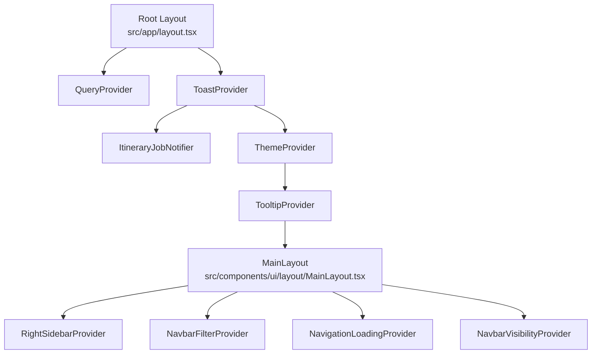
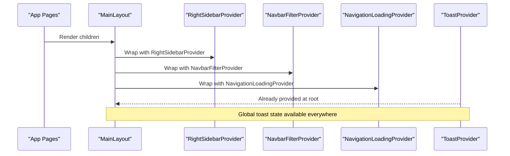
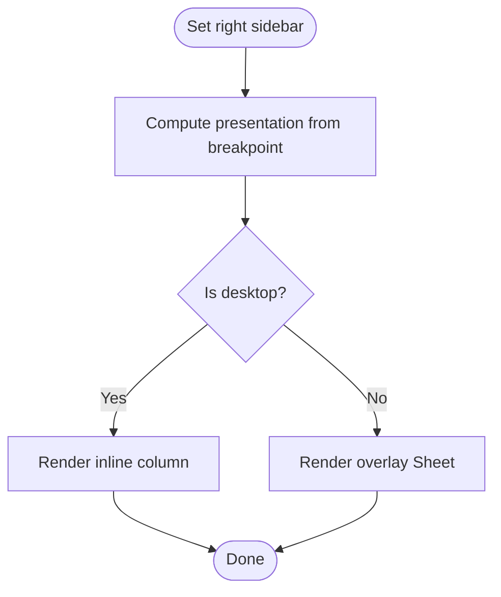
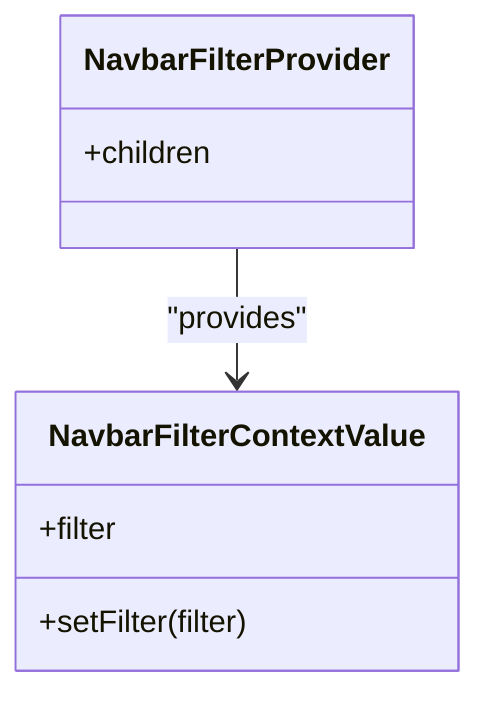
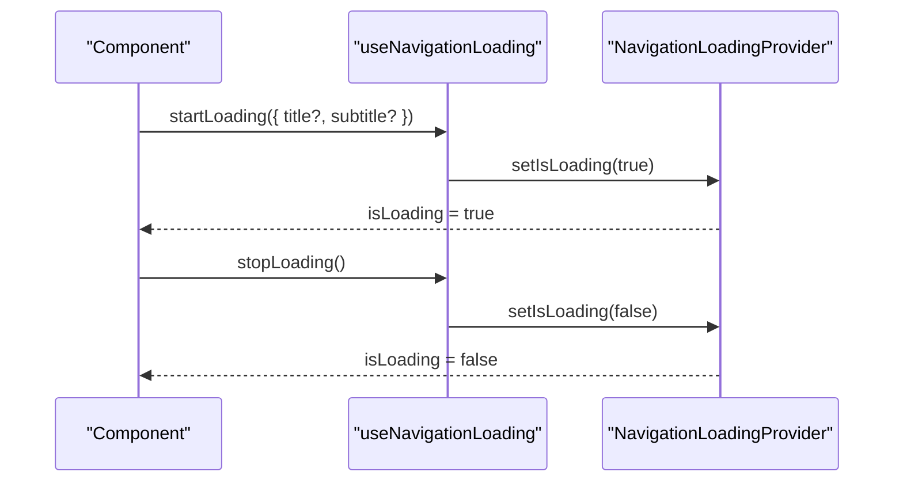
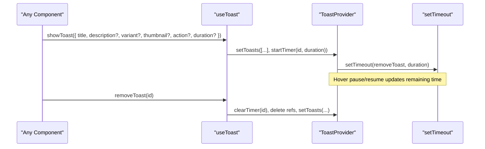
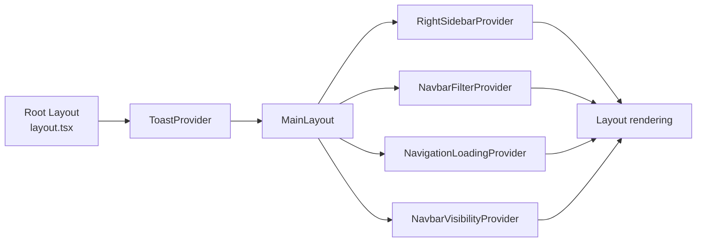

# Client State Context

<cite>
**Referenced Files in This Document**
- [RightSidebarContext.tsx](file://src/contexts/RightSidebarContext.tsx)
- [NavbarFilterContext.tsx](file://src/contexts/NavbarFilterContext.tsx)
- [NavigationLoadingContext.tsx](file://src/contexts/NavigationLoadingContext.tsx)
- [ToastContext.tsx](file://src/contexts/ToastContext.tsx)
- [NavbarVisibilityContext.tsx](file://src/contexts/NavbarVisibilityContext.tsx)
- [MainLayout.tsx](file://src/components/ui/layout/MainLayout.tsx)
- [layout.tsx](file://src/app/layout.tsx)
- [Toast.tsx](file://src/components/ui/primitives/Toast.tsx)
</cite>

## Table of Contents
1. Introduction
2. Project Structure
3. Core Components
4. Architecture Overview
5. Detailed Component Analysis
6. Dependency Analysis
7. Performance Considerations
8. Troubleshooting Guide
9. Conclusion

## Introduction
This document explains the client-side state management strategy using React Context API across the application. It focuses on:
- RightSidebarContext for panel management and responsive presentation
- NavbarFilterContext for search filters shared with the navbar
- NavigationLoadingContext for global navigation loading states
- ToastContext for user notifications and feedback
It also covers consumption patterns, state updates, component communication, performance considerations (context splitting and selective re-renders), and best practices for organizing context-based state.

## Project Structure
The contexts live under src/contexts and are consumed by layout and UI components. The root layout wraps the app with providers that establish global state boundaries.

**Diagram sources**
- [layout.tsx:57-80](file://src/app/layout.tsx#L57-L80)
- [MainLayout.tsx:12-20](file://src/components/ui/layout/MainLayout.tsx#L12-L20)

**Section sources**
- [layout.tsx:57-80](file://src/app/layout.tsx#L57-L80)
- [MainLayout.tsx:12-20](file://src/components/ui/layout/MainLayout.tsx#L12-L20)

## Core Components
- RightSidebarContext: Manages a dynamic right sidebar node and its presentation mode (inline vs overlay). Provides a no-op fallback when used outside the provider.
- NavbarFilterContext: Holds a single active filter object for the navbar search area and exposes a setter to update it.
- NavigationLoadingContext: Controls a global loading flag and optional title/subtitle for navigation-level loading indicators.
- ToastContext: Centralized notification system with lifecycle control (show, remove, pause, resume), timers, and remaining time tracking.
- NavbarVisibilityContext: Passes down a function to hide/show the navbar from child components.

These contexts are composed in MainLayout to scope their influence to the application shell.

**Section sources**
- [RightSidebarContext.tsx:6-46](file://src/contexts/RightSidebarContext.tsx#L6-L46)
- [NavbarFilterContext.tsx:5-45](file://src/contexts/NavbarFilterContext.tsx#L5-L45)
- [NavigationLoadingContext.tsx:5-48](file://src/contexts/NavigationLoadingContext.tsx#L5-L48)
- [ToastContext.tsx:12-154](file://src/contexts/ToastContext.tsx#L12-L154)
- [NavbarVisibilityContext.tsx:5-27](file://src/contexts/NavbarVisibilityContext.tsx#L5-L27)

## Architecture Overview
The application uses a layered provider architecture:
- Root layout provides cross-cutting concerns like theming, tooltips, and toasts.
- MainLayout composes feature-specific providers around page content.
- Feature components consume contexts via custom hooks to read state and dispatch updates.

**Diagram sources**
- [MainLayout.tsx:12-20](file://src/components/ui/layout/MainLayout.tsx#L12-L20)
- [layout.tsx:69-78](file://src/app/layout.tsx#L69-L78)

## Detailed Component Analysis

### RightSidebarContext
Purpose:
- Manage a renderable sidebar node and decide whether to present it inline or as an overlay based on viewport size.
- Provide a safe no-op hook when used outside the provider to avoid errors in pages without a sidebar.

Key behaviors:
- Uses a breakpoint hook to compute presentation mode.
- Exposes setRightSidebar to replace the current sidebar node.
- Consumers can render different UIs depending on presentation mode.

Consumption pattern:
- Use the custom hook to get { rightSidebar, setRightSidebar, presentation }.
- In the layout, conditionally render either an inline column or a sheet overlay based on presentation.

**Diagram sources**
- [RightSidebarContext.tsx:34-46](file://src/contexts/RightSidebarContext.tsx#L34-L46)
- [MainLayout.tsx:299-343](file://src/components/ui/layout/MainLayout.tsx#L299-L343)

**Section sources**
- [RightSidebarContext.tsx:6-46](file://src/contexts/RightSidebarContext.tsx#L6-L46)
- [MainLayout.tsx:299-343](file://src/components/ui/layout/MainLayout.tsx#L299-L343)

### NavbarFilterContext
Purpose:
- Hold the currently active filter for the navbar search area and allow any component to set or clear it.

Data model:
- Filter includes type, label, optional thumbnail URL, entity ID, and locality IDs.

Usage:
- Navbar renders a filter pill when a filter is active and allows dismissal.
- Any component can call setFilter to activate a contextual filter for searches.

**Diagram sources**
- [NavbarFilterContext.tsx:15-45](file://src/contexts/NavbarFilterContext.tsx#L15-L45)

**Section sources**
- [NavbarFilterContext.tsx:5-45](file://src/contexts/NavbarFilterContext.tsx#L5-L45)
- [MainLayout.tsx:260-449](file://src/components/ui/layout/MainLayout.tsx#L260-L449)

### NavigationLoadingContext
Purpose:
- Drive a global navigation loading indicator with optional title and subtitle.

API:
- startLoading(config?) sets isLoading and optional metadata.
- stopLoading resets the loading state.

Error handling:
- The custom hook throws if used outside the provider, ensuring explicit usage within the correct boundary.

**Diagram sources**
- [NavigationLoadingContext.tsx:20-48](file://src/contexts/NavigationLoadingContext.tsx#L20-L48)

**Section sources**
- [NavigationLoadingContext.tsx:5-48](file://src/contexts/NavigationLoadingContext.tsx#L5-L48)

### ToastContext
Purpose:
- Provide a centralized notification system with lifecycle controls and timers.

Features:
- showToast creates a unique ID and starts a timer; default duration applies if none specified.
- removeToast clears timers and removes the toast from state.
- pauseToast/resumeToast manage hover interactions by pausing and resuming timers while preserving remaining time.
- getRemainingTime exposes per-toast remaining duration for UI progress bars.

Lifecycle and cleanup:
- On unmount, all timers are cleared to prevent memory leaks.

**Diagram sources**
- [ToastContext.tsx:42-154](file://src/contexts/ToastContext.tsx#L42-L154)
- [Toast.tsx:47-173](file://src/components/ui/primitives/Toast.tsx#L47-L173)

**Section sources**
- [ToastContext.tsx:12-154](file://src/contexts/ToastContext.tsx#L12-L154)
- [Toast.tsx:47-173](file://src/components/ui/primitives/Toast.tsx#L47-L173)

### NavbarVisibilityContext
Purpose:
- Allow child components to toggle navbar visibility via a passed-in setter.

Usage:
- Provider receives setNavbarHidden and exposes it through a hook for consumers.

**Section sources**
- [NavbarVisibilityContext.tsx:5-27](file://src/contexts/NavbarVisibilityContext.tsx#L5-L27)

## Dependency Analysis
- Root layout establishes global providers (e.g., ToastProvider) so any descendant can use toasts.
- MainLayout composes feature-specific providers (sidebar, navbar filter, navigation loading, navbar visibility) around page content.
- UI components consume contexts via custom hooks, keeping coupling low and enabling selective re-renders.

**Diagram sources**
- [layout.tsx:57-80](file://src/app/layout.tsx#L57-L80)
- [MainLayout.tsx:12-20](file://src/components/ui/layout/MainLayout.tsx#L12-L20)

**Section sources**
- [layout.tsx:57-80](file://src/app/layout.tsx#L57-L80)
- [MainLayout.tsx:12-20](file://src/components/ui/layout/MainLayout.tsx#L12-L20)

## Performance Considerations
- Context splitting: Each concern has its own context (sidebar, filter, navigation loading, toasts, navbar visibility). This limits re-renders to only those components subscribed to the specific slice of state they need.
- Selective re-renders: Custom hooks return minimal values; consumers subscribe only to what they use. For example, a component reading only rightSidebar will not re-render when other fields change.
- Stable references: Where appropriate, memoize callbacks (e.g., startLoading, stopLoading, showToast) to avoid unnecessary subscriber updates.
- Avoid heavy objects in context: Keep context values small and stable. For large datasets, prefer server state (queries) and keep context for UI-only state.
- Conditional rendering: Use presentation flags (like inline vs overlay) to switch UI modes without duplicating logic.
- Timers and cleanup: Ensure timers are cleared on unmount to prevent memory leaks and unexpected behavior.

[No sources needed since this section provides general guidance]

## Troubleshooting Guide
Common issues and resolutions:
- Using a context outside its provider:
  - NavigationLoadingContext and ToastContext throw when accessed without a provider. Ensure your component tree includes the corresponding provider.
  - RightSidebarContext returns a no-op when used outside its provider; verify you are inside a layout that includes RightSidebarProvider if you expect behavior.
- Toast not disappearing:
  - Check that timers are started and cleared correctly. Verify that removeToast is called and that paused-toast logic does not indefinitely pause a toast.
- Sidebar not showing:
  - Confirm setRightSidebar is called with a valid node and that presentation mode matches expectations. Ensure the layout renders the sidebar according to presentation.
- Filter not updating:
  - Ensure setFilter is invoked with the intended value and that the navbar reads the same filter from NavbarFilterContext.

**Section sources**
- [NavigationLoadingContext.tsx:44-48](file://src/contexts/NavigationLoadingContext.tsx#L44-L48)
- [ToastContext.tsx:150-154](file://src/contexts/ToastContext.tsx#L150-L154)
- [RightSidebarContext.tsx:17-28](file://src/contexts/RightSidebarContext.tsx#L17-L28)

## Conclusion
The application adopts a clean separation of concerns using multiple focused React Context providers:
- RightSidebarContext manages dynamic panels and responsive presentation.
- NavbarFilterContext centralizes search filters for the navbar.
- NavigationLoadingContext drives global navigation loading states.
- ToastContext provides robust, controllable user notifications.
- NavbarVisibilityContext enables flexible navbar control.

By splitting contexts, using custom hooks, and keeping values minimal, the app achieves predictable re-renders and maintainable state flow. Prefer Context for UI-only state, local state for isolated component state, and server state (queries/mutations) for data fetched from APIs.

[No sources needed since this section summarizes without analyzing specific files]