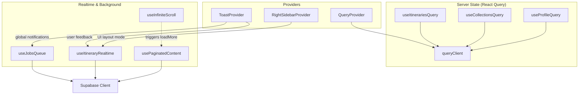
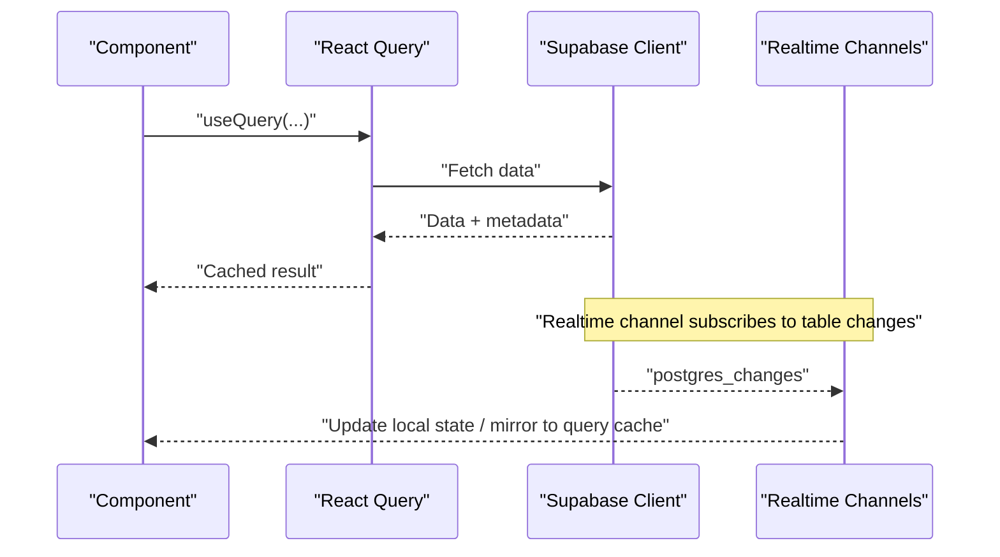
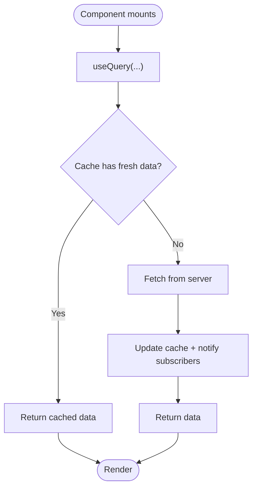
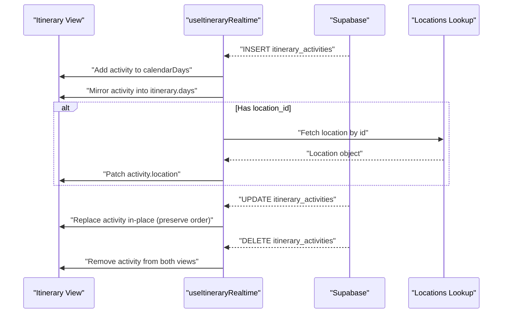
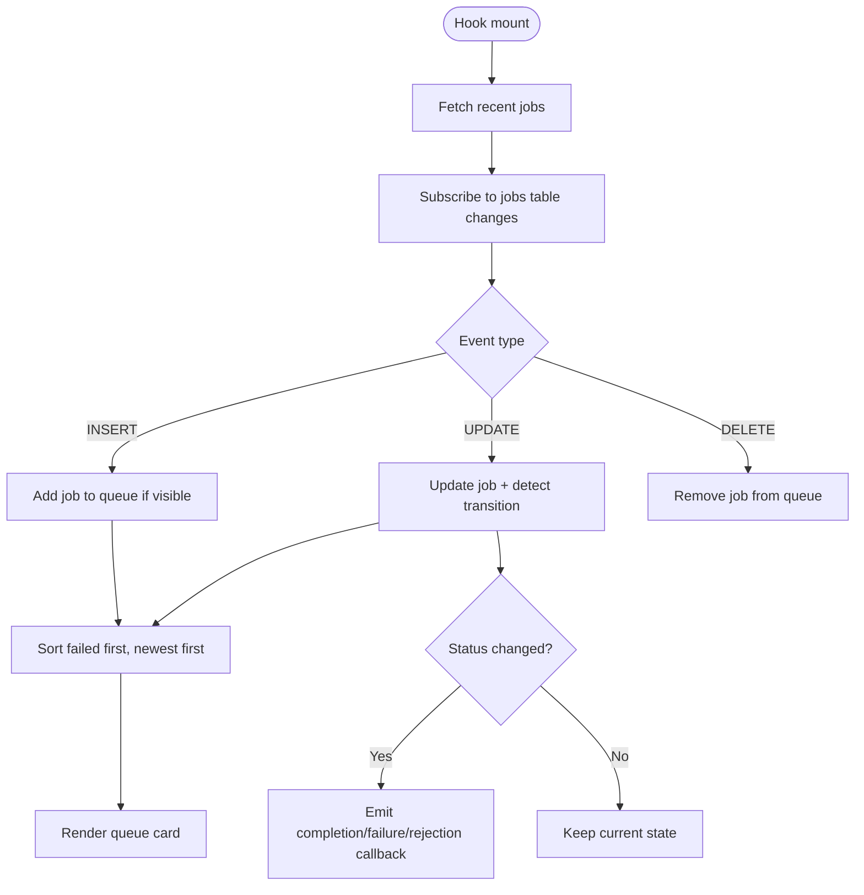
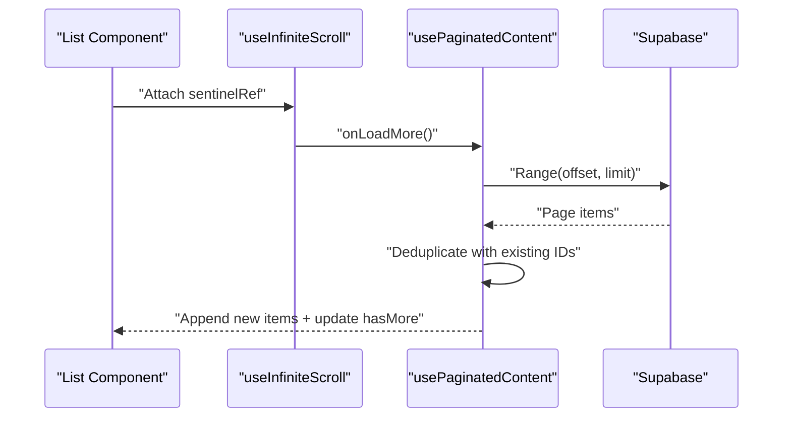
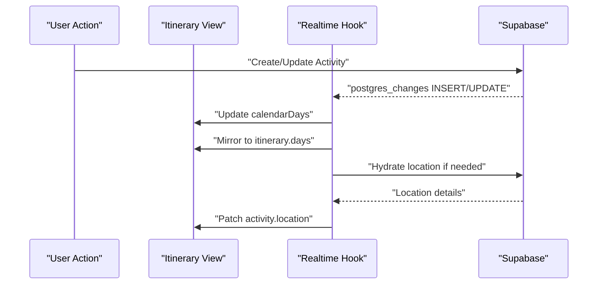
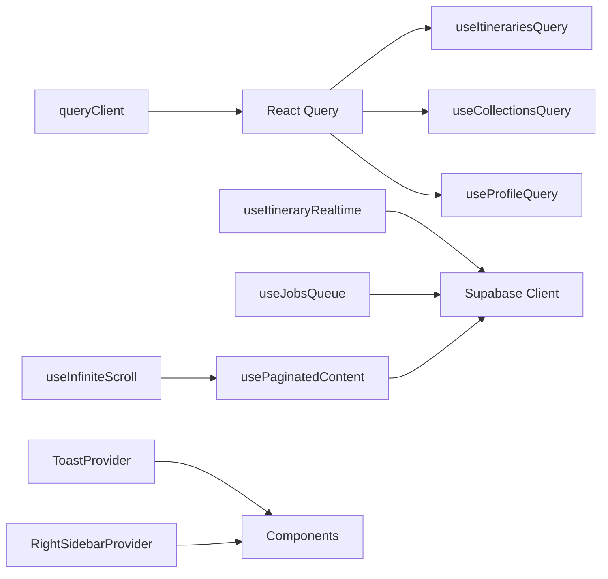

# Data Flow Patterns

<cite>
**Referenced Files in This Document**
- [QueryProvider.tsx](file://src/components/QueryProvider.tsx)
- [queryClient.ts](file://src/lib/query/queryClient.ts)
- [useItinerariesQuery.ts](file://src/hooks/queries/useItinerariesQuery.ts)
- [useCollectionsQuery.ts](file://src/hooks/queries/useCollectionsQuery.ts)
- [useProfileQuery.ts](file://src/hooks/queries/useProfileQuery.ts)
- [client.ts](file://src/lib/supabase/client.ts)
- [useJobsQueue.ts](file://src/hooks/useJobsQueue.ts)
- [useItineraryRealtime.ts](file://src/hooks/useItineraryRealtime.ts)
- [usePaginatedContent.ts](file://src/hooks/usePaginatedContent.ts)
- [useInfiniteScroll.ts](file://src/hooks/useInfiniteScroll.ts)
- [ToastContext.tsx](file://src/contexts/ToastContext.tsx)
- [RightSidebarContext.tsx](file://src/contexts/RightSidebarContext.tsx)
- [itinerary.ts](file://src/lib/utils/itinerary.ts)
</cite>

## Table of Contents
1. Introduction
2. Project Structure
3. Core Components
4. Architecture Overview
5. Detailed Component Analysis
6. Dependency Analysis
7. Performance Considerations
8. Troubleshooting Guide
9. Conclusion

## Introduction
This document explains the data flow patterns used across the Argo platform to manage server state, global client state, and local component state. It covers:
- React Query for server-state caching and background updates
- Context API for global UI state (toasts, sidebars)
- Local component state for transient UI concerns
- Real-time synchronization with Supabase via Postgres changes and broadcast events
- A job queue system for background processing with progress tracking and error handling
- Data validation flows, optimistic updates, and conflict resolution strategies
- Complex workflows such as itinerary generation, collection management, and collaborative editing
- Performance optimizations including pagination, infinite scrolling, and selective data loading

## Project Structure
The application organizes data-related logic into:
- Providers at the app root that wrap components with React Query and context providers
- Hooks that encapsulate data fetching, caching, real-time subscriptions, and UI interactions
- Utilities for time/date conversions and formatting used by real-time handlers
- Supabase client configuration for database access and real-time channels



**Diagram sources**
- [QueryProvider.tsx:7-13](file://src/components/QueryProvider.tsx#L7-L13)
- [queryClient.ts:3-12](file://src/lib/query/queryClient.ts#L3-L12)
- [useItinerariesQuery.ts:10-16](file://src/hooks/queries/useItinerariesQuery.ts#L10-L16)
- [useCollectionsQuery.ts:10-16](file://src/hooks/queries/useCollectionsQuery.ts#L10-L16)
- [useProfileQuery.ts:8-19](file://src/hooks/queries/useProfileQuery.ts#L8-L19)
- [useJobsQueue.ts:45-295](file://src/hooks/useJobsQueue.ts#L45-L295)
- [useItineraryRealtime.ts:27-533](file://src/hooks/useItineraryRealtime.ts#L27-L533)
- [usePaginatedContent.ts:119-287](file://src/hooks/usePaginatedContent.ts#L119-L287)
- [useInfiniteScroll.ts:29-76](file://src/hooks/useInfiniteScroll.ts#L29-L76)
- [client.ts:3-8](file://src/lib/supabase/client.ts#L3-L8)

**Section sources**
- [QueryProvider.tsx:7-13](file://src/components/QueryProvider.tsx#L7-L13)
- [queryClient.ts:3-12](file://src/lib/query/queryClient.ts#L3-L12)
- [useItinerariesQuery.ts:10-16](file://src/hooks/queries/useItinerariesQuery.ts#L10-L16)
- [useCollectionsQuery.ts:10-16](file://src/hooks/queries/useCollectionsQuery.ts#L10-L16)
- [useProfileQuery.ts:8-19](file://src/hooks/queries/useProfileQuery.ts#L8-L19)
- [useJobsQueue.ts:45-295](file://src/hooks/useJobsQueue.ts#L45-L295)
- [useItineraryRealtime.ts:27-533](file://src/hooks/useItineraryRealtime.ts#L27-L533)
- [usePaginatedContent.ts:119-287](file://src/hooks/usePaginatedContent.ts#L119-L287)
- [useInfiniteScroll.ts:29-76](file://src/hooks/useInfiniteScroll.ts#L29-L76)
- [client.ts:3-8](file://src/lib/supabase/client.ts#L3-L8)

## Core Components
- React Query provider and client configure caching, retries, and stale times for server state.
- Query hooks wrap data fetching functions and expose standardized query results.
- Realtime hooks subscribe to Supabase Postgres changes to keep UI in sync without polling.
- Job queue hook manages background tasks, progress, and transitions with optimistic merges.
- Pagination and infinite scroll hooks implement efficient list rendering and incremental loading.
- Contexts provide global UI state like toasts and sidebar presentation modes.

**Section sources**
- [QueryProvider.tsx:7-13](file://src/components/QueryProvider.tsx#L7-L13)
- [queryClient.ts:3-12](file://src/lib/query/queryClient.ts#L3-L12)
- [useItinerariesQuery.ts:10-16](file://src/hooks/queries/useItinerariesQuery.ts#L10-L16)
- [useCollectionsQuery.ts:10-16](file://src/hooks/queries/useCollectionsQuery.ts#L10-L16)
- [useProfileQuery.ts:8-19](file://src/hooks/queries/useProfileQuery.ts#L8-L19)
- [useJobsQueue.ts:45-295](file://src/hooks/useJobsQueue.ts#L45-L295)
- [useItineraryRealtime.ts:27-533](file://src/hooks/useItineraryRealtime.ts#L27-L533)
- [usePaginatedContent.ts:119-287](file://src/hooks/usePaginatedContent.ts#L119-L287)
- [useInfiniteScroll.ts:29-76](file://src/hooks/useInfiniteScroll.ts#L29-L76)
- [ToastContext.tsx:42-154](file://src/contexts/ToastContext.tsx#L42-L154)
- [RightSidebarContext.tsx:34-46](file://src/contexts/RightSidebarContext.tsx#L34-L46)

## Architecture Overview
The data architecture combines three layers:
- Server state via React Query with a configured client for caching and background refetching
- Global client state via Context providers for cross-cutting UI concerns
- Local component state for ephemeral UI behavior

Real-time updates from Supabase are integrated directly into component state or mirrored into React Query-managed structures where appropriate. The job queue provides background processing visibility with optimistic UI updates and reconciliation on reconnect.



**Diagram sources**
- [useItinerariesQuery.ts:10-16](file://src/hooks/queries/useItinerariesQuery.ts#L10-L16)
- [useProfileQuery.ts:8-19](file://src/hooks/queries/useProfileQuery.ts#L8-L19)
- [client.ts:3-8](file://src/lib/supabase/client.ts#L3-L8)
- [useItineraryRealtime.ts:89-333](file://src/hooks/useItineraryRealtime.ts#L89-L333)
- [usePaginatedContent.ts:209-284](file://src/hooks/usePaginatedContent.ts#L209-L284)

## Detailed Component Analysis

### React Query Integration and Caching Strategy
- Provider wraps the app with a configured QueryClient that sets default staleTime, gcTime, retry, and focus behavior.
- Query hooks use stable keys and per-query overrides to control freshness and lifetime.
- Profile queries disable refetch and extend cache lifetimes since profile data is relatively static.



**Diagram sources**
- [QueryProvider.tsx:7-13](file://src/components/QueryProvider.tsx#L7-L13)
- [queryClient.ts:3-12](file://src/lib/query/queryClient.ts#L3-L12)
- [useItinerariesQuery.ts:10-16](file://src/hooks/queries/useItinerariesQuery.ts#L10-L16)
- [useCollectionsQuery.ts:10-16](file://src/hooks/queries/useCollectionsQuery.ts#L10-L16)
- [useProfileQuery.ts:8-19](file://src/hooks/queries/useProfileQuery.ts#L8-L19)

**Section sources**
- [QueryProvider.tsx:7-13](file://src/components/QueryProvider.tsx#L7-L13)
- [queryClient.ts:3-12](file://src/lib/query/queryClient.ts#L3-L12)
- [useItinerariesQuery.ts:10-16](file://src/hooks/queries/useItinerariesQuery.ts#L10-L16)
- [useCollectionsQuery.ts:10-16](file://src/hooks/queries/useCollectionsQuery.ts#L10-L16)
- [useProfileQuery.ts:8-19](file://src/hooks/queries/useProfileQuery.ts#L8-L19)

### Real-Time Synchronization with Supabase
- Itinerary realtime hook subscribes to multiple tables (activities, days, itineraries, user_itinerary, flights, lodgings) and mirrors updates into both calendar and itinerary views.
- For activity inserts, it hydrates location details asynchronously when missing, ensuring consistent UI even if joins are not available immediately.
- Cross-day moves and same-day updates preserve ordering and avoid renumbering artifacts by replacing items in place rather than appending.



**Diagram sources**
- [useItineraryRealtime.ts:39-333](file://src/hooks/useItineraryRealtime.ts#L39-L333)
- [useItineraryRealtime.ts:335-386](file://src/hooks/useItineraryRealtime.ts#L335-L386)
- [useItineraryRealtime.ts:388-440](file://src/hooks/useItineraryRealtime.ts#L388-L440)
- [useItineraryRealtime.ts:442-530](file://src/hooks/useItineraryRealtime.ts#L442-L530)

**Section sources**
- [useItineraryRealtime.ts:39-333](file://src/hooks/useItineraryRealtime.ts#L39-L333)
- [useItineraryRealtime.ts:335-386](file://src/hooks/useItineraryRealtime.ts#L335-L386)
- [useItineraryRealtime.ts:388-440](file://src/hooks/useItineraryRealtime.ts#L388-L440)
- [useItineraryRealtime.ts:442-530](file://src/hooks/useItineraryRealtime.ts#L442-L530)
- [itinerary.ts:5-26](file://src/lib/utils/itinerary.ts#L5-L26)

### Job Queue System: Progress Tracking and Error Handling
- The job queue hook initializes an initial fetch for recent jobs and subscribes to Postgres changes for live updates.
- It tracks last known statuses per job to detect transitions and emit terminal callbacks for completed, failed, or rejected jobs.
- Reconciliation runs on tab visibility change and reconnect to settle missed updates and prevent stuck mid-progress states.
- Optimistic upsert allows immediate UI updates after retry or status changes before realtime arrives.



**Diagram sources**
- [useJobsQueue.ts:78-159](file://src/hooks/useJobsQueue.ts#L78-L159)
- [useJobsQueue.ts:167-260](file://src/hooks/useJobsQueue.ts#L167-L260)
- [useJobsQueue.ts:269-295](file://src/hooks/useJobsQueue.ts#L269-L295)

**Section sources**
- [useJobsQueue.ts:78-159](file://src/hooks/useJobsQueue.ts#L78-L159)
- [useJobsQueue.ts:167-260](file://src/hooks/useJobsQueue.ts#L167-L260)
- [useJobsQueue.ts:269-295](file://src/hooks/useJobsQueue.ts#L269-L295)

### Pagination and Infinite Scrolling
- Paginated content hook loads pages using range-based queries, deduplicates items arriving via realtime, and maintains hasMore flags.
- Infinite scroll hook uses IntersectionObserver to trigger loadMore when a sentinel enters the viewport, supporting custom scroll containers.
- Together they enable smooth, performant lists with minimal network overhead.



**Diagram sources**
- [useInfiniteScroll.ts:29-76](file://src/hooks/useInfiniteScroll.ts#L29-L76)
- [usePaginatedContent.ts:119-207](file://src/hooks/usePaginatedContent.ts#L119-L207)

**Section sources**
- [useInfiniteScroll.ts:29-76](file://src/hooks/useInfiniteScroll.ts#L29-L76)
- [usePaginatedContent.ts:119-207](file://src/hooks/usePaginatedContent.ts#L119-L207)
- [usePaginatedContent.ts:209-284](file://src/hooks/usePaginatedContent.ts#L209-L284)

### Global Client State with Context API
- Toast context provides centralized notification management with pause/resume timers and lifecycle cleanup.
- Right sidebar context abstracts presentation mode based on breakpoints, enabling consistent UI behavior across devices.

```mermaid
classDiagram
class ToastContext {
+showToast(config)
+removeToast(id)
+pauseToast(id)
+resumeToast(id)
+toasts
+pausedToasts
+getRemainingTime(id)
}
class RightSidebarContext {
+rightSidebar
+setRightSidebar(node)
+presentation
}
ToastContext <.. "used by" : Components
RightSidebarContext <.. "used by" : Components
```

**Diagram sources**
- [ToastContext.tsx:42-154](file://src/contexts/ToastContext.tsx#L42-L154)
- [RightSidebarContext.tsx:34-46](file://src/contexts/RightSidebarContext.tsx#L34-L46)

**Section sources**
- [ToastContext.tsx:42-154](file://src/contexts/ToastContext.tsx#L42-L154)
- [RightSidebarContext.tsx:34-46](file://src/contexts/RightSidebarContext.tsx#L34-L46)

### Complex Workflows

#### Itinerary Generation and Collaborative Editing
- Activities are inserted and updated in real time; the view mirrors changes into both calendar and itinerary models to keep all surfaces consistent.
- Location hydration occurs asynchronously after insert echoes to ensure rich detail without blocking UI.
- Day range changes and collaborator membership updates propagate instantly to reflect shared state.



**Diagram sources**
- [useItineraryRealtime.ts:39-333](file://src/hooks/useItineraryRealtime.ts#L39-L333)
- [useItineraryRealtime.ts:335-386](file://src/hooks/useItineraryRealtime.ts#L335-L386)
- [useItineraryRealtime.ts:388-440](file://src/hooks/useItineraryRealtime.ts#L388-L440)

**Section sources**
- [useItineraryRealtime.ts:39-333](file://src/hooks/useItineraryRealtime.ts#L39-L333)
- [useItineraryRealtime.ts:335-386](file://src/hooks/useItineraryRealtime.ts#L335-L386)
- [useItineraryRealtime.ts:388-440](file://src/hooks/useItineraryRealtime.ts#L388-L440)
- [itinerary.ts:71-97](file://src/lib/utils/itinerary.ts#L71-L97)

#### Collection Management
- Collections are fetched via React Query with dedicated keys and stale times, enabling efficient caching and background refresh.
- Queries are enabled conditionally based on user presence and can be invalidated when collections change.

**Section sources**
- [useCollectionsQuery.ts:10-16](file://src/hooks/queries/useCollectionsQuery.ts#L10-L16)

#### Content Lists with Realtime Updates
- Paginated content lists combine server-side pagination with realtime updates, deduplicating incoming items and filtering by favorites/archived states.
- Reconnection logic ensures resilience against transient connection errors.

**Section sources**
- [usePaginatedContent.ts:119-287](file://src/hooks/usePaginatedContent.ts#L119-L287)

## Dependency Analysis
Key dependencies and relationships:
- React Query depends on a configured QueryClient for caching policies
- Realtime hooks depend on Supabase client and subscribe to specific tables filtered by entity IDs
- Pagination and infinite scroll hooks coordinate to incrementally load content while avoiding duplicate entries
- Context providers supply global UI state consumed by various components



**Diagram sources**
- [queryClient.ts:3-12](file://src/lib/query/queryClient.ts#L3-L12)
- [useItinerariesQuery.ts:10-16](file://src/hooks/queries/useItinerariesQuery.ts#L10-L16)
- [useCollectionsQuery.ts:10-16](file://src/hooks/queries/useCollectionsQuery.ts#L10-L16)
- [useProfileQuery.ts:8-19](file://src/hooks/queries/useProfileQuery.ts#L8-L19)
- [useItineraryRealtime.ts:27-533](file://src/hooks/useItineraryRealtime.ts#L27-L533)
- [useJobsQueue.ts:45-295](file://src/hooks/useJobsQueue.ts#L45-L295)
- [usePaginatedContent.ts:119-287](file://src/hooks/usePaginatedContent.ts#L119-L287)
- [useInfiniteScroll.ts:29-76](file://src/hooks/useInfiniteScroll.ts#L29-L76)
- [client.ts:3-8](file://src/lib/supabase/client.ts#L3-L8)
- [ToastContext.tsx:42-154](file://src/contexts/ToastContext.tsx#L42-L154)
- [RightSidebarContext.tsx:34-46](file://src/contexts/RightSidebarContext.tsx#L34-L46)

**Section sources**
- [queryClient.ts:3-12](file://src/lib/query/queryClient.ts#L3-L12)
- [useItinerariesQuery.ts:10-16](file://src/hooks/queries/useItinerariesQuery.ts#L10-L16)
- [useCollectionsQuery.ts:10-16](file://src/hooks/queries/useCollectionsQuery.ts#L10-L16)
- [useProfileQuery.ts:8-19](file://src/hooks/queries/useProfileQuery.ts#L8-L19)
- [useItineraryRealtime.ts:27-533](file://src/hooks/useItineraryRealtime.ts#L27-L533)
- [useJobsQueue.ts:45-295](file://src/hooks/useJobsQueue.ts#L45-L295)
- [usePaginatedContent.ts:119-287](file://src/hooks/usePaginatedContent.ts#L119-L287)
- [useInfiniteScroll.ts:29-76](file://src/hooks/useInfiniteScroll.ts#L29-L76)
- [client.ts:3-8](file://src/lib/supabase/client.ts#L3-L8)
- [ToastContext.tsx:42-154](file://src/contexts/ToastContext.tsx#L42-L154)
- [RightSidebarContext.tsx:34-46](file://src/contexts/RightSidebarContext.tsx#L34-L46)

## Performance Considerations
- Caching: Configure staleTime and gcTime to balance freshness and network usage; profile data uses extended cache lifetimes.
- Realtime efficiency: Subscribe only to relevant tables and filter by entity IDs; hydrate related data lazily to reduce payload size.
- Pagination: Use range-based queries to limit transferred data; deduplicate items received via realtime to avoid redundant renders.
- Infinite scrolling: Use IntersectionObserver with configurable margins to prefetch content before users reach the end.
- Selective loading: Load flight/lodging cards only when sidebars are open to minimize unnecessary subscriptions.
- Timezone handling: Convert times consistently to avoid misalignment in calendars and maps.

[No sources needed since this section provides general guidance]

## Troubleshooting Guide
Common issues and resolutions:
- Stuck mid-progress jobs: Reconciliation on visibility change and reconnect ensures missed updates are settled; check connectionError state and verify filters.
- Realtime subscription errors: Automatic reconnection with exponential backoff prevents permanent failures; remove and recreate channels on unmount.
- Duplicate items in lists: Deduplicate by ID when merging realtime updates with paginated results.
- Missing location details: Hydration fallback logs warnings and leaves activities intact; ensure location projections match query selections.
- Toast lifecycle: Ensure timers are cleared on unmount to prevent memory leaks; use pause/resume for interactive toasts.

**Section sources**
- [useJobsQueue.ts:167-260](file://src/hooks/useJobsQueue.ts#L167-L260)
- [usePaginatedContent.ts:209-284](file://src/hooks/usePaginatedContent.ts#L209-L284)
- [useItineraryRealtime.ts:50-87](file://src/hooks/useItineraryRealtime.ts#L50-L87)
- [ToastContext.tsx:49-54](file://src/contexts/ToastContext.tsx#L49-L54)

## Conclusion
Argo’s data flow integrates React Query for robust server-state caching, Context API for global UI state, and Supabase real-time channels for live collaboration. The job queue provides reliable background processing with optimistic updates and reconciliation. Pagination and infinite scrolling optimize performance for large datasets. Together, these patterns deliver responsive, scalable, and maintainable data experiences across complex workflows like itinerary planning and collection management.

[No sources needed since this section summarizes without analyzing specific files]