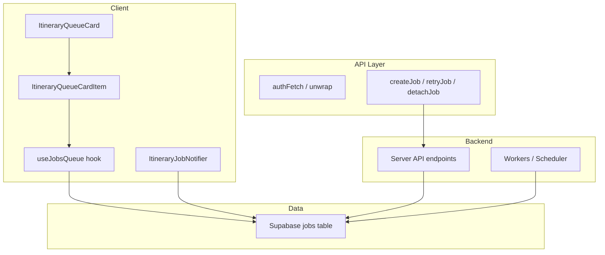
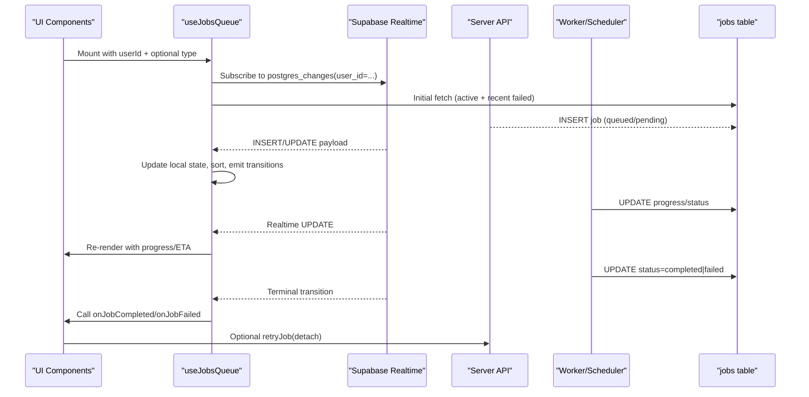
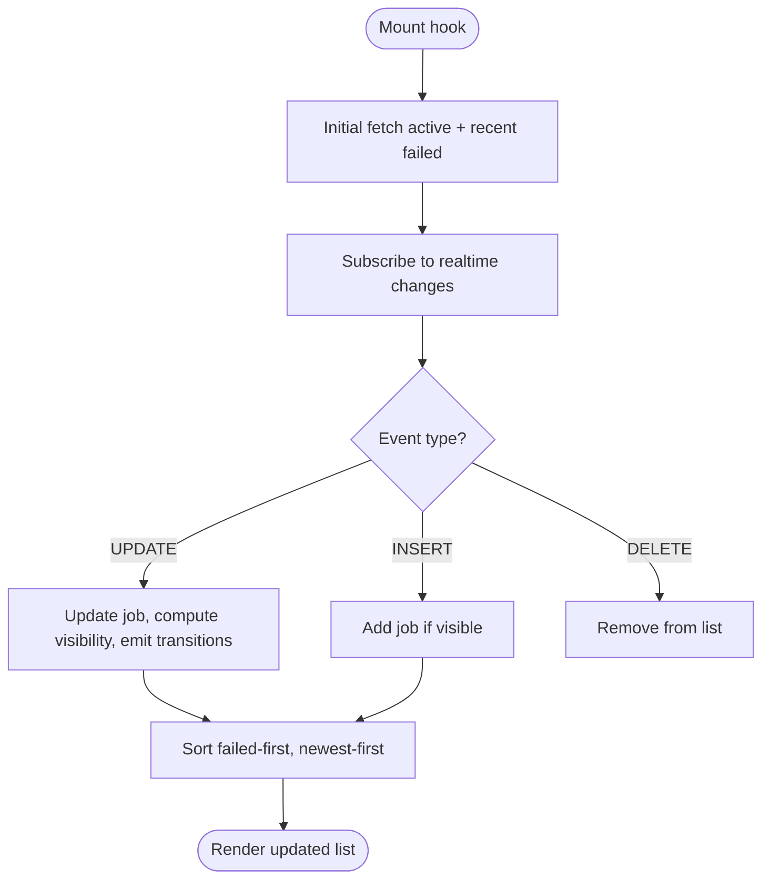
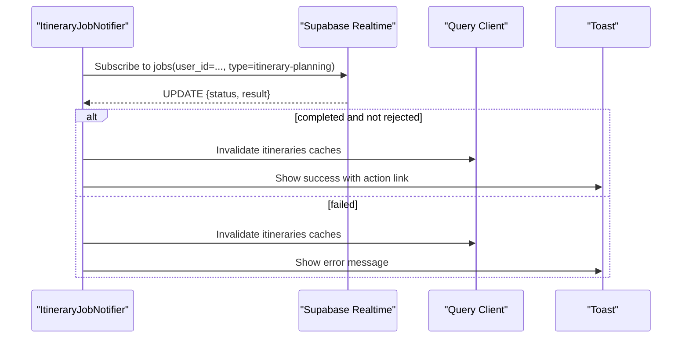
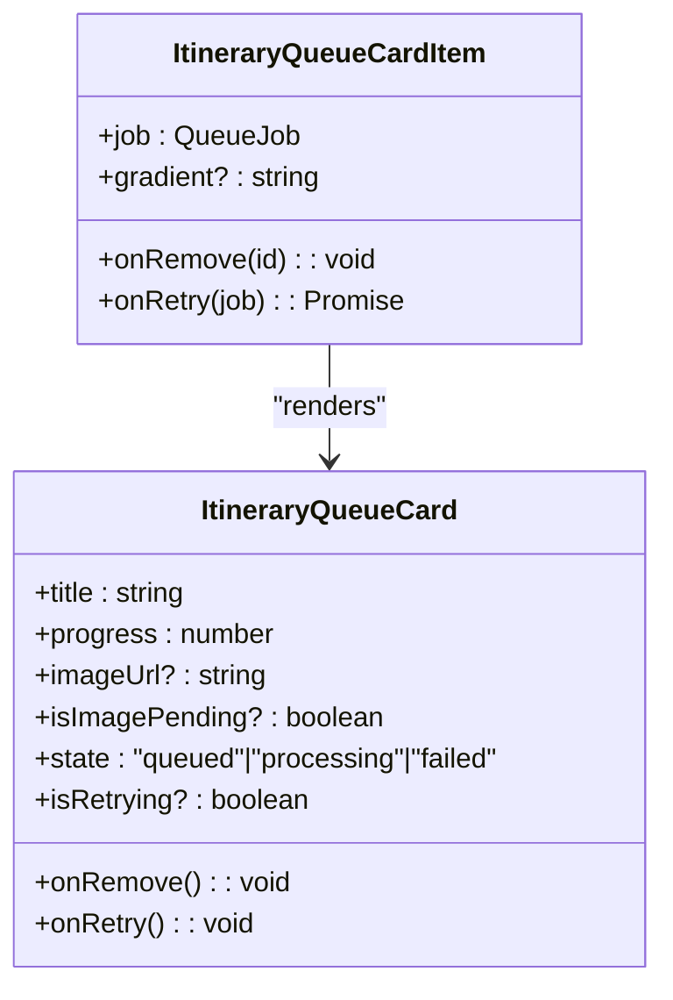
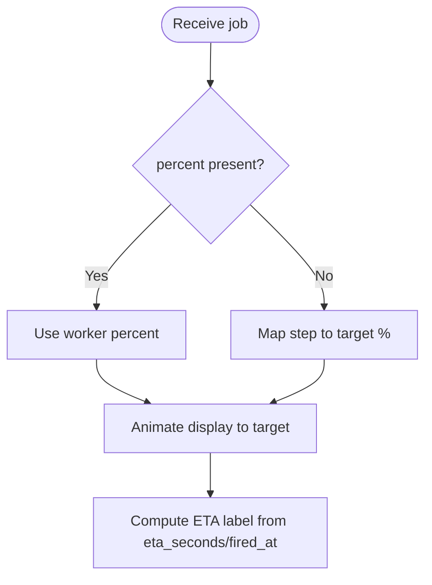
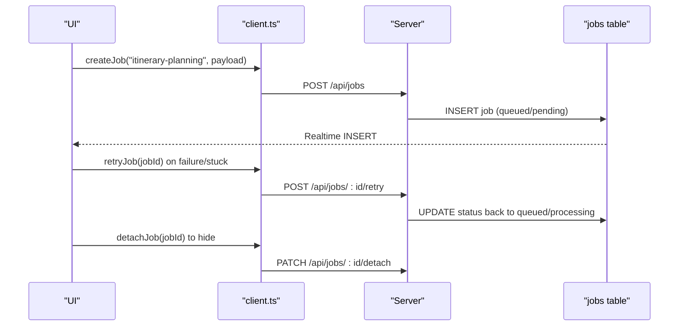
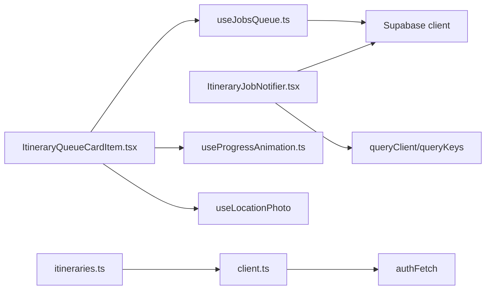

# Job Queue System

<cite>
**Referenced Files in This Document**
- [useJobsQueue.ts](file://src/hooks/useJobsQueue.ts)
- [ItineraryJobNotifier.tsx](file://src/components/notifications/ItineraryJobNotifier.tsx)
- [ItineraryQueueCard.tsx](file://src/components/ui/itinerary/ItineraryQueueCard.tsx)
- [ItineraryQueueCardItem.tsx](file://src/components/ui/itinerary/ItineraryQueueCardItem.tsx)
- [useProgressAnimation.ts](file://src/hooks/useProgressAnimation.ts)
- [useProgressEta.ts](file://src/hooks/useProgressEta.ts)
- [client.ts](file://src/lib/api/client.ts)
- [itineraries.ts](file://src/lib/api/itineraries.ts)
- [page.tsx (links)](file://src/app/links/page.tsx)
</cite>

## Table of Contents
1. [Introduction](#introduction)
2. [Project Structure](#project-structure)
3. [Core Components](#core-components)
4. [Architecture Overview](#architecture-overview)
5. [Detailed Component Analysis](#detailed-component-analysis)
6. [Dependency Analysis](#dependency-analysis)
7. [Performance Considerations](#performance-considerations)
8. [Troubleshooting Guide](#troubleshooting-guide)
9. [Conclusion](#conclusion)
10. [Appendices](#appendices)

## Introduction
This document explains the background job processing system used for long-running operations such as AI-powered itinerary generation. It covers the job queue architecture, task scheduling and progress tracking, the useJobsQueue hook, notification flow, retry logic, timeout handling, prioritization, and guidance for integrating new job types. It also addresses performance considerations for concurrent jobs and resource management on the client side.

## Project Structure
The job system is implemented primarily in React hooks and UI components that subscribe to a shared jobs table via Supabase Realtime. Key pieces:
- Hook layer: useJobsQueue manages real-time job state, transitions, and reconciliation.
- Notification layer: ItineraryJobNotifier listens for specific job type updates and surfaces user feedback via toast notifications.
- UI layer: ItineraryQueueCard and ItineraryQueueCardItem render in-flight jobs with animated progress and ETA.
- API layer: client.ts provides createJob, retryJob, detachJob; itineraries.ts orchestrates creating blank itineraries or kicking off async planning jobs.

**Diagram sources**
- [useJobsQueue.ts:138-267](file://src/hooks/useJobsQueue.ts#L138-L267)
- [ItineraryJobNotifier.tsx:29-88](file://src/components/notifications/ItineraryJobNotifier.tsx#L29-L88)
- [ItineraryQueueCardItem.tsx:39-100](file://src/components/ui/itinerary/ItineraryQueueCardItem.tsx#L39-L100)
- [client.ts:109-155](file://src/lib/api/client.ts#L109-L155)

**Section sources**
- [useJobsQueue.ts:1-296](file://src/hooks/useJobsQueue.ts#L1-L296)
- [ItineraryJobNotifier.tsx:1-92](file://src/components/notifications/ItineraryJobNotifier.tsx#L1-L92)
- [ItineraryQueueCard.tsx:1-199](file://src/components/ui/itinerary/ItineraryQueueCard.tsx#L1-L199)
- [ItineraryQueueCardItem.tsx:1-101](file://src/components/ui/itinerary/ItineraryQueueCardItem.tsx#L1-L101)
- [client.ts:1-156](file://src/lib/api/client.ts#L1-L156)
- [itineraries.ts:54-456](file://src/lib/api/itineraries.ts#L54-L456)

## Core Components
- useJobsQueue: Subscribes to Supabase Realtime for the jobs table, maintains local state, reconciles missed updates, emits lifecycle callbacks, and exposes helpers to remove or optimistically upsert jobs.
- ItineraryJobNotifier: Listens for itinerary-planning job updates and shows success/error toasts while invalidating relevant caches.
- ItineraryQueueCard / ItineraryQueueCardItem: Render queued/processing/failed jobs with progress bars, ETA countdowns, and retry actions.
- Progress hooks: useProgressAnimation maps step-based or worker-reported percent to smooth visual progress; useProgressEta computes a human-friendly countdown between backend updates.
- API client: createJob, retryJob, detachJob provide typed interactions with the server’s job endpoints.

**Section sources**
- [useJobsQueue.ts:45-295](file://src/hooks/useJobsQueue.ts#L45-L295)
- [ItineraryJobNotifier.tsx:10-90](file://src/components/notifications/ItineraryJobNotifier.tsx#L10-L90)
- [ItineraryQueueCard.tsx:35-199](file://src/components/ui/itinerary/ItineraryQueueCard.tsx#L35-L199)
- [ItineraryQueueCardItem.tsx:13-100](file://src/components/ui/itinerary/ItineraryQueueCardItem.tsx#L13-L100)
- [useProgressAnimation.ts:1-41](file://src/hooks/useProgressAnimation.ts#L1-L41)
- [useProgressEta.ts:1-59](file://src/hooks/useProgressEta.ts#L1-L59)
- [client.ts:109-155](file://src/lib/api/client.ts#L109-L155)

## Architecture Overview
The system uses a database-backed job queue with Supabase Realtime for live updates. Clients subscribe to changes for their user_id and optionally filter by job type. Workers update the jobs table as they run stages, including progress metadata. The UI renders jobs in real time and surfaces notifications when terminal states are reached.

**Diagram sources**
- [useJobsQueue.ts:138-267](file://src/hooks/useJobsQueue.ts#L138-L267)
- [client.ts:109-155](file://src/lib/api/client.ts#L109-L155)

## Detailed Component Analysis

### useJobsQueue hook
Responsibilities:
- Establishes a per-instance Supabase channel using a unique instanceId to avoid topic collisions.
- Performs an initial query for active jobs and recent failures (within 24 hours).
- Handles INSERT/UPDATE/DELETE events, filters by type if provided, and maintains visibility rules (e.g., hide detached jobs).
- Tracks last known status per job to detect transitions and invoke lifecycle callbacks only on actual changes.
- Reconciles missed updates on tab visibility change or reconnect by re-fetching tracked jobs.
- Exposes removeJob and upsertJob for optimistic UI updates.

Key behaviors:
- Sorting: Failed jobs pin to the front; within groups newest first.
- Visibility: Only queued/pending/processing or recent failed jobs are shown unless detached.
- Progress: Supports both step-based mapping and worker-reported percent for accurate visuals.

**Diagram sources**
- [useJobsQueue.ts:138-267](file://src/hooks/useJobsQueue.ts#L138-L267)

**Section sources**
- [useJobsQueue.ts:6-43](file://src/hooks/useJobsQueue.ts#L6-L43)
- [useJobsQueue.ts:45-103](file://src/hooks/useJobsQueue.ts#L45-L103)
- [useJobsQueue.ts:109-159](file://src/hooks/useJobsQueue.ts#L109-L159)
- [useJobsQueue.ts:167-267](file://src/hooks/useJobsQueue.ts#L167-L267)
- [useJobsQueue.ts:269-295](file://src/hooks/useJobsQueue.ts#L269-L295)

### ItineraryJobNotifier
Responsibilities:
- Subscribes to updates for itinerary-planning jobs for the current user.
- On completion (non-rejected), invalidates itinerary-related queries and shows a success toast with a “View” action linking to the generated itinerary.
- On failure, invalidates caches and shows an error toast.

**Diagram sources**
- [ItineraryJobNotifier.tsx:29-88](file://src/components/notifications/ItineraryJobNotifier.tsx#L29-L88)

**Section sources**
- [ItineraryJobNotifier.tsx:10-90](file://src/components/notifications/ItineraryJobNotifier.tsx#L10-L90)

### ItineraryQueueCard and ItineraryQueueCardItem
Responsibilities:
- Card item reads trip details from job payload, resolves destination photo, and determines retry eligibility based on failure or stuck-in-flight threshold.
- Uses useProgressAnimation to derive a smooth percentage and displays a progress bar.
- Provides retry button when eligible and handles retry spinner state until backend acknowledges.

**Diagram sources**
- [ItineraryQueueCardItem.tsx:39-100](file://src/components/ui/itinerary/ItineraryQueueCardItem.tsx#L39-L100)
- [ItineraryQueueCard.tsx:35-199](file://src/components/ui/itinerary/ItineraryQueueCard.tsx#L35-L199)

**Section sources**
- [ItineraryQueueCardItem.tsx:13-100](file://src/components/ui/itinerary/ItineraryQueueCardItem.tsx#L13-L100)
- [ItineraryQueueCard.tsx:1-199](file://src/components/ui/itinerary/ItineraryQueueCard.tsx#L1-L199)

### Progress and ETA
- useProgressAnimation: Maps step numbers to target percentages and trusts worker-reported percent when available; animates toward targets with crawl behavior near completion.
- useProgressEta: Computes a human-readable countdown based on worker-provided eta_seconds and fired_at timestamps; avoids misleading countdowns near completion.

**Diagram sources**
- [useProgressAnimation.ts:1-41](file://src/hooks/useProgressAnimation.ts#L1-L41)
- [useProgressEta.ts:1-59](file://src/hooks/useProgressEta.ts#L1-L59)

**Section sources**
- [useProgressAnimation.ts:1-41](file://src/hooks/useProgressAnimation.ts#L1-L41)
- [useProgressEta.ts:1-59](file://src/hooks/useProgressEta.ts#L1-L59)

### Job Creation, Monitoring, and Error Handling Workflows
- Creating jobs:
  - For itineraries, creation can return either a blank itinerary immediately or a planning job handle depending on inputs.
  - Generic job creation goes through createJob(type, payload) which POSTs to /api/jobs.
- Monitoring:
  - useJobsQueue subscribes to realtime updates and keeps the UI in sync.
  - ItineraryJobNotifier provides toast feedback on terminal states.
- Error handling:
  - Retry endpoint: retryJob(jobId) calls /api/jobs/:id/retry.
  - Detach endpoint: detachJob(jobId) calls /api/jobs/:id/detach to hide jobs from the queue.
  - Stuck detection: UI offers retry when a job remains in flight beyond a threshold.

**Diagram sources**
- [client.ts:109-155](file://src/lib/api/client.ts#L109-L155)
- [itineraries.ts:339-439](file://src/lib/api/itineraries.ts#L339-L439)

**Section sources**
- [client.ts:109-155](file://src/lib/api/client.ts#L109-L155)
- [itineraries.ts:54-456](file://src/lib/api/itineraries.ts#L54-L456)
- [page.tsx (links):27-64](file://src/app/links/page.tsx#L27-L64)

## Dependency Analysis
- useJobsQueue depends on Supabase client and the jobs table schema. It does not depend on UI components, making it reusable across screens.
- ItineraryJobNotifier depends on Supabase client, query client cache keys, and toast context.
- ItineraryQueueCardItem depends on useProgressAnimation, useLocationPhoto, and the QueueJob type.
- API client functions depend on authFetch and environment configuration for the backend URL.

**Diagram sources**
- [useJobsQueue.ts:1-5](file://src/hooks/useJobsQueue.ts#L1-L5)
- [ItineraryJobNotifier.tsx:1-8](file://src/components/notifications/ItineraryJobNotifier.tsx#L1-L8)
- [ItineraryQueueCardItem.tsx:1-7](file://src/components/ui/itinerary/ItineraryQueueCardItem.tsx#L1-L7)
- [client.ts:1-3](file://src/lib/api/client.ts#L1-L3)
- [itineraries.ts:54-87](file://src/lib/api/itineraries.ts#L54-L87)

**Section sources**
- [useJobsQueue.ts:1-5](file://src/hooks/useJobsQueue.ts#L1-L5)
- [ItineraryJobNotifier.tsx:1-8](file://src/components/notifications/ItineraryJobNotifier.tsx#L1-L8)
- [ItineraryQueueCardItem.tsx:1-7](file://src/components/ui/itinerary/ItineraryQueueCardItem.tsx#L1-L7)
- [client.ts:1-3](file://src/lib/api/client.ts#L1-L3)
- [itineraries.ts:54-87](file://src/lib/api/itineraries.ts#L54-L87)

## Performance Considerations
- Realtime subscription efficiency:
  - Per-instance channels prevent duplicate subscriptions and reduce overhead.
  - Type filtering reduces noise when multiple job types exist.
- State reconciliation:
  - Re-fetch on visibility change and reconnect prevents stale UI during offline periods.
- Rendering optimization:
  - Sorting only on status transitions and minimal re-renders via stable keying and diffing.
  - ETA and progress animations decouple UI ticks from backend updates.
- Concurrency and resources:
  - Keep subscriptions scoped to active components; ensure cleanup on unmount.
  - Avoid heavy work in realtime handlers; delegate to hooks and memoized computations.
- Network resilience:
  - Optimistic upsert allows immediate UI feedback even if realtime lags.
  - Stuck detection thresholds allow users to recover without waiting indefinitely.

[No sources needed since this section provides general guidance]

## Troubleshooting Guide
Common issues and resolutions:
- Jobs disappear mid-progress:
  - Ensure visibility listeners and reconcile logic are running; check connectionError state from useJobsQueue.
- No toast on completion:
  - Verify ItineraryJobNotifier is mounted and subscribed; confirm job type is itinerary-planning and result.is_rejected is false.
- Retry button not enabled:
  - Check if job is in failed or stuck-in-flight state; verify updated_at timestamp relative to threshold.
- Duplicate realtime events:
  - Confirm each hook instance has a unique instanceId suffix; avoid sharing channels across instances.

**Section sources**
- [useJobsQueue.ts:167-267](file://src/hooks/useJobsQueue.ts#L167-L267)
- [ItineraryJobNotifier.tsx:29-88](file://src/components/notifications/ItineraryJobNotifier.tsx#L29-L88)
- [ItineraryQueueCardItem.tsx:63-83](file://src/components/ui/itinerary/ItineraryQueueCardItem.tsx#L63-L83)

## Conclusion
The job queue system combines a database-backed queue with Supabase Realtime to deliver responsive, reliable, and user-friendly handling of long-running tasks like AI itinerary generation. The useJobsQueue hook centralizes state and transitions, while dedicated UI components and notifications keep users informed. Robust retry and stuck-detection mechanisms improve resilience, and progress/ETA hooks enhance perceived performance. Extending the system involves adding new job types, subscribing via useJobsQueue, and wiring appropriate notifications and UI.

[No sources needed since this section summarizes without analyzing specific files]

## Appendices

### Integrating New Job Types
Steps:
- Define job type string and payload shape in your feature module.
- Create jobs via createJob(type, payload) or domain-specific wrappers (e.g., itineraries.ts).
- Subscribe to jobs using useJobsQueue with type filter to show in-context cards.
- Add a notifier component similar to ItineraryJobNotifier to surface success/error feedback and invalidate caches.
- Implement retry and detach flows using retryJob and detachJob where appropriate.

**Section sources**
- [client.ts:109-155](file://src/lib/api/client.ts#L109-L155)
- [itineraries.ts:339-439](file://src/lib/api/itineraries.ts#L339-L439)
- [ItineraryJobNotifier.tsx:29-88](file://src/components/notifications/ItineraryJobNotifier.tsx#L29-L88)