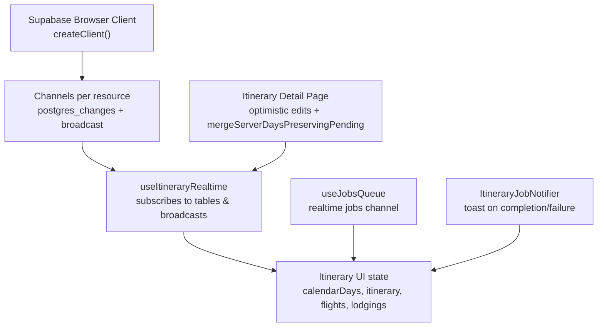
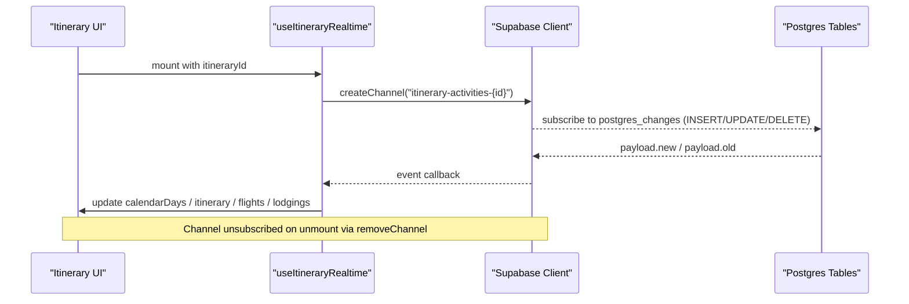
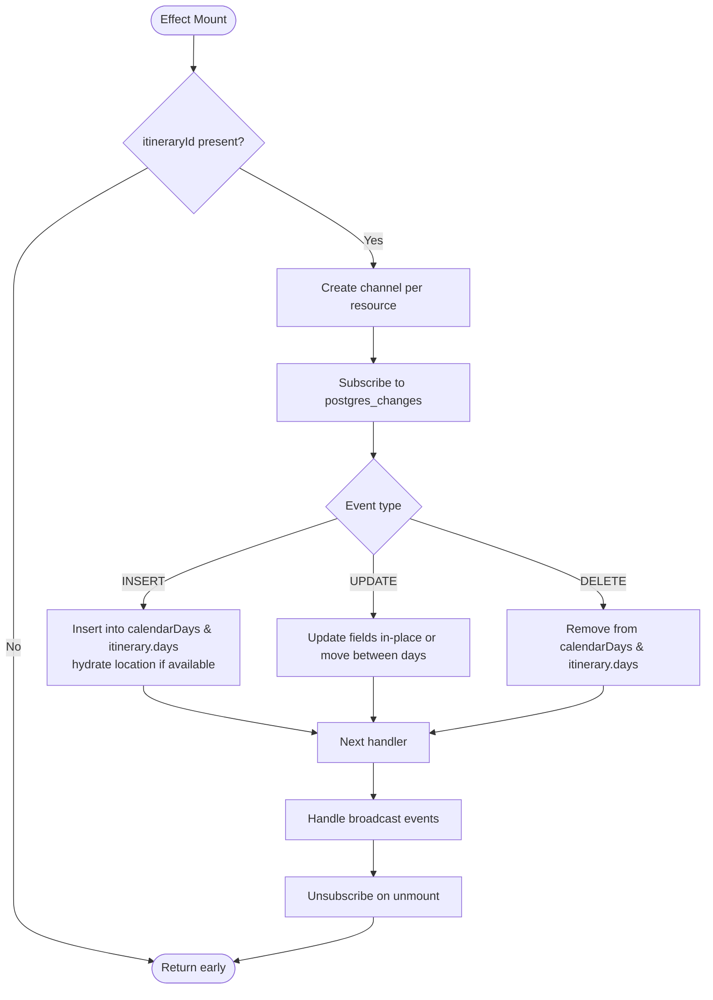
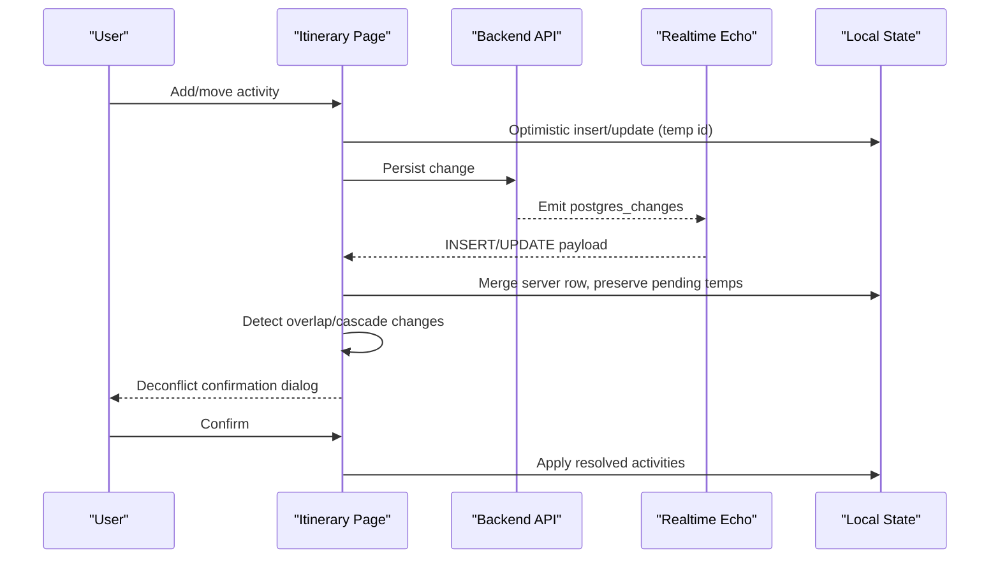
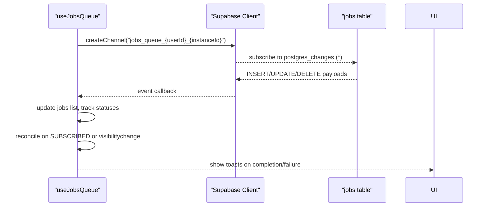
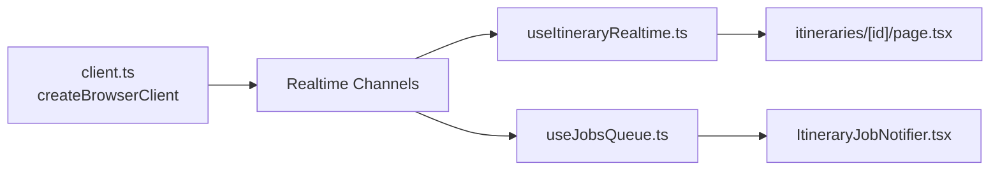

# Real-time Synchronization

<cite>
**Referenced Files in This Document**
- [useItineraryRealtime.ts](file://src/hooks/useItineraryRealtime.ts)
- [client.ts](file://src/lib/supabase/client.ts)
- [page.tsx](file://src/app/itineraries/[id]/page.tsx)
- [useJobsQueue.ts](file://src/hooks/useJobsQueue.ts)
- [ItineraryJobNotifier.tsx](file://src/components/notifications/ItineraryJobNotifier.tsx)
- [personalization-pipeline.md](file://docs/personalization-pipeline.md)
</cite>

## Table of Contents
1. Introduction
2. Project Structure
3. Core Components
4. Architecture Overview
5. Detailed Component Analysis
6. Dependency Analysis
7. Performance Considerations
8. Troubleshooting Guide
9. Conclusion

## Introduction
This document explains how real-time data synchronization is implemented using Supabase subscriptions in the application, focusing on WebSocket connection management, channel subscriptions, and event handling patterns. It details the useItineraryRealtime hook for live itinerary updates and collaborative editing features, including optimistic UI updates, conflict resolution strategies, presence detection via database-backed membership changes, and subscription lifecycle management with memory cleanup. It also covers connection reliability, reconnection logic, and offline support considerations as implemented across hooks that consume Supabase realtime.

## Project Structure
The real-time system centers around:
- A client factory that creates a Supabase browser client configured with environment variables.
- A dedicated React hook that subscribes to multiple Supabase channels for different aspects of an itinerary (activities, days, metadata, collaborators, flights, lodgings).
- The itinerary detail page that orchestrates optimistic edits, server reconciliation, and collaboration workflows.
- Supporting hooks and components that subscribe to realtime events for job queues and notifications.

**Diagram sources**
- [client.ts:1-9](file://src/lib/supabase/client.ts#L1-L9)
- [useItineraryRealtime.ts:39-333](file://src/hooks/useItineraryRealtime.ts#L39-L333)
- [page.tsx:106-178](file://src/app/itineraries/[id]/page.tsx#L106-L178)
- [useJobsQueue.ts:167-266](file://src/hooks/useJobsQueue.ts#L167-L266)
- [ItineraryJobNotifier.tsx:63-91](file://src/components/notifications/ItineraryJobNotifier.tsx#L63-L91)

**Section sources**
- [client.ts:1-9](file://src/lib/supabase/client.ts#L1-L9)
- [useItineraryRealtime.ts:39-333](file://src/hooks/useItineraryRealtime.ts#L39-L333)
- [page.tsx:106-178](file://src/app/itineraries/[id]/page.tsx#L106-L178)
- [useJobsQueue.ts:167-266](file://src/hooks/useJobsQueue.ts#L167-L266)
- [ItineraryJobNotifier.tsx:63-91](file://src/components/notifications/ItineraryJobNotifier.tsx#L63-L91)

## Core Components
- Supabase client factory: Creates a browser client using environment configuration.
- useItineraryRealtime hook: Subscribes to multiple channels for activities, days, itinerary metadata, collaborators, flights, and lodgings; handles INSERT/UPDATE/DELETE events and broadcast messages; hydrates activity locations asynchronously; cleans up channels on unmount.
- Itinerary detail page: Implements optimistic UI updates, merges server rows while preserving pending local edits, and presents conflict resolution prompts for overlapping or cascaded time changes.
- useJobsQueue hook: Subscribes to realtime job updates, reconciles missed updates after reconnect or visibility changes, and exposes optimistic upserts.
- ItineraryJobNotifier component: Listens to job completion/failure events and shows user-facing toasts.

**Section sources**
- [client.ts:1-9](file://src/lib/supabase/client.ts#L1-L9)
- [useItineraryRealtime.ts:39-533](file://src/hooks/useItineraryRealtime.ts#L39-L533)
- [page.tsx:106-178](file://src/app/itineraries/[id]/page.tsx#L106-L178)
- [useJobsQueue.ts:167-295](file://src/hooks/useJobsQueue.ts#L167-L295)
- [ItineraryJobNotifier.tsx:63-91](file://src/components/notifications/ItineraryJobNotifier.tsx#L63-L91)

## Architecture Overview
The architecture uses Supabase realtime channels to keep the UI synchronized with the database. Each feature area subscribes to specific tables with filters scoped to an itinerary or user. Events are handled by updating local React state immediately (optimistic UI), then reconciling with server-provided data when needed. Connection status and reconnection are monitored where applicable, and channels are removed on component unmount to prevent memory leaks.

**Diagram sources**
- [useItineraryRealtime.ts:89-333](file://src/hooks/useItineraryRealtime.ts#L89-L333)
- [client.ts:1-9](file://src/lib/supabase/client.ts#L1-L9)

## Detailed Component Analysis

### useItineraryRealtime hook
Responsibilities:
- Subscribe to postgres_changes for itinerary_activities, itinerary_days, itineraries, user_itinerary, itinerary_flights, and itinerary_lodgings.
- Handle INSERT/UPDATE/DELETE events to update both calendar view state and itinerary model state.
- Hydrate activity location data asynchronously after INSERT echoes arrive.
- Manage broadcast events for immediate UI feedback.
- Clean up channels on unmount to avoid memory leaks.

Key patterns:
- Per-resource channels named with itineraryId to scope events.
- Idempotent updates: checks for existing items before adding to arrays.
- Cross-day move handling for activities by removing from source day and appending to target day.
- Position preservation to avoid re-sorting issues during drag-and-drop reorder.

**Diagram sources**
- [useItineraryRealtime.ts:39-333](file://src/hooks/useItineraryRealtime.ts#L39-L333)

**Section sources**
- [useItineraryRealtime.ts:39-333](file://src/hooks/useItineraryRealtime.ts#L39-L333)
- [useItineraryRealtime.ts:335-386](file://src/hooks/useItineraryRealtime.ts#L335-L386)
- [useItineraryRealtime.ts:388-440](file://src/hooks/useItineraryRealtime.ts#L388-L440)
- [useItineraryRealtime.ts:442-533](file://src/hooks/useItineraryRealtime.ts#L442-L533)

### Itinerary detail page: optimistic UI and conflict resolution
Responsibilities:
- Apply optimistic updates for new activities and moves, showing immediate feedback while requests are in flight.
- Merge server-provided days into the working copy without dropping pending local edits, using correlation tokens and fallback matching.
- Present deconflict confirmations when cascade times change due to overlaps or reordering, showing locked anchors and proposed changes.

Conflict resolution strategy:
- Use correlation_id to match optimistic temp entries with server rows once they arrive.
- Preserve local ordering for known activities while adopting server field values.
- Show a confirmation dialog summarizing changes and allowing user review before applying cascaded time adjustments.

**Diagram sources**
- [page.tsx:106-178](file://src/app/itineraries/[id]/page.tsx#L106-L178)
- [page.tsx:720-744](file://src/app/itineraries/[id]/page.tsx#L720-L744)
- [page.tsx:957-999](file://src/app/itineraries/[id]/page.tsx#L957-L999)
- [page.tsx:2074-2090](file://src/app/itineraries/[id]/page.tsx#L2074-L2090)

**Section sources**
- [page.tsx:106-178](file://src/app/itineraries/[id]/page.tsx#L106-L178)
- [page.tsx:720-744](file://src/app/itineraries/[id]/page.tsx#L720-L744)
- [page.tsx:957-999](file://src/app/itineraries/[id]/page.tsx#L957-L999)
- [page.tsx:2074-2090](file://src/app/itineraries/[id]/page.tsx#L2074-L2090)

### Job queue realtime integration
Responsibilities:
- Subscribe to realtime updates for jobs table filtered by user and optional type.
- Reconcile missed updates after reconnect or tab visibility changes.
- Track last known statuses to detect transitions and emit callbacks for completed/failed/rejected jobs.
- Provide optimistic upsert to reflect immediate status changes.

Connection reliability:
- Monitor channel status and set connectionError on errors/timeouts.
- On SUBSCRIBED status, reconcile running jobs to catch up.

**Diagram sources**
- [useJobsQueue.ts:167-266](file://src/hooks/useJobsQueue.ts#L167-L266)
- [ItineraryJobNotifier.tsx:63-91](file://src/components/notifications/ItineraryJobNotifier.tsx#L63-L91)

**Section sources**
- [useJobsQueue.ts:167-266](file://src/hooks/useJobsQueue.ts#L167-L266)
- [useJobsQueue.ts:269-295](file://src/hooks/useJobsQueue.ts#L269-L295)
- [ItineraryJobNotifier.tsx:63-91](file://src/components/notifications/ItineraryJobNotifier.tsx#L63-L91)

### Presence detection and collaborative editing
Presence detection:
- Collaborator joins/leaves are tracked via realtime INSERT/DELETE on user_itinerary scoped to the itinerary.
- The hook updates the itinerary’s collaborators array, enabling UI elements like avatar groups and traveller counts to reflect current participants.

Collaborative editing:
- Activities, days, and metadata are synced via postgres_changes, ensuring all collaborators see consistent state.
- Optimistic UI updates provide immediate feedback while server reconciliation ensures consistency.

**Section sources**
- [useItineraryRealtime.ts:407-440](file://src/hooks/useItineraryRealtime.ts#L407-L440)
- [useItineraryRealtime.ts:39-333](file://src/hooks/useItineraryRealtime.ts#L39-L333)
- [page.tsx:106-178](file://src/app/itineraries/[id]/page.tsx#L106-L178)

### Subscription lifecycle management and memory cleanup
Patterns:
- Each useEffect creates a channel and subscribes to events.
- Cleanup functions call supabase.removeChannel(channel) to unsubscribe and free resources.
- For multi-instance scenarios, unique instance IDs are appended to channel names to avoid deduplication conflicts.

Memory safety:
- Refs store channel instances for explicit removal.
- Boolean flags and mounted checks prevent state updates after unmount.

**Section sources**
- [useItineraryRealtime.ts:328-333](file://src/hooks/useItineraryRealtime.ts#L328-L333)
- [useItineraryRealtime.ts:385-386](file://src/hooks/useItineraryRealtime.ts#L385-L386)
- [useJobsQueue.ts:262-266](file://src/hooks/useJobsQueue.ts#L262-L266)

## Dependency Analysis
The real-time system depends on:
- Supabase client creation via environment variables.
- Database tables: itinerary_activities, itinerary_days, itineraries, user_itinerary, itinerary_flights, itinerary_lodgings, jobs.
- React state and refs for managing UI and channel lifecycles.
- Utility functions for time parsing, formatting, and mapping payloads to UI models.

**Diagram sources**
- [client.ts:1-9](file://src/lib/supabase/client.ts#L1-L9)
- [useItineraryRealtime.ts:39-533](file://src/hooks/useItineraryRealtime.ts#L39-L533)
- [useJobsQueue.ts:167-266](file://src/hooks/useJobsQueue.ts#L167-L266)
- [ItineraryJobNotifier.tsx:63-91](file://src/components/notifications/ItineraryJobNotifier.tsx#L63-L91)
- [page.tsx:106-178](file://src/app/itineraries/[id]/page.tsx#L106-L178)

**Section sources**
- [client.ts:1-9](file://src/lib/supabase/client.ts#L1-L9)
- [useItineraryRealtime.ts:39-533](file://src/hooks/useItineraryRealtime.ts#L39-L533)
- [useJobsQueue.ts:167-266](file://src/hooks/useJobsQueue.ts#L167-L266)
- [ItineraryJobNotifier.tsx:63-91](file://src/components/notifications/ItineraryJobNotifier.tsx#L63-L91)
- [page.tsx:106-178](file://src/app/itineraries/[id]/page.tsx#L106-L178)

## Performance Considerations
- Deduplicate inserts: Handlers check for existing items before appending to arrays to avoid duplicates.
- In-place updates: When possible, replace items in place rather than rebuilding arrays to minimize re-renders.
- Conditional subscriptions: Some channels activate only when relevant UI sections are visible (e.g., flights/lodgings sidebars).
- Efficient merging: Server rows are merged while preserving local order and pending optimistic entries to reduce churn.

[No sources needed since this section provides general guidance]

## Troubleshooting Guide
Common issues and mitigations:
- Missed realtime updates: Reconciliation runs on SUBSCRIBED status and when the tab becomes visible to catch up missed updates.
- Duplicate items: Handlers guard against duplicate inserts by checking existing IDs.
- Stale legs after reorders: Clear stale travel legs when reordering to ensure fresh computation on save.
- Memory leaks: Ensure channels are removed in cleanup functions; verify unique instance IDs for multi-instance scenarios.

**Section sources**
- [useJobsQueue.ts:250-266](file://src/hooks/useJobsQueue.ts#L250-L266)
- [useJobsQueue.ts:161-165](file://src/hooks/useJobsQueue.ts#L161-L165)
- [useItineraryRealtime.ts:328-333](file://src/hooks/useItineraryRealtime.ts#L328-L333)
- [page.tsx:2074-2090](file://src/app/itineraries/[id]/page.tsx#L2074-L2090)

## Conclusion
The application implements robust real-time synchronization using Supabase subscriptions across multiple resources. The useItineraryRealtime hook centralizes channel management and event handling for itinerary-related data, while the itinerary detail page coordinates optimistic UI updates and conflict resolution. Supporting hooks manage job queue realtime updates and notifications. Connection reliability is addressed through status monitoring and reconciliation, and careful lifecycle management prevents memory leaks. Together, these patterns enable responsive collaborative editing and live updates for users.

[No sources needed since this section summarizes without analyzing specific files]