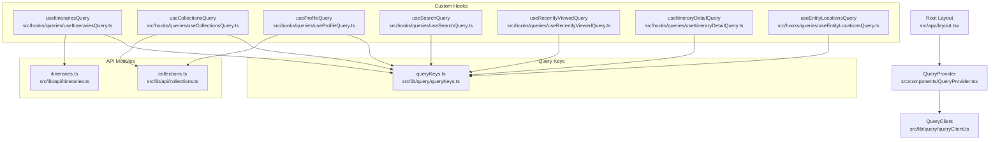
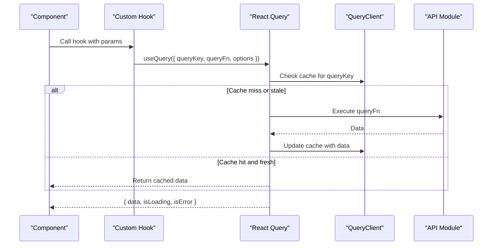
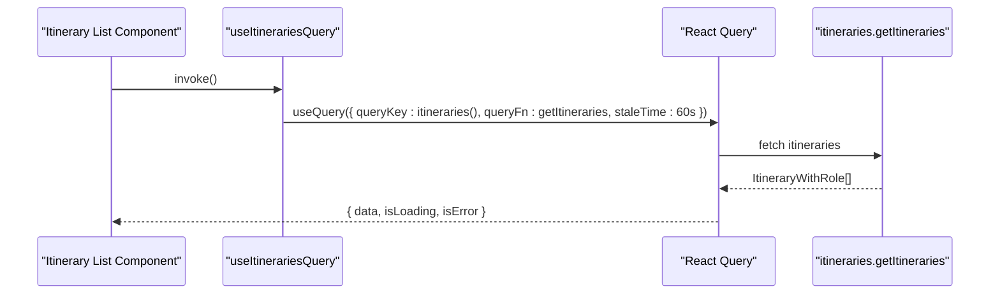
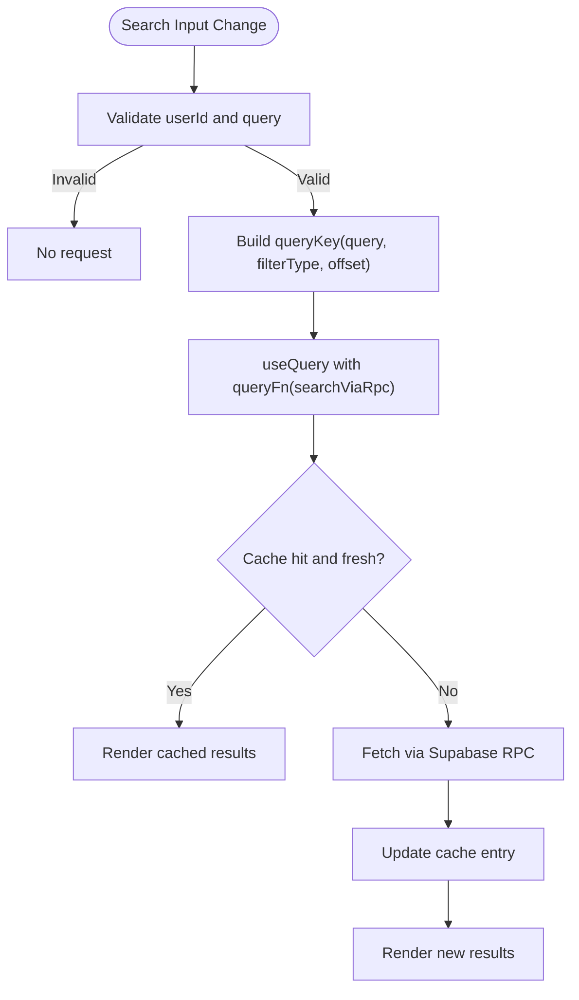
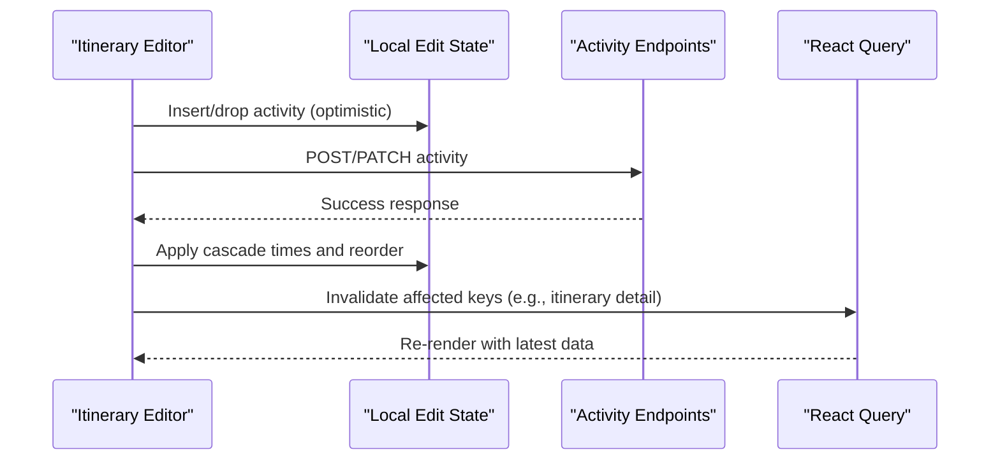
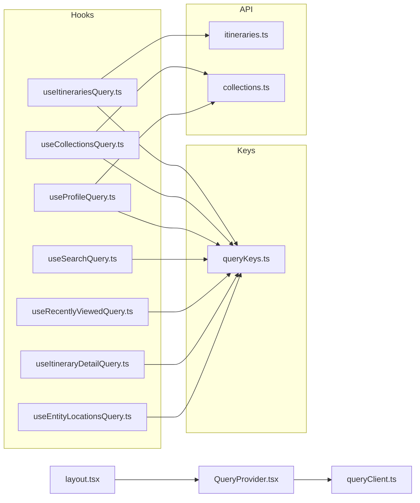

# Server State Management

<cite>
**Referenced Files in This Document**
- [QueryProvider.tsx](file://src/components/QueryProvider.tsx)
- [queryClient.ts](file://src/lib/query/queryClient.ts)
- [queryKeys.ts](file://src/lib/query/queryKeys.ts)
- [useItinerariesQuery.ts](file://src/hooks/queries/useItinerariesQuery.ts)
- [useCollectionsQuery.ts](file://src/hooks/queries/useCollectionsQuery.ts)
- [useProfileQuery.ts](file://src/hooks/queries/useProfileQuery.ts)
- [useSearchQuery.ts](file://src/hooks/queries/useSearchQuery.ts)
- [useRecentlyViewedQuery.ts](file://src/hooks/queries/useRecentlyViewedQuery.ts)
- [useItineraryDetailQuery.ts](file://src/hooks/queries/useItineraryDetailQuery.ts)
- [useEntityLocationsQuery.ts](file://src/hooks/queries/useEntityLocationsQuery.ts)
- [itineraries.ts](file://src/lib/api/itineraries.ts)
- [collections.ts](file://src/lib/api/collections.ts)
- [layout.tsx](file://src/app/layout.tsx)
</cite>

## Table of Contents
1. [Introduction](#introduction)
2. [Project Structure](#project-structure)
3. [Core Components](#core-components)
4. [Architecture Overview](#architecture-overview)
5. [Detailed Component Analysis](#detailed-component-analysis)
6. [Dependency Analysis](#dependency-analysis)
7. [Performance Considerations](#performance-considerations)
8. [Troubleshooting Guide](#troubleshooting-guide)
9. [Conclusion](#conclusion)

## Introduction
This document explains the server state management system built with React Query (TanStack Query). It covers the query client configuration, cache strategies, data synchronization patterns, and custom hooks for fetching data such as itineraries, collections, and user profiles. It also details caching mechanisms including stale-while-revalidate behavior, background refetching, pagination and filtering patterns, optimistic updates, error handling, loading states, cache invalidation strategies, query key design, dependency tracking, and performance optimization techniques.

## Project Structure
The React Query setup is provided at the application root via a provider that wraps the app with a configured QueryClient. Custom hooks encapsulate queries using centralized query keys, while API modules implement data fetching logic. The layout wires up the provider so all components can consume React Query.

**Diagram sources**
- [layout.tsx:57-83](file://src/app/layout.tsx#L57-L83)
- [QueryProvider.tsx:7-13](file://src/components/QueryProvider.tsx#L7-L13)
- [queryClient.ts:1-13](file://src/lib/query/queryClient.ts#L1-L13)
- [queryKeys.ts:1-42](file://src/lib/query/queryKeys.ts#L1-L42)
- [useItinerariesQuery.ts:10-16](file://src/hooks/queries/useItinerariesQuery.ts#L10-L16)
- [useCollectionsQuery.ts:10-16](file://src/hooks/queries/useCollectionsQuery.ts#L10-L16)
- [useProfileQuery.ts:8-19](file://src/hooks/queries/useProfileQuery.ts#L8-L19)
- [useSearchQuery.ts:8-23](file://src/hooks/queries/useSearchQuery.ts#L8-L23)
- [useRecentlyViewedQuery.ts:8-18](file://src/hooks/queries/useRecentlyViewedQuery.ts#L8-L18)
- [useItineraryDetailQuery.ts:8-18](file://src/hooks/queries/useItineraryDetailQuery.ts#L8-L18)
- [useEntityLocationsQuery.ts:8-21](file://src/hooks/queries/useEntityLocationsQuery.ts#L8-L21)
- [itineraries.ts:54-57](file://src/lib/api/itineraries.ts#L54-L57)
- [collections.ts:65-69](file://src/lib/api/collections.ts#L65-L69)

**Section sources**
- [layout.tsx:57-83](file://src/app/layout.tsx#L57-L83)
- [QueryProvider.tsx:7-13](file://src/components/QueryProvider.tsx#L7-L13)
- [queryClient.ts:1-13](file://src/lib/query/queryClient.ts#L1-L13)
- [queryKeys.ts:1-42](file://src/lib/query/queryKeys.ts#L1-L42)

## Core Components
- QueryClient configuration: Defines global defaults for stale time, garbage collection time, retry policy, and window focus refetch behavior.
- Query keys: Centralized factory functions to build stable, hierarchical query keys for each resource and its dependencies.
- Custom hooks: Encapsulate useQuery calls with appropriate query keys, query functions, and per-query options like staleTime and enabled flags.
- API modules: Implement typed fetchers and mutations for resources like itineraries and collections.

Key behaviors:
- Stale-while-revalidate: Queries are considered fresh until their staleTime elapses; after that they refetch in the background while serving cached data.
- Background refetching: Enabled by default when components mount or become visible; here disabled on window focus to avoid unnecessary network requests.
- Garbage collection: Cached entries are retained for gcTime before being removed from memory.

**Section sources**
- [queryClient.ts:1-13](file://src/lib/query/queryClient.ts#L1-L13)
- [queryKeys.ts:1-42](file://src/lib/query/queryKeys.ts#L1-L42)
- [useItinerariesQuery.ts:10-16](file://src/hooks/queries/useItinerariesQuery.ts#L10-L16)
- [useCollectionsQuery.ts:10-16](file://src/hooks/queries/useCollectionsQuery.ts#L10-L16)
- [useProfileQuery.ts:8-19](file://src/hooks/queries/useProfileQuery.ts#L8-L19)

## Architecture Overview
The architecture follows a clear separation of concerns:
- Provider layer: Wraps the app with QueryClient.
- Hook layer: Encapsulates data fetching logic and exposes normalized results to components.
- Key layer: Ensures consistent cache addressing across the app.
- API layer: Performs HTTP or RPC calls and returns typed data.

**Diagram sources**
- [QueryProvider.tsx:7-13](file://src/components/QueryProvider.tsx#L7-L13)
- [queryClient.ts:1-13](file://src/lib/query/queryClient.ts#L1-L13)
- [useItinerariesQuery.ts:10-16](file://src/hooks/queries/useItinerariesQuery.ts#L10-L16)
- [useCollectionsQuery.ts:10-16](file://src/hooks/queries/useCollectionsQuery.ts#L10-L16)
- [useProfileQuery.ts:8-19](file://src/hooks/queries/useProfileQuery.ts#L8-L19)
- [itineraries.ts:54-57](file://src/lib/api/itineraries.ts#L54-L57)
- [collections.ts:65-69](file://src/lib/api/collections.ts#L65-L69)

## Detailed Component Analysis

### Query Client Configuration
- Global defaults:
  - staleTime: 5 minutes
  - gcTime: 10 minutes
  - retry: 1
  - refetchOnWindowFocus: false
- These defaults apply to all queries unless overridden in individual hooks.

Implications:
- Data remains fresh for 5 minutes before background refetch triggers.
- Unused caches are cleaned up after 10 minutes.
- Window focus does not trigger refetches, reducing network churn.

**Section sources**
- [queryClient.ts:1-13](file://src/lib/query/queryClient.ts#L1-L13)

### Query Key Design and Dependency Tracking
- Centralized query keys ensure deterministic cache addresses based on resource identifiers and parameters.
- Examples include keys for itineraries, collections, profile by userId, search with query/filter/offset, entity locations by type/id, and metrics with pagination parameters.
- Benefits:
  - Automatic cache invalidation by key mutation.
  - Fine-grained dependency tracking (e.g., search depends on query string, filter, offset).
  - Predictable sharing of data across components.

**Section sources**
- [queryKeys.ts:1-42](file://src/lib/query/queryKeys.ts#L1-L42)

### Custom Hooks Pattern

#### useItinerariesQuery
- Purpose: Fetch list of itineraries with role metadata.
- Query key: itineraries list key.
- Query function: GET itineraries endpoint.
- Stale time: 60 seconds.
- Typical usage: Display itinerary lists; refetch after create/update/delete operations via cache invalidation.

**Diagram sources**
- [useItinerariesQuery.ts:10-16](file://src/hooks/queries/useItinerariesQuery.ts#L10-L16)
- [itineraries.ts:54-57](file://src/lib/api/itineraries.ts#L54-L57)

**Section sources**
- [useItinerariesQuery.ts:10-16](file://src/hooks/queries/useItinerariesQuery.ts#L10-L16)
- [itineraries.ts:54-57](file://src/lib/api/itineraries.ts#L54-L57)

#### useCollectionsQuery
- Purpose: Fetch collections with role and preview info.
- Query key: collections list key.
- Query function: GET collections endpoint.
- Stale time: 60 seconds.
- Typical usage: Display collection grid; refetch after create/update/delete.

**Section sources**
- [useCollectionsQuery.ts:10-16](file://src/hooks/queries/useCollectionsQuery.ts#L10-L16)
- [collections.ts:65-69](file://src/lib/api/collections.ts#L65-L69)

#### useProfileQuery
- Purpose: Fetch current user profile by userId.
- Query key: profile(userId).
- Query function: Supabase RPC to get profile.
- Options:
  - enabled: only run when userId is present.
  - staleTime: Infinity (profile rarely changes).
  - gcTime: Infinity (keep profile in cache).
- Typical usage: User settings, avatar, permissions.

**Section sources**
- [useProfileQuery.ts:8-19](file://src/hooks/queries/useProfileQuery.ts#L8-L19)

#### Pagination, Filtering, and Search
- useSearchQuery demonstrates parameterized queries with query, filterType, and offset.
- Query key includes all three parameters to isolate cache entries per page and filter.
- enabled flag ensures no network call without userId or empty query.
- Stale time set to 30 seconds for responsive search UX.

**Diagram sources**
- [useSearchQuery.ts:8-23](file://src/hooks/queries/useSearchQuery.ts#L8-L23)
- [queryKeys.ts:16-17](file://src/lib/query/queryKeys.ts#L16-L17)

**Section sources**
- [useSearchQuery.ts:8-23](file://src/hooks/queries/useSearchQuery.ts#L8-L23)
- [queryKeys.ts:16-17](file://src/lib/query/queryKeys.ts#L16-L17)

#### Recently Viewed and Entity Locations
- useRecentlyViewedQuery: Fetches recently viewed items for a user with a 2-minute stale time.
- useEntityLocationsQuery: Fetches locations tied to an entity (link/collection/itinerary) with a 5-minute stale time.
- Both follow the same pattern: keyed by entity identity and enabled conditionally.

**Section sources**
- [useRecentlyViewedQuery.ts:8-18](file://src/hooks/queries/useRecentlyViewedQuery.ts#L8-L18)
- [useEntityLocationsQuery.ts:8-21](file://src/hooks/queries/useEntityLocationsQuery.ts#L8-L21)
- [queryKeys.ts:14-19](file://src/lib/query/queryKeys.ts#L14-L19)

#### Itinerary Detail
- useItineraryDetailQuery: Fetches detailed itinerary data by id with a 5-minute stale time.
- Enables only when id is present.

**Section sources**
- [useItineraryDetailQuery.ts:8-18](file://src/hooks/queries/useItineraryDetailQuery.ts#L8-L18)

### Caching Mechanisms and Stale-While-Revalidate
- Default staleTime: 5 minutes globally; per-hook overrides exist (e.g., 60s for lists, 30s for search, Infinity for profile).
- Behavior:
  - On first load: fetch and cache.
  - While fresh: serve cached data immediately.
  - After staleTime: refetch in background and update cache.
- gcTime: 10 minutes globally; unused caches are evicted after this period.

Practical guidance:
- Use longer staleTime for infrequently changing data (profiles).
- Use shorter staleTime for dynamic lists (collections, itineraries).
- For search, keep staleTime low to balance responsiveness and freshness.

**Section sources**
- [queryClient.ts:1-13](file://src/lib/query/queryClient.ts#L1-L13)
- [useItinerariesQuery.ts:10-16](file://src/hooks/queries/useItinerariesQuery.ts#L10-L16)
- [useCollectionsQuery.ts:10-16](file://src/hooks/queries/useCollectionsQuery.ts#L10-L16)
- [useSearchQuery.ts:8-23](file://src/hooks/queries/useSearchQuery.ts#L8-L23)
- [useProfileQuery.ts:8-19](file://src/hooks/queries/useProfileQuery.ts#L8-L19)

### Data Synchronization Patterns
- Read-through caching: All reads go through React Query cache; writes should invalidate relevant keys to keep UI in sync.
- Optimistic updates:
  - For activity creation/move/delete within itineraries, local state is updated immediately while awaiting server confirmation.
  - Correlation IDs help match temporary entries to persisted rows.
  - Pending time recomputation tracks downstream activities needing updates after drag-and-drop.
- Realtime integration:
  - Jobs queue hook manages realtime events for long-running tasks, merging updates optimistically to reflect progress instantly.

**Diagram sources**
- [itineraries.ts:230-262](file://src/lib/api/itineraries.ts#L230-L262)
- [itineraries.ts:264-291](file://src/lib/api/itineraries.ts#L264-L291)

**Section sources**
- [itineraries.ts:230-291](file://src/lib/api/itineraries.ts#L230-L291)

### Error Handling and Loading States
- API wrappers unwrap responses and throw errors with descriptive messages.
- Quota errors are modeled as specific exceptions (e.g., ItineraryQuotaError) to enable targeted UI handling.
- Hooks expose standard React Query result shapes:
  - isLoading: indicates initial fetch status.
  - isError: indicates fetch failure.
  - data: available after successful fetch.
- Recommendations:
  - Show skeletons during initial load.
  - Surface quota errors with actionable messaging.
  - Provide retry prompts or fallback UI on errors.

**Section sources**
- [itineraries.ts:89-120](file://src/lib/api/itineraries.ts#L89-L120)
- [itineraries.ts:339-367](file://src/lib/api/itineraries.ts#L339-L367)
- [collections.ts:78-109](file://src/lib/api/collections.ts#L78-L109)

### Cache Invalidation Strategies
- Trigger invalidation after mutations that affect listed resources:
  - Create/update/delete itineraries → invalidate itineraries list and related detail keys.
  - Create/update/delete collections → invalidate collections list and related detail keys.
  - Profile changes → invalidate profile key for the user.
- Use precise keys to minimize re-fetch scope:
  - e.g., invalidate ["itineraries", id] instead of entire list when possible.
- For search and paginated lists, consider invalidating by base keys or ranges depending on impact.

**Section sources**
- [queryKeys.ts:1-42](file://src/lib/query/queryKeys.ts#L1-L42)

### Query Key Design Guidelines
- Include all variables that affect data shape or content:
  - userId for user-scoped data.
  - id for resource-specific queries.
  - query, filterType, offset for search and pagination.
  - entityType and entityId for polymorphic resources.
- Keep keys minimal but complete to avoid accidental cache collisions.
- Prefer arrays over strings for keys to leverage structural sharing and hashing.

**Section sources**
- [queryKeys.ts:1-42](file://src/lib/query/queryKeys.ts#L1-L42)

### Performance Optimization Techniques
- Tune staleTime per resource:
  - Shorter for frequently changing lists.
  - Longer for static or rare updates.
- Disable refetchOnWindowFocus where unnecessary to reduce network load.
- Use enabled flags to prevent unnecessary queries when dependencies are missing.
- Leverage gcTime to control memory usage for large datasets.
- Avoid redundant queries by sharing hooks and keys across components.

**Section sources**
- [queryClient.ts:1-13](file://src/lib/query/queryClient.ts#L1-L13)
- [useSearchQuery.ts:8-23](file://src/hooks/queries/useSearchQuery.ts#L8-L23)
- [useProfileQuery.ts:8-19](file://src/hooks/queries/useProfileQuery.ts#L8-L19)

## Dependency Analysis
The following diagram shows how hooks depend on query keys and API modules, and how the provider integrates them into the app.

**Diagram sources**
- [layout.tsx:57-83](file://src/app/layout.tsx#L57-L83)
- [QueryProvider.tsx:7-13](file://src/components/QueryProvider.tsx#L7-L13)
- [queryClient.ts:1-13](file://src/lib/query/queryClient.ts#L1-L13)
- [queryKeys.ts:1-42](file://src/lib/query/queryKeys.ts#L1-L42)
- [useItinerariesQuery.ts:10-16](file://src/hooks/queries/useItinerariesQuery.ts#L10-L16)
- [useCollectionsQuery.ts:10-16](file://src/hooks/queries/useCollectionsQuery.ts#L10-L16)
- [useProfileQuery.ts:8-19](file://src/hooks/queries/useProfileQuery.ts#L8-L19)
- [useSearchQuery.ts:8-23](file://src/hooks/queries/useSearchQuery.ts#L8-L23)
- [useRecentlyViewedQuery.ts:8-18](file://src/hooks/queries/useRecentlyViewedQuery.ts#L8-L18)
- [useItineraryDetailQuery.ts:8-18](file://src/hooks/queries/useItineraryDetailQuery.ts#L8-L18)
- [useEntityLocationsQuery.ts:8-21](file://src/hooks/queries/useEntityLocationsQuery.ts#L8-L21)
- [itineraries.ts:54-57](file://src/lib/api/itineraries.ts#L54-L57)
- [collections.ts:65-69](file://src/lib/api/collections.ts#L65-L69)

**Section sources**
- [layout.tsx:57-83](file://src/app/layout.tsx#L57-L83)
- [QueryProvider.tsx:7-13](file://src/components/QueryProvider.tsx#L7-L13)
- [queryClient.ts:1-13](file://src/lib/query/queryClient.ts#L1-L13)
- [queryKeys.ts:1-42](file://src/lib/query/queryKeys.ts#L1-L42)
- [useItinerariesQuery.ts:10-16](file://src/hooks/queries/useItinerariesQuery.ts#L10-L16)
- [useCollectionsQuery.ts:10-16](file://src/hooks/queries/useCollectionsQuery.ts#L10-L16)
- [useProfileQuery.ts:8-19](file://src/hooks/queries/useProfileQuery.ts#L8-L19)
- [useSearchQuery.ts:8-23](file://src/hooks/queries/useSearchQuery.ts#L8-L23)
- [useRecentlyViewedQuery.ts:8-18](file://src/hooks/queries/useRecentlyViewedQuery.ts#L8-L18)
- [useItineraryDetailQuery.ts:8-18](file://src/hooks/queries/useItineraryDetailQuery.ts#L8-L18)
- [useEntityLocationsQuery.ts:8-21](file://src/hooks/queries/useEntityLocationsQuery.ts#L8-L21)
- [itineraries.ts:54-57](file://src/lib/api/itineraries.ts#L54-L57)
- [collections.ts:65-69](file://src/lib/api/collections.ts#L65-L69)

## Performance Considerations
- Set appropriate staleTime per query to balance freshness and network usage.
- Avoid refetchOnWindowFocus if it causes excessive requests.
- Use enabled flags to skip queries until required dependencies are ready.
- Limit gcTime for large datasets to manage memory footprint.
- Prefer precise cache invalidation to minimize re-fetch scope.
- Combine optimistic updates with cache invalidation for snappy UI and eventual consistency.

[No sources needed since this section provides general guidance]

## Troubleshooting Guide
Common issues and resolutions:
- Unexpected refetches:
  - Check refetchOnWindowFocus setting and component remounts.
  - Verify query keys do not change unintentionally between renders.
- Stale data:
  - Adjust staleTime for the specific query.
  - Ensure mutations invalidate correct keys.
- Errors surfacing:
  - Inspect API wrapper error messages and quota exceptions.
  - Handle isLoading and isError states in components to provide feedback.
- Memory growth:
  - Review gcTime and ensure unused caches are evicted.
  - Avoid retaining large objects in cache unnecessarily.

**Section sources**
- [queryClient.ts:1-13](file://src/lib/query/queryClient.ts#L1-L13)
- [itineraries.ts:89-120](file://src/lib/api/itineraries.ts#L89-L120)
- [collections.ts:78-109](file://src/lib/api/collections.ts#L78-L109)

## Conclusion
The React Query-based server state management system provides a robust foundation for predictable caching, efficient data synchronization, and scalable query patterns. By centralizing query keys, configuring sensible defaults, and encapsulating data access in custom hooks, the application achieves consistent behavior across features like itineraries, collections, and user profiles. Optimistic updates and targeted cache invalidation further enhance responsiveness and correctness. Following the guidelines in this document will help maintain performance and reliability as the application grows.

[No sources needed since this section summarizes without analyzing specific files]