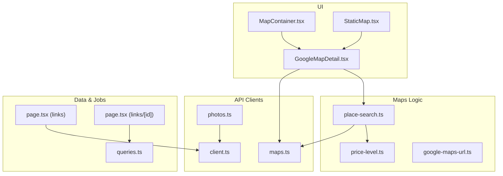
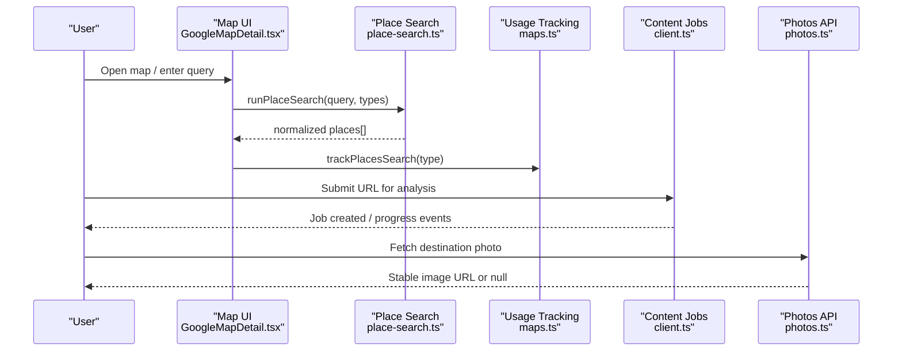
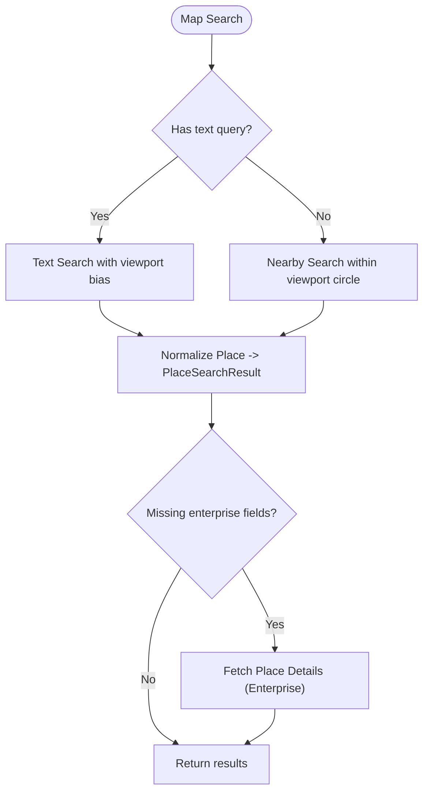
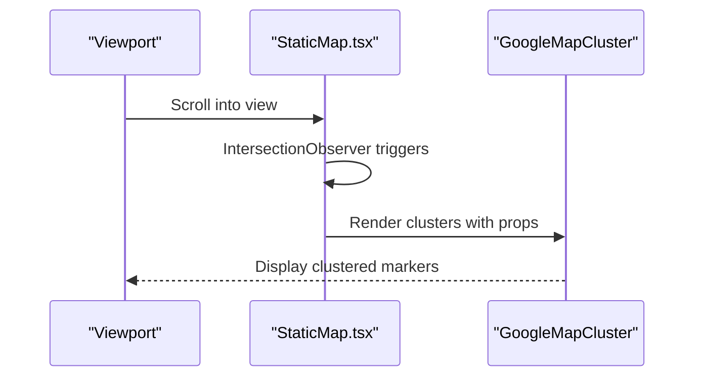
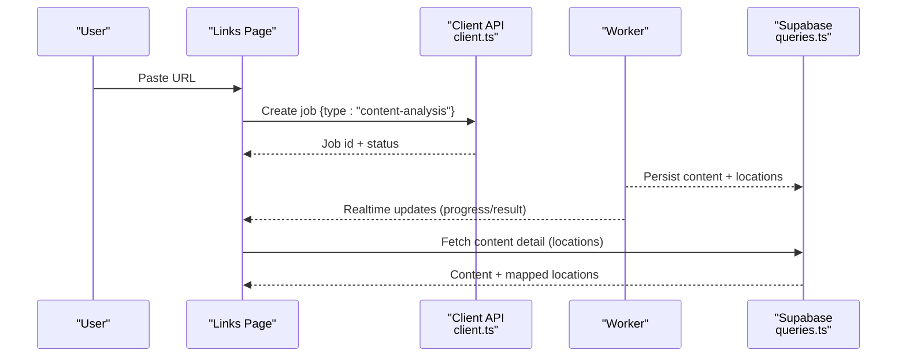
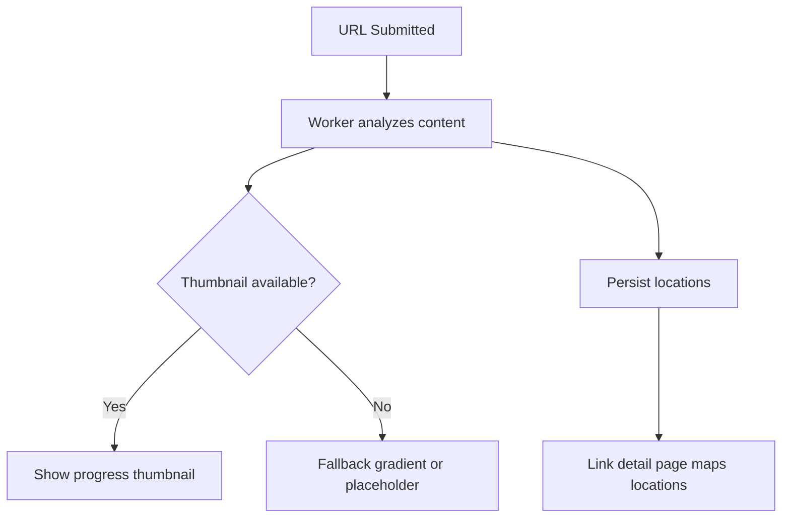
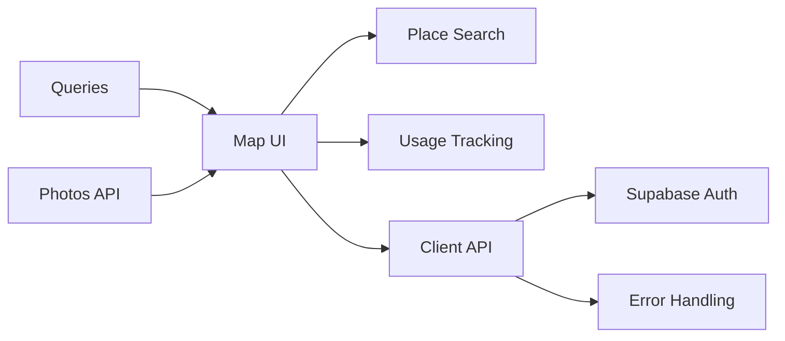

# External Services

<cite>
**Referenced Files in This Document**
- [GoogleMapDetail.tsx](file://src/components/ui/map/GoogleMapDetail.tsx)
- [MapContainer.tsx](file://src/components/ui/map/MapContainer.tsx)
- [StaticMap.tsx](file://src/components/ui/map/StaticMap.tsx)
- [place-search.ts](file://src/lib/maps/place-search.ts)
- [price-level.ts](file://src/lib/maps/price-level.ts)
- [google-maps-url.ts](file://src/lib/maps/google-maps-url.ts)
- [maps.ts](file://src/lib/api/maps.ts)
- [client.ts](file://src/lib/api/client.ts)
- [photos.ts](file://src/lib/api/photos.ts)
- [page.tsx (links)](file://src/app/links/page.tsx)
- [page.tsx (links/[id])](file://src/app/links/[id]/page.tsx)
- [queries.ts](file://src/lib/supabase/queries.ts)
- [userMessages.ts](file://src/lib/errors/userMessages.ts)
- [useQuotaGate.ts](file://src/hooks/useQuotaGate.ts)
</cite>

## Table of Contents
1. Introduction
2. Project Structure
3. Core Components
4. Architecture Overview
5. Detailed Component Analysis
6. Dependency Analysis
7. Performance Considerations
8. Troubleshooting Guide
9. Conclusion

## Introduction
This document explains how the application integrates external services, focusing on:
- Google Maps integration for map rendering, place search, and static map views
- Content analysis pipeline for processing URLs and extracting locations with thumbnails
- Third-party photo retrieval for destination imagery
It also covers configuration, error handling, rate limiting strategies, fallbacks, and performance optimizations for external API calls.

## Project Structure
External service integrations are primarily implemented in:
- Map UI components that render interactive maps and clusters
- Place search utilities that call Google Places APIs via the Maps JS library
- Analytics/tracking helpers that record usage against backend RPCs
- Content analysis job orchestration through a backend API
- Photo retrieval from a cached Unsplash pool via the backend API

**Diagram sources**
- [GoogleMapDetail.tsx:23-26](file://src/components/ui/map/GoogleMapDetail.tsx#L23-L26)
- [place-search.ts:1-10](file://src/lib/maps/place-search.ts#L1-L10)
- [maps.ts:11-33](file://src/lib/api/maps.ts#L11-L33)
- [client.ts:59-83](file://src/lib/api/client.ts#L59-L83)
- [photos.ts:1-39](file://src/lib/api/photos.ts#L1-L39)
- [queries.ts:50-99](file://src/lib/supabase/queries.ts#L50-L99)
- [page.tsx (links):66-123](file://src/app/links/page.tsx#L66-L123)
- [page.tsx (links/[id]):83-126](file://src/app/links/[id]/page.tsx#L83-L126)

**Section sources**
- [GoogleMapDetail.tsx:23-26](file://src/components/ui/map/GoogleMapDetail.tsx#L23-L26)
- [place-search.ts:1-10](file://src/lib/maps/place-search.ts#L1-L10)
- [maps.ts:11-33](file://src/lib/api/maps.ts#L11-L33)
- [client.ts:59-83](file://src/lib/api/client.ts#L59-L83)
- [photos.ts:1-39](file://src/lib/api/photos.ts#L1-L39)
- [queries.ts:50-99](file://src/lib/supabase/queries.ts#L50-L99)
- [page.tsx (links):66-123](file://src/app/links/page.tsx#L66-L123)
- [page.tsx (links/[id]):83-126](file://src/app/links/[id]/page.tsx#L83-L126)

## Core Components
- Google Maps rendering and interaction:
  - Map initialization and centering logic
  - Dynamic loading to avoid SSR issues
  - Fit-to-bounds and zoom estimation based on location spread
- Place search and enrichment:
  - Text and nearby searches using field masks to control billing SKUs
  - Normalization of results into a unified shape
  - Optional Place Details fetch for Pro-tier results
- Static map view:
  - Lazy rendering when scrolled into view
  - Cluster-based visualization with optional interactivity
- Content analysis jobs:
  - Submitting links for asynchronous processing
  - Progress tracking and retry flows
  - Result mapping to link detail pages
- Photo retrieval:
  - Destination photos from a cached Unsplash pool
  - Session-level memoization to reduce redundant requests

**Section sources**
- [GoogleMapDetail.tsx:27-53](file://src/components/ui/map/GoogleMapDetail.tsx#L27-L53)
- [place-search.ts:146-175](file://src/lib/maps/place-search.ts#L146-L175)
- [place-search.ts:177-265](file://src/lib/maps/place-search.ts#L177-L265)
- [StaticMap.tsx:39-97](file://src/components/ui/map/StaticMap.tsx#L39-L97)
- [page.tsx (links):66-123](file://src/app/links/page.tsx#L66-L123)
- [photos.ts:13-39](file://src/lib/api/photos.ts#L13-L39)

## Architecture Overview
The system combines client-side Google Maps SDK usage with a backend job queue for content analysis and a photo service.

**Diagram sources**
- [GoogleMapDetail.tsx:465-489](file://src/components/ui/map/GoogleMapDetail.tsx#L465-L489)
- [place-search.ts:393-468](file://src/lib/maps/place-search.ts#L393-L468)
- [maps.ts:41-56](file://src/lib/api/maps.ts#L41-L56)
- [client.ts:109-145](file://src/lib/api/client.ts#L109-L145)
- [photos.ts:20-39](file://src/lib/api/photos.ts#L20-L39)

## Detailed Component Analysis

### Google Maps Integration
- Configuration:
  - API key and map IDs are read from environment variables and passed to the Maps API provider wrapper.
- Rendering:
  - The map component dynamically loads to avoid SSR; it computes center and zoom from provided locations.
- Place search:
  - Uses Maps JS Place class with a field mask that includes both Essentials/Pro and Enterprise fields to minimize per-place calls.
  - Supports text search biased by viewport and nearby search restricted by a calculated circle derived from the current bounds.
  - Normalizes results to a consistent structure including address, photos, opening hours, price level, and links.
- Enrichment:
  - If a result lacks enterprise details, a targeted Place Details request is performed to enrich the data.
- Usage tracking:
  - Tracks map loads, place searches, place details, and photo renders to backend analytics via RPCs.

**Diagram sources**
- [place-search.ts:146-175](file://src/lib/maps/place-search.ts#L146-L175)
- [place-search.ts:393-468](file://src/lib/maps/place-search.ts#L393-L468)
- [place-search.ts:361-385](file://src/lib/maps/place-search.ts#L361-L385)

**Section sources**
- [GoogleMapDetail.tsx:23-53](file://src/components/ui/map/GoogleMapDetail.tsx#L23-L53)
- [GoogleMapDetail.tsx:465-489](file://src/components/ui/map/GoogleMapDetail.tsx#L465-L489)
- [place-search.ts:91-133](file://src/lib/maps/place-search.ts#L91-L133)
- [place-search.ts:177-265](file://src/lib/maps/place-search.ts#L177-L265)
- [place-search.ts:361-385](file://src/lib/maps/place-search.ts#L361-L385)
- [maps.ts:11-33](file://src/lib/api/maps.ts#L11-L33)
- [maps.ts:41-56](file://src/lib/api/maps.ts#L41-L56)
- [maps.ts:77-94](file://src/lib/api/maps.ts#L77-L94)

### Static Map Generation
- Purpose:
  - Provides a lightweight, lazily loaded map view for clusters and previews without full interactivity.
- Behavior:
  - Renders only when visible using an intersection observer.
  - Delegates to a cluster-aware map component with optional controls and hover states.

**Diagram sources**
- [StaticMap.tsx:39-97](file://src/components/ui/map/StaticMap.tsx#L39-L97)

**Section sources**
- [StaticMap.tsx:39-97](file://src/components/ui/map/StaticMap.tsx#L39-L97)

### Content Analysis Pipeline
- Submission:
  - Users submit URLs to create background jobs via the authenticated API client.
- Processing:
  - Jobs transition through queued, processing, completed, failed, or rejected states.
  - Progress may include a thumbnail generated during analysis.
- Completion:
  - Completed jobs produce normalized content metadata and extracted locations.
  - Link detail pages map stored locations into UI-friendly structures.

**Diagram sources**
- [client.ts:109-145](file://src/lib/api/client.ts#L109-L145)
- [page.tsx (links):66-123](file://src/app/links/page.tsx#L66-L123)
- [queries.ts:50-99](file://src/lib/supabase/queries.ts#L50-L99)
- [page.tsx (links/[id]):83-126](file://src/app/links/[id]/page.tsx#L83-L126)

**Section sources**
- [client.ts:109-145](file://src/lib/api/client.ts#L109-L145)
- [page.tsx (links):66-123](file://src/app/links/page.tsx#L66-L123)
- [page.tsx (links/[id]):83-126](file://src/app/links/[id]/page.tsx#L83-L126)
- [queries.ts:50-99](file://src/lib/supabase/queries.ts#L50-L99)

### Location Extraction and Thumbnails
- Extraction:
  - The worker extracts travel-related locations from URLs and stores them alongside content.
- Thumbnails:
  - During processing, a thumbnail may be generated and surfaced in job progress.
  - Destination photos can be fetched from a cached Unsplash pool keyed by region/country and seed for stability.

**Diagram sources**
- [page.tsx (links):66-123](file://src/app/links/page.tsx#L66-L123)
- [page.tsx (links/[id]):83-126](file://src/app/links/[id]/page.tsx#L83-L126)
- [photos.ts:13-39](file://src/lib/api/photos.ts#L13-L39)

**Section sources**
- [page.tsx (links):66-123](file://src/app/links/page.tsx#L66-L123)
- [page.tsx (links/[id]):83-126](file://src/app/links/[id]/page.tsx#L83-L126)
- [photos.ts:13-39](file://src/lib/api/photos.ts#L13-L39)

### Price Level Normalization
- Purpose:
  - Harmonizes Google’s string-based price levels across different transports into a stable ordinal used for budget filtering.
- Behavior:
  - Accepts either spelling variant and returns undefined for unspecified or unknown values.

**Section sources**
- [price-level.ts:1-36](file://src/lib/maps/price-level.ts#L1-L36)

### Google Maps URL Detection
- Purpose:
  - Detects whether a given string resolves to a recognized Google Maps host for downstream handling.

**Section sources**
- [google-maps-url.ts:1-12](file://src/lib/maps/google-maps-url.ts#L1-L12)

## Dependency Analysis
- UI depends on:
  - Maps JS library via dynamic imports
  - Place search utilities for queries and normalization
  - Usage tracking helpers to record API usage
- Client layer depends on:
  - Supabase auth to obtain tokens
  - Centralized error unwrapping and typed quota errors
- Data layer depends on:
  - Supabase queries to retrieve content and locations
- Photo service depends on:
  - Backend API with session-level caching to avoid repeated lookups

**Diagram sources**
- [GoogleMapDetail.tsx:465-489](file://src/components/ui/map/GoogleMapDetail.tsx#L465-L489)
- [place-search.ts:393-468](file://src/lib/maps/place-search.ts#L393-L468)
- [maps.ts:11-33](file://src/lib/api/maps.ts#L11-L33)
- [client.ts:59-83](file://src/lib/api/client.ts#L59-L83)
- [queries.ts:50-99](file://src/lib/supabase/queries.ts#L50-L99)
- [photos.ts:13-39](file://src/lib/api/photos.ts#L13-L39)

**Section sources**
- [GoogleMapDetail.tsx:465-489](file://src/components/ui/map/GoogleMapDetail.tsx#L465-L489)
- [place-search.ts:393-468](file://src/lib/maps/place-search.ts#L393-L468)
- [maps.ts:11-33](file://src/lib/api/maps.ts#L11-L33)
- [client.ts:59-83](file://src/lib/api/client.ts#L59-L83)
- [queries.ts:50-99](file://src/lib/supabase/queries.ts#L50-L99)
- [photos.ts:13-39](file://src/lib/api/photos.ts#L13-L39)

## Performance Considerations
- Billing optimization:
  - Use a single rich search with an expanded field mask to get up to ~20 places per billed request, reducing per-place calls.
  - Only perform Place Details when necessary to enrich Pro-tier results.
- Rendering efficiency:
  - Dynamically load map components to avoid SSR overhead.
  - Lazy-render static maps when they enter the viewport.
- Network efficiency:
  - Memoize destination photo requests per session to leverage backend caching.
  - Track usage metrics to monitor and optimize API consumption.
- UX responsiveness:
  - Provide optimistic updates for job completion to avoid UI flicker.
  - Use coarse ETA phrasing to avoid misleading precision.

[No sources needed since this section provides general guidance]

## Troubleshooting Guide
- Authentication failures:
  - Missing or invalid tokens surface as transport errors; ensure Supabase session is active before calling authenticated endpoints.
- Quota limits:
  - 402 responses with quota exceeded are converted to typed errors to prompt upgrades; callers should handle these gracefully.
- User-facing messages:
  - Technical error messages are filtered; user-friendly fallbacks are shown unless the message is whitelisted.
- Retry and recovery:
  - Failed jobs expose retry actions; use the retry endpoint to reprocess problematic items.

**Section sources**
- [client.ts:59-83](file://src/lib/api/client.ts#L59-L83)
- [client.ts:109-145](file://src/lib/api/client.ts#L109-L145)
- [userMessages.ts:94-106](file://src/lib/errors/userMessages.ts#L94-L106)
- [useQuotaGate.ts:16-40](file://src/hooks/useQuotaGate.ts#L16-L40)

## Conclusion
The application integrates Google Maps and content analysis services with careful attention to cost, performance, and resilience:
- Maps usage is optimized via field masks and selective enrichment
- Content analysis leverages async jobs with clear progress and retry paths
- Photos are retrieved efficiently with caching and stable keys
Robust error handling and user-friendly messaging ensure a smooth experience even when external services fail or quotas are reached.

[No sources needed since this section summarizes without analyzing specific files]