# AI Service Integration

<cite>
**Referenced Files in This Document**
- [useJobsQueue.ts](file://src/hooks/useJobsQueue.ts)
- [itineraries.ts](file://src/lib/api/itineraries.ts)
- [client.ts](file://src/lib/api/client.ts)
- [ItineraryQueueCardItem.tsx](file://src/components/ui/itinerary/ItineraryQueueCardItem.tsx)
- [useProgressAnimation.ts](file://src/hooks/useProgressAnimation.ts)
- [useProgressEta.ts](file://src/hooks/useProgressEta.ts)
- [userMessages.ts](file://src/lib/errors/userMessages.ts)
- [maps.ts](file://src/lib/api/maps.ts)
- [personalization-pipeline.md](file://docs/personalization-pipeline.md)
- [page.tsx (home)](file://src/app/home/page.tsx)
- [page.tsx (links)](file://src/app/links/page.tsx)
</cite>

## Table of Contents
1. [Introduction](#introduction)
2. [Project Structure](#project-structure)
3. [Core Components](#core-components)
4. [Architecture Overview](#architecture-overview)
5. [Detailed Component Analysis](#detailed-component-analysis)
6. [Dependency Analysis](#dependency-analysis)
7. [Performance Considerations](#performance-considerations)
8. [Troubleshooting Guide](#troubleshooting-guide)
9. [Conclusion](#conclusion)

## Introduction
This document explains how the application integrates AI services for content analysis and itinerary generation, focusing on:
- Background job queue architecture with real-time status updates and progress tracking
- Request/response transformation patterns between client and backend
- Error handling, retries, rate limiting, timeouts, and fallback strategies when AI services are unavailable
- Monitoring and debugging approaches for AI-powered features

The system uses a job queue to offload long-running AI tasks (content analysis and itinerary planning), surfaces progress via real-time database changes, and provides robust error handling and user-facing feedback.

## Project Structure
Key areas involved in AI integration:
- Job queue hook for real-time updates and transitions
- API clients for creating jobs, retrying, and generating itineraries
- UI components that render queue cards, progress bars, and ETA countdowns
- Design documentation describing the AI pipeline stages, caching, and fallbacks
- Error utilities and quota gating for user-friendly messaging

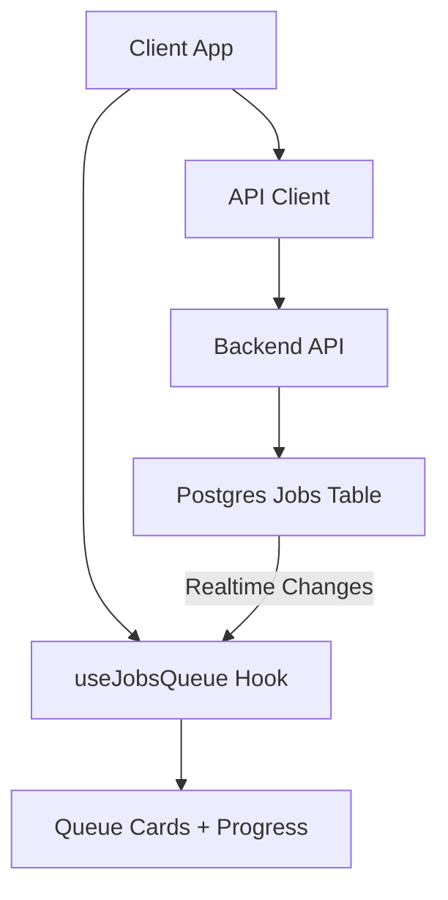

**Diagram sources**
- [useJobsQueue.ts:167-260](file://src/hooks/useJobsQueue.ts#L167-L260)
- [client.ts:109-155](file://src/lib/api/client.ts#L109-L155)
- [itineraries.ts:101-120](file://src/lib/api/itineraries.ts#L101-L120)

**Section sources**
- [useJobsQueue.ts:1-296](file://src/hooks/useJobsQueue.ts#L1-L296)
- [client.ts:1-156](file://src/lib/api/client.ts#L1-L156)
- [itineraries.ts:1-532](file://src/lib/api/itineraries.ts#L1-L532)

## Core Components
- Job queue hook: subscribes to Postgres changes, reconciles state, emits completion/failure/rejection callbacks, and supports optimistic merges for immediate UI updates.
- API client: centralizes authentication, request wrapping, typed quota errors, and job lifecycle endpoints (create, retry, detach).
- Itinerary APIs: create blank or AI-generated itineraries; returns either an immediate result or a job reference for async processing.
- Queue UI: renders per-job cards with animated progress, ETA countdowns, and retry controls for failed/stuck jobs.
- Error utilities: map backend messages to safe user-facing strings and handle auth/network errors gracefully.
- Pipeline design doc: describes AI passes, caching, degradation ladders, and fallback behavior.

**Section sources**
- [useJobsQueue.ts:45-103](file://src/hooks/useJobsQueue.ts#L45-L103)
- [client.ts:59-107](file://src/lib/api/client.ts#L59-L107)
- [itineraries.ts:59-120](file://src/lib/api/itineraries.ts#L59-L120)
- [ItineraryQueueCardItem.tsx:39-100](file://src/components/ui/itinerary/ItineraryQueueCardItem.tsx#L39-L100)
- [userMessages.ts:94-106](file://src/lib/errors/userMessages.ts#L94-L106)
- [personalization-pipeline.md:516-538](file://docs/personalization-pipeline.md#L516-L538)

## Architecture Overview
End-to-end flow for AI-driven features:

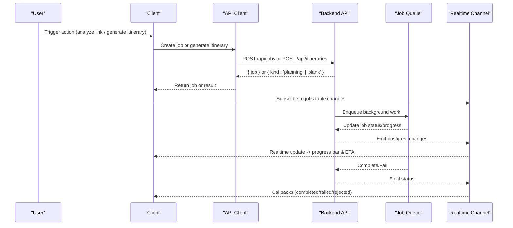

**Diagram sources**
- [client.ts:109-155](file://src/lib/api/client.ts#L109-L155)
- [itineraries.ts:101-120](file://src/lib/api/itineraries.ts#L101-L120)
- [useJobsQueue.ts:167-260](file://src/hooks/useJobsQueue.ts#L167-L260)

## Detailed Component Analysis

### Job Queue Architecture and Real-Time Updates
- The hook maintains local state of jobs, tracks last known statuses, and listens to Postgres realtime events for inserts, updates, and deletes scoped to the current user.
- It reconciles missed updates by re-fetching active jobs when visibility changes or channels reconnect.
- Terminal transitions trigger callbacks: completed, failed, or rejected (e.g., no travel locations found).
- Failed jobs within 24 hours remain visible to allow retry.

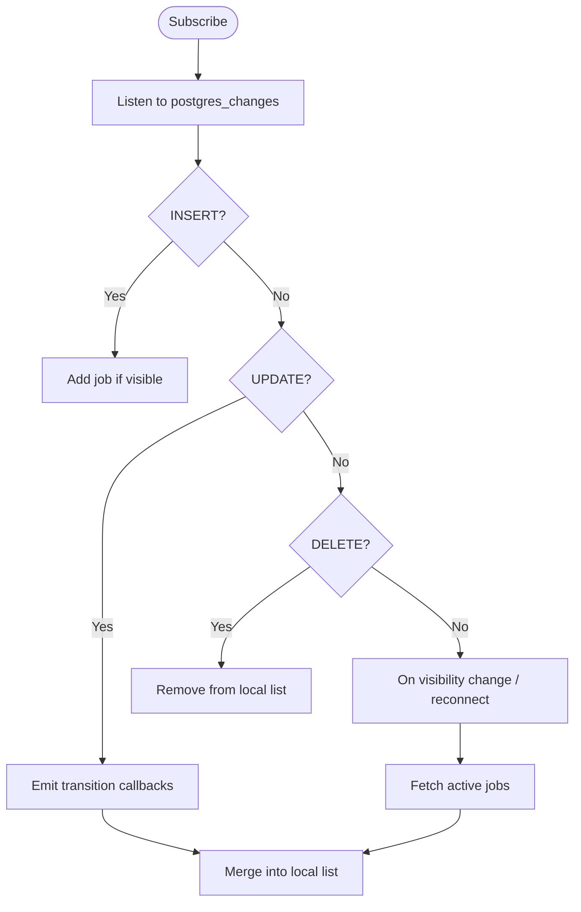

**Diagram sources**
- [useJobsQueue.ts:167-260](file://src/hooks/useJobsQueue.ts#L167-L260)
- [useJobsQueue.ts:109-136](file://src/hooks/useJobsQueue.ts#L109-L136)

**Section sources**
- [useJobsQueue.ts:45-103](file://src/hooks/useJobsQueue.ts#L45-L103)
- [useJobsQueue.ts:109-165](file://src/hooks/useJobsQueue.ts#L109-L165)
- [useJobsQueue.ts:167-260](file://src/hooks/useJobsQueue.ts#L167-L260)

### Content Analysis Workflow
- Users submit links for analysis; the client creates a job via the API client.
- The home page subscribes to content-analysis jobs and shows success/error/toast notifications upon completion or failure.
- If a link has already been analyzed, the backend may return a conflict indicating existing content.

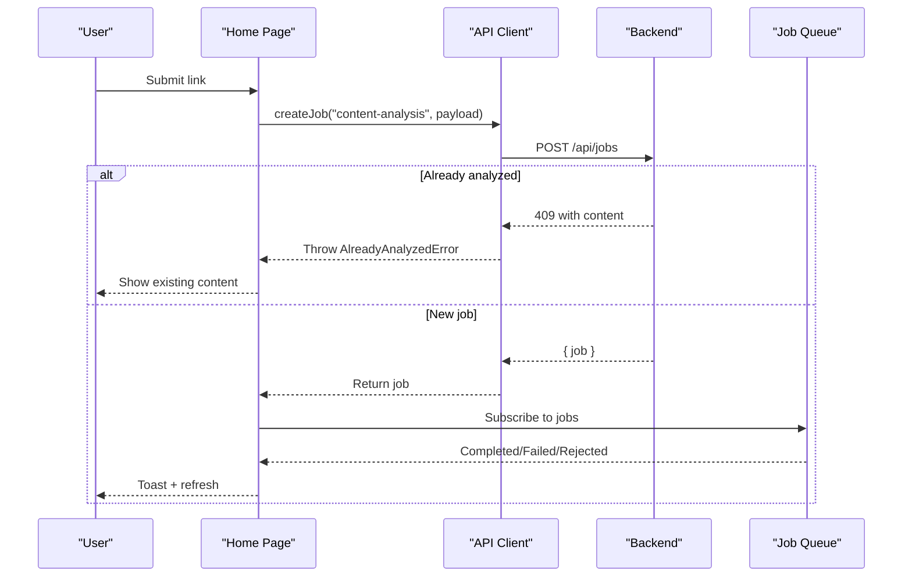

**Diagram sources**
- [client.ts:109-145](file://src/lib/api/client.ts#L109-L145)
- [page.tsx (home):192-217](file://src/app/home/page.tsx#L192-L217)

**Section sources**
- [client.ts:109-145](file://src/lib/api/client.ts#L109-L145)
- [page.tsx (home):192-217](file://src/app/home/page.tsx#L192-L217)

### Itinerary Generation Process
- Creation routes to either a blank itinerary or an async planning job based on user selections and AI toggle.
- When AI is enabled or locations are provided, the backend enqueues a planning job; the client receives a job reference and begins polling via the job queue hook.
- Upon completion, the UI builds an optimistic itinerary card from the job result to avoid layout shifts.

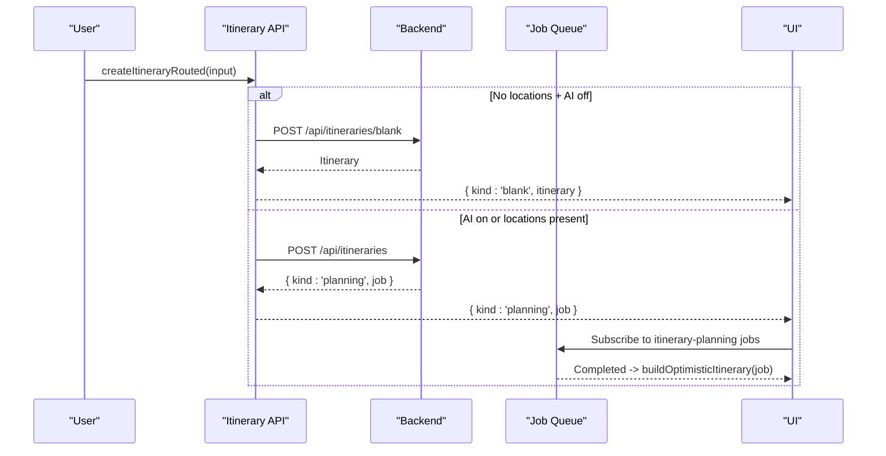

**Diagram sources**
- [itineraries.ts:406-439](file://src/lib/api/itineraries.ts#L406-L439)
- [itineraries.ts:101-120](file://src/lib/api/itineraries.ts#L101-L120)
- [page.tsx (home):219-240](file://src/app/home/page.tsx#L219-L240)

**Section sources**
- [itineraries.ts:406-439](file://src/lib/api/itineraries.ts#L406-L439)
- [page.tsx (home):219-240](file://src/app/home/page.tsx#L219-L240)

### Progress Tracking and ETA
- Progress animation maps worker-reported steps to visual percentages and crawls smoothly between updates.
- ETA countdown is computed locally using worker-provided timestamps and estimated seconds remaining, avoiding constant server writes.
- For itinerary planning, the worker can report authoritative percent and stage metadata; otherwise, step-based mapping is used.

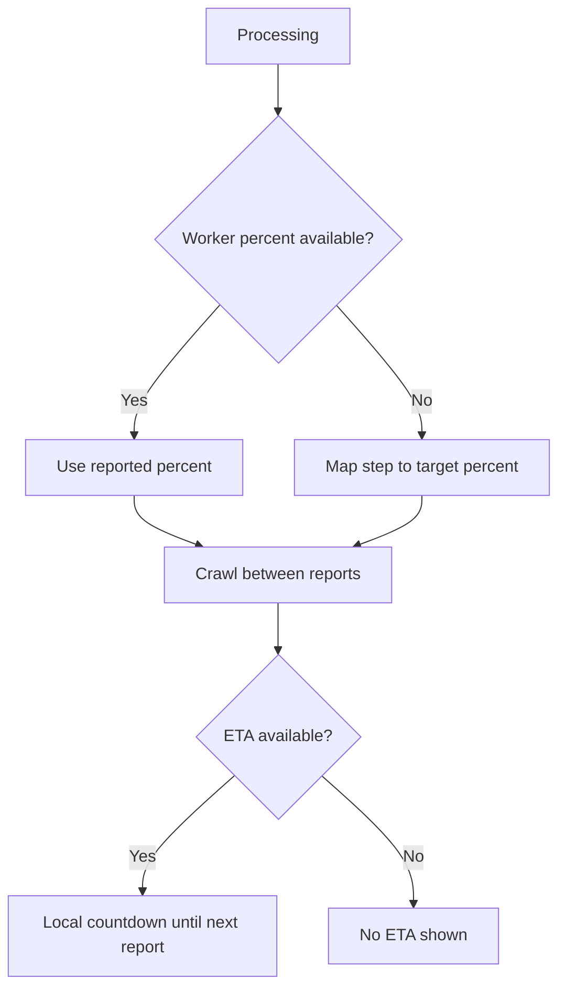

**Diagram sources**
- [useProgressAnimation.ts:6-31](file://src/hooks/useProgressAnimation.ts#L6-L31)
- [useProgressAnimation.ts:43-70](file://src/hooks/useProgressAnimation.ts#L43-L70)
- [useProgressEta.ts:22-59](file://src/hooks/useProgressEta.ts#L22-L59)

**Section sources**
- [useProgressAnimation.ts:6-31](file://src/hooks/useProgressAnimation.ts#L6-L31)
- [useProgressAnimation.ts:43-70](file://src/hooks/useProgressAnimation.ts#L43-L70)
- [useProgressEta.ts:22-59](file://src/hooks/useProgressEta.ts#L22-L59)

### Retry Mechanisms and Stuck Job Handling
- Failed jobs are kept visible for 24 hours to enable retry.
- Jobs stuck in flight beyond a threshold offer a retry option even without a formal failure.
- The retry endpoint restarts processing; the UI optimistically merges the updated job row to reflect new status immediately.

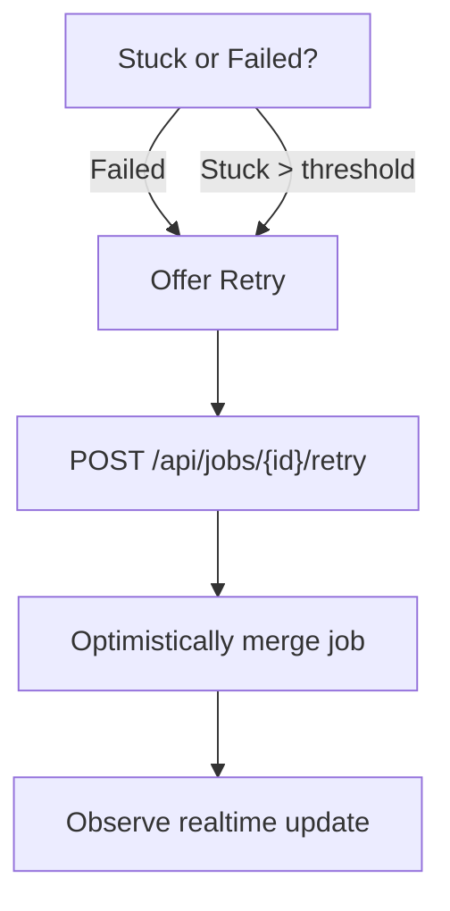

**Diagram sources**
- [ItineraryQueueCardItem.tsx:9-11](file://src/components/ui/itinerary/ItineraryQueueCardItem.tsx#L9-L11)
- [ItineraryQueueCardItem.tsx:64-83](file://src/components/ui/itinerary/ItineraryQueueCardItem.tsx#L64-L83)
- [client.ts:147-150](file://src/lib/api/client.ts#L147-L150)
- [useJobsQueue.ts:274-292](file://src/hooks/useJobsQueue.ts#L274-L292)

**Section sources**
- [ItineraryQueueCardItem.tsx:9-11](file://src/components/ui/itinerary/ItineraryQueueCardItem.tsx#L9-L11)
- [ItineraryQueueCardItem.tsx:64-83](file://src/components/ui/itinerary/ItineraryQueueCardItem.tsx#L64-L83)
- [client.ts:147-150](file://src/lib/api/client.ts#L147-L150)
- [useJobsQueue.ts:274-292](file://src/hooks/useJobsQueue.ts#L274-L292)

### Request/Response Transformation Patterns
- API client wraps fetch with authentication, sets JSON content type, and centralizes error unwrapping.
- Quota errors are mapped to typed exceptions (link quota, itinerary quota) so callers can show upgrade prompts.
- Itinerary creation routes differentiate between blank results and async planning jobs, returning discriminated unions for clear caller handling.

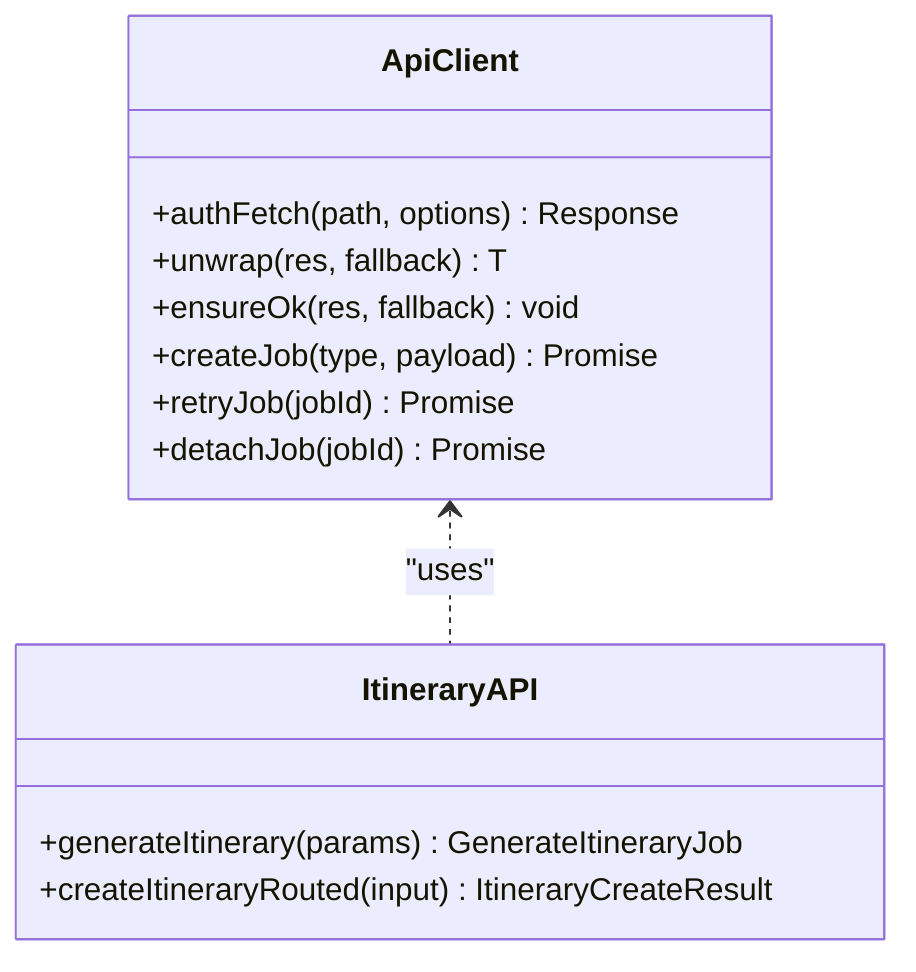

**Diagram sources**
- [client.ts:59-107](file://src/lib/api/client.ts#L59-L107)
- [client.ts:109-155](file://src/lib/api/client.ts#L109-L155)
- [itineraries.ts:101-120](file://src/lib/api/itineraries.ts#L101-L120)
- [itineraries.ts:406-439](file://src/lib/api/itineraries.ts#L406-L439)

**Section sources**
- [client.ts:59-107](file://src/lib/api/client.ts#L59-L107)
- [client.ts:109-155](file://src/lib/api/client.ts#L109-L155)
- [itineraries.ts:101-120](file://src/lib/api/itineraries.ts#L101-L120)
- [itineraries.ts:406-439](file://src/lib/api/itineraries.ts#L406-L439)

### Error Handling, Rate Limiting, Timeouts, and Fallbacks
- User-facing errors are sanitized through a whitelist; technical details never leak into the UI.
- Auth and network errors are handled centrally; transport failures are distinguished from HTTP errors.
- Rate limiting and quota exceeded responses are surfaced with friendly messages and upgrade CTAs.
- AI pipeline fallbacks:
  - Pass C narration failures degrade to cached enrichment descriptions plus match reasons.
  - Parallel calls use settlement semantics to ensure one failing narration call does not abort the entire itinerary.

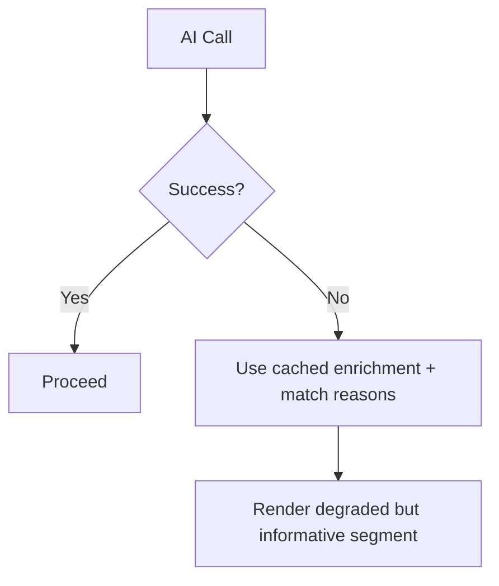

**Diagram sources**
- [personalization-pipeline.md:516-538](file://docs/personalization-pipeline.md#L516-L538)
- [userMessages.ts:94-106](file://src/lib/errors/userMessages.ts#L94-L106)
- [client.ts:78-83](file://src/lib/api/client.ts#L78-L83)

**Section sources**
- [personalization-pipeline.md:516-538](file://docs/personalization-pipeline.md#L516-L538)
- [userMessages.ts:94-106](file://src/lib/errors/userMessages.ts#L94-L106)
- [client.ts:78-83](file://src/lib/api/client.ts#L78-L83)

### Monitoring and Debugging Approaches
- API usage metrics are tracked for Google Places operations (search, details, photos, autocomplete) via RPC calls to aggregate user and global usage per month.
- Job queue hooks reconcile state on visibility changes and channel reconnects, helping debug missed realtime updates.
- UI surfaces connection errors and offers retry actions for stuck jobs, aiding troubleshooting.

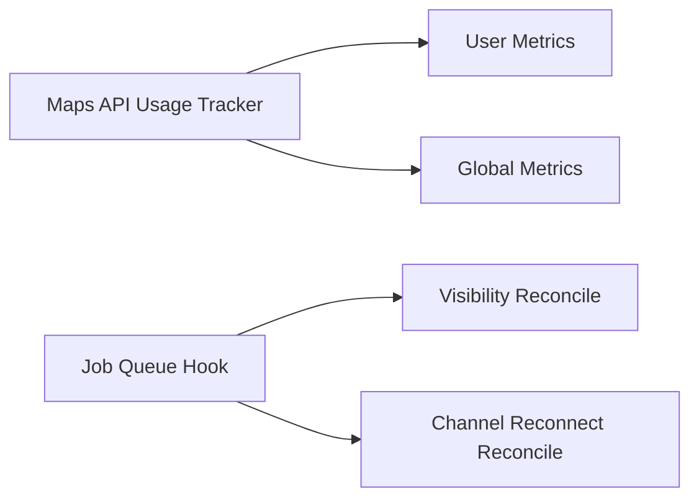

**Diagram sources**
- [maps.ts:47-56](file://src/lib/api/maps.ts#L47-L56)
- [maps.ts:63-75](file://src/lib/api/maps.ts#L63-L75)
- [maps.ts:82-94](file://src/lib/api/maps.ts#L82-L94)
- [useJobsQueue.ts:161-165](file://src/hooks/useJobsQueue.ts#L161-L165)
- [useJobsQueue.ts:250-260](file://src/hooks/useJobsQueue.ts#L250-L260)

**Section sources**
- [maps.ts:47-56](file://src/lib/api/maps.ts#L47-L56)
- [maps.ts:63-75](file://src/lib/api/maps.ts#L63-L75)
- [maps.ts:82-94](file://src/lib/api/maps.ts#L82-L94)
- [useJobsQueue.ts:161-165](file://src/hooks/useJobsQueue.ts#L161-L165)
- [useJobsQueue.ts:250-260](file://src/hooks/useJobsQueue.ts#L250-L260)

## Dependency Analysis
- The job queue hook depends on Supabase realtime and reconciles against the jobs table.
- API client depends on Supabase auth session retrieval and centralizes error handling.
- Itinerary APIs depend on the API client and define typed errors for quotas.
- UI components depend on the job queue hook and progress utilities to render interactive queue cards.

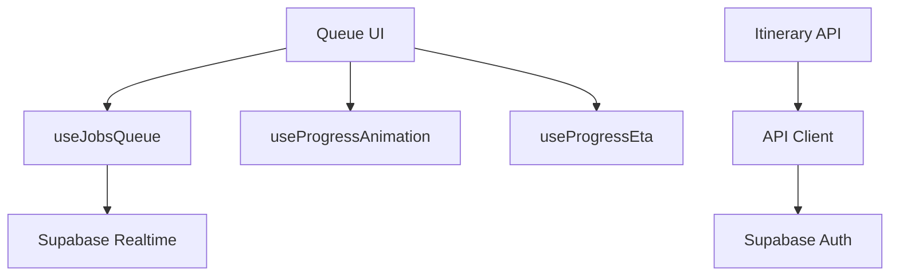

**Diagram sources**
- [useJobsQueue.ts:167-260](file://src/hooks/useJobsQueue.ts#L167-L260)
- [client.ts:48-83](file://src/lib/api/client.ts#L48-L83)
- [itineraries.ts:101-120](file://src/lib/api/itineraries.ts#L101-L120)
- [useProgressAnimation.ts:6-31](file://src/hooks/useProgressAnimation.ts#L6-L31)
- [useProgressEta.ts:22-59](file://src/hooks/useProgressEta.ts#L22-L59)

**Section sources**
- [useJobsQueue.ts:167-260](file://src/hooks/useJobsQueue.ts#L167-L260)
- [client.ts:48-83](file://src/lib/api/client.ts#L48-L83)
- [itineraries.ts:101-120](file://src/lib/api/itineraries.ts#L101-L120)
- [useProgressAnimation.ts:6-31](file://src/hooks/useProgressAnimation.ts#L6-L31)
- [useProgressEta.ts:22-59](file://src/hooks/useProgressEta.ts#L22-L59)

## Performance Considerations
- Realtime updates minimize polling overhead; reconciliation handles missed updates efficiently.
- Progress animations crawl smoothly between worker updates to avoid jarring jumps.
- ETA countdowns are computed locally to reduce server load while keeping estimates meaningful.
- AI pipeline caches enrichment data and defers photo resolution to reduce costs and latency.

[No sources needed since this section provides general guidance]

## Troubleshooting Guide
- Connection issues: The job queue hook sets a connection error flag when realtime channels error or time out; users see a degraded state and can rely on reconciliation to recover.
- Stuck jobs: Jobs stuck in flight beyond a threshold surface a retry option; retry calls update the UI optimistically.
- Quota limits: Typed quota errors guide users to upgrade or wait for resets; friendly messages prevent leaking technical details.
- AI failures: Narration failures fall back to cached enrichment and match reasons; parallel execution ensures partial failures do not abort entire runs.

**Section sources**
- [useJobsQueue.ts:250-260](file://src/hooks/useJobsQueue.ts#L250-L260)
- [ItineraryQueueCardItem.tsx:64-83](file://src/components/ui/itinerary/ItineraryQueueCardItem.tsx#L64-L83)
- [client.ts:130-145](file://src/lib/api/client.ts#L130-L145)
- [personalization-pipeline.md:516-538](file://docs/personalization-pipeline.md#L516-L538)

## Conclusion
The application implements a robust AI service integration pattern centered around a job queue with real-time updates, smooth progress visualization, and resilient error handling. Itinerary generation leverages staged AI passes with caching and fallbacks to maintain performance and reliability. Monitoring and debugging are supported through usage tracking and reconciliation mechanisms, ensuring a stable user experience even under external service constraints.