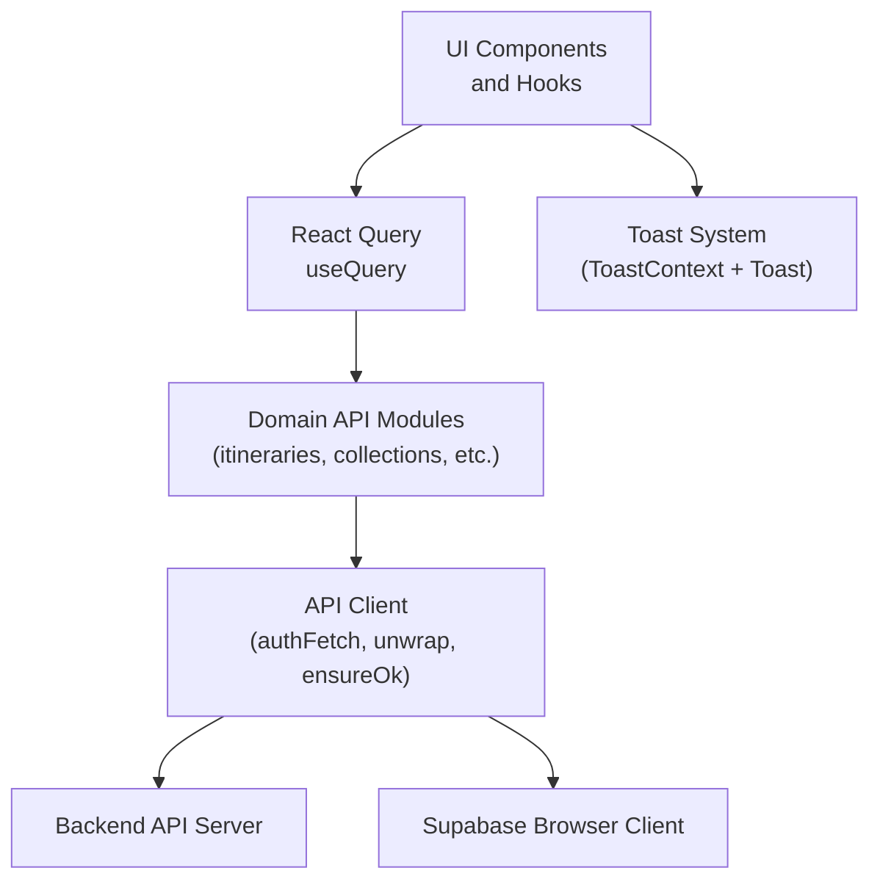
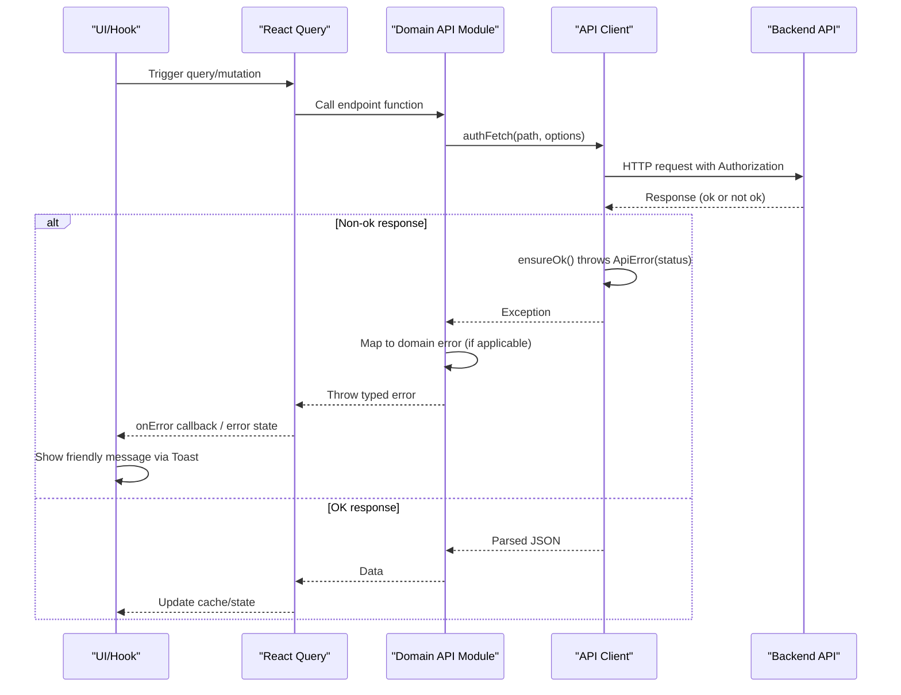
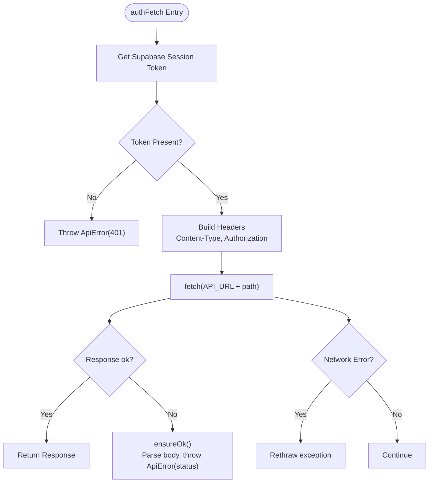
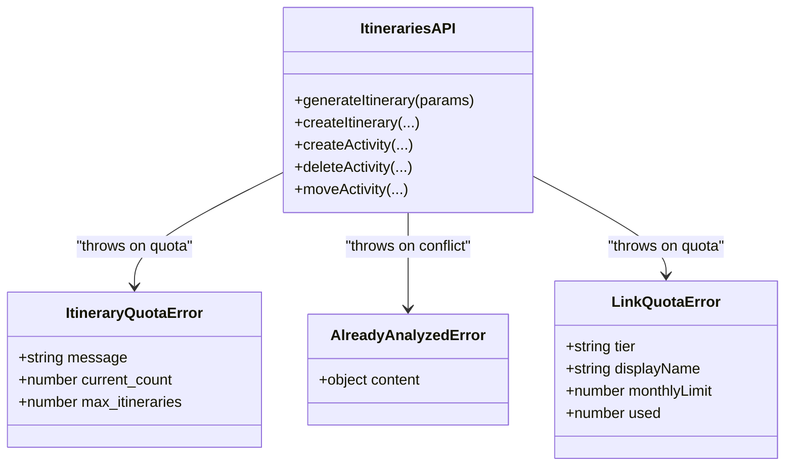
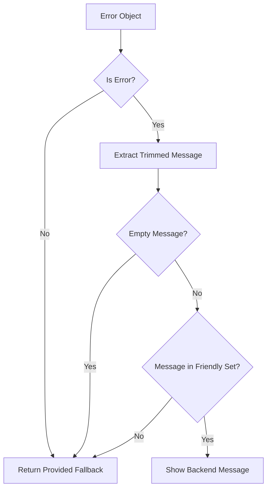
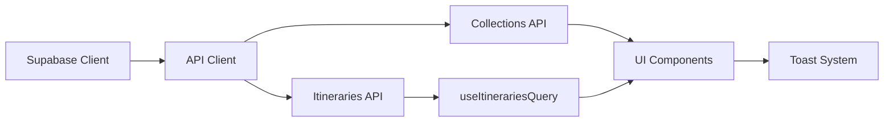

# Error Handling Patterns

<cite>
**Referenced Files in This Document**
- [client.ts](file://src/lib/api/client.ts)
- [userMessages.ts](file://src/lib/errors/userMessages.ts)
- [itineraries.ts](file://src/lib/api/itineraries.ts)
- [collections.ts](file://src/lib/api/collections.ts)
- [ToastContext.tsx](file://src/contexts/ToastContext.tsx)
- [Toast.tsx](file://src/components/ui/primitives/Toast.tsx)
- [useItinerariesQuery.ts](file://src/hooks/queries/useItinerariesQuery.ts)
- [supabase client.ts](file://src/lib/supabase/client.ts)
</cite>

## Table of Contents
1. Introduction
2. Project Structure
3. Core Components
4. Architecture Overview
5. Detailed Component Analysis
6. Dependency Analysis
7. Performance Considerations
8. Troubleshooting Guide
9. Conclusion

## Introduction
This document explains how the Argo platform handles errors across external integrations and API calls. It focuses on centralized error handling, user-friendly messaging, graceful degradation, retry strategies, circuit breaker patterns, fallbacks, network error handling, API response validation, service-specific error types, logging and debugging techniques, and user notification and recovery flows. The goal is to provide a clear, actionable guide for developers building or maintaining features that interact with backend services and third-party APIs.

## Project Structure
Error handling spans several layers:
- API client layer centralizes authentication, request construction, and response unwrapping into typed errors.
- Domain API modules encapsulate business endpoints and translate status codes into domain-specific errors.
- UI layer surfaces friendly messages via a toast system and integrates with React Query for data fetching and error propagation.
- Supabase client provides browser-based access to Supabase services.



**Diagram sources**
- [client.ts:59-107](file://src/lib/api/client.ts#L59-L107)
- [itineraries.ts:54-120](file://src/lib/api/itineraries.ts#L54-L120)
- [collections.ts:65-93](file://src/lib/api/collections.ts#L65-L93)
- [useItinerariesQuery.ts:10-16](file://src/hooks/queries/useItinerariesQuery.ts#L10-L16)
- [ToastContext.tsx:42-147](file://src/contexts/ToastContext.tsx#L42-L147)
- [Toast.tsx:47-173](file://src/components/ui/primitives/Toast.tsx#L47-L173)
- [supabase client.ts:3-8](file://src/lib/supabase/client.ts#L3-L8)

**Section sources**
- [client.ts:59-107](file://src/lib/api/client.ts#L59-L107)
- [itineraries.ts:54-120](file://src/lib/api/itineraries.ts#L54-L120)
- [collections.ts:65-93](file://src/lib/api/collections.ts#L65-L93)
- [useItinerariesQuery.ts:10-16](file://src/hooks/queries/useItinerariesQuery.ts#L10-L16)
- [ToastContext.tsx:42-147](file://src/contexts/ToastContext.tsx#L42-L147)
- [Toast.tsx:47-173](file://src/components/ui/primitives/Toast.tsx#L47-L173)
- [supabase client.ts:3-8](file://src/lib/supabase/client.ts#L3-L8)

## Core Components
- Centralized API client:
  - Adds Authorization headers using Supabase session tokens.
  - Normalizes non-OK responses into typed ApiError with numeric status.
  - Provides helpers to unwrap JSON or assert success for no-body responses.
- Domain API modules:
  - Map specific HTTP statuses and payloads to domain error classes (e.g., quota exceeded).
  - Provide consistent error messages and structured payloads for callers.
- User-facing error mapping:
  - Converts technical backend/auth errors into safe, friendly messages.
  - Whitelists backend messages that are already user-friendly.
- UI notifications:
  - Toast context manages lifecycle, pausing/resuming, and removal of notifications.
  - Toast component renders variants including error alerts with optional actions.

**Section sources**
- [client.ts:59-107](file://src/lib/api/client.ts#L59-L107)
- [itineraries.ts:89-120](file://src/lib/api/itineraries.ts#L89-L120)
- [collections.ts:65-93](file://src/lib/api/collections.ts#L65-L93)
- [userMessages.ts:7-47](file://src/lib/errors/userMessages.ts#L7-L47)
- [userMessages.ts:94-106](file://src/lib/errors/userMessages.ts#L94-L106)
- [ToastContext.tsx:42-147](file://src/contexts/ToastContext.tsx#L42-L147)
- [Toast.tsx:47-173](file://src/components/ui/primitives/Toast.tsx#L47-L173)

## Architecture Overview
The error handling architecture follows a layered approach:
- Network layer: authFetch attaches tokens and performs fetch; transport failures surface as exceptions without a Response.
- Response validation: ensureOk and unwrap enforce HTTP success and parse JSON consistently.
- Domain translation: API modules convert status codes and payloads into typed errors for precise handling at the caller level.
- User messaging: getFriendlyApiError and getFriendlyAuthError sanitize technical details before displaying to users.
- UI feedback: Toast system presents errors with optional actions and supports pause/resume behavior.



**Diagram sources**
- [client.ts:59-107](file://src/lib/api/client.ts#L59-L107)
- [itineraries.ts:54-120](file://src/lib/api/itineraries.ts#L54-L120)
- [collections.ts:65-93](file://src/lib/api/collections.ts#L65-L93)
- [useItinerariesQuery.ts:10-16](file://src/hooks/queries/useItinerariesQuery.ts#L10-L16)

## Detailed Component Analysis

### Centralized API Client
- Authentication: Retrieves Supabase session token and injects Authorization header. Missing token yields a 401 ApiError.
- Request normalization: Sets default Content-Type unless FormData is used.
- Transport failure handling: Catches fetch exceptions and rethrows them so callers can detect network issues.
- Response unwrapping: ensureOk asserts res.ok and constructs ApiError with status and body error when present; unwrap parses JSON after ensuring success.



**Diagram sources**
- [client.ts:48-83](file://src/lib/api/client.ts#L48-L83)
- [client.ts:91-107](file://src/lib/api/client.ts#L91-L107)

**Section sources**
- [client.ts:48-83](file://src/lib/api/client.ts#L48-L83)
- [client.ts:91-107](file://src/lib/api/client.ts#L91-L107)

### Domain API Modules: Itineraries
- Quota enforcement: generateItinerary and createItinerary map 403 with ITINERARY_QUOTA_EXCEEDED to ItineraryQuotaError, preserving counts for upgrade prompts.
- Activity operations: createActivity, deleteActivity, moveActivity use ensureOk for no-body responses and return structured results when available.
- Job creation: createJob maps 409 already_analyzed to AlreadyAnalyzedError and 402 quota_exceeded to LinkQuotaError, enabling targeted UI flows.
- Public endpoints: getPublicItinerary uses unwrap with a user-friendly fallback.



**Diagram sources**
- [itineraries.ts:89-120](file://src/lib/api/itineraries.ts#L89-L120)
- [client.ts:14-46](file://src/lib/api/client.ts#L14-L46)

**Section sources**
- [itineraries.ts:54-120](file://src/lib/api/itineraries.ts#L54-L120)
- [itineraries.ts:230-291](file://src/lib/api/itineraries.ts#L230-L291)
- [itineraries.ts:339-367](file://src/lib/api/itineraries.ts#L339-L367)
- [client.ts:109-145](file://src/lib/api/client.ts#L109-L145)

### Domain API Modules: Collections
- Consistent error handling: All endpoints use unwrap or ensureOk to normalize errors and parse responses.
- Token management: Public and invite token generation/revoke endpoints follow the same pattern.
- Collaborators: CRUD operations propagate errors uniformly.

**Section sources**
- [collections.ts:65-93](file://src/lib/api/collections.ts#L65-L93)
- [collections.ts:134-162](file://src/lib/api/collections.ts#L134-L162)
- [collections.ts:195-213](file://src/lib/api/collections.ts#L195-L213)

### User-Friendly Error Messages
- Auth errors: Maps Supabase auth codes and common messages to plain-language strings.
- API errors: getFriendlyApiError whitelists backend messages considered safe to show; otherwise returns a provided fallback to prevent leaking technical details.



**Diagram sources**
- [userMessages.ts:7-47](file://src/lib/errors/userMessages.ts#L7-L47)
- [userMessages.ts:94-106](file://src/lib/errors/userMessages.ts#L94-L106)

**Section sources**
- [userMessages.ts:7-47](file://src/lib/errors/userMessages.ts#L7-L47)
- [userMessages.ts:94-106](file://src/lib/errors/userMessages.ts#L94-L106)

### UI Notifications and Recovery
- Toast context: Manages toasts with unique IDs, durations, pause/resume on hover, and removal.
- Toast component: Renders variant-aware cards, supports thumbnails, descriptions, and actions; uses aria roles for accessibility.
- Integration pattern: Catch errors in hooks or components, then call showToast with variant "error" and optional action for recovery.

```mermaid
sequenceDiagram
participant Hook as "Hook/Component"
participant ToastCtx as "ToastContext"
participant ToastUI as "Toast Component"
Hook->>ToastCtx : showToast({ title, description, variant : "error", action })
ToastCtx->>ToastCtx : Create ID, set duration, start timer
ToastCtx-->>ToastUI : toasts array update
ToastUI->>ToastUI : Render card with variant and action
Note over ToastUI : Hover pauses timer; mouse leave resumes
ToastUI->>ToastCtx : removeToast(id) on action click
```

**Diagram sources**
- [ToastContext.tsx:42-147](file://src/contexts/ToastContext.tsx#L42-L147)
- [Toast.tsx:47-173](file://src/components/ui/primitives/Toast.tsx#L47-L173)

**Section sources**
- [ToastContext.tsx:42-147](file://src/contexts/ToastContext.tsx#L42-L147)
- [Toast.tsx:47-173](file://src/components/ui/primitives/Toast.tsx#L47-L173)

### React Query Integration
- Queries wrap domain functions and rely on their error contracts. StaleTime reduces redundant requests.
- Error handling strategy: Use React Query’s onError to map errors to friendly messages and display via Toast.

**Section sources**
- [useItinerariesQuery.ts:10-16](file://src/hooks/queries/useItinerariesQuery.ts#L10-L16)

## Dependency Analysis
- API client depends on Supabase client for session retrieval.
- Domain modules depend on API client for authenticated requests and standardized error handling.
- UI depends on domain modules and Toast system for user feedback.
- React Query depends on domain modules for data fetching and caching.



**Diagram sources**
- [supabase client.ts:3-8](file://src/lib/supabase/client.ts#L3-L8)
- [client.ts:59-107](file://src/lib/api/client.ts#L59-L107)
- [itineraries.ts:54-120](file://src/lib/api/itineraries.ts#L54-L120)
- [collections.ts:65-93](file://src/lib/api/collections.ts#L65-L93)
- [useItinerariesQuery.ts:10-16](file://src/hooks/queries/useItinerariesQuery.ts#L10-L16)
- [ToastContext.tsx:42-147](file://src/contexts/ToastContext.tsx#L42-L147)

**Section sources**
- [supabase client.ts:3-8](file://src/lib/supabase/client.ts#L3-L8)
- [client.ts:59-107](file://src/lib/api/client.ts#L59-L107)
- [itineraries.ts:54-120](file://src/lib/api/itineraries.ts#L54-L120)
- [collections.ts:65-93](file://src/lib/api/collections.ts#L65-L93)
- [useItinerariesQuery.ts:10-16](file://src/hooks/queries/useItinerariesQuery.ts#L10-L16)
- [ToastContext.tsx:42-147](file://src/contexts/ToastContext.tsx#L42-L147)

## Performance Considerations
- Avoid redundant requests by leveraging React Query staleTime and cache invalidation on mutations.
- Prefer ensureOk for no-body endpoints to minimize parsing overhead.
- Use domain-specific errors to short-circuit unnecessary retries for non-recoverable cases (e.g., quota exceeded).
- Minimize toast spam by grouping related errors or debouncing repeated notifications.

[No sources needed since this section provides general guidance]

## Troubleshooting Guide
- Network errors:
  - Detect transport failures by catching exceptions from authFetch; these do not produce a Response and should be handled separately from HTTP errors.
  - Surface a friendly message using getFriendlyApiError with a network-appropriate fallback.
- Authentication failures:
  - A missing or expired token triggers a 401 ApiError; redirect to login or refresh session as appropriate.
- Quota limits:
  - For itinerary and link quotas, catch domain error classes to prompt upgrades or inform users of limits.
- Validation errors:
  - Activity creation may return array-based errors; join messages for clearer user feedback.
- Logging and debugging:
  - Log full error objects and stack traces to console.error or an error tracking service; avoid logging sensitive data.
  - Include request paths and status codes in logs for faster triage.
- Recovery options:
  - Provide retry actions for transient failures; disable retry for permanent errors like quota exceeded.
  - Offer contextual actions in toasts (e.g., “Retry”, “Upgrade Plan”).

**Section sources**
- [client.ts:59-83](file://src/lib/api/client.ts#L59-L83)
- [client.ts:91-107](file://src/lib/api/client.ts#L91-L107)
- [itineraries.ts:230-246](file://src/lib/api/itineraries.ts#L230-L246)
- [userMessages.ts:7-47](file://src/lib/errors/userMessages.ts#L7-L47)
- [userMessages.ts:94-106](file://src/lib/errors/userMessages.ts#L94-L106)

## Conclusion
The Argo platform implements a robust, layered error handling strategy:
- Centralized API client ensures consistent authentication and response validation.
- Domain modules translate HTTP-level issues into meaningful, typed errors for precise handling.
- User-facing error mapping prevents technical leakage and improves UX.
- Toast-based notifications provide immediate, actionable feedback with pause/resume support.
- React Query integration enables efficient caching and error propagation.

For production resilience, consider adding:
- Retry mechanisms with exponential backoff for idempotent GET requests.
- Circuit breaker patterns around failing services to degrade gracefully.
- Fallback implementations (e.g., cached data or limited functionality) when upstream services are unavailable.
- Structured logging and error tracking pipelines for observability.

[No sources needed since this section summarizes without analyzing specific files]