# Google Maps Integration

<cite>
**Referenced Files in This Document**
- [GoogleMapDetail.tsx](file://src/components/ui/map/GoogleMapDetail.tsx)
- [MapContainer.tsx](file://src/components/ui/map/MapContainer.tsx)
- [StaticMap.tsx](file://src/components/ui/map/StaticMap.tsx)
- [GoogleMapCluster.tsx](file://src/components/ui/map/GoogleMapCluster.tsx)
- [MapClusterMarker.tsx](file://src/components/ui/map/MapClusterMarker.tsx)
- [MapMarkerHover.tsx](file://src/components/ui/map/MapMarkerHover.tsx)
- [MapNameBubble.tsx](file://src/components/ui/map/MapNameBubble.tsx)
- [place-search.ts](file://src/lib/maps/place-search.ts)
- [locality-pins.ts](file://src/lib/maps/locality-pins.ts)
- [useMapClusters.ts](file://src/hooks/useMapClusters.ts)
- [maps.ts](file://src/lib/api/maps.ts)
- [google-maps-url.ts](file://src/lib/maps/google-maps-url.ts)
</cite>

## Table of Contents
1. Introduction
2. Project Structure
3. Core Components
4. Architecture Overview
5. Detailed Component Analysis
6. Dependency Analysis
7. Performance Considerations
8. Troubleshooting Guide
9. Conclusion

## Introduction
This document explains how the application integrates Google Maps using a modern, componentized approach. It covers map initialization, location services (search and details), clustering for performance, route visualization with polylines, locality pin management, marker customization, interactive features, event handling, geocoding-like search behavior, rate-limiting strategies via SKU-aware calls, caching patterns, fallback behaviors, and mobile responsiveness considerations.

## Project Structure
The integration is implemented as a set of reusable React components under src/components/ui/map, utilities under src/lib/maps, and hooks under src/hooks. The main entry points are:
- MapContainer: lazy-loads the interactive map and tracks load events
- GoogleMapDetail: renders locations, routes, hover cards, and place search
- StaticMap + GoogleMapCluster: renders clustered pins for overview maps
- place-search: orchestrates Places API calls and normalizes results
- locality-pins: groups entities into locality-based clusters for static maps
- useMapClusters: fetches cluster data and builds locality pins
- maps analytics: tracks map loads, searches, details, photos, and autocomplete usage

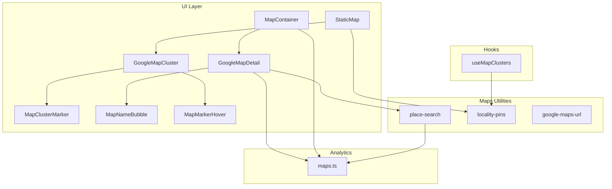

**Diagram sources**
- [MapContainer.tsx:40-88](file://src/components/ui/map/MapContainer.tsx#L40-L88)
- [GoogleMapDetail.tsx:341-461](file://src/components/ui/map/GoogleMapDetail.tsx#L341-L461)
- [StaticMap.tsx:34-93](file://src/components/ui/map/StaticMap.tsx#L34-L93)
- [GoogleMapCluster.tsx:99-134](file://src/components/ui/map/GoogleMapCluster.tsx#L99-L134)
- [place-search.ts:391-466](file://src/lib/maps/place-search.ts#L391-L466)
- [locality-pins.ts:28-77](file://src/lib/maps/locality-pins.ts#L28-L77)
- [useMapClusters.ts:35-60](file://src/hooks/useMapClusters.ts#L35-L60)
- [maps.ts:11-118](file://src/lib/api/maps.ts#L11-L118)

**Section sources**
- [MapContainer.tsx:1-99](file://src/components/ui/map/MapContainer.tsx#L1-L99)
- [GoogleMapDetail.tsx:1-490](file://src/components/ui/map/GoogleMapDetail.tsx#L1-L490)
- [StaticMap.tsx:1-103](file://src/components/ui/map/StaticMap.tsx#L1-L103)
- [GoogleMapCluster.tsx:1-181](file://src/components/ui/map/GoogleMapCluster.tsx#L1-L181)
- [place-search.ts:1-467](file://src/lib/maps/place-search.ts#L1-L467)
- [locality-pins.ts:1-78](file://src/lib/maps/locality-pins.ts#L1-L78)
- [useMapClusters.ts:1-61](file://src/hooks/useMapClusters.ts#L1-L61)
- [maps.ts:1-119](file://src/lib/api/maps.ts#L1-L119)

## Core Components
- MapContainer: Lazy-loads GoogleMapDetail when visible; tracks map load; passes locations, polylines, and search callbacks.
- GoogleMapDetail: Renders the interactive map with markers, route polylines, hover detail cards, and integrated place search.
- StaticMap + GoogleMapCluster: Renders clustered pins for overview views; computes bounds and zoom automatically; supports hover states and optional zoom controls.
- place-search: Encapsulates Places API calls (Text Search and Nearby Search), normalizes results, and exposes an Enterprise Place Details fetcher.
- locality-pins: Groups saved entities by region/country to produce locality pins for static maps.
- useMapClusters: Fetches raw locations and builds locality pins with React Query caching.
- maps analytics: Tracks map loads, place searches, details, photos, and autocomplete usage.

**Section sources**
- [MapContainer.tsx:10-99](file://src/components/ui/map/MapContainer.tsx#L10-L99)
- [GoogleMapDetail.tsx:27-103](file://src/components/ui/map/GoogleMapDetail.tsx#L27-L103)
- [StaticMap.tsx:9-32](file://src/components/ui/map/StaticMap.tsx#L9-L32)
- [GoogleMapCluster.tsx:13-67](file://src/components/ui/map/GoogleMapCluster.tsx#L13-L67)
- [place-search.ts:145-174](file://src/lib/maps/place-search.ts#L145-L174)
- [locality-pins.ts:14-77](file://src/lib/maps/locality-pins.ts#L14-L77)
- [useMapClusters.ts:16-60](file://src/hooks/useMapClusters.ts#L16-L60)
- [maps.ts:11-118](file://src/lib/api/maps.ts#L11-L118)

## Architecture Overview
The architecture separates concerns across UI, utility, and analytics layers:
- UI layer composes maps and markers, handles user interactions, and delegates search and details to utilities.
- Utility layer encapsulates Places API calls, result normalization, and locality grouping.
- Analytics layer records usage metrics for billing and monitoring.

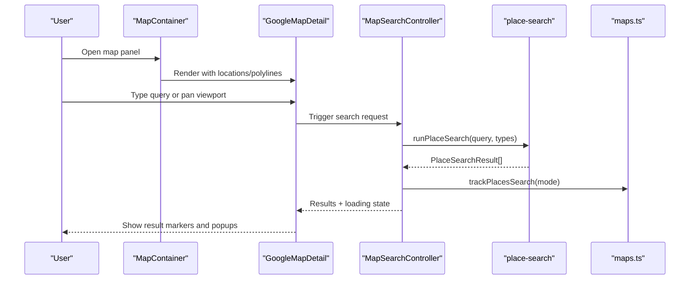

**Diagram sources**
- [MapContainer.tsx:40-88](file://src/components/ui/map/MapContainer.tsx#L40-L88)
- [GoogleMapDetail.tsx:116-151](file://src/components/ui/map/GoogleMapDetail.tsx#L116-L151)
- [place-search.ts:391-466](file://src/lib/maps/place-search.ts#L391-L466)
- [maps.ts:41-56](file://src/lib/api/maps.ts#L41-L56)

## Detailed Component Analysis

### Map Initialization and Bounds Management
- MapContainer lazily renders GoogleMapDetail only when in view, reducing initial bundle cost.
- GoogleMapDetail initializes the map with theme-aware map IDs, default center/zoom, and gesture control toggles.
- MapBoundsController computes bounds from locations and fits the map on first render or when data changes; supports animated transitions and single-location zoom.

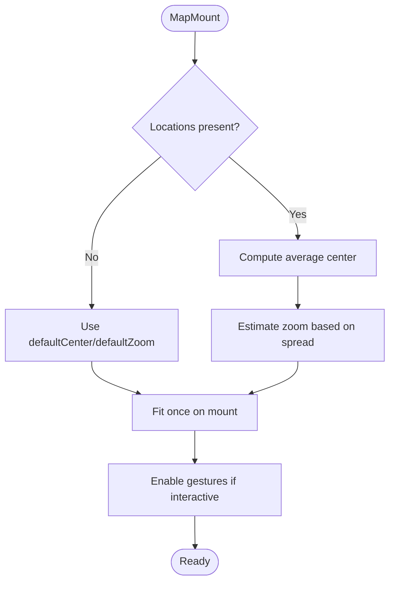

**Diagram sources**
- [GoogleMapDetail.tsx:27-54](file://src/components/ui/map/GoogleMapDetail.tsx#L27-L54)
- [GoogleMapDetail.tsx:65-103](file://src/components/ui/map/GoogleMapDetail.tsx#L65-L103)
- [MapContainer.tsx:40-88](file://src/components/ui/map/MapContainer.tsx#L40-L88)

**Section sources**
- [GoogleMapDetail.tsx:27-103](file://src/components/ui/map/GoogleMapDetail.tsx#L27-L103)
- [MapContainer.tsx:40-88](file://src/components/ui/map/MapContainer.tsx#L40-L88)

### Location Services: Search and Details
- MapSearchController runs a viewport-biased search whenever the request nonce changes.
- place-search chooses between Text Search and Nearby Search based on query presence and caps radius to avoid excessive requests.
- Results are normalized to a consistent shape and optionally enriched via Enterprise Place Details on demand.
- Usage is tracked per SKU type to monitor costs.

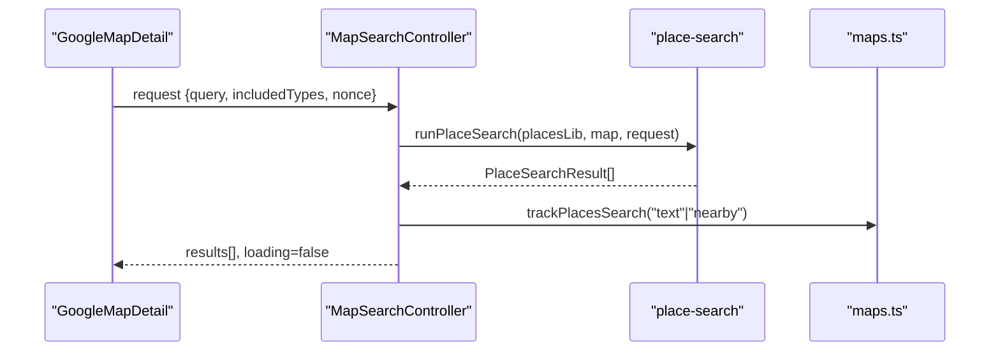

**Diagram sources**
- [GoogleMapDetail.tsx:116-151](file://src/components/ui/map/GoogleMapDetail.tsx#L116-L151)
- [place-search.ts:391-466](file://src/lib/maps/place-search.ts#L391-L466)
- [maps.ts:41-56](file://src/lib/api/maps.ts#L41-L56)

**Section sources**
- [GoogleMapDetail.tsx:105-151](file://src/components/ui/map/GoogleMapDetail.tsx#L105-L151)
- [place-search.ts:145-174](file://src/lib/maps/place-search.ts#L145-L174)
- [place-search.ts:391-466](file://src/lib/maps/place-search.ts#L391-L466)
- [maps.ts:41-56](file://src/lib/api/maps.ts#L41-L56)

### Clustering Algorithms for Performance Optimization
- StaticMap uses GoogleMapCluster to render clusters of locations.
- calculateMapView computes a sensible center and zoom based on cluster spread.
- MapBoundsController fits bounds when needed and supports single-cluster zoom.
- Locality pins group entities by region/country to reduce visual clutter and improve performance.

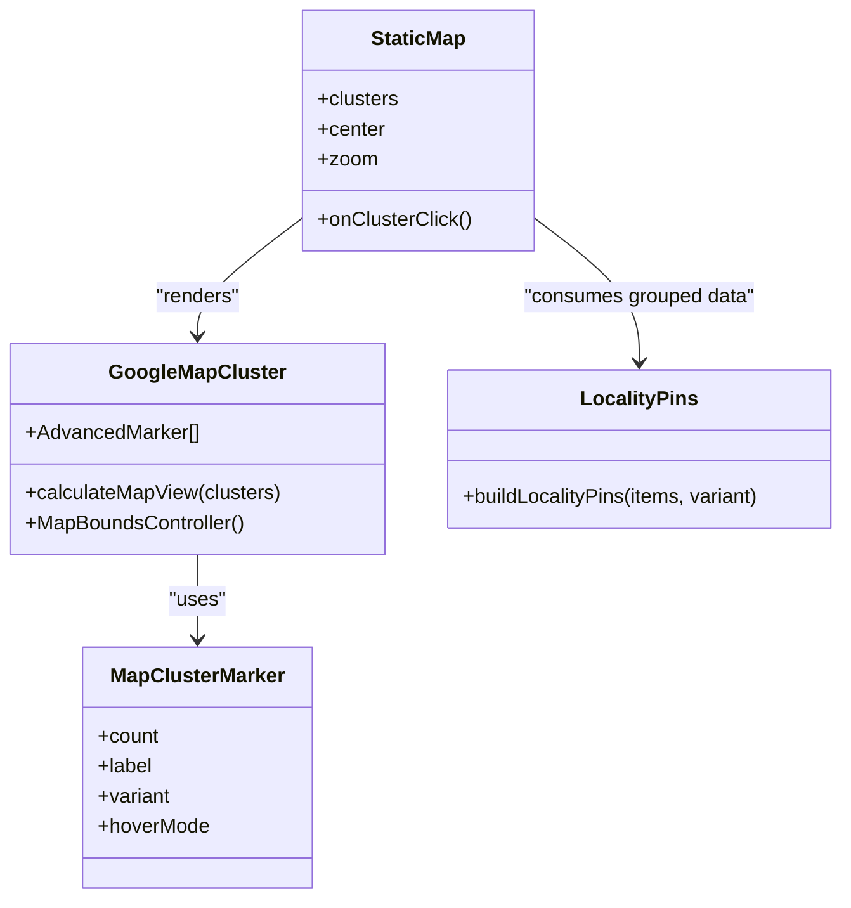

**Diagram sources**
- [StaticMap.tsx:34-93](file://src/components/ui/map/StaticMap.tsx#L34-L93)
- [GoogleMapCluster.tsx:13-67](file://src/components/ui/map/GoogleMapCluster.tsx#L13-L67)
- [MapClusterMarker.tsx:51-115](file://src/components/ui/map/MapClusterMarker.tsx#L51-L115)
- [locality-pins.ts:28-77](file://src/lib/maps/locality-pins.ts#L28-L77)

**Section sources**
- [GoogleMapCluster.tsx:13-67](file://src/components/ui/map/GoogleMapCluster.tsx#L13-L67)
- [StaticMap.tsx:9-32](file://src/components/ui/map/StaticMap.tsx#L9-L32)
- [locality-pins.ts:14-77](file://src/lib/maps/locality-pins.ts#L14-L77)
- [useMapClusters.ts:35-60](file://src/hooks/useMapClusters.ts#L35-L60)

### Route Visualization Capabilities
- Polylines are rendered as encoded paths with layered strokes: a white casing beneath a vibrant color line for readability.
- Colors derive from day palettes and adapt to light/dark themes.
- Polyline segments carry dayIndex for color mapping and unique ids for rendering.

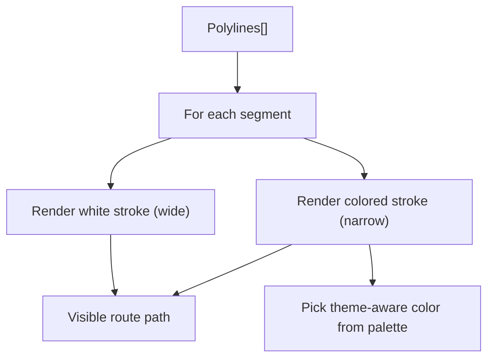

**Diagram sources**
- [GoogleMapDetail.tsx:359-372](file://src/components/ui/map/GoogleMapDetail.tsx#L359-L372)

**Section sources**
- [GoogleMapDetail.tsx:359-372](file://src/components/ui/map/GoogleMapDetail.tsx#L359-L372)

### Locality Pin Management
- Locality pins group entities by “region, country” or “country” and compute mean coordinates for pin placement.
- Each cluster carries count, label, and entityIdsByLocality for filtering and drill-down.
- useMapClusters fetches raw locations and builds locality pins with caching via React Query.

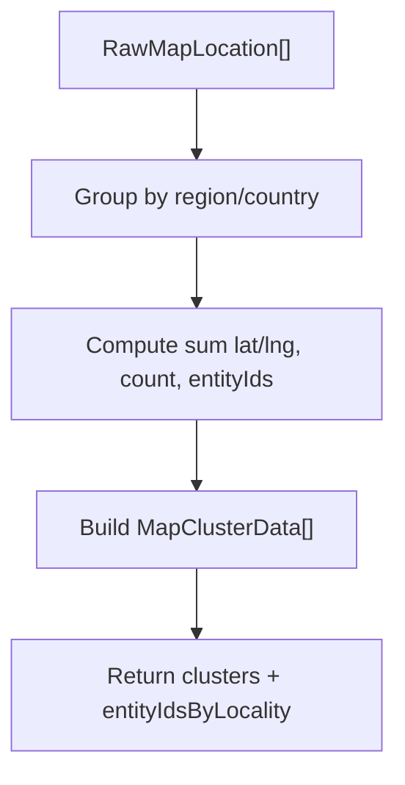

**Diagram sources**
- [locality-pins.ts:28-77](file://src/lib/maps/locality-pins.ts#L28-L77)
- [useMapClusters.ts:35-60](file://src/hooks/useMapClusters.ts#L35-L60)

**Section sources**
- [locality-pins.ts:14-77](file://src/lib/maps/locality-pins.ts#L14-L77)
- [useMapClusters.ts:16-60](file://src/hooks/useMapClusters.ts#L16-L60)

### Marker Customization and Interactive Features
- Stop pins: numbered teardrop pins colored by day index with highlight scaling.
- Default pins: image-based markers with hover effects.
- Hover variants: rich detail card or lightweight name bubble.
- Search result markers: scaled on hover with name bubbles.
- Zoom controls: optional custom zoom buttons positioned at top-right.

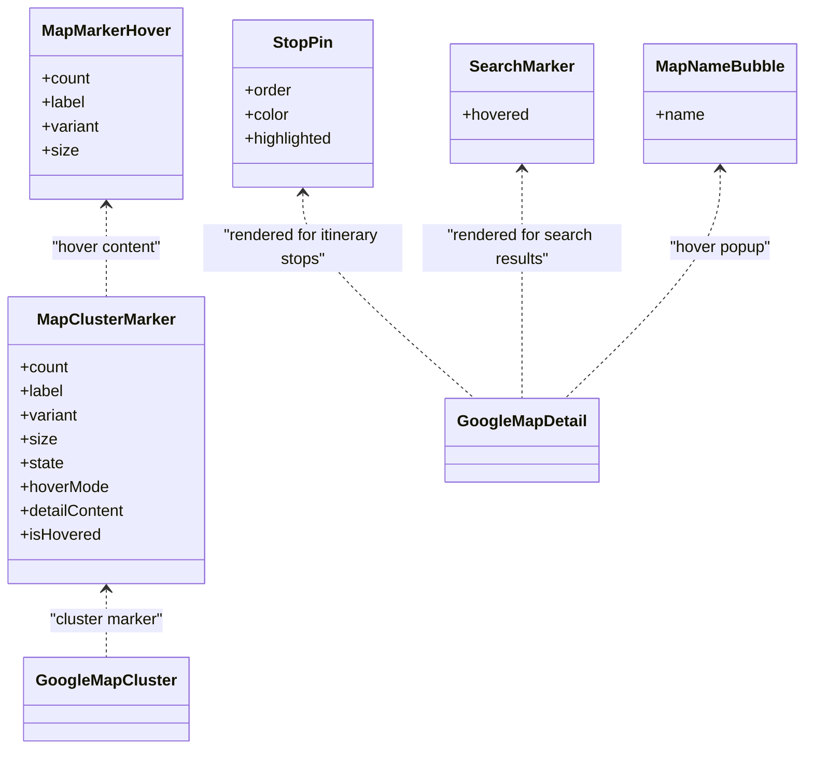

**Diagram sources**
- [GoogleMapDetail.tsx:193-248](file://src/components/ui/map/GoogleMapDetail.tsx#L193-L248)
- [MapNameBubble.tsx:10-25](file://src/components/ui/map/MapNameBubble.tsx#L10-L25)
- [MapClusterMarker.tsx:51-115](file://src/components/ui/map/MapClusterMarker.tsx#L51-L115)
- [MapMarkerHover.tsx:42-78](file://src/components/ui/map/MapMarkerHover.tsx#L42-L78)

**Section sources**
- [GoogleMapDetail.tsx:193-248](file://src/components/ui/map/GoogleMapDetail.tsx#L193-L248)
- [MapNameBubble.tsx:10-25](file://src/components/ui/map/MapNameBubble.tsx#L10-L25)
- [MapClusterMarker.tsx:51-115](file://src/components/ui/map/MapClusterMarker.tsx#L51-L115)
- [MapMarkerHover.tsx:42-78](file://src/components/ui/map/MapMarkerHover.tsx#L42-L78)

### Event Handling and Geocoding-like Search
- MapSearchController listens for request changes and triggers search within the current viewport.
- Results update markers and can be clicked to open details or add to itinerary.
- While not a traditional geocoder, the system performs text and nearby searches that act like reverse/forward lookup over places.

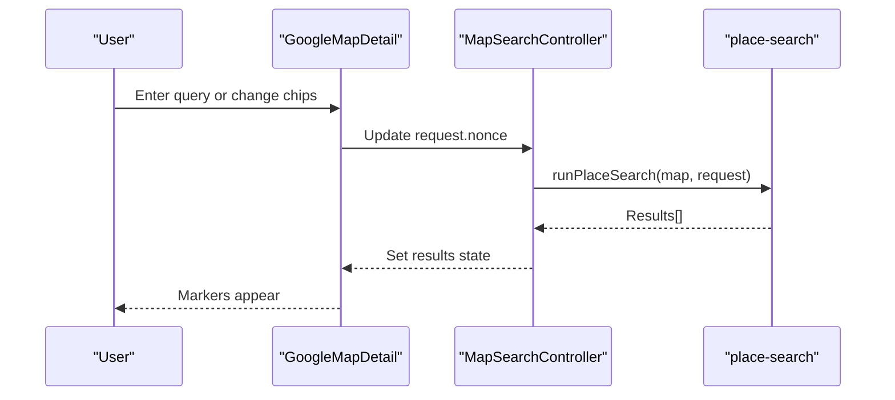

**Diagram sources**
- [GoogleMapDetail.tsx:116-151](file://src/components/ui/map/GoogleMapDetail.tsx#L116-L151)
- [place-search.ts:391-466](file://src/lib/maps/place-search.ts#L391-L466)

**Section sources**
- [GoogleMapDetail.tsx:116-151](file://src/components/ui/map/GoogleMapDetail.tsx#L116-L151)
- [place-search.ts:391-466](file://src/lib/maps/place-search.ts#L391-L466)

### Rate Limiting Strategies and Caching Mechanisms
- SKU-aware calls: The code always requests Enterprise fields to consolidate billing into one call, minimizing redundant requests.
- Radius capping: Nearby search radius is bounded to prevent overly large queries.
- Result limits: Max results capped to reduce payload size and API load.
- React Query caching: useMapClusters caches cluster data with staleTime to avoid frequent refetches.
- IntersectionObserver: Maps are only loaded when visible, reducing unnecessary API usage.

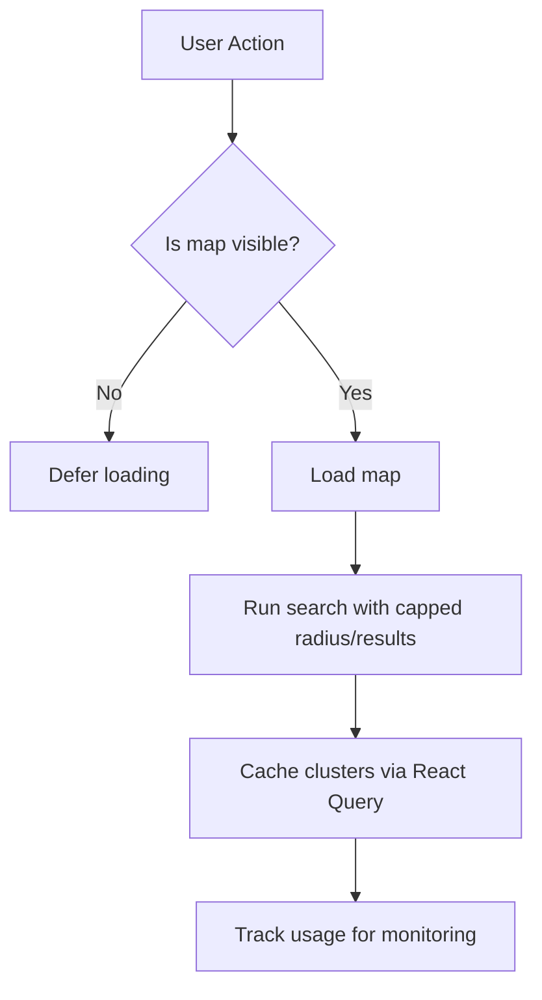

**Diagram sources**
- [place-search.ts:137-143](file://src/lib/maps/place-search.ts#L137-L143)
- [useMapClusters.ts:43-53](file://src/hooks/useMapClusters.ts#L43-L53)
- [MapContainer.tsx:47-54](file://src/components/ui/map/MapContainer.tsx#L47-L54)
- [maps.ts:41-56](file://src/lib/api/maps.ts#L41-L56)

**Section sources**
- [place-search.ts:137-143](file://src/lib/maps/place-search.ts#L137-L143)
- [useMapClusters.ts:43-53](file://src/hooks/useMapClusters.ts#L43-L53)
- [MapContainer.tsx:47-54](file://src/components/ui/map/MapContainer.tsx#L47-L54)
- [maps.ts:41-56](file://src/lib/api/maps.ts#L41-L56)

### Fallback Patterns When Google Maps Services Are Unavailable
- Graceful empty states: If no locations exist, the map centers on a default coordinate and zooms appropriately.
- Error handling in search: Errors are caught and logged; results are cleared and loading state reset.
- Optional features: Gesture handling can be disabled to prevent unexpected interactions when the map is non-interactive.

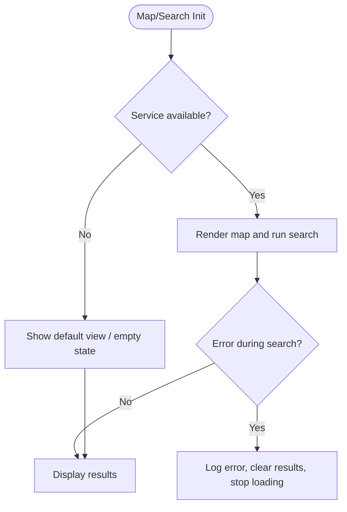

**Diagram sources**
- [GoogleMapDetail.tsx:27-54](file://src/components/ui/map/GoogleMapDetail.tsx#L27-L54)
- [GoogleMapDetail.tsx:126-151](file://src/components/ui/map/GoogleMapDetail.tsx#L126-L151)

**Section sources**
- [GoogleMapDetail.tsx:27-54](file://src/components/ui/map/GoogleMapDetail.tsx#L27-L54)
- [GoogleMapDetail.tsx:126-151](file://src/components/ui/map/GoogleMapDetail.tsx#L126-L151)

### Mobile Responsiveness Considerations
- Dynamic loading: Maps are only loaded when in view to save bandwidth and CPU on mobile.
- Gesture control: Non-interactive mode disables scroll/drag to avoid conflicts with page gestures.
- Compact hover: Name bubble variant reduces heavy DOM on small screens.
- Responsive sizing: Container height and className allow flexible layouts.

**Section sources**
- [MapContainer.tsx:40-88](file://src/components/ui/map/MapContainer.tsx#L40-L88)
- [GoogleMapDetail.tsx:341-350](file://src/components/ui/map/GoogleMapDetail.tsx#L341-L350)
- [GoogleMapDetail.tsx:391-408](file://src/components/ui/map/GoogleMapDetail.tsx#L391-L408)

## Dependency Analysis
- GoogleMapDetail depends on @vis.gl/react-google-maps for Map, AdvancedMarker, Polyline, and PlacesLibrary access.
- place-search depends on the PlacesLibrary instance provided by the map context and normalizes results.
- StaticMap and GoogleMapCluster depend on APIProvider and theme to select map styles.
- useMapClusters depends on Supabase queries and locality-pins to build clusters.
- All analytics functions depend on Supabase client to record usage.

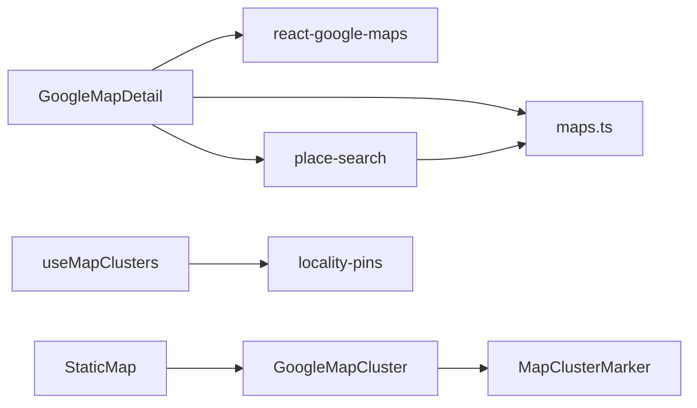

**Diagram sources**
- [GoogleMapDetail.tsx:3-5](file://src/components/ui/map/GoogleMapDetail.tsx#L3-L5)
- [place-search.ts:1-10](file://src/lib/maps/place-search.ts#L1-L10)
- [StaticMap.tsx:3-7](file://src/components/ui/map/StaticMap.tsx#L3-L7)
- [useMapClusters.ts:3-14](file://src/hooks/useMapClusters.ts#L3-L14)
- [maps.ts:1-10](file://src/lib/api/maps.ts#L1-L10)

**Section sources**
- [GoogleMapDetail.tsx:3-5](file://src/components/ui/map/GoogleMapDetail.tsx#L3-L5)
- [place-search.ts:1-10](file://src/lib/maps/place-search.ts#L1-L10)
- [StaticMap.tsx:3-7](file://src/components/ui/map/StaticMap.tsx#L3-L7)
- [useMapClusters.ts:3-14](file://src/hooks/useMapClusters.ts#L3-L14)
- [maps.ts:1-10](file://src/lib/api/maps.ts#L1-L10)

## Performance Considerations
- Lazy loading: IntersectionObserver defers map rendering until visible.
- Viewport-biased search: Limits results to current viewport circle and text query scope.
- Capped parameters: Radius and max results are constrained to reduce network and processing overhead.
- Efficient clustering: Locality grouping reduces marker count for overview maps.
- Theme-aware styling: Avoids reflows by precomputing colors and using CSS classes.
- Minimal DOM: Lightweight name bubbles for hover on resource-constrained devices.

[No sources needed since this section provides general guidance]

## Troubleshooting Guide
- Map not loading: Ensure API key and map IDs are configured; verify environment variables.
- Search returns empty: Check viewport bounds and radius; confirm Places library availability.
- Excessive API usage: Review search frequency and debounce inputs; rely on cached clusters where possible.
- Incorrect pin placement: Validate latitude/longitude values and ensure bounds computation includes all locations.
- Missing details: Some Pro-tier results may require a separate Place Details call; handle enrichment gracefully.

**Section sources**
- [GoogleMapDetail.tsx:126-151](file://src/components/ui/map/GoogleMapDetail.tsx#L126-L151)
- [place-search.ts:155-174](file://src/lib/maps/place-search.ts#L155-L174)
- [maps.ts:41-56](file://src/lib/api/maps.ts#L41-L56)

## Conclusion
The integration leverages a modular, performant design to deliver interactive maps with robust search, clustering, and route visualization. SKU-aware API usage, viewport constraints, and lazy loading keep costs and performance in check. The system supports both detailed itineraries and high-level overview maps while providing fallbacks and analytics for reliability and observability.

[No sources needed since this section summarizes without analyzing specific files]