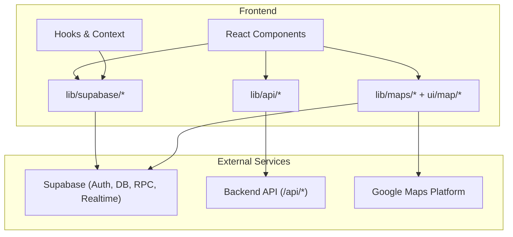
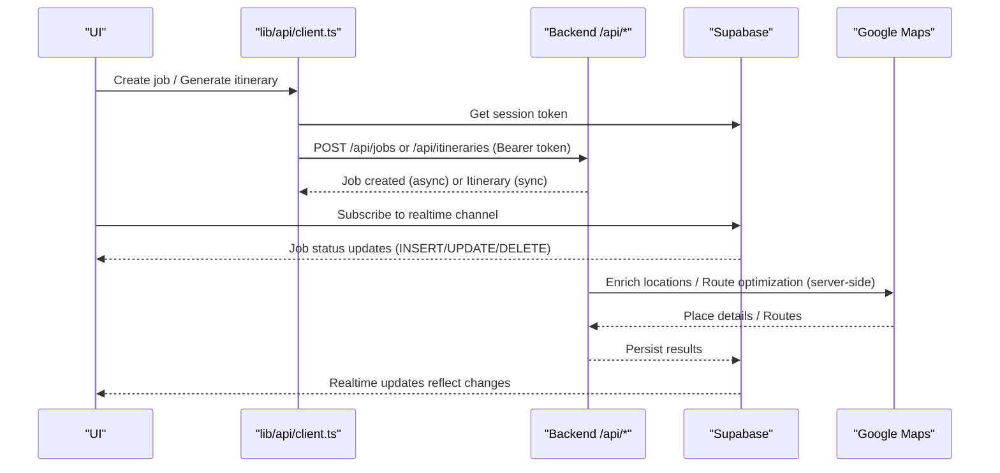
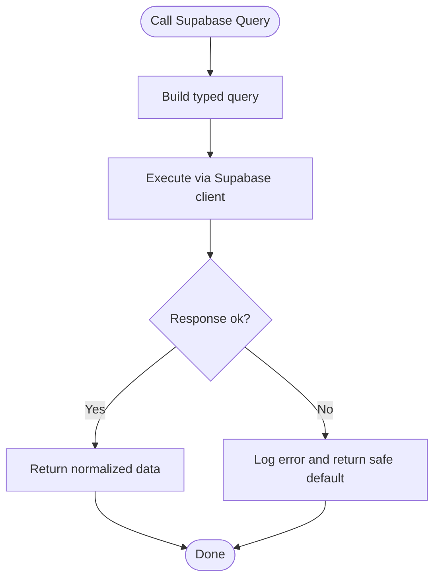
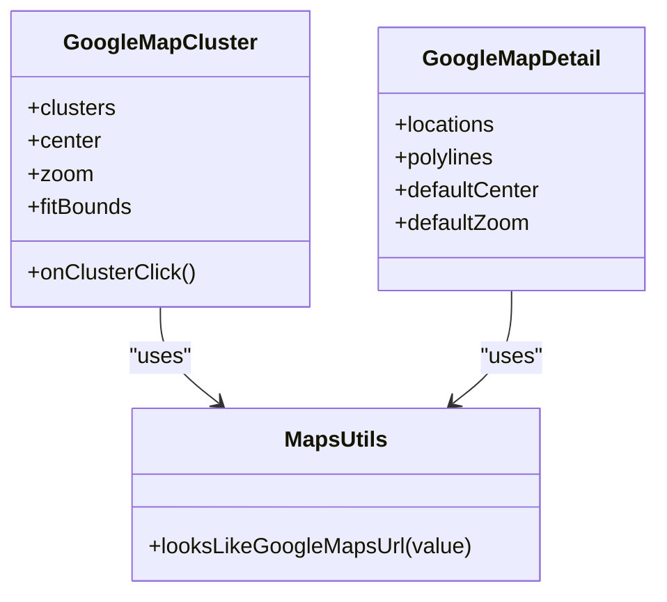
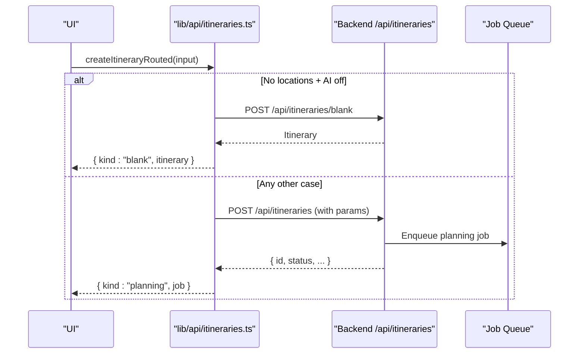
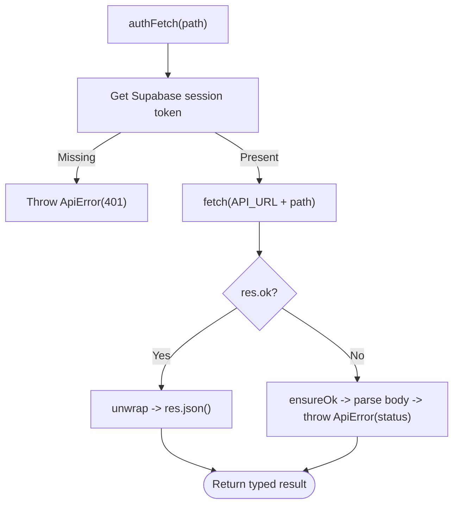
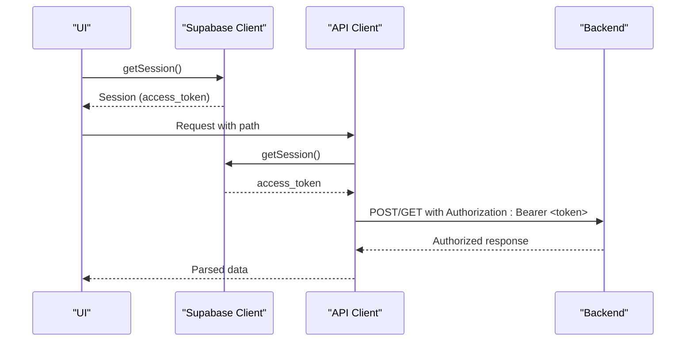
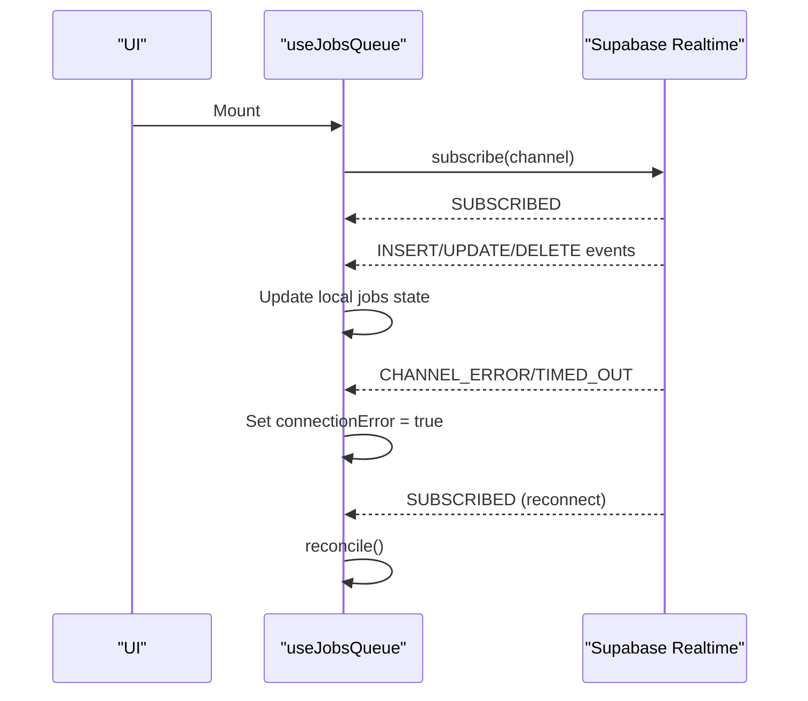
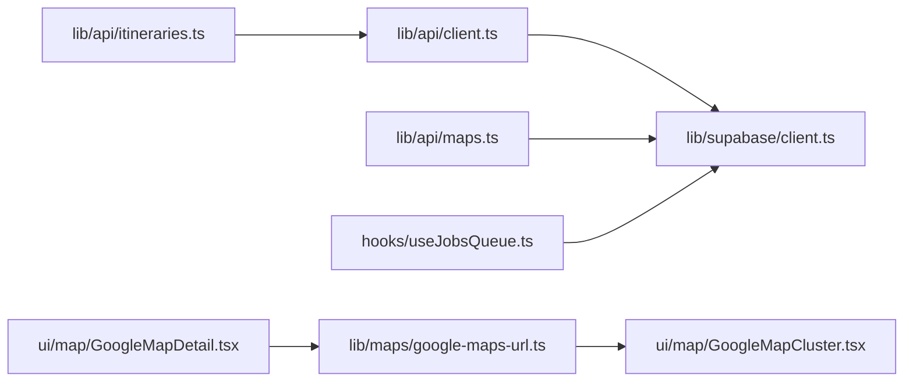

# Integration Patterns

<cite>
**Referenced Files in This Document**
- [client.ts](file://src/lib/supabase/client.ts)
- [queries.ts](file://src/lib/supabase/queries.ts)
- [client.ts](file://src/lib/api/client.ts)
- [itineraries.ts](file://src/lib/api/itineraries.ts)
- [maps.ts](file://src/lib/maps/google-maps-url.ts)
- [maps.ts](file://src/lib/api/maps.ts)
- [GoogleMapCluster.tsx](file://src/components/ui/map/GoogleMapCluster.tsx)
- [GoogleMapDetail.tsx](file://src/components/ui/map/GoogleMapDetail.tsx)
- [useSessionUserId.ts](file://src/hooks/useSessionUserId.ts)
- [useJobsQueue.ts](file://src/hooks/useJobsQueue.ts)
- [password-policy.ts](file://src/lib/auth/password-policy.ts)
</cite>

## Table of Contents
1. Introduction
2. Project Structure
3. Core Components
4. Architecture Overview
5. Detailed Component Analysis
6. Dependency Analysis
7. Performance Considerations
8. Troubleshooting Guide
9. Conclusion
10. Appendices

## Introduction
This document describes the integration patterns used by the Argo platform to interact with external services and APIs, focusing on:
- Supabase for database operations, authentication flow, real-time subscriptions, and usage tracking
- Google Maps API for location services, map clustering, and route visualization
- AI service integration via a backend job system for content analysis and itinerary generation
It also covers error handling strategies, retry mechanisms, fallbacks, authentication and authorization flows, session management, security considerations, client implementations, request/response transformations, caching strategies, rate limiting, monitoring, and debugging techniques.

## Project Structure
The integration surface is organized into focused modules:
- Supabase client and queries for data access and RLS-scoped reads
- API client for authenticated requests to the backend (jobs, itineraries, etc.)
- Maps utilities and components for Google Maps integration
- Real-time hooks for job status updates via Supabase channels
- Auth helpers and password policy enforcement

**Diagram sources**
- [client.ts:1-9](file://src/lib/supabase/client.ts#L1-L9)
- [queries.ts:1-150](file://src/lib/supabase/queries.ts#L1-L150)
- [client.ts:1-156](file://src/lib/api/client.ts#L1-L156)
- [itineraries.ts:1-532](file://src/lib/api/itineraries.ts#L1-L532)
- [maps.ts:1-12](file://src/lib/maps/google-maps-url.ts#L1-L12)
- [maps.ts:1-119](file://src/lib/api/maps.ts#L1-L119)
- [GoogleMapCluster.tsx:174-180](file://src/components/ui/map/GoogleMapCluster.tsx#L174-L180)
- [GoogleMapDetail.tsx:341-374](file://src/components/ui/map/GoogleMapDetail.tsx#L341-L374)
- [useSessionUserId.ts:1-19](file://src/hooks/useSessionUserId.ts#L1-L19)
- [useJobsQueue.ts:244-272](file://src/hooks/useJobsQueue.ts#L244-L272)

**Section sources**
- [client.ts:1-9](file://src/lib/supabase/client.ts#L1-L9)
- [queries.ts:1-150](file://src/lib/supabase/queries.ts#L1-L150)
- [client.ts:1-156](file://src/lib/api/client.ts#L1-L156)
- [itineraries.ts:1-532](file://src/lib/api/itineraries.ts#L1-L532)
- [maps.ts:1-12](file://src/lib/maps/google-maps-url.ts#L1-L12)
- [maps.ts:1-119](file://src/lib/api/maps.ts#L1-L119)
- [GoogleMapCluster.tsx:174-180](file://src/components/ui/map/GoogleMapCluster.tsx#L174-L180)
- [GoogleMapDetail.tsx:341-374](file://src/components/ui/map/GoogleMapDetail.tsx#L341-L374)
- [useSessionUserId.ts:1-19](file://src/hooks/useSessionUserId.ts#L1-L19)
- [useJobsQueue.ts:244-272](file://src/hooks/useJobsQueue.ts#L244-L272)

## Core Components
- Supabase client factory for browser-based sessions and typed queries
- Authenticated API client with token injection, response unwrapping, and typed errors
- Itinerary and job orchestration endpoints for AI-driven planning
- Google Maps integration for search, clustering, and route polylines
- Real-time job queue subscription for asynchronous processing

Key responsibilities:
- Securely obtain and attach user tokens to outbound requests
- Normalize and transform responses into domain types
- Track external API usage via Supabase RPCs
- Provide resilient UX under failures with typed errors and retries

**Section sources**
- [client.ts:1-9](file://src/lib/supabase/client.ts#L1-L9)
- [queries.ts:1-150](file://src/lib/supabase/queries.ts#L1-L150)
- [client.ts:1-156](file://src/lib/api/client.ts#L1-L156)
- [itineraries.ts:1-532](file://src/lib/api/itineraries.ts#L1-L532)
- [maps.ts:1-119](file://src/lib/api/maps.ts#L1-L119)
- [GoogleMapCluster.tsx:174-180](file://src/components/ui/map/GoogleMapCluster.tsx#L174-L180)
- [GoogleMapDetail.tsx:341-374](file://src/components/ui/map/GoogleMapDetail.tsx#L341-L374)
- [useJobsQueue.ts:244-272](file://src/hooks/useJobsQueue.ts#L244-L272)

## Architecture Overview
The platform uses a layered approach:
- Frontend components call typed API clients
- API clients authenticate via Supabase session tokens and forward requests to the backend
- Backend orchestrates AI jobs and integrates with Google Maps for enrichment and routing
- Supabase provides persistence, auth, and real-time channels for live updates

**Diagram sources**
- [client.ts:48-83](file://src/lib/api/client.ts#L48-L83)
- [itineraries.ts:101-120](file://src/lib/api/itineraries.ts#L101-L120)
- [useJobsQueue.ts:244-272](file://src/hooks/useJobsQueue.ts#L244-L272)
- [maps.ts:11-33](file://src/lib/api/maps.ts#L11-L33)

## Detailed Component Analysis

### Supabase Integration Pattern
- Client creation: A single browser client is constructed using environment variables for URL and anon key.
- Data access: Typed query functions encapsulate table access, joins, and error logging; they return normalized shapes.
- Authentication: Session retrieval is centralized in the API client to attach Bearer tokens to backend calls.
- Realtime: Channels subscribe to job events, reconcile state on reconnect, and handle connection errors gracefully.
- Usage tracking: RPCs record per-user and global usage for Google Maps SKUs and map loads.

**Diagram sources**
- [queries.ts:14-46](file://src/lib/supabase/queries.ts#L14-L46)
- [client.ts:1-9](file://src/lib/supabase/client.ts#L1-L9)

**Section sources**
- [client.ts:1-9](file://src/lib/supabase/client.ts#L1-L9)
- [queries.ts:1-150](file://src/lib/supabase/queries.ts#L1-L150)
- [useSessionUserId.ts:1-19](file://src/hooks/useSessionUserId.ts#L1-L19)
- [useJobsQueue.ts:244-272](file://src/hooks/useJobsQueue.ts#L244-L272)
- [maps.ts:11-33](file://src/lib/api/maps.ts#L11-L33)

### Google Maps Integration Pattern
- URL validation: Utility checks if a link resolves to a recognized Google Maps host.
- Usage tracking: RPCs count map loads, place searches, autocomplete, and photo renders to attribute costs.
- Map rendering: Clustering component wraps the Google Maps provider and computes view bounds based on cluster spread.
- Route visualization: Detail map renders encoded polylines for routes with layered styling.

**Diagram sources**
- [GoogleMapCluster.tsx:174-180](file://src/components/ui/map/GoogleMapCluster.tsx#L174-L180)
- [GoogleMapDetail.tsx:341-374](file://src/components/ui/map/GoogleMapDetail.tsx#L341-L374)
- [maps.ts:1-12](file://src/lib/maps/google-maps-url.ts#L1-L12)

**Section sources**
- [maps.ts:1-12](file://src/lib/maps/google-maps-url.ts#L1-L12)
- [maps.ts:1-119](file://src/lib/api/maps.ts#L1-L119)
- [GoogleMapCluster.tsx:174-180](file://src/components/ui/map/GoogleMapCluster.tsx#L174-L180)
- [GoogleMapDetail.tsx:341-374](file://src/components/ui/map/GoogleMapDetail.tsx#L341-L374)

### AI Service Integration (Content Analysis and Itinerary Generation)
- Job creation: The API client posts a job with type and payload; special 409 and 402 statuses are mapped to typed errors for immediate UI handling.
- Itinerary generation: Dedicated endpoint accepts parameters including optional AI gap-fill toggles and traveler preferences.
- Public sharing: Endpoints generate and revoke public and invite tokens for shared views.
- Collaboration: Endpoints manage collaborators and permissions.

**Diagram sources**
- [itineraries.ts:406-439](file://src/lib/api/itineraries.ts#L406-L439)
- [itineraries.ts:101-120](file://src/lib/api/itineraries.ts#L101-L120)
- [client.ts:109-145](file://src/lib/api/client.ts#L109-L145)

**Section sources**
- [itineraries.ts:1-532](file://src/lib/api/itineraries.ts#L1-L532)
- [client.ts:1-156](file://src/lib/api/client.ts#L1-L156)

### Error Handling Strategies, Retry Mechanisms, and Fallbacks
- Typed errors: Custom error classes encode structured information (e.g., quota exceeded, already analyzed).
- Response unwrapping: Centralized ensureOk and unwrap normalize HTTP errors and parse JSON safely.
- Quota and conflict handling: Specific status codes (402, 409) are intercepted to present actionable UI states.
- Realtime resilience: Channel subscriptions detect errors/timeouts and reconcile state upon reconnection.
- Analytics safety: Usage tracking RPCs are wrapped in try/catch so failures do not impact UI.

**Diagram sources**
- [client.ts:48-107](file://src/lib/api/client.ts#L48-L107)
- [itineraries.ts:101-120](file://src/lib/api/itineraries.ts#L101-L120)
- [useJobsQueue.ts:244-272](file://src/hooks/useJobsQueue.ts#L244-L272)
- [maps.ts:11-33](file://src/lib/api/maps.ts#L11-L33)

**Section sources**
- [client.ts:1-156](file://src/lib/api/client.ts#L1-L156)
- [itineraries.ts:101-120](file://src/lib/api/itineraries.ts#L101-L120)
- [useJobsQueue.ts:244-272](file://src/hooks/useJobsQueue.ts#L244-L272)
- [maps.ts:11-33](file://src/lib/api/maps.ts#L11-L33)

### Authentication and Authorization Flows
- Session retrieval: Browser client obtains the current session and exposes the access token for backend calls.
- Password policy: Client-side validation mirrors server policy to provide immediate feedback while relying on server enforcement.
- Scoped access: Database queries rely on Supabase RLS; joins enforce ownership without round-tripping userId.

**Diagram sources**
- [client.ts:48-83](file://src/lib/api/client.ts#L48-L83)
- [client.ts:1-9](file://src/lib/supabase/client.ts#L1-L9)
- [queries.ts:50-99](file://src/lib/supabase/queries.ts#L50-L99)
- [password-policy.ts:1-41](file://src/lib/auth/password-policy.ts#L1-L41)

**Section sources**
- [client.ts:48-83](file://src/lib/api/client.ts#L48-L83)
- [client.ts:1-9](file://src/lib/supabase/client.ts#L1-L9)
- [queries.ts:50-99](file://src/lib/supabase/queries.ts#L50-L99)
- [password-policy.ts:1-41](file://src/lib/auth/password-policy.ts#L1-L41)

### Real-Time Subscriptions and Job Status Updates
- Channel subscription: Listens to INSERT/UPDATE/DELETE events for jobs and maintains local state.
- Reconciliation: On SUBSCRIBED after reconnect, the hook reconciles missing updates.
- Error handling: CHANNEL_ERROR and TIMED_OUT set a connection error flag for UI feedback.

**Diagram sources**
- [useJobsQueue.ts:244-272](file://src/hooks/useJobsQueue.ts#L244-L272)

**Section sources**
- [useJobsQueue.ts:244-272](file://src/hooks/useJobsQueue.ts#L244-L272)

### Storage Management and Media Tracking
- Photo rendering triggers usage counters for Google Places Photos SKU via RPCs.
- Place search and autocomplete usage are tracked per user and globally to monitor cost and quotas.

**Section sources**
- [maps.ts:77-119](file://src/lib/api/maps.ts#L77-L119)

## Dependency Analysis
- API client depends on Supabase client for session retrieval and on environment configuration for base URL.
- Itinerary module depends on API client for authenticated requests and defines domain-specific error types.
- Maps utilities depend on Supabase RPCs for usage tracking and on Google Maps provider for rendering.
- Realtime hook depends on Supabase channels for live updates.

**Diagram sources**
- [client.ts:1-156](file://src/lib/api/client.ts#L1-L156)
- [client.ts:1-9](file://src/lib/supabase/client.ts#L1-L9)
- [itineraries.ts:1-532](file://src/lib/api/itineraries.ts#L1-L532)
- [maps.ts:1-119](file://src/lib/api/maps.ts#L1-L119)
- [maps.ts:1-12](file://src/lib/maps/google-maps-url.ts#L1-L12)
- [GoogleMapCluster.tsx:174-180](file://src/components/ui/map/GoogleMapCluster.tsx#L174-L180)
- [GoogleMapDetail.tsx:341-374](file://src/components/ui/map/GoogleMapDetail.tsx#L341-L374)
- [useJobsQueue.ts:244-272](file://src/hooks/useJobsQueue.ts#L244-L272)

**Section sources**
- [client.ts:1-156](file://src/lib/api/client.ts#L1-L156)
- [client.ts:1-9](file://src/lib/supabase/client.ts#L1-L9)
- [itineraries.ts:1-532](file://src/lib/api/itineraries.ts#L1-L532)
- [maps.ts:1-119](file://src/lib/api/maps.ts#L1-L119)
- [maps.ts:1-12](file://src/lib/maps/google-maps-url.ts#L1-L12)
- [GoogleMapCluster.tsx:174-180](file://src/components/ui/map/GoogleMapCluster.tsx#L174-L180)
- [GoogleMapDetail.tsx:341-374](file://src/components/ui/map/GoogleMapDetail.tsx#L341-L374)
- [useJobsQueue.ts:244-272](file://src/hooks/useJobsQueue.ts#L244-L272)

## Performance Considerations
- Batch operations: Use upsert and bulk selects where possible to reduce network calls.
- Caching strategy: Leverage React Query or similar cache layers around API calls to avoid redundant requests; reuse computed previews like day legs when available.
- Minimize expensive calls: Prefer enriched payloads from the server to avoid duplicate Google Places calls.
- Realtime efficiency: Reconcile only necessary fields and debounce heavy UI updates during reconnect.

[No sources needed since this section provides general guidance]

## Troubleshooting Guide
- Not authenticated: Ensure Supabase session exists before calling backend; the API client throws a typed 401 when missing.
- Network failures: Transport errors produce status 0; wrap calls with retry logic at the caller level if appropriate.
- Quota exceeded: Handle specific typed errors to prompt upgrades or restrict actions.
- Realtime issues: Monitor channel status; on errors, show a banner and attempt reconciliation on reconnect.
- Analytics noise: Usage tracking RPCs are intentionally fire-and-forget; failures are swallowed to protect UX.

**Section sources**
- [client.ts:48-107](file://src/lib/api/client.ts#L48-L107)
- [itineraries.ts:101-120](file://src/lib/api/itineraries.ts#L101-L120)
- [useJobsQueue.ts:244-272](file://src/hooks/useJobsQueue.ts#L244-L272)
- [maps.ts:11-33](file://src/lib/api/maps.ts#L11-L33)

## Conclusion
The Argo platform integrates external services through well-structured, typed clients that centralize authentication, error handling, and usage tracking. Supabase provides robust auth, persistence, and realtime capabilities, while Google Maps integration is optimized for cost and performance. The AI-driven itinerary pipeline is exposed via a job system with clear status flows and user-facing error handling. Together, these patterns deliver a resilient, observable, and maintainable integration layer.

## Appendices

### API Client Implementations and Transformations
- Authenticated fetch: Retrieves session token and attaches Authorization header; sets Content-Type unless FormData.
- Response normalization: ensureOk and unwrap standardize success/failure paths and JSON parsing.
- Job lifecycle: createJob, retryJob, detachJob encapsulate common job operations with typed error mapping.

**Section sources**
- [client.ts:48-156](file://src/lib/api/client.ts#L48-L156)

### Rate Limiting, Monitoring, and Debugging
- Rate limiting: Enforced server-side; client surfaces quota errors via typed exceptions for UI prompts.
- Monitoring: Supabase RPCs track per-user and global usage for Google Maps SKUs and map loads.
- Debugging: Centralized error logging in queries; channel status flags in realtime hooks; explicit typed errors for predictable handling.

**Section sources**
- [maps.ts:11-119](file://src/lib/api/maps.ts#L11-L119)
- [queries.ts:14-46](file://src/lib/supabase/queries.ts#L14-L46)
- [useJobsQueue.ts:244-272](file://src/hooks/useJobsQueue.ts#L244-L272)